# 宏观经济与产业结构

（本）内阁府经济社会综合研究所 策划·主编

#

# 宏观经济与产业结构

版主 编：深尾京司

中文版编译委员会

主任：金鹏辉副主任：冯润祥 张丽红 葛 俊

# 作者简介

（除主编外，均按文章刊载顺序排序职务名称截至2009年4月1日）

# 深尾京司(Fukao Kyoji) 一桥大学经济研究所教授

毕业于东京学经济学部，担任现职前曾任桥学经济研究所副教授等职。

主要著作及论：《外商对直接投资和本经济》（合著，本经济新闻社，2004年)。"Real GDP in Pre-War East Asia:A1934-36 Benchmark Pur-chasing Power Parity Comparison with the U. S.," Review of Income and Wealth,53(3)，2007.（合著）等。

酒卷哲朗（Tetsuro Sakamaki） 内阁府男共同参画局调查课课长  
祝迫得夫（Tokuo Iwaisako） 财务综合研究所总括主任研究官  
冈田惠子(KeikoOkada） 法政大学研究生院政策创造研究科教授  
石井达也(Tatsuya Ishii) 内阁府官房总务课秘书专门官  
宫川努（Tsutomu Miyagawa) 学习院大学经济学部教授  
田中贤治（Kenji Tanaka） 本政策投资银调查部课长  
北坂真一(Shinichi Kitasaka) 同志社大学经济学部教授  
堀雅博（Masahiro Hori) 内阁府经济社会综合研究所主任研究官  
樱井宏二郎（Kojiro Sakurai) 专修学经济学部教授  
元桥一之（Kazuyuki Motohashi) 东京大学研究生院工学系研究科技术经营战略学专攻教授  
中岛隆信（Takanobu Nakajima) 庆应义塾大学商学部教授  
金荣（KimYounggak） 本学术振兴会外国特别研究员，一桥大学创新研究中心  
盐路悦朗（Etsuro Shioji） 桥学研究院经济学研究科教授  
镰田康一郎（Koichiro Kamada) 日本银行金融机构局企画役  
渡部敏明(Toshiaki Watanabe) 一桥大学经济研究所教授

# 研究会和各小组委员会等委员名单

# I研究会委员（除主任外，各委员按日文五十音图排序）

主任 香西泰 日本经济研究中心特别研究顾问伊藤元重 东京学研究院经济学研究科教授井堀 利宏 东京大学研究院经济学研究科教授寺西 重郎 日本大学商学部教授原田泰 和总研常务理事兼席经济学家樋口 美雄 庆应义塾大学商学部教授深尾京司 桥学经济研究所教授堀内 昭义 中央大学综合政策学部教授本间正明 近畿大学世界经济研究所所长吉川洋 东京大学研究院经济学研究科教授

Ⅱ小组委员会委员（除主席外，各小组委员会委员按日文五十音图排序）

# 1分析评价分科会

# 宏观经济、TFP、产业结构和IT小组委员会

主席 深尾京司 一桥大学经济研究所教授祝迫得夫 桥学经济研究所副教授樱井宏二郎 专修学经济学部教授中岛 隆信 庆应义塾大学商学部教授宫川努 学习院大学经济学部教授元桥一之 东京大学研究生院工学系研究科教授

# 货币政策和物价小组委员会

主席 吉川洋 东京大学研究院经济学研究科教授翁邦雄 京都大学公共政策研究生院教授竹田阳介 上智大学经济学部教授宫尾龙藏 神户大学经济经营研究所教授

# 2宏观经济与产业结构

# 渡边努 一桥学物价研究中心教授

# 国际环境小组委员会

主席 伊藤元重 东京大学研究生院经济学研究科教授浦田秀次郎 早稻田大学研究生院亚太研究科教授小川英治 一桥大学研究生院商学研究科教授河合正弘 亚洲开发银行研究所所长富浦英一 横滨国大学研究生院国际社会科学研究科教授

# 不良债权、银行政策和土地政策小组委员会

主席 堀内昭义 中央大学综合政策学部教授池尾和人 庆应义塾大学经济学部教授小川一夫 大阪大学社会经济研究所教授櫻川昌哉 庆应义塾大学经济学部教授深尾光洋 庆应义塾大学商学部教授

# 财政政策和社会保障小组委员会

主席 井堀利宏 东京大学研究生院经济学研究科教授小盐 隆士 一桥大学经济研究所教授加藤 久和 明治大学政治经济学部教授土居丈朗 庆应义塾大学经济学部教授中里透 上智大学经济学部副教授

# 劳动力市场和收入分配小组委员会

主席 樋口 美雄 庆应义塾大学商学部教授阿部正浩 独协大学经济学部教授大竹文雄 大阪大学社会经济研究所教授神林龙 一桥大学经济研究所副教授山本 勋 庆应义塾大学商学部副教授

# 放松管制和结构性问题小组委员会

主席 寺西 重郎 日本大学商学部教授江藤胜 东京经济大学经济学部教授冈崎 哲二 东京大学研究生院经济学研究科教授村松岐夫 学习院大学法学部教授柳川 范之 东京大学研究生院经济学研究科副教授

# 2历史资料小组委员会

# 历史小组委员会

组长 寺西 重郎 本学商学部教授

# 研究会和各小组委员会等委员名单3

冈崎哲二 东京大学研究院经济学研究科教授峰 隆夫 法政大学研究院政策科学研究科教授武田 晴人 东京大学研究院经济学研究科教授福田慎一 东京学研究院经济学研究科教授御厨贵 东京大学先端科学技术中教授

# 历史记述工作组

组长 小峰 隆夫 法政大学研究生院政策科学研究科教授浅井良夫 成城大学经济学部教授石井晋 学习院大学经济学部教授近藤诚 神户学院学经济学部国际经济学科教授中村 宗悦 东化学经济学部现代经济学科教授

# 口述历史工作组

组长 御厨贵 东京大学先端科学技术中教授竹中 治坚 政策研究研究院大学副教授原田泰 和总研常务理事兼席经济学家松岛茂 东京理科学专门职研究院教授

# Ⅲ国际合作研究 顾问

Anil K. Kashyap 芝加哥大学教授David E. Weinstein 哥伦比亚大学教授Koichi Hamada 耶鲁大学教授

# 致读者

本书是系列丛书中的第一卷，汇编了一个研究项目的成果，该项目是根据日本内阁府经济社会综合研究所提出的问题，在许多当代本主要政治和经济科学家和经济学家的参与下，对20世纪80年代后期泡沫经济的形成和破灭以及随后通货紧缩下的经济长期停滞状态进的研究。

我们研究的时期是日本经济政策和各种结构性改革的试错期，这不仅在日本经济史上，而且在其他国家的历史来都是罕见的，其中包含着宝贵的经验。这套丛书的目的是通过根据历史事实准确描述这一时期的经济趋势和政策，对其进行检查和评估，并将反思和教训传递给后世，从而为今后日本的经济发展和经济政策管理作出贡献。

本卷涉及“宏观经济、全要素产率（TFP）、产业结构和信息技术（IT）”等领域，经过这些领域的专家学者们讨论设定课题后，请熟悉每个课题的专业研究人员分析和执笔，编撰了成果。

2008年秋季以来，世界经济受到了金融危机的冲击，其影响导致了严重的持续衰退。

希望本书和这个研究项的结果能成为重新考虑本经验和教训的机会，并帮助化解当前的困境。很兴能为关于防止泡沫破灭和尽量减少随后的经济停滞所需的政策措施的讨论作出贡献。

最后，借此机会对参与本项目以及各卷撰写工作的100多位专家学者和研究员表示感谢，再次感谢他们所给予的合作和持。

# 写在《泡沫/通缩时期的本经济与经济政策》出版之际

对于日本来说，在战后60年的历史进程中，第二次石油危机之后的四分之一个世纪是一个动荡的时期，在此期间日本不仅接受了全球化的洗礼，经济和社会也发生了构造性的转变。从泡沫的形成和破灭再到随后“失去的十年”，在出这一系列的困境之前，为能够使宏观经济形势和经济政策回归正常，日本经济经历了一系列艰苦的努力。这一时期的一系列经验，包括宏观经济政策和各种结构性改革，可以说是一部政策试错的历史，这不仅在日本经济史上，而且在其他国家的历史上都是罕见的，其中包含了对后世的宝贵经验。

基于这一认识，日本内阁府经济社会综合研究所一直在开展“泡沫和通货紧缩时期的日本经济和经济政策研究”，目的是准确描述从泡沫的形成和破灭再到随后通货紧缩的发生和克服这四分之一个世纪的经济趋势和经济政策，并根据事实进检查和评估，将反思和教训传递给后人，以利于未来的经济政策管理。

具体而，2007年1月起，在经济社会综合研究所成的编辑委员会下成立了一个研究会，主要由外部专家组成（见附录研究机制和成员一览），讨论需要解决的问题，并将研究成果汇编成以下三大部分。

●分析和评价部分：分析研究期间发生的经济现象的原因和后果的机理，组织关于各种政策的内部和外部辩论，并从学术和分析角度对政策进评价。

●历史部分：描述了自20世纪80年代以来的日本经济状况，以及基于事实的各种政策概述。此外，编制了一份按时间顺序的年表和相关文件汇编，并将对相关期间参与政策制定的决策者（包括委员会等决策过程的参与者）和社会各界人士（企业主等）进行访谈，并编写口述历史。

●国际合作研究部分：公开邀请国内外研究人员提出研究主题，根据最新的理论和分析方法分析本的泡沫、通货紧缩和经济长期停滞现象。举国际会议，讨论世界应该从日本的经验中吸取的教训。

# 2宏观经济与产业结构

这套丛书的的是将上述“分析和评价部分”的结果泛提供给公众，从学术和分析的度梳理了本的泡沫和通货紧缩时期。其中，对于存在不同观点和主张的论点，该丛书不偏向任何特定的观点，而是秉持中的编辑方针，直接加以引用。

在此，谨对委员会各位成员和作者的热情讨论和对论的贡献表示最深切的感谢。

如果这本书能在世界经济面对全球金融危机和随之而来的严重衰退时成为参考，我们将不胜荣幸。希望这本书能够鼓励更多积极的讨论和分析，以便我们不会重新陷泡沫的形成和破灭以及通货紧缩等困难局面，或者即使我们陷了这种局面，也能更好地克服这些困难。

泡沫/通缩时期的日本经济与经济政策研究编辑委员会主席内阁府经济社会综合研究所所长岩田一政  
泡沫/通缩时期的日本经济与经济政策研究 编辑委员会前主席东北公益文科大学校长黑田昌裕

# “泡沫/通缩时期的本经济与经济政策研究”

日本内阁府特命主管大臣（主管经济财政政策大臣）与谢野馨

目前，全球融和资本市场正处于动荡状态，可以说是全球经济同时衰退，而日本经济由于出口急剧下降，也被迫陷入严重的衰退。

这一经济和金融危机的导火索是以美国为中心的房地产泡沫的破灭，世界经济不仅需要应对其负面影响所产生的短期危机，还需要“大调整”来克服结构性危机，并在避免经济衰退变得更严重、更长期的同时，寻找实现新增长的途径。

20世纪80年代以来，日本经济先是经历了泡沫的形成和破灭，随后又经历了“失去的十年”，再到现在。这是世界经济史上罕见的经验，对于当今的世界经济状况同样极具借鉴意义。

有鉴于此，日本内阁府经济社会综合研究所一直在开展“泡沫和通货紧缩时期的日本经济和经济政策研究”的研究项目，以记录1980年以来四分之一世纪的日本经济和经济政策趋势，从学术角度进行检查和评估，并将反思和教训传递给后人。除了记录日本罕见的经验本身的重要性外，鉴于目前的经济状况，研究项目的结果被认为对从日本的经验中吸取反思和教训具有重大的历史意义。

如果这项研究能够成为更好理解日本经济的催化剂，进而对迎难而上的世界经济有所启示的话，我将非常高兴。希望本研究的成果能够防止因本次泡沫破灭而引起的经济“触底”，助力实现新的增长。

最后，向所有参与这项研究的研究员和其他相关表衷的感谢。

# 中版前

《泡沫/通缩时期的本经济与经济政策》是由本内阁府经济社会综合研究所牵头，邀请数百名日本权威经济学家撰写而成的系列丛书，共七册，旨在记录、汇总和分析20世纪80年代到21世纪初近三十年的日本经济环境变化、结构调整、政策应对及其得失等。

20世纪80年代，日本经济、财政、金融以及社会保障等领域都经历了很大波动。本书还原了这一时期的日本经济状况和经济政策，论述深入浅出，分析角度全面，为我们提供了很多新的研究视角。目前，中国经济面对全球经济滞胀、国际政治经济环境不确定性、国内经济结构调整压力，经济增速下滑、人口老龄化少子化等严峻现实，与20世纪80年代后日本处境较为相似。

他山之石，可以攻玉。通过研读日本权威经济学家的深度分析，对于思考和理解中国当前的经济金融问题具有参考价值。本经济在《广场协议》后，在时间序列上，体现为日元汇率升值，外贸出口下降，随后五年内实行了扩张性宏观经济政策，地产、股票等资产价格飞涨，泡沫经济极度膨胀，最后泡沫破灭，房地产市场价格大幅度下跌，由此，开始了长期持续的经济衰退。日本泡沫经济崩溃后，其经验教训经国内外媒体和学者广泛传播及研究，尤其是其金融改革问题，形成诸多研究成果。但本书对于日本当时宏观经济金融政策和产业政策方面的经验教训，提供了更多的数据分析和细节阐述，部分研究成果丰富和拓展了我国长久以来对于本泡沫经济形成及破灭方式和对日本影响形成的历史认识。日本银的改革和创新性政策理念与实践，以及其对欧美货币的政策主张，对我国货币政策运作有一定借鉴意义。

金融要服务实体经济，推动金融资源精准配置到经济社会发展关键领域和薄弱环节是我国宏观金融从业人士的重要使命。《泡沫/通缩时期的日本经济与经济政策》的深度分析也可为中国政府高度重视的经济社会总体发展规划和可持续发展战略提供借鉴。

中国人民银上海总部国际部在获得本内阁府经济社会综合研究所对此套丛书中文版不以营利为目的出版的授权后，组织译印了第三册《国际经

# 2宏观经济与产业结构

济环境的变化与本经济》和第四册《不良债权与融危机》，受到专家学者的泛好评。后续成套译印作获得孙冶方经济科学基金会的大力支持。此外，部分丛书中文版由本央工作人员和多位本专家对照原稿审校，提高了本书内容的准确性和权威性，也是中两国央合作的成果。这套丛书值得宏观经济管理人员、金融从业人员细细品读；当然，对于长期研究日本问题的国内专家学者以及校研究员也值得读。

# 中版序

在本丛书所涵盖的“泡沫和通缩时期”（从20世纪80年代中期到21世纪初期），日本经济经历了前所未有的巨大波折。先是日元大幅度升值，然后是地产、股票等资产价格飞涨和泡沫经济的极度膨胀，最后随着泡沫瞬间破灭，日本经济陷入超过十年的长期萧条。因此，这一时期就成为现代日本乃至世界经济史上具有标志性意义的节点，而研究这20来年日本经济发展的起伏变化和日本当局政策应对的得失，更是日本乃至国际经济界和学术界经久不衰的热门话题。

这一时期起始于1985年。当年9月，经过长时期的艰难谈判，法国、联邦德国、日本、英国、美国“五国集团”在纽约的广场饭店签订协议，约定通过它们的协同行动，实现日元、德国马克等“非美元货币对美元的有序升值”，以纠正美元高估和全球金融系统失衡。《广场协议》签订以后，美元对日元的汇率迅速从1美元兑250日元左右上升到1美元兑200多日元；1986年1月，又突破《广场协议》谈判时日方认为可以接受的200日元，并继续奔向战后汇率的新高点。

这时，日本当政者受到两方面的压力：一方面，作为日本经济支柱的汽车、家用电器、半导体等出口产业认为，日元升值将会损害本产业的出口竞争力，因而表现出对自民党政府支持日元升值的不满。同时，日本许多媒体也跟风对日本政府支持日元升值政策进行声讨。反对党和自民党内的升值反对派政治活动家甚至企图利用这种情势把时任首相中曾根赶下台。另一方面，《广场协议》生效后，美国继续对本施加压力，要求后者承诺通过扩大内需来降低仍然居高不下的日方经常账户顺差和美方经常项目逆差。

面对国内外的压力，中曾根首相邀约18位资深官员和经济学家成立了他的私人咨询机构“为实现国际协调的经济结构调整研究会”，为他提供应对时局的政策建议。由于这个研究会是由日本中央银行（日本银行，以下简称日银）前长前川春雄担任会长的，所以又被通称为“前川研究会”，其为中曾根提供的策论报告也被称为《前川报告》。虽然这份报告1986年47才正式发布，但在此前5个月紧锣密鼓的研讨过程中，它的基本内容已经被日本政府的领导层所接受，成为经济政策的指导方针。

这针的核心内容，是实现由出口导向到内需主导的“结构转换”，以便满美国对本提出的要求和安抚本国内的不满。为了扩内需，《前川报告》要求“财政融应承担起重要责任”。于是，银和藏省闻风动。从1986年1月到1987年2月，日银5次下调中央银再贴现率，从 $4 . 5 \%$ 下调到历史最低水平的 $2 . 5 \%$ 。这个超低利率直保持到1989年5月。1986年7再次当选相的中曾根改组内阁，任命贯批判《场协议》、诩为凯恩斯主义者的宫泽喜为藏相。随后，本政府在1987年5推出了“紧急经济对策”，以5万亿元的公共投资加1万亿元的减税进强度的财政刺激。

在空前未有的扩张性宏观经济政策的推动下，地产、股票等资产的价格迅速上升。据本政府公布的数据，1986年末东京都市圈土地价格上年末上涨 $2 3 . 8 \%$ ，1987年进一步上涨 $6 5 . 3 \%$ 。到1989年底，本全国土地价格总额达2400万亿元，是当时本GDP的6倍，也是国面积达本26倍的美国全国地价格总额的2.9倍。经平均股价在《场协议》签署的前个交易（1985年920）只有12666点，1987年2初就涨到2万点，1988年12月突破3万点，一年后的1989年末达到创历史纪录的38915点。仅仅4年多的时间股价达到之前的3.1倍。

早在1987年就有本有识之指出地价和股价“烧不退”只是虚幻的“泡沫”。但是，当时本多数都沉浸在均GDP已经超过美国、1991年甚达到美国均GDP增长 $1 5 1 \%$ 的“日本第一”的乐观氛围之中，没有人理会这警示。加之习惯上作为通货膨胀表征的消费物价指数（CPI）持续稳定在 $1 \%$ 左右的低平上，这就使宏观当局更加认为完全没有必要实将会拖累GDP增长的紧缩政策。直到1989年年中，有关当局才取得共识，决定进政策调整。银从1989年531到年末三次调整利率，把中央银贴现率从 $2 . 5 0 \%$ 提到 $3 . 7 5 \%$ 。1990年开年时，本舆论还认为本经济仍将沿袭过去5年的成功路径，以实现GDP的速增长和资本市场的兴旺发达。然，当年14，新年第个交易，东京股市就突然崩盘，元也开始暴跌，接着来的是1991年地价势不可挡地滑落。由此，开始了长期持续的经济衰退。

们对于20世纪80年代后期本经济“其兴也勃焉，其亡也忽焉”的幅度波动提出的核问题是：什么原因造成了融市场的崩溃和长期持续的经济衰退。对此，本经济界和经济学界直存在不同的观点。

从学术观点着眼，本丛书第卷《宏观经济与产业结构》主编深尾京司教授把不同的见解大致区分为两类：一类按照凯恩斯主义的理论，侧重于有效需求不等需求侧的因素；另一类则侧重于全要素生产率（TFP）降低等供给侧的因素。

从政策角度着眼，也可以把不同的观点大体区分为两类：一类观点是，日本接受《广场协议》以及随之而来的日元升值，是导致日本经济衰退的基本原因。另一类观点则认为，日本“失去的二十年”发生于《广场协议》签订5年之后，其间隔着一个资产泡沫的急速膨胀，而资产泡沫的急速膨胀，又只能归因于宏观当局对日元升值的过度反应。长时期地实施极度宽松的宏观经济政策，使得靠高杠杆支撑的资产价格急速上涨和泡沫经济形成。在他们看来，后来的泡沫爆破以及由此引发的资产负债表危机，其实就发轫于此。

自20世纪90年代以来，世界论坛上出现了量描述和论述这个历史时期日本经济和日本政府经济政策的著作，包括一些具有很高水平的著作，例如曾任美国联邦储备委员会主席的P.沃尔克（PaulVolcker）和本大藏省副相的行天丰雄合著的《时运变迁：世界货币、美国地位与人民币的未来》（1992—2016）、日本中央银行前行长白川方明的《动荡时代：白川方明亲历本经济繁荣与衰退的39年》（2018)。这些著作都对本在20世纪90年代陷入长期衰退的原因作出了精湛的分析，澄清了一些对“日本故事”的错误解读。不过，在有些报刊上，也广泛流传着一些肤浅解读甚至完全违背实际情况的讲述“本教训”的章。

与此同时，在国际论坛上还发表了一些探究在《广场协议》中处于与日本类似地位的联邦德国经济和经济政策的著作。早在《场协议》达成以前的1982年，通过德国联邦议会的“建设性不信任投票”取代社民党一自民党联合政府执政的基民盟/基社盟一自民党联合政府就摒弃了上一任政府采取的凯恩斯主义式的需求导向政策，循着秩序自由主义的路径，实现了社会市场经济的复兴。所以面对西德马克升值的冲击，他们没有采取日本宏观当局实行的那种扩张性宏观经济政策，而是进一步推行供给导向即改善供给环境的政策，包括放松管制、促进竞争、扩大开放、降低社会支出等等。这一系列政策由于激发了市场的经济活力而取得了极大的成功。到1986年末，联邦德国重新回到现代工业国的第一梯队，人均工业增加值全球第一，出口总额也超过美国和本等顶尖国家。1988年和1989年甚至成为20年来经济最繁荣的年代。由于日德两国采取了完全不同的应对策略，结果也大相径庭。

这样，论述联邦德国在《广场协议》后经历的理论著作和历史著作，也成为人们研究日本泡沫/通缩时期经济和经济政策的重要参考文献。

不过，要想更严谨深地研究泡沫/通缩时期本经济和经济政策，不仅要有依据事理的讨论，还需要在掌握充分数据的基础上进细致入微的定量和定性分析，这样才能对纷纭的议论作出无可争议的评判。

为了更通透地了解泡沫和通缩时期的本泡沫经济的形成以及泡沫经济破灭后经济长期停滞的原因和后果，本内阁的经济社会综合研究所于2007年邀集了100多位本主要的政治学家和经济学家开展了项规模的课题研究。课题组用了两年半的时间，对本宏观经济、产业结构、货币政策与泡沫经济、国际经济环境变化对本的影响、不良债权与融危机、财政政策与社会保障、政治经济构架的结构性改革与放松管制路线的进展等重主题进行了深的研究，然后选出一批最重要的研究报告，汇编成皇皇7大册的《泡沫/通缩时期的本经济与经济政策》系列丛书。这套丛书提供了反映相关时期经济发展与政策演变互动的丰富献和量数据，并且运用现代经济学传统的和新开发的分析工具进定性和定量的分析。因此，这套丛书可谓研究这时期本经济和经济政策最重要的参考材料，以及可以从本的经历中汲取经验教训的重要源泉。

中国民银上海总部在孙冶经济科学基会的持下组织量，将卷帙浩繁的丛书在本友的协助下译为中，为我国经济界和学术界更深地进对泡沫/通缩时期本经济和经济政策的研究提供了丰富的信息和资料。

还需要说明的是，我们依托本丛书提供的资料进的研究，不应仅仅局限于本本，而应当把从这项研究中得到的认识和启示运用到更范围中去。

先，本经济在泡沫/通缩时期的大起落经历，对原来被视为常理的主流融危机理论、中央银职能定位以及货币政策标设定提出了值得反思的挑战。

对这挑战，爆发了全球经济界和经济学界场以货币理论和货币政策为重点的大争论。

参与这场争论的有两个主要的派别。

派以美国联邦储备系统（The Federal Reserve System，Fed）领导和美国主流经济学家为代表。他们的观点被称为“美联储观点”（FedView）。这种观点把保持以居民消费者物价指数（CPI）为表征的通胀率低位稳定看作货币政策的基本目标，认为只要中央银行像美联储那样采取稳健的货币政策，就能够避免融危机的发，实现物价平的稳定和长期的经济增长。他们还认为，货币政策不应具有抑制股票、土地等资产价格上涨即泡沫生成的功能，因为则很难预判资产价格上涨是否属于泡沫，再则资产价格泡沫不会带来金融体系动荡，即使出现了资产泡沫，只需要在其破灭后采取充分宽松的货币政策即可防止陷入金融危机。而日本之所以陷入长期衰退，是由于日本银行在货币市场崩盘以后采取扩张性政策措施“太迟和太弱”所致。

另一派以国际清算银（Bankof International Settlements，BIS）的经济学家为代表，被称为“国际清算银行观点”（BISView）。他们强调，中央银行如果只着眼于低通胀这一目标，就可能随着实体经济的繁荣出现债务余额增长和资产价格飙升，并随着必不可免的资产泡沫破灭导致严重的经济衰退和通货紧缩，其后果不是下调利率所能解决的。因此，货币政策不仅要针对CPI的走势，而且要对资产价格的上涨和由高杠杆率造成的不良债权积累保持警惕。货币政策应当及时进“逆风操作”(leaning against the wind policy）以防止资产价格的过度膨胀。同时，要对金融业实施审慎性监管规则，防止与杠杆率高踞伴生的不良债权累积导致资产负债表危机的发生。

在本，也有一些论者认同美国主流学者的观点，批评本宏观经济当局对资产市场崩盘和通货紧缩应对不力，但是不少日银领导人（如日本银前行长白川方明）和资深经济学家（如知名经济学家吉川洋，他也是本丛书第二册《通缩经济与货币政策》的主编）并不认同FedView。他们着重指出，日本经验给货币政策带来的最大教训，乃是资产泡沫是对宏观经济最严重的威胁，因而必须尽一切努力加以避免。中央银行的基本职责应该是协同金融监管机构创造和维护一个价格稳定和金融体系稳定的良好金融环境，而不能局限于保持消费者物价指数（CPI）的低位稳定。并且，把讨论的重点放在泡沫破灭之后如何应对上，完全没有抓住问题的要领。事实上，不断膨胀的巨型泡沫早晚会爆裂，而在泡沫经济破灭以后如何应对才好，是很难有万全之策的。因此，关键在于防止泡沫经济的形成。这才是中央银行和货币政策需要更加关注的问题。而日本银行对世纪之交日本经济衰退的应对是否比美联储对从次贷危机开始的国际金融危机的应对更加软弱无力，也是一个存在争议、有待辨明的问题。

不过在当时，由于美国主流经济学家和美联储在全球居于主导地位，BISView被视为异端邪说，一直到2007年次贷危机爆发，特别是21世纪20年代初以CPI飙升为表征的通货膨胀浮出水面以后，FedView才遭到较多的质疑，并引起对货币政策和中央银行职能等的反思。之后虽然稍稍出现了修正通货膨胀目标制的势头，但很快似乎又消退了，至今学术界也没有形成共识。然而，这个问题意义重大，避免对货币政策和日本经验的误读无论对于中国经济还是对于世界经济都是命运攸关的。

在我国，虽然许多学者和政策制定者对本经验做了很多很好的研究，

# 6宏观经济与产业结构

但些书刊上也不时出现些通过主流宏观经济学视来解释“本教训”的偏向。而本泡沫/通缩时期的经济和经济政策其实恰恰表明，主流宏观经济学的某些观点特别是关于货币政策的基本思维方式和分析框架，比如是否应该单一地追求用CPI衡量的通胀目标，是需要重新审视的。

本书第二册《通缩经济与货币政策》汇集了12篇“泡沫/通缩时期本经济和经济政策课题组”关于货币政策的重点研究报告。这些研究报告不仅泛搜集和细致梳理有关货币政策讨论的历史献和各个学派的学术成果，而且进了深入的分析论证，为我们进一步探讨有关理论和政策问题提供了丰富的经验数据和思想材料。

其次，对于本经验的研究还能给我们的理论研究和政策选择带来有助益的启示。

作为一带邻国的中国和日本在平进的历史过程有不少类似的地方。这不但在古代是如此，即使在近代，在经济体制、产业政策、外贸路线、宏观经济状况等方面常常不时出现某种程度的重合。由于两国在发展过程中常常会遇到相似的挑战，本过往的经验和教训就对中国处理的问题有很大的借鉴意义。

一直以来，在讨论中国经济问题时，人们就常常会引用日本的实例来为观点的正当性作出论证。例如，在20世纪80年代讨论中国应当实施什么样的产业政策，世纪之交讨论如何对待泡沫经济，21世纪初期讨论是否应当坚持中央银对外汇市场的干预、保持人民币低汇率以促进出口等场合，持有不同意见的学者往往都以对本做法利弊得失的理解作为论的前提。在这种场合，他们的理解是否符合实际就成为判断他们的论断是否成的关键了。

我印象最为深刻的是21世纪初期关于汇率改的那场争论。

2005年，中国进了汇率形成机制的重改革，实以市场供求为基础、有管理的浮动汇率制度，向中央银行不再对外汇市场进常态化干预迈出了重要的一步。改革的第一天，人民币对美元的汇率从8.27元一次性升值$2 , 1 \%$ 到8.11元。在进这次改之前和之后，国内对改革的正当性存在截然相反的意见。些不赞成中央银逐步取消对汇市的常态化预和反对民币升值的论者以中的“本教训”作为主要论据，认为本的重失误就在于屈从于美国的压，签署了《场协议》并听任元升值，造成了本的长期经济衰退。另些论者断然否定这种说法。他们指出，《场协议》作出的安排有利于纠正国际货币体系的失衡状态，也有利于推动本进强化竞争的市场化改；本20世纪90年代爆发经济危机，则是源于日本宏观经济当局企图用极度扩张的财政货币政策维持景气，推动了资产价格暴涨，最后以泡沫必不可免的破灭和日本陷入资产负债表危机告终。我本人倾向于后一种意见，但我很想知道日本有关专家的看法。所以，2008年我受日本东京基金的邀请在一个讨论会上演讲时，曾经向主持会议的青木昌彦教授请教求证。青木教授没有正面回答我的问题，而是让我去征询我那次讲演的评论人、《广场协议》谈判时任大藏省国际融局长（1986年任大藏省副相）的日方主要谈判代表之一行天丰雄先生的意见。行天先生对我的提问直截了当地回答说，前一种说法是不对的。日本陷于“失去的十年”，并不是源于《广场协议》和元升值，而是由本有关当局宏观经济政策应对失当造成的。

老实说，当我听到行天的回答时，我是感到相当吃惊的。因为我早就知道，当年在进行《广场协议》的谈判时负责谈判的日方主体机构大藏省采取了“步一步来”的拖延策略来抵挡美提出的应当尽快放开对融市场管制的要求。作为大藏省派出的谈判代表，行天当时也是按照派出机关的主张来与美方过招的。因此，他的观点变化就显得有些突。后来我读到行天和沃尔克合著的《时运变迁：世界货币、美国地位与人民币的未来》一书时，才知道他的思想变化并不是一时的心血来潮，而是在1986年深入了解日本政策变化的社会政治背景和强势日元对日本经济发展的积极影响之后经过深思熟虑得出的结论。

因此，有了这一套丛书提供的大量资料，我们就更有把握对一些长期争论不休的公案作出切合实际的结论，并对适宜的经济政策作出明智的选择。

值得一提的是，在阅读这套丛书的过程中，有一个新的、在当代中国文献中也经常出现的“大词”吸引了我的注意。这就是日本以“强化竞争、放松管制”为主要内容，“旨在摆脱过去基于政府干预的经济体系”的“结构性改革”。本丛书用整个第七册外加散见于其他各册的大量篇幅，既深讨论了进行这一改革的历史缘由，也在行政和财政改革、就业政策、公司治理结构、强化竞争政策、放松对航空业和金融业的管制、实现邮政等“公社”（即国有企业）的民营化等具体方面，详细分析了改革的进程、实际效果和存在的不足。

在对日本的结构性改革和我国2015年提出作为经济工作主线的“供给侧结构性改革”进行比较时需要注意的是，两者在历史背景和具体内容上存在不少区别。而且，日本的这项改革虽然从中曾根首相开始经历了多位首相的大力推行，但由于旧思维定式和既得利益的阻滞，也显得困难重重，并没有取得预期的效果，以致安倍晋三在2012年再次担任首相时，把进行结构性改革列为他著名的“振兴本经济三箭”的第三箭，后来这箭甚取得了较之前两支（扩大货币供应和扩张性的财政政策）更明显的成效。不过无论如何，中两国各提出的结构性改革，在改革制度架构和监管体系这一点上还是存在交集的，因论本的成功经验还是失败教训都能为我们提供有益的借鉴。

最后，由于知识背景、写作习惯等因素的影响，不同国家甚至同一国家的不同群体在使用同一个术语时，内涵也往往差别很大。例如按照经济学定义，inflation是指物价总水平的持续上升，相应地，deflation则是指物价总水平的持续下降。但是川明在《动荡时代：川明亲历本经济繁荣与衰退的39年》一书中提到，当时许多本国民、企业家和媒体常常从一般意义上把deflation理解为景恶化或企业业绩不佳，所以当使用该词时，企业经营者表达的意愿是希望出售的商品或服务的价格上涨，而与政府意在提物价总平的政策取向相矛盾，因招致了舆论上的混乱，甚至影响了政策的势。在中国，把inflation和deflation译为“通货膨胀”和“通货紧缩”也招致了某些误读。这就要求我们在对各国不同的发展路径和经济政策进细致的较研究时聚焦到基本问题和基本概念上去。只有在基本概念清晰明确的基础上开展研究，才不致浅尝辄甚误迷途。

总之，由于各个国家的社会化背景不同以及历史渊源和发展阶段的差异，对他国的经验，包括成功的经验绝不能照搬照抄。然而，他国经验中往往又蕴含着某些具有普遍意义的启。只要我们能够认真地进研究和分析，并且根据的条件灵活地加以运，就定能够从中收获使得益的成果。

# 序 宏观经济与产业结构

深尾京司

对于日本经济衰退的原因，即所谓的“失去的十年”或“失去的十五年”，经济学家们一直在争论，有的侧重于劳动力投入下降和生产率冲击等供给方因素，有的则采取凯恩斯主义的观点，侧重于有效需求的缺乏。然而，为了了解日本经济在泡沫和通货紧缩时期的情况，并为未来的宏观经济政策总结经验，似乎必须分析供给方和需求方的因素。供给方因素和需求方因素是相互依存的，很难将两者切割。

例如，在20世纪80年代至90年代，日本面临着潜在增长率和均衡实际利率下降、设备和住房投资不振以及储蓄过剩等问题，其背景是劳动年龄人口增长率明显放缓、由于长期的资本积累主导的增长导致资本过剩和资本收益率下降。一言以蔽之，随着从高增长期向低增长期的过渡，经济中的这些结构性变化使得宏观经济政策的管理变得极为困难。为了应对过剩的储蓄而继续实低利率政策是泡沫经济的原因之一。资本收益率和均衡实际利率的长期停滞也使得本在泡沫经济破灭后难以摆脱衰退和通货紧缩。

相反，需求不振导致的资本设备闲置、失业增加、企业利润停滞，抑制了新资本设备的引进、人力资本的积累和研发，从而抑制了日本整体供给能力的扩张。

有鉴于此，本书试图从需求方和供给方的角度全面分析泡沫和通货紧缩时期的宏观经济。本书还对经济评估和宏观经济政策的评估、从长期角度应使供求相匹配的均衡实际利率的趋势、以及经济波动模式的转变等理解宏观经济很重要的问题进行了分析。

本书的结构如下。第一章估算了GDP缺口的演变，它代表了经济的生产能和活动平之间的背离。第二章至第六章分别围绕总需求的组成部分———消费、投资、政府支出（以及整体经济政策）和出口减进口，分析了泡沫和通货紧缩时期的趋势和需求低迷的原因。第七章至第十一章从劳动力供给、技术知识积累、资源分配、全要素生产率等供给方的角度，对日本经济衰退的原因进了思考。最后，第章对从长期度应使供求相匹配的实际利率进了分析，第三章分析了本经济波动的转变。下简单介绍各章中提出的问题和获得的主要结果。

1.20世纪80年代后的GDP缺和潜在增长率，酒卷哲朗

酒卷的论回顾了本潜在GDP和GDP缺的估算法，并使20世纪80年代以来的数据进了估算。潜在GDP的估算法有“产函数法”“基于奥肯定律的法”“使霍德克一普雷斯科特（Hodrick-Prescott,HP）滤波器（以下简称HP滤波器）的趋势的法”和“在般均衡模型中估算的法”等，估算结果因所法异。在估算经济指标时，如果采最常用的产函数法，则GDP缺在泡沫时期是 $4 \%$ ，而后由于经济衰退下降，于1999年变为 $- 5 \%$ 。本的潜在增长率从原来的百分之三点下降到20世纪90年代中期以后的百分之点。可以看出，估算出的缺与主要经济指标密切相关，表明它是衡量经济波动的个有指标。

2.本经济中的消费与储蓄—20世纪80年代后的概观，祝迫得夫、冈田惠子

祝迫和冈的论从命周期假说的度考察了长期均衡的偏离，并根据这观点概述了20世纪80年代以来本的消费波动情况。该论指出，直到20世纪90年代前期，泡沫的破灭导致耐品消费剧烈波动，但对耐品和服务消费的资产效应有限。另，从20世纪90年代后期开始，家庭收和消费相对于整个GDP来说急剧下降。这是因为企业精简员导致家庭收减少，但由于消费的下降幅度没有家庭收，因此在宏观层消费低迷的同时，还出现了储蓄率幅下降的情况。

3.从泡沫期到通货紧缩期家庭预防性储蓄为的变化，井达也

井的论着眼于消费者理作为家庭储蓄的变动因素的影响，聚焦基于预防性动机的储蓄，分析了家庭储蓄为及其变化。分析表明，与未来就业形势有关的风险对储蓄率有显著影响，但其影响从20世纪90年代后期到21世纪有所下降。在与就业有关的指标中，与随着经济周期变化的新职位空缺相，完全失业率对储蓄率的影响更，它反映了更多的结构性因素，这表明失业风险是影响预防性储蓄的个重要因素。另，资产价格波动风险对储蓄率的影响并不明显。

4.设备投资分析趋势与本经济——投资过剩还是投资不，宫川努、田中贤治

20世纪90年代后，本的设备投资增速放缓，但从国际比较的观点来看，设备投资平不定就很低。宫川和中的论在开展实证分析时，考到了以下情况：一直以来设备投资研究都围绕托宾g理论开展的，以理性的企业为前提，而未必合理的“一个模式”的行为可能引发了投资高峰（in-vestment spike)。采Probit估计法对投资峰产的主要原因进分析后的结果暗示了“一个模式”的行为影响的存在。特别是在泡沫破灭之前，设备投资行为的同步性很强，因此对经济波动产生了巨大影响，但近年来这种同步性有所减弱，反倒是现金流的影响力越来越强。

5.日本泡沫期以后的经济预期、经济评估和经济政策发展历程和从当前的角度实施的评估，北坂真一

北坂的论文对泡沫经济时期以后的日本经济状况进行了概述，并对政府的经济预期和经济评估等进行了考察。北坂在对泡沫经济时期以后的宏观概述中，确认了资产价格波动与经济密切相关，并指出在预测和经济评估中要重视资产价格和金融走势。关于政府的经济预期，该论文指出虽然政府正确预测了经济衰退的可能性，但受制于均值回归经济观点，往往较短（乐观）地估计经济衰退期。关于《月度经济报告》中公布的政府经济评估，承认经济衰退的表达（判断）和启动反周期措施几乎是同时作出的。这让人担心，“政府承认经济衰退，意味着必须采取一些应对措施”，这可能会推迟对经济衰退的认定。

6.亚洲的发展与本经济———外需动向、汇率和本的国际竞争，堀雅博

该论文概述了日本经济在泡沫和通缩期内面临的国际经济环境变化，并考察了这些变化对日本经济表现的影响。针对日本为何不能充分利用东亚发展机遇的问题，该论文对宏观进出口函数进行了估算，并根据逐项贸易数据对出口商品按附加价值水平进行了分类，结果表明：（1）亚洲市场快速扩张的机会被日元升值导致的国际竞争力下降所抵消；（2）在泡沫和通缩期内日元居高不下的情况下，日本不仅在低附加值商品上失去竞争力，而且在高附加值商品上也失去了竞争力。

7.劳动力供给、劳动力需求、技术进步和经济增长，樱井宏二郎

樱井的论文研究了从20世纪80年代至今这四分之一世纪的劳动力供给、劳动力需求、技术进步和经济增长。在劳动力供给方面，从数量上看，自20世纪90年代以来，来自劳动年龄人口和劳动力人口的限制加强了，而从质量上看，高学历化使质量有所提高，而非正式化又使质量有所下降。在劳动力需求方面，从20世纪90年代后期开始，经济衰退的恶化导致了劳动力需求的幅下降。自20世纪80年代以来，技术进步和全球化对欧美发达国家的熟练和非熟练劳动力的需求产生了非中性（增加熟练劳动力的相对就业，减少熟练劳动的相对就业）的影响，在本也观察到了这种影响，只是程度有所不同。

8.关于本企业研发资产积累和效益的实证分析，元桥之

元桥的论分析了20世纪80年代以后本企业的研发投资和积累的趋势、研发投资的决定因素以及研发资产的生产率。日本研发资产的积累速度在80年代超过 $10 \%$ ，但在泡沫经济崩溃后下降到百分之四点。最主要的原因是泡沫破灭导致企业财务状况恶化，可以说企业财务的恶化拉低了研发投的速度。另面，对明确考虑研发资产的产函数进估算后发现，泡沫破灭后研发资产的边际产率有所上升，这表明企业将研发活动集中在了盈利能力较强的领域。

# 9.服务行业的生产率，中岛隆信

提高服务业的生产率被认为是拉动本经济的重要条件。但是，常常被认为产率低下的服务业的产率指标并没有得到确，们在开展讨论时都是基于模糊的指标。中岛的论基于对问题的这种认识，针对服务业的产率进了两项分析。第一，假设本处于通货紧缩期，通过简单的模拟，指出泛采的产率指标有可能偏离真实的产率。第，通过反映市场上服务存量估值变化的式重新定义产出，并基于这新定义对产率进模拟分析。结果明确显示，享乐评价法（Hedonic Approach）对通常的服务质量的调整会导致偏差。

10.产率、资源分配和本的增长，深尾京司、荣悫

深尾和的论从供给，特别是从资源分配和产率的度，概述了20世纪80年代以后本的增长和停滞。20世纪90年代初期以来，TFP增长率的下降在相当程度上推动了本经济增速放缓。但是，业间资源分配的变化和企业、厂层面的数据分析的结果显示，20世纪90年代初以来，业间资源分配的变化和每个业内企业间资源分配的低效率并没有导致TFP增长率明显下降。相反，每个业甚每个企业内部的TFP增长率放缓才是整个宏观经济中TFP增长率放缓的主要原因。但是，与其他国家相，本经济的新陈代谢功能在很长段时间内是低迷的。如果产要素在各业之间重新分配，使其边际产品价值相等，GDP就会有相当程度的提。考虑到上述情况，改善资源分配将成为重要课题。

11.产率变动和20世纪90年代以来的本经济，盐路悦朗

盐路的论回顾了本“泡沫时期”“失去的年”及其后的经验，讨论了产率与经济波动的关系。具体，该论对下述先研究的论点进了重新验证：（1）考虑产要素利率的重要性；（2）部门间资源有效分配的重要性。估算结果显示TFP在20世纪90年代以后有所下降，在估算过程中考虑利用率的调整后，其影响在制造业和非制造业中是不同的—在制造业中，TFP下降的结论不变，而在非制造业中TFP的变化会小很多。关于业间资源分配，仅靠生产方的分析不以推动关于什么是理想分配的讨论，这表明根据需求结构，将资源重新分配到生产率增长率低下的行业有时可能是最佳的。

# 12. 日本的均衡实际利率，镰田康一郎

镰田的论文指出估算均衡实际利率的方法多种多样，并介绍了具有代表性的方法，同时通过代入实际数据来估算日本的均衡实际利率。根据所使用的方法和模型，推算出的均衡实际利率水平有相当大的差距，但在1997年到1998年期间，日本的均衡实际利率跌入负值这一点似乎可以通过实证得到证明。但程度最多也就是 $- 1 \%$ ，持续时间也并不是很长。以均衡实际利率评价货币政策立场时，估算值的不确定性是不可避免的。关于这一点，该论文在论述了实时估算误差等问题后，指出均衡实际利率不确定性的削减是有限的，明智的做法是暂时不要过于相信估算值，仅将其作为参考。

# 13.日本经济周期的结构性变化，渡部敏明

渡部的论使用20世纪80年代中期到最近的本内阁府宏观经济致指数（CI），对日本经济周期的结构性变化进行了定量分析。分析结果表明：（1）日本的经济周期在过去25年中出现了两次结构性变化；（2）可能发生在泡沫破灭后的1991年8月和经济复苏速度放缓的2004年8月；（3）确认了前一种结构性变化降低了经济扩张期和衰退期CI的平均增长率，后一种结构性变化进一步降低了扩张期和衰退期CI的平均增长率。

每篇论都在“关于四分之一世纪本经济和宏观经济政策的研究从泡沫的发生和破灭到克服通货紧缩”项目的“宏观经济、全要素生产率（TFP）、产业结构和信息技术（IT）”小组委员会上进行了报告，并由内阁府经济社会综合研究所前所长黑田昌裕、现任所长岩田一政等众多与会者给予了宝贵的意见。此外，担任小组委员会主席的深尾还获得了出席统筹该项目所有小组委员会的研究会（主任为日本经济研究中心特别研究顾问香西泰）和国际合作研究“日本的泡沫、通货紧缩、长期停滞”会议的机会，在了解项目整体趋势的同时，也听取了许多研究人员对本书内容的意见。特此鸣谢。

作为这个小组委员会的主席，给我留下深刻印象的是关于政策评估的分析充满了紧张的氛围。研究人员根据随时获得的包含测量误差在内的宏观指标，分析应该作出怎样的政策评估，为了作出正确的政策评估，又需要哪些宏观指标等。这或许反映了内阁府和日本央行等隶属于决策部门的众多经济

# 6宏观经济与产业结构

学家参与本项的情况。

此外，正如本书第二、第四、第八、第十章所示，与最近欧美的研究趋势相同，许多新型的实证研究通过微观数据进宏观经济相关分析，这点也令印象深刻。

我认为这几点也是本书的特所在。

另一方面，作为主席，我担忧的是与其他小组委员会的关系。“泡沫和通货紧缩”研究会是个项，100多位研究员撰写了70多篇论。本组委员会以“宏观经济”为主题，涵盖了整个研究会，我担与其他组委员会相，本组委员会的研究内容可能涉及的面很，但重点不够突出。此外，由于所有小组委员会都是同时开展工作的，因此很难在本书中充分反映其他组委员会的有趣成果，例如“货币政策和物价”“国际环境”等。

本书以泡沫和通货紧缩时期为对象，但此后本的经验也表明，供给方和需求方两方面的分析都很重要。从2002年至2007年，经济稳步复苏，GDP缺口从 $4 \%$ 下降到O（见本书第章酒卷论），但实际GDP（连锁法）的平均增长率也只有 $2 . 1 \%$ 。这表明扩包括产率在内的供给能对于本未来的经济增长是多么重要。另面，日本的实际GDP在2008年第一季度至2009年第季度的1年内下降了约 $9 \%$ ，主要原因是全球经济危机导致出口迅速下降。可以说，经济评估和宏观经济政策研究的重要性再次得到了肯定。希望本书能对关注本宏观经济的研究员和从业有所帮助。

# 目 录

# 1 20世纪80年代后的GDP缺口和潜在增长率 ·酒卷哲朗 1

1GDP缺口和潜在GDP的概念和估算方法 2  
2基于生产函数法估算潜在GDP和GDP缺口 8  
3估算GDP和GDP缺口的问题. 17  
4未来的课题 21  
附录使用生产函数法估算潜在GDP和GDP缺口的方法. 23

# 2日本经济中的消费与储蓄

-20世纪80年代后的概观 祝迫得夫冈田惠子29  
1 前言 29  
220世纪80年代后的家庭消费动态——概观.. 30  
3 宏观消费与资产价格——时间序列模型下的分析 32  
4“失去的十年”间的家庭收入与消费/储蓄 38  
5结束语 47

# 3 从泡沫期到通货紧缩期家庭预防性储蓄行为的变化

… 石井达也50

1 前言 51  
2现有研究 53  
3 分析方法 56  
4分析结果 64  
5 结束语 69

# 4设备投资分析趋势与日本经济

-投资过剩还是投资不足 宫川努田中贤治721设备投资在日本经济中的重要性

# 2宏观经济与产业结构

2设备投资行为的实证分析与日本经济 76  
3 设备投资是否联动？ 84  
4 投资高峰的决定因素 86  
5未来设备投资分析的课题 97  
补遗 估计数据的制作方法 98

# 5日本泡沫期以后的经济预期、经济评估和经济政策

发展历程和现时评估 北坂真—108

1 前言 109  
2 泡沫期以后主要宏观经济变量的走势… 110  
3政府的经济预期和实际值. 115  
4政府的经济评估和政策应对 120  
5政府的经济规划和中期展望 124  
6 结束语 128  
附表… 130

# 6亚洲的发展与日本经济

# 外需动向、汇率和日本的国际竞争力……堀雅博160

1 前言… 161  
2泡沫与通缩期内的国际经济环境（概述） 162  
3基于宏观进出口函数的外需分析… 172  
4使用贸易数据进行比较优势结构分析 174  
5结束语：总结和启示 186

# 7 劳动力供给、劳动力需求、技术进步和经济增长

樱井宏二郎 188

1 前言… 188  
2劳动力供给和经济增长 189  
3劳动力供给和劳动力需求 212  
4技术进步等和劳动力需求 215  
5 结束语 220

# 8 关于日本企业研发资产积累和效益的实证分析. 元桥一之 225

1 前言 226

2关于研发资本积累及其效率的讨论 227  
3 研发投资的决定因素分析…. 236  
4研发资产对企业效益的影响 245  
5 结束语… 250

# 9服务行业的生产率 中岛隆信256

1 前言：生产率论争之前… 257  
2通货紧缩期零售服务生产率的变化 260  
3消费者满意和服务价格… 269  
4 结束语 277

# 10生产率、资源配置和日本的增长 深尾京司金荣.282

1 前言… …282  
2从供给侧角度看日本的经济增长——与其他发达国家的比较….283  
3跨行业资源配置和生产率 …294  
4企业和机构之间的资源配置和生产率动态 299  
5 结束语 307

# 11 生产率变动和20世纪90年代后的本经济 盐路悦朗 313

1 前言… 313  
2 生产要素利用率和生产率测量——川本(2004）模型介绍…314  
3 TFP 变动和生产要素利用率——理论思考… 317  
4生产率衡量考虑了生产要素利用率的可变性——重新验证 320  
5跨部门资源配置、生产率和需求转移… 328  
6结束语. 332

# 12日本的均衡实际利率 镰田康一郎 334

1 前言 334  
2低通滤波器 335  
3Laubach-Williams 模型及其改进 340  
4 NAILO 和NAIRI … 344  
5 结构性VAR 348

# 4宏观经济与产业结构

6 DSGE模型 353   
7均衡实际利率的不确定性 358   
8结束语… 364

# 13日本经济周期的结构性变化 渡部敏明367

1前言 367  
2具有多个结构性变化点的马尔可夫转换模型 369  
3贝叶斯估算法与模型选择 372  
4 结构性变化点与经济转折点的估算结果 376  
5结束语 381  
补遗 381

# 后记 389

# 120世纪80年代后的GDP缺口和潜在增长率

酒卷哲朗

# 导语

潜在GDP被定义为“中长期可持续的GDP水平”“不会加速通货膨胀率的GDP水平”等。潜在GDP与实际GDP的差距就是GDP缺口。假设存在菲利普斯曲线，GDP缺口为正则通货膨胀率上升，为负则下降。估算潜在GDP和GDP缺口是对当前物价波动压力的衡量，这对作出经济评估和考虑货币政策的立场来说是重要的信息。

潜在GDP的估算方法有“生产函数法”“基于奥肯定律的方法”“使用霍德里克—普雷斯科特（Hodrick-Prescott，HP）滤波器（以下简称HP滤波器）的趋势的方法”和“在一般均衡模型中估算的方法”等，但在作为经济指标估算时，多采用“生产函数法”。

参考《经济财政白皮书》中的估算方法，根据生产函数法估算GDP缺口，泡沫期达到 $4 \%$ 左右，而在1997年经济危机后的经济衰退中，1999年达到 $- 5 \%$ 左右。20世纪80年代，潜在增长率一般在 $3 \% - 4 \%$ 区间徘徊，但随后有所下降，自20世纪90年代中期以来一直保持在 $1 \%$ 左右。估算的GDP缺口几乎与主要经济指标一致，被认为是衡量经济波动的一个有用指标。这表明近年来GDP缺口与消费者物价指数之间的相关性正在减弱，尽管已经观察到长期相关性。

估算潜在增长率和GDP缺口的结果取决于估算方法。同样的生产函数法也会根据假定的生产函数的函数类型和用于估算（潜在）资本利用率、结构性失业率等的方法而采取不同的值。此外，使用HP滤波器等获得的趋势通常被用来确定利用率等的平均水平。然而，这些趋势在不同时期是不同的，过

# 2宏观经济与产业结构

去的估算结果可能随着新数据的加入而改变。此外，基础数据的事后修订也会影响估算结果。因此，很难实时确定潜在增长率和CDP缺口，需要以较大的误差范围看待估算结果。

本根据内阁府《经济财政白皮书》中使用的产函数法，对潜在GDP和CDP缺口进了估算，概述了泡沫期和通货紧缩期的过渡情况，并研究了估算中涉及的课题。下第节解释了概念和估算法，第二节则介绍了估算结果，第三节讨论了估算方法和数据修订对GDP缺口的影响，第四节介绍了一些问题和注意事项。

# 1 GDP缺口和潜在GDP的概念和估算法

# 1.1 潜在GDP的概念

表1-1显示了内阁府、本银、国际货币基组织（IMF）和经合组织（OECD）对潜在GDP的概念和估算法，这是国内外公共机构的例。潜在GDP被定义为“中长期可持续的GDP平”或“不会加速通货膨胀的GDP平”等概念。

表1-1 GDP缺口估算方法之比较  

<table><tr><td rowspan=1 colspan=1></td><td rowspan=1 colspan=1>内阁府</td><td rowspan=1 colspan=1>日本银行</td><td rowspan=1 colspan=1>IMF</td><td rowspan=1 colspan=1>OECD</td></tr><tr><td rowspan=1 colspan=1>潜在 GDP（增长率）的概念</td><td rowspan=1 colspan=1>在平均运营率下使用 中期可持续发展的经济产要素时可达成的GDP。增长轨道。</td><td rowspan=1 colspan=1>在平均运营率下使用 中期可持续发展的经济</td><td rowspan=1 colspan=1>可维持的不会使通货膨胀率上升的最大生产量。</td><td rowspan=1 colspan=1>不会使通过膨胀发生的可持续增长路径。</td></tr><tr><td rowspan=1 colspan=1>估算方法</td><td rowspan=1 colspan=1>柯布—道格拉斯生产柯布—道格拉斯生产函数。</td><td rowspan=1 colspan=1>柯布—道格拉斯生产柯布—道格拉斯生产函数。</td><td rowspan=1 colspan=1>柯布—道格拉斯生产函数。</td><td rowspan=1 colspan=1>CES生产函数。</td></tr><tr><td rowspan=1 colspan=1>估算潜在增长率的全要素生产率的方法</td><td rowspan=1 colspan=1>将经营性资本投入量和经营性劳动投入量代入生产函数得到的残差，经HP滤波器平滑处理。</td><td rowspan=1 colspan=1>同左。</td><td rowspan=1 colspan=1>用HP滤波器对根据实际值估算的生产率进行平滑处理。</td><td rowspan=1 colspan=1>同左。</td></tr></table>

续表  

<table><tr><td rowspan=1 colspan=1></td><td rowspan=1 colspan=1>内阁府</td><td rowspan=1 colspan=1>日本银行</td><td rowspan=1 colspan=1>IMF</td><td rowspan=1 colspan=1>OECD</td></tr><tr><td rowspan=1 colspan=1>潜在劳动投人量的概念</td><td rowspan=1 colspan=1>潜在（实际）劳动投人际）就业人数。潜在就 劳动时间。结构性失业率。潜在劳动时间为趋势。趋势经HP滤波器计算。结构性失业率通过UV分析估算。</td><td rowspan=1 colspan=1>潜在（实际）劳动投入量=15岁及以上人□×平均（实际）利用算，总劳动时间用HP计算的。针对各算，潜在就业率用UV分析估算。这个过程中，通过建立按年龄组和性别的估算,进行了详细的估算。</td><td rowspan=1 colspan=1>人口、平均劳动 失业率算，总劳动时间用HP计算的。针对各滤波器调整经济周期。</td><td rowspan=1 colspan=1>根据劳动年龄人口×趋势劳动力参与率×(1-NAW-(Non-Ac-celerat-ing Wage Rate ofUnemployment,来自于以下假设，即工资的波动与实际失业率和NAWRU之间的差距成正比。</td></tr><tr><td rowspan=1 colspan=1>潜在资本投入量的概念</td><td rowspan=1 colspan=1>实际资本投入量是将制造业和非制造业的私人部门资本存量乘以利用率而得到的。非制造业的利用率根据日本经济产业省发布的“第三产业活动指数”估算。潜在资本投入量是利用日本银行发布的日本企业短期经济观测调查（短观）结果显示的设备投资指数(DI)，从去除经济因素后的利用率中估算出来的。</td><td rowspan=1 colspan=1>潜在（实际）资本投入量=资本存量×平均（实际）利用率。按制造业和非制造业分别估算。资本存量来自JIP数据库。非制造业的利用率是根据企业景气预测调查中对产能过剩的感觉来估算的。</td><td rowspan=1 colspan=1>使用IMF估算的资本存量实际值。</td><td rowspan=1 colspan=1>使用资本存量实际值。</td></tr></table>

注：根据内阁府（2007）、伊藤等（2006）、日本银行（2003）、DeMasi（1997）、Bayoumi（2000）、Giormo等（1995）制作。

潜在GDP的重要性在于GDP缺口，即潜在GDP与实际GDP之间的差距，是通货膨胀（通货紧缩）压力的一个指标。菲律普斯曲线是一个经验法，即通货膨胀率或工资上涨率与失业率成反比。此外，假设GDP缺口与失业率之间存在稳定的关系，它可以被解读为GDP缺口与通货膨胀率之间的关系。

也就是说，如果GDP缺口为正则通货膨胀率上升，为负则下降。估算潜在GDP和GDP缺是对当前物价波动压的衡量，这对作出经济评估和考虑货币政策的场来说是重要的信息。

因此，潜在GDP增长率是条“恰当的”增长路径，因为它不会导致通货膨胀或通货紧缩的加速，在这个意义上，它是经济增长潜的个指标。

# 1.2 潜在GDP的估算法

虽然潜在增长率和GDP缺在宏观经济分析中占有重要地位，但还没有建完善的估算法。于估算潜在GDP的法包括使HP滤波器和使奥肯定律的方法、以及基于假设生产函数的增长核算方法的估算等。但结果因估算法和参数设置不同有很差异。即使使相同的法，结果也会因估算时期的不同而不同，并会受到数据修订的影响，因此，在实时把握潜在增长率和GDP缺面存在各种困难。

在下中，将简单介绍一些典型的估算方法。

# 生产函数法

生产函数法假设GDP水平由适当的生产函数（如柯布—道格拉斯模型）决定，通过替代潜在资本投入量、潜在劳动投量和全要素生产率的趋势值来估算潜在GDP。这种法以增长核算概念为基础，其特点是能够将潜在增长率波动的因素分别按资本投、劳动投和全要素产率来进分析。

如图1-1所，内阁府、日本银、IMF和OECD的估算都是基于产函数法。

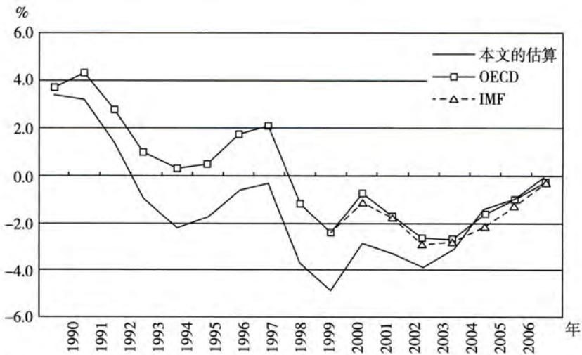  
图1-1 采用生产函数法的GDP缺口比较

注：根据OECD（2007）、IMF（2006）、本文第二节的估算值制作。

先，除OECD外，函数类型均使柯布道格拉斯模型。OECD使CES函数。

对全要素生产率趋势值的估算也是以同样的方法进行的，将资本和劳动的实际值代生产函数中，用HP滤波器对得到的全要素生产率的残差进平滑处理。

各机构对劳动投入的计算基本上采用类似的方法，但在用于计算潜在投入量的“均衡失业率”的方法上有所不同。

实际劳动投入量为

劳动投入量 $=$ 劳动年龄×劳动参与率×(1-失业率）

×人均劳动时间

将劳动力参与率、人均劳动时间的趋势值和“均衡失业率”代这个公式，就可以得到“潜在”的劳动投入量。在确定“均衡失业率”时，内阁府和日本银行用UV分析，而IMF使用自然失业率，OECD使用非加速工资变动失业率（Non-Accelerating Wage Rate of Unemployment，NAWRU）的概念。

关于资本投，IMF和OECD在估算潜在GDP时使用了资本存量实际值，没有进行特别调整，而内阁府和日本银行则考虑了“资本利用率”，并使其估算值反映出实际利用率和“潜在利用率”之间的差距。而且，内阁府使用“私人部门资本存量”来表示资本存量，而本银使用JIP数据库，IMF使用自己的估算值。“私人部门资本存量”是用当前的存量加上新投资，减去报废设备（去除额）估算的，但该方法不能反映已有设备老化、价值下降的情况。JIP数据库和IMF自己的估算使用了“基准年法”或“永续盘存法（PIM）”，估算方法也考虑了设备经济价值的下降。

上述四家机构采用的估算方法与生产函数法基本相同，但除了函数类型和参数不同外，还在“均衡失业率”的估算方法和资本存量的使用方法上有所不同，这可能导致估算结果的差异。图1-2比较了OECD和IMF公布的GDP缺口和本文的估算值（见第二节），虽然总体趋势相似，但水平却大不相同。

  
图1-2基于生产函数法的潜在增长率和GDP缺口的估算步骤

注：参考《2007年版经济财政白书》附录1-2制作。

# 奥肯定律

奥肯定律是指GDP的变化与失业率的变化之间存在的关系。奥肯在其1962年的论中指出，当GDP低于正常平 $3 \%$ 时，失业率会上升 $1 \% \textcircled { \mathrm { 1 } }$ 。可使这种关系来估算潜在GDP和GDP缺。

比如，假设 $y$ 是GDP, $U$ 是完全失业率， $U *$ 是自然失业率， $T$ 是时间

趋势，

$$
\ln ( y ) = \alpha + \beta ( U - U ^ { * } ) + \gamma T
$$

潜在GDP和GDP缺口可以从数据中估算关系式来估算①，这种方法相对简单，但结果却大不相同，这取决于用来估算自然失业率的方法（见第三节）。

# HP滤波器和时间序列分析

HP滤波器是Hodrick和Prescott（1997）提出的，是一种泛用于从时间序列数据中提取趋势的方法。如果时间序列 $\boldsymbol { y } _ { t }$ 的趋势分量是 $y _ { \iota } ^ { \textit { G } }$ ，那么通过HP滤波器的趋势是 $y _ { t } ^ { G }$ 的序列，使以下内容最小化。

$$
\sum _ { t = 1 } ^ { T } \left( y t - y _ { t } ^ { G } \right) ^ { 2 } + \lambda \sum _ { t = 2 } ^ { T - 1 } \big [ \left( y _ { t + 1 } ^ { G } - y _ { t } ^ { G } \right) - \left( y _ { t } ^ { G } - y _ { t - 1 } ^ { G } \right) \big ] ^ { 2 }
$$

如果我们考虑到实际GDP是围绕潜在GDP周期性波动的，就有可能把HP滤波器计算的GDP趋势视为潜在GDP。

这种方法无法描述潜在GDP在很长一段时间内偏离实际GDP的情况。例如，如下文所讨论的，在生产函数法下，实际GDP在20世纪90年代的大部分时间都低于潜在GDP（GDP缺口为负值），而这种情况在HP滤波器下不可能发生，两者给人的印象非常不同。此外，由于潜在GDP是通过上述方法机械地计算出来的，因此无法分析其背后存在着什么样的经济机制。

使用状态空间模型的测量也被用作与经济理论有关的时间序列分析方法。如果用不可观测的潜在GDP作为状态变量，用潜在GDP与其他时间序列数据（如菲律普斯曲线）的相关方程式作为观测方程式，构建一个状态空间模型，就可以用卡尔曼滤波器来测量潜在GDP。

Kuttner（1994）从GDP和通货膨胀率之间的关系来衡量潜在GDP。广濑、镰田（2002）使用菲利普斯曲线来估算一个变量“非加速通货膨胀失业率”(Non-Accelerating Inflation Rate of Unemployment，, NAIRU)。

# 通过经济模型的估算

基于生产函数法和奥肯定律估算潜在GDP和GDP缺口的方法也可以与经济理论相关，但在与理论的一致性方面，它们被认为是不够的。生产函数法本质上是一种供应方的方法，而奥肯定律则只考虑需求方的条件。

作为与经济理论更一致的方法，将一般均衡模型的均衡值作为潜在GDP，并作为与实际值的差距来估算GDP缺口。Edge、Kiley和Laforte（2008）对美国经济进了估算，Smets和Wouters（2003）对欧洲进了动态随机一般均衡模型的估算，并将GDP缺口作为与均衡值的差距来衡量。

Edge、Kiley和Laforte（2008）的估算值自20世纪90年代中期以来取负值，与产函数法估算的GDP缺口趋势有很的不同。Hirose和Naganuma（2007）通过构建动态随机般均衡模型来估算美国经济的GDP缺口，并得到了与经济变动一致的结果。

# 2 基于产函数法估算潜在GDP和GDP缺口

# 2.1 估算方法

下参考《经济财政书》①中的估算法，估算潜在GDP和GDP缺（估算步骤纲见图1-3，详见附录)。

估算是在19802006年之间，以季度为单位进的。

假设以下柯布道格拉斯产函数为产函数。

$$
Y = A K ^ { \alpha } L ^ { 1 - \alpha }
$$

Y:生产量（实际GDP），A：TFP（全要素生产率）， $K$ ：资本投入量，L：劳动投入量， $\alpha$ ：资本份额

资本份额没有作为方程式中的参数进估算，而是预先假定为0.33（1980年以来（1-雇员报酬/（固定资本损耗 $^ +$ 经营盈余 $^ +$ 雇员报酬-家庭经营盈余））的平均值)。

将实际资本投量与劳动投量代这个程式，通过对作为残差得到的全要素产率应HP滤波器来估算趋势。将“潜在”的资本投量与劳动投量以及全要素产率的趋势代上述产函数，就可以得到潜在GDP。

资本投量不是资本存量本，而是资本存量乘以利率。并所有的资本存量都会被使用，预计利用率会根据经济环境的变化而有所波动。因此，实际投的资本量被认为是与利率相对应的资本存量部分。“潜在”的利率平，即利率减去经济变动部分，被来估算潜在资本投量。

由于制造业和制造业之间利率的变化预计会有所不同，因此对这两个部门进了估算，估算法如下。

资本投入量 $=$ 制造业资本存量 $\times$ 制造业利率 +非制造业资本存量 $\times$ 制造业利率

（1）制造业资本利用率

%  
105.0 制造业实际利用率  
100.0 制造业潜在利用率  
95.0  
90.0 85.0   
80.0   
75.0

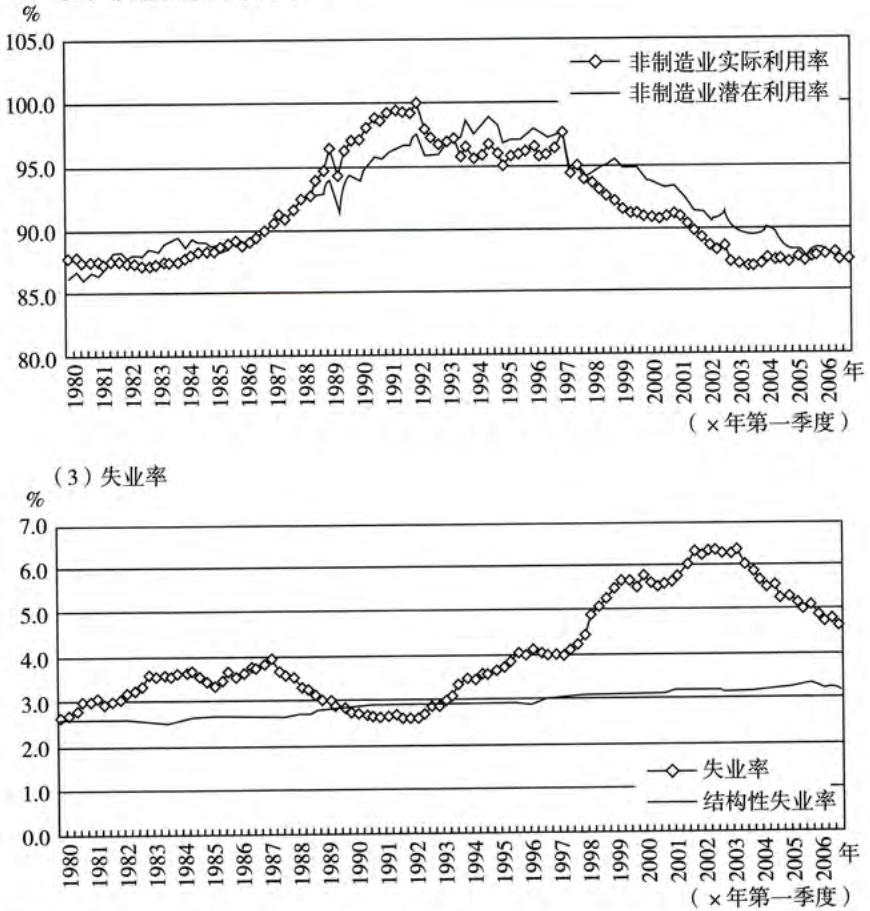  
（2）非制造业资本利用率  
图1-3实际和潜在的资本利用率和结构性失业率的变化

注：估算方法和使用的统计数据见附录。

# 10宏观经济与产业结构

作为资本存量，使了内阁府“私部门资本存量”的公布值①。

虽然采矿业指数中存在制造业的利率指数，但没有制造业的产能利率指数。出于这个原因，《经济财政书》使第三产业活动指数来估算制造业的利率。这，第三产业活动指数减去趋势后的值被视为制造业的利用率②。

潜在利率被定义为实际利率减去经济因素。具体来说，利率被回归到本银公布的“全国企业短期经济观测调查”结果显的“产营业设备投资指数（DI）”上③。图1-4（1）、图1-4（2）显示了估算的实际和潜在的利用率。在泡沫时期，制造业的实际利率超过了潜在利率，但在其他时期却低于潜在利用率。在20世纪90年代的经济衰退时期，两者之间的差距加。制造业的利率从20世纪80年代到泡沫时期直在增加，随后下降到现在。正如预期的那样，实际利率在泡沫期超过了潜在利率，但在其他时期低于潜在利率。

(1)GDP缺口的变化 i $\%$ i   
6.0   
4.0   
2.0   
0.0 11   
-2.0   
-4.0

（2）潜在增长率的变化注：估算方法和使用的统计数据见附录。

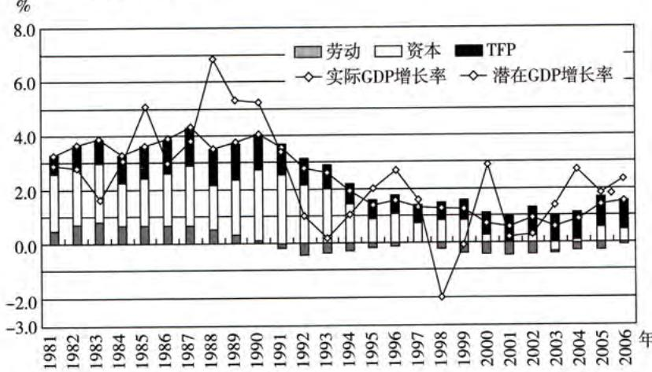  
图1-4GDP缺口和潜在GDP的变化

那么，实际劳动投入量就是劳动投入量 $=$ 就业数 $\times$ 均劳动时间计算方式是用以下公式进的。这个方程式是劳动投入量 $=$ 劳动年龄人口×劳动参与率$\times$ （1-失业率） $\times$ 人均劳动时间

潜在劳动投量的计算方式是：用HP滤波器计算出的趋势代劳动力参与率和人均劳动时间，用“结构性失业率”代失业率。结构性失业率是指失业率减去经济趋势而产生的波动部分。

在《经济财政白皮书》中，“结构性失业率”是根据失业率与岗位空缺率之间的关系来估算的。在此，结构性失业率的估算参考了《2006年经济财政白书》附录1-1中提出的纳结构性变化的UV分析（估算公式见本附录）。以失业率为纵轴，岗位空缺率为横轴，描绘了向右下降的关系，将其称为UV曲线（或贝弗奇曲线）。UV分析将该曲线和45度线的交点视为供需平衡，将该失业率水平作为结构性失业率。在估算UV曲线时，考虑到离职率和老年人就业率，可以认为这些因素对结构性失业率的水平产生影响。

图1-4（3）显示了估算的结构性失业率。结构性失业率从长期来看是缓慢上升的，20世纪80年代初在2.5%左右，自20世纪90年代后期以来一直保持在 $3 \% - 4 \%$ 之间。

最后，全要素生产率的趋势是通过将实际资本和实际劳动投入量代入生产函数中，并用HP滤波器平滑得到的残差值来估算的。潜在GDP也是通过将潜在资本投量、潜在劳动投入量和全要素生产率的趋势代入生产函数来

计算的。

GDP缺是实际GDP与潜在GDP之间的偏差率，基于以下公式计算得出。

# 2.2估算结果

# GDP缺口和潜在增长率的变化

GDP缺和潜在增长率的估算结果见图 $1 - 5 \textcircled { \mathrm { 1 } }$ 。

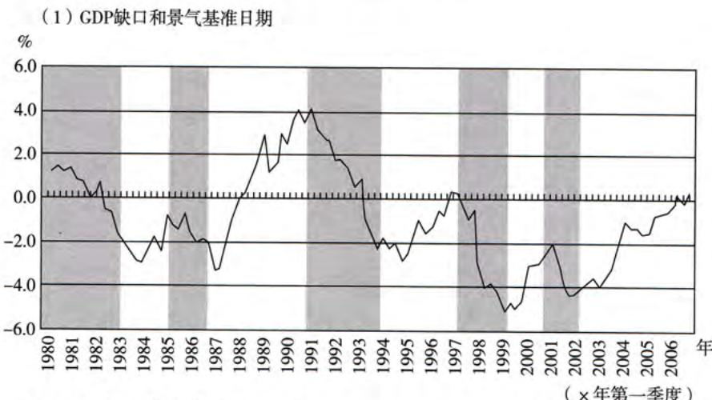  
(2）GDP缺口和企业信心指数（DI）

  
（3）GDP缺口和有效职位空缺率  
图1-5GDP缺口和潜在GDP的变化

注：根据内阁府“景气基准日期”、日本银行“全国企业短期经济观测调查”、厚生劳动省“职业稳定业务统计”、本文第二节的估算值制作。

GDP缺口在泡沫期达到了约4%，但随着经济衰退迅速缩小，并在1993年转为负值。在1997年经济危机后的经济衰退中，1999年达到约-5%，但在2002年以后的经济复苏中缩小，在2006年保持在接近零的状态。

20世纪80年代，潜在增长率一般在3%左右，但随后下降，自20世纪90年代中期以来一直保持在1%左右。在20世纪90年代，除了劳动投量下降外，资本投量和全要素生产率增长也放缓，导致潜在增长率下降。自2000年以来，全要素生产率增速上升，潜在增长率也小幅回升。

# GDP缺口和主要经济指标

为了判断估算的GDP缺是否恰当，我们对主要经济指标与趋势进了对比（图1-6)。

首先，对GDP缺口和景气基准日期的比较表明，拐点不一定重合，但缺口在经济衰退期向负方向移动，在经济扩张期向正方向移动，基本上与经济波动相致。与日本银短观中的企业信心指数（DI）相比，企业信指数（DI）在20世纪80年代略微领先，但自20世纪90年代后期以来，两者的变化乎相似。与有效职位空缺率相比，20世纪80年代的波动范围给的印象是不同的，但从那时起，包括波动的时间在内都很相似。值得注意的是，泡沫开始和破灭之间的变动是重合的，而且近年来两者都接近零（几乎处于供需平衡状态)。

如上所述，GDP缺口与主要经济指标的变化致，被认为是捕捉经济阶段的一个有用的指标。

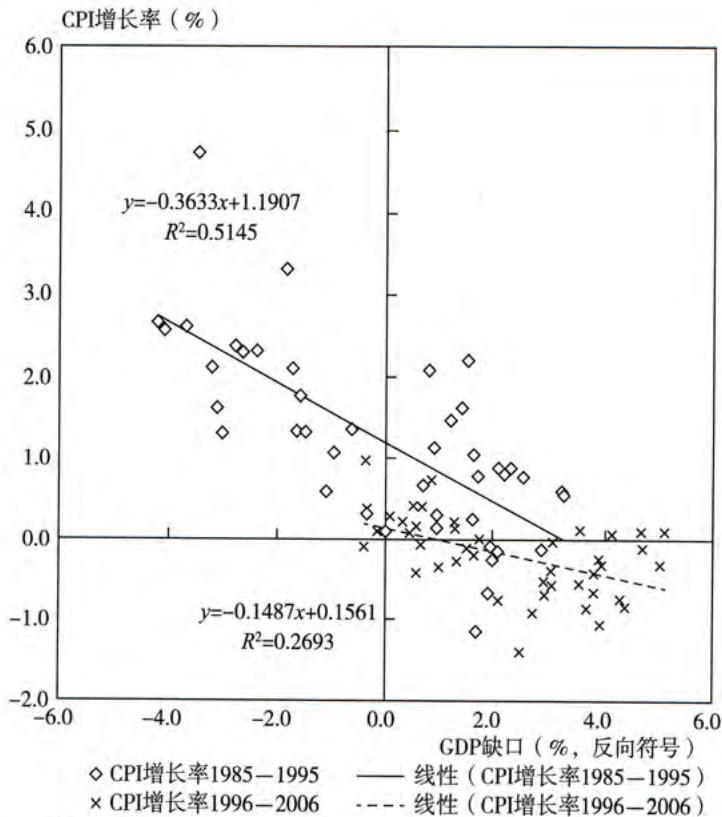  
注：根据总务省“消费者物价指数”、本文第二节的估算值制作。  
图1-6 GDP缺口和消费价格通货膨胀率之间的相关性

# GDP缺口和通货膨胀率

正如第1.1节所讨论的，估算CDP缺的重要意义在于，它可以被认为是物价波动压力的指标。

然而，近年来，据说菲利普斯曲线所假设的关系已经变得不明确。特别是自2000年以来，尽管失业率和GDP缺口有很大的波动，但消费者物价继续小幅下降。据说这使菲利普斯曲线趋平了，它现在接近水平状态，而不是下降。

图1-7显示了本文估算的GDP缺口与消费价格通货膨涨率（综合，不包括鲜食品）之间的相关性。虽然两者之间存在相关性，但将这时期分为19851995年和19962006年，并应线性回归程式，可以看出GDP缺口的系数变小，可决系数也下降。这表明在20世纪90年代后期的非通货膨胀和通货紧缩时期，两者之间的相关性有所下降。

我们估算菲利普斯曲线如下①。

$$
\pi _ { t } = \sum _ { j = 1 } ^ { 4 } \lambda _ { j } \pi _ { t - j } + \kappa \big ( y _ { t - 1 } - y _ { t - 1 } ^ { * } \big ) + \psi z _ { t - 1 } + \xi + \upsilon _ { t }
$$

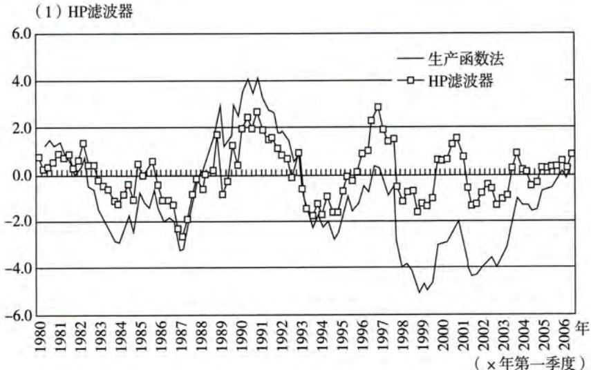  
图1-7不同估算方法的GDP缺口差异

注：根据总务省“劳动力调查”、本文第二节的估算值制作。

$\pi _ { t }$ 是通货膨胀率, ${ ( y _ { t - 1 } - y _ { t - 1 } } ^ { * }$ ）是GDP缺口， $\psi z _ { t - 1 }$ 是供给冲击，ξ是常数项， $\nu _ { \iota }$ 是误差项。右边第一项 页 $\sum _ { j = 1 } ^ { 4 } \lambda _ { j } \pi _ { t - j }$ 代表预期通货膨胀率。通货膨胀率使用了经季节性调整的除生鲜食品外的消费物价综合指数同比增长率（年化），供给冲击使用了进口物价指数同比增长率（年化）的三期移动平均值。GDP缺口和供给冲击使用了一期滞后值。还加了消费税虚拟变量（1989年第二季度、1997年第二季度）。

OLS估算的结果见表1-2。为了观察菲利普斯曲线斜率的变化，还分别对19851995年和19962006年两个期间进了估算。

# 表1-2菲利普斯曲线的估算结果

估算公式： $\pi _ { t } = \sum _ { j = 1 } ^ { 4 } \lambda _ { j } \pi _ { t - j } + \kappa \big ( y _ { t - 1 } - y _ { t - 1 } { } ^ { * } \big ) + \psi z _ { t - 1 } + \xi + \upsilon _ { t }$

<table><tr><td rowspan=1 colspan=1>因变量</td><td rowspan=1 colspan=1>系数</td><td rowspan=1 colspan=1>系数</td><td rowspan=1 colspan=1>系数</td></tr><tr><td rowspan=1 colspan=1>常数项</td><td rowspan=1 colspan=1>0.488***(0.133）</td><td rowspan=1 colspan=1>0.765**（0.270)</td><td rowspan=1 colspan=1>0.111 （0.201)</td></tr><tr><td rowspan=1 colspan=1>$T-1$</td><td rowspan=1 colspan=1>0.182**(0.061)</td><td rowspan=1 colspan=1>0.108 (0.101)</td><td rowspan=1 colspan=1>0.148*(0.055)</td></tr><tr><td rowspan=1 colspan=1>$π1-2$</td><td rowspan=1 colspan=1>0.102 (0.062）</td><td rowspan=1 colspan=1>0.040 (0.100)</td><td rowspan=1 colspan=1>0.095 (0.057)</td></tr><tr><td rowspan=1 colspan=1>T-3</td><td rowspan=1 colspan=1>0.032 (0.063）</td><td rowspan=1 colspan=1>0.083 (0.102)</td><td rowspan=1 colspan=1>-0.079 (0.059)</td></tr><tr><td rowspan=1 colspan=1>π-4</td><td rowspan=1 colspan=1>0.086 (0.060)</td><td rowspan=1 colspan=1>0.103 (0.100)</td><td rowspan=1 colspan=1>0.010 (0.052)</td></tr><tr><td rowspan=1 colspan=1>(y-1-y-1 )</td><td rowspan=1 colspan=1>0.225***（0.048)</td><td rowspan=1 colspan=1>0.251**(0.077)</td><td rowspan=1 colspan=1>0.118*(0.066）</td></tr><tr><td rowspan=1 colspan=1>$21-1</td><td rowspan=1 colspan=1>-0.003 (0.006）</td><td rowspan=1 colspan=1>0.011 (0.010)</td><td rowspan=1 colspan=1>-0.004 (0.012)</td></tr><tr><td rowspan=1 colspan=1>Dummy1（1989第一季度）</td><td rowspan=1 colspan=1>5.645***(0.666)</td><td rowspan=1 colspan=1>5.397*****（0.810)</td><td rowspan=1 colspan=1></td></tr><tr><td rowspan=1 colspan=1>Dummy2（1997第一季度）</td><td rowspan=1 colspan=1>6.279**(0.647）</td><td rowspan=1 colspan=1></td><td rowspan=1 colspan=1>6.787**(0.402)</td></tr><tr><td rowspan=1 colspan=1>数据数</td><td rowspan=1 colspan=1>88</td><td rowspan=1 colspan=1>44</td><td rowspan=1 colspan=1>44</td></tr><tr><td rowspan=1 colspan=1>估算期</td><td rowspan=1 colspan=1>1985第一季度—2006第四季度</td><td rowspan=1 colspan=1>1985第一季度一1995第四季度</td><td rowspan=1 colspan=1>1996第一季度一2006第四季度</td></tr><tr><td rowspan=1 colspan=1>可决系数</td><td rowspan=1 colspan=1>0.835</td><td rowspan=1 colspan=1>0.783</td><td rowspan=1 colspan=1>0.913</td></tr><tr><td rowspan=1 colspan=1>调整后的可决系数</td><td rowspan=1 colspan=1>0.818</td><td rowspan=1 colspan=1>0.741</td><td rowspan=1 colspan=1>0.896</td></tr><tr><td rowspan=1 colspan=1>杜宾-沃森比</td><td rowspan=1 colspan=1>1.535</td><td rowspan=1 colspan=1>1.968</td><td rowspan=1 colspan=1>1.002</td></tr></table>

注：1.根据总务省“消费者物价指数”、日本银行“企业物价指数”、本文第二节的估算值等制作。

2.()内的数值为系数的标准偏差。\*表示在 $1 \%$ 的水平上显著，表示在 $5 \%$ 的水平上显著，表示在 $10 \%$ 的平上显著。

虽然预期通货膨胀率的估算没有够的显著性，但GDP缺的系数满符号条件，并且是具有显著性的。系数平从19851995年的平下降到19962006年的平，表明通货膨胀率对GDP缺波动的反应在下降。

# 3 估算GDP和GDP缺口的问题

# 3.1 估算方法造成的结果差异

第1.2小节介绍了潜在GDP的几种估算方法。不同的估算方法将导致潜在GDP和GDP缺口的不同水平。从表1-2可以看出，即使使用相同的生产函数法，潜在GDP的估算结果也因分析人员采用的不同估算方法而有很大的不同。如果使用不同的估算方法，结果的差异会更大。

作为一个例子，图1-8（1）比较了使用本文所采取的生产函数法的GDP缺口和使用HP滤波器的趋势。如上所述，HP滤波器没有对原始系列进长期偏离，所以两者看起来很不一样。在生产函数法中，GDP缺口自20世纪90年代以来几乎一直是负值，而在HP滤波器中，缺口总是在经济扩张的高峰期扩大到正值。特别是在1997年的高峰期，经过HP滤波器的GDP缺口达到了高于泡沫期的水平。

然后，使用奥肯定律的估算值显示在图1-8（2）中。使用实际数据对第2.1小节提出的方程式（1.1）进行估算①，与实际失业率和自然失业率之间的差距相关的项被排除在经济波动因素之外，被视为潜在GDP。使用这种方法时，需要对自然失业率进行估算。这里做了两个估算，一个是使用第2.1小节中估算的“结构性失业率”，另一个是将对失业率应用HP滤波器得到的趋势视为自然失业率。

当使用结构性失业率时，GDP缺口的波动范围要比生产函数法大得多，在2003年达到约 $- 1 5 \%$ 。虽然随后缺口有所缩小，但最近的2006年仍是很大的负数。如果把HP滤波器的趋势视为自然失业率，波动范围与生产函数法相似，但1997年的峰值水平与泡沫期的水平相当，目前的正值超过了泡沫期。这种印象与生产函数法有很大不同。

（1）截至1991年（2）截至1997年

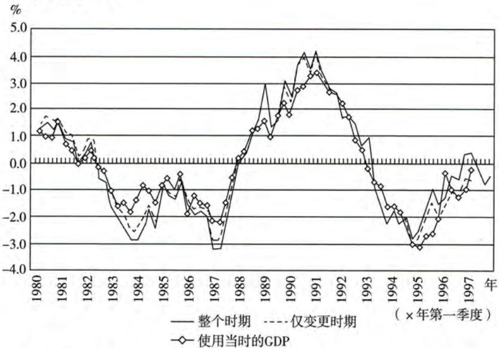  
图1-8 截至1991、1997年的GDP缺口估算值（测算）

注：“整个时期”是本文第二节的估算值；“仅变更时期”是使用相同的数据和估算方法进的估算值，时期以1980年第一季度到1991年第一季度或1997年第一季度；“使用当时的GDP”基于GDP仅被当时的公布值所取代。

# 3.2 与实时估算潜在GDP和GDP缺有关的问题

GDP缺的实时估算必须基于估算时的信息。这些数值将不可避免地因新数据的增加或基础数据的事后修订而被修正。在这，实时衡量GDP缺有其局限性。

Kamada（2005）在Orphanidas和VanNorden（2002）的基础上，将GDP缺口估算值分为四个层次：实时估算值、准实时估算值、准最终估算值、最终估算值，并针对日本银行对潜在GDP的六个估算方法，分别研究了每个方法的估算值从实时到最终的变化。如果考虑用截至当前的数据估算1990年第一季度的值的情况下，每个层次的含义分别为：

实时估算值：完全基于1990年第一季度的信息的估算值；

准实时估算值：使用目前可获得的数据估算到1990年第一季度的值；

准最终估算值：使用目前可获得的数据和已知的当前参数估算到1990年第一季度的值；

最终估算值：当前估算的1990年第一季度的值。

研究结果显示，从实时估算值到最终估算值的修订范围因估算方法不同而不同，明确使用GDP信息的估算方法显示的修订范围更大。实时估算值往往比最终估算值更不稳定，但这被认为是由于对GDP本身修订的影响。准实时估算值在拐点的波动也比最终估算值大，但这是由于样本结束的问题，即趋势随着数据的积累而变化。

表1-3较了前期《经济白书》《经济财政书》中对GDP缺口和潜在增长率的估算值，以及本中基于当前数据的估算值。

表1-3以前的经济（财政）白皮书与本文中的估算值的比较  

<table><tr><td rowspan=1 colspan=5>经济（财政）白皮书估算值（最终期）</td><td rowspan=1 colspan=2>本文估算值</td></tr><tr><td rowspan=1 colspan=1>公布年份</td><td rowspan=1 colspan=1>估算项目</td><td rowspan=1 colspan=1>最近一期</td><td rowspan=1 colspan=1>水平</td><td rowspan=1 colspan=1>方向</td><td rowspan=1 colspan=1>水平</td><td rowspan=1 colspan=1>方向</td></tr><tr><td rowspan=1 colspan=1>1993财年</td><td rowspan=1 colspan=1>GDP缺口</td><td rowspan=1 colspan=1>1993年第一季度</td><td rowspan=1 colspan=1>-3.5%左右</td><td rowspan=1 colspan=1>-</td><td rowspan=1 colspan=1>+1.0%</td><td rowspan=1 colspan=1>-</td></tr><tr><td rowspan=1 colspan=1>1994财年</td><td rowspan=1 colspan=1>GDP缺口</td><td rowspan=1 colspan=1>1993 年第四季度</td><td rowspan=1 colspan=1>超过-6%</td><td rowspan=1 colspan=1>-</td><td rowspan=1 colspan=1>-2.3%</td><td rowspan=1 colspan=1>-</td></tr><tr><td rowspan=1 colspan=1>1998财年</td><td rowspan=1 colspan=1>GDP缺口</td><td rowspan=1 colspan=1>1998年第一季度</td><td rowspan=1 colspan=1>-2%左右</td><td rowspan=1 colspan=1>-</td><td rowspan=1 colspan=1>-2.9%</td><td rowspan=1 colspan=1>-</td></tr><tr><td rowspan=1 colspan=1>1999财年</td><td rowspan=1 colspan=1>GDP缺口</td><td rowspan=1 colspan=1>1998年第四季度</td><td rowspan=1 colspan=1>-3-5%左右</td><td rowspan=1 colspan=1>-</td><td rowspan=1 colspan=1>-4.1%</td><td rowspan=1 colspan=1>-</td></tr><tr><td rowspan=1 colspan=1>2000财年</td><td rowspan=1 colspan=1>GDP缺口</td><td rowspan=1 colspan=1>2000年第一季度</td><td rowspan=1 colspan=1>-2.5%左右</td><td rowspan=1 colspan=1>+</td><td rowspan=1 colspan=1>-3.0%</td><td rowspan=1 colspan=1>+</td></tr><tr><td rowspan=1 colspan=1>2001财年</td><td rowspan=1 colspan=1>GDP缺口潜在增长率</td><td rowspan=1 colspan=1>2001年第一季度2000年</td><td rowspan=1 colspan=1>-4%左右+1%左右</td><td rowspan=1 colspan=1></td><td rowspan=1 colspan=1>-2.1%+0.7%</td><td rowspan=1 colspan=1>+</td></tr><tr><td rowspan=1 colspan=1>2003财年</td><td rowspan=1 colspan=1>潜在增长率</td><td rowspan=1 colspan=1>2001—2002年</td><td rowspan=1 colspan=1>+1%左右</td><td rowspan=1 colspan=1></td><td rowspan=1 colspan=1>+0.7%</td><td rowspan=1 colspan=1></td></tr><tr><td rowspan=1 colspan=1>2005财年</td><td rowspan=1 colspan=1>GDP缺口</td><td rowspan=1 colspan=1>2005年第一季度</td><td rowspan=1 colspan=1>-1%左右</td><td rowspan=1 colspan=1>持平</td><td rowspan=1 colspan=1>-1.5%</td><td rowspan=1 colspan=1>持平</td></tr><tr><td rowspan=1 colspan=1>2006财年</td><td rowspan=1 colspan=1>GDP缺口潜在增长率</td><td rowspan=1 colspan=1>2006年第一季度2005年</td><td rowspan=1 colspan=1>+0.5%左右+1.5%左右</td><td rowspan=1 colspan=1>+</td><td rowspan=1 colspan=1>-0.3%+1.4%</td><td rowspan=1 colspan=1>+</td></tr></table>

续表  

<table><tr><td rowspan=1 colspan=5>经济（财政）白皮书估算值（最终期）</td><td rowspan=1 colspan=2>本文估算值</td></tr><tr><td rowspan=1 colspan=1>2007财年</td><td rowspan=1 colspan=1>GDP缺口潜在增长率</td><td rowspan=1 colspan=1>2006年第四季度2006年</td><td rowspan=1 colspan=1>+0.5%左右+1.5%左右</td><td rowspan=1 colspan=1>+</td><td rowspan=1 colspan=1>+0.4%+1.5%</td><td rowspan=1 colspan=1>+</td></tr></table>

注：1.根据经济（财政）白皮书各年版、本文第二节的估算值制作。2.“方向”是根据过去几个季度的总体趋势来判断的。

除2001财年外，GDP缺口的方向是一致的，但水平可能有很大不同。例如，1994财年GDP缺口平达到 $- 6 \%$ ，而本文的估算是 $- 2 . 3 \%$ 。《经济财政书》从2001财年起才采前的法来估算潜在GDP，因此，早期的估算值不可避免地存在着较大的偏差。

2001财年平和向都发转变的原因被认为是由于GDP的多次修订，在2001年已经转向93SNA，随后在2002年改变了季度GDP初值的估算方法，在2004年转向链式变现法，在2005年转向2000年标准。

图1-9以1991年第季度和1997年第季度这两个事后经济拐点为例，显示了估算期的影响和数据修订的影响。“整个时期”的系列是第2.2小节中提出的估算值，而“仅变更时期”的系列是使用相同的数据进的估算值，时期从1980年第季度分别到1991年第季度和1997年第季度。反映了HP滤波器估算时期变化的影响和回归分析参数的变化（资本份额不变，使用0.33）。标有“使用当时的GDP”的系列是基于GDP仅被1991年第季度和1997年第季度的公布值所取代，并加上GDP修订的影响。

(1)HP滤波器   
6.0 —生产函数法   
4.0 -0-HP滤波器   
2.0   
0.0   
-2.0   
-4.0

(2）奥肯定律

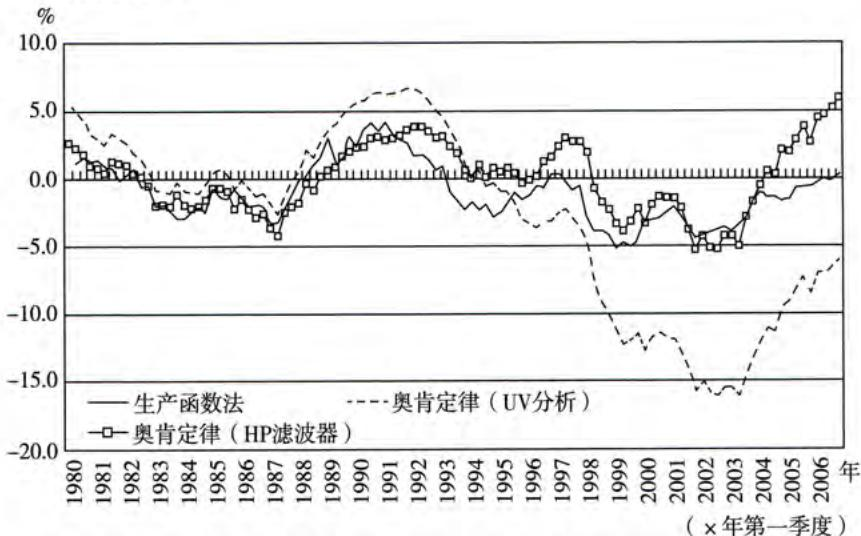  
图1-9截至1991、1997年的GDP缺口估算值（测算）

注：“整个时期”是本文第二节的估算值；“仅变更时期”是使用相同的数据和估算方法进行的估算值，时期以1980年第一季度到1991年第一季度或1997年第一季度；“使用当时的GDP”基于GDP仅被当时的公布值所取代。

将截至1991年第一季度的估算值与整个时期的估算值相比较，20世纪80年代中期在水平和方向上都发生了相当大的变化。特别是，在经济高峰（1985年第二季度）附近，“使用当时的GDP”系列的方向与“整个时期”的系列相反。缺口的显性隐性也不同，对经济现状认识的印象也各不相同。当估算时期延长到截至1997年时，总体趋势接近“整个时期”的趋势，但对于“使用当时的GDP”的系列，例如，1996年期间有一个相反方向的变化。因此，对当前趋势的详细考察表明，很难实时获得准确的数值。

# 4未来的课题

本文参照《经济财政白皮书》中的估算方法，采用生产函数法对潜在GDP和GDP缺口进行了估算，结果与典型经济指标的估算结果基本一致。在菲利普斯曲线中看到的GDP缺口和通货膨胀率之间的相关性长期存在，但最近两者之间的关系变得不明确，据说菲律普斯曲线正在趋平。

上述估算的结果与几种估算方法进行了比较，结果表明，估算方法不同，结果也有很大差异。研究还发现，即使采用相同的估算方法，估算结果也会因延长估算期或修订数据而发生事后变化，因此很难实时获得准确的估

算结果。

下面介绍一些关于使用生产函数法进估算的问题和注意事项。

# 估算非制造业的资本利用率和结构性失业率的方法

本文采取的生产函数法中的一个技术问题被认为是对非制造业的资本利用率和结构性失业率的估算方法方面的问题。利用率的实际值和潜在值之间的差距会影响潜在GDP，但重要的是要考虑非制造业的利用率，因为制造业和非制造业的利用率被认为呈现不同的趋势。然而，如上所述，没有统计指标可以衡量制造业的利率，所以必须使某种数据来估算它。此外，估算结构性失业率的结果可能会因使用的方法不同而有相当大的差异。本采用了UV分析，但存在一个问题，即基于UV分析的结构性失业率受到经济波动的影响，需要考虑替代方法。

从某种意义上说，这些估算法有个“由裁量权”，可能对估算结果的差异有很影响。然而没有可靠的法，在我们检查估算结果是否与我们的实际经验相符时，将有必要考虑更合适的方法。

# 潜在GDP的估算误差

由于潜在GDP很大程度上受到估算方法、估算时期和数据修订的影响，所以总是注释说“结果应在个范围内考虑”，但并不总是清楚多少“范围”是实际有意义的。

伊藤等（2006）展示了本银潜在增长率的估算误差（ $=$ 最终估算值-实时估算值），这表明1985年后存在着高达 $1 \%$ 的误差。浦泽、清谷（2008）用蒙特卡罗（MonteCarlo）法和自助法（BootstrapMethod）对HP滤波器等估算的GDP缺口估算了个 $9 5 \%$ 的置信区间，基于 $t$ 统计量的置信区间在零以上或零以下 $1 \%$ 左右，这意味着在这个范围内的变动与零没有显著区别。

从这点来看，GDP缺口的细微变化意义不，只应该于捕捉总体趋势。

# 与经济理论的关系

如第2.2节所讨论的，基于产函数法的GDP缺与主要经济指标是一致的，被认为有一定的实用性，但它不一定与经济理论充分一致。例如，已经研究了在动态随机一般均衡模型中估算GDP缺口的方法，并认为今后应考虑在分析经济趋势中利用这种方法。

# 附录 使用生产函数法估算潜在GDP和GDP缺口的方法

# 1 估算方法摘要

假设柯布道格拉斯产函数决定实际GDP的平，“潜在GDP”是通过代剔除经济因素后的“潜在资本投量”“潜在劳动投量”和全要素生产率趋势来估算的。

GDP缺是实际GDP和潜在GDP之间的偏差率，计算公式如下。

# 2资本投入量的估算

(1）实际资本投入量的估算

实际资本投量是通过对制造业和非制造业的“实际资本存量×实际资本利用率”来估算的。

$\textcircled{1}$ 实际资本存量

实际资本存量是根据“私部门资本存量（2000年平均价格估值）”对制造业和非制造业装机数上期期末值进季节性调整。对于非制造业，调整了与NTT民营化、JR民营化和新干线被出售给私人部门出现的差异（分别为1985年第二季度、1987年第二季度、1991年第四季度）。

$\textcircled{2}$ 制造业资本利率

以20世纪80年代以来的最值、即1990年第四季度的值为 $100 \%$ ，将采矿业指数中的制造业利用率指数（经季节性调整）转换为比率。

$\textcircled{3}$ 制造业资本利率

以20世纪80年代以来的最值、即1992年第二季度的值为 $100 \%$ ，将剔除趋势的“第三产业活动指数”（经季节性调整）系列转换为比率。

$\textcircled{4}$ 实际周转资本数额根据以下公式进行估算。

实际周转资本数额 $=$ 制造业实际资本存量 $\times$ 制造业资本利用率$^ +$ 非制造业实际资本存量 $\times$ 非制造业资本利用率

# 24宏观经济与产业结构

(2）潜在资本投入量的估算

潜在资本投量是通过对制造业和制造业的“实际资本存量×潜在资本利率”相加来估算的。

$\textcircled{1}$ 制造业潜在资本利率

制造业资本利率被回归到与“全国企业短期经济观测调查”中的制造业生产经营设备投资指数（DI）上，剔除经济波动因素后，计算出潜在利用率。

$\textcircled{2}$ 制造业潜在资本利率

制造业资本利率被回归到“全国企业短期经济观测调查”中制造业企业信心指数（DI）的三期滞后值上，并通过剔除经济波动因素来计算潜在利用率（非制造业的企业信心指数被用作替代变量，因为非制造业设备投资指数（DI）只有1990年第四季度及以后的数据。取企业信指数（DI）与设备投资指数（DI）之间的时滞相关系数，并使用相关度最大的三期滞后值)。

$\textcircled{3}$ 潜在周转资本数额根据以下公式进估算。

潜在周转资本数额 $=$ 制造业实际资本存量×制造业潜在资本利率 +制造业实际资本存量×制造业潜在资本利率

# 3劳动投入量的估算

(1）实际劳动投入量

实际劳动投量是通过“总实际劳动时间×就业数”来估算的。

总实际劳动时间采“劳动统计报”的总实际劳动时间指数（有30名或以上雇员的单位的数据）换算成时。就业数采“劳动调查”的就业人数。

(2）潜在劳动投入量

潜在劳动投量是通过“潜在劳动时间×潜在就业数”来估算的。

$\textcircled{1}$ 潜在劳动时间

HP滤波器平滑处理后的（1）的总实际劳动时间作为潜在劳动时间。

$\textcircled{2}$ 潜在就业数

根据以下公式进估算。

潜在就业人 $=$ （15岁及以上口×趋势劳动参与率） $\times$ (1-结构性失业率）

15岁及以上和劳动参与率来“劳动调查”。趋势劳动参与

率使用HP滤波器平滑处理后的值。

结构性失业率是参照《2006年版经济财政书》附录1-1中的“纳结构性变化的UV分析”来估算的。具体来说，“均衡失业率”是根据以下估算公式按年估算后，再分成季度数值作为结构性失业率。

$$
\ln U _ { t } = \alpha + \beta \ln V _ { t } + \gamma Q K _ { t } + \delta E L D _ { t } + \theta U _ { t - 1 }
$$

$U$ ：失业率， $V$ ：岗位空缺率， $K$ ：离职率， $E L D$ ：老年人就业比例 假设均衡失业率为 $U ^ { * }$ ，则

$$
\ln { U ^ { * } } = \frac { \left( \alpha + \gamma Q K + \delta E L D \right) } { \left( 1 - \beta - \theta \right) }
$$

各变量的估算方法如下：

UV曲线估算结果  

<table><tr><td rowspan=1 colspan=1></td><td rowspan=1 colspan=1>系数</td><td rowspan=1 colspan=1>标准误差</td><td rowspan=1 colspan=1>值</td></tr><tr><td rowspan=1 colspan=1>αβγδ0</td><td rowspan=1 colspan=1>0.190-0.4280.0110.0190.871</td><td rowspan=1 colspan=1>0.1370.0540.0150.0060.047</td><td rowspan=1 colspan=1>1.384-7.8780.7383.18218.164</td></tr><tr><td rowspan=1 colspan=1>R$R^{}$观测数</td><td rowspan=1 colspan=1>0.9920.98427</td><td rowspan=1 colspan=1></td><td rowspan=1 colspan=1></td></tr></table>

（劳动力市场需求人数-工作安置数量岗位空缺率=（就业人数 $^ +$ （劳动力市场需求人数-工作安置数量））

（劳动市场需求数、作安置数量来“职业稳定业务统计”、就业数来自“劳动调查”)。

离职率是基于“就业趋势调查”。年就业例是指60岁及以上的就业者在就业人员中的比例（“劳动力调查”）。

UV曲线的估算结果见上表。

# 4 潜在GDP和GDP缺口的估算

（1）全要素生产率估算关于实际GDP的确定，假设了以下柯布道格拉斯产函数。

$$
Y = A K ^ { \alpha } L ^ { 1 - \alpha }
$$

Y：生产量（实际GDP），A：TFP（全要素生产率）， $K$ ：资本投入量， $L$ ：劳动投入量， $\alpha$ ：资本份额

根据《2007年版经济财政白书》附录1-2，资本份额被假设为 $\alpha$ $= 0 . 3 3 \textcircled { 1 }$ 。

全要素生产率A是通过将生产函数的两边除以 $L$ ，并将指数②转换后的实际资本投量和实际劳动投量代下的对数转换公式得到的。

$$
\ln \left( \frac { Y } { L } \right) = \ln A + \alpha \ln \left( \frac { K } { L } \right)
$$

(2)潜在GDP的估算

潜在GDP是通过将（1）中估算的全要素产率，经HP滤波器平滑处理后，将转换成指数的潜在资本投量和潜在劳动投量代产函数中得到的。

(3）GDP缺口的估算

GDP缺是通过“实际GDP-潜在GDP）/潜在GDP”来估算的。

# 使用的统计数据

<table><tr><td rowspan=1 colspan=1>数据部门</td><td rowspan=1 colspan=1>数据来源</td></tr><tr><td rowspan=1 colspan=1>经济产业省</td><td rowspan=1 colspan=1>《采矿业指数》（日文名：鉱工業指数）</td></tr><tr><td rowspan=1 colspan=1>经济产业省</td><td rowspan=1 colspan=1>《第三产业活动指数》（日文名：第3次産業活動指数）</td></tr><tr><td rowspan=1 colspan=1>厚生劳动省</td><td rowspan=1 colspan=1>《就业趋势调查》（日文名：雇用動向調查）</td></tr><tr><td rowspan=1 colspan=1>厚生劳动省</td><td rowspan=1 colspan=1>《职业稳定业务统计》（日文名：職業安定業務统計）</td></tr><tr><td rowspan=1 colspan=1>厚生劳动省</td><td rowspan=1 colspan=1>《劳动统计月报》（日文名：每月勤労统計)</td></tr><tr><td rowspan=1 colspan=1>内阁府</td><td rowspan=1 colspan=1>《季度GDP初步统计》（日名：四半期别GDP速報）</td></tr><tr><td rowspan=1 colspan=1>内阁府</td><td rowspan=1 colspan=1>《私人部门资本存量年报》（文名：民間企業资本スト年報）</td></tr><tr><td rowspan=1 colspan=1>日本银行</td><td rowspan=1 colspan=1>《全国企业短期经济观测调查》（名：全国企業短期经济観測調查）</td></tr><tr><td rowspan=1 colspan=1>总务省</td><td rowspan=1 colspan=1>《劳动力调查》（日文名：労働力調查）</td></tr></table>

# 参考文献

伊藤智，猪又祐輔，川本卓司，黑住卓司，高川泉，原尚子，平形尚久，岸誠(2006），「GDPギ $\nrightarrow$ ップと潜在成長率の新推計」日銀レビ,

2006-J-8.

浦沢聡士・清谷春樹（2008)，「景気循環成分の推計精度ュレ

Series, No. 194.

鎌田康郎，增田宗人(2001)，統計の計測誤差がわが国のGDPギャップ

に与之る影響」，本銀金融研究所『金融研究』第20卷第2号.木村武，黒住卓司，原尚子(2008)，「日本のフリップス曲線に何が起こったか企業の価格設定行動の変化と名目硬直性の高まり」日本銀行ワーキングペーパーシリーズ，No.08-J-1.

経済企画庁『経済白書』（各年版）

経済企画庁総合計画局（1999），通貨金融危機の克服と21世紀の経済安定

化に向けて一一国際 クロ经済問题研究会報告』.内閣府(2007)，『平成19年版 经済財政白書』および各年版.日本銀行（2003），「GDPギ $\nrightarrow$ ップと潜在成長率物価変動圧を評価す

る指標としての有用性と論点」『日本銀行調査月報』2003年2月号.廣瀬康生,鎌田康一郎（2002)，「可変NAIRUによるわが国の潜在成長率」

日本銀行 Working Paper02–8.

Bayoumi, T. (2000), “Where Are We Going? The Output Gap and Potential Growth," T. Bayoumi and C. Collyns (eds), Post-Bubble Blues: How Japan Responded to Asset Price Collapse, International Monetary Fund,   
De Masi, Paula. R. (1997), "IMF Estimates of Potential Output: Theory and Practice," IMF Working Paper, No.97/177.   
Edge, Rochelle M., Michael T. Kiley, Jean-Philippe Laforte (2008), "Natural rate measures in an estimated DSGE model of the U. S. economy," Journal of Economic Dynamics & Control, 32(8), pp. 2512-2535.   
Giorno, Claude, Pete Richardson, Deborah Roseveare, and Paul van den Noord (1995), "Potential Output, Output Gaps and Structural Budget Balances," OECD Economic Studies, No.24.   
Hirose, Yasuo and Saori Naganuma(2007), "Structural Estimation of the Output Gap: A Bayesian DSGE Approach for the U. S. Economy," Bank of Japan Working Paper Series.   
Hodrick, R. J. , and E. C. Prescott (1997), "Postwar U. S. Business Cycles: An Empirical Investigation," Journal of Money, Credit, and Banking, 29 (1), pp.1–16.   
IMF (2006), World Economic Outlook.   
Kamada, Koichiro (2005), "Real-time estimation of the output gap in Japan and its usefulness for inflation forecasting and policymaking" North American Journal of Economics and Finance, 16 (3), pp. 309–332.   
Kuttner, K. N. (1994), "Estimating Potential Output as a Latent Variable," Journal of Business & Economic Statistics, 12 (3), pp. 361-368.   
OECD (2007), Economic Outlook.   
Orphanides, A. and S. van Norden,(2002), "The unreliability of output-gap estimates in real time," Review of Economics and Statistics, 84(4), pp.569–583.   
Romer, David (2006), Advanced Macroeconomics 3rd edition, MeGraw-Hill.   
Smets, Frank and Raf Wouters (2003), "An Estimated Dynamic Stochastic Genral Equilibrium Model of The EURO Area," Journal of the European Economic Association, 1(5), pp.1123–1175.

# 2本经济中的消费与储蓄

-20世纪80年代后的概观

祝迫得夫 冈田惠子

# 导语

本文将假定了典型个人的正统持久收入 $=$ 生命周期假说视为长期性相似程度正好，并通过对这种长期均衡偏离的关注，凸显出20世纪80年代后日本消费波动的特质。20世纪80年代后半期以及90年代前半期的特点在于，耐用消费品的消费支出随着资产价格泡沫的产生与破裂而出现了骤增和骤减，但说到更为保守的统计消费尺度——非耐用消费品和服务支出，泡沫带来的资产效应仍然是有限的。而另一方面，20世纪90年代后半期后，尤其是1997年年底发生金融危机后，日本经济的特点在于家庭收入和消费相对于整体GDP出现了急剧下滑。在此前的20世纪90年代，家庭收入和消费双双上扬，与资产价格的低迷和经济的恶化形成了鲜明的对比，但20世纪90年代末后，情况发生了逆转，企业全面精简人员，家庭收入因此急剧减少。不过，和“失去的十年”前半期相比，其影响主要集中在老龄劳动家庭，因此，不至于因为收入原因而压低消费，在宏观层面消费低迷的同时，还出现了储蓄率大幅下降的情况。

# 1前言

在本中，我们的课题是分析过去四分之一世纪中本家庭消费的动态，但这并不是严格意义上的学术研究，目的在于描述和分析一般意义上更受重视的宏观消费。尤其是在消费研究方面，前沿学术研究和我们这里的分析所追求的目标有着天壤之别，因此，先在前中略微涉及一下这一问题，做一讨论，以明确我们的分析方法论。

正如20世纪90年代后半期后宏观经济学相当大一部分的发展所展示的，在消费研究中，外显性处理经济主体动态最优化的数值计算/校准分析不断向精细化发展，与此相对应，消费方面的实证分析则围绕微观数据开展。标杆Zeldes和Carroll的预防性储蓄模型是一种逻辑上十分严密、本质上局部均衡的模型。宏观经济冲击以每个家庭概率性收冲击的形式来描述。结果显示，在实证研究中，分析宏观经济整体，尤其是与经济周期的关系中消费波动的意识也变得淡薄了，这是不争的事实。

于是，我们将极其正统的假定了典型个人的霍尔型持久收 $=$ 命周期假说作为标杆展开分析，而没有选择前沿学术研究的成果。这种消费理论模型将在第三节的开头进行归纳。虽然从严格意义上来说，我们并不认为正统模型在实证中已经成立，但至少视为长期性相似程度正好，并试图通过对这种长期均衡偏离的关注，凸显出短期消费随着经济周期和资产价格波动而变化的特质，这是我们在本文中的分析策略。这种分析方法在只关注消费分析的研究背景下也许让人觉得有些过时，但近来也频繁应用于通过资产价格和经济波动的关系分析消费的研究①。

本文的结构如下。首先，第二节给出每五年的GDP、可支配收入及消费的平均增长率，概观一下这四分之一世纪内的本宏观消费动态。第三节给出标杆理论模型后，通过基于宏观数据的时间序列模型分析20世纪80年代后日本的消费波动，同时，也主要讨论资产价格对消费的影响。第四节通过引用家庭收调查中的微观数据所进的分析，表明“失去的十年”间劳动市场的调整在极大程度上改变了命周期过程中的收模式，从而给泡沫破灭后的宏观消费波动/储蓄率的动态带来了巨大影响。第五节是对整体情况的总结。

# 2 20世纪80年代后的家庭消费动态——概观

表2-1所示的是1981年至2006年每五年（其中2001—2006年为6年）

的家庭消费、可支配收及实际GDP的平均增长率。虽然只是大致数字，但仅从本表中就能看出过去四分之世纪内本经济的部分消费动态。计算这里所列的26年平均增长率可以得出，实际GDP为 $2 . 5 \%$ ，实际可支配收人为 $2 , 0 \%$ ，消费支出为 $2 . 3 \%$ 。从消费明细来看，耐用消费品为 $6 . 8 \%$ ，非耐用消费品和服务支出为 $2 . 1 \%$ 。90年代后半期，由于SNA的基准年有调整，具体数字会因为统计衔接的方法发生微妙的变化，但仍然可以识别出几个清晰的模式。

表2-1 实际GDP、家庭收入、家庭消费的平均增长率（1981—2006年）  

<table><tr><td rowspan=1 colspan=1></td><td rowspan=1 colspan=1>期间1</td><td rowspan=1 colspan=1>期间2</td><td rowspan=1 colspan=1>期间3</td><td rowspan=1 colspan=1>期间4</td><td rowspan=1 colspan=1>期间5</td><td rowspan=1 colspan=1>全期平均1981—2006年</td></tr><tr><td rowspan=1 colspan=1>GDP</td><td rowspan=1 colspan=1>3.0</td><td rowspan=1 colspan=1>4.7</td><td rowspan=1 colspan=1>1.5</td><td rowspan=1 colspan=1>1.4(1.0)</td><td rowspan=1 colspan=1>1.7</td><td rowspan=1 colspan=1>2.5</td></tr><tr><td rowspan=1 colspan=1>可支配收入</td><td rowspan=1 colspan=1>2.5</td><td rowspan=1 colspan=1>3.7</td><td rowspan=1 colspan=1>1.9</td><td rowspan=1 colspan=1>1.0 (0.2)</td><td rowspan=1 colspan=1>1.1</td><td rowspan=1 colspan=1>2.0</td></tr><tr><td rowspan=1 colspan=1>所有消费支出</td><td rowspan=1 colspan=1>3.0</td><td rowspan=1 colspan=1>4.1</td><td rowspan=1 colspan=1>2.2</td><td rowspan=1 colspan=1>0.9(0.7)</td><td rowspan=1 colspan=1>1.6</td><td rowspan=1 colspan=1>2.3</td></tr><tr><td rowspan=1 colspan=1>非耐用消费品+服务</td><td rowspan=1 colspan=1>3.0</td><td rowspan=1 colspan=1>3.2</td><td rowspan=1 colspan=1>2.0</td><td rowspan=1 colspan=1>1.1(1.2)</td><td rowspan=1 colspan=1>1.0</td><td rowspan=1 colspan=1>2.1</td></tr><tr><td rowspan=1 colspan=1>耐用消费品</td><td rowspan=1 colspan=1>5.3</td><td rowspan=1 colspan=1>15.7</td><td rowspan=1 colspan=1>5.1</td><td rowspan=1 colspan=1>1.6(2.6)</td><td rowspan=1 colspan=1>6.6</td><td rowspan=1 colspan=1>6.8</td></tr></table>

注：1981—2000年的数据摘自以1995年为基准年的93SNA（2003年确报），2001—2006年以2000年为基准年（2006年确报）计算。在1996—2000年一列的数据中，第二行括号内为以1995年为基准年计算出的1996年单年增长率，而1996—2000年的数据则为使用以2000年为基准年的增长率计算出的平均值。所有消费支出 $\equiv$ 耐用消费品 $^ +$ 半耐用消费品 $^ +$ 非耐用消费品 $^ +$ 服务。

首先，毫无疑问的是家庭消费支出额的增长率于整体可配收的增长率，这意味着消费倾向处于上升趋势，即家庭储蓄率处于下降趋势。同时，实际可支配收入与整体消费支出以及非耐用消费品和服务支出也毫无疑问地显示出了与GDP及耐用消费品相当接近的动态。而另一方面，虽然耐用消费品的消费支出起伏较大，但平均增长了近 $7 \%$ ，所有消费支出与非耐用消费品和服务在平均增长率面的差异用后者在所有支出中比重下降这一点就足以解释清楚。

接下来将1981—1985年作为标杆，研究一下其后期间的平均增长率。在1986—1990年的所谓泡沫经济期，GDP增长率由 $3 . 0 \%$ 上升至 $4 . 7 \%$ ，整体消费支出由 $3 . 0 \%$ 上升至 $4 , 1 \%$ ，与此相对，非耐用消费品和服务的增长率几乎没有提升 $3 . 0 \% \to 3 . 2 \% )$ 。因此，耐用消费品对80年代后半期整体消费支出的贡献之大一目了然。在泡沫破灭后不久的20世纪90年代前半期，情况

# 32宏观经济与产业结构

发生了逆转，GDP增长率达到 $3 \%$ 以上，可支配收入和所有消费支出的增长率下降了近 $2 \%$ ，但可支配收与非耐用消费品和服务的年增长率仅下降了 $1 \%$ 出头。进20世纪90年代后半期后，虽然实际GDP的增长率与90年代前半期相比没有太大变化，但可支配收入与消费支出的增速大幅放缓。其中，耐用消费品消费支出的增长率由 $5 . 1 \%$ 降至 $1 , 6 \%$ ，增长率明显下降。最后进入21世纪后，“非耐用消费品 $^ +$ 服务”之外的所有变量的增长率开始上扬，尤其是耐用消费品的增长率迅猛恢复到了 $6 . 6 \%$ 。

也就是说，20世纪80年代后半期，随着资产价格泡沫的生成，耐用消费品支出大幅增长，但进入90年代后，泡沫经济破灭，耐用消费品的增幅也同样幅收窄。而另方面，90年代后半期后的模式特点在于可支配收与消费相对于GDP显现出低迷。在一般性讨论中，一直有人指出，这一时期的日本经济同时出现了“消费低迷”和“储蓄率下降”两现象，总让感觉相互矛盾。但是，从表1-1中可知，前者用可支配收入这一进入家庭收支的“蛋糕”本身相对缩就以解释。而另，20世纪90年代后半期后，家庭储蓄率不断降低，如果收人蛋糕的大小一定，则可以看出家庭消费出现了相对增长。反之，如果这一时期的家庭收不会使储蓄率大幅降低，那么可以说，即使宏观消费再低迷也不足为奇。因此，如果评论“失去的年”消费低迷这一事实，可以说，应该考虑原因在于家庭收在GDP中所占的比重下降，该问题将在第四节中继续详细讨论。

# 3宏观消费与资产价格 时间序列模型下的分析

下面，本文将使用基于宏观变量的时间序列模型，对过去四分之一世纪内的本消费动态展开分析。在这个过程中，也会评估资产价格对消费的影响，因为它是在阐述泡沫经济后的日本消费动态时公认的一个非常重要的因素。

# 3.1 理论框架

传统消费函数理论认为，消费与当前收入（ $Y _ { \iota }$ ）呈线性函数关系。后来，经过弗里德曼/莫迪里安尼提出的持久收入 $=$ 生命周期假说，以及合理期待革命后霍尔（RobertHall）等的理论提炼，今天，已然确了消费取决于它与（包括人力资本）资产水平的关系的思想。现在我们用 $A _ { t }$ 来表示金融资产，用 $H _ { t }$ 来表示按现值评估后的终生收入。假设不存在不确定性，进而对效用函数的性质等作出个简化假设，那么，就可以证明按照定率消费 $A _ { \iota }$ 和 $H _ { t }$ 之和所表示的所有资产对于家庭收支为最优（如Romer（1996），第7章)。

$$
C _ { \iota } = \alpha ( A _ { \iota } + H _ { \iota } ) = \alpha \big ( A _ { \iota } + \sum _ { i = 0 } ^ { T } Y _ { \iota + i } \big )
$$

每个家庭都会预估未来的情况作出最优消费行为计划，因此，如同公式（2.1）中最右边的等式所示，只要未来的整体收入（ $Y _ { t + i }$ ）或当前的资产水平$\left( A _ { \iota } \right.$ ）不发生意料之外的持久性创新，当前的消费就不会发生增减。因此，如果在不确定性下扩展了公式（2.1），那么，就无法用历史变量去预测未来的消费波动。这就是霍尔的消费随机游走假说（Hall，1978）。当然，霍尔的理论假说是在设置了各种简化假设的基础上导出的，经过反复确认，严格来说，这一假说在实证中并不成立。即便如此，霍尔的合理期待下的持久收入 $=$ 生命周期假说也是消费实证分析中极为重要的标杆。

# 3.2 时间序列模型下的分析—期均衡估算

20世纪90年代后，正如Carroll（1997）和Zeldes（1989）的研究所代表的那样，消费实证分析以预防性储蓄这一概念为核心，研究方向专门聚焦不确定性下消费对收入波动的反应及整个生命周期内消费/储蓄的稳定模式的解释。但本文并不开展这种追究牢固的微观基础的分析，而是使用以类似公式（2.1）中集中列出的经济变量间的关系长期成立为前提规定了限制条件的时间序列模型进定量分析。开展这种分析的代表性研究例是Ludvigson和Steindle（1999）以及Lettau和Ludvigson（2004）。

Ludvigson等设想系数 $\alpha$ “长期”稳定，即使有冲击，经过一段时间后，经济也应该会恢复到公式（2.1）中所描述的那种稳定状态。这在统计学上意味着 $\{ C _ { \iota }$ , $A _ { \iota }$ , $H _ { t } \}$ 三个变量间存在协整关系。另外，虽然 $H _ { t }$ 无法直接观察，但由于收入 $Y _ { t }$ 的随机过程连续性（persistence）一般都相当，所以，自然就用当前的 $Y _ { \ t { t } }$ 做 $H _ { t }$ 的代理变量。如果用小写字母来表示各变量的对数，就会推算出以下公式：

$$
c _ { \iota } = \beta _ { 0 } + \beta _ { 1 } y _ { \iota } + \beta _ { 2 } a _ { \iota }
$$

金融资产作为解释变量另外考虑，所以，这里的 $\boldsymbol { \mathcal { I } } _ { t }$ 不是可支配收入，而是可配收入减去财产性收入后的劳动收入。

首先，我们按照Ludvigson等的研究，推算一下消费（非耐用消费品 $^ +$ 服务）回归家庭劳动收入 $\textstyle \mathcal { Y } _ { t }$ 和保有资产余额 $A _ { t }$ 的公式。不过，这里根据将Lud-

vigson等的框架扩展到包含土地的情形中的Aono和Iwaisako（2008）的研究，推算出了将家庭资产分为金融资产finw,和土地资产land,的以下公式：

$$
c _ { t } = \alpha + \beta _ { 1 } y _ { t } + \beta _ { 2 } f i n w _ { t } + \beta _ { 3 } l a n d _ { t }
$$

在实证中，（2.2）公式中的finw,相当于Ludvigson和Steindle（1999）、Lettau和Ludvigson（2004）中的 $\boldsymbol { a } _ { t }$

公式（2.2）的协整关系（cointegration regression）的推算结果如表2-2所示。在 $c _ { t }$ 只回归 $\boldsymbol { y } _ { t }$ 的情形中， $\boldsymbol { y } _ { t }$ 的参数大于1，按字面来解释的话，就是消费不仅仅单纯与收成正比，它的反应灵敏度要更。但是，如果在推算公式中加人金融资产， $\boldsymbol { y } _ { t }$ 系数则降低至0.5，再加入土地资产的话，则进一步降低至0.4。金融资产系数在0.25左右时较为稳定，土地资产虽然是正系数，但推算值基本不具有统计学意义。这些系数可能会随着时间的推移而发改变，但并不意味着对于每个节点的 $\boldsymbol { y } _ { t \setminus }$ finw、land,的变化，消费都会以固定值作出反应。公式（2.2）是协整向量的推算公式，也是没有冲击的稳定状态下长期均衡关系的推算公式。

表2-2消费与收入、家庭资产的协整关系  

<table><tr><td rowspan=1 colspan=1></td><td rowspan=1 colspan=1>y₁</td><td rowspan=1 colspan=1>finw,</td><td rowspan=1 colspan=1>land,</td><td rowspan=1 colspan=1>常数项</td><td rowspan=1 colspan=1>修正^2$</td></tr><tr><td rowspan=1 colspan=1>(1)</td><td rowspan=1 colspan=1>1.055(61.78)</td><td rowspan=1 colspan=1></td><td rowspan=1 colspan=1></td><td rowspan=1 colspan=1>-1.058(-5.54)</td><td rowspan=1 colspan=1>0.991</td></tr><tr><td rowspan=1 colspan=1>(2)</td><td rowspan=1 colspan=1>0.510(8.81)</td><td rowspan=1 colspan=1>0.233(9.87)</td><td rowspan=1 colspan=1></td><td rowspan=1 colspan=1>1.881(5.47)</td><td rowspan=1 colspan=1>0.997</td></tr><tr><td rowspan=1 colspan=1>(3)</td><td rowspan=1 colspan=1>0.399(3.36)</td><td rowspan=1 colspan=1>0.275(6.15)</td><td rowspan=1 colspan=1>0.011(0.78)</td><td rowspan=1 colspan=1>2.488(3.66)</td><td rowspan=1 colspan=1>0.997</td></tr></table>

注：推算公式： $c _ { t } = \alpha + \beta _ { 1 } y _ { t } + \beta _ { 2 } \hbar w _ { t } + \beta _ { 3 } l a n d _ { t }$ ; $c _ { t }$ ：耐消费品 $^ +$ 服务支出； $y _ { t }$ ：可支配收人-财产性收入；$\widehat { f u n v } _ { t }$ ：家庭保有金融资产余额； $l a n d _ { \iota }$ ：市区价格指数（所有用途、全国平均）。finw和land的定义参见Aono和Iwaisako（2008）和Lettau和Ludvigson（2004）。

图2-1是表2-2各推算公式残差项 $c a y _ { t } = c _ { t } - { \widehat { c } } _ { t }$ 的绘制图。统计学上cay,序列相当于各协整模型中的纠错项，经济学上可视为消费/资产率。反复强调下，这里的前提是消费/资产比率作为通过家庭收支最优化为所获得的关系保持长期稳定，其短期波动意味着长期均衡的相对偏离。

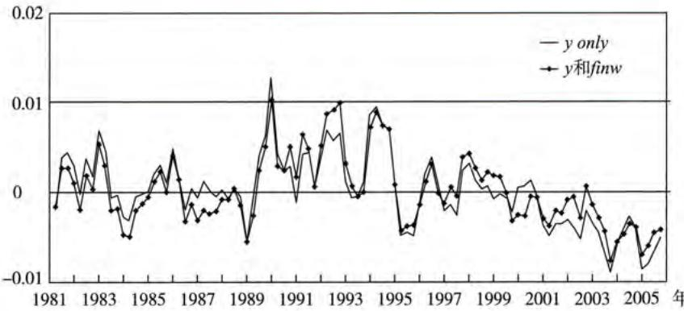  
图2-1 消费收入与资产价格的关系

我们将根据以上讨论，研究图2-2中各序列波动的经济学解释。先来关注 $c _ { t }$ 只回归 $\boldsymbol { y } _ { t }$ 的情形（yonly），大致来说，消费在20世纪80年代泡沫破灭前不久呈断崖式下降之后，又在泡沫破灭后不久的90年代初急剧上升，一直到90年代中期都以高于长期均衡的水平发展。而后在1995年严重恶化后，虽然多少有些振荡回升，但进入21世纪后继续明显恶化。以上所述的收与消费关系的变化与第二节中讨论的表2-1中每五年的实际消费平均增长率数字大致相符。

拿yonly图与考虑了资产价格影响的协整图（y&finw）相对比（第二个图示板），在某种程度上可以理解资产价格给消费带来的效应。由于纳入土地资产后，协整回归方程的解释力提升程度有限，因此，下面只讨论仅包含金融资产的协整回归方程的情形。从1983年前后起，yonly的水平就跌破了零，而 $y$ &finw的水平更低。这暗示着，如果考虑该时期资产价格上升的因素，消费水平再高一些也不足为奇，或者该时期的资产价格上升被视为反常或属于泡沫。诚然，在1985年和1986年，这两者都暂时恢复到了正数范围，但元升值萧条造成家庭收及资产价格暂时性低就以解释这现象。

到了20世纪90年代初，y&finw反而超过了yonly的水平，在1992年到1993年期间，这一倾向尤为突出。也就是说，从中可以看出，这一时期，虽然消费增速确实较泡沫期有所减缓，但和资产价格大幅下跌相比，则相对坚挺。后来两者的显著偏离出现在1999年到2000年期间，这与IT泡沫下的股价暴涨期相对应。最后，2001年到2003年期间，在消费低迷的形势下， $y$ &finw的水平超过了yonly，如果考虑这一时期资产价格低迷的因素，则可以认为消费低的相关解释取得了进步。

# 3.3 时间序列模型下的分析—含消费/资产率的回归程及VAR

表2-3所示的是将图2-2中所绘制的残差项cay,纳右边的解释变量后的消费增长率回归程。从表2-3中可以看出，先消费/资产率系数论在哪种表达式中都是负数，具有统计学意义，存在回归长期均衡的倾向。 $c _ { t }$ 的滞后值均为负数，暗示消费增长率具有轻微的负序列相关性，但其影响不具有统计学意义。另外，融资产价值与可配收的增长率也不具有统计学意义。除去cay，，对消费增长率具有显著解释能力的只有土地价格上涨率。但是，如果考虑土地价格变化率具有相当强的正序列相关性的话，也许就不会让感到那么意外。

表2-3 包含消费/资产比率的消费增长率相关回归方程  

<table><tr><td rowspan=1 colspan=1></td><td rowspan=1 colspan=1>Δy:</td><td rowspan=1 colspan=1>$∆c{-1}$</td><td rowspan=1 colspan=1>cayi-1</td><td rowspan=1 colspan=1>∆finw,</td><td rowspan=1 colspan=1>∆land,</td><td rowspan=1 colspan=1>常数项</td><td rowspan=1 colspan=1>修正R{$</td></tr><tr><td rowspan=1 colspan=1>(1)</td><td rowspan=1 colspan=1>0.005(0.08)</td><td rowspan=1 colspan=1>-0.069(-0.79)</td><td rowspan=1 colspan=1>-0.412（-4.08)</td><td rowspan=1 colspan=1></td><td rowspan=1 colspan=1></td><td rowspan=1 colspan=1>0.004(2.85)</td><td rowspan=1 colspan=1>0.250</td></tr><tr><td rowspan=1 colspan=1>(2)</td><td rowspan=1 colspan=1>-0.049(-0.84)</td><td rowspan=1 colspan=1>-0.071(-0.93）</td><td rowspan=1 colspan=1>-0.416(-4.39)</td><td rowspan=1 colspan=1>0.069(0.88)</td><td rowspan=1 colspan=1></td><td rowspan=1 colspan=1>0.003(1.48)</td><td rowspan=1 colspan=1>0.304</td></tr><tr><td rowspan=2 colspan=1>(3)</td><td rowspan=2 colspan=1>-0.072(-1.27)</td><td rowspan=2 colspan=1>-0.153(-1.80)</td><td rowspan=2 colspan=1>-0.381(-4.37)</td><td rowspan=1 colspan=1>-0.031</td><td rowspan=2 colspan=1>0.402(5.28)</td><td rowspan=2 colspan=1>0.008(3.64)</td><td rowspan=2 colspan=1>0.351</td></tr><tr><td rowspan=1 colspan=1>(-0.49)</td></tr></table>

注： $\Delta c _ { t } = \alpha _ { t } + \beta _ { 1 } \Delta y _ { t } + \beta _ { 2 } \Delta c _ { t - 1 } + \gamma \left( \bar { c } - c \right) _ { t - 1 } ,$

表2-4所的是最多包含4次滞后的VAR的相同分析结果。只有图板（1）中的消费和收两个变量的VAR显示，消费滞后值影响到了当前的消费，虽然只是 $10 \%$ 的水平，但也给当前的收入造成了影响。另一方面，收入滞后值虽然也会影响到当前的收，但对消费完全没有影响。上述结果表明，与消费有关的持久收假说在大逻辑上是成的（Cochrane，1994）。同时，从双变量VAR中，看不到消费/收率解释变量的影响。

# 表2-4 VAR分析

图示板（1）双变量VAR——消费与收入  

<table><tr><td rowspan=1 colspan=1></td><td rowspan=1 colspan=1>∆c{</td><td rowspan=1 colspan=1>Δy,</td><td rowspan=1 colspan=1>∆c{</td><td rowspan=1 colspan=1>Δy,</td></tr><tr><td rowspan=1 colspan=1>lag∆c</td><td rowspan=1 colspan=1>0.7**</td><td rowspan=1 colspan=1>9.7</td><td rowspan=1 colspan=1>0.9*</td><td rowspan=1 colspan=1>5.7</td></tr><tr><td rowspan=1 colspan=1>lagΔy</td><td rowspan=1 colspan=1>75.9</td><td rowspan=1 colspan=1>0.0**</td><td rowspan=1 colspan=1>73.6</td><td rowspan=1 colspan=1>0.0**</td></tr><tr><td rowspan=1 colspan=1>cay -1 (y only)</td><td rowspan=1 colspan=1></td><td rowspan=1 colspan=1>48.7</td><td rowspan=1 colspan=1>23.6</td><td rowspan=1 colspan=1></td></tr><tr><td rowspan=1 colspan=1>修正R{2$</td><td rowspan=1 colspan=1>8.3</td><td rowspan=1 colspan=1>34.1</td><td rowspan=1 colspan=1>7.8</td><td rowspan=1 colspan=1>34.4</td></tr></table>

图示板（2）三变量VAR——消费与收入、金融资产余额  

<table><tr><td rowspan=1 colspan=1></td><td rowspan=1 colspan=1>∆c</td><td rowspan=1 colspan=1>∆y:</td><td rowspan=1 colspan=1>∆finw,</td><td rowspan=1 colspan=1>∆c{</td><td rowspan=1 colspan=1>Δy:</td><td rowspan=1 colspan=1>∆finw,</td></tr><tr><td rowspan=1 colspan=1>lag∆c</td><td rowspan=1 colspan=1>1.5*</td><td rowspan=1 colspan=1>7.2</td><td rowspan=1 colspan=1>64.9</td><td rowspan=1 colspan=1>3.4*</td><td rowspan=1 colspan=1>5.5</td><td rowspan=1 colspan=1>65.6</td></tr><tr><td rowspan=1 colspan=1>lag△y</td><td rowspan=1 colspan=1>23.0</td><td rowspan=1 colspan=1>0.0**</td><td rowspan=1 colspan=1>49.4</td><td rowspan=1 colspan=1>18.7</td><td rowspan=1 colspan=1>0.0**</td><td rowspan=1 colspan=1>50.4</td></tr><tr><td rowspan=1 colspan=1>lagΔfinu</td><td rowspan=1 colspan=1>1.0**</td><td rowspan=1 colspan=1>1.6</td><td rowspan=1 colspan=1>1.8*</td><td rowspan=1 colspan=1>2.4*</td><td rowspan=1 colspan=1>1.4*</td><td rowspan=1 colspan=1>1.9°</td></tr><tr><td rowspan=1 colspan=1>cay-1 (y&amp;fin)</td><td rowspan=1 colspan=1></td><td rowspan=1 colspan=1></td><td rowspan=1 colspan=1></td><td rowspan=1 colspan=1>0.6*</td><td rowspan=1 colspan=1>38.6</td><td rowspan=1 colspan=1>23.6</td></tr><tr><td rowspan=1 colspan=1>修正R^2$</td><td rowspan=1 colspan=1>17.2</td><td rowspan=1 colspan=1>39.8</td><td rowspan=1 colspan=1>6.9</td><td rowspan=1 colspan=1>23.3</td><td rowspan=1 colspan=1>39.7</td><td rowspan=1 colspan=1>5.8</td></tr></table>

图示板(3)三变量VAR——通货膨胀的影响  

<table><tr><td rowspan=1 colspan=1></td><td rowspan=1 colspan=1>∆c{</td><td rowspan=1 colspan=1>∆y:</td><td rowspan=1 colspan=1>∆inw,</td></tr><tr><td rowspan=1 colspan=1>lag∆c</td><td rowspan=1 colspan=1>3.6°</td><td rowspan=1 colspan=1>8.6</td><td rowspan=1 colspan=1>59.4</td></tr><tr><td rowspan=1 colspan=1>lag∆y</td><td rowspan=1 colspan=1>25.3</td><td rowspan=1 colspan=1>0.0*</td><td rowspan=1 colspan=1>54.9</td></tr><tr><td rowspan=1 colspan=1>lag∆finw</td><td rowspan=1 colspan=1>5.8°</td><td rowspan=1 colspan=1>2.7°</td><td rowspan=1 colspan=1>3.0**</td></tr><tr><td rowspan=1 colspan=1>lag∆p</td><td rowspan=1 colspan=1>30.2</td><td rowspan=1 colspan=1>80.1</td><td rowspan=1 colspan=1>23.6</td></tr><tr><td rowspan=1 colspan=1>cay-1 (y&amp;fin)</td><td rowspan=1 colspan=1>0.3**</td><td rowspan=1 colspan=1>38.9</td><td rowspan=1 colspan=1>77.7</td></tr><tr><td rowspan=1 colspan=1>修正R2$</td><td rowspan=1 colspan=1>24.1</td><td rowspan=1 colspan=1>38.0</td><td rowspan=1 colspan=1>7.6</td></tr></table>

注：各表的纵列相当于VAR系统中各变量的相关回归方程。表中列示的数字是对格兰杰因果关系检验结果分别进行滞后变量相关F检验后所得结果的显著性水平（p值）百分比。

接下来，在将图示板（2）中的金融资产余额增长率作为第三变量使用的VAR中，除了消费本身的滞后值之外，金融资产的滞后值与消费/资产比率也都显著解释了当前的消费波动。这与表2-3中没能发现同一时期金融资产余额增长率的影响形成了鲜明的反差。诚然，仅凭滞后变量很难区分金融资产价格与经济在单纯时间上的先导-滞后关系及真正意义上的消费资产效应。但是，将金融资产余额加入双变量VAR中，就能大幅提升解释力（ $8 . 3 / 7 . 8 \%$ $+ 1 7 . 2 \%$ )，而加入前一期的消费/资产比率，结果又有了进一步的提升( $1 7 . 2 \%  2 3 . 3 \% )$ 。此外，虽然历史消费/收比率不具有统计学意义，但历史消费/资产比率能显著解释当前的消费，由此可知，同时包含人力资本在内的资产和消费之间存在比劳动收入和消费更强的相关。

最后，图示板（3）列示了将通胀率加图示板（2）的VAR后的结果。在消费和金融资产余额增长率的计算公式中，通胀率确实使修正决定系数有了略微上升，实际上各自回归方程中的系数都是稳定取正数。但是，从表2-4中的图示板（3）列示的结果来看，没有发现格兰杰因果关系。和表2-3中地价格影响的情形相同，这样本期的通胀率是一个具有较强连续性的序列。因此，与其说通胀率波动真正产了影响，不如说从通胀率相对较的时期，消费和资产价格上升态势也相应较好的度来看，可能只是虚拟变量上的影响。这点是分析利率对消费的影响中更为显著的问题。样本后面部分的三分之都是零利率，基本上不存在利率波动，因此，很难从使一般回归程的分析中导出有意义的结论。

结论就是，外性资产价格上升（下降）很有可能少在某种程度上给消费带来了正（负面）的影响，从这个意义上来说，应当认为在某种程度上存在消费资产效应。但是，资产效应的很难量化判断，同时，欧美的最新研究中也存在认为（Carroll，2004）和认为（Lettau和Ludvigson，2004）这两个对面。

另，劳动收的暂时性变化对消费产影响的可能性事实上可以忽略不计。如同下节要阐述的，尤其是90年代后半期后，劳动收面的冲击极有可能对消费造成了巨大影响，但可以认为，对于家庭收来说，这些都是持久性冲击。因此，持久收假说在大框架下是成的，收平对该时期的消费平变化产了11的影响，故历史收不会对当前的消费产生影响。

# 4“失去的十年”间的家庭收入与消费/储蓄

如第节讨论中对表2-1的阐述所，20世纪80年代后本经济中的可配收与耐消费品的消费出动态相当类似，整体来看，可以说过去四分之一世纪内本消费波动的短期动态不存在大的谜团。但是，第二节中同样也指出，除去20世纪90年代后半期的五年，消费出的增长率几乎总是高于可配收的增长率。既然消费增速于收增速，那么，两者之差的储蓄就必须减少。图2-3绘制了基于这时期GDP统计的家庭储蓄率动态，基本一直呈走低之势，从1981年的 $1 8 . 2 \%$ 到2006年的 $3 . 3 \%$ ，25年间约降低了 $1 5 \%$ 。如果考虑这期间本社会少龄化对年家庭收的影响相对加剧这一因素，这种趋势也就不难理解了。

  
图2-2 储蓄率变化（历年）

（资料来源：根据内阁府《国民经济核算确报》的数据http://www.esri.cao.go.jp/jp/sna/toukei,html制作而成）

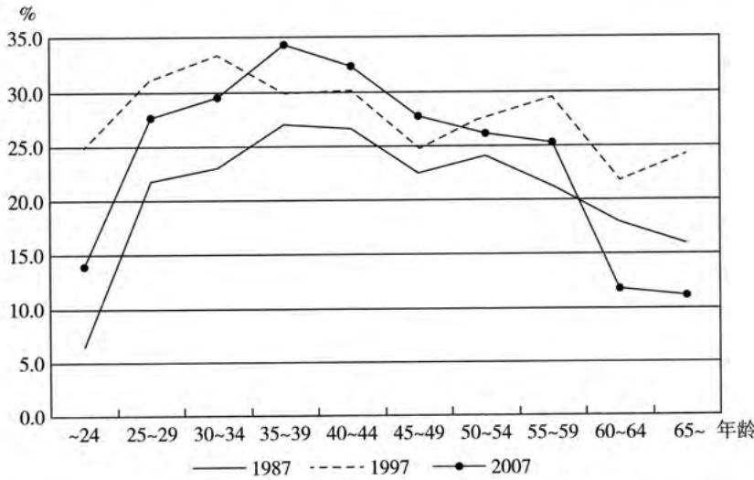  
图2-3家庭收支调查中各年龄组储蓄率每十年的变化

（资料来源：根据总务省《家庭收支调查》的数据http://www.stat.go.jp/data/kakei/index.htm制作而成)

而另一方面，1999—2003年，储蓄率的降幅就超过了 $6 \%$ ，四分之一世纪内的降幅中，有三分之以上集中在六分之的期间内。随后，2003年到2006年突然停下降，稳定在 $3 \%$ 左右。考虑到这点，仅凭龄化因素是法解释清楚90年代末后储蓄率的急剧波动的。下，本就以这问题的分析为线索，思考下平成萧条后的家庭消费及储蓄为。

# 4.1 家庭收调查各年龄组数据分析

图2-4使用家庭收支调查中有2名以上劳动力的家庭的数据，每十年为个单位，在1987年、1997年、2007年这三个时间节点上，对各年龄组的储蓄率进了比较①。首先，以1987年为标杆来看，1997年所有年龄组的储蓄率均出现上升，2007年除60岁以上组外，其余年龄组的储蓄率均出现上升，这意味着劳动的储蓄率动态法解释该期间宏观家庭储蓄率降低的倾向。因此，很显然，该四分之世纪内本家庭储蓄率降低的最原因在于退休后不作龄家庭相对例的急剧上升。

然而，另个需要关注的点在于，在1997年和2007年的较中，退休前后60多岁代的储蓄率降幅相当。诚然，20\~24岁群体的储蓄率也有所降低，但除此之外的世代基本持平，30多岁及40多岁世代甚出现了略微增加的倾向。为了更加详细地考察这一点，我们挑选出了几个具有代表性的年龄组，来看下收与消费出的时间序列数据。

图2-5以五岁为一个年龄段，绘制了25\~29岁、50\~54岁、60\~64岁这三个年龄组从1981年到2007年的收与消费出的时间序列数据②。之所以选取这三个年龄组，是因为它们分别是劳动世代的最早期（25\~29岁）、退休前后一代（60\~64岁）以及收入最高群体（50\~54岁），而且，55\~59岁群体因外派或迁籍，收也会随之减少。所有年龄组都有一个共同的特点，那就是90年代中期出现了收“原”。各年龄组的可配收均在1991年和1992年后显示出了停滞倾向，但经过1997年融危机后，1998年后才真正开始低。

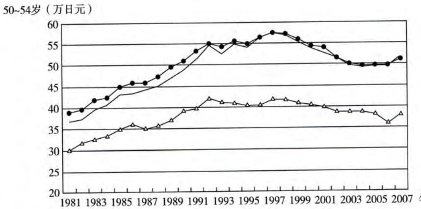

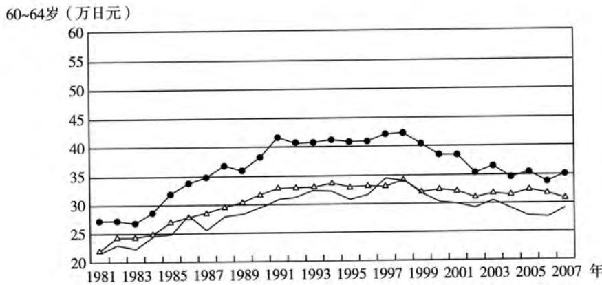  
图2-4家庭收支调查各年龄组收入与消费支出

# 42宏观经济与产业结构

另面，图2-5中60\~64岁年龄组和其他两个年龄组存在明显差异，具体表现在劳动收与消费的相关关系上。对比25\~29岁、50\~54岁这两个年龄组的两者相关可以发现，60\~64岁年龄组的可支配收入降低，但消费出的变化却极其平稳，这点在2000年后的该年龄组身上表现得尤为明显。受此影响，60\~64岁年龄组的储蓄率在1999年到2005年期间骤降近$5 \%$ ，近年则显出了毫向感的振荡。这种动态和表2-3GDP统计中家庭储蓄率的动态致。

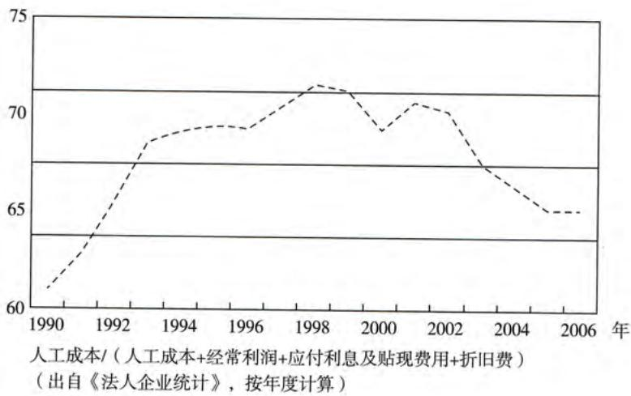  
图2-5 劳动分配率  
（资料来源：劳动政策研究所及培训机构，2008)

表2-5所列的是各年龄组可支配收入及消费支出的波动性及两者的相关系数。波动性方面，可支配收入及消费支出波动性均最小的是50\~54岁年龄组。可支配收入波动性第二小的是25\~29岁，最大的是60\~64岁，差异十分明显，而消费支出方面，50\~54岁、60\~64岁的差异甚微，25\~29岁年龄组的波动则十分突出。另面，表2-5最后列列了过去两年内收增长率和消费倾向的相关系数，和其他年龄组相比，60\~64岁年龄组明显存在负相关。

表2-5实际收入与实际消费的波动及相关  

<table><tr><td rowspan=1 colspan=1>年龄</td><td rowspan=1 colspan=1>可支配收入</td><td rowspan=1 colspan=1>消费支出</td><td rowspan=1 colspan=1>收入增长与消费倾向的相关（*)</td></tr><tr><td rowspan=1 colspan=1>25~29</td><td rowspan=1 colspan=1>2.95</td><td rowspan=1 colspan=1>3.38</td><td rowspan=1 colspan=1>0.08</td></tr><tr><td rowspan=1 colspan=1>50~54</td><td rowspan=1 colspan=1>1.99</td><td rowspan=1 colspan=1>2.50</td><td rowspan=1 colspan=1>0.05</td></tr><tr><td rowspan=1 colspan=1>60~64</td><td rowspan=1 colspan=1>4.00</td><td rowspan=1 colspan=1>2.95</td><td rowspan=1 colspan=1>-0.33</td></tr></table>

资料来源：同图2-4、图2-5。注 $^ *$ ：过去两年内平均可支配收增长率与 $\boldsymbol { \mathrm { c } } / \boldsymbol { \mathrm { Y } }$ 的相关。

# 4.2各年龄组的消费倾向变化——生命周期模型下的解释

如上所述，假设大部分收入波动是长期性的，那么，就可以在一般性持久收=生命周期假说的框架下解释各年龄组消费倾向/储蓄率波动的巨大差异。为了思考这一问题，我们来想一个高度简化的生命周期模型。家庭收支方面，假设人在25岁开始工作，65岁同时退休，80岁同时死亡，没有遗产因素。具体参数是一期五年，利率10%（=年率1%)。假设完全不存在不确定性，那么，每期的家庭最佳消费量肯定是一个让终生收入与终生消费的现值相等的水平。具体计算的话，就会得到82.14这个值。因此，劳动人口每期的消费倾向是一个固定值0.82。这一标杆情况相关数值的归纳见表2-6的图示板(1)。

表2-6图示板（1）假设性生命周期/模型中的收入与消费模式  

<table><tr><td rowspan=1 colspan=1>年龄</td><td rowspan=1 colspan=1>25~29</td><td rowspan=1 colspan=1>30~34</td><td rowspan=1 colspan=1>35~39</td><td rowspan=1 colspan=1>40~44</td><td rowspan=1 colspan=1>45~49</td><td rowspan=1 colspan=1>50~54</td><td rowspan=1 colspan=1>55~59</td><td rowspan=1 colspan=1>60~64</td><td rowspan=1 colspan=1>65~69</td><td rowspan=1 colspan=1>70~74</td><td rowspan=1 colspan=1>75~79</td></tr><tr><td rowspan=1 colspan=1>收人</td><td rowspan=1 colspan=1>100</td><td rowspan=1 colspan=1>100</td><td rowspan=1 colspan=1>100</td><td rowspan=1 colspan=1>100</td><td rowspan=1 colspan=1>100</td><td rowspan=1 colspan=1>100</td><td rowspan=1 colspan=1>100</td><td rowspan=1 colspan=1>100</td><td rowspan=1 colspan=1>0</td><td rowspan=1 colspan=1>0</td><td rowspan=1 colspan=1>0</td></tr><tr><td rowspan=1 colspan=1>消费</td><td rowspan=1 colspan=1>82.14</td><td rowspan=1 colspan=1>82.14</td><td rowspan=1 colspan=1>82.14</td><td rowspan=1 colspan=1>82.14</td><td rowspan=1 colspan=1>82.14</td><td rowspan=1 colspan=1>82.14</td><td rowspan=1 colspan=1>82.14</td><td rowspan=1 colspan=1>82.14</td><td rowspan=1 colspan=1>82.14</td><td rowspan=1 colspan=1>82.14</td><td rowspan=1 colspan=1>82.14</td></tr></table>

图示板（2）冲击种类与消费水平及消费倾向的反应  

<table><tr><td rowspan=1 colspan=1>年龄</td><td rowspan=1 colspan=1></td><td rowspan=1 colspan=1>25~29</td><td rowspan=1 colspan=1>50~54</td><td rowspan=1 colspan=1>60~64</td><td rowspan=1 colspan=1>标杆</td></tr><tr><td rowspan=2 colspan=1>持久冲击</td><td rowspan=1 colspan=1>消费水平</td><td rowspan=1 colspan=1>78.03</td><td rowspan=1 colspan=1>79.28</td><td rowspan=1 colspan=1>80.7</td><td rowspan=1 colspan=1>82.1</td></tr><tr><td rowspan=1 colspan=1>消费倾向</td><td rowspan=1 colspan=1>82.1</td><td rowspan=1 colspan=1>83.5</td><td rowspan=1 colspan=1>84.9</td><td rowspan=1 colspan=1>82.1</td></tr></table>

续表  

<table><tr><td rowspan=1 colspan=1>年龄</td><td rowspan=1 colspan=1></td><td rowspan=1 colspan=1>25~29</td><td rowspan=1 colspan=1>50~54</td><td rowspan=1 colspan=1>60~64</td><td rowspan=1 colspan=1>标杆</td></tr><tr><td rowspan=2 colspan=1>暂时性冲击</td><td rowspan=1 colspan=1>消费水平</td><td rowspan=1 colspan=1>81.4</td><td rowspan=1 colspan=1>80.1</td><td rowspan=1 colspan=1>80.7</td><td rowspan=1 colspan=1></td></tr><tr><td rowspan=1 colspan=1>消费倾向</td><td rowspan=1 colspan=1>85.7</td><td rowspan=1 colspan=1>84.4</td><td rowspan=1 colspan=1>84.9</td><td rowspan=1 colspan=1></td></tr></table>

资料来源：本作者使用文中的参数计算得出。

接下来，假设每期收总是减少至95。这样，对于开始工作的25\~29岁年龄组来说，每期的最佳消费水平为78.03，消费倾向保持0.82不变。另一方面，生命周期中遭遇收入冲击的家庭因为在此前的期间积累了资产，所以相应而，遭受收冲击后的终生可支配收人不会出现明显减少。也就是说，积累的资产越多，越不需要减少每期的消费，因此，年龄越大，出现持久收降低的情况后的最佳消费水平就越高，消费倾向越会相对上升（故储蓄率会减少）。用以上数值示例来计算，如图示板（2）所示，在遭遇收入冲击的时候，50\~54岁家庭每期的消费为79.28，消费倾向为83.5。同时，60\~64岁家庭每期的消费为80.7，消费倾向为84.9。

假设收冲击是暂时性的，又会引起怎样的结果呢？假设只有一期（五年）的收入减少至95，后来又恢复到原有水平，则收冲击发生当期的消费水平及消费倾向的值同样显示在图示板（2）中。如果冲击是暂时性的，那么，由于可以在更长时间内实现消费平滑性，年轻一代的消费水平不会出现明显下降。因此，冲击发生当期的消费倾向会随着年龄的增长而略有下降，反之，在剖面数据中，应该是年龄越大，储蓄率越高。这和图2-4、图2-5中的数据显示的模式恰恰相反，因此，认为日本家庭90年代后遭遇的收冲击是持久性的这看法较为妥当。

根据此前的讨论解释20世纪90年代后的事件，会得到以下结果。90年代末，更具体来说是1997年冬季发融危机后，可配收骤然减少，这然使家庭消费出陷低迷。而且该时期的可配收减少不同于90年代前半期“失去的十年”之初，对50多岁以上的老龄劳动家庭造成的影响更大。这代人遭遇冲击后的工作时间较短，对于他们而，收冲击必然是暂时性的，这就导致在90年代末到21世纪00年代初退休的一代人中，出现了消费倾向急剧上升的情况。可以认为，这是进入21世纪后观察到的家庭储蓄率骤减的主要原因。

GDP统计和家庭收调查中储蓄率数据的偏离是个为知的问题，需要做一定保留。但即便如此，像第4.1小节那种基于家庭收支调查中微观数据的分析，对于像这样理解泡沫破灭后的本总消费动态是极其有的。正如本节中所示，虽然加了“在局部均衡框架下”“定性”等注释，但可以从各年龄组对持久性负收冲击的反应差异的视出发，对90年代后的本总消费动态作出相当程度的合理解释。

将类似以上的分析扩展到一般均衡的框架，并进量化评价，这一工作是未来的课题。Chen、imrohoroğlu和ImrohoroğluIchmogoul（2006）以及Braun、Ikeda和Joines（2008）在度简化的假设下（但分析仍然相当复杂）尝试开展了这类分析。他们在完全预见性假设下，仅凭TFP增长率降低和龄化两项因素，就能以校准的方式充分解释最近日本储蓄率的动态，并且认为未来本储蓄率仍将长期低迷。Chen和Braun等的分析可能确实会成为重要的标杆，但对于这些分析是否真的能解释各种各样的问题，还需要更为慎重的研究①。

# 4.3 可支配收入及消费减少与储蓄率上升的宏观经济学意义

最后，我们从宏观经济的角度出发，思考一下家庭可支配收入的这种波动与随之而来的消费倾向上升=储蓄率降低所具有的意义。按照经常收支储蓄-投资平衡论（如Sachs，1981）来考虑，民间储蓄投资平衡应该等于经常收支与财政收支（财政赤字）之和。

$$
Y = C + I + G + C A
$$

$$
Y - T = C + S
$$

$$
\Rightarrow C A = { \mathit { \Omega } } ( S - I ) { \mathit { \Omega } } - { \mathit { \Omega } } ( G - T )
$$

$$
\Rightarrow C A + ( G - T ) = ( S - I )
$$

Y：GDP，CA：经常收支，S：民间储蓄，I：民间投资，G：政府支出， $T$ ：税款

20世纪90年代中期后，日本一直保持经常收支盈余基调（CA>0）和小渊内阁后的财政赤字倾向（G-T>0)。因此，民间储蓄投资平衡也应该必须保持相应盈余（S-I>0；储蓄过剩）的状态。鉴于进21世纪后家庭储蓄率幅降低，既然不存在民间投资更是极端低迷的事实，那么只剩一种可能。那就是法企业的储蓄增长以弥补家庭储蓄的下降。表2-7列了1996年到2006年家庭部门和民间法人企业部门的储蓄动态，从中很容易看出，这中间有世纪交替，两者的动态乎完全相反。因此，理所当然地，两者之和即民间部门整体的储蓄乎没有变化，这年间的最值与最值（与GDP的值）之差仅为 $1 . 5 \%$ 。

表2-7 家庭储蓄与企业储蓄的变化  

<table><tr><td rowspan=1 colspan=1></td><td rowspan=1 colspan=1>1996</td><td rowspan=1 colspan=1>1997</td><td rowspan=1 colspan=1>1998</td><td rowspan=1 colspan=1>1999</td><td rowspan=1 colspan=1>2000</td><td rowspan=1 colspan=1>2001</td><td rowspan=1 colspan=1>2002</td><td rowspan=1 colspan=1>2003</td><td rowspan=1 colspan=1>2004</td><td rowspan=1 colspan=1>2005</td><td rowspan=1 colspan=1>2006</td></tr><tr><td rowspan=1 colspan=1>(1)家庭</td><td rowspan=1 colspan=1>6.4</td><td rowspan=1 colspan=1>6.2</td><td rowspan=1 colspan=1>7.0</td><td rowspan=1 colspan=1>6.2</td><td rowspan=1 colspan=1>5.2</td><td rowspan=1 colspan=1>3.0</td><td rowspan=1 colspan=1>3.0</td><td rowspan=1 colspan=1>2.3</td><td rowspan=1 colspan=1>2.1</td><td rowspan=1 colspan=1>2.2</td><td rowspan=1 colspan=1>1.9</td></tr><tr><td rowspan=1 colspan=1>(2)金融部门</td><td rowspan=1 colspan=1>1.6</td><td rowspan=1 colspan=1>1.3</td><td rowspan=1 colspan=1>1.3</td><td rowspan=1 colspan=1>1.3</td><td rowspan=1 colspan=1>1.6</td><td rowspan=1 colspan=1>2.1</td><td rowspan=1 colspan=1>2.5</td><td rowspan=1 colspan=1>3.2</td><td rowspan=1 colspan=1>3.2</td><td rowspan=1 colspan=1>3.2</td><td rowspan=1 colspan=1>3.0</td></tr><tr><td rowspan=1 colspan=1>(3)非金融法人部门</td><td rowspan=1 colspan=1>1.8</td><td rowspan=1 colspan=1>2.5</td><td rowspan=1 colspan=1>1.8</td><td rowspan=1 colspan=1>2.8</td><td rowspan=1 colspan=1>3.6</td><td rowspan=1 colspan=1>3.1</td><td rowspan=1 colspan=1>4.3</td><td rowspan=1 colspan=1>4.4</td><td rowspan=1 colspan=1>5.0</td><td rowspan=1 colspan=1>5.0</td><td rowspan=1 colspan=1>4.0</td></tr><tr><td rowspan=1 colspan=1>(4)法人企业部门</td><td rowspan=1 colspan=1>3.4</td><td rowspan=1 colspan=1>3.8</td><td rowspan=1 colspan=1>3.1</td><td rowspan=1 colspan=1>4.1</td><td rowspan=1 colspan=1>5.2</td><td rowspan=1 colspan=1>5.2</td><td rowspan=1 colspan=1>6.8</td><td rowspan=1 colspan=1>7.6</td><td rowspan=1 colspan=1>8.2</td><td rowspan=1 colspan=1>8.2</td><td rowspan=1 colspan=1>6.9</td></tr><tr><td rowspan=1 colspan=1>(5)民间部门储蓄</td><td rowspan=1 colspan=1>9.8</td><td rowspan=1 colspan=1>10.1</td><td rowspan=1 colspan=1>10.2</td><td rowspan=1 colspan=1>10.3</td><td rowspan=1 colspan=1>10.4</td><td rowspan=1 colspan=1>8.2</td><td rowspan=1 colspan=1>9.8</td><td rowspan=1 colspan=1>9.8</td><td rowspan=1 colspan=1>10.3</td><td rowspan=1 colspan=1>10.4</td><td rowspan=1 colspan=1>8.8</td></tr></table>

注：均为与GDP的比值(%)，(4)=(2)+(3)，(5)=(1)+(2)+(3).

“失去的十年”之初，日本企业主要采用控制招聘新人的方法应对萧条。20世纪90年代末后正式开始精简人员，降低劳动力成本。从宏观度来看，资金流上的表现为增加企业储蓄，而在库存上则减少负债。受此影响，家庭到手的可支配收入大幅缩水，老龄劳动者家庭则尤为明显。如图2-6所示，这也与该时期本劳动分配率不断低这一事实相符。但在2004年后，随着经济复苏，家庭收停止下滑，最终家庭消费支出的减速及储蓄率的减速也显著放缓。

近年来本企业储蓄增加的现象在经济学上究竟有什么意义？这需要我们认真思考①。CorporateVeil的思想是比较极端的，这一思想认为法企业最终属于股东=家庭部门的组成部分，因此，无需将家庭储蓄和企业储蓄分开考虑。也就是说，只考虑民间储蓄整体即可。如果是这样的话，既然90年代后半期后的民间整体储蓄几乎没有变化，那么，就不应该发生任何引起轰动的现象。另一方面，如果站在强调劳动者和法人企业=资本家的差异的立场，那么，随着近年来日本企业精简人员，就应该发生了收从前者到后者的再分配。

CorporateVeil式思维不仅适于企业，也同样适于政府。使上述Chen等（2006）和Braun等（2008）的动态般均衡模型进分析时，认为个国家的净储蓄，即政府部门和民间部门的净储蓄实际上是家庭收最优化问题的结果。在这一点上，在家庭储蓄率到底有何意义这一问题的认识方面，它与本文这种心照不宣地将民间家庭、民间法人企业及政府部门作为各自独立的决策主体看待的传统立场有着很大的不同。换而言之，可以认为他们照不宣地假定巴罗-李嘉图等价命题与CorporateVeil双双成。因此，虽然90年代后半期，日本的民间部门整体储蓄率基本上没有变化，但是，若同样用净值来看政府部门的情况，将20世纪90年代后半期后不断增加的财政赤字反映进去后，日本全国的净储蓄率出现了减少。

从凯恩斯主义的场来看，可能有人会批判Chen等和Braun等的分析建立在极不现实的假定基础上。但是，讨论并非如此简单。第一，假如采取财政措施振兴经济这一稳定化政策在某种程度上被纳了家庭收支行为模式中，那么，包括政府部门在内的消费/储蓄最优化思维就具备一定的妥当性。

第二，随着老龄化社会的到来，医疗及护理服务在经济中所占的比重大幅上升，就会出现一个模棱两可的问题，即上述服务需方应当认为是家庭还是政府？也就是说，即使在统计上政府是最终消费者，但类似于仅限老龄家庭享受的医疗护理类公共财产及服务，其实际消费者应当认为是家庭。这时，仅采用基于统计上的家庭消费支出的分析，恐怕会低估家庭的消费水平及效用。实际上，国民经济核算中向93SNA过渡时的最大变更是以社会保障为代表的收入再分配的相关事项（如滨田，2001），包括经济统计与经济理论的统一性问题在内，这一问题今后需要做进一步的研究。

# 5结束语

本文主要使用宏观数据和时间序列模型，对20世纪80年代后的日本消费动态进行了分析。20世纪80年代后半期到90年代初，日本家庭消费的特点在于，资产价格泡沫的形成与破灭产生了一定的资产效应。虽然耐用消费品的消费随着资产价格的起落而急剧震荡，但从消费支出整体情况来看，产生的资产效应并不显著。但是，如果考虑消费在整体经济中所占的比重，那么即使资产效应甚微，也对整体经济产生了巨大影响，这一影响是不可否认的。

与此相对，在20世纪90年代中期后“失去的十年”中，GDP和家庭收及消费的关系变化是一大特点。1997年金融危机爆发前，相比资产价格低迷和经济恶化，家庭收入及消费双双上扬，但20世纪90年代末后，随着企业正式精简人员，和整体GDP相比，家庭收入与消费的增速反而急剧下降。

另一方面，和“失去的十年”的前五年相比，这一时期日本企业的人员精简主要集中在老龄劳动家庭，他们没有因为收入原因而压低消费，最终使得消费倾向上升。因此，在21世纪初，这因素很可能超过了少龄化对长期趋势的直接影响，导致了储蓄率的大幅下降。

为了分析宏观消费，本文使用了各年龄段的收入及消费数据，但完全没有涉及相同年龄组中的收及消费不公问题。20世纪90年代后，本经济差距拉大，这本身就是一个非常重要的问题，同时也隐含着对宏观消费造成了巨影响的可能性。于在短期和长期两对整体宏观经济的影响，则期待未来的研究取得进展。

# 参考文献

貞廣彰(2005)，戦後本のマク口経済分析」東洋経済新報社.

浜田浩児(2001），『93SNA $\oslash$ 基礎国民経済計算の新体系東洋経済新報社.

労働政策研究・研修機構（2008），ユスフル労働統計労働統計加

指標集(2008年版）』，http://www.jil.go.jp/kokunai/statistics/kako/. Aono, Kohei and Tokuo Iwaisako(2008), "The Consumption-Wealth Ratio, Real Estate Wealth, and the Japanese Stock Market," July 2008, IER Discussion Paper, #A. 504.

Braun, R. Anton, Daisuke Ikeda, and Douglas H. Joines(2008), "The saving rate in Japan: Why it has fallen and why it wil remain low." CARF Working Paper, CARF-F-117January 2008, University of Tokyo.

Carrl, Chritopher D.(1997), "Buffer Stock Saving and the Life Cycle/Permanent Income Hypothesis," Quarterly Journal of Economics, 112(1), pp. 1-56.

(2004), “Housing Wealth and Consumption Expenditure," Paper Prepared for Academic Consultants Meeting of Federal Reserve Board, January 2004, http://econ. jhu. edu/people/ccarroll/papers/FedHouseWealthv2. pdf

Chen,Kai,Ayseimohoru, andSelo imrohoru(206),"The Japanese Savi Rate," American Economic Review, 96(5), pp. 1850–1858.

Cochrane, John H.(1994),"Permanent and Transitory Components of GNP and

Gonzalo, Jesus, Tae-Hwy Lee, and Weiping Yang(2008), "Permanent and Tran

sitory Components of GDP and Stock Prices: Further Analysis," Macroeconomics and Finance inEmerging Market Economies, 1 (1), pp. 105-120.   
Hall, Robert E. (1978), "Stochastic Implications of the Life Cycle-Permanent Income Hypothesis: Theory and Evidence," Journal of Political Economy, 86 (6), pp. 971–987.   
Lettau, Martin and Sydney C. Ludvigson (2001 ), “Consumption, Aggregate Wealth, and Expected Stock Returns, Journal of Finance; 56(3), pp. 815–849. —(2004), "Understanding Trend and Cycle in Asset Values: Reevaluating the Wealth Effect on Consumption," American Economic Review, 94(1), pp. 276-299.   
Ludvigson, Sydney C. and Charles Steindel (1999), "How Important is the Stock Market Effect on Consumption?" FRBNY Economic Policy Review1999, 5 (2), pp. 29–51.   
Parker, Jonathan and Christian Julliard (2005 ), " Consumption Risk and Cross-Sectional Returns," Journal of Political Economy, 113(1), pp. 185-222.   
Poterba, James M. (1987), "Tax Policy and Corporate Saving," Brookings Papers on Economic Activity, 18(2), pp. 455–516.   
Romer, David, (1996), Advanced Macroeconomics, Mc Grawhill.   
Sachs, Jeffrey D.,(1981), "The Current Account and Macroeconomic Adjustment in the1970s," Brookings Papers on Economic Activity, 1981 (1), pp. 201-282.   
Zeldes, Stephen P. (1989), "Optimal Consumption with Stochastic Income: Deviations from Certainty Equivalence," Quarterly Journal of Economics, 104 (2),pp. 275-298.

# 3从泡沫期到通货紧缩期家庭预防性储蓄行为的变化

石井达也

# 导语

从20世纪90年代到21世纪，在人口结构老龄化的长期趋势背景下，国民经济核算体系中统计的宏观经济家庭储蓄率从 $1 5 \%$ 左右下降到不足 $5 \%$ 。另一方面，以劳动者家庭为基础的“家庭收支调查”显示，家庭储蓄率一直在$2 5 \% - 3 0 \%$ 的范围内上下浮动。现有研究指出，收入、金融资产余额和人口结构是家庭储蓄率的长期趋势因素，而消费者对未来收入增长方式和就业环境的心理趋势是偏离趋势的因素。消费者心理被认为是通过“预防性储蓄动机”来影响消费和储蓄行为，而“预防性储蓄动机”是为了应对未来收入下降的风险。

本文重点讨论家庭的储蓄行为及其变化，特别是预防性储蓄。首先，与未来就业形势有关的风险对储蓄率有显著影响，但其影响从20世纪90年代后期到21世纪有所下降。在与就业有关的指标中，完全失业率比新职位空缺对储蓄率的影响更大。前者更多反映了劳动力市场的结构性问题，而新职位空缺则跟随经济周期，在非正式就业迅速增加之前的复苏阶段即出现恶化。20世纪90年代末劳动力市场发生结构性变化之前，失业风险是影响预防性储蓄的一个重要因素。其次，就股票等价值变化较大的资产来看，其资产价值变化风险对储蓄率的影响并不明显。在21世纪，股票和股权投资对家庭金融资产变化率的贡献大于现金和存款，但这类资产的类型构成变化对预防性储蓄动机没有影响。①

# 1前言

根据国民经济核算，在整个21世纪90年代，家庭储蓄率从 $1 5 \%$ 下降到$10 \%$ 左右，自2000年以来持续下降，最近跌至不足 $5 \%$ 。这被认为是由于人口结构老龄化的长期趋势，以及在其生命周期内提取储蓄的几代人的比例增加。为了排除这些人口结构变化的影响，在“家庭收支调查”（总务省）中，以劳动者家庭为基础的储蓄率变化显示，这种变化是渐进的，一直保持在 $2 5 \% - 3 0 \%$ 之间，在1998年以前呈上升趋势，到2005年为呈下降趋势①。

  
注：1.根据总务省“家庭收支调查”编制。2.储蓄额的定义是可支配收入减去消费支出，储蓄率是储蓄额除以可支配收入。  
图3-1可支配收入、储蓄额和储蓄率

正如《2006年版经济财政白皮书》所研究的，家庭储蓄率长期变化背后的因素包括人口结构的老龄化、收入和金融资产余额。《白皮书》还指出，由这种长期因素决定的趋势与实际储蓄率之间的差距被认为是受消费者心理趋势的影响，而且这种差距与消费者态度指数的变化基本一致，该指数是“消费趋势调查”（内阁府）中消费者心理的一个指标②。

# 52宏观经济与产业结构

本的的是利“消费趋势调查”的结果，通过“就业环境”“收增长式”“资产价值增长式”等问题项来分析储蓄率偏离长期趋势的因素，并阐明从泡沫破灭后到通货紧缩期的家庭储蓄行为及其变化特点。

理论上，在持久收入假说下，家庭通过改变每期的储蓄额来调节其持久收入水平，以应对暂时的收入波动。当前消费的最佳水平被确定为在不牺牲未来消费的情况下在当前可以达到的最大平。与确定的情况相比，当未来收存在不确定性时，“预防性储蓄”被认为是为未来可能下降的收而做的准备。本所关注的对储蓄率偏离趋势背后的因素的分析，相当于对预防性储蓄背后的因素的分析。本利“消费趋势调查”中公布的上述三类认识指数（“就业环境”“收增长式”“资产价值增长式”）作为不确定性指标（风险指标），来验证对储蓄率的解释能力。

现有研究在家庭预防性储蓄的决定因素方面进了实证分析，一项使用本数据的研究指出，就业风险在20世纪90年代有显著影响。作为就业面的风险指标，有的研究使用就业环境的心理指标，也有的研究使用将心理指标转化为失业率和有效职位空缺率的预期值的变量。从1993年10月至1997年5月的经济扩张阶段来看，新职位空缺数有所改善，而完全失业率继续恶化，们认为完全失业率上升（恶化）反映了长期的结构性变化，而家庭储蓄率在这一时期上升。本还验证了就业的这些周期性或结构性因素是否通过消费者理渠道对储蓄率产重大影响①。

就21世纪初以来对家庭融资产增长速度的贡献，与现和存款相比，不易被视为持久收入的股票和股权投资的比例有所增加。消费者对难以被视为持久收的资产价值变化的理趋势可能是影响预防性储蓄的个因素。从这个度来看，本还验证了通过消费者对资产价值增长式的理对预防性储蓄的影响。

本接下来的结构为：第二节概述了现有研究。讨论了以前关于持久收假说和预防性储蓄动机的理论研究，介绍了利本数据对预防性储蓄动机的主要实证分析。第三节解释了本的分析方法。以劳动者家庭为基础的家庭收调查的家庭储蓄率作为被解释变量，可配收和持有的融资产余额被作为趋势部分的解释变量，完全失业率、新职位空缺数和消费趋势调查这三项认识指数被作为偏离趋势部分的解释变量，以验证这些指数的解释能。第四节描述了分析结果。结果显，作为就业环境恶化的风险指标，完全失业率是显著的，新职位空缺数是不显著的。然而，事实表明，这两个指标对储蓄率的影响最近都有所减弱。至于与资产价值增长式恶化有关的风险指标，心理指标“资产价值增长方式”的同比差异是显著的，而该指标的方差同比差异则不显著。2000年以后的情况也是如此，表明没有证据表明股票等资产的风险指标对储蓄率有影响，因为这些资产的价值波动很大。第五节总结了整体情况，并概述了家庭储蓄为的特点及其从泡沫期到通缩期的变化。

# 2现有研究

# 2.1 持久收入假说和预防性储蓄动机的理论研究

关于消费与收入的关系，实证研究首先发现，与凯恩斯主义的消费函数相比，短期和长期的关系是不同的，因为凯恩斯主义的消费函数只考虑到当前的收人。为了对它们进行统一的解释，已经进行了理论研究，为宏观消费函数提供微观基础，不仅考虑到当前的收入，而且考虑到未来的收入。莫迪利安尼的生命周期理论和弗德曼的持久收入假说是这类研究的代表。

最早提出持久收入假说的弗里德曼（1957）认为在某一时间点持有的资产和未来收入的折现值之和就是个人的总资产，将总资产范围内的最大年消费额定义为持久收入，并表明消费额是持久收入的一个固定百分比。然而，最初的持久收入假说在实证分析方面存在问题。由于持久收入无法直接观察到，所以当使用统计估算值分析消费和收入之间的关系时，消费和收入本身的关系是无法区分的。此外，只关注某一时点的持久收入和消费之间的关系，这一办法没有捕捉到由于储蓄增加而持有的资产增加对未来收入的影响。

对此，霍尔（1978）则将持久收入假说的理论视为家庭收支效用最大化问题，并推导出消费的“欧拉方程”，即当前消费的边际效用等于储蓄（未来消费）的边际效用，作为优化条件，消费随时间变化是不可预测的，消费是“随机漫步”。这也表明，持久收入假说可以通过统计学上验证消费的随机漫步来检验。然而，随后的实证研究发现，消费的随机漫步理论有两个矛盾之处。第一，有证据表明“过度敏感”，即消费的变化受到过去收的影响。第二，存在着“过度平滑”，即消费的波动范围小于持久收入的波动范围。如果消费是随机漫步，过去的收入对未来的消费没有预测能力，消费和持久收入的差将是相等的，但许多统计测试与此相矛盾。

另一方面，关于预防性储蓄的理论研究主要是在20世纪70年代以来取得的进展。最初，研究仅限于两个时期的简单模型，即现在和未来，但自90年代以来，开始使用无限期模型进研究。霍尔（1978）在一个没有不确定性的“确定性等价模型”中提出消费的随机漫步理论，其中效用函数以消费的二次函数的简单形态表示。相反，当效用函数的三阶导数、即边际效用的二阶导数的符号为正时，存在与未来消费的不确定性相关的预防性储蓄动机。在这种情况下，边际效用函数是严格凸函数，当消费从低水平下降时，边际效用的增加幅度大于消费从高水平额外增加时的边际效用下降幅度。因此，如果我们考虑未来没有不确定性时的消费，与存在不确定性时的消费和预期值意义上与此相等的消费水平相比，在后一种不确定性的情况下，边际效用更大，因此，在存在不确定性的情况下，有动力增加未来的消费，也就是增加储蓄，这就是预防性储蓄的动机。

预防性储蓄动机发挥作的情况可以常数绝对风险厌恶（CARA）效函数来表。常数绝对风险厌恶表为 $u ^ { \prime } / u$ ，其中 $u$ 是效用函数。例如，Ca-ballero（1990）表明，在CARA效用函数被表示为以下公式（参数 $\alpha$ 为常数绝对风险厌恶）时分析了预防性储蓄动机：

$$
u = - \exp \big ( - \alpha \times c \big )
$$

这个效函数有个正的三阶导数，这意味着可以表达预防性储蓄的动机。

也有研究使常数相对风险厌恶（CRRA）效函数。在CARA效函数中，无论消费水平如何，储蓄的激励是恒定的，而在CRRA效用函数中，储蓄的激励随着消费平的提而降低。在CRRA效函数的情况下，很难对欧拉方程进分析求解，证明该模型的一个可能的方法是通过欧拉方程的泰勒展开估算近似值，但已经证明，通过使用欧拉方程二阶泰勒展开的近似值进估算，不能拒绝确定性等价模型（Dynan，1993）。而这是否是现实的，令怀疑。由于这个原因，经常使用模拟验证的法。

Carroll（1997）提出了个“缓冲存货储蓄模型”，在CRRA效函数下，常数绝对风险厌恶随着消费的增加而减少，预防性储蓄起到了调整资产持有量的作用，就像它们是对不确定的未来收入的缓冲。在这个模型中，消费者采取动调整他们的资产持有量和他们的持久收入之间的比率，表明在他们的收下降到接近零的情况下，存在着储蓄的预防性动机。它还表明，随着资产持有量的增加，预期消费水平的提高，对未来收入风险的审慎程度降低。该模型可以通过将资产余额和持久收率与风险指标进回归来验证。原、居（2004）认为这个“缓冲存货储蓄模型”围绕平均值进了线性近似，并认为与消费的随机漫步理论相盾的过度敏感和过度平滑

都可以从理论上得到解释。

# 2.2 使用本数据进的实证分析

利用美国的数据积累了大量关于预防性储蓄的实证研究。使用日本数据的实证分析包括研究使用宏观数据作为家庭消费和储蓄以及未来收入的不确定性指标的研究（小川，1991；齐藤、白塚，2003；石原、土居，2004；等等）和使用微观数据的研究（村田，2003；等等)。

小川（1991）用预期实际可支配收增长率的方差作为收入风险的指标，分析了1974—1986年期间它对储蓄率的影响，得到了收入风险的增加会提高储蓄率的正相关关系。收入风险被定义为家庭之间的预期实际可支配收入增长率的方差，并得到作为家庭之间预期通货膨胀率的方差和家庭之间预期名义可支配收入增长率的方差之和。资产余额没有作为解释变量列估算方程①。

齐藤、白塚（2003）将根据当前不确定性的程度和规模的储蓄动机描述为预防性动机，除此之外，还有一种“观望选择”的动机，即只在预期未来不确定性存在和未来不确定性已经解决的两种状态中的前者进行储蓄。强调与观望动机和预防性储蓄动机之间的区别。例如，考虑状态A和状态B，两者的风险指标水平相同，但前者的风险在上升，后者的风险在最危险的状态后下降。由于风险水平相同，A和B都有相同的预防性储蓄动机，但只有A有作为观望选择的储蓄动机，因为在A中风险指标即将上升，而在B中不确定性已被消除。作为收入的风险指标，就业统计的指标（如完全失业率、新职位空缺率、有效职位空缺率）和消费者心理指标（如“消费趋势调查”的组成指标）被用来研究19831999年期间国民经济核算体系中个别风险指标对家庭储蓄率的影响。结果显示，在20世纪80年代，作为预防性动机的职位空缺率和心理指标是显著的，而在90年代，作为观望选择的职位空缺率和作为预防性动机的心理指标是显著的②。

石原、土居（2004）考虑到“缓冲存货储蓄模型”，将资产余额纳储蓄率估算方程，并研究了19741998年期间“家庭收调查”中风险指标对劳动者家庭的储蓄率的影响。如小川（1991），当预测的实际可支配收增长

# 56宏观经济与产业结构

率的家庭之间的差被用作收风险指标时，结果显示该指标的影响在20世纪80年代后下降了。在这方面，研究指出了这样种可能性：该指标在人们对未来收入增长方式的预期不同的意义上捕捉到了收人风险，但没有捕捉到人们一致预期未来收入下降的风险。此外，作为就业风险的指标，根据消费者对就业环境的心理指标，将有效职位空缺率和完全失业率转换成家庭之间的预期值，并对1986一1998年期间的情况进行了研究，结果显示，对储蓄率有显著影响。用预期实际可支配收增长率作为收风险指标，而不是上述预期实际可配收增长率的家庭之间的方差，并将收和就业风险指标都纳估算方程，结果显示，就业风险指标是显著的，收入风险指标不显著。

村（2003）利19931998年期间“消费者固定样本调查”（家庭经济研究所）中的汇总数据，研究了消费者对公共养老金和经济前景的担忧对所持资产和持久收的比率的影响。对于整个样本来说，对公共养的焦虑的结果并不显著，但对于不与父母同住或不接受经济援助的家庭来说，其结果明显增加了资产余额。按资产类型来看，在融资产中，对储蓄、私人养和保险有明显的影响，但对有价证券没有影响，这表明家庭正在积累低风险的资产，如储蓄，以此来应对公共养老的不确定性。公共养老无保障对包括住房和土地等实物资产在内的总资产的影响也不显著，这表明住房和土地等主要用于居住的实物资产并不能作为调整预防性储蓄的段。没有发现对经济前景的显著影响，其原因包括经济衰退和对收风险的看法之间可能存在差异①。

# 3分析方法

# 3.1 分析模型

在上述现有研究的基础上，考察了预防性储蓄动机对家庭储蓄率的影响，以阐明家庭储蓄为的特点及其在泡沫破灭后到通货紧缩时期的变化。为了排除人口结构老龄化等长期因素，并关注与长期趋势的差距，使了“家庭收调查”中的劳动者家庭消费和储蓄额，而不是基于国民经济核算体系中的家庭消费支出。具体来说，利用每个劳动者家庭的季度月平均数据，将储蓄额定义为可支配收入减去消费支出，然后除以可支配收入，得到储蓄率。

对于估算方程，参考原、土居（2004），明确地将持有的家庭资产视为一个储蓄函数：

其中， $s$ 为储蓄额, $Y$ 为可支配收， $\mathbb { W }$ 为资产余额。

假设是线性的，储蓄率函数是通过两边除以可支配收入得到

基于预防性动机的家庭未来收人的不确定性指标作为一个变量进入储蓄率函数 $f$ 中。纳入资产余额是基于“缓冲存货储蓄模型”，该模型认为，预防性储蓄是为了作为未来不确定收入的缓冲，并调整资产余额的存量水平。所有数据都是原始序列，第二、第三和第四季度都有季节性虚拟变量。

来自“消费趋势调查”的消费者心理指标被用来制定未来收的风险指标。该调查向全国的家庭询问他们对未来生活条件的消费态度。主要问题是在未来六个的“生活条件”“收增长方式”“就业环境”和“购买耐消费品的决定”。这项调查的结果以消费者意识指标的形式公布，而“消费者态度指数”则是由这些结果综合而成并公布。此外，还调查了一个问题项“资产价值的增长方式”，尽管它不是消费者态度指数的个组成部分。所有这些问题的回答都是从“更好”“稍好”“无变化”“稍差”“更差”的五级评分中选择，每个五级评分从最好到最差依次为“1”“0.75”“0.5”“0.25”和“0”。每个选项的回答数量作为权重的加权平均值就是各自的消费者意识指标。消费者态度指数是一个综合指数，它是通过简单地将四个构成项目中每个项目的消费者意识指标平均化得到的数值。本文分析中使用的数据是一般家庭的调查结果，从总家庭中排除了单身家庭，并且是1992年以来的季度原始序列数据，当时有可比较的时间序列①。

  
图3-2“消费趋势调查”中每个认识指标的趋势

注：根据内阁府“消费者动向调查”（经季节性调整）编制。

  
图3-3“资产价值增长方式”趋势

注：根据内阁府“消费趋势调查”（经季节性调整）编制。

# 3.2 不确定性指标

在储蓄率函数的估算程中要包括的第个风险指标是收风险指标许多现有研究都认为收风险是未来收前景的变化，并使预期收增长率的家庭之间的方差。之所以用未来收入预期值的方差作为收风险指标，是基于这样的想法：一个预测未来收会上升，而另个预测会下降，这种情况是一种高度不确定的情况。然而，有人指出（石原、土居，2004），们致预测未来收下降的情况也可能是个增加不确定性和鼓励预防性储蓄的因素，因此，收入风险指标的选择，并没有确定的评价标准。

另一方面，上节介绍的使用日本数据的现有研究考察了20世纪80年代到90年代从收预期的方差中观察到的收风险对储蓄率的影响。由于本也考察了20世纪00年代的情况，所以决定暂时采“收增长式”的差作为风险变量。具体来说，从“更好”到“更坏”的5点评分制所给的分数与作为这些分数的加权平均值的认识指数值之间的差值的平方进加权平均，以回答的数量作为权重。

储蓄率函数的第个风险指标是关于就业风险的指标除了就业环境的心理指标外，现有研究中的典型指标包括完全失业率和新职位空缺、有效职位空缺数（或有效职位空缺率）。一些人把它们作为直接风险变量，而另一些则将理指标转换为失业率或职位空缺率预期值的指数作为风险变量。现有研究发现对20世纪80年代和90年代的储蓄率有重大影响，在预测就业环境时使用了预期值而不是家庭之间的方差，其思路是由于就业风险导致未来收入的不确定性增加，在劳动力市场出现失业率上升和职位空缺率下降等现象的情况下，鼓励预防性储蓄。在这些现象下，目前失业的越来越多，而即使自己没有失业但对未来就业感到不安的人也越来越多，增加了未来不能获得收入的概率。这种情况下，未来收入的方差很大，未来收入的风险也在增加。因此，未来收入的风险被认为是遵循对就业环境预测的家庭之间的预期变动。相反，对就业环境的预测在人们之间是不同的，家庭之间的方差在增加，这并不一定意味着未来收的方差在增加。

另方面，关于失业率和职位空缺，对20世纪80年代和90年代的现有研究发现，任何一个指标对储蓄率的影响一般都很显著。然而，仔细观察这两个指标在90年代的趋势，就会发现他们在不同时期的变化相当不同。具体来说，在1993年10月至1997年5月的经济扩张期，差异更为明显。虽然新职位空缺数增加，表明就业市场有所改善，但完全失业率却呈现上升趋势，表明情况有所恶化。这是因为在非正式就业比例迅速增加之前，劳动力市场尚未发生真正的结构性变化。新职位空缺随着经济复苏周期性地变化，由于在解决劳动力供需不匹配方面缺乏进展，失业率继续恶化。因此，本文的分析没有分别考察完全失业率和新职位空缺数对储蓄率的影响，而是将它们同时作为变量纳估算方程，并从周期性或结构性因素方面考察就业风险对预防性储蓄的影响①。

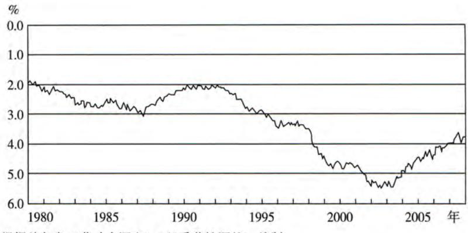  
图3-4 完全失业率

注：根据总务省“劳动力调查”（经季节性调整）编制。

  
图3-5新就业人数

  
图3-6 有效职位空缺率

  
图3-7正式就业和非正式就业人数的变化

注：根据总务省“劳动力调查细目表”编制。

注：1.根据总务省“劳动力调查细目表”编制。

2.2001年及以前根据“劳动力调查专项调查”（每年2月）编制；2002年及以后根据“劳动力调查细目表”（每年平均）编制。

  
图3-8 非正式就业比率

3.正式就业人数指“除董事外的雇员人数”中的“正式职员和雇员”人数；非正式就业人数为“除董事外的雇员人数”中的“非正式职员和雇员”人数（“非全日制员工、临时员工”“劳务派遣单位的派遣员工”“合同工和返聘员工”和“其他”的总和）。

基于上述情况，将使三个指标作为与就业风险有关的变量，即“消费趋势调查”的“就业环境”指数（以回答数量为加权平均值计算的公布值）、完全失业率和新职位空缺数。

储蓄率函数的第三个风险指标是个关于资产价值增长式的指标。在现有研究中，石原、土居（2004）强调了资产余额的作用，鉴于以下几点，资产价值增长式的理指标可能也会对预防性储蓄产影响：在20世纪00年代，对家庭持有的融资产增长率的贡献来看，股票和股权投资对家庭持有的融资产增长率的贡献大于现和存款的贡献，后者的利率非常低。由于股票和其他资产价值的变化，家庭持有的资产价值的增加是非常不确定的，不太可能被视为持久收入的增加，因此，资产余额的增加不太可能成为减少预防性储蓄和增加消费的因素。

另一方面，这种资产的价值变化不太可能与持久收的变化无关。即使波动很大，如果持久收入根本不会增加，则没有持有这类资产的理由。因此，消费者对诸如股票等资产价值增长式的理有可能与未来收的不确定性有关，并影响到预防性储蓄的动机①。

为了检验上述假设，将“消费趋势调查”的“资产价值增长式”指数（以答复数量为权重计算的加权平均值的公布值）的同差异作为风险变量。除此之外，也“资产价值增长式”差的同差异作为风险变量。·在下节对分析结果的解释中，将更详细地讨论使两个变量的问题。

# 3.3 资产余额数据的构建

从2002年起，资产余额的劳动者家庭季节数据可从“家庭收调查”的储蓄和负债部分获得，关于流动消费和储蓄额的数据也是如此，因此使用了这些数据。对于2002年之前的数据，只公布了然年的数据，尽管有一个前身调查，即原“储蓄趋势调查”。由于“家庭收调查”和“储蓄趋势调查”的样本量不同，对于“家庭收调查”中流动储蓄额的年累积值和“储蓄趋势调查”中存量资产余额的年增加值进较，通常是不致的。因此，对于2001年及以前的数据，资产余额的季度数据是通过将相关年份的“储蓄趋势调查”中的资产余额年增加额乘以“家庭收调查”储蓄额每个季度在四个季度中的占比来估算的。

  
注：根据日本银行“资金循环统计”编制。  
图3-9各类家庭金融资产的同比贡献率

  
图3-10家庭的净金融资产余额

资产余额数据被定义为融资产余额中资产减去负债后的净值。具体来

# 64宏观经济与产业结构

说，从2002年起，使用“家庭收支调查”中“储蓄和负债部分”“储蓄”减去“负债”的值。在2002年之前，季度储蓄额流量的净值是“家庭收支调查”中“融资产净增长”“土地和房屋债务净减少”“其他债务净减少”“分期付款购买贷款净减少”“次性付款购买贷款净减少”之和，而每个然年年底的融资产余额被定义为“储蓄趋势调查”的“储蓄”余额减去“负债”余额后的金额①。

在以这种方式构建资产余额数据时，在两个统计数据之间的一致性和准确性方面仍然存在一些问题，例如，在某些年份，基于“家庭收支调查”的年期流动总量和基于“储蓄趋势调查”的年期存量变化的符号是不同的。本分析中的问题和议题将在下节对分析结果的解释中详细讨论。

# 4分析结果

# 4.1 估算结果和摘要

使用上一节所述法对储蓄率函数进估算的结果见表3-1。估算法是普通最二乘法（0LS)。除了1992—2007年这一可获得数据的整个时期之外，样本期还包括2002年及之后的时期以及2001年及之前的时期，前者可获得“家庭收调查”中的储蓄和负债部分的数据，后者有必要构建估算数据，以便观察资产余额数据的准确性的影响。此外，设置2000年及之后的时期是为了观察21世纪的影响，当时股票和股权投资在对家庭持有的金融资产增长率的贡献方面变得比现金和存款更大。此外，1998年及之后，劳动力市场开始出现以正式就业增加为代表的全面的结构性变化。

表3-1 储蓄率函数的估算结果  

<table><tr><td rowspan=1 colspan=1>样本期</td><td rowspan=1 colspan=1>1992-2007</td><td rowspan=1 colspan=1>2002-2007</td><td rowspan=1 colspan=1>1992-2001</td><td rowspan=1 colspan=1>2000-2007</td><td rowspan=1 colspan=1>1998-2007</td></tr><tr><td rowspan=2 colspan=1>常数项</td><td rowspan=2 colspan=1>51.14**(11.93)</td><td rowspan=2 colspan=1>66.08**(6.28)</td><td rowspan=1 colspan=1>50.85**</td><td rowspan=2 colspan=1>55.02**(4.43)</td><td rowspan=2 colspan=1>54.82**(6.42)</td></tr><tr><td rowspan=1 colspan=1>(8.60)</td></tr><tr><td rowspan=2 colspan=1>收人增长方式（方差）</td><td rowspan=2 colspan=1>0.00(0.03)</td><td rowspan=2 colspan=1>0.01(0.99)</td><td rowspan=1 colspan=1>-0.01</td><td rowspan=2 colspan=1>0.00(0.26)</td><td rowspan=2 colspan=1>0.00(0.05)</td></tr><tr><td rowspan=1 colspan=1>(-1.07)</td></tr></table>

续表  

<table><tr><td rowspan=1 colspan=1>样本期</td><td rowspan=1 colspan=1>1992-2007</td><td rowspan=1 colspan=1>2002-2007</td><td rowspan=1 colspan=1>1992-2001</td><td rowspan=1 colspan=1>2000-2007</td><td rowspan=1 colspan=1>1998—2007</td></tr><tr><td rowspan=1 colspan=1>完全失业率</td><td rowspan=1 colspan=1>0.55**(2.05)</td><td rowspan=1 colspan=1>1.61(1.18)</td><td rowspan=1 colspan=1>0.88**(2.56)</td><td rowspan=1 colspan=1>1.41（1.09)</td><td rowspan=1 colspan=1>1.05*(1.83)</td></tr><tr><td rowspan=1 colspan=1>新职位空缺数</td><td rowspan=1 colspan=1>-0.00（-0.93)</td><td rowspan=1 colspan=1>0.00(0.29)</td><td rowspan=1 colspan=1>-0.00(-0.81)</td><td rowspan=1 colspan=1>0.00(0.34)</td><td rowspan=1 colspan=1>-0.00(-0.32)</td></tr><tr><td rowspan=1 colspan=1>就业环境</td><td rowspan=1 colspan=1>0.05(0.62)</td><td rowspan=1 colspan=1>0.12(0.73)</td><td rowspan=1 colspan=1>-0.04(-0.52)</td><td rowspan=1 colspan=1>0.06(0.62)</td><td rowspan=1 colspan=1>0.07(0.72)</td></tr><tr><td rowspan=1 colspan=1>△资产价值增长方式</td><td rowspan=1 colspan=1>-0.17**(-2.11)</td><td rowspan=1 colspan=1>-0.30**(-2.72)</td><td rowspan=1 colspan=1>-0.34*(-1.75)</td><td rowspan=1 colspan=1>-0.25**(-2.42)</td><td rowspan=1 colspan=1>-0.21**(-2.26)</td></tr><tr><td rowspan=1 colspan=1>△资产价值增长方式（方差）</td><td rowspan=1 colspan=1>-0.00(-0.69)</td><td rowspan=1 colspan=1>-0.00(-0.53)</td><td rowspan=1 colspan=1>-0.02(-1.32)</td><td rowspan=1 colspan=1>-0.00(-0.57)</td><td rowspan=1 colspan=1>-0.00(-0.72)</td></tr><tr><td rowspan=2 colspan=1>净资产/可支配收人</td><td rowspan=2 colspan=1>-0.58**(-2.88)</td><td rowspan=2 colspan=1>-0.47(-1.07)</td><td rowspan=1 colspan=1>-0.53</td><td rowspan=2 colspan=1>-0.56(-1.72)</td><td rowspan=2 colspan=1>-0.54*(-1.90)</td></tr><tr><td rowspan=1 colspan=1>(-1.59)</td></tr><tr><td rowspan=1 colspan=1>1/可支配收人</td><td rowspan=1 colspan=1>-10676.54**(-3.63)</td><td rowspan=1 colspan=1>-23723.72**(-4.17)</td><td rowspan=1 colspan=1>-9184.86**(-2.28)</td><td rowspan=1 colspan=1>-16126.74**(-2.55)</td><td rowspan=1 colspan=1>-13931.32**(-2.80)</td></tr><tr><td rowspan=1 colspan=1>第二季度虚拟变量</td><td rowspan=1 colspan=1>7.73**(7.70)</td><td rowspan=1 colspan=1>1.88(1.01)</td><td rowspan=1 colspan=1>9.47**(8.56)</td><td rowspan=1 colspan=1>4.93**(2.10)</td><td rowspan=1 colspan=1>5.71**(3.07)</td></tr><tr><td rowspan=1 colspan=1>第三季度虚拟变量</td><td rowspan=1 colspan=1>4.54**(6.58)</td><td rowspan=1 colspan=1>2.22**(2.31)</td><td rowspan=1 colspan=1>5.13**(5.82)</td><td rowspan=1 colspan=1>3.37**(2.79)</td><td rowspan=1 colspan=1>3.57**(3.73)</td></tr><tr><td rowspan=1 colspan=1>第四季度虚拟变量</td><td rowspan=1 colspan=1>11.13**(5.98)</td><td rowspan=1 colspan=1>2.01(0.61)</td><td rowspan=1 colspan=1>13.43**(6.52)</td><td rowspan=1 colspan=1>7.16(1.64)</td><td rowspan=1 colspan=1>8.57**(2.39)</td></tr></table>

$\triangle$ 表示与上年的差异。$^ { * * }$ 表示 $5 \%$ 的显著性， $^ *$ 表示 $10 \%$ 的显著性。括号内的值是使用White一致估算量的 $\boldsymbol { \ t }$ 值。

# 收入风险的影响

收风险变量“收增长式”的差系数在任何样本期都不显著，所以不能说收风险从20世纪90年代到21世纪期间对储蓄率有显著影响。现有研究表明，收风险对储蓄率的积极影响在20世纪80年代有所下降，并假定对储蓄率的影响在90年代以后仍然很。

表3-2 储蓄率函数的估算结果（以“收入增长方式”作为收入风险指标的情况)  

<table><tr><td rowspan=1 colspan=1>样本期</td><td rowspan=1 colspan=1>1992-2007</td><td rowspan=1 colspan=1>2002-2007</td><td rowspan=1 colspan=1>1992-2001</td><td rowspan=1 colspan=1>20002007</td><td rowspan=1 colspan=1>1998—2007</td></tr><tr><td rowspan=1 colspan=1>常数项</td><td rowspan=1 colspan=1>48.98**(3.86)</td><td rowspan=1 colspan=1>86.09**(5.18)</td><td rowspan=1 colspan=1>35.61**(2.20)</td><td rowspan=1 colspan=1>58.31**(2.75)</td><td rowspan=1 colspan=1>54.10**(3.51)</td></tr></table>

续表  

<table><tr><td rowspan=1 colspan=1>样本期</td><td rowspan=1 colspan=1>1992-2007</td><td rowspan=1 colspan=1>2002-2007</td><td rowspan=1 colspan=1>1992-2001</td><td rowspan=1 colspan=1>2000-2007</td><td rowspan=1 colspan=1>1998—2007</td></tr><tr><td rowspan=1 colspan=1>收人增长方式</td><td rowspan=1 colspan=1>0.05(0.23)</td><td rowspan=1 colspan=1>-0.39(-1.49)</td><td rowspan=1 colspan=1>0.28(0.95)</td><td rowspan=1 colspan=1>-0.04(-0.15)</td><td rowspan=1 colspan=1>0.02(0.09)</td></tr><tr><td rowspan=1 colspan=1>完全失业率</td><td rowspan=1 colspan=1>0.65(1.20)</td><td rowspan=1 colspan=1>1.92(1.44)</td><td rowspan=1 colspan=1>1.39*(2.02)</td><td rowspan=1 colspan=1>1.43(1.12)</td><td rowspan=1 colspan=1>1.10(1.50)</td></tr><tr><td rowspan=1 colspan=1>新职位空缺数</td><td rowspan=1 colspan=1>-0.00（-0.50)</td><td rowspan=1 colspan=1>-0.00(-0.04)</td><td rowspan=1 colspan=1>-0.00(-0.57)</td><td rowspan=1 colspan=1>0.00(0.28)</td><td rowspan=1 colspan=1>-0.00(-0.19)</td></tr><tr><td rowspan=1 colspan=1>就业环境</td><td rowspan=1 colspan=1>0.03(0.29)</td><td rowspan=1 colspan=1>0.23(1.34)</td><td rowspan=1 colspan=1>-0.07（-0.62)</td><td rowspan=1 colspan=1>0.06(0.44)</td><td rowspan=1 colspan=1>0.06(0.49)</td></tr><tr><td rowspan=1 colspan=1>△资产价值增长方式</td><td rowspan=1 colspan=1>-0.17**(-2.26)</td><td rowspan=1 colspan=1>-0.31**(-2.86)</td><td rowspan=1 colspan=1>-0.35(-1.67)</td><td rowspan=1 colspan=1>-0.24**(-2.51)</td><td rowspan=1 colspan=1>-0.21**(-2.34)</td></tr><tr><td rowspan=1 colspan=1>△资产价值增长方式（方差）</td><td rowspan=1 colspan=1>-0.00(-0.71)</td><td rowspan=1 colspan=1>-0.00(-0.74)</td><td rowspan=1 colspan=1>-0.02(-1.23)</td><td rowspan=1 colspan=1>-0.00（-0.58)</td><td rowspan=1 colspan=1>-0.00(-0.67)</td></tr><tr><td rowspan=1 colspan=1>净资产/可支配收人</td><td rowspan=1 colspan=1>-0.59**（-3.08)</td><td rowspan=1 colspan=1>-0.46(-1.10)</td><td rowspan=1 colspan=1>-0.47(-1.49)</td><td rowspan=1 colspan=1>-0.55*(-1.87)</td><td rowspan=1 colspan=1>-0.55*(-2.05)</td></tr><tr><td rowspan=1 colspan=1>1/可支配收入</td><td rowspan=1 colspan=1>-10711.86**（-3.58)</td><td rowspan=1 colspan=1>-24688.91**(-4.32)</td><td rowspan=1 colspan=1>-10313.56**(-2.82)</td><td rowspan=1 colspan=1>-16349.81**（-2.50)</td><td rowspan=1 colspan=1>-13972.73**(-2.75)</td></tr><tr><td rowspan=1 colspan=1>第二季度虚拟变量</td><td rowspan=1 colspan=1>7.76**(6.88)</td><td rowspan=1 colspan=1>0.84(0.42)</td><td rowspan=1 colspan=1>9.55**(8.40)</td><td rowspan=1 colspan=1>4.79*(1.80)</td><td rowspan=1 colspan=1>5.71**(2.83)</td></tr><tr><td rowspan=1 colspan=1>第三季度虚拟变量</td><td rowspan=1 colspan=1>4.57**(5.15)</td><td rowspan=1 colspan=1>1.46(1.43)</td><td rowspan=1 colspan=1>5.56**(5.34)</td><td rowspan=1 colspan=1>3.23**(2.37)</td><td rowspan=1 colspan=1>3.56**(3.35)</td></tr><tr><td rowspan=2 colspan=1>第四季度虚拟变量</td><td rowspan=2 colspan=1>11.19**(5.77)</td><td rowspan=2 colspan=1>0.85(0.23)</td><td rowspan=1 colspan=1>13.39**</td><td rowspan=2 colspan=1>7.00(1.48)</td><td rowspan=2 colspan=1>8.58**(2.29)</td></tr><tr><td rowspan=1 colspan=1>(6.41)</td></tr></table>

注： $\triangle$ 表示与上年的差异。$^ { * * }$ 表示 $5 \%$ 的显著性， $^ *$ 表示 $10 \%$ 的显著性。括号内的值是使用 $\mathbb { W } \mathrm { h i t e }$ 一致估算值的 $\iota$ 值。

在现有研究中，有人指出，未来收入增长的预期值比未来收入增长方式的差可能是一个更合适的变量。因此，认识指标“收增长方式”的值本身被认为是对应于家庭之间未来收的预期值，当代替这一指标的方差估算储蓄率函数时，估算结果大致相似，并没有证实收风险有显著影响①。

# 就业风险的影响

在作为就业风险变量的三个指标中，完全失业率的影响在19922007年和1992—2001年期间在 $5 \%$ 的水平上是显著的，而在1998—2007年期间在$10 \%$ 的平上是显著的。不显著的时期都在21世纪，是在2000—2007年和2002—2007年期间。

另面，新职位空缺数和认识指标“就业环境”不能说在任何时期影响都是显著的，因为在某些时期，系数的符号与理论上的假设相反。

先是从20世纪90年代到21世纪期间，影响与就业相关储蓄率的不是新职位空缺，而是完全失业率，前者随经济的周期性阶段变化，后者在很长段时间内保持停滞，甚至在经济复苏阶段也会恶化，反映了这一时期劳动市场的结构性因素。其次，与20世纪90年代相，完全失业率对储蓄率的影响在21世纪有所下降，变得不那么显著。

心理指标“就业环境”没有发现显著的影响，一个可能的原因是，该指标没有区分周期性因素（如新职位空缺）和结构性因素（如完全失业率)，因此，该指标是两种因素的混合。

# 资产价值波动风险的影响

资产价值波动风险的变量对于19922001年期间的“资产价值增长式”同比差异在 $10 \%$ 的平上是显著的，对于其他时期在 $5 \%$ 的平上是显著的，而对于其他任何时期的“资产价值增长式”差的同差异都没有发现显著的影响。1992—2007年期间，净资产余额、可配收比率在 $5 \%$ 的水平上是显著的，1998—2007年期间在 $10 \%$ 的水平上是显著的，在其他时期不显著。

在解释这些结果时，应该考虑几点。首先，现有研究，包括理论研究和实证研究，都报告说净资产余额对储蓄率有显著影响，而这里的结果似乎与此不一致。另一方面，在本文的分析中，资产余额数据是通过估算原“储蓄趋势调查”和“家庭收支调查”中的储蓄和负债部分的数据而重新构建的，如前所述，存在些准确性问题。风险变量“资产价值增长式”是衡量被调查家庭所持资产价值变化的指标，它不限于金融资产，还包括土地在内的所有资产。然，看下长期趋势就会发现，在19961997年和2000-2002年期间，家庭金融资产余额的同比比率下降，该指标也有所下降，这反映了金融资产余额的变化。

鉴于以上几点，这里对估算结果的解释是，对于没有发现显著性的时期，不应立即判断金融资产余额和储蓄率没有关系，而是认为资产价值波动风险变量显著的结果证实了家庭的融资产通过某种渠道对储蓄率产影响。然而，由于数据的准确性问题，本应解释储蓄率趋势部分的金融资产余额的解释能力可能并不显著，认识指标“资产价值增长方式”的同比差异可能显著解释储蓄率的趋势部分，而不是金融资产余额①。

接下来，鉴于按资产类型划分，消费者对现金和存款等资产价值增长方式的心理不太可能有大的变化，第二个风险变量“资产价值增长方式”方差的同比差异，与资产价值变化导致的未来收入的不确定性有关，可以说是反映了消费者对价值波动较大的资产（主要是股票）心理变化趋势的指标。这一指标的估算结果在任何时期都不显著。21世纪的情况也是如此，与现和存款相比，股票和股权投资对家庭金融资产变化率的贡献有所增加。因此，可以说，股票等价值波动较大的资产的价值变化风险，并没有通过预防性动机对储蓄率产显著影响。与收风险的情况一样，可以假设预期值的同差异，不是差的同差异，是检验资产价值增长式预防性动机的更合适的变量。但如上所述，不能判断这个变量是否合适，因为“资产价值增长式”的同差异可能显著解释储蓄率的趋势部分不是融资产余额。

# 4.2 从泡沫期到通货紧缩期家庭储蓄为变化的特点

从上述情况来看，家庭储蓄为的主要特点及其从泡沫期到通货紧缩期的变化可以归纳为以下几点。

首先，在促成储蓄率偏离长期趋势的因素的预防性储蓄动机中，最有影响的是就业风险引起的动机，在19922007年泡沫破灭后的时期有显著影响。就业风险指标中，对储蓄率具有重要解释能力的不是新的职位空缺，而是完全失业率，前者随着经济的周期性阶段变化，后者随着劳动市场上正式就业的增加等结构性变化而变化。这表明这一时期家庭的储蓄为，即使就偏离趋势的部分，也是由结构性因素周期性因素主导的。可以说，结构性因素周期性因素更占优势。然，当所研究的时期是2000年及以后，完全失业率也不显著，就业风险的影响从20世纪90年代后期到21世纪逐步下降。因此，可以认为，与失业相关的未来收入的不确定性，在20世纪90年代末劳动力市场全面结构性变化之前的时期，被认为是一种更严重的风险，并作为应急储蓄的动机产了重大影响。

其次，关于资产价值变化的风险，反映价值波动较大的股票等资产价值变化风险的指标“资产价值增长式”差的同比差异，对储蓄率没有明显影响。尽管在21世纪，在利率极低的情况下，股票和股权投资对家庭金融资产变化率的贡献现和存款更，但该指标仍然不明显，不同类型资产构成的这些变化对预防性储蓄动机没有影响。在19922007年期间，认识指标“资产价值增长式”的同差异被发现对储蓄率有显著影响。然，由于资产余额数据的准确性问题，认识指标可能会解释储蓄率的趋势部分，而不是金融资产余额和可支配收入比率，因此，它作为一个预防性动机是否有影响力还不清楚。

# 5结束语

本重点讨论了家庭储蓄率趋势中结构龄化和融资产存量等长期因素所决定的实际储蓄率与趋势之间的差距，并通过分析这些因素来阐明家庭储蓄为的特点及其在泡沫期到通货紧缩期之间的变化。

在持久收入假说下，效用最大化家庭的当前消费的最佳水平是在不牺牲未来消费的情况下当前可能的最大数量，它是持久收的一个固定百分比。为了应对实际收的变化，家庭通过每期改变其储蓄来优化其消费平。此外，由于未来收入的不确定性，预防性储蓄的动机是在收入下降的情况下进应急储蓄。分析储蓄率偏离趋势背后的因素，相当于分析预防性储蓄背后的因素。

本通过预防性动机来分析哪些具体因素影响储蓄率，通过使衡量消费者对未来收不确定性理的个指标来估算储蓄率函数，并测试每个指标的解释能力。

根据涵盖20世纪80年代和90年代的现有研究，家庭之间对未来收增长式预期的变化在80年代以前对储蓄率有显著影响，但这种影响从80年代后期开始下降。从80年代后期到90年代，家庭中对失业和职位空缺等未来就业条件的预期，有很大的影响。

本利“消费趋势调查”中的三个理指标，包括“收增长式”“就业环境”和“资产价值增长式”，分析了有可较数据的19922007年期间。结果显示，首先，与未来就业有关的风险对储蓄率有显著影响，但这些风险的影响从20世纪90年代后期到21世纪有所下降。在与就业有关的指标中，失业率的解释能力以完全失业率为主，它更多地反映了劳动力市场的结构性问题，而不是新的职位空缺，后者是根据经济的周期性阶段而变化的，在经济复苏阶段，在非正式就业开始迅速增加之前，失业率有所恶化。

因此，在20世纪90年代末以劳动力市场发生结构性变化之前的期间，由于失业导致的未来收的不确定性是预防性储蓄的一个重要因素。

其次，用家庭之间对资产价值变化的预期差异作为衡量股票等波动性资产价值波动风险的指标，考察了资产价值未来变化的风险，没有发现对储蓄率的显著影响。与极低利率下的现金和存款相比，股票和股权投资对家庭金融资产变化率的贡献在21世纪有所增加，但不同类型资产收构成的这些变化对预防性储蓄动机没有影响。家庭之间对未来资产增长方式的预期对储蓄率有显著影响。然而，由于资产余额数据的准确性问题，风险变量心理指标有可能代替金融资产余额解释了这一趋势，是否可以说是预防性动机的一个因素还不清楚。

关于上述分析的结果，作为一个未来的问题，如果“家庭收支调查”储蓄和负债部分的数据得到积累，并且更准确的长期资产余额数据得到完善，就有可能更精确地分析与资产价值波动有关的风险是否是预防性储蓄的一个因素。通过分析收入群体的数据，更详细地研究有助于预防性储蓄的因素也是有益的。在2007年第四季度，也就是本分析所涉及的最后一个季度，经济已经从长期复苏阶段进人衰退阶段，围绕家庭收支的环境似乎已经发生了重大变化。我们将在未来继续密切监测预防性储蓄等家庭的储蓄行为。

# 参考文献

石原秀彦・土居丈朗（2004），「1990年代の日本における消費・貯蓄行動について一予備的貯蓄動機を中心とする理論展望と実証研究」『経済分析』第174号，内閣府经済社会総合研究所.  
小川夫（1991），「所得スと予備的動機」经済研究』第42卷，一橋大学经済研究所，pp.139-152.  
齊藤誠・白塚重典（2003)，「予備的動機と待ちの才プョ：わが国 $\curvearrowleft$ クロ家計貯蓄一タによる検証『金融研究』第22巻第3号，日本銀行金融研究所，pP.1-22.  
内閣府（2006），『经済財政白書』.  
村田啓子（2003)，ロ・ータによる家計行動分析将来不安と予備的貯蓄」 『融研究」第22卷第3号，本銀金融研究所，pP.23-58.  
Caballero, Ricardo J.(1990), "Consumption Puzzles and Precautionary Savings,"Journal of Monetary Economics, 25 (1), pp. 113–136.  
Carlson, J. A. and M. Parkin (1975), "Inflation expectation," Economica, 42(166), pp. 123–138.  
Carroll, Christopher D.(1997), "Buffer-Stock Saving and the Life Cycle/Perma-nent Income Hypothesis," Quarterly Journal of Economics, 112(1), pp.1-55.  
Dynan, Karen E. (1993), "How prudent are Consumers?" Journal of Political E-conomy, 101(6), pp. 1104–1113.  
Friedman, Milton (1957), A Theory of the Consumption Function, Princeton Uni-versity Press.  
Hall, Robert E.(1978), "Stochastic Implications of the Life Cycle-Permanent In-come Hypothesis: Theory and Evidence," Journal of Political Economy, 86(6), pp. 971–987.

# 4设备投资分析趋势与本经济

-投资过剩还是投资不足

宫川努田中贤治

# 导语

20世纪90年代后，日本的设备投资增速放缓，但从国际比较的观点来看，设备投资水平不一定就很低，设备投资动向的判断因视角和时期而异。80年代后的设备投资实证分析是围绕托宾q理论开展的，但一直有意见指出，因为其中会考虑流动性约束和不确定性的影响，所以可能导致设备投资不足。然而，如果立足于不确定性和不可逆性，企业在暂缓设备投资之后一举进行设备投资，中间出现间歇，可能就会引发设备投资高峰（investmentspike，以下简称投资高峰)。另外，IT之类的革新性技术的诱导和企业“一个模式”的行为也可能会引发投资高峰。这种“一个模式”的行为未必就是基于合理判断的行动，最终也可能会导致投资过剩。于是，我们采用Probit估计法对投资高峰产生的主要原因进行了实证分析，所获得的结果暗示了“一个模式”的行为影响的存在。特别是在泡沫破灭之前，设备投资行为的同步性很强，因此，波动也非常大，对整体经济波动产生了巨大影响，但近年来这种同步性有所减弱，反倒是现金流量的影响力越来越强。①

# 1设备投资在日本经济中的重要性

设备投资是GDP的个构成项，但从进速增长期以来，它其他项目受到了更大的关注。这是因为，虽然设备投资在GDP中所占的比重低于社会家庭消费支出，但因其波动较大，一直被视为对经济周期影响巨大的项内容。吉川（1999）也在1980年到1998年期间对GDP构成项的相关贡献度展开了调查，指出“设备投资是引起增长率波动的主，”(p.14)。

表4-1结合20世纪80年代后的经济周期，展示了GDP及其主要项目的增长情况。从中可知，设备投资的波动确实很大，设备投资的增减与经济的复苏、衰退相对应。尤其是90年代后经济衰退时，设备投资出现了大幅负增长，毫疑问，这在很程度上制约了90年代整体经济的增长。只有2002年后的经济复苏期情况有所不同。这一时期，在中美两国经济增长的背景下，出口快速攀升，外需大幅改善，对整体经济起到了拉动作用。这一时期的设备投资对GDP增长率的贡献度为 $0 . 6 5 \%$ ，低于以往经济复苏期的贡献度。

单位：%

表4-120世纪80年代后的经济周期  

<table><tr><td rowspan=1 colspan=1>经济复苏期</td><td rowspan=1 colspan=1>GDP增长率</td><td rowspan=1 colspan=1>社会家庭消费</td><td rowspan=1 colspan=1>社会设备投资</td><td rowspan=1 colspan=1>公共资本形成</td><td rowspan=1 colspan=1>净出口变化率</td><td rowspan=1 colspan=1>经济衰退期</td><td rowspan=1 colspan=1>GDp增长率消费</td><td rowspan=1 colspan=1>社会家庭增长率消费</td><td rowspan=1 colspan=1>社会设备投资</td><td rowspan=1 colspan=1>公共资本形成</td><td rowspan=1 colspan=1>净出口变化率</td></tr><tr><td rowspan=1 colspan=1>1983.1—1985.2</td><td rowspan=1 colspan=1>3.61</td><td rowspan=1 colspan=1>3.07</td><td rowspan=1 colspan=1>8.48</td><td rowspan=1 colspan=1>-4.96</td><td rowspan=1 colspan=1>17.10</td><td rowspan=1 colspan=1>8.48-4.9617.101980.1—1983.1</td><td rowspan=1 colspan=1>2.46</td><td rowspan=1 colspan=1>2.84</td><td rowspan=1 colspan=1>0.21</td><td rowspan=1 colspan=1>-0.53</td><td rowspan=1 colspan=1>15.66</td></tr><tr><td rowspan=1 colspan=1>1986.4—1991.1</td><td rowspan=1 colspan=1>5.36</td><td rowspan=1 colspan=1>4.42</td><td rowspan=1 colspan=1>11.99</td><td rowspan=1 colspan=1>3.05</td><td rowspan=1 colspan=1>-8.05</td><td rowspan=1 colspan=1>1985.2-1986.4</td><td rowspan=1 colspan=1>3.44</td><td rowspan=1 colspan=1>3.12</td><td rowspan=1 colspan=1>8.47</td><td rowspan=1 colspan=1>3.65</td><td rowspan=1 colspan=1>-17.18</td></tr><tr><td rowspan=1 colspan=1>1993.4—1997.1</td><td rowspan=1 colspan=1>2.93</td><td rowspan=1 colspan=1>2.81</td><td rowspan=1 colspan=1>6.24</td><td rowspan=1 colspan=1>-1.74</td><td rowspan=1 colspan=1>-5.14</td><td rowspan=1 colspan=1>1991.1—1993.4</td><td rowspan=1 colspan=1>0.32</td><td rowspan=1 colspan=1>2.40-</td><td rowspan=1 colspan=1>10.38</td><td rowspan=1 colspan=1>11.75</td><td rowspan=1 colspan=1>4.49</td></tr><tr><td rowspan=1 colspan=1>1999.2-2000.4</td><td rowspan=1 colspan=1>2.81</td><td rowspan=1 colspan=1>1.12</td><td rowspan=1 colspan=1>12.64-12.60</td><td rowspan=1 colspan=1>12.64-12.60</td><td rowspan=1 colspan=1>13.73</td><td rowspan=1 colspan=1>1997.1—1999.2</td><td rowspan=1 colspan=1>-0.55</td><td rowspan=1 colspan=1>-1.02</td><td rowspan=1 colspan=1>-2.35</td><td rowspan=1 colspan=1>4.02</td><td rowspan=1 colspan=1>13.54</td></tr><tr><td rowspan=1 colspan=1>2002.1—2008.1</td><td rowspan=1 colspan=1>2.17</td><td rowspan=1 colspan=1>1.42</td><td rowspan=1 colspan=1>4.38</td><td rowspan=1 colspan=1>-7.29</td><td rowspan=1 colspan=1>34.59</td><td rowspan=1 colspan=1>2000.4-2002.1</td><td rowspan=1 colspan=1>-2.45</td><td rowspan=1 colspan=1>0.17-10.83</td><td rowspan=1 colspan=1>0.17-10.83</td><td rowspan=1 colspan=1>0.03</td><td rowspan=1 colspan=1>-5.25</td></tr></table>

注：1.根据内阁府经济社会综合研究所《国民经济计算年报》制作而成。2.数值均按年率计算。

如上所述，近期日本的设备投资对经济的影响力不断降低，但如果站到国际角度来看，又该如何评价这一趋势呢？表4-1利用EUKLEMSDatabase，对本、美国、英国、韩国市场经济部门的设备投资/GDP比率（名义）进了比较①。从表中可以看出，韩国一贯保持着较高的设备投资/

GDP率。本的设备投资/GDP率居其次，在 $20 \%$ 到 $2 5 \%$ 之间变化，并直于美国和英国。但在设备投资的波动面，各国则有所不同，韩国在20世纪90年代亚洲融危机发前，设备投资/GDP率都常，但亚洲融危机发后，这一数字跌破了 $30 \%$ 。本20世纪80年代后半期泡沫期的设备投资/GDP率曾度从 $20 \%$ 上升到了 $2 5 \%$ ，但进90年代后，始终徘徊在 $20 \%$ 到 $2 0 . 5 \%$ 之间，2002年后经济复苏，这数字再次出现了上升趋势。美国和英国致在 $1 5 \%$ 到 $20 \%$ 的平之间浮动，但90年代后半期，设备投资/GDP率出现了上升。这主要是因为IT投资表现活跃。IT泡沫破灭后，设备投资/GDP比率再次下降。

下来看图4-1所的设备投资/资本存量率的动向。本的设备投资/资本存量比率在20世纪80年代后半期的泡沫期出现了盛况，随后以低于 $10 \%$ 的平变化。与此相对照，韩国的设备投资/资本存量率在20世纪90年代的投资热潮期幅提升。同时，美国的设备投资/资本存量率也在进90年代后急剧攀升，超过了本和韩国。设备投资率的攀升形势在IT泡沫破灭后出现了停滞，随后又逐渐回暖。另一方面，英国自从以IT投资为中加设备投资后，设备投资/资本存量比率也出现了上升趋势。为什么美国的设备投资/GDP率低于本和韩国，设备投资/资本存量率却于本和韩国呢？原因在于美国的折旧率于这两个国家。根据计算，美国最近的折旧率达 $12 \%$ ，远远超过日本的 $8 \%$ 和韩国的 $6 \%$ 。也就是说，美国推的新技术落地转化设备的投资拉了平均折旧率，最终使得资本存量不会出现骤增。

  
图4-1 设备投资/GDP率的国际较

注：根据EUKLEMS Database 制作而成。

再来看图4-1资本系数的变化，在四个国家中，美国的变化最。而本则相反，1990年之前，资本系数还比较稳定，但1990年后逐步上升。

这样看来，日本的设备投资仅从国内来看，20世纪90年代后并没有重现曾经的高增速，同时，在最近的经济复苏期内对GDP的贡献度也有所下降，可见投资积极性在减退。但是，如果进行国际比较，设备投资水平则不一定很低，资本存量和美国相比甚至稍有过剩。因此，在判断日本的设备投资动向时，角度和时期不同，分析方法也各异。另外，根据设备投资是不足还是过剩，应采取的政策手段也会产生差异。如果设备投资不足，那么，推行设备投资减税、激发投资需求不失为妥当的政策。但是，如果设备稍显过剩，那么，应该采取的政策就不是设备投资减税了，而是结构改革，要销毁堆积下来的陈旧设备，营造便于创办新产业的环境。

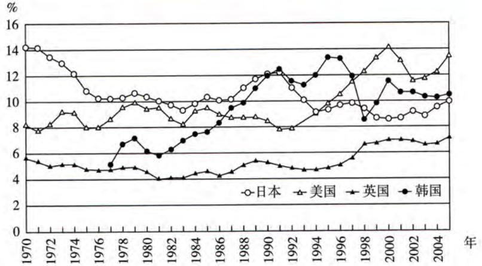  
图4-2设备投资/资本存量比率的国际比较

注：根据EUKLEMSDatabase制作而成。

  
图4-3资本系数的国际比较

本先来总览下针对本设备投资的两不同见解都展开了哪些分析。尤其是20世纪90年代后，基于企业微观数据的实证分析开展得如如荼，在微观层的投资为积累了量的知识见解。我们先通过20世纪90年代今的设备投资实证分析来考察外界是如何理解本的设备投资行为的。

后中也会加以阐述，不仅是本，欧美的很多设备投资分析也都是围绕托宾q理论展开的，并附加了各种各样的限制条件。托宾q理论的前提是典型企业的动态最优化为，可以解释顺利的设备投资为。然而，现实中的企业设备投资显示出的波动远比统计中的设备投资激烈。这告诉我们，与基于典型企业为的研究相，我们更需要关注企业异质性的研究。

进20世纪90年代后，出现了不少关注各家企业异质性（如期望、生产率、规模等）的分析，对于各家企业的设备投资，也在该企业异质性的前提下，针对如何理解造成设备投资急剧增加的投资峰展开了讨论。虽然投资高峰讨论的背后有不确定性环境下的设备投资理论存在，但我们要讨论的不仅仅是设备投资行为背后的这种不确定性，还要讨论一项问题，即行为背后隐藏着关注其他产业设备投资为的“个模式”动机，这种“个模式”的为正是导致资本系数上升等设备过剩的背景因素。

为了推进这种考察，第三节将调查各企业设备投资的同步性。第四节将在认真确认各家企业的投资峰后，采用probit估计法调查导致投资高峰的主要原因。最后一节将对这些分析进总结，并提出分析本未来设备投资为时存在的课题。

# 2设备投资行为的实证分析与日本经济

# 2.1 托宾q理论与本企业的设备投资为

可以说，设备投资为的理论基础确于20世纪80年代①。Abel（1979）和Hayashi（1982）表明，在解决拥有顺利投资相关调整成本函数的典型企业的动态最优化问题的过程中，设备投资依赖于该项投资所获得的未来利润的贴现值（所谓托宾边际q）。Hayashi（1982）又进步指出，如果利润函数与投资调整成本函数是关于资本存量的一阶齐次，则托宾边际q可用托宾平均q来代替。虽然托宾边际q的测量有困难，但Hayashi（1982）的实际成果使利用托宾平均g估计设备投资函数的正当性开始有了保障①。

因此，20世纪80年代后的设备投资相关实证分析均围绕着托宾g理论展开。但是，q理论不适合宏观层面和产业层面的设备投资函数估计。这一时期，日美两国都在尝试应用托宾q理论和其他传统的设备投资理论（加速度原理等），但结论都是支持加速度原理②。虽然加速度原理并非基于企业的最优化为，但它频繁应用于解释日本高速增长期的投资热潮所带来的投资过剩及其反作用力带来的设备投资减退的讨论。吉川（1994）解释，泡沫破灭后设备投资的大幅减少也是泡沫期投资过剩的反作用力。另外，宫川、樱井（1989）虽然指出进20世纪80年代后加速度原理可适用的情况越来越少，但又提出日本企业境外直接投资带来的设备堆积可能会引起全球范围内的设备过剩。宫川、德井（1994）进一步表明，外汇汇率波动使日本企业的国际竞争发变化，因此，外汇汇率也会对加速度原理下的设备调整产影响。也就是说，如果日元升值，日本的国际竞争力就会降低，与新外汇汇率水平相当的设备规模缩小，企业将面临设备过剩的问题。

# 2.2流动性约束、担保约束与设备投资行为

加速度原理曾经设想过企业陷入投资过剩局面的可能性，然而，进入20世纪90年代后，设备投资低迷期持续时间长，人们越发意识到这样一个问题——企业是不是只进小于最优投资规模的过小投资？在解释这一问题时，引用的讨论是在流动性约束和担保约束的影响下，企业只能进行小于最优设备投资规模的投资。

早在20世纪50年代，Meyer和Kuh（1957）就指出了企业受到流动性约束的讨论。但托宾g理论的理论结构是假设资金筹措市场上是完全信息，资金筹措方法的差异不会对设备投资为产生影响。根据这一理论，很难开展企业手头的内部资金对设备投资的影响比其他资金筹措方法更大这一讨论。但随着70年代后发展起来的信息不对称讨论在企业融中的运用，经过从外部金融市场筹措资金时的筹措成本高于内部资金这一讨论后，20世纪80年代后半期，开始有人开展包括流动性约束在内的设备投资函数实证分析③。时逢美国的Savings和Loans不良债权问题成为社会焦点，在其影响下，发了“惜贷”的情况，开始有研究试图测量它对设备投资为产的影响。Fazzari、Hubbard和Petersen（1988）、Deveraux和Schiantarelli（1990）等的研究是该领域的先驱性研究，作为设备投资函数的解释变量，其中出现了一种包含托宾q和现流量的估计法。

包含资约束的设备投资函数对本的设备投资实证分析产了重大影响。第一，在Fazzari、Hubbard和Petersen（1988）开展研究的同一时期，日本也开始利用微观数据开展设备投资分析。如在第2.1小节中所见，托宾q在使用宏观数据和各产业数据的估计中表现并不是很好。浅子、国则、村濑、井上（1989）以及Hayashi和Inoue（1991）从这是因为没有对泡沫期评价度上升的地等资产进很好的评价，故使托宾q的测量产了误差的问题意识出发，尝试通过测量考虑了多种资产的托宾q来解释设备投资。当时，他们利用上市企业的财务数据库，对微观层面的托宾q进行了测量。由于财务数据中还可获得负债和现流量等资筹措相关指标，所以除了托宾q之外，还开始将现流量率和负债率等纳解释变量来估计设备投资函数。

另点是进20世纪90年代后，本经济受不良债权的困扰程度美国经济有过之而无不及。泡沫破灭后，日本的金融机构开始持有巨额不良债权。因此，本也出现了经营恶化的融机构只向企业提供设备投资资的问题意识。日本的企业资金筹措比美国更依赖于融机构贷款，因此，可以认为，这些融机构所持有的不良债权的影响比美国更甚。顺着这种问题意识，小川、北坂（1998、2001）欲利用《法人企业统计季报》，在宏观层面和产业层上利现流量和贷款额的变化来解释设备投资为。

经历1997年到1998年的融危机后，资筹措与设备投资为之间的关系开始受到社会的关注。在日本，金融机构贷款时一般都要取得担保，因此，根据担保价值的大，资筹措额和设备投资为会受到限制。基于这思路，Ogawa和Suzuki（1998）以及铃（2001）以地估价的增减会对资筹措溢价产生影响的方式对设备投资函数进了估计。同时，永幡、关根（2002）通过货币政策对资产价格的影响，验证了对设备投资的影响。这些都是基于上市企业微观数据的设备投资函数实证分析，而Hori、Saito和Ando（2006）则以总结这系列研究的形式，使1990年后上市企业的微观数据，对设备投资函数进行了估计。他们的设备投资函数是托宾平均q加上现流量/总资产率的值。根据设备投资函数的估计结果，他们认为现流量的变量通常具有统计学意义，但未必能将其视为流动性约束的佐证，反倒是90年代托宾平均q的影响更大。这一结论与Hayashi和Prescott（2002）的90年代设备投资的低迷并流动性约束所致的结论相近。

原本上市企业大多都是健康的企业，仅凭这一项数据并不能断是否存在流动性约束。为此，福田、粕谷、中岛（2005）使用非上市企业的财务数据对流动性约束的影响进行了分析。从他们的估计结果中观察到，不仅是现金流量，提供资金的主银行的财务状况也对设备投资产生了具有统计学意义的影响。

如上所述，日本开展了大量资金筹措方法和设备投资行为的相关研究，而另一方面，也有人提出了现金流量是否适合用作流动性约束指标的疑问。原本现金流量由留存收益和折旧额组成，留存收益高，一般表明利润率也高，未来的投资机会丰富。也就是说，现金流量中可能混杂着本应包含在托宾g中的信息①。反之，即使留存收益高，但因为背后存在资金约束，有时企业也会留存下来以弥补未来的资金筹措缺口。因此可以说，用留存收益的高低来确认企业方是否存在资金约束是不够合理的。

最近，相关研究转为调查资金约束对宏观层面产生的影响，而不仅仅是对设备投资行为产生的影响。正如Gomes（2001）中业已阐述的那样，设想一种企业外部资金筹措花费超额成本的一般均衡经济，这种约束不一定对宏观经济波动产生了重要影响。相反，Hosono（2008）根据Gomes（2001）模型，利用日本的数据对一般均衡模型进行了校准，认为金融危机后的资金约束将日本的TFP增长率压低了 $0 . 6 \%$ 。另外，Caggese（2007）表明，加入后述的投资不可逆性后，投资的资金约束会发挥出更强的作用。也就是说，如果设备投资具有不可逆性，设备投资约束的成本就会更高，而且，当预测到负面生产率冲击会带来持续到未来的流动性约束时，这一成本更是会进一步升高，设备投资要比没有流动性约束时更加慎重。在Caggese（2007）模型中，由于设备要用作外部资金筹措的担保，所以，会出现设备投资的减少进一步增强流动性约束，并导致设备投资再次减少这一负面连锁反应。

# 2.3 不确定性、不可逆性与设备投资

自20世纪90年代起备受关注的另一项设备投资行为实证分析是不确定性的引入。将不确定性引入设备投资行为，是20世纪70年代Hartman（1972）和80年代Abel（1983）努力的结果。一般情况下，人们往往认为不确定性越大，设备投资就越小，但理论上未必如此。假设当前产品需求和技术冲击具有不确定性，那么，利润函数就是产品价格的递增函数。随着不确定性增加，需求波动变大，产品价格波动也会变大，期望利润上升，因此，设备投资也会增加。再者，如果利润函数与设备投资调整成本函数保持一阶齐次性，即使引了不确定性，托宾q理论依然成。因此，不确定性增加意味着托宾g通过期望利润上升上升，最终带来设备投资增加的结果①。

但是，如果在这种不确定性中加入设备的不可逆性，理论含义就会有很大的不同。设备投资的不可逆性，是指一旦进行设备投资，处理这些设备时就必须承担昂的成本。这样一想，企业家在进设备投资时，都要考虑处理设备时的费用，因此，如果不确定性增加，就不会轻易执行投资，直到出现更加有利的条件时才作出投资决断。也就是说，企业家会产延迟期权(option to wait)②。Bertola和Caballero（1994）、Dixit和Pindyck(1994）、A-bel和Eberly（1994）等将不确定性下的这种企业设备投资为扩展到了更加普通的调整成本中包含固定成本（non-convex adjustment cost）的情况，而不仅仅是单纯的不可逆性。上述一系列研究表明，由于固定成本的存在，会出现即使企业所处的环境多少发生了变化，也不会实施设备投资的领域，同时，如果不确定性增加，不实施设备投资的领域可能会扩大。

不确定性的增加既可能导致设备投资增加，也可能导致设备投资减少，但本的系列实证分析都持后者的倾向③。另外，由于这种固定成本的存在，设备投资函数呈非线性，Honda和Suzuki（2000）在研究中对这种非线性本身进行了估计。

从不确定性增导致设备投资减少的意义上来说，以上研究显示了投资不足的倾向，反之，如果不可逆性较强，企业无法报废已有的设备时，就会产设备过剩。Caballero和Hammour（1998）指出，20世纪90年代的法国就出现了这种设备过剩的状态，因为还要留一些操作这些旧设备，所以导致利润率降低、劳动分配率上升。

# 2.4 企业的异质性与投资峰

正如第2.3节中所述，假设企业暂缓设备投资，待环境好转后举进行了设备投资，那么，从时间序列来看，企业的这种设备投资举动就会产生间歇，实施设备投资的时期将出现一个高峰。我们将它称为投资高峰。投资高峰具体在什么时间产生，取决于暂缓因企业的固定成本而定的设备投资的阈值。而该固定成本的大小则依赖于因宏观冲击和企业固有冲击而定的企业资本存量最优值与当前资本存量之差。

Cooper、Haltiwanger和Power（1999）在固定成本因企业而异这一前提下，利用事业所层面的数据，用风险函数对设备投资的实施概率进行了估计，指出设备投资的等待期越长，投资的执行概率就越高。另外，Caballero和Engel（1999）通过设定一定的假设来统计各企业资本存量偏离最优资本存量的幅度，从而导出统计层面上的设备投资函数。这时，假设风险函数不依赖于最优设备投资的偏离幅度，统计的设备投资函数则成为常见的资本存量调整模型①。

在日本，嶋（2005）利用微观数据开展了与Cooper、Haltiwanger和Power（1999）同样的分析。另一方面，池田、西冈（2006）效仿Caballero和Engel（1999），利用统计数据，指出设备投资有间歇。

虽说这些分析具有微观基础，但对于设想典型企业并将从中导出的设备投资函数直接用作宏观层面的投资函数的做法已经敲响了警钟。当然，也有人批判这种分析，Hayashi（2000）主张，即使各企业的固定成本不同，但在统计层面，投资额被平均化，适用像托宾g理论所预知的那种平滑的设备投资函数。另外，Thomas（2002）以及Khan和Thomas（2004）认为，即使宏观模型中包含间歇性设备投资为，RealBusinessCycle的结论依然成。对于这种批判，Cooper和Haltiwanger（2006）使用Longitudinal ResearchData-base，指出事业所层面的调整成本是包含固定成本的非凸成本。另外，Gourio和Kashyap（2007）针对美国和智利统计层面的设备投资波动受到了投资高峰的影响这一论点进行了实证。

# 2.5 设备投资的联动性与设备过剩

如果第2.4小节的讨论是合理的，那么，设备投资显示出的波动应该比托宾g理论的预测结果更为剧烈。表4-2所示的是日本、美国、英国、韩国的设备投资比率波动情况。持续保持高速增长至近期的韩国另当别论，日本到1990年的波动水平一直高于英美两国。而英美两国在90年代后半期也受到了IT投资幅增加的影响，从90年代到最近的波动平均于本。

# 表4-2设备投资比率波动

单位： $\%$

<table><tr><td rowspan=2 colspan=1>年度</td><td rowspan=1 colspan=4>VY</td><td rowspan=1 colspan=4>VK</td></tr><tr><td rowspan=1 colspan=1>日本</td><td rowspan=1 colspan=1>美国</td><td rowspan=1 colspan=1>英国</td><td rowspan=1 colspan=1>韩国</td><td rowspan=1 colspan=1>日本</td><td rowspan=1 colspan=1>美国</td><td rowspan=1 colspan=1>英国</td><td rowspan=1 colspan=1>韩国</td></tr><tr><td rowspan=1 colspan=1>1970—2005</td><td rowspan=1 colspan=1>21.592.45</td><td rowspan=1 colspan=1>15.261.54</td><td rowspan=1 colspan=1>17.212.05</td><td rowspan=1 colspan=1>30.8211.13</td><td rowspan=1 colspan=1>10.231.21</td><td rowspan=1 colspan=1>9.963.36</td><td rowspan=1 colspan=1>5.300.93</td><td rowspan=1 colspan=1>9.635.66</td></tr><tr><td rowspan=1 colspan=1>1970—1990</td><td rowspan=1 colspan=1>21.343.15</td><td rowspan=1 colspan=1>15.521.14</td><td rowspan=1 colspan=1>17.281.26</td><td rowspan=1 colspan=1>30.325.69</td><td rowspan=1 colspan=1>10.720.95</td><td rowspan=1 colspan=1>8.960.32</td><td rowspan=1 colspan=1>4.730.18</td><td rowspan=1 colspan=1>7.894.09</td></tr><tr><td rowspan=1 colspan=1>1991-2005</td><td rowspan=1 colspan=1>21.891.60</td><td rowspan=1 colspan=1>14.951.95</td><td rowspan=1 colspan=1>17.143.14</td><td rowspan=1 colspan=1>31.2916.49</td><td rowspan=1 colspan=1>9.650.94</td><td rowspan=1 colspan=1>11.154.48</td><td rowspan=1 colspan=1>5.981.01</td><td rowspan=1 colspan=1>11.251.69</td></tr></table>

注：1.根据EUKLEMS Database制作而成。2.日本的I/Y从1973年开始计算。韩国的I/Y、I/K均从1977年开始计算。3.上层为平均值，下层为方差。

对于本设备投资波动变大这一情况，一直有人认为，这是因为本企业存在效仿其他公司的设备投资为进设备投资的倾向。针对这种“个模式”的行为，宫川、若林、内田（1996），竹内、花崎（1997），比佐（2007）都展开了分析①。

另一方面，有可能会因为需求或技术型连锁而产生设备投资的联动性。Lai和Nirei（2009）根据产业间的策略互补性，从理论上展示某一产业的大规模设备投资会诱发对其他产业的需求，这与设备投资联系起来，引起大规模设备投资波动，同时，利用意大利企业的数据对此进行了实证。另外，关于技术型连锁，宫川（2005）表明某产业的技术革新可能会波及其他产业，因而诱发设备投资，宫川、伊藤、川田（2002）对IT进步所带来的网络外部性促进IT投资的观点进了实证。这种技术新也在国际间传播，宫川、比佐（2008b）表明，除美国之外，其他发达国家的IT投资是联动的。20世纪90年代后半期，英美两国活跃的设备投资可以认为是这种新技术新的国际性传播的结果。

而且，EUKLEMSDatabase显示，2005年，日本的IT投资额高达14.5万亿日元②，占所有投资的 $31 \%$ 。从图4-4来看，本也和韩国样，20世纪

90年代后半期后，IT投资占比提升，而英美的提升则更加显著，2005年，美国的IT投资占比达到 $70 \%$ ，英国达到 $63 \%$ 。

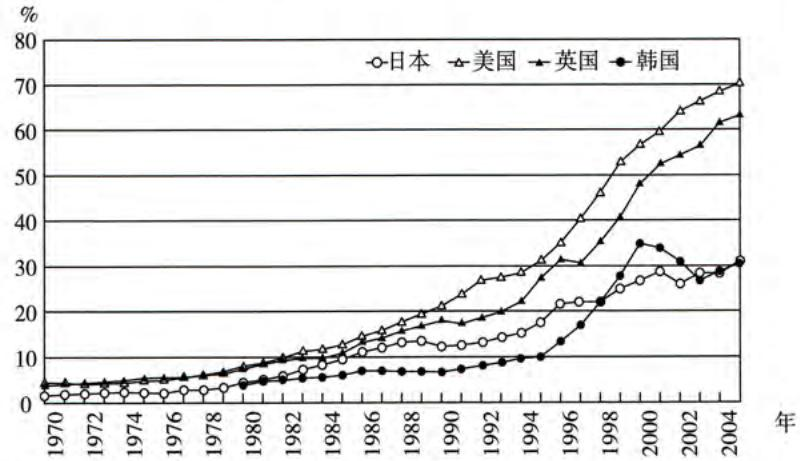  
图4-4IT投资/所有投资比率的变化

注：根据EUKLEMSDatabase制作而成。

  
图4-5日本的有形资产投资与无形资产投资

在设备投资的联动性中，以后者的技术革新为背景的联动性具有合理性，前者“一个模式”的行为未必是基于合理判断的设备投资行为，同样存在最终导致设备过剩的风险。Ando（2002）以及Ando、Christelis和Miyagawa（2003）指出，日本的企业经营者可能抑制外部分红，利用留存收益对低收益率设备进行了投资。针对该问题，Hayashi（2006）和齐藤（2008）在标准经济增长模型中，对因不够合理的分红和留存收益分配而导致设备过剩的情况进行了分析。

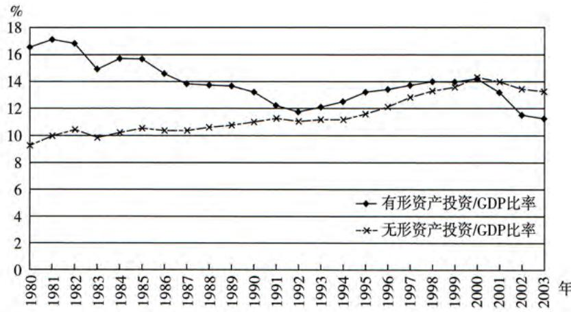  
注：根据Fukao等（2007）制作而成。  
图4-6 美国的有形资产投资与无形资产投资

齐藤（2008）指出，日本经济贯偏重于投资，消费与投资关系失衡，从有形资产投资与无形资产投资平衡的观点来看，也能看到本偏重于有形资产投资的倾向。Fukao等（2007）对美两国有形资产投资与形资产投资的动态进了对比，如表4-3、4-4中所见，美国的无形资产投资在20世纪90年代后半期后超过了有形资产投资，与此相对，本的有形资产投资率尽管在下降，但与形资产投资比率之间仍然存在差距。虽然越来越多的人认识到，作为IT投资的补充，无形资产对IT化的有效利用是十分重要的，但本尚未出现这倾向，投资姿态依然偏重于有形资产投资。

# 3设备投资是否联动？

根据第二节中20世纪90年代后的设备投资分析，我们对设备投资的联动性及其对投资峰的影响开展了实证性研究。该领域的焦点是本的实证分析较少以及迄今为流动性约束和不确定性导致的设备投资减少，Hayashi（2006）和齐藤（2008）等最近指出了问题的原因，即对设备过剩问题的研究太少。

最初，我们使用微观层面的企业数据，验证能否看到与产业层面设备投资的联动性。即我们利用下面的公式，将产业层面的设备投资波动分解成企业固有投资波动引起的部分和企业间联动引起的波动这两个因素。

$$
V a r ( k _ { i } ) \cong \sum _ { j = 1 } ^ { n } { \alpha _ { i j } } ^ { 2 } V a r ( k _ { i j } ) + 2 \sum _ { j \ne f } ^ { n } \alpha _ { i j } \alpha _ { i j } C o v ( k _ { i j } , k _ { i f } )
$$

公式（4.1）中， $i$ 表示产业名称， $j , f$ 表示某产业内的企业名称。 $k$ 表示设备投资比率（I/K），Var表示方差，Cou表示协方差， $\alpha$ 表示各企业 $j$ 或$f )$ 的资本存量比重。这里，可以将公式（4.1）右边第一项理解为基于企业固有动机的设备投资波动，第二项理解为与其他企业同步的设备投资波动。

我们在该分析中所使用的数据是收录于《企业财务数据库》（日本政策投资银行、日本经济研究所编）的在东京、大阪、名古屋三家证券交易所第一部和第二部上市的非金融、保险业企业的财务数据。其中，从1983年后尚存续的企业中，提取了相对容易抽样的19个行业。

测量结果如表4-3所示。在19个行业中，有8个行业与其他公司的同步性设备投资波动比例超过了 $50 \%$ 。另外，可以看到不少业在单项设备投资波动具有优势的情况下，其同步性设备投资波动仍占到了整体波动的 $40 \%$ 电气设备器具、汽车零部件、土木建筑这三大行业的同步性尤其高。另一方面，百货店和不动产租赁等的单项设备投资波动形成了整个产业的设备投资波动。这也许是因为百货店和不动产行业的建设投资比重较高，建筑审批等耗时较长，灵活的投资行为受到了限制。

表4-3主要产业设备投资原因分解  

<table><tr><td rowspan=3 colspan=1>DBJ编码</td><td rowspan=3 colspan=1>小、微企业分类</td><td rowspan=1 colspan=3>1983—2006年度</td></tr><tr><td rowspan=2 colspan=1>公司数</td><td rowspan=1 colspan=2>贡献度</td></tr><tr><td rowspan=1 colspan=1>单项原因</td><td rowspan=1 colspan=1>“一个模式”的原因</td></tr><tr><td rowspan=1 colspan=1>111</td><td rowspan=1 colspan=1>畜产加工品</td><td rowspan=1 colspan=1>7</td><td rowspan=1 colspan=1>64.9%</td><td rowspan=1 colspan=1>35.1%</td></tr><tr><td rowspan=1 colspan=1>151</td><td rowspan=1 colspan=1>啤酒、酒类</td><td rowspan=1 colspan=1>5</td><td rowspan=1 colspan=1>76.6%</td><td rowspan=1 colspan=1>23.4%</td></tr><tr><td rowspan=1 colspan=1>711</td><td rowspan=1 colspan=1>纸浆、造纸</td><td rowspan=1 colspan=1>5</td><td rowspan=1 colspan=1>60.3%</td><td rowspan=1 colspan=1>39.7%</td></tr><tr><td rowspan=1 colspan=1>1139</td><td rowspan=1 colspan=1>其他有机</td><td rowspan=1 colspan=1>13</td><td rowspan=1 colspan=1>56.4%</td><td rowspan=1 colspan=1>43.6%</td></tr><tr><td rowspan=1 colspan=1>1161</td><td rowspan=1 colspan=1>药品</td><td rowspan=1 colspan=1>15</td><td rowspan=1 colspan=1>60.8%</td><td rowspan=1 colspan=1>39.2%</td></tr><tr><td rowspan=1 colspan=1>1911</td><td rowspan=1 colspan=1>普通钢材</td><td rowspan=1 colspan=1>6</td><td rowspan=1 colspan=1>71.4%</td><td rowspan=1 colspan=1>28.6%</td></tr><tr><td rowspan=1 colspan=1>2537</td><td rowspan=1 colspan=1>一般工业机械</td><td rowspan=1 colspan=1>15</td><td rowspan=1 colspan=1>65.4%</td><td rowspan=1 colspan=1>34.6%</td></tr><tr><td rowspan=1 colspan=1>2711</td><td rowspan=1 colspan=1>电力设备</td><td rowspan=1 colspan=1>14</td><td rowspan=1 colspan=1>45.0%</td><td rowspan=1 colspan=1>55.0%</td></tr><tr><td rowspan=1 colspan=1>2799</td><td rowspan=1 colspan=1>其他（电气设备器具）</td><td rowspan=1 colspan=1>23</td><td rowspan=1 colspan=1>22.7%</td><td rowspan=1 colspan=1>77.3%</td></tr><tr><td rowspan=1 colspan=1>2911,2912</td><td rowspan=1 colspan=1>机动车（汽车、摩托车）</td><td rowspan=1 colspan=1>11</td><td rowspan=1 colspan=1>31.9%</td><td rowspan=1 colspan=1>68.1%</td></tr><tr><td rowspan=1 colspan=1>2914</td><td rowspan=1 colspan=1>零部件</td><td rowspan=1 colspan=1>36</td><td rowspan=1 colspan=1>10.5%</td><td rowspan=1 colspan=1>89.5%</td></tr><tr><td rowspan=1 colspan=1>30111</td><td rowspan=1 colspan=1>土木建筑</td><td rowspan=1 colspan=1>26</td><td rowspan=1 colspan=1>22.4%</td><td rowspan=1 colspan=1>77.6%</td></tr><tr><td rowspan=1 colspan=1>40111</td><td rowspan=1 colspan=1>综合贸易公司和各种商品批发</td><td rowspan=1 colspan=1>7</td><td rowspan=1 colspan=1>52.0%</td><td rowspan=1 colspan=1>48.0%</td></tr><tr><td rowspan=1 colspan=1>40311</td><td rowspan=1 colspan=1>百货店</td><td rowspan=1 colspan=1>10</td><td rowspan=1 colspan=1>100.6%</td><td rowspan=1 colspan=1>-0.6%</td></tr><tr><td rowspan=1 colspan=1>40321</td><td rowspan=1 colspan=1>超市</td><td rowspan=1 colspan=1>11</td><td rowspan=1 colspan=1>39.1%</td><td rowspan=1 colspan=1>60.9%</td></tr></table>

续表  

<table><tr><td rowspan=3 colspan=1>DBJ编码</td><td rowspan=3 colspan=1>小、微企业分类</td><td rowspan=1 colspan=3>1983—2006年度</td></tr><tr><td rowspan=2 colspan=1>公司数</td><td rowspan=1 colspan=2>贡献度</td></tr><tr><td rowspan=1 colspan=1>单项原因</td><td rowspan=1 colspan=1>“一个模式”的原因</td></tr><tr><td rowspan=1 colspan=1>60121</td><td rowspan=1 colspan=1>不动产租赁</td><td rowspan=1 colspan=1>9</td><td rowspan=1 colspan=1>104.9%</td><td rowspan=1 colspan=1>-4.9%</td></tr><tr><td rowspan=1 colspan=1>70111</td><td rowspan=1 colspan=1>铁路</td><td rowspan=1 colspan=1>16</td><td rowspan=1 colspan=1>48.6%</td><td rowspan=1 colspan=1>51.4%</td></tr><tr><td rowspan=1 colspan=1>80111</td><td rowspan=1 colspan=1>9电力</td><td rowspan=1 colspan=1>9</td><td rowspan=1 colspan=1>40.3%</td><td rowspan=1 colspan=1>59.7%</td></tr><tr><td rowspan=1 colspan=1>90311</td><td rowspan=1 colspan=1>电影、娱乐</td><td rowspan=1 colspan=1>17</td><td rowspan=1 colspan=1>89.1%</td><td rowspan=1 colspan=1>10.9%</td></tr></table>

注：1.计算对象为无合并或决算期变更、可连续获取数据的企业。2.按照以上规则，机动车的样本较少，因此计算时调整了决算期变更等的数据。

当然，虽说可以看到大量同步性设备投资波动，但即将其与“一个模式”的为挂钩未免有些草率。各家企业的设备投资波动是企业固有的技术冲击所致，同步性设备投资波动或许是整个业或者整体宏观经济的技术冲击或需求波动应对为的结果。但是，除了土建筑业之外，电设备器具和汽车零部件这两领域的产品差异极，技术新也相对较快。这种业的单项设备投资波动占比低，同步性设备投资波动大，这一情况的背后应该另有原因，仅整个业或整体宏观经济的冲击是法解释的。

# 4投资高峰的决定因素

# 4.1 投资峰的特定化

于是，为了调查更规模的设备投资是否具有联动性，我们聚焦源Cooper、Haltiwanger和Power（1999）等的投资峰，通过调查这种峰因何而起来考察投资的联动性问题。

先是如何确认投资峰的问题。我们效仿德井、乾、落合（2008）以及德井、乾、金（2008），思考以下三种投资高峰。

(1) AIS(Absolute Investment Spike)：设定 $I _ { i , t }$ 为企业 $\textit { i t }$ 年的实际设备投资， $K _ { I , \iota }$ 为企业 $\textit { i t }$ 期末的实际资本存量。定义当满 $I _ { i , t } / K _ { I , t - 1 } > \mu$ 时，企业 $i$ 在 $t$ 年产了峰。

(2） RIS（Relative Investment Spike)：定义当满足 $I _ { i , t } { > } \lambda _ { i \cdot m }$ $I _ { i , m }$ ：中值)时，企业 $_ i$ 在 $t$ 年产了峰。

(3）CIS（Combined Investment Spike)：定义当满足以上AIS和RIS条件中的任意一项时，企业 $i$ 在 $t$ 年产了峰。

(id $\mu , \lambda$ 值效仿Power（1998），Licandro、Maroto和Puch（2005），德井、乾、落合（2008），取 $\mu { = } 0 . 2$ , $\lambda = 1 . 7 5$ 。

所使用的数据和第三节一样，来自日本政策投资银行的《企业财务数据库》。但这里的样本中不仅包含1980年以后仍然上市的企业，也包含20世纪80年后连续存续10年以上的新上市企业和退市企业。各企业的决算期与年度的关系为当年4月至次年3月为一个年度，以该期间的决算为该企业该年度的数据。另外，对于在对象期间内变更了决算期的企业，并不剔除该企业的所有数据，而只将决算期变更后产生的特殊财务处理会带来严重影响的该决算期变更年度和下一年度的数据从样本中剔除。上市企业发生合并的，由于两家公司的决策程序不同，这里不做合并计算，而是作为两家企业对待，并将合并发生年度和下一年度的数据从样本中剔除。合并后的企业也按照与合并前的两家企业完全不同的企业对待。经过以上处理，纳入分析对象的企业数量为所有产业共2599家（制造业1480家，非制造业1079家）①。

表4-4按照时间序列，显示了根据以上三项标准抽取的产生了投资高峰的公司数占比。从中可见，20世纪80年代AIS指标下的投资高峰比例高于RIS指标下的高峰比例，90年代后这一形势发生了逆转。这是因为泡沫破灭前各企业均积极开展了设备投资，所以从设备投资比率的水平来看，被视为投资高峰的比例更大，而从RIS来看，整体设备投资比率的水平有所提升，因此高于中值的企业比率减少。泡沫破灭后的20世纪90年代后，设备投资比率的整体水平出现了下降，因而产生了和泡沫破灭前相反的现象。比较泡沫破灭前和泡沫破灭后可以看到，制造业投资高峰数量的减幅比非制造业更为显著。21世纪00年代的高峰数量减幅要高于以往。整体看来，有10%到20%左右的公司观察到了AIS型的投资峰，有20%多的公司观察到了RIS型的投资峰②。另外，作为参考，也对 $\mu { = } 0 . 3$ , $\lambda = 2 , 5$ 的情况进行了调查，由于标准设定较为严格，投资高峰比率整体上有所减少，但倾向没有大的变化。

表4-4投资高峰的公司数占比  
$\mu { = } 0 . 2 , \lambda { = } 1 . 7 5$   

<table><tr><td rowspan=2 colspan=1>年度</td><td rowspan=1 colspan=3>所有产业</td><td rowspan=1 colspan=3>制造业</td><td rowspan=1 colspan=3>非制造业</td></tr><tr><td rowspan=1 colspan=1>AIS</td><td rowspan=1 colspan=1>RIS</td><td rowspan=1 colspan=1>CIS</td><td rowspan=1 colspan=1>AIS</td><td rowspan=1 colspan=1>RIS</td><td rowspan=1 colspan=1>CIS</td><td rowspan=1 colspan=1>AIS</td><td rowspan=1 colspan=1>RIS</td><td rowspan=1 colspan=1>CIS</td></tr><tr><td rowspan=1 colspan=1>1980—1989</td><td rowspan=1 colspan=1>23.4</td><td rowspan=1 colspan=1>20.0</td><td rowspan=1 colspan=1>11.8</td><td rowspan=1 colspan=1>23.8</td><td rowspan=1 colspan=1>18.0</td><td rowspan=1 colspan=1>11.3</td><td rowspan=1 colspan=1>22.7</td><td rowspan=1 colspan=1>23.8</td><td rowspan=1 colspan=1>12.8</td></tr></table>

单位： $\%$ 单位： $\%$ 单位： $\%$

续表  

<table><tr><td rowspan=2 colspan=1>年度</td><td rowspan=1 colspan=3>所有产业</td><td rowspan=1 colspan=3>制造业</td><td rowspan=1 colspan=3>非制造业</td></tr><tr><td rowspan=1 colspan=1>AIS</td><td rowspan=1 colspan=1>RIS</td><td rowspan=1 colspan=1>CIS</td><td rowspan=1 colspan=1>AIS</td><td rowspan=1 colspan=1>RIS</td><td rowspan=1 colspan=1>CIS</td><td rowspan=1 colspan=1>AIS</td><td rowspan=1 colspan=1>RIS</td><td rowspan=1 colspan=1>CIS</td></tr><tr><td rowspan=1 colspan=1>1990—1999</td><td rowspan=1 colspan=1>17.3</td><td rowspan=1 colspan=1>28.3</td><td rowspan=1 colspan=1>13.3</td><td rowspan=1 colspan=1>14.1</td><td rowspan=1 colspan=1>25.7</td><td rowspan=1 colspan=1>11.9</td><td rowspan=1 colspan=1>22.2</td><td rowspan=1 colspan=1>32.2</td><td rowspan=1 colspan=1>15.5</td></tr><tr><td rowspan=1 colspan=1>2000-2006</td><td rowspan=1 colspan=1>8.5</td><td rowspan=1 colspan=1>17.7</td><td rowspan=1 colspan=1>7.3</td><td rowspan=1 colspan=1>6.7</td><td rowspan=1 colspan=1>16.1</td><td rowspan=1 colspan=1>6.2</td><td rowspan=1 colspan=1>10.9</td><td rowspan=1 colspan=1>19.9</td><td rowspan=1 colspan=1>8.8</td></tr><tr><td rowspan=1 colspan=1>1980—2006</td><td rowspan=1 colspan=1>16.7</td><td rowspan=1 colspan=1>22.8</td><td rowspan=1 colspan=1>11.2</td><td rowspan=1 colspan=1>15.3</td><td rowspan=1 colspan=1>20.6</td><td rowspan=1 colspan=1>10.2</td><td rowspan=1 colspan=1>18.9</td><td rowspan=1 colspan=1>26.2</td><td rowspan=1 colspan=1>12.7</td></tr></table>

$\mu { = } 0 . 2 , \lambda { = } 1 . 7 5$   
单位： $\%$   
表4-5 投资高峰的影响度  

<table><tr><td rowspan=2 colspan=1>年度</td><td rowspan=1 colspan=3>所有产业</td><td rowspan=1 colspan=3>制造业</td><td rowspan=1 colspan=3>非制造业</td></tr><tr><td rowspan=1 colspan=1>AIS</td><td rowspan=1 colspan=1>RIS</td><td rowspan=1 colspan=1>CIS</td><td rowspan=1 colspan=1>AIS</td><td rowspan=1 colspan=1>RIS</td><td rowspan=1 colspan=1>CIS</td><td rowspan=1 colspan=1>AIS</td><td rowspan=1 colspan=1>RIS</td><td rowspan=1 colspan=1>CIS</td></tr><tr><td rowspan=1 colspan=1>1980—1989</td><td rowspan=1 colspan=1>10.6</td><td rowspan=1 colspan=1>11.8</td><td rowspan=1 colspan=1>5.7</td><td rowspan=1 colspan=1>10.1</td><td rowspan=1 colspan=1>9.7</td><td rowspan=1 colspan=1>5.1</td><td rowspan=1 colspan=1>11.5</td><td rowspan=1 colspan=1>15.7</td><td rowspan=1 colspan=1>7.0</td></tr><tr><td rowspan=1 colspan=1>19901999</td><td rowspan=1 colspan=1>9.4</td><td rowspan=1 colspan=1>17.3</td><td rowspan=1 colspan=1>6.9</td><td rowspan=1 colspan=1>7.0</td><td rowspan=1 colspan=1>14.2</td><td rowspan=1 colspan=1>5.7</td><td rowspan=1 colspan=1>12.9</td><td rowspan=1 colspan=1>21.8</td><td rowspan=1 colspan=1>8.6</td></tr><tr><td rowspan=1 colspan=1>2000-2006</td><td rowspan=1 colspan=1>4.2</td><td rowspan=1 colspan=1>10.3</td><td rowspan=1 colspan=1>3.5</td><td rowspan=1 colspan=1>3.0</td><td rowspan=1 colspan=1>8.5</td><td rowspan=1 colspan=1>2.8</td><td rowspan=1 colspan=1>5.8</td><td rowspan=1 colspan=1>12.7</td><td rowspan=1 colspan=1>4.5</td></tr><tr><td rowspan=1 colspan=1>1980-2006</td><td rowspan=1 colspan=1>8.3</td><td rowspan=1 colspan=1>13.7</td><td rowspan=1 colspan=1>5.6</td><td rowspan=1 colspan=1>7.0</td><td rowspan=1 colspan=1>11.3</td><td rowspan=1 colspan=1>4.8</td><td rowspan=1 colspan=1>10.3</td><td rowspan=1 colspan=1>17.4</td><td rowspan=1 colspan=1>6.9</td></tr></table>

$\mu { = } 0 . 2 , \lambda { = } 1 . 7 5$ (id:)   
$\mu { = } 0 . 3 , \lambda { = } 2 . 5$   

<table><tr><td rowspan=2 colspan=1>年度</td><td rowspan=1 colspan=3>investment spike的设备投资额/所有样本的设备投资额</td><td rowspan=1 colspan=3>investment spike 的设备投资额/GDP统计的设备投资额</td><td rowspan=2 colspan=1>所有样本的设备投资额/GDP统计的设备投资额</td></tr><tr><td rowspan=1 colspan=1>AIS</td><td rowspan=1 colspan=1>RIS</td><td rowspan=1 colspan=1>CIS</td><td rowspan=1 colspan=1>AIS</td><td rowspan=1 colspan=1>RIS</td><td rowspan=1 colspan=1>CIS</td></tr><tr><td rowspan=1 colspan=1>1980—1989</td><td rowspan=1 colspan=1>33.0</td><td rowspan=1 colspan=1>17.9</td><td rowspan=1 colspan=1>13.8</td><td rowspan=1 colspan=1>6.1</td><td rowspan=1 colspan=1>3.3</td><td rowspan=1 colspan=1>2.5</td><td rowspan=1 colspan=1>18.5</td></tr><tr><td rowspan=1 colspan=1>1990—1999</td><td rowspan=1 colspan=1>22.6</td><td rowspan=1 colspan=1>33.5</td><td rowspan=1 colspan=1>18.1</td><td rowspan=1 colspan=1>4.4</td><td rowspan=1 colspan=1>6.6</td><td rowspan=1 colspan=1>3.6</td><td rowspan=1 colspan=1>19.7</td></tr><tr><td rowspan=1 colspan=1>2000-2006</td><td rowspan=1 colspan=1>19.4</td><td rowspan=1 colspan=1>30.2</td><td rowspan=1 colspan=1>15.6</td><td rowspan=1 colspan=1>2.3</td><td rowspan=1 colspan=1>3.6</td><td rowspan=1 colspan=1>1.9</td><td rowspan=1 colspan=1>11.9</td></tr><tr><td rowspan=1 colspan=1>1980-2006</td><td rowspan=1 colspan=1>25.3</td><td rowspan=1 colspan=1>28.0</td><td rowspan=1 colspan=1>16.3</td><td rowspan=1 colspan=1>4.3</td><td rowspan=1 colspan=1>4.8</td><td rowspan=1 colspan=1>2.8</td><td rowspan=1 colspan=1>17.2</td></tr></table>

<table><tr><td rowspan=2 colspan=1>年度</td><td rowspan=1 colspan=3>investment spike的设备投资额 investment spike的设备投资额/所有样本的设备投资额</td><td rowspan=1 colspan=3>investment spike的设备投资额 investment spike的设备投资额/GDP统计的设备投资额</td><td rowspan=2 colspan=1>所有样本的设备投资额/GDP统计的设备投资额</td></tr><tr><td rowspan=1 colspan=1>AIS</td><td rowspan=1 colspan=1>RIS</td><td rowspan=1 colspan=1>CIS</td><td rowspan=1 colspan=1>AIS</td><td rowspan=1 colspan=1>RIS</td><td rowspan=1 colspan=1>CIS</td></tr><tr><td rowspan=1 colspan=1>19801989</td><td rowspan=1 colspan=1>11.4</td><td rowspan=1 colspan=1>8.7</td><td rowspan=1 colspan=1>5.7</td><td rowspan=1 colspan=1>2.1</td><td rowspan=1 colspan=1>1.6</td><td rowspan=1 colspan=1>1.1</td><td rowspan=1 colspan=1>18.5</td></tr><tr><td rowspan=1 colspan=1>1990—1999</td><td rowspan=1 colspan=1>10.7</td><td rowspan=1 colspan=1>17.5</td><td rowspan=1 colspan=1>8.0</td><td rowspan=1 colspan=1>2.1</td><td rowspan=1 colspan=1>3.4</td><td rowspan=1 colspan=1>1.6</td><td rowspan=1 colspan=1>19.7</td></tr><tr><td rowspan=1 colspan=1>2000--2006</td><td rowspan=1 colspan=1>9.9</td><td rowspan=1 colspan=1>20.0</td><td rowspan=1 colspan=1>8.1</td><td rowspan=1 colspan=1>1.2</td><td rowspan=1 colspan=1>2.4</td><td rowspan=1 colspan=1>1.0</td><td rowspan=1 colspan=1>11.9</td></tr><tr><td rowspan=1 colspan=1>1980--2006</td><td rowspan=1 colspan=1>10.7</td><td rowspan=1 colspan=1>15.2</td><td rowspan=1 colspan=1>7.3</td><td rowspan=1 colspan=1>1.8</td><td rowspan=1 colspan=1>2.6</td><td rowspan=1 colspan=1>1.3</td><td rowspan=1 colspan=1>17.2</td></tr></table>

注：投资高峰的设备投资、所有样本的设备投资为从该决算期内的有形固定资产取得额中扣除因报废或出售造成的有形固定资产减少额后的值，因此不同于SNA统计的设备投资。

那么，投资峰对整体设备投资具有多的影响呢？表4-5所的是被认定为投资峰的设备投资额在样本整体投资额中所占的例或在按GDP计算的设备投资额中所占比例。从中可以看出，在AIS标准或RIS标准下，投资高峰占样本整体设备投资的四分之一以上。尤其是20世纪80年代，AIS标准下样本整体设备投资额的30%以上、按GDP计算的设备投资额的6%左右都是因投资高峰所致。如果严格高峰标准，这一比率会变小，但即便如此，投资高峰也能占到样本整体设备投资额的10%左右。如果考虑高峰的动态与经济周期的动态基本对应、以及设备投资增速在2002年开始的整个经济复苏期内仍达到了5%左右的因素，则可以说，投资高峰在确认宏观设备投资动向方面也是不可小觑的一种现象。

# 4.2 为何会产生投资高峰？

本文利用这种投资高峰，对引发投资高峰的主要原因进行实证性研究。

通常，在验证投资的不可逆性理论时，由于投资高峰的产生对暂缓了设备投资多久这一等待期影响巨大，所以要使用hazard函数。但是，本文考虑的是聚焦投资高峰的经济因素，以及如果在企业层面上测量投资高峰，则高峰出现的频率会变高，未必适用plantlevel的分析，故而考虑用其他的研究方法。我们考虑的研究方法通过probit估计来调查产生投资高峰的经济因素，将产生投资高峰时设为1，未产生投资高峰时设为 $0$

$$
y _ { f } ^ { \ast } = \gamma ^ { \prime } x _ { f } + u _ { t }
$$

公式（4.2）中的y\*是一个变量，当企业f进行了引发投资高峰的大型投资时取值1，否则取值0。x为解释变量。这里，企业固有因素使用了托宾q（aq）、现金流量占资本存量的比例（cf）、借款余额占总资产的比例(debt）、三大股东股比（kabu）、相对TFP（rtfp），而该企业所在产业整体因素则使了产业内投资峰产率（aisrate、risrate、cisrate）、各产业实际外汇汇率变化率（ex）、各产业监管指标（ $\mathrm { r e g }$ ）、各产业的不确定性（uncer）。

下面来解释对设备投资进行标准性解释的托宾g之外的解释变量的含义。现金流量占资本存量的比例（cf）的着眼点在于内部资金可对资金约束起到缓解效果，考虑了伴随外部资金筹措而产生的资金约束问题抑制设备投资过剩的可能性。借款余额占总资产的比例（debt）体现的是由金融机构制定规范，三大股东股比（kabu）体现的是由股东制定规范，并考虑了金融机构和股东制定规范对投资过剩的抑制效果。

但是，股东和债权人的治理未必会朝着抑制设备投资的方向发挥作用。比如，当三大股东的股比较高时，股东就会更多地干预企业，对企业进行严格监视，因此，也可能会缓解信息不对称性，促进设备投资。另外，如果与特定债权人的关系紧密，则可能会缓解流动性约束，促进设备投资。考虑到这点，借款余额占总资产的例和三股东股的系数符号有时也会是正数①。相对TFP（rtfp）以与企业所在产业的平均性企业之差来体现各企业的产率，这是个解释变量，它考虑了产业内的产率随着技术开发等相对提升会成为设备投资的诱因。

产业内投资峰产比率（aisrate、risrate、cisrate）按年度展示各产业内产生高峰的企业比例，考虑了产业内“一个模式”的设备投资为②。各产业实际外汇汇率变化率（ex）考虑了外需成为国内设备投资诱因的效果。各产业的监管指标（reg）考虑了各产业内的监管抑制设备投资、监管的放宽和取消成为设备投资诱因的可能性。各产业的不确定性（uncer）考虑了设备投资的选择权性质，并考虑不确定性的存在对抑制过度设备投资的效果。除此之外，还考虑宏观冲击，并将时间虚拟变量纳估计之中。

以上变量的具体制作方法在补遗中叙述。另外，各解释变量的描述等的测量在表4-6中记载。

# 表4-6 基本统计量

所有产业（1980—2006，样本数：53465）  

<table><tr><td rowspan=1 colspan=1>Variable</td><td rowspan=1 colspan=1>Mean</td><td rowspan=1 colspan=1>Std. Dev.</td><td rowspan=1 colspan=1>Min</td><td rowspan=1 colspan=1>Max</td></tr><tr><td rowspan=1 colspan=1>aq</td><td rowspan=1 colspan=1>1.69</td><td rowspan=1 colspan=1>3.32</td><td rowspan=1 colspan=1>-16.7</td><td rowspan=1 colspan=1>21.81</td></tr><tr><td rowspan=1 colspan=1>cf</td><td rowspan=1 colspan=1>0.22</td><td rowspan=1 colspan=1>0.51</td><td rowspan=1 colspan=1>-7.69</td><td rowspan=1 colspan=1>8.22</td></tr><tr><td rowspan=1 colspan=1>debt</td><td rowspan=1 colspan=1>0.20</td><td rowspan=1 colspan=1>0.18</td><td rowspan=1 colspan=1>0.00</td><td rowspan=1 colspan=1>0.79</td></tr><tr><td rowspan=1 colspan=1>kabu</td><td rowspan=1 colspan=1>0.30</td><td rowspan=1 colspan=1>0.18</td><td rowspan=1 colspan=1>0.00</td><td rowspan=1 colspan=1>1.00</td></tr><tr><td rowspan=1 colspan=1>rtp</td><td rowspan=1 colspan=1>-0.03</td><td rowspan=1 colspan=1>0.11</td><td rowspan=1 colspan=1>-2.38</td><td rowspan=1 colspan=1>2.51</td></tr><tr><td rowspan=1 colspan=1>aisrate</td><td rowspan=1 colspan=1>0.17</td><td rowspan=1 colspan=1>0.16</td><td rowspan=1 colspan=1>0.00</td><td rowspan=1 colspan=1>1.00</td></tr><tr><td rowspan=1 colspan=1>risrate</td><td rowspan=1 colspan=1>0.23</td><td rowspan=1 colspan=1>0.17</td><td rowspan=1 colspan=1>0.00</td><td rowspan=1 colspan=1>1.00</td></tr><tr><td rowspan=1 colspan=1>cisrate</td><td rowspan=1 colspan=1>0.11</td><td rowspan=1 colspan=1>0.12</td><td rowspan=1 colspan=1>0.00</td><td rowspan=1 colspan=1>1.00</td></tr><tr><td rowspan=1 colspan=1>ex</td><td rowspan=1 colspan=1>0.01</td><td rowspan=1 colspan=1>0.12</td><td rowspan=1 colspan=1>-0.50</td><td rowspan=1 colspan=1>0.75</td></tr><tr><td rowspan=1 colspan=1>regl</td><td rowspan=1 colspan=1>0.25</td><td rowspan=1 colspan=1>0.39</td><td rowspan=1 colspan=1>0.00</td><td rowspan=1 colspan=1>1.00</td></tr><tr><td rowspan=1 colspan=1>reg2</td><td rowspan=1 colspan=1>0.48</td><td rowspan=1 colspan=1>0.37</td><td rowspan=1 colspan=1>0.00</td><td rowspan=1 colspan=1>1.55</td></tr><tr><td rowspan=1 colspan=1>uncer</td><td rowspan=1 colspan=1>0.04</td><td rowspan=1 colspan=1>0.03</td><td rowspan=1 colspan=1>0.00</td><td rowspan=1 colspan=1>0.27</td></tr></table>

表4-7是对所有产业进行估计的结果。投资高峰按照 $\mu = 0 . 2$ , $\lambda = 1 . 7 5$ 的标准，只对AIS的情形进行了估计①。我们所拥有的数据是上市企业的un-balancedpaneldata，并对数似然比检验值判断是用它进poolingprobit估计，还是进行random effect的panelprobit估计。从估计结果来看，所有情况下的托宾q和现金流量变量都具有正面的统计学意义。另外，表示设备投资同步性的产业内投资高峰指标几乎在所有情况下都具有正面的统计学意义。仅2期滞后项在最近的估计中不具有统计学意义，这表明在进行大规模投资时，企业可能是边观察其他企业的动向边实施的。除此之外，相对TFP在发生金融危机的1997年之前均具有正面的统计学意义，但在最近期的估计中不再具有统计学意义，也不满足符号条件。

在作为治理变量纳入的2个变量（debt和kabu）中，借款余额占总资产的比例在20世纪80年代的估计和21世纪00年代的估计中，系数多取负数。符号为负，表明存在金融机构通过贷款抑制性指导设备投资的可能性。

另一方面，三大股东股比在整个期间均取显著正相关符号。与其说三大股东股比越高，股东制定的规范越强硬，不如说在朝着积极获取企业信息后推动设备投资的方向发挥作用。

另外，不确定性方面，无论是使用Japan Industry ProductivityDatabase（以下简称JIP数据库）中的各产业实际产值，还是使用生产指数和第三产业活动指数，基本上都具有负面的统计学意义，表明不确定性的增大使得大规模设备投资暂缓。不过，实际外汇汇率和监管放宽指标满足符号条件，未获得具有统计学意义的结果。这可能是因为从所有产业来看，大部分企业都是内需导向型企业，并不受到外汇汇率的影响。而放宽监管则是因为估计对象是相对不易受到监管影响的大企业。

下面来看表4-8中制造业的同一估计结果。制造业的估计结果与所有产业的估计结果基本相同。在几乎所有的估计中，托宾q、现金流量变量、产业内的投资高峰比率（1期滞后项）的结果都具有正面的统计学意义。而在大量估计中，表示不确定性的变量的结果都具有负面的统计学意义。相对TFP方面，具有统计学意义的结果数量要少于所有产业。除此之外，治理变量、实际外汇汇率、监管变量和所有产业的结果基本一致。

<table><tr><td rowspan=1 colspan=2></td><td rowspan=1 colspan=1>1983—2006</td><td rowspan=1 colspan=1>1983—1991</td><td rowspan=1 colspan=1>1992—1997</td><td rowspan=1 colspan=1>1998—2002</td><td rowspan=1 colspan=1>2003—2006</td><td rowspan=1 colspan=1>|</td></tr><tr><td rowspan=2 colspan=2>aq(-1)cf(-1)</td><td rowspan=2 colspan=1>0.041（15.97）***0.312（12.81）***</td><td rowspan=1 colspan=1>0.028（7.19）***</td><td rowspan=1 colspan=1>0.062（11.12）***</td><td rowspan=1 colspan=1>0.050（7.79）***</td><td rowspan=1 colspan=1>0.041(5.57)***</td><td></td></tr><tr><td rowspan=1 colspan=1>0.439（7.90)***</td><td rowspan=1 colspan=1>0.269(4.95)***</td><td rowspan=1 colspan=1>0.297（5.94）***</td><td rowspan=2 colspan=1>0.257(5.44)***-0.680（-4.17)***</td><td></td></tr><tr><td rowspan=2 colspan=2>debt (-1)kabu (-1)</td><td rowspan=1 colspan=1></td><td rowspan=1 colspan=1>-0.421（-7.54)***</td><td rowspan=1 colspan=1>-0.669（-7.68)***</td><td rowspan=1 colspan=1>0.028（0.27）</td><td rowspan=1 colspan=1>-0.152(-1.20)</td><td></td></tr><tr><td rowspan=1 colspan=1>0.379(6.75)***</td><td rowspan=1 colspan=1>0.285(3.22）)***</td><td rowspan=1 colspan=1>0.235（2.34）**</td><td rowspan=1 colspan=1>0.758(5.85)***</td><td rowspan=1 colspan=1>0.484（3.06）***</td><td></td></tr><tr><td rowspan=5 colspan=2>rp(-1)aisrate(-1)aisrate(-2)ex(-1)reg1(-1)reg2(-1)uncer(-1)cons</td><td rowspan=1 colspan=1></td><td rowspan=1 colspan=1>0.474（5.17）***</td><td rowspan=1 colspan=1>1.299(6.23）***</td><td rowspan=1 colspan=1>0.828（3.58）***</td><td rowspan=1 colspan=1>0.315（1.62）</td><td rowspan=1 colspan=1>-0.095（-0.55)</td></tr><tr><td rowspan=1 colspan=1>0.952（15.19）***</td><td rowspan=1 colspan=1>0.852（10.38）***</td><td rowspan=1 colspan=1>0.846（6.30）***</td><td rowspan=1 colspan=1>0.990(4.37)***</td><td rowspan=1 colspan=1>0.864(3.21）***</td><td></td></tr><tr><td rowspan=1 colspan=1></td><td rowspan=1 colspan=1>0.456(7.56)***</td><td rowspan=1 colspan=1>0.347（4.38）***</td><td rowspan=1 colspan=1>0.405（3.25）***</td><td rowspan=1 colspan=1>1.150（5.42）***</td><td rowspan=1 colspan=1>0.050（3.17）</td><td></td></tr><tr><td rowspan=1 colspan=1>-0.579（-4.01)***</td><td rowspan=1 colspan=1>-0.855（-4.31）***</td><td rowspan=1 colspan=1>-0.567(-1.73)*</td><td rowspan=2 colspan=1>-0.371（-0.97)0.073（1.06）-2.664（-3.46)***-2.071（-19.33）***</td><td rowspan=2 colspan=1>0.157(0.26)0.045（0.59）-1.885（-2.67)**-1.738（-17.67)***</td><td></td></tr><tr><td rowspan=1 colspan=1>-0.918（-3.23）***-1.644（-32.94)***</td><td rowspan=1 colspan=1>-0.052(-1.37)0.512(1.13)-1.074（-17.45)***</td><td rowspan=1 colspan=1>0.114(2.49)**-1.946（-3.05)***-1.634（-18.49)***</td><td></td></tr><tr><td rowspan=1 colspan=2>样本数公司数Wald chi2Log likelihoodL.ikelihood-ratio test of rho</td><td rowspan=1 colspan=1>4558725593484-16378218</td><td rowspan=1 colspan=1>141491884946-709397.8</td><td rowspan=1 colspan=1>123232308589-418352.9</td><td rowspan=1 colspan=1>111412426398-288274.4</td><td rowspan=1 colspan=1>79742125164-209543.8</td><td rowspan=2 colspan=1></td></tr><tr><td rowspan=1 colspan=2>模型</td><td rowspan=1 colspan=1>probit (re)</td><td rowspan=1 colspan=1>probit (re)</td><td rowspan=1 colspan=1>probit (re)</td><td rowspan=1 colspan=1>probit (re)</td><td rowspan=1 colspan=1>probit (re)</td></tr></table>

<table><tr><td rowspan=1 colspan=1></td><td rowspan=1 colspan=1>1983—2006</td><td rowspan=1 colspan=1>1983—1991</td><td rowspan=1 colspan=1>1992—1997</td><td rowspan=1 colspan=1>1998—2002</td><td rowspan=1 colspan=1>20032006</td></tr><tr><td rowspan=2 colspan=1>aq(-1)cf(-1)</td><td rowspan=2 colspan=1>0.037(9.64)***0.642（11.49）***</td><td rowspan=1 colspan=1>0.028(4.98)***</td><td rowspan=1 colspan=1>0.049(5.33)***</td><td rowspan=1 colspan=1>0.050(4.70)***</td><td rowspan=7 colspan=1>0.047（3.80)***0.229（2.06)**-0.859（-3.74)***0.500（2.53）**-0.018（-0.07)0.743(2.08)**-0.016（-0.04)</td></tr><tr><td rowspan=1 colspan=1>·0.738（7.46)***</td><td rowspan=1 colspan=1>0.913（6.59)***</td><td rowspan=1 colspan=1>0.697（4.88)***</td></tr><tr><td rowspan=7 colspan=1>debt(-1)kabu(-1)rp(-1)aisrate (-1)aisrate(-2)ex(-1)reg1(-1)reg2(-1)uncer(-1)cons</td><td rowspan=1 colspan=1>-0.582(-7.80)***</td><td rowspan=1 colspan=1>-0.766（-6.75)***</td><td rowspan=1 colspan=1>-0.033（-0.22）</td><td rowspan=1 colspan=1>-0.256（-1.43）</td></tr><tr><td rowspan=1 colspan=1>0.300（4.41）***</td><td rowspan=1 colspan=1>0.297(2.84）***</td><td rowspan=1 colspan=1>0.185（1.42)</td><td rowspan=2 colspan=1>0.542（3.30）***0.405（1.25）</td></tr><tr><td rowspan=1 colspan=1>0.660（4.92）***</td><td rowspan=1 colspan=1>1.992（6.26)***</td><td rowspan=1 colspan=1>1.044（2.65)***</td></tr><tr><td rowspan=1 colspan=1>0.787（9.80）***</td><td rowspan=1 colspan=1>0.813（8.05）***</td><td rowspan=1 colspan=1>0.346（1.80)*</td><td rowspan=1 colspan=1>0.825（2.32）**</td></tr><tr><td rowspan=1 colspan=1>0.342（4.43）***</td><td rowspan=1 colspan=1>0.282（2.88）***</td><td rowspan=1 colspan=1>0.292（1.73）*</td><td rowspan=1 colspan=1>0.452（1.30）</td></tr><tr><td rowspan=2 colspan=1>-0.471（-2.88)***-0.739（-2.22)**-1.601（-25.13）***</td><td rowspan=1 colspan=1>-0.754（-3.40)***-0.084（-1.33)</td><td rowspan=1 colspan=1>-0.065（-0.18)</td><td rowspan=2 colspan=1>-0.111（-0.23)0.090（1.21）-1.975（-2.01）**-2.084（14.23）***</td><td rowspan=2 colspan=1>0.146（0.20)0.079（0.82）-1.834（-2.39）**-1.612（-13.12)***</td></tr><tr><td rowspan=1 colspan=1>-0.084（-1.33)0.045（0.09）-1.094（-14.49)***</td><td rowspan=1 colspan=1>-0.018（-0.23）-0.771(-1.00)-1.757（-15.94)***</td></tr><tr><td rowspan=1 colspan=1>样本数公司数Wald chi2Log likelihoodLikelihood-ratio test of rho</td><td rowspan=1 colspan=1>2828314802.463-9.39737.5</td><td rowspan=1 colspan=1>94501219726-473343.5</td><td rowspan=1 colspan=1>76471388304-21025.7</td><td rowspan=1 colspan=1>65251405153-13487.2</td><td rowspan=1 colspan=1>46611222101-1.1428.2</td></tr><tr><td rowspan=1 colspan=1>模型</td><td rowspan=1 colspan=1>probit (re)</td><td rowspan=1 colspan=1>probit (re)</td><td rowspan=1 colspan=1>probit (re)</td><td rowspan=1 colspan=1>probit (re)</td><td rowspan=1 colspan=1>probit (re)</td></tr></table>

# 94宏观经济与产业结构

表4-9所的是制造业的同估计结果。托宾q、现流量变量的结果基本都具有统计学意义，但部分结果不具有统计学意义。另外，产业内的投资峰率，也并所有估计结果都具有统计学意义，最近期的估计都不具有统计学意义。通过负债的治理变量（debt）和不确定性变量面，具有统计学意义的估计也有所减少。尤其在最近期的估计中，具有统计学意义的变量越来越少。这可能是因为经济复苏后，内需依赖型企业较多的制造业投资环境依然严峻，除头资充裕，否则不会诱发型设备投资。

为了确认以上估计结果的稳健性，我们在严格投资高峰标准的基础上尝试着进了估计。表4-10是按所有产业来看的估计结果。和相对宽松标准下的估计结果相，相对TFP和不确定性变量、治理变量等获得的具有统计学意义的结果变少，托宾q、现流量变量、产业内投资峰比率的结果基本上保持不变，很多估计都是具有统计学意义的系数。制造业的倾向也基本相同，但非制造业最近期的估计中，托宾q和产业内投资高峰比率的系数不再具有统计学意义。

以上估计结果可以汇总如下。即引发投资峰的因素除了托宾q之外，现金流量和产业内投资高峰比率这两个因素的作用也很大。这表明，手头资金越充盈，越容易开展大规模投资，同时，其他企业是否在进行大规模投资是自身大型投资的诱因。不确定性和相对TFP虽然显示出了预期的符号条件，但如果投资高峰的标准更严，或者如果是最近期的估计，就会失去统计学意义。尤其是最近期的非制造业，充盈的手头资金是大规模投资的决定性因素。

<table><tr><td rowspan=1 colspan=2></td><td rowspan=1 colspan=1>1983—2006</td><td rowspan=1 colspan=1>1983—1991</td><td rowspan=1 colspan=1>1992—1997</td><td rowspan=1 colspan=1>19982002</td><td rowspan=1 colspan=3>2003—2006</td></tr><tr><td rowspan=2 colspan=2>aq(-1)ef(-1)</td><td rowspan=1 colspan=1>0.037（10.63）***</td><td rowspan=1 colspan=1>0.025(4.45)***</td><td rowspan=1 colspan=1>0.057（7.94)***</td><td rowspan=1 colspan=1>0.048(5.65)***</td><td rowspan=2 colspan=3>0.038(3.89)***0.279（4.91）***</td></tr><tr><td rowspan=1 colspan=1>0.219（7.73）***</td><td rowspan=1 colspan=1>0.317(4.42)***</td><td rowspan=1 colspan=1>0.096(1.59)</td><td rowspan=1 colspan=1>0.216(3.87)***</td><td rowspan=1 colspan=1></td></tr><tr><td rowspan=4 colspan=2>debt (-1)kabu (-1)rfp(-1)</td><td rowspan=2 colspan=1>-0.248（-2.83）***</td><td rowspan=2 colspan=1>-0.391（-2.71）***</td><td rowspan=2 colspan=1>-0.002（-0.01）</td><td rowspan=2 colspan=1>-0.066（-0.35）</td><td></td><td></td><td></td></tr><tr><td rowspan=1 colspan=3>-0.526(-2.13)**</td></tr><tr><td rowspan=1 colspan=1>0.515(5.43）***</td><td rowspan=1 colspan=1>0.312(1.93)*</td><td rowspan=1 colspan=1>0.330(2.13)**</td><td rowspan=1 colspan=1>0.981(4.77)***</td><td rowspan=2 colspan=3>0.478（1.82）*-0.185（-0.76）</td></tr><tr><td rowspan=2 colspan=2>rfp(-1)aisrate (-1)</td><td rowspan=1 colspan=1></td><td rowspan=1 colspan=1>0.260（1.99）**</td><td rowspan=1 colspan=1>0.547(1.90)*</td><td rowspan=1 colspan=1>0.618（2.03）**</td><td rowspan=1 colspan=3>0.173(0.67）</td></tr><tr><td rowspan=1 colspan=1>0.848（7.93）***</td><td rowspan=1 colspan=1>0.868(5.87）*</td><td rowspan=1 colspan=1>0.811(3.86)***</td><td rowspan=1 colspan=1>0.694（2.13）**</td><td rowspan=2 colspan=3>0.553(1.21)0.243（0.53）</td></tr><tr><td rowspan=4 colspan=2>aisrate（-2)ex(-1)regl(-1)reg2(-1)uncer (-1)cons</td><td rowspan=1 colspan=1>0.548（5.32）***</td><td rowspan=1 colspan=1>0.630(4.42)***</td><td rowspan=1 colspan=1>0.283（1.40）</td><td rowspan=1 colspan=1>1.107(3.51）***</td></tr><tr><td rowspan=3 colspan=1>-0.924（-2.55)**-0.249（-0.40)-1.780（-21.49)***</td><td rowspan=1 colspan=1>-1.250（-2.29)**</td><td rowspan=1 colspan=1>-0.803（-0.84）</td><td rowspan=3 colspan=1>-1.358（-1.54）0.016（0.10)-1.637（-1.13)-1.900（-10.85）***</td><td rowspan=2 colspan=3>-1,180（-0.86）0.123（0.78）</td></tr><tr><td rowspan=2 colspan=1>-0.031（-0.54)1.283(1.33)-1.181（-10.05）***</td><td rowspan=1 colspan=1>0.041(0.67)</td></tr><tr><td rowspan=1 colspan=1>-0.674（-0.53)-1.509（-7.90)***</td><td rowspan=1 colspan=3>-2.442（-1.04)-1.856（-10.56）***</td></tr><tr><td rowspan=3 colspan=2>样本数公司数Wald chi2Log likelihoodLikelihood-ratio test of rho</td><td rowspan=3 colspan=1>4558725593484-16378218</td><td rowspan=3 colspan=1>141491884946-709397.8</td><td rowspan=1 colspan=1>12323</td><td rowspan=3 colspan=1>111412426398-288274.4</td><td rowspan=3 colspan=3>79742125164-209543.8</td></tr><tr><td rowspan=1 colspan=1>2308</td></tr><tr><td rowspan=1 colspan=1>589-4.18352.9</td></tr><tr><td rowspan=1 colspan=2>模型</td><td rowspan=1 colspan=1>probit (re)</td><td rowspan=1 colspan=1>probit (re)</td><td rowspan=1 colspan=1>probit (re)</td><td rowspan=1 colspan=1>probit (re)</td><td rowspan=1 colspan=3>probit (re)</td></tr></table>

<table><tr><td></td><td>1983—2006</td><td>1983—1991</td><td>1992—1997</td><td>1998—2002</td><td>2003—2006</td></tr><tr><td>aq(-1)</td><td>0.040(14.60)*** 0.357（13.76） ***</td><td>0.034(8.20)*** 0.481（8.71） ***</td><td>0.055(9.28)*** 0.359（6.29） ***</td><td>0.047（6.29) *** 0.324（5.48） ***</td><td>0.029（3.51） *** 0.295（5.96） ***</td></tr><tr><td>cf(-1) debt(-1) kabu (-1)</td><td>-0.085(-1.37) 0.312(5.00)***</td><td>-0.284（-2.95） *** 0.261（2.70） ***</td><td>0.355(3.18)*** 0.098（0.89）</td><td>0.160（1.04) 0.878(5.46） ***</td><td>-0.468(-2.50)** 0.260（1.43）</td></tr><tr><td>rp（-1) aisrate(-1)</td><td>0.248（2.33）** 0.846（8.71） ***</td><td>0.750（3.23） *** 0.636（5.06） ***</td><td>0.429（1.74）* 1.010（5.17） ***</td><td>0.125（0.52） 0.765（2.04） **</td><td>-0.152(-0.76) 0.875(1.77）)*</td></tr><tr><td>aisrate(-2）</td><td>0.454（4.70) ***</td><td>0.290(2.29)**</td><td>0.397(2.11)**</td><td>1.250（3.59) ***</td><td>0.494(0.96)</td></tr><tr><td>ex(-1)</td><td>-0.696（-3.96） ***</td><td>-1.148（-4.77) ***</td><td>-0.102（-0.26)</td><td>-0.883（-1.80)*</td><td>0.146(0.20)</td></tr><tr><td>regl （-1)</td><td></td><td>-0.129（-3.02） ***</td><td>0.106(2.15)**</td><td></td><td></td></tr><tr><td>reg2(-1)</td><td></td><td></td><td></td><td>0.065（0.76）</td><td>0.080（0.91）</td></tr><tr><td>uncer(-1)</td><td>-0.400（-1.20)</td><td>1.329(2.57)***</td><td>-1.851(-2.50)**</td><td>-2.687(-2.72） ***</td><td>-0.857（-1.06）</td></tr><tr><td></td><td>-1.968（-33.03） ***</td><td>-1.469（-22.04) ***</td><td>-2.026（-19.38） ***</td><td>***</td><td></td></tr><tr><td>cons</td><td></td><td>14149</td><td>12323</td><td>-2.496（-17.97)</td><td>-1.986(-16.76) ***</td></tr><tr><td>样本数</td><td>45587</td><td></td><td></td><td>11141</td><td>7974</td></tr><tr><td>公司数</td><td>2559</td><td>1884</td><td>2308</td><td>2426</td><td>2125</td></tr><tr><td>Wald chi2</td><td>1697</td><td>545</td><td>396</td><td>227</td><td>101</td></tr><tr><td>Log likelihood</td><td>-10099</td><td>-4426</td><td>-2688</td><td>-1679</td><td>-1224</td></tr><tr><td>L. ikelihood-ratio test of rho</td><td>51.7</td><td>15</td><td>5.7</td><td>41.4</td><td>6.5</td></tr><tr><td>模型</td><td>probit (re)</td><td>probit (re)</td><td>probit (re)</td><td>probit (re)</td><td>probit (re)</td></tr></table>

# 5未来设备投资分析的课题

设备投资分析的根本在于托宾q理论，但实证分析是结合设备投资周期的情况，朝着修正托宾q理论的方向开展的。日本泡沫破灭后，由于设备投资持续低迷，大量实证分析都是在托宾 $\mathbf { q }$ 理论中加入流动性约束和担保约束的基础上展开的。流动性约束与担保约束的理论背景在于资金筹措市场的信息不对称性。同时，还对抑制设备投资的因素———不确定性的存在进了考察。从理论上来说，不确定性的存在也会促进设备投资增加，但如果考虑不可逆性，就可以导出不确定性的增大会进一步暂缓设备投资的讨论。因此，研究人员开始从微观层面研究伴随不同企业不同性质的设备投资而来的固定成本存在情况下的投资行为。

以上讨论表明设备投资可能低于最优水平，另一方面，也存在投资过剩之忧。当存在投资不可逆性时，负面生产率冲击的发生也无法减少设备，还可能引起投资过剩。Hayashi（2006）和齐藤（2008）指出，近年的日本经济略显投资过剩。还有人对宏观层面的流动性约束和不可逆性的影响提出了质疑。另外，日本进入高速增长期以来，也对所谓“一个模式”的行为（即受其他企业设备投资动向的影响而展开投资为）展开了讨论。“一个模式”的行为未必属于合理的行为，但可以说是造成设备过剩的主要原因。实际上，泡沫破灭前，日本的设备投资波动远大于英美两国。

根据以上讨论，我们重点关注日本此前较少提出的不确定性和不可逆性所带来的投资峰，对这一峰产的主要原因进了实证性研究。估计结果显示，除了托宾q和现金流量变量之外，同一产业内其他企业的投资高峰比率也有着巨大的影响。这表明，如果产业内的其他企业积极开展大型投资，则本企业也会作出大型投资决策。这种倾向在泡沫破灭前尤其强烈，与整体设备投资在泡沫破灭前具有较强的同步性是一致的。但是，最近这种同步性有所减弱，而现金流量的影响力有所增强。这一结果在非制造业中尤为明显，如果手头资金不充盈，企业就不会作出大型投资决策。

综合上述分析，直到泡沫破裂前，日本的设备投资都具有较强的同步性，因而波动也大，对整体经济波动造成了巨大影响。泡沫破灭后，受到资金约束和担保约束等的影响，设备投资低迷，但可以说，其间也有设备过剩的因素存在。但是，最近的设备投资行为可以说出现了进一步的萎缩。也就是说，以托宾q为代表的未来收益性因素以及旨在和其他企业竞争的设备投资动机越来越弱。在内需依赖程度较高的非制造业中，这种倾向则尤为强烈。可以认为，这一点是设备投资贡献度在本轮经济复苏期间并不显著的主要原因。

这种倾向并不仅仅会降低设备投资这一构成项目的重要性。正如德井、乾、落合（2008）和德井、乾、金（2008）所指出的，投资高峰的产生意味着设备大幅更新以及引进使新技术落地转化的新设备。这将显著提升资本质量和投资主导型产率。因此，这种投资峰的减少可能不利于本经济整体生产率的提高。

从以上内容可以看出，当前的设备投资分析立足于不确定性和不可逆性，对其在宏观层面的具体含义展开了讨论。诚然，当前的宏观模型大都基于典型企业的假定，向其中引企业结构的异质性可能会使宏观含义产生巨大改变。另外，政策上需要符合企业特点的具体政策，而不仅仅是千篇一律的投资促进政策。目前讨论的焦点是关于固定资本分布的异质性，但未来不只是这一点，基于期望和技术层面异质性的投资理论讨论及其宏观含义与政策应对将成为分析的课题。

# 补遗 估计数据的制作方法

# 1 实际资本存量(K)

我们效仿Hayashi和Inoue（1991），分资产制作了资本存量数据。基本法是以1977年度为基准点的永续盘存法（Perpetual InventoryMethod）。按企业分别制作了以下六种资产的实际设备投资序列：（1）非居住建筑；（2）构筑物；（3）机械装置；（4）船舶、车辆、搬运设备；（5）工具、器具和备品；（6）其他有形固定资产。根据以下计算公式，制作了各资产的实际资本存量。

$$
K _ { i , \ i } = \left( 1 \ - \delta \right) K _ { i , \ t - 1 } + I _ { i , \ t }
$$

$K _ { i , t }$ ：企业 $\textit { i t }$ 期的实际资本存量， $I _ { i , t }$ ：企业 $\textit { i t }$ 期的实际设备投资，δ：折旧率。

按企业对各资产的实际资本存量进行合计，以制作各企业的实际资本存量序列。下附带说明下制作过程中的个论点。

名义设备投资：名义设备投资是该决算期内的有形固定资产取得额扣除因报废或出售造成的有形固定资产减少额后的值。关于因报废或出售造成的有形固定资产减少额，Hayashi和Inoue（1991）假定以重置价值出售，但本文中直接采用了账面价值。

各资产的资本品价格：将名义设备投资转化为实际值时，采用了日本央《国内企业商品价格指数》中的以下物价指数：（1）非居住建筑和（2）构筑物中的“建筑材料价格”；（4）船舶、车辆、搬运设备中的“运输设备价格”；（6）其他有形固定资产中的“工业产品价格”。对于（3）机械装置和（5）工具、器具和备品，机械等的价格波动因种类不同而存在很大的差异，因此，使用总务厅“固定资本矩阵”，分产业计算出各种机械和工具的权重，并对与此相对应的国内企业商品价格指数进行加权平均，制作各产业的价格指数。

基准点：以1977年度末为基准点，1977年后新上市的企业以样本加入节点为基准点。基准点节点市值的资本存量以账面价值计算的存量乘以另行制作的市值账面价值倍率计算得出。市值账面价值倍率以1970年的国家财调查为基础，之后用JIP数据按产业制作了各年度的市值账面价值倍率。

折旧率：Hayashi和Inoue（1991）采用的是利用Hulten和Wykoff（1979、1981）制作的数值。具体来说，使用数值如下：（1）非居住建筑 $4 . 7 \%$ ；(2)构筑物 $5 . 6 4 \%$ 、（3）机械装置 $9 . 4 8 9 \%$ ；（4）船舶、车辆、搬运设备 $1 4 . 7 \%$ ;（5）具、器具和备品及（6）其他有形固定资产 $8 . 8 3 8 \%$

# 2 托宾q(aq)

根据以下计算公式，制作了各企业的托宾q序列。

$$
a q = \frac { L B ^ { m } + V ^ { m } - L A N D ^ { m } - O T H E R ^ { m } } { p K }
$$

$L B ^ { m }$ ：净负债的市场价值， $V ^ { m }$ ：企业的市场价值， $L A N D ^ { m }$ ：土地的市场价值， $O T H E R ^ { m }$ ：库存及其他资产的市场价值， $p$ ：设备投资通货紧缩因素， $K$ :实际资本存量。

$V ^ { m }$ （企业的市场价值）用期内最高股价和最低股价的平均值乘以已发行股份总数计算得出。 $L B ^ { m }$ （净负债的市场价值）和 $O T H E R ^ { m }$ （库存及其他资产的市场价值）直接以账面价值作为市值。

$L A N D ^ { m }$ （土地的市场价值）使用以1977年度末为基准点的永续盘存法，根据以下计算公式，制作了以市值计算的土地存量。和资本存量一样，1977年度后新上市的企业以样本加节点的账面价值为基准点。

基准点节点市值的土地使用以账面价值计算的土地乘以另行制作的市值账面价值倍率计算得出。市值账面价值倍率根据法人企业统计与国民经济核算计算得出，后来是用法人企业统计与六大城市市区指数（本不动产研究所）制作的。

# 3现金流量占资本存量的比例(cf)

以税后当期净损益加上折旧费之和作为名义现金流量，用各企业所在业的生产通货紧缩因素将其转化为实际值，再除以实际资本存量得出。

# 4借款余额占总资产的比例(debt)

短期借款和长期借款的合计除以总资产计算得出。

# 5三大股东股比(kabu)

用三大股东持有的股份数合计除以已发股份数计算得出。

# 6 相对TFP (rtfp)

相对TFP（rtfp）是以Good、Nadiri和Sickles（1997）以及Inui、Kawaka-mi和Miyagawa（2008）为参考，作出以下定义，并按企业计算出来的。

$$
\mathrm { l n } r t f p = ( \mathrm { l n } Y _ { f } - \overline { { \mathrm { l n } Y } } ) - \frac { 1 } { 2 } \sum _ { i = 1 } ^ { 3 } \left( v _ { i , f } + \overline { { v _ { i } } } \right) \left( \mathrm { l n } J _ { i , f } - \overline { { \mathrm { l n } J _ { i } } } \right)
$$

$Y$ 为实际产出，是用各产业的生产通货紧缩因素将销售额转化为实际值后得出的。 $J$ 表示生产要素，考虑劳动、资本、中间投人三种。劳动是员工人数乘以各产业的劳动时间（每月劳动统计调查）之积，资本是实际资本存量，中间投入定义如下：

各产业中间投入通货紧缩因素

$v$ 表示成本占比。先计算出劳动、资本、中间投入各自的成本，然后除以总成本计算得出。劳动费用为各企业人工费的合计。资本费用是用实际资本存量乘以根据以下计算公式另算出的资本成本求得的。

$$
= \frac { p ( 1 - \tau Z ) } { 1 - \tau } \binom { r + \delta - \frac { \Delta p } { p } } { r + \delta } Z = \sum _ { \iota = 1 } ^ { \infty } \frac { ( 1 - \delta ) ^ { \iota - 1 } \delta } { ( 1 + r ) ^ { \iota } } = \frac { \delta } { r + \delta }
$$

$p$ ：设备投资通货紧缩因素， $\tau$ ：实际税率， $Z$ ：相对于1个单位的设备投资的未来折旧贴现值， $r$ ：约定贷款平均利率（长期）， $\delta$ ：固定资本损耗率

7 产业内投资高峰产生比率(aisrate、risrate、cisrate)

分产业计算出了产投资峰的企业的例。

# 8 各产业实际外汇汇率变化率(ex)

按以下计算公式，分产业计算出了实际外汇汇率。

$\mathrm { R } _ { 1 }$ 外汇汇率；  
$\mathrm { R } _ { 0 }$ 基准时间（2000年）的外汇汇率；  
$\mathrm { ~ P ~ } _ { 0 }$ 美国各产业的GDP通货紧缩因素；

$\mathrm { P } _ { 1 }$ —本各产业的GDP通货紧缩因素。

# 9 各产业监管指标(reg)

各产业监管指标采用的是JIP2006的各产业监管数据（reg1）和内阁府(2006）的监管指标值（reg2)。reg1取值0-1，越接近1，监管越严格。reg2是以1995年为基准的指数，监管水平越强，数值越大。两者的主要区别在于，reg1对各项监管的影响力一视同仁，而reg2则考虑了各项监管的强弱。reg1有1970—2002年的数据，reg2有1995—2005年的数据，因此根据估计期间将两者分开使用。

# 10 各产业的不确定性(uncer）

本数据使了以下两种不确定性指标。第种是各产业实际产值（JIP数据）增长率在过去三年的标准差（uncerl），另一种是制造业用工业生产指数、非制造业用第三产业活动指数计算出来的过去12个季度的标准差（uncer2）。第三产业活动指数只有1988年以后的数据，因此根据估计期间将两者分开使用。

# 参考文献

浅子和美・國則守生・井上徹・村瀬英彰(1989)，土地評価とトビンの)q/Multipleqの計測」，日本開発銀設備投資研究所『经済経営研究』Vol. 10-3.

池田大輔·西岡慎一(2006)，「断続的な設備投資（Lumpy Investment）——

Generalized(S，s)モに基づいた分析」日本銀行ワーグペーパ

ーシリーズ,No.06-J-15.

小川一夫・北坂真一（1998），資産市場と景気変動一現代日本経済の実

証分析」日本経済新聞社.小川一夫・北坂真一(2001），「わが国の銀行貸出行動一一その決定要因とマクロ経済への含意」，星岳雄・ヒ・トリック编，筒井義郎監訳

『日本金融システムの危機と変貌』日本経済新聞社，Pp.183-225.粕谷宗久(2003)，「不確実性下の設備投資一設備投資への影響を与之る不確実性要因の検証」日本銀行ワーグペーパーシリーズ，No.

03-J-3.

加納悟(2006)，マクロ经済分析とサーベイタ岩波書店.

藤誠（2008)，「家計消費と設備投資の代替性について一一最近の日本経済の資本蓄積を踏ま之て」，浅子和美・池田新介・市村英彦・伊藤秀史编現代经済学の潮流2008東洋经済新報社.

嶋恵（2005），「設備投資の断続性工具危惧有形固定資産によるザド分析」『電力经済研究』No.54.

鈴木和志（2001），設備投資と金融市場一情報の非対称性と不確実性』

東京大学出版会.内朱惠·花崎正晴（1997），「設備投資動の国際比較仏企業デ

タに基づく実証分析」『調査日本開発銀行，222号.田陽介・小卷泰之・矢嶋康次（2005），期待形成の異質性とマ口経済

政策一経済主体はどこまで合理的か』東洋経済新報社.田中賢治（2004），「設備投資と不確実性一—不可逆性·市場競争·資約下の投資動」『経済経営研究本政策投資銀設備投資研究所,Vol. 25-2.

德井丞次・乾友彦・落合勝昭（2008)，「資本のヴイー，研究開発と生産性複数資本財の場合のスイク分析」『本経済研究No.

59, pp. 1–19.

徳井丞次・乾友彦・金榮愨（2008），資本に体化された技術進歩と新規投資」，深尾京司・宮川努編『生産性と本の経済成長JIPデタベスによる産業,企業レベルの実証分析』東京大学出版会.

内閣府（2006)，『構造改革評価報告書6』.

永幡崇·関根敏隆（2002），「設備投資，金融政策，資產価格—一個別企業デタを用いた実証分析」日本銀行調査統計局ワーキグペーパシ1一ズ,No.02-3.

比佐章(2007),日本企業における設備投資行動の不安定性とその決定要因横並び動の検証と所有構造の影響」 本経済研究』No. 57.

深尾京司・宮川努编(2008)，『産性と本の経済成長JIPデタベスによる産業,企業レベルの実証分析』東京大学出版会.

福田慎・粕谷宗久·中島上智（2005），「非上場企業の設備投資の決定要因融機関の健全性および過剩債務問題の影響」本銀ワキングペーパーシリーズ，No.05-J-2.

松林陽(1995），期待利潤率，不確実性と設備投資較」

本经济研究』No.28,Pp.31-52.松村敏弘（1997)，「投資のタイミグの内生化と産業化」，浅子和美・大

瀧雅之编『現代 ク口经済動学』東京学出版会，pp.107-124.宮川努(2005)，『長期停滞の经済学グロー化と産業構造の変容』

東京学出版会

宮川努·伊藤由樹子·川田豊（2002)，「IT投資の経済効果—一産業別ル・データをいた分析」「経済論集学習院大学，第38卷第34号，pp. 147-163.

宮川努·櫻井宏二郎（1989)，「資本ストック調整原理再考」，经済企画協会

『ESP』11月号,No.211,Pp. 55–59.宮川努·田中賢治（2009），「設備投資分析の潮流と日本経済」ESRIDis-cussion Paper Series, No. 218.

宮川努·徳井丞次（1994），円高の経済学一国際競争力の変化と经常黒宮川努・比佐章一（2008a)，「設備投資は国際的に連動しているか」，日本宮川努・比佐章ー(2008b)，「グロー化と設備投資行動」フィナ

ヤル・レビュー』財務省財務総合研究所，第90号，PP.37-54.宮川努·若林光次·内田幸男（1996)，「投資競争と設備投資変動—一「横並び」行動に関する実証分析」『通産研究レビュ』通商産業省通商産

業研究所，第8号，pp.149-172.

吉川洋編（1994），『金融政策と日本経済』本経済新聞社.

吉川洋（1999)，転換期の日本经済』岩波書店.

Abel, A. B. ( 1979 ), Investment and the Value of Capital, Gerland Publishing, New York.   
Abel, A. B. (1983), "Optimal Investment under Uncertainty, "American Economic Review, 73 (1), pp. 228-233.   
Abel, A. B. and J. C. Eberly(1994), "A Unified Model of Investment under Uncertainty," American Economic Review, 84(5), pp. 1369–1384.   
Ando, A. (2002), "Missing Household Saving and Valuation of Corporations: Inquiry into Japanese National Accounts," Journal of the Japanese and International Economies, 16 (2), pp. 147–176.   
Ando, A., D. Christelis, and T. Miyagawa(2003), "Inefficiency of Corporate Investment and Distortion of Savings Behavior in Japan," NBER Working Paper, No. 9444.   
Bartelman, E., R. Caballero and R. Lyons (1994), "Customer-and SupplierDriven Externalities," American Economic Review, 84(4), pp. 1075-1084.   
Bertola, G. and R. J. Caballero (1994), "Irreversibility and Aggregate Investment," Review of Economic Studies, 61 (2), pp. 223–246.   
Caballero, R. J. (1999), "Aggregate Investment," J. Taylor and M. Woodford (eds.), Handbook of Macroeconomics, Vol. 1b,Elsevier Science,，pp. 813–862.   
Caballeo, R. J. and E. Engel(1999),"Explaining Investment Dynamics inU.S. Manufacturing:A Generalized(S,s) Approach," Econometirca, 67 (4), pp. 783–826.   
Caballero,R.,M. Hammour(1998),“Jobless Growth:Appropriability, Factor Substitution,and Unemployment,"CaregieRochester Conference Serieson Public Policy, 48(1), pp.51–94.   
Caggese,A.(2007), "Financing Constraints, Irreversibilit, and Investment Dynamics," Journal of Monetary Economics, 54(7), pp. 2102–2130.   
Christiano, L.,M. Eichenbaum, and C. Evans(2005),"Nominal Rigidities and the Dynamic Effect of a Shock to Monetary Policy," Journal of Political Economy, 113(1), pp. 1–45.   
Cooper, R. and J. Haltiwanger(2006),“On the Nature of Capital Adjustment Costs," Review of Economic Studies, 73(3), pp. 611–633.   
Cooper, R., J. Haltiwanger, and L. Power (1999), "Machine Replacement and the Business Cycle: Lumps and Bumps," American Economic Review, 89 (4), pp. 921-946.   
Devereux,M and F. Schiantarelli(1990), “Investment, Financial Factors and Cash Flow: Evidence from U. K. Panel Data," R. Hubbard(ed.),Asymmetric Information,CoporteFinanceandnvestment,TheUniversit of Chicag Press, Chicago.   
Dixit, A. K. and Robert S, Pindyck(1994), Investment under Uncertainty, Princeton University Press,， Princeton, New Jersey(ィスト，ピィ 著，川ロ有一郎ほか訳(2002)，『投資決定理論とリアルオプショー 不確実性のもとでの投資エコノミスト社).   
Eberly, J., S. Rebelo, and N. Vincent (2008), "Investment and Value: A Neoclassical Benchmark," NBER Working Paper Series, No. 13866.   
Erickson, T. and T. Whited(2000), "Measurement Errr and the Relationship between Investment andq,"Journal of Policl Economy,108(5)，pp. 1027–1057.   
Fazzari, S., G. Hubbard, and B. Petersen (1988),“Financing Constraints and 1), pp. 141-206.   
Fukao, K. , S. Hamagata, T. Miyagawa, and K. Tonogi(2007), “Intangible Investment in Japan: Measurement and Contribution to Economic Growth," RIETI Discussion Paper Series, 07-E-034.   
Gilchrist, S. and C. Himmerberg (1995), "Evidence on the Role of Cash Flow for Investment," Journal of Monetary Economics, 36 (3), pp. 541-572.   
Good, D. , Nadiri, M. , and R. Sickles (1997), "Index Number and Factor Demand Approaches to the Estimation of Productivity," in M. Pesaran and P. Scmidt ( eds. ), Handbook of Applied Econometrics, Vol. 2: Microeconomics, pp. 14–80.   
Gomes, J. (2001), "Financing Investment," American Economic Review, 91 (5), pp. 1263-1285.   
Gourio, F. and A. Kashyap (2007), "Investment Spikes: New Facts and a General Equilibrium Exploration," Journal of Monetary Economics, 54(supplement 1), pp. 1-22.   
Hartman, R. (1972), "The Effects of Price and Cost Uncertainty on Investment," Journal of Economic Theory, 5(2), pp. 258–266.   
Hayashi, F. (1982),"Tobin's Marginal q and Average q; A Neoclassical Interpretation,"Econometrica, 50(1), pp. 213-224.   
Hayashi, F. (2000), "The Cost of Capital, Q, and the Theory of Investment Demand," L. Lau ed. Econometrics Vol. 2, Econometrics and the Cost of Capital, MIT Press.   
Hayashi, F. (2006 ), "The Over - Investment Hypothesis," Lawrence R. Klein, (ed. ), Long- Run Growth and Short -Run Stabilization: Essays in Memory of Albert Ando, Edward Elgar.   
Hayashi, F. and T. Inoue (1991), "The Relation between Firm Growth and Q with Multiple Capital Goods: Theory and Evidence from Panel Data on Japanese Firms," Econometrica, 59(3), pp. 731–753.   
Hayashi, F. and E. Prescott (2002), "The 1990s in Japan: A lost decade," The Review of Economic Dynamics, 5 (1), pp. 206-235.   
Hennessy, C.(2004), "Tobin's Q, Debt Overhang, and Investment," Journal ofFinance, 59 (4), pp. 1717–1742.   
Honda Y. and K. Suzuki (2000), "Estimations of Investment Thresholds of Large Japanese Manufacturers,"TheJapanese Economic Reviews,51(4),pp. 473-491.   
Hori, K., M. Saito, andK. Ando(2006), "What Caused Fixed Investment to Stagnate During the 1990s in Japan? Evidence from Panel Data of Listed Companies" Japanese Economic Review, 57(2), pp. 283–306.   
Hosono, K.,M Tomiyama, andT. Miyagawa(2004),"Corporate Governace and Reserch and Development: Evidence from Japan," Economics of Innovation end New Technology, 13(2), pp. 141–164.   
Hosono,K(2,“Financial onstraints,CapitalAlcation aAggraPro ductivity," mimeo.   
Hulten, Charles R. and Frank C. Wykoff (1979), “Economic Depreciation of the U.S. Capital Stock:A First Step,"Report submitted to the U.S.Treasuy Department Office of Tax Analysis, Washington, D.C.   
Hulten, Charles R. and Frank C. Wykoff(1981), "The Measurement of Economics Depreciation,"Depreciation, Inflation and the Taxation of Income from Capital, Washington, D.C.: Urban Institute Press.   
Inui,T., Kawakami, A. and T. Miyagawa(2008), “Do Competitive Markets Stimulate Innovation?: An Empirical Analysis Based on Japanese Manufacturing Industry Data," RIETI Discussion Paper Series, 08-E-012.   
Khan, A. and J. Thonas(2004), "Idiosyncratic Shocks and the Role of Nonconvexities in Plant and Aggregate Investment Dynamics," Federal Reserve of Minneapolis, Staff report No. 532.   
Kiyotaki N. andK. D. West(1996),"Business Fixed Investment and Recent Business Cyeles in Japan," Olivier Blanchard and Rotemberg(eds.)NBER Macroeconomics Annual 1996, MIT Press, Cambridge, Massachusetts, pp. 277-323.   
Lai,C. andM. Nirei(2009),"Detecting Endogenous Effects by Agregate Disrbutions: A Case of Lumpy Investments," IR Working Paper WP #09-03, Hitotsubashi University, Institute of Innovation Research.   
Licandro, O., Maroto, R., andL. Puch(2005),"Iovation, Machine Replacement and Productivity," mimeo.   
Meyer, J. and E.Kuh(1957), The Ivestment Decision:An Empirical Study, Harvard University Press, Cambridge, MA.   
Ogawa,K. and K. Suzuki(1998),"Land Value and Corporate Investment: Evidence from Japanese Panel Data," Journal of the Japanese and International Economies, 12(3), pp. 232–249.   
Oliner, S., G. Rudenbusch, and D. Sichel (1995), "New and Old Models of Business Investment: A Comparison of Forecasting Performance," Journal of Money, Credit and Banking, 27 (3), pp. 806–826.   
Power, L. (1998), "The Missing Link: Technology, Investment, and Productivity," Review of Economics and Statistics, 80(2), pp. 300–313.   
Thomas, J. (2002), "Is Lumpy Investment Relevant for the Business Cycle?" Journal of Political Economy, 110 (3), pp. 508–534.

# 5 本泡沫期以后的经济预期、经济评估和经济政策

-发展历程和现时评估

# 北坂真一

# 导语

本文基于泡沫期后日本经济状况，考察了政府经济预期、经济评估和经济规划。

文章首先对泡沫期后的宏观经济进行概述。鉴于股价走势先于经济变化，以及地价在经济严重衰退时出现大幅下跌等现象，我们发现，在对经济预期和经济形势进行准确评估时，应当重视资产价格和金融市场的变化。其次是政府的经济预期，政府曾多次对经济衰退作出了正确预测。但在经济衰退期的第2年、第3年，政府预期大幅偏离现实，特别在泡沫经济崩溃后的经济衰退阶段，政府对第2年、第3年的设备投资预测连续出现较大偏差。由此可见，政府对经济衰退的乐观态度可能受到了保守经济观念的影响，他们认为经济会回归均值。

关于政府在《月度经济报告》中发布的经济评估，在泡沫经济后的三次经济衰退期间，政府在认识到经济出现衰退后，几乎同时启动了最初的逆周期措施。人们担心，一旦政府承认经济衰退，就必须采取一些应对措施，因此可能会推迟政府对经济衰退的认定①。

# 1前言

战后的本经济经常受到来自全球经济的重影响，20世纪70年代的两次油危机便是其典型代表。但从20世纪80年代后半期开始，长达约15年的泡沫经济形成和崩溃，及之后的通货紧缩，体现了一个明显特点，即这些问题不是由外部冲击带来的，而是由日本经济内在的问题所导致的。因此，仍有观点认为，只要政府能正确研判经济形势，适时出台政策，就能尽早克服问题，无需经历如此长期而严峻的经济阶段。

本文将重点研究以下问题：日本政府对经济的预期和对经济的认识是否恰当；在出台逆周期措施和经济对策的时机方面，是否存在问题。

政府对经济的预期和认识，或者说政府理想中的经济社会愿景，主要通过三种式得以体现。一是每隔3年到5年编制的经济规划或中期展望。以1980年后为例，从1983年中曾根内阁提出的《20世纪80年代经济社会的展望和方针》，到2006年小泉内阁提出的《结构改革和经济财政中期展望2005年度修订版》，日本政府共发布了7次展望。二是每年年底政府在编制预算时所明确提出的下一年度《经济预期和经济财政管理的基本态度》。它详细阐述了对GDP增长率以及各构成项目的增长和物价变动的预期。三是内阁府每月发布的《月度经济报告》。该报告以月为单位，从国内需求到生产、物价、金融财政、海外经济等方面，对经济状况作出详细判断。

本文将基于上述资料，探讨泡沫期后政府对经济的看法是否恰当，以及出台政策的时机是否合适等。在考察过程中，本文希望以下列观点为前提，从而为分析奠定基础。

第一，政策主体被限定为承担财政政策的政府。在宏观经济政策中，财政政策和货币政策是两个轮子，而日本央行则是承担货币政策的主体。在泡沫经济崩溃后的通缩期内，日本央行和政府对经济的认识分歧成为一大问题。这是一个重要论点，但由于篇幅的关系，在此不作详细探讨。不过，本文将围绕政府对经济的认识，适当提及政府出台货币政策的时机。

第二，本文将讨论政府经济预期、对经济的认识和出台政策的时机，但不详细讨论是否产了政策效果，或者机制、预算规模是否恰当等。

第三，泡沫期和通缩期的经济问题不能仅就财政和货币政策这样的总需求政策来讨论恰当的应对方法，因此，本文聚焦于短期政策应对，重点考察总需求政策的出台时机。

# 110宏观经济与产业结构

本结构如下。第节概述泡沫期后主要宏观经济变量的势。第三节比较每年公布的政府经济预期和实际值，并考察其内容。第四节分析政府每月发布的《度经济报告》，考察其内容与事后认定的经济波峰和波之间存在多大程度的认识偏差和滞后，并探讨出台政策的时机。第五节从更长远度探讨20世纪80年代后政府的中长期规划。最后，第六节对本的考察进行总结。

# 2 泡沫期以后主要宏观经济变量的势

图5-1显示了实际GDP增长率（实线为93SNA，虚线为68SNA）和内阁府事后设定的基准日期的波峰到波谷的衰退期（阴影部分）。由此可见，自20世纪80年代后半期泡沫经济以后，观察到了三次经济衰退。第1次是以1991年2月为经济波峰，历时32个月观察到的第11个周期的衰退期；第2个是以1997年5月为经济波峰，历时20个月观察到的第12个周期的衰退期；第3个是以2000年11为经济波峰，历时14个月观察到的第13个周期的衰退期。基准日期主要是根据扩散指数来确定的，但几乎也与GDP增长率的变动相对应。宫川、泽（2003）指出了这种经济动向与GDP的关系。

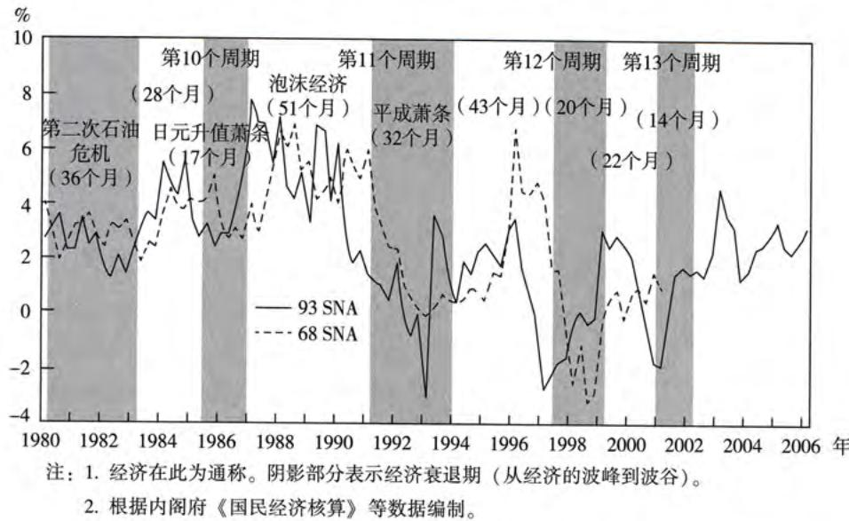  
图5-1 GDP增长率与经济

尽管本不是旨在探讨经济衰退的原因，但事先考察资产价格、融形势和物价动向等有助于了解经济的现状和前景。因此，本文将首先按照图

5-2分析股价与经济的关系。

  
图5-2 股价与经济

股价（日经平均股价）在1989年12月底达到高点（38915日元）后暴跌，从1990年底到1991年初的几个月期间虽然有所回升，但到1992年再次暴跌。这一轮1991年到1992年的大跌与第11个周期的衰退期重合。从1989年12月的股价顶峰开始仅1年多的时间就迎来了经济的波峰。

第12个周期的衰退期从1997年5月开始，但股价已经先在1996年6月达到了近期高点。如上所述，在经济衰退之前，股价已到达顶峰并开始下跌，直到经济衰退结束的前几个月，股价仍然在下跌。从2000年11月开始的第13个周期的衰退期同样如此，股价先在2000年3月达到峰值，与第12个周期的衰退阶段一样，直到经济衰退结束的前几个月，股价继续下跌。

从以上考察可以看出，在泡沫期以后的经济衰退期，股价的势与经济相比提前8个月至1年多，并且都进下跌通道。由于股价与GDP不同，可以实时观察，因此股价可以说是重要的经济先行指标。

和股价一样，地价也是重要的资产价格之一，接下来考察地价的走势。图5-3将市区价格指数的同比增长率分为六大城市和其他地区。从中可以看出，地价在20世纪80年代后半期的泡沫期出现大幅上涨。特别是六大城市的地价增幅领先于其他城市，从1987年到1990年的增长率接近 $30 \%$ 。

  
图5-3 地价变化

但是，地价增幅在1990年达到顶峰后急剧下降，1992年后反出现负增长，六城市市区的地价直下跌2005年。除六城市以外的地区，在刚刚过去的2007年依然持续下跌。

将这种地价的变动与泡沫经济后的三次经济衰退期联系起来后，可以发现一大特点，即在最初的第11个周期的衰退期（1991年2月—1993年10），地价由上涨转为幅下跌。在此后的两次经济衰退期，即第12个周期的衰退期（1997年51999年1）和第13个周期的衰退期（2000年11月—2002年1月），地价均持续下跌，地价增幅本身并没有出现大的变化。

图5-4描绘了货币供应量的增长率和隔夜拆借利率的势这两项融指标。从中可以看出，首先在泡沫经济崩溃后的第11个周期的经济衰退期（1991年21993年10），货币供应量和隔夜拆借利率均幅下降。仔细观察就会发现，作为货币需求指标的货币供应量在经济衰退之前，于1990年秋季达到峰值后急剧下降；另一方面，作为货币政策操作目标变量的隔夜拆借利率滞后半年左右，于1991年春季开始下降。在这经济衰退期间，本央设定的隔夜拆借利率标值被依次下调；另，货币供应量增长率在1992年底触底回升，约在10个后经济衰退结束。

  
图5-4货币供应量增长率与隔夜拆借利率

在第12个周期的经济衰退期（1997年5月—1999年1月），货币供应量增长率和隔夜拆借率均处于较低平，并且没有明显变化。此外，零利率政策是在经济衰退期结束后不久的1999年2月实施的。

在第13个周期的衰退期（2000年11月—2002年1月）之前，货币供应量增长率已于2000年初大幅下降，进衰退期后，反而呈现回升趋势。在此期间，隔夜拆借利率因2000年8月解除零利率政策而一度上升，但经济衰退已是不争的事实，2001年春季的宽松货币政策使隔夜拆借利率再次接近于零。

图5-5显示了消费者物价增幅的势。本文在此处调整了由于开征消费税（1989年度）和上调税率（1997年度）所引起的价格传导部分。由此可以看出，消费者物价增幅在20世纪80年代后半期的泡沫期上升，到1990年底左右，消费者物价和综合指数达到了4%左右的峰值。进入第11个周期的经济衰退期（1991年2月—1993年10月）后开始下滑，并持续下滑至经济衰退后的1995年，一度录得负值。随后在1996年转正，但进人第12个周期的经济衰退期（1997年5月—1999年1月）后又开始下滑，这一趋势一直持续到下轮经济衰退阶段，即第13个周期的衰退期（2000年11月—2002年1月）。消费者物价增幅的下滑几乎与第13个周期的衰退期同时结束，之后缓慢回升，物价增幅回升至零左右。因此，从2000年到2005年左右，消费者物价增幅在0到 $- 1 \%$ 的范围内变化，形成了缓慢的通货紧缩趋势。

  
图5-5 消费者物价指数的变动(同比)

注：1.实线为消费者物价和综合指数，虚线为剔除生鲜食品的综合指数。物价增幅是以经济企划厅1990年版和1998年版《物价报告》为参考，在开征消费税的1989年度减去1.2%、在上调税率的1997年度减去1.5%后得到的数值。阴影部分表示经济衰退期。2.根据总务省统计局的数据编制。

上阐述了泡沫破灭后主要宏观经济变量的变化，下作简要总结：

(1）泡沫破灭后有三次经济衰退期，其时间长度逐渐缩短。

(2）论在哪个经济衰退期，股价都会提前8个1年多开始下跌，经济衰退期间的股价也呈下跌态势，但一般都在波谷的前几个月开始回升。

(3）泡沫破灭后的地价在2005年之前直呈下跌态势，特别是在最初的第11个周期的经济衰退期，大城市的地价下跌幅度较大。

(4）货币供应量增长率在最初的第11个周期的经济衰退期幅下跌，并一度录得负值。在第12个周期和第13个周期的衰退期，与之前相比并没有出现大幅下跌。

(5）消费者物价增幅在三次经济衰退期都呈下降态势，特别是在第三次的第13个周期中，增幅为负，处于缓慢的通货紧缩状态。

以上总结表明，在泡沫经济崩溃后的经济衰退期，在作预测和经济评估时，即使仅粗略地观察股价、地价或货币供应量等资产价格和金融类指标，也可以掌握相当多的信息。

# 3政府的经济预期和实际值

下文将围绕政府每年年底公布的下一年度“经济预期”，考察其主要项目和实际值。据筑紫（1993） （p.3）和经济企划厅（1997）（p.63）的介绍，1950年的国民收入核算体系在某种程度上已经确定，1952年初左右，部门内开始预测1951年度的实际值，并对1952年度作出预期。1954年11实施的“关于1954年度下半年经济动向观测”的内阁会议报告在内阁会议上获得通过并首次发布，之后从1957年度开始使用“经济预期”这一表述。

政府发布“经济预期”并不是单纯地为了预测下一年度的本经济，而是将其作为经济财政管理的前提条件，据此制定预算。因此，经济预期中反映了财务省等各省厅的意见。另外，虽说现状也不能忽视，但它确实反映了政策效果得到实现后，政府对于下一年度经济状态的期望。政府公布此类信息，将对民营企业和家庭的经济活动产生影响，所以发布预期本身也可以看作是一种政策工具。

因此，本文将在了解政府经济预期的作用之后，考察其与实际值的比较。表5-1和表5-2显示了政府各年度的预期值和实际值。在1999年度前的经济预期中，GDP原则上采用名义值，实际值仅用作参考资料。因此，本文的实际值也仅显示参考资料中的实际GDP增长率，GDP构成项的详细内容则以名义值的增长率为准。

先，比较20世纪80年代后半期的泡沫期（1985年度至1990年度）和泡沫经济崩溃后（1991年度至2004年度）的平均值，可以发现，GDP的实际值和名义值的预期在泡沫期均低于实际值，有所低估，而在泡沫经济崩溃后则高于实际值，有所高估。但是，物价方面并没有这样的趋势，批发（国内企业）物价和消费者物价的预期均高于实际值，有所高估。

CDP在泡沫期的低估和泡沫破灭后的高估符合预期，那么物价预期的趋势性向上偏差意味着什么呢？一种可能性是以名义值为基础的政府预算存在向下刚性，难以编制以物价下跌为前提的预算。

其次，政府对泡沫破灭后的三次经济衰退期的预期均高于实际GDP。在表5-1、表5-2中，预期值与实际值之差达到1%以上的年份被涂上了阴影，而泡沫经济崩溃后的经济衰退期与实际GDP之差的阴影是一致的。这似乎是理所当然的，但政府似乎没有事先设想过经济衰退。不过，仔细观察便能发现，经济衰退的第一年度（1991年、1997年、2001年）的预期都低于上年度的实际值，说明政府预计经济开始衰退的年份不会像上年度那样实现增长，而结果也确实如此。

此外，在经济衰退分别持续了3年和2年的第12个周期和第13个周期的衰退期，第2年、第3年的预期均有所估。名义GDP中也呈现了这趋势。

由此可见，政府的经济预期并没有完全预测到向经济衰退的过渡，但却正确地预测了经济减速的可能性，而且认为经济衰退的程度将比实际情况更轻微。当然，就后者而言，正如当初所述，或许是因为政府的经济预期表现出了包含政策效果的理想经济状态。

其次是政府预期与经济衰退的关系，按构成项目逐项观察消费、住宅投资、设备投资和出口的预期。从1991年2月开始的第11个周期期间，在第一年度只有住宅投资和设备投资远低于政府预期，消费和出口基本符合预期。这意味着，在泡沫经济崩溃后，经济衰退是从住宅投资和设备投资等投资行为开始的。但是，细看的话可以发现，1991年度住宅投资的政府预期为“-0.1%”，而上一年度的实际值为“8.6%”，1991年度设备投资的政府预期为 $7 . 9 \%$ ”，而上一年度的实际值为“ $1 4 . 7 \%$ ”，预期大幅下降，这表明政府正确地预测了投资需求的放缓。

另外，从第11个周期经济衰退的第2年、第3年来看，无论是住宅投资还是设备投资的预期都继续出现估，特别是设备投资，其偏离幅度在第2年、第3年逐年增大。仅从设备投资来看，从1991年度到1995年度的5年间，政府预期的增长率高出2%以上的情况非常明显。在早期有人指出，泡沫期设备投资的过存量的调整是投资低迷的原因，但人们越来越意识到，这种调整是长期的，而且股价、地价或金融的因素也很重要。从政府预期的偏离度来看，即使在预期包含政策效果的情况下，仍有可能忽视了这种新的经济衰退机制。

在1997年5开始的第12个周期的经济衰退期，第年度的消费出和住宅投资低于上一年度的实际值，这表明经济衰退主要是从家庭部门开始的。尤其值得注意的是，住宅投资预计将放缓，而消费支出的预期高于上一年度，但实际值则远低于上一年度。在这一年，也就是1997年4月，消费税率从 $3 \%$ 提到 $5 \%$ ，同时，型银和证券公司相继临经营危机。政府在制定预期时就知道会上调消费税率，但没有预料到会爆发融危机。换之，政府对消费税率上调带来的消费需求提前释放的反作估计不，也没有预料到融危机导致的家庭消费信降温。

此外，与第11个周期的经济衰退期样，经济衰退的第年即1998年度的预期也第年出现了更的偏离。在这年，除了引发经济衰退的消费出和住宅投资外，设备投资和出口的预期也有所估。

<table><tr><td rowspan="2">年度</td><td colspan="3">实际GDP</td><td colspan="3">名义GDP</td><td colspan="3">名义民间消费支出</td><td colspan="3">名义民间住宅投资</td><td colspan="3">名义民营企业设备投资</td></tr><tr><td>政府预期</td><td>实际值</td><td>差额</td><td>政府预期</td><td>月实际值</td><td>差额</td><td>政府预期</td><td>实际值</td><td>差额</td><td>政府预期</td><td>实际值</td><td>差额</td><td>政府预期</td><td>实际值</td><td>差额</td></tr><tr><td>1985</td><td>4.6</td><td>4.5</td><td>0.1</td><td>6.1</td><td>6.7</td><td>-0.6</td><td>6.9</td><td>5.8</td><td>1.1</td><td>5.9</td><td>3.8</td><td>2.1</td><td>8.3</td><td>12.2</td><td>-3.9</td></tr><tr><td>1986</td><td>4.0</td><td>2.8</td><td>1.2</td><td>5.1</td><td>4.4</td><td>0.7</td><td>5.6</td><td>3.7</td><td>1.9</td><td>6.3</td><td>8.7</td><td>-2.4</td><td>7.1</td><td>4.2</td><td>2.9</td></tr><tr><td>1987</td><td>3.5</td><td>5.0</td><td>-1.5</td><td>4.6</td><td>5.1</td><td>-0.5</td><td>5.0</td><td>5.4</td><td>-0.4</td><td>8.3</td><td>27.4</td><td>-19.1</td><td>6.9</td><td>6.6</td><td>0.3</td></tr><tr><td>1988</td><td>3.8</td><td>6.7</td><td>-2.9</td><td>4.8</td><td>7.6</td><td>-2.8</td><td>5.1</td><td>5.9</td><td>-0.8</td><td>3.1</td><td>7.1</td><td>-4.0</td><td>10.0</td><td>19.1</td><td>-9.1</td></tr><tr><td>1989</td><td>4.0</td><td>4.3</td><td>-0.3</td><td>5.2</td><td>7.2</td><td>-2.0</td><td>6.1</td><td>6.9</td><td>-0.8</td><td>-0.2</td><td>5.7</td><td>-5.9</td><td>8.4</td><td>12.5</td><td>-4.1</td></tr><tr><td>1990</td><td>4.0</td><td>6.0</td><td>-2.0</td><td>5.2</td><td>8.5</td><td>-3.3</td><td>5.8</td><td>7.6</td><td>-1.8</td><td>2.9</td><td>8.6</td><td>-5.7</td><td>7.6</td><td>14.7</td><td>-7.1</td></tr><tr><td>1985-1990</td><td>4.0</td><td>4.9</td><td>-0.9</td><td>5.2</td><td>6.6</td><td>-1.4</td><td>5.8</td><td>5.9</td><td>-0.1</td><td>4.4</td><td>10.2</td><td>-5.8</td><td>8.1</td><td>11.6</td><td>-3.5</td></tr><tr><td>年度平均 1991</td><td>3.8</td><td>2.2</td><td>1.6</td><td>5.5</td><td>4.9</td><td>0.6</td><td>6.3</td><td>5.6</td><td>0.7</td><td>-0.1</td><td>-6.8</td><td>6.7</td><td>7.9</td><td>0.3</td><td>7.6</td></tr><tr><td>1992</td><td>3.5</td><td>1.1</td><td>2.4</td><td>5.0</td><td>2.5</td><td>2.5</td><td>5.8</td><td>3.3</td><td>2.5</td><td>4.5</td><td>-2.0</td><td>6.5</td><td>5.1</td><td>-5.3</td><td>10.4</td></tr><tr><td>1993</td><td>3.3</td><td>-1.0</td><td>4.3</td><td>4.9</td><td>-0.7</td><td>5.6</td><td>4.9</td><td>2.6</td><td>2.3</td><td>9.7</td><td>4.9</td><td>4.8</td><td>2.9</td><td>-14.8</td><td>17.7</td></tr><tr><td>1994</td><td>2.4</td><td>2.3</td><td>0.1</td><td>3.8</td><td>2.2</td><td>1.6</td><td>4.0</td><td>2.7</td><td>1.3</td><td>6.3</td><td>7.3</td><td>-1.0</td><td>0.1</td><td>-2.8</td><td>2.9</td></tr><tr><td>1995</td><td>2.8</td><td>2.5</td><td>0.3</td><td>3.6</td><td>1.9</td><td>1.7</td><td>4.2</td><td>2.1</td><td>2.1</td><td>1.9</td><td>-6.2</td><td>8.1</td><td>4.0</td><td>1.2</td><td>2.8</td></tr><tr><td>1996</td><td>2.5</td><td>2.9</td><td>-0.4</td><td>2.7</td><td>2.4</td><td>0.3</td><td>2.7</td><td>2.9</td><td>-0.2</td><td>2.6</td><td>14.7</td><td>-12.1</td><td>3.6</td><td>3.8</td><td>-0.2</td></tr><tr><td>1997</td><td>1.9</td><td>-0.0</td><td>1.9</td><td>3.1</td><td>1.0</td><td>$\\rac{}$</td><td>3.1</td><td>0.4</td><td>2.7</td><td>-3.5</td><td>-18.0</td><td>14.5</td><td>7.1</td><td>3.4</td><td>3.7</td></tr><tr><td>1998</td><td>1.9</td><td>-1.5</td><td>3.4</td><td>2.4</td><td>-1.9</td><td></td><td>3.3</td><td>0.0</td><td>3.3</td><td>5.7</td><td>-12.8</td><td>18.5</td><td>3.0</td><td>-9.8</td><td>12.8</td></tr><tr><td>1999</td><td>0.5</td><td>0.7</td><td>-0.2</td><td>0.5</td><td>-0.7</td><td>1.2</td><td>0.5</td><td>0.5</td><td>0.0</td><td>7.2</td><td>2.9</td><td>4.3</td><td>-6.9</td><td>-2.8</td><td>-4.1</td></tr><tr><td>2000</td><td>1.0</td><td>2.6</td><td>-1.6</td><td>0.8</td><td>0.9</td><td>-0.1</td><td>1.3</td><td>-0.4</td><td>1.7</td><td>-1.8</td><td>-0.5</td><td>-1.3</td><td>0.3</td><td>4.9</td><td>-4.6</td></tr><tr><td>2001</td><td>1.7</td><td>-0.8</td><td>2.5</td><td>1.0</td><td>-2.1</td><td>3.1</td><td>1.1</td><td>0.1</td><td>1.0</td><td>-2.0</td><td>-8.9</td><td>6.9</td><td>2.2</td><td>-5.0</td><td>7.2</td></tr><tr><td>2002</td><td>0.0</td><td>1.1</td><td>-1.1</td><td>-0.9</td><td>-0.8</td><td>-0.1</td><td>-0.9</td><td>-0.1</td><td>-0.8</td><td>-2.5</td><td>-3.2</td><td>0.7</td><td>-4.8</td><td>-5.4</td><td>0.6</td></tr><tr><td>2003</td><td>0.6</td><td>2.1</td><td>-2.7</td><td>-0.2</td><td>0.8</td><td>-1.0</td><td>-0.4</td><td>-0.2</td><td>-0.2</td><td>-2.6</td><td>0.0</td><td>-2.6</td><td>0.2</td><td>3.5</td><td>-3.3</td></tr><tr><td>2004</td><td>1.8</td><td>2.0</td><td>-0.2</td><td>0.5</td><td>1.0</td><td>-0.5</td><td>0.2</td><td>0.6</td><td>-0.4</td><td>-0.2</td><td>2.7</td><td>-2.9</td><td>3.7</td><td>6.1</td><td>-2.4</td></tr><tr><td>1991—2004</td><td></td><td></td><td></td><td></td><td>0.8</td><td>1.5</td><td>2.6</td><td>1.4</td><td></td><td></td><td>-1.9</td><td></td><td></td><td></td><td></td></tr><tr><td>年度平均</td><td>2.0</td><td>1.2</td><td>0.7</td><td>2.3</td><td></td><td></td><td></td><td></td><td>1.1</td><td>1.8</td><td></td><td>3.7</td><td>2.0</td><td>-1.6</td><td>3.7</td></tr></table>

<table><tr><td rowspan="3">年度</td><td colspan="3">名义公共固定资本形成</td><td colspan="3">名义出口等</td><td colspan="3">批发物价 （国内批发物价、国内企业物价）</td><td colspan="3">消费者物价</td></tr><tr><td>政府预期</td><td>实际值</td><td>差额</td><td>政府预期</td><td>实际值</td><td>差额</td><td>政府预期</td><td>实际值</td><td>差额</td><td>政府预期</td><td>实际值</td><td>差额</td></tr><tr><td>1985</td><td>-0.4</td><td>-5.3</td><td>4.9</td><td>6.8</td><td>-3.5</td><td>10.3</td><td>1.1</td><td>-1.5</td><td>2.6</td><td>2.8</td><td>1.9</td><td>0.9</td></tr><tr><td>1986</td><td>1.1</td><td>3.7</td><td>-2.6</td><td>-4.1</td><td>-15.8</td><td>11.7</td><td>-1.8</td><td>-5.2</td><td>3.4</td><td>1.9</td><td>0.0</td><td>1.9</td></tr><tr><td>1987</td><td>1.2</td><td>8.7</td><td>-7.5</td><td>3.1</td><td>-3.5</td><td>6.6</td><td>1.0</td><td>-1.7</td><td>2.7</td><td>1.6</td><td>0.5</td><td>1.1</td></tr><tr><td>1988</td><td>0.8</td><td>2.1</td><td>-1.3</td><td>4.6</td><td>7.2</td><td>-2.6</td><td>0.3</td><td>-0.5</td><td>0.8</td><td>1.3</td><td>0.8</td><td>0.5</td></tr><tr><td>1989</td><td>2.1</td><td>7.1</td><td>-5.0</td><td>10.4</td><td>12.9</td><td>-2.5</td><td>0.9</td><td>2.6</td><td>-1.7</td><td>2.0</td><td>2.9</td><td>-0.9</td></tr><tr><td>1990</td><td>1.5</td><td>7.7</td><td>-6.2</td><td>13.2</td><td>5.7</td><td>7.5</td><td>0.6</td><td>1.5</td><td>-0.9</td><td>1.6</td><td>3.3</td><td>-1.7</td></tr><tr><td>1985—1990年度平均</td><td>1.1</td><td>4.0</td><td>-3.0</td><td>5.7</td><td>0.5</td><td>5.2</td><td>0.4</td><td>-0.8</td><td>1.2</td><td>1.9</td><td>1.6</td><td>0.3</td></tr><tr><td>1991</td><td>3.6</td><td>8.3</td><td>-4.7</td><td>1.8</td><td>1.9</td><td>-0.1</td><td>-0.1</td><td>0.4</td><td>-0.5</td><td>2.4</td><td>2.8</td><td>-0.4</td></tr><tr><td>1992</td><td>3.3</td><td>17.7</td><td>-14.4</td><td>4.9</td><td>0.5</td><td>4.4</td><td>-0.2</td><td>-1.0</td><td>0.8</td><td>2.3</td><td>1.6</td><td>0.7</td></tr><tr><td>1993</td><td>9.5</td><td>8.1</td><td>1.4</td><td>3.4</td><td>-8.0</td><td>11.4</td><td>0.3</td><td>-1.8</td><td>2.1</td><td>2.1</td><td>1.2</td><td>0.9</td></tr><tr><td>1994</td><td>12.5</td><td>-2.2</td><td>14.7</td><td>3.9</td><td>1.9</td><td>2.0</td><td>0.2</td><td>-1.3</td><td>1.5</td><td>1.5</td><td>0.4</td><td>1.1</td></tr><tr><td>1995</td><td>3.8</td><td>6.7</td><td>-2.9</td><td>4.3</td><td>4.4</td><td>-0.1</td><td>0.5</td><td>-0.8</td><td>1.3</td><td>0.9</td><td>-0.1</td><td>1.0</td></tr><tr><td>1996</td><td>1.0</td><td>-3.0</td><td>4.0</td><td>7.1</td><td>10.5</td><td>-3.4</td><td>0.1</td><td>-1.5</td><td>1.4</td><td>0.5</td><td>0.4</td><td>0.1</td></tr><tr><td>1997</td><td>0.5</td><td>-5.4</td><td>5.9</td><td>4.7</td><td>10.5</td><td>-5.8</td><td>1.3</td><td>1.0</td><td>0.3</td><td>1.6</td><td>2.0</td><td>-0.4</td></tr><tr><td>1998</td><td>-5.9</td><td>-0.8</td><td>-5.1</td><td>5.6</td><td>-5.1</td><td>10.7</td><td>-0.8</td><td>-2.2</td><td>1.4</td><td>0.7</td><td>0.2</td><td>0.5</td></tr><tr><td>1999</td><td>7.8</td><td>-2.1</td><td>9.9</td><td>-3.2</td><td>-2.5</td><td>-0.7</td><td>-0.9</td><td>-0.8</td><td>-0.1</td><td>0.1</td><td>-0.5</td><td>0.6</td></tr><tr><td>2000</td><td>0.7</td><td>-8.3</td><td>9.0</td><td>0.8</td><td>6.7</td><td>-5.9</td><td>-0.1</td><td>-0.1</td><td>0.0</td><td>0.3</td><td>-0.5</td><td>0.8</td></tr><tr><td>2001</td><td>-3.8</td><td>-6.5</td><td>2.7</td><td>3.5</td><td>-6.0</td><td>9.5</td><td>-0.4</td><td>-2.4</td><td>2.0</td><td>-0.2</td><td>-1.0</td><td>0.8</td></tr><tr><td>2002</td><td>-2.7</td><td>-6.7</td><td>4.0</td><td>-0.2</td><td>8.4</td><td>-8.6</td><td>-0.8</td><td>-1.6</td><td>0.8</td><td>-0.6</td><td>-0.6</td><td>0.0</td></tr><tr><td>2003</td><td>-5.2</td><td>-9.4</td><td>4.2</td><td>1.3</td><td>6.5</td><td>-5.2</td><td>-0.9</td><td>-0.5</td><td>-0.4</td><td>-0.4</td><td>-0.2</td><td>-0.2</td></tr><tr><td>2004</td><td>-12.2</td><td>-11.6</td><td>0.6</td><td>5.1</td><td>11.0</td><td>-5.9</td><td>-0.4</td><td>1.5</td><td>-1.9</td><td>-0.2</td><td>-0.1</td><td>-0.1</td></tr><tr><td>19912004年度平均</td><td>0.9</td><td>-1.1</td><td>2.1</td><td>3.1</td><td>2.9</td><td>0.2</td><td>-0.2</td><td>-0.8</td><td>0.6</td><td>0.8</td><td>0.4</td><td>0.4</td></tr></table>

最后是从2000年11月开始的第13个周期的经济衰退期，从2001年度来看，所有构成项目的实际值都低于政府预期。但是，上一年度的变化呈现出一个特征，即消费支出和住宅投资在上一年度均为负增长，而设备投资和出口所代表的企业部门的实际值转为负增长。与上一年度的实际值相比，政府预期正确地预测了该年度的增长率会下降，但所有的预期值都为正，没有预料到会出现负增长。

第13个周期的经济衰退是由于2000年初开始的全球股价低迷和美国经济停滞等，即所谓的IT泡沫破灭所导致的，2001年度的经济衰退并非突然出现，而是在某种程度上可以事先预料到的。在这里也可以看出，政府正确预测了经济衰退这一大方向，但却低估了它的严重性。

如上所述，本文比较了经济衰退与政府预期的关系，一般认为预测经济衰退的转折点是很困难的，但政府预期曾多次正确把握了这一转折，即把握了经济的方向。这可能是因为政府预期试图通过均值回归预测来防止出现重大错误，体现了一种谨慎或者保守的态度。从另一个方面来看，政府经济预期的问题在于，一旦进入经济衰退，其对增长率下降和恢复的时间预期过于乐观。要克服这些问题，不能单纯地观察当前经济数据的势，必须第一时间了解各个时间段的经济衰退机制。能否把握好这种经济波动的机制，也会影响正确政策的选择。

正如上一节所述，在泡沫经济崩溃后的经济衰退阶段，应当关注股价、地价等资产价格和货币供应量等金融因素。

其中，从数据走势可以看出，资产价格和金融因素是造成泡沫经济崩溃后第11个周期的经济衰退（平成萧条）的主要原因。第12个周期和第13个周期的经济衰退都受到了政策因素和外生因素的较强影响，前者体现为消费税上调和金融动荡，后者体现为全球IT泡沫破灭。由于这些冲击发生在经济基本面较衰弱的时期，看起来较为严重，但其机制相对容易理解。

最后考察各构成项目的政府预期中的公共固定资本形成，即政府投资，这一项目目前还没有提及。政府投资是中央及地方政府的公共投资，因此，与其说是预测的对象，不如说在很大程度上是政府可操作的变量。但是，从表5-2可以看出，政府预期并不总是接近实际值。在泡沫期，实际值超过政府预期；在泡沫经济崩溃后，实际值反而出现低于政府预期的趋势。

究其原因，政府预期是中央政府作出的，因此，很难事先正确地预测地方的公共投资等。从这一观点来看，在20世纪80年代的泡沫期，地方政府增加的支出超出中央政府的预料；泡沫经济崩溃后，地方财政的吃紧程度又超出中央政府的预料，地方政府开始压缩公共投资。

# 120宏观经济与产业结构

除了这些因素之外，虽然政府预期是根据最初的预算计算的，但也会根据之后的经济形势增加预算，因此有些年份的实际值会与预期存在差异。例如，泡沫经济崩溃后的1992年和1998年，经济应对政策中增加了公共投资，因此实际值超过了预期。

# 4 政府的经济评估和政策应对

# 4.1 《月度经济报告》

下一节以后的内容将围绕泡沫经济崩溃后的经济衰退展开，根据每月发布的《月度经济报告》，验证政府是如何实时分析判断经济形势并出台政策的。在此之前，本文将简要介绍政府的《月度经济报告》和相关的现有研究。

《月度经济报告》的前身是1954年起编制的《月度经济形势》。《月度经济形势》是面向经济部长协议会的报告，从1958年3起改名为《度经济报告》，沿用至今。《月度经济报告》被定位为政府就经济发表官方意见的报告书，由内阁府汇总，由经济财政担当大臣提交相关部长级会议。除部长外，执政党干部（干事长、政调会长等）和日本央行行长也会出席相关部长级会议。有报道称，在有关《月度经济报告》的相关部长级会议上，执政党事长曾向本央长陈述货币政策的意见①。

从世界范围来看，并非所有政府都会在每个发布《度经济报告》，针对经济现状阐述官方意见。正如小卷（2001）总结的那样，例如在美国，经济评估的实施主体是NBER（National Bureau of EconomicResearch，美国全国经济研究所）这一民间智库，政府并不会对每个月的经济状况发布官方意见。一般情况下，中央银每个月都会公布对经济形势的判断，但在法国和德国等国家，人们并不关心经济阶段的判断，政府也不会公布相关信息。

坪内、白、筱崎（2003）统计分析了政府《月度经济报告》与经济扩散指数（DI）之间的关系。他们将《月度经济报告》的总体判断分为下降、持平和上升三个类别，并通过独性检验对其与经济扩散指数的关系进了假设检验。结果显示，从经济转折点附近来看，《度经济报告》和经济扩散指数的致同步指标之间不存在关联性。相反，《度经济报告》的判断与经济扩散指数的滞后指标之间存在关联性。换句话说，《月度经济报告》中关于经济转换的判断有所滞后。关于这一点，该文章指出，政府并不是为了避免对经济作出糟糕的判断故意让判断滞后，而是因为《度经济报告》的总体判断所重视的指标偏向滞后指标，所以导致判断滞后。

除此之外，还有一些原因会推迟经济评估。原本像股价这样可以实时观察的经济数据就很少，很多数据都需要一定的时间进收集和统计。另外，由于经济数据中经常包含测量误差和偶发因素，因此谨慎地摸清经济的基本情况需要3个月左右，这一经验法则也广为人知。

# 4.2 1991年2月1993年10月的衰退阶段

本末尾的附表5-1从进第11个周期衰退期的1991年2月以后的《度经济报告》中选出了关于经济的总体（基本情况）判断和政策的描述。由此发现，政府最早认识到经济减速是在1991年9月。此时，政府认为，虽然经济在缓慢减速，但仍将继续扩张。此外，政府也没有具体描述政策，只写道：关注经济动向，努力确保灵活的经济运行。虽然表没有体现，但货币政策已于7月首次下调中央银行再贴现率。

随后在1991年11政府暗示扩张速度将放缓，但“向无通胀的可持续增长路径过渡”这措辞体现了政府的乐观态度。然而，本央于1991年11月和12月相继下调中央银行再贴现率，接连不断地采取宽松货币政策，这一态度与政府在《度经济报告》中的表述截然相反。

1992年2月，经济的总体判断中删除了“扩张”二字，虽然比事后被认定为经济波峰的1991年2晚了年，但政府终于承认经济进衰退阶段。1992年3月提到制定“紧急经济对策”，1992年4月下调中央银再贴现率，这是继上一年之后的第4次下调。此外，1992年3的“紧急经济对策”中没有追加预算。

1992年8的“综合经济对策”中次包含了新的预算措施。当时的刺激规模为10.7万亿日元，是当时史上规模最大的一次①。但是，经济依然没有复苏，1993年1的总体判断认为经济“低迷”，这已经属于最激烈的措辞。

从1993年春夏的总体判断中可以看到“局部好转的迹象”和“向复苏的迹象”等表述。1993年春夏实施了“经济对策”，但1993年秋季又开始使用经济总体“低迷”的表述。

在事后的经济认定过程中，1993年10为波谷，经济开始复苏，在1994年2月的经济衰退阶段采取了第5次经济对策，终于在1994年4月增加了“持续低迷”但出现“局部好转的迹象”的表述。1994年9的总体判断删除了“低迷”这表述。

上述发展历程总结如下：

（1）对于经济衰退的开始和结束，政府的认识实际情况晚了1年左右。（2）经济衰退初期的“向无通胀的可持续增长路径过渡”这一表述表明，政府在经济减速的情况下仍然保持乐观的态度。(3）本央推宽松货币政策的时机早于政府对经济恶化的认识。（4）政府对经济衰退的认识和次出台“经济对策”在时间上乎没有滞后，但也没有追加预算。(5）次实施包含追加预算的“经济对策”是在经济波峰的1年6个月后。(6）1993年春夏，政府对经济的乐观看法暂时获得较多认同，随后再次修改为“低迷”这一表述。

# 4.3 1997年5月1999年1月的衰退阶段

接下来研究自1997年5月开始的第12个周期的经济衰退阶段。附表5-2提到了当时政府的经济评估和政策。从这一点来看，在事后被认定为经济波峰的1997年5，政府已经认识到“经济正在复苏”。此后，政府虽然担心复苏速度放缓，但仍判断7月、9月、11月有“复苏态势”。1997年12月的总体判断删除了“复苏”二字。此时，距离经济波峰已经出现了7个的滞后。在此之前，1997年11月制定了“经济对策”。此次“经济对策”和上一次（第11个周期）经济衰退时最初的“经济对策”一样，没有追加预算。货币政策在1995年9月以后持续宽松，中央银行再贴现率维持在0.5%。

此后，政府在1998年2开始使“经济停滞”这激烈措辞，1998年4月，在这一经济衰退阶段首次实施了包含追加预算的“经济对策”。此次经济对策的刺激规模为16万亿日元，是当时史上规模最大的刺激政策。

但是，经济并没有立即复苏，1998年8月，政府的总体判断认为经济“状况分严峻”，表现出了强烈的危机感。11政府采取了刺激规模超过20万亿日元的“经济对策”。1998年9月，日本在货币政策面引导利率低，从而使隔夜拆借利率保持在 $0 . 2 5 \%$ 左右。

在采取了上述逆周期措施之后，政府于1998年12表虽然经济形势严峻，但局部“显示出改善的迹象”，并于1999年3月表示“经济逐步止跌”。事后认定的经济波谷是1999年1月，政府的认识与这一时期一致。不过，直到1999年7，政府才在经济评估中使“复苏”或“改善”的表述，此时距离真正的经济波已经过去了6个月。

关于这一时期的货币政策，继1998年9月引导利率低后，1999年2月开始实施“零利率政策”。

上述发展历程总结如下：

（1）对于经济衰退的开始和结束，政府的认识比实际情况晚了半年左右。(2）日本央继续实施宽松货币政策，但新出台的进步宽松政策比政  
府对经济衰退的认识晚了约9个月。（3）政府对经济衰退的认识和次出台“经济对策”在时间上乎没有  
滞后，但也没有追加预算。（4）次实施包含追加预算的“经济对策”是在经济波峰的11个后。(5）实施“零利率政策”是在经济衰退期结束后的复苏阶段。

# 4.42000年11月2002年1月的衰退阶段

最后研究自2000年11开始的第13个周期的经济衰退阶段。附表5-3提到了当时政府的经济评估和政策。在事后被认定为经济波峰的2000年11月，政府已经认识到经济“正在持续地缓慢改善”。不过，在这一经济衰退阶段之前，2000年10月政府已经制定了包含追加预算的《日本复兴的新发展政策》。在对经济的总体判断中，政府于2001年3月将改善描述为“止步不前”，并于2001年6明确提到经济“恶化”。这表明政府的认识比经济波峰晚了约半年。

政府判断经济衰退后，于2001年4月制定了“紧急经济对策”。但是，与此前的两次经济衰退期一样，这次也没有追加预算。春季以后，经济持续恶化，2001年10月启动“改革先行计划”，采取了刺激规模为1.3万亿日元的小规模逆周期措施，同年12月启动“紧急应对计划”，采取了刺激规模为4.1万亿日元的经济对策。不过，从刺激规模可以看出，与前两次经济衰退期相比，经济对策的预算规模大幅缩减。

事后认定的经济波是2002年1月，但此时政府还没有认识到经济已处于波。政府在总体判断中认为经济是在2002年5月“触底”的，比实际情况滞后了4个月左右。

在第13个周期的经济衰退期，货币政策的动向令人眼花缭乱，这与政府采取的小规模逆周期措施形成了鲜明的对比。在经济进入衰退前的2000年8月，日本央行不顾政府反对，解除了“零利率政策”。但是，经济在经过2000年11的波峰之后已经进衰退期，本央在政府实施“紧急经济对策”之前，于2001年2月两次下调中央银再贴现率，表明了宽松态度，并于3采取新的货币宽松法，实施了“量化宽松政策”。然后，依次调了作为“量化宽松政策”操作标变量的本央准备账户余额的标值，2004年1该标余额达到了30万亿-35万亿元的峰值。

上述发展历程总结如下：

（1）对于经济衰退的开始和结束，政府的认识实际情况晚了4个到半年左右。

(2）本央的新轮宽松货币政策与政府对经济恶化的认识乎同步或偏早。

（3）政府对经济衰退的认识和次出台“经济对策”在时间上乎没有滞后，但也没有追加预算。

（4）次实施包含追加预算的“经济对策”是在经济波峰后的1年左右。

(5）在经济衰退期结束后的复苏阶段，仍在继续实施“量化宽松政策”。

# 5政府的经济规划和中期展望

至此，本文分析了政府各年公布的经济预期和各月公布的《月度经济报告》。最后考察每隔35年编制的政府经济规划和中期展望。

根据经济企划厅（1997）的介绍，经济规划在本的基本作如下：（1）明确对经济社会的理想目标和可实现状态的展望；（2）确定政府在中长期内应实施的经济运行的基本方向，并明确重点政策目标和政策工具；（3）对家庭和企业的活动提出指导意见。

表5-3汇总了20世纪80年代以后制定的经济规划和中期展望。先，从总体上分析增长率的预期（计划增长率)。1983年制定的《20世纪80年代经济社会的展望和方针》以泡沫期前的时期为对象，在此期间，预期值和实际值没有太差异。1988年公布的《与世界共存的本》的对象期包括泡沫期，其预期值低于实际值。

此后，1992年政府制定了《活国五年规划》，1995年制定了《结构改的经济社会规划》，1999年制定了《经济社会应有的貌和经济复兴的政策针》，7年内三次制定经济规划，虽然预期逐渐下调为“ $3 . 5 \%$ 左右”“3%左右”和“2%左右”，但从平均结果来看，实际值均低于预期。1991年以后，股价和地价的泡沫已经破灭，显然面临着不同于正常经济周期的结构性问题。从结果来看，这一时期制定的经济规划的增长率预期给人留下了过于乐观的印象。

<table><tr><td rowspan=1 colspan=1>规划名称</td><td rowspan=1 colspan=1>内阁会议通过的年份时任内阁</td><td rowspan=1 colspan=1>对象期间</td><td rowspan=1 colspan=1>目的</td><td rowspan=1 colspan=1>实际增长率预期</td><td rowspan=1 colspan=2>实际增长率实际值</td></tr><tr><td rowspan=1 colspan=1>20世纪80年代经济社会的展望和方针</td><td rowspan=1 colspan=1>1983年中曾根内阁</td><td rowspan=1 colspan=1>1983—1990年度</td><td rowspan=1 colspan=1>●建立和平稳定的国际关系●建立有活力的经济社会●建立安心富裕的国民生活</td><td rowspan=1 colspan=1>4%左右</td><td rowspan=1 colspan=1>1983年1984年1985年1986年1987年</td><td rowspan=1 colspan=1>2.6%4.1%4.3%3.2%5.0%</td></tr><tr><td rowspan=1 colspan=1>与世界共存的日本-经济运行五年规划</td><td rowspan=1 colspan=1>1988年竹下内阁</td><td rowspan=1 colspan=1>1988—1992年度</td><td rowspan=1 colspan=1>●纠正对外失衡，贡献世界●建立有获得感的国民生活●实现地区经济社会的均衡发展</td><td rowspan=1 colspan=1>3.75%左右</td><td rowspan=1 colspan=1>1988年1989年1990年1991年</td><td rowspan=1 colspan=1>6.0%4.7%5.3%3.0%</td></tr><tr><td rowspan=1 colspan=1>生活大国五年规划-与地球社会共存</td><td rowspan=1 colspan=1>1992年宫泽内阁</td><td rowspan=1 colspan=1>1992—1996年度</td><td rowspan=1 colspan=1>●向活国转型·与地球社会共存·完善发展基础</td><td rowspan=1 colspan=1>3.5%左右</td><td rowspan=1 colspan=1>1992年1993年1994年</td><td rowspan=1 colspan=1>0.7%0.3%0.6%</td></tr><tr><td rowspan=1 colspan=1>结构改革的经济社会规划-经济有活力，生活有保障</td><td rowspan=1 colspan=1>1995年村山内阁</td><td rowspan=1 colspan=1>1995—2000年度</td><td rowspan=1 colspan=1>●自由、有活力的社会●创造富裕安心的经济社会参与社区建设</td><td rowspan=1 colspan=1>3%左右</td><td rowspan=1 colspan=1>1995年1996年1997年1998年</td><td rowspan=1 colspan=1>2.5%2.9%-0.0%-1.5%</td></tr></table>

<table><tr><td rowspan=1 colspan=1>规划名称</td><td rowspan=1 colspan=1>内阁会议通过的年份时任内阁</td><td rowspan=1 colspan=1>对象期间</td><td rowspan=1 colspan=1>目的</td><td rowspan=1 colspan=1>实际增长率预期</td><td rowspan=1 colspan=2>实际增长率实际值</td></tr><tr><td rowspan=1 colspan=1>经济社会应有的面貌和经济复兴的政策方针</td><td rowspan=1 colspan=1>1999年小渊内阁</td><td rowspan=1 colspan=1>到2010年左右</td><td rowspan=1 colspan=1>●建设多种智慧的社会●少子老龄化的准备·应对全球化●与环境的和谐</td><td rowspan=1 colspan=1>2%左右</td><td rowspan=1 colspan=1>1999年2000年2001年</td><td rowspan=1 colspan=1>0.7%2.6%-0.8%</td></tr><tr><td rowspan=1 colspan=1>结构改革和经济财政中期展望</td><td rowspan=1 colspan=1>2002年小泉内阁</td><td rowspan=1 colspan=1>2002-2006年度</td><td rowspan=1 colspan=1>●发挥人的能力和个性●在全球广泛领域中大展身手、作出贡献●民间驱动的经济增长●可持续的财政和社会保障制度</td><td rowspan=1 colspan=1>1%左右</td><td rowspan=1 colspan=1>2002年2003年2004年</td><td rowspan=1 colspan=1>1.1%2.1%2.0%</td></tr><tr><td rowspan=1 colspan=1>结构改革和经济财政中期展望-2005年度修订版</td><td rowspan=1 colspan=1>2006年小泉内阁</td><td rowspan=1 colspan=1>2006—2010年度</td><td rowspan=1 colspan=1>·摆脱通货紧缩·民间驱动的持续经济增长•健全财政</td><td rowspan=1 colspan=1>1.5%左右</td><td rowspan=1 colspan=1>2005年2006年</td><td rowspan=1 colspan=1>2.4%2.4%</td></tr></table>

此外，1995年制定的《结构改革的经济社会规划》提出，结构改革未取得进展时的增长率预期为“ $1 . 7 5 \%$ 左右”。虽然对象期的平均值也低于这数字，但像这样明示条件并预测增长率的方式，有益于呼吁采取必要政策。

2002年的《结构改革和经济财政中期展望》以及之后的《2005年度修订版》将增长率预期幅下调“ $1 \%$ 左右”和“ $1 . 5 \%$ 左右”，比以往的经济规划更为悲观。可以看出，这些规划试图通过给出悲观预期，以此作为结构改革的动力。这预示着经济规划乃至中期展望的性质发生了重大变化。

对于经济规划本身的这种变化，可以通过经济规划的内容及其制定的经过进研究。1983年在中曾根内阁的领导下制定的《20世纪80年代经济社会的展望和针》，鉴于本经济的国际化、老龄化、成熟化等情况，提出了“建和平稳定的国际关系”“建有活的经济社会”“建安富裕的国民活”等标。这些观点是此后20多年本面临的长期课题，显示了当时的经济规划具有“长期展望和针”的性质。

之后政府提出的《与世界共存的本》和《生活大国五年规划》，通过“地区经济社会的发展”和“向生活大国转型”等内容，反映了当时的总理下登和宫泽喜作为政治家的理念和愿景。下登所提出的“地区经济社会的发展”在泡沫经济的推动下，以“故乡创建1亿元事业”的形式落地。宫泽喜一在泡沫经济之前提出“资产倍增计划”，以向“生活大国”转型，但这一计划因泡沫经济的崩溃而搁浅。

受泡沫经济崩溃的影响，经济规划的性质从长期缩短到中期。此外，政府的场也从主导国家经济活动转变为在市场经济中发挥一定作用。其象征就是结构改革，1995年制定的《结构改革的经济社会规划》提出了具体措施。正如结构改革所需的《纠正和激活成本结构的动计划》一样，它详细提出了各产业领域的应对措施等。

1999年在渊相的领导下，政府制定了《经济社会应有的面貌和经济复兴的政策方针》，其对象期限约为10年，比以往的规划更长，内容也如标题“应有的面貌”所示，回到了全面突显“结构改革”以前的理念风格。但是，在小泉首相领导下制定的《结构改革和经济财政中期展望》再次全面提出结构改革，并未像以前一样抽象地展示应有的社会面貌，而是提出了具体的政策，用“结构改革”的方法来解决面临的课题。

通过考察经济规划我们发现，从近年来的发展趋势看，它已经变成长期的展望和方针以及体现总理大臣的政治理念和落实理念的政策，最近，还演变成从中期的度解决课题的措施。但是，这种变化可能意味着在日本经济困难的情况下，日本不得不解决眼前的课题；而在日本经济表现良好的情况下，则可以提出理念和实现这些理念的政策。

# 6结束语

本基于泡沫期后本经济状况，考察了政府的经济预期、经济评估和经济规划。

首先，在泡沫期以后的宏观经济概述中，观察到资产价格，特别是股价的走势先于经济变化。另外，尤其是在泡沫经济崩溃后的经济衰退中，地价和货币供应量等指标也显示出了异常的动向。这表明在探索经济波动的时机和机制方面，资产价格和金融因素占有非常重要的地位。

其次是政府对经济的预期，从泡沫期和之后的时期来看，政府在泡沫期低估了GDP，而在泡沫经济崩溃后则高估了GDP。物价方面，国内企业物价（批发物价）和消费者物价都存在高估的倾向，与泡沫经济的发展阶段无关。可以推测，物价预测的向上偏差对于由名义值决定的政府预算具有向下刚性，政府难以编制以物价下跌为前提的预算。

此外，政府对经济衰退方向的预期往往是正确的。但同时也存在明显的问题——经济衰退期第2年和第3年的预期出现了更大的偏离；在泡沫经济崩溃后最严重的经济衰退期，设备投资被长期高估。这种关于经济衰退的乐观看法说明，坚信均值回归的保守经济观念可能影响了政府的预期。

想解决这些问题，就需要打破固有观念，及时了解当时经济衰退的机制。可以认为，在泡沫经济后的经济衰退中，需要特别注意股价、地价等资产价格以及不良债权问题、货币供应量等融因素。

关于政府在月度经济报告中发布的经济评估，在泡沫经济崩溃后的衰退期，政府的认识有1年左右的滞后，但在其后的两次经济衰退期内，又缩短为半年左右。而且，在泡沫经济崩溃后的任何一次经济衰退期内，政府对经济衰退的认识和次出台逆周期措施几乎是在同一时间，没有时间上的滞后。但这些措施并不涉及预算。在泡沫经济崩溃后的衰退期内，涉及预算的经济对策在波1年半以后出台，而在其他两次衰退期内，则是在波谷1年左右以后出台。关于经济衰退的认识，泡沫经济崩溃后的经济衰退是比较特殊的，而在之后的两次经济衰退中，政府对经济衰退的认识并没有太大的滞后。此外，政府对经济衰退的认识和首次出台经济对策几乎是在同一时间，这不禁让人担心，一旦政府认识到经济走向衰退，就必须采取一些应对措施，这反而会推迟对经济衰退的认定。正如浅子、上田、加纳（2003）所指出的，这表明有必要建防墙，将政策评估与经济评估分开。实际上，以美国的NBER（美国全国经济研究所）为代表，欧美各国的经济评估多委托给民间机构，像本这样由政府每发布经济评估的国家并不多。

本文观察到，在泡沫经济崩溃后，本央的宽松货币政策与政府的应对措施相比并不算晚，但1997年5开始的泡沫经济崩溃后第次经济衰退期的应对措施却晚于政府。这可能是因为，此时政策利率水平已经足够低，当需要进一步压低利率时，日本央在进“零利率”这一未知领域时遇到了很大阻力。

最后，从近年来的发展趋势看，政府的经济规划已经变成长期的展望和方针以及体现总理大的政治理念和落实理念的政策，最近，还演变成从中期的角度解决课题的措施。不过，也可以从另外一种角度来看待这种变化在本经济困难的情况下，本不得不解决眼前的课题；而在本经济表现良好的情况下，则可以提出理念和实现这些理念的政策。

<table><tr><td rowspan=1 colspan=1></td><td rowspan=1 colspan=1>总体判断</td><td rowspan=1 colspan=1>提及政策</td><td rowspan=1 colspan=1></td></tr><tr><td rowspan=1 colspan=1>1991年2月经济波峰</td><td rowspan=1 colspan=1>综上所述，日本经济保持强劲的国内需求，企业盈利持续增长，就业人数稳步增长，经济处于扩张阶段。</td><td rowspan=1 colspan=1>1月25，政府在内阁会议上通过了《1991年度经济预期和经济运的基本态度》（预计1991年度实际经济增长率为3.8%左右）以及1991年度一般公共预算。</td><td rowspan=1 colspan=1>1991年2月经济波峰</td></tr><tr><td rowspan=1 colspan=1>1991年9月</td><td rowspan=1 colspan=1>综上所述，就日本经济而言，住宅投资呈下降趋势，设备投资增速放缓但基础强劲，个人消费坚挺。企业盈利仍处于高位，劳动力供需保持紧平衡状态。如上所述，日本经济缓慢减速，但依然保持扩张态势。</td><td rowspan=1 colspan=1>政府将密切关注国内外经济发展趋势，继续努力确保经济运行灵活适当，以实现以内需为中心的经济持续扩张。</td><td rowspan=1 colspan=1>1991年9月</td></tr><tr><td rowspan=1 colspan=1>1991年11月</td><td rowspan=1 colspan=1>综上所述，就日本经济而，住宅建设呈下降趋势。设备投资增速放缓，但总体上比较稳健。企业盈利总体下滑，但仍处于高位。个人消费坚挺。劳动力供需保持紧平衡状态。如上所述，日本经济的扩张速度正在缓慢减速。这表明经济处于向通胀的可持续增长路径过渡的过程中。</td><td rowspan=1 colspan=1>政府将密切关注国内外经济发展趋势，继续努力确保经济运行灵活适当，以实现以内需为中心的经济持续扩张。</td><td rowspan=1 colspan=1>1991年11月</td></tr></table>

<table><tr><td></td><td>总体判断</td><td>提及政策</td><td></td></tr><tr><td>1992年1月</td><td>综上所述，就日本经济而言，从需求方面来看，住宅建设呈 现下降趋势，但出现了止跌的迹象。设备投资增速放缓，但 总体上比较稳健。个人消费基本保持坚挺。从产业方面来 看，工矿业生产反复震荡。企业盈利总体下滑，但仍处于高 位。从就业方面来看，劳动力供需保持紧平衡状态。如上所 述，近期内，日本经济此前的扩张速度有所放缓，处于向无 通胀的可持续增长路径过渡的调整过程中。</td><td>政府一直在精准精细抓好经济运行，以便向以内需为中心 的无通胀可持续增长路径平稳过渡，并根据这一宗旨，于 1月24日在内阁会议上通过了《1992年度经济预期和经 济运的基本态度》。当天还向国会提交了兼顾经济情况 的1992年度预算和财政投融资计划。此外，日本央行于 12月30日将中央银行再贴现率下调至4.5%，共下调0.5 个百分点。</td><td>1992年1月</td></tr><tr><td>1992年2月</td><td>综上所述，就日本经济而言，从需求方面来看，个人消费基 本保持坚挺。住宅建设呈现下降趋势，但出现了止跌的迹 象。尽管设备投资总体上比较稳健，但增速有所放缓……企 业盈利总体下滑，但仍处于高位。在企业对行业状况的判断 方面，放缓的观点得到较多认同。从就业方面来看，虽然有 效招聘倍率略有下降，但劳动力供需仍保持紧平衡状态。如 上所述，就日本经济而言，经济减速的观点得到较多认 同，目前处于向无通胀的可持续增长路径过渡的调整过程中。</td><td>政府一直在精准精细抓好经济运行，以便向以内需为中心 的无通胀可持续增长路径平稳过渡，政府将继续密切关注 国内外经济发展趋势，努力确保经济运灵活适当。</td><td>1992年2月</td></tr></table>

<table><tr><td rowspan=1 colspan=1></td><td rowspan=1 colspan=1>总体判断</td><td rowspan=1 colspan=1>提及政策</td><td rowspan=1 colspan=1></td></tr><tr><td rowspan=1 colspan=1>1992年3月</td><td rowspan=1 colspan=1>综上所述，就日本经济而言，从需求方面来看，个人消费虽然基本保持坚挺，但近期增速有所放缓。住宅建设虽然低于上年水平，但出现了止跌的迹象。设备投资增速放缓主要体现在制造业…企业盈利仍处于高位，但总体有所下滑。在企业对业状况的判断方面，放缓的观点得到较多认同。从就业方面来看，虽然有效招聘倍率下降，但劳动力供需仍保持紧平衡状态。如上所述，日本经济处于调整过程中，经济减速的观点得到较多认同。</td><td rowspan=1 colspan=1>政府正在密切关注国内外经济发展趋势，努力确保经济运行灵活适当，并且此次将制定紧急经济对策，以便向以内需为中心的无通胀可持续增长路径平稳过渡。</td><td rowspan=1 colspan=1>1992年3月</td></tr><tr><td rowspan=1 colspan=1>1992年4月</td><td rowspan=1 colspan=1>综上所述，就日本经济而言，从需求方面来看，个人消费虽然基本保持坚挺，但近期增速有所放缓。住宅建设虽然低于上年水平，但出现了回升的迹象。设备投资增速放缓主要体现在制造业。从产业方面来看，由于库存调整的变化，工业生产呈现停滞趋势。企业盈利仍处于高位，但有所下降。在企业对业状况的判断面，放缓的观点得到较多认同。从就业方面来看，虽然有效招聘倍率下降，但劳动力供需仍保持紧平衡状态。如上所述，日本经济处于调整过程中，经济减速的观点得到较多认同。</td><td rowspan=1 colspan=1>为确保平稳过渡到以内需为中的通胀可持续增长路径，政府于3月31日通过了七项“紧急经济对策”，包括促进公共事业建设、促进民间设备投资等，并将稳步推动这些措施。此外，日本央行于4月1日将中央银行再贴现率下调至3.75%，共下调0.75个百分点。</td><td rowspan=1 colspan=1>1992年4月</td></tr></table>

<table><tr><td rowspan=1 colspan=1></td><td rowspan=1 colspan=1>总体判断</td><td rowspan=1 colspan=1>提及政策</td><td rowspan=1 colspan=1></td></tr><tr><td rowspan=1 colspan=1>1992年9月</td><td rowspan=1 colspan=1>综上所述，就日本经济而言，从需求方面来看，个人消费增长持续放缓。住宅建设出现复苏迹象。设备投资疲软主要体现在制造业。从产业方面来看，由于库存调整的变化，工矿业生产呈现停滞趋势。企业盈利持续下滑。在企业对行业状况的判断方面，放缓的观点仍然得到认同。从就业方面来看，制造业等行业的劳动力供需出现缓和迹象。如上所述，日本经济处于调整过程中，经济仍在减速。</td><td rowspan=1 colspan=1>为确保平稳过渡到以内需为中心的无通胀可持续增长路径，政府于8月28日通过了“综合经济对策”，并将稳步推动这些措施。“综合经济对策”的内容主要包括扩大以总规模达10.7万亿日元的财政措施为中心的公共投资，以及确保金融体系稳定的措施等。</td><td rowspan=1 colspan=1>1992年9月</td></tr><tr><td rowspan=1 colspan=1>1993年1月</td><td rowspan=1 colspan=1>综上所述，就日本经济而，从需求方面来看，个人消费出现低增长。住宅建设出现复苏迹象。设备投资下降主要体现在制造业。公共投资保持坚挺。从产业方面来看，由于库存调整的变化，工矿业生产呈现停滞趋势。企业盈利持续下滑。在企业对行业状况的判断方面，放缓的观点仍然得到认同。从就业方面来看，反映生产停滞趋势等方面的迹象仍在持续，有效招聘倍率进一步下降。如上所述，日本经济处于调整过程中，继续呈现低迷态势。</td><td rowspan=1 colspan=1>政府一直在精准精细抓好经济运行，以便向以内需为中心的无通胀可持续增长路径平稳过渡，政府将继续密切关注国内外经济发展趋势，努力确保经济运行灵活适当。政府于12月20日在内阁会议上听取了关于《1993年度经济预期和经济运行的基本态度》（预计1993年度的实际经济增长率为3.3%左右）的报告。此外，政府于12月26日在内阁会议上通过了兼顾经济情况的1993年度预算草案。</td><td rowspan=1 colspan=1>1993年1月</td></tr></table>

<table><tr><td rowspan=1 colspan=1></td><td rowspan=1 colspan=1>总体判断</td><td rowspan=1 colspan=1>提及政策</td><td rowspan=1 colspan=1></td></tr><tr><td rowspan=1 colspan=1>1993年2月</td><td rowspan=1 colspan=1>综上所述，就日本经济而，从需求方面来看，个人消费出现低增长。住宅建设出现复苏迹象。设备投资下降主要体现在制造业。公共投资保持坚挺。从产业方面来看，由于库存调整的变化，工矿业生产呈现停滞趋势。企业盈利持续下滑。在企业对行业状况的判断方面，放缓的观点仍然得到认同。从就业来看，反映产停滞趋势等面的迹象仍在持续，有效招聘倍率呈现下降趋势。如上所述，本经济处于调整过程中，继续呈现低迷态势。</td><td rowspan=1 colspan=1>政府一直在精准精细抓好经济运行，以便向以内需为中心的通胀可持续增长路径平稳过渡，政府将继续密切关注国内外经济发展趋势，努力确保经济运灵活适当。1月22日，政府在内阁会议上通过了《1993年度经济预期和经济运的基本态度》。当天还向国会提交了兼顾经济情况的1993年度预算。此外，日本央行于2月4日将中央银行再贴现率下调至2.5%，共下调0.75个百分点。</td><td rowspan=1 colspan=1>1993年2月</td></tr><tr><td rowspan=1 colspan=1>1993年4月</td><td rowspan=1 colspan=1>综上所述，就日本经济而，从需求方面来看，个人消费出现低增长。住宅建设虽然近期增速逐渐趋缓，但仍有回升的迹象。设备投资下降主要体现在制造业。公共投资保持坚挺。从产业方面来看，由于库存调整的变化，工矿业生产呈现停滞趋势。企业盈利持续下滑。在企业对行业状况的判断方面，放缓的观点仍然得到认同。从就业方面来看…如上所述，日本经济处于调整过程中，虽然继续呈现低迷态势，但局部出现好转迹象。</td><td rowspan=1 colspan=1>鉴于这种情况，政府为了确保今后的经济发展，此次将制定综合经济对策。</td><td rowspan=1 colspan=1></td></tr></table>

<table><tr><td rowspan=1 colspan=1></td><td rowspan=1 colspan=1>总体判断</td><td rowspan=1 colspan=1>提及政策</td><td rowspan=1 colspan=1></td></tr><tr><td rowspan=1 colspan=1>1993年5月</td><td rowspan=1 colspan=1>综上所述，就日本经济而言，从需求方面来看，个人消费出现低增长。住宅建设持续复苏。设备投资下降主要体现在制造业。公共投资保持坚挺。从产业方面来看，在库存调整取得进展的情况下，工矿业生产呈现停滞趋势。企业盈利持续下滑。在企业对行业状况的判断方面，放缓的观点仍然得到认同。从就业方面来看.…如上所述，日本经济处于调整过程中，虽然仍处于低迷状态，但局部开始出现复苏迹象。</td><td rowspan=1 colspan=1>鉴于这种情况，政府于4月13日通过了以扩大公共投资等为内容、总规模超过13万亿日元的综合经济对策，并将稳步推动这些措施，以便确保今后的经济发展。</td><td rowspan=1 colspan=1>1993年5月</td></tr><tr><td rowspan=1 colspan=1>1993年6月</td><td rowspan=1 colspan=1>综上所述，就日本经济而言，从需求方面来看，个人消费出现低增长。住宅建设持续复苏。设备投资下降主要体现在制造业。公共投资保持坚挺。从产业方面来看，在库存调整取得进展的情况下，工矿业生产呈现停滞趋势。企业盈利持续下滑。在企业对业状况的判断方面，放缓的观点仍然得到认同。从就业方面来看，反映生产停滞趋势等方面的迹象仍在持续，有效招聘倍率呈现下降趋势。如上所述，虽然日本经济处于调整过程中，总体仍处于低迷状态，但开始出现复苏的迹象。</td><td rowspan=1 colspan=1>政府一直在落实4月13日通过的综合经济对策，并将继续密切关注国内外经济发展趋势，努力确保经济运行灵活适当，以便向以内需为中心的无通胀可持续增长路径平稳过渡。</td><td rowspan=1 colspan=1>1993年6月</td></tr></table>

<table><tr><td rowspan=1 colspan=1></td><td rowspan=1 colspan=1>总体判断</td><td rowspan=1 colspan=1>提及政策</td><td rowspan=1 colspan=1></td></tr><tr><td rowspan=1 colspan=1>1993年8月</td><td rowspan=1 colspan=1>综上所述，就日本经济而言，从需求方面来看，个人消费出现低增长。住宅建设持续复苏。设备投资下降主要体现在制造业。公共投资保持坚挺。从产业方面来看，在库存调整取得进展的情况下，工矿业生产呈现停滞趋势。企业盈利持续下滑。在企业对行业状况的判断方面，虽有止跌的迹象，但略显止步不前……如上所述，本经济处于调整过程中，总体仍处于低迷状态，复苏道路上略显止步不前。</td><td rowspan=1 colspan=1>政府将积极落实4月13通过的综合经济对策，继续密切关注国内外经济发展趋势，努力确保经济运行灵活适当，以便向以内需为中心的无通胀可持续增长路径平稳过渡。</td><td rowspan=1 colspan=1>1993年8月</td></tr><tr><td rowspan=1 colspan=1>1993年9月</td><td rowspan=1 colspan=1>综上所述，就日本经济而，从需求方面来看，个人消费出现低增长。住宅建设持续复苏。设备投资下降主要体现在制造业。公共投资保持坚挺。从产业方面来看，库存调整虽然有所进展，但止步不前，工矿业生产呈现停滞趋势。企业盈利持续下滑。在企业对行业状况的判断方面，虽有止跌的迹象，但仍止步不前。从就业方面来看…如上所述，日本经济处于调整过程中，总体仍处于低迷状态，复苏的迹象出现止步不前的情况。</td><td rowspan=1 colspan=1>政府一直在积极落实4月13日通过的综合经济对策，以便向以内需为中心的无通胀可持续增长路径平稳过渡，此外还决定在9月从放宽管制、还原日元升值汇兑损益等广泛的观点出发，对各项措施进行汇总。</td><td rowspan=1 colspan=1>1993年9月</td></tr></table>

<table><tr><td rowspan=1 colspan=1></td><td rowspan=1 colspan=1>总体判断</td><td rowspan=1 colspan=1>提及政策</td><td rowspan=1 colspan=1></td></tr><tr><td rowspan=1 colspan=1>1993年10月</td><td rowspan=1 colspan=1>综上所述，就日本经济而，从需求方面来看，个人消费受冷夏和阴雨天气的影响，一直处于低增长状态。住宅建设持续复苏。设备投资下降主要体现在制造业。公共投资保持坚挺。从产业方面来看，库存调整取得了进展，但近期止步不前，工矿业生产呈现停滞趋势。企业盈利持续下滑。在企业对行业状况的判断方..如上所述，日本经济处于调整过程中，加上日元急剧升值以及冷夏和阴雨天气的影响，复苏的迹象止步不前，总体仍处于低迷状态。</td><td rowspan=1 colspan=1>鉴于这种情况，政府于9月16日通过了由放宽管制、还原元升值汇兑损益以及应对元升值影响和灾害损失的财政措施等广泛措施组成的“紧急经济对策”，并将在4月份采取综合经济对策的同时，积极推动紧急经济对策，以便确保平稳过渡到以内需为中心的无通胀可持续增长路径，助力解决中长期问题。此外，日本央行于9月21日将中央银行再贴现率下调至1.75%，共下调0.75个百分点。</td><td rowspan=1 colspan=1>1993年10月</td></tr><tr><td rowspan=1 colspan=1>1993年11月</td><td rowspan=1 colspan=1>综上所述，就日本经济而言，从需求方面来看，个人消费总体持续低迷。住宅建设近期保持在较高水平。设备投资下降主要体现在制造业。公共投资总体保持坚挺。从产业方面来看，库存调整近期止步不前，工矿业生产呈现停滞趋势。企业盈利持续下滑。在企业对行业状况的判断方面……如上所述，日本经济处于调整过程中，加上日元升值的影响，总体呈现持续低迷。</td><td rowspan=1 colspan=1>政府一直在积极落实4月的综合经济对策和9月16日通过的“紧急经济对策”，并将继续密切关注国内外经济发展趋势，努力确保经济运行灵活适当，以便向以内需为中心的无通胀可持续增长路径平稳过渡。</td><td rowspan=1 colspan=1>1993年11月</td></tr></table>

<table><tr><td rowspan=1 colspan=1></td><td rowspan=1 colspan=1>总体判断</td><td rowspan=1 colspan=1>提及政策</td><td rowspan=1 colspan=1></td></tr><tr><td rowspan=1 colspan=1>1994年3月</td><td rowspan=1 colspan=1>综上所述，就日本经济而，从需求方面来看，个人消费局部出现好转迹象，但总体持续低迷。住宅建设保持在较高平。设备投资持续下降。公共投资总体保持坚挺。从产业方面来看，库存调整近期略有进展，但工矿业生产呈现停滞趋势。企业盈利持续下滑。虽然企业对行业状况的判断出现了恶化，但近期也出现了止跌的迹象。从就业形势来看…如上所述，日本经济处于调整过程中，总体呈现持续低迷。</td><td rowspan=1 colspan=1>政府（略）于2月8日通过了总规模超过15万亿日元的综合经济对策，于3月4日向国会提交了与1993年度第3次追加预算相结合、尽可能兼顾经济情况的1994年度预算，并将迅速落实这些措施，努力确保经济运行灵活适当。当天，内阁会议还通过了《1994年度经济预期和经济运的基本态度》（预计1994年度的实际经济增长率(GDP)为2.4%左右)。</td><td rowspan=1 colspan=1>1994年3月</td></tr><tr><td rowspan=1 colspan=1>1994年4月</td><td rowspan=1 colspan=1>综上所述，就日本经济而言，从需求方面来看，个人消费略有回升。住宅建设保持在较高水平。设备投资持续下降。公共投资总体保持坚挺。从产业方面来看，库存调整近期略有进展，但工矿业生产呈现停滞趋势。企业盈利持续下滑。企业对行业状况的判断近期出现止跌的迹象。从就业形势来看.如上所述，日本经济处于调整过程中，虽然局部出现好转迹象，但总体仍处于低迷状态。</td><td rowspan=1 colspan=1>政府直在稳步落实28通过的总规模超过15万亿元的综合经济对策，并且努使1994年度预算与1993年度第3次追加预算相结合，并尽可能兼顾经济情况，以便使本经济在1994年度内尽快进全复苏轨道，确保1995年度以后稳定增长。此外，政府于329通过了《对外经济改革纲要》，内容包括内需主导型经济运、强化市场功能和改善对准、美综合协议三优先领域的自主措施等。</td><td rowspan=1 colspan=1>1994年4月</td></tr></table>

<table><tr><td rowspan=1 colspan=1></td><td rowspan=1 colspan=1>总体判断</td><td rowspan=1 colspan=1>提及政策</td><td rowspan=1 colspan=1></td></tr><tr><td rowspan=1 colspan=1>1994年6月</td><td rowspan=1 colspan=1>综上所述，就日本经济而言，从需求方面来看，个人消费略有回升。住宅建设保持在较高水平。设备投资持续下降。公共投资保持坚挺。从产业方面来看，库存调整取得进展，工矿业生产反复震荡。企业盈利持续下滑。企业对行业状况的判断出现止跌的迹象。从就业形势来看，主要是制造业的就业形势较为严峻。如上所述，日本经济处于调整过程中，虽然总体持续低迷，但局部出现好转迹象。</td><td rowspan=1 colspan=1>政府一直在稳步落实2月8通过的总规模超过15万亿日元的综合经济对策，并且努力使1994年度预算与1993年度第3次追加预算相结合，并尽可能兼顾经济情况，以便使日本经济在1994年度内尽快进全面复苏轨道，确保1995年度以后稳定增长。</td><td rowspan=1 colspan=1>1994年6月</td></tr><tr><td rowspan=1 colspan=1>1994年7月</td><td rowspan=1 colspan=1>综上所述，就日本经济而言，从需求方面来看，个人消费有所回升。住宅建设保持在较高水平。设备投资持续下降。公共投资总体保持坚挺。从产业方面来看，工矿业生产反复震荡。总体来看，企业盈利出现止跌的迹象。在企业对行业状况的判断方面如上所述，日本经济处于调整过程中，虽然总体持续低迷，但近期逐渐出现好转迹象。另一方面，近期的汇率走势也让人担忧。</td><td rowspan=1 colspan=1>政府将继续关注国内外经济发展趋势，努力确保经济运行灵活适当，以便使日本经济在1994年度内尽快进入全面复苏轨道，确保1995年度以后稳定增长。</td><td rowspan=1 colspan=1>1994年7月</td></tr></table>

<table><tr><td rowspan=1 colspan=1></td><td rowspan=1 colspan=1>总体判断</td><td rowspan=1 colspan=1>提及政策</td><td rowspan=1 colspan=1></td></tr><tr><td rowspan=1 colspan=1>1994年8月</td><td rowspan=1 colspan=1>综上所述，就本经济而，从需求方面来看，个人消费近期不断出现回升的迹象。住宅建设保持在较水平。设备投资持续下降。公共投资总体保持坚挺。从产业方面来看，虽然工矿业生产反复震荡，但呈现出底部坚挺的势。总体来看，企业盈利出现止跌的迹象….如上所述，虽然日本经济处于调整过程中，但近期逐渐开始好转，正在以缓慢的速度摆脱此前低迷的趋势。另一方面，近期的汇率走势也让人担忧。</td><td rowspan=1 colspan=1>政府将继续关注国内外经济发展趋势，努力确保经济运行灵活适当，以便使日本经济在1994年度内尽快进入全面复苏轨道，确保1995年度以后稳定增长。</td><td rowspan=1 colspan=1>1994年8月</td></tr><tr><td rowspan=1 colspan=1>1994年9月</td><td rowspan=1 colspan=1>综上所述，就日本经济而，从需求方面来看，个人消费不断出现回升的迹象。住宅建设保持在较高水平。设备投资方面，虽然部分产业出现了增长的迹象，但总体上仍在持续下降。公共投资总体保持坚挺。从产业方面来看，工矿业生产在反复震荡中不断夯实.如上所述，虽然企业设备等处于调整过程中，但近期日本经济逐渐开始好转，正在以缓慢的速度复苏。另一方面，近期的汇率走势也让人担忧。</td><td rowspan=1 colspan=1>政府将继续关注国内外经济发展趋势，努力确保经济运行灵活适当，以便使日本经济在1994年度内尽快进入全面复苏轨道，确保1995年度以后稳定增长。</td><td rowspan=1 colspan=1>1994年9月</td></tr></table>

<table><tr><td rowspan=1 colspan=1></td><td rowspan=1 colspan=1>总体判断</td><td rowspan=1 colspan=1>提及政策</td><td rowspan=1 colspan=1></td></tr><tr><td rowspan=1 colspan=1>1997年5月经济波峰</td><td rowspan=1 colspan=1>设备投资呈现复苏趋势。虽然消费税率的上调带来了波动，但个人消费呈现缓慢复苏的趋势，住宅建设保持在较高水平。此前一直处于下降趋势的净出口近期基本保持不变。在这种需求趋势的推动下，生产呈现增长趋势。综上所述，经济持续出现复苏迹象。尽管速度缓慢，但民间需求保持强劲。此外，虽然就业形势严峻，但仍有改善迹象。</td><td rowspan=1 colspan=1>今后，政府将在努力确保适当的经济运行的同时，推动包括放宽管制在内的各项经济结构改革，以便加强经济复苏能力，确保经济的持续性，助力实现中长期稳定增长。</td><td rowspan=1 colspan=1>1997年5月经济波峰</td></tr><tr><td rowspan=1 colspan=1>1997年7月</td><td rowspan=1 colspan=1>设备投资呈现复苏趋势，净出口有所增长。虽然消费税率的上调导致消费需求提前释放以及随后的需求减少，但个人消费呈现缓慢复苏的趋势，住宅建设保持在较高水平。在这种需求趋势的推动下，生产呈现增长态势。综上所述，虽然复苏的速度暂时比较缓慢，但是经济以坚挺的民间需求为中心呈现复苏的迹象。此外，虽然就业形势严峻，但仍有改善迹象。</td><td rowspan=1 colspan=1>今后，政府将在努力确保适当的经济运行的同时，推动包括放宽管制在内的各项经济结构改革，以便加强经济复苏能力，确保经济的持续性，助力实现中长期稳定增长。</td><td rowspan=1 colspan=1>1997年7月</td></tr></table>

<table><tr><td rowspan=1 colspan=1></td><td rowspan=1 colspan=1>总体判断</td><td rowspan=1 colspan=1>提及政策</td><td rowspan=1 colspan=1></td></tr><tr><td rowspan=1 colspan=1>1997年9月</td><td rowspan=1 colspan=1>设备投资呈现复苏趋势，净出口呈现增长趋势。虽然消费税率的上调导致消费需求提前释放以及随后的需求减少，但个消费呈现缓慢复苏的趋势。在持续低利率的背景下，由于消费税率上调导致消费需求提前大量释放，住宅建设的需求逐渐减少，走势疲软。在这种情况下，生产增速放缓，近期一直保持不变。综上所述，虽然目前复苏的速度比较缓慢，但是经济以民间需求为中心继续保持复苏态势。</td><td rowspan=1 colspan=1>今后，政府将在努力确保适当的经济运行的同时，推动包括放宽管制在内的各项经济结构改革，以便加强经济复苏能力，确保经济的持续性，助力实现中长期稳定增长。</td><td rowspan=1 colspan=1>1997年9月</td></tr><tr><td rowspan=1 colspan=1>1997年11月</td><td rowspan=1 colspan=1>设备投资的复苏趋势主要体现在制造业，净出口呈现增长趋势。另一方面，虽然个人消费正在从消费税率上调导致的消费需求提前释放以及随后的需求减少中恢复过来，但总体复苏速度缓慢。在持续低利率的背景下，由于消费税率上调导致消费需求提前大量释放，住宅建设的需求逐渐减少，走势疲软。在这种情况下，生产反复震荡。从就业形势来看，就业人数增速放缓，完全失业率保持在高位，形势严峻。综上所述，虽然经济仍然以民间需求为中心保持复苏的态势，但是企业的营商信心不足，经济最近一直处于止步不前的状态。</td><td rowspan=1 colspan=1>为了改善日本经济状况，消除企业和消费者对经济前景的担忧，确保日本经济的复苏势头坚实可靠，政府决定制定经济对策，提前实施经济结构改革等措施。</td><td rowspan=1 colspan=1>1997年11月</td></tr></table>

<table><tr><td rowspan=1 colspan=1></td><td rowspan=1 colspan=1>总体判断</td><td rowspan=1 colspan=1>提及政策</td><td rowspan=1 colspan=1></td></tr><tr><td rowspan=1 colspan=1>1997年12月</td><td rowspan=1 colspan=1>设备投资的复苏趋势主要体现在制造业，净出口呈现增长趋势。另一方面，由于家庭对经济前景的担忧，个人消费处于止步不前的状态。住宅建设虽然有止跌的迹象，但势仍然偏弱。在这种需求趋势的推动下，生产走弱。从就业形势来看，就业人数增速放缓，完全失业率保持在高位，形势严峻。民间金融机构借贷态度较为谨慎。在这种情况下，家庭和企业对经济发展的信心更加不足，这可能也影响到个人消费和设备投资，导致经济近期处于止步不前的状态。</td><td rowspan=1 colspan=1>政府将切实落实11月18日通过的《开创21世纪的紧急经济对策》，继续推进经济结构改革，做好万全措施确保金融体系稳定，以便消除家庭和企业对经济前景的担忧，使本经济进以民间需求为中的主稳定增长轨道。</td><td rowspan=1 colspan=1>1997年12月</td></tr><tr><td rowspan=1 colspan=1>1998年1月</td><td rowspan=1 colspan=1>设备投资的缓慢增长主要体现在制造业，净出口呈现增长趋势。另一方面，由于家庭对经济前景的担忧，个人消费处于止步不前的状态。住宅建设虽然有止跌的迹象，但势仍然偏弱。在这种需求趋势的推动下，生产走弱。从就业形势来看，就业人数增速放缓，完全失业率保持在高位，形势严峻。民间金融机构借贷态度较为谨慎。综上所述，经济近期依然止步不前，家庭和企业对经济发展的信心不足，影响到个人消费和设备投资。</td><td rowspan=1 colspan=1>政府在切实落实1997年1118通过的《开创21世纪的紧急经济对策》的同时，决定对2万亿日元的所得税和个人居民税进特别减税，并修改企业所得税、有价证券交易税等金融和证券相关税制，以及地价税、土地转让收益税等土地税制等，以便消除家庭和企业对经济前景的担忧，使日本经济进入以民间需求为中心的自主稳定增长轨道。此外，还将采取各项措施，确保日本金融体系稳定，保护储户利益…</td><td rowspan=1 colspan=1>1998年1月</td></tr></table>

<table><tr><td></td><td>总体判断</td><td>提及政策</td><td></td></tr><tr><td>1998年2月</td><td>净出口呈现增长趋势，设备投资方面，虽然制造业有筑底迹 象，但整体增速放缓。由于家庭对经济前景的担忧，个人消 费走势较弱。住宅建设虽然有止跌的迹象，但势仍然偏 弱。于是，在终端需求停滞的背景下，库存处于高位，生产 走弱。从就业形势来看，就业人数增速放缓，完全失业率保 持在位，形势严峻。民间融机构借贷态度较为谨慎。正 如最近的股价势所示，虽然市场心理出现了一些好转的迹 象，但家庭和企业对经济发展的信心不足，影响到个人消费 和设备投资，经济近期有所停滞。</td><td>政府在切实落实1997年11月18日通过的《开创21世纪 的紧急经济对策》的同时，决定对2万亿日元的所得税和 个居民税进特别减税，并修改企业所得税、有价证券 交易税等金融和证券相关税制，以及地价税、土地转让收 益税等土地税制等，以便消除家庭和企业对经济前景的担 忧，使日本经济进以民间需求为中心的自主稳定增长轨 道。此外，还将采取各项措施，确保日本金融体系稳 定，保护储户利益</td><td>1998年2月</td></tr><tr><td>1998年4月</td><td>由于对亚洲的出口有所下降，近期出口增速放缓。设备投资 方面见顶趋势明显。由于家庭对经济前景的担忧，个人消费 走势较弱。住宅建设方面，虽然最近基本保持平稳，但仍然 处于较低水平。于是，在终端需求停滞的背景下，库存处于 高位，生产近期有所下降。从就业形势来看，完全失业率创 历史新高，形势日趋严峻。民间融机构借贷态度较为谨 慎。如上所述，去年以来，家庭和企业对经济发展的信心进 一步走低，影响了整个实体经济，而经济停滞，信心更加 不足。</td><td>政府正在制定必要且具有足够规模的综合经济对策，以应 对这种严峻的经济现状，恢复国内外对日本经济及经济运 行的信心。</td><td>1998年4月</td></tr><tr><td colspan="1" rowspan="1">1998年5月</td><td colspan="1" rowspan="1">由于对亚洲的出口有所下降，出口近期已见顶。设备投资正在弱。虽然个人消费从去年年底下降以来开始出现止跌的迹象，但由于雇员收入萎靡不振，个人消费的走势也较弱。住宅建设方面，虽然最近基本保持平稳，但仍然处于低位…..民间金融机构借贷态度较为谨慎。如上所述，去年年底以来，对经济前景的较大担忧有所消散，但终端需求停滞已经影响到生产和就业等整个实体经济，而经济停滞，形势更加严峻。</td><td colspan="1" rowspan="1">针对这严峻的经济现状，政府于424通过了刺激规模超过16万亿日元的史上最大规模的“综合经济对策”，并将落实这些措施。</td><td colspan="1" rowspan="1">1998年5月</td></tr><tr><td colspan="1" rowspan="1">1998年8月</td><td colspan="1" rowspan="1">个人消费疲软住宅建设也一直处于低位。设备投资表现疲软。由于对亚洲的出口有所下降，虽然对欧美的出口表现良好，但出口整体呈现略微下降的趋势。如上所述，在终端需求疲弱的背景下，生产呈现下降趋势。尽管库存连续两个月下降，但仍处于高位…民间金融机构不改谨慎的贷款态度。如上所述，家庭和企业情绪趋于谨慎等因素导致终端需求走弱。这种影响也波及生产和就业。总之，经济长期处于低迷状态，处境十分艰难。</td><td colspan="1" rowspan="1">面对如此严峻的经济现状，政府正在全力实施“综合经济对策”。同时，以早日实现金融再生总计划为目标，向国会提交了必要的法案。在此基础上，为尽快复苏经济，将编制刺激规模超过10万亿日元的第二次追加预算，以便在1999年度实现政策的无缝衔接。在税收制度方面，实行永久性减税，规模超过6万亿元。希望这些措施能够尽早提振家庭和企业的信心。</td><td colspan="1" rowspan="1">1998年8月</td></tr></table>

<table><tr><td rowspan=1 colspan=1></td><td rowspan=1 colspan=1>总体判断</td><td rowspan=1 colspan=1>提及政策</td><td rowspan=1 colspan=1></td></tr><tr><td rowspan=1 colspan=1>998年11月</td><td rowspan=1 colspan=1>个人消费疲软。这是因为，除了收入下降外，消费者的钱袋子依然捂得很紧。由于公寓销售的不景气，住宅建设一直处于低位。设备投资大幅减少。中小企业的减少尤为明显。公共投资方面，提前执行和1998年度第一次追加预算的效果逐渐显现。出口方面，对亚洲的出口有所下降，而对欧美等国的出口表现良好，因此出口整体保持不变。生产的下降趋势已经减缓，但终端需求弱，生产仍处于低位。库存已下降到低于上一年的水平。</td><td rowspan=1 colspan=1>在这种严峻的经济形势下，政府于10月建了以《金融机能再法》《金融机能早期健全化法》为“两个车轮”的新法律框架。此外，经济战略会议发布了《短期经济政策紧急建议》。政府将在11月中旬前制定紧急经济对策，并据此编制第三次追加预算。</td><td rowspan=1 colspan=1>1998年11月</td></tr><tr><td rowspan=1 colspan=1>998年12月1999年1月是经济波谷）</td><td rowspan=1 colspan=1>个消费整体表现不佳……由于公寓销售的不景，住宅建设一直处于低位。设备投资大幅减少.公共投资以历史最快速度提前执行，1998年度第一次追加预算的效果也逐渐显现。出口方面，对亚洲的出口出现止跌的迹象，而对欧美的出口增速放缓，因此出口整体保持不变…在这种情况下，金融市场等方面对经济前景的担忧虽然略有减弱，但依然很强。如上所述，虽然经济长期低迷，情况非常严峻，但进一步恶化的趋势和有所改善的趋势相互交织，能感受到变化的苗头。</td><td rowspan=1 colspan=1>在如此严峻的经济形势下，政府于11月16日制定了刺激规模超过17万亿元（加上永久性减税将大幅超过20万亿日元）的紧急经济对策，并将大力推进以其为代表的各项措施。</td><td rowspan=1 colspan=1>1998年12月（1999年1月是经济波谷）</td></tr></table>

<table><tr><td rowspan=1 colspan=1></td><td rowspan=1 colspan=1>总体判断</td><td rowspan=1 colspan=1>提及政策</td><td rowspan=1 colspan=1></td></tr><tr><td rowspan=1 colspan=1>1999年3月</td><td rowspan=1 colspan=1>个人消费逐步止跌，但仍处于低位。这是因为收入萎靡不振。住宅建设一直处于低位。不过，在销售和订单局部回暖的背景下，出现回升迹象。设备投资持续大幅减少。中小企业明显减少，大企业的减少趋势主要体现在制造业。由于追加预算等因素的影响，公共投资势坚挺。出口近期略有下降.如上所述，由于民间需求不振，经济情况依然十分严峻，但是受各种政策效果的支撑，近期经济逐步止跌。</td><td rowspan=1 colspan=1>在如此严峻的经济形势下，政府将大力推进包括紧急经济对策在内的各项措施。2月26日的经济战略会议回答了关于“日本经济再生战略”的问题。</td><td rowspan=1 colspan=1>1999年3月</td></tr><tr><td rowspan=1 colspan=1>1999年4月</td><td rowspan=1 colspan=1>个人消费逐步止跌，但仍处于低位。这是因为收入萎靡不振。住宅建设虽然一直处于低位，但出现了局部回升的迹象。设备投资持续大幅减少。中小企业明显减少，大企业的减少趋势主要体现在制造业。由于追加预算等因素的影响，公共投资走势坚挺。出口略有下降……如上所述，由于民间需求不振，经济情况依然十分严峻，但是受各种政策效果的支撑，经济逐步止跌。</td><td rowspan=1 colspan=1>在如此严峻的经济形势下，政府将大力推进包括紧急经济对策在内的各项措施。特别是在制定1999年度预算时，3月23的内阁会议通过了在上半年积极实施公共事业等事项。此外，还果断压缩住宅金融公库利率的上调幅度，并且在面向中小企业的特别担保制度方面，将追加必要且充足的担保额度。</td><td rowspan=1 colspan=1>1999年4月</td></tr></table>

<table><tr><td rowspan=1 colspan=1></td><td rowspan=1 colspan=1>总体判断</td><td rowspan=1 colspan=1>提及政策</td><td rowspan=1 colspan=1></td></tr><tr><td rowspan=1 colspan=1>1999年6月</td><td rowspan=1 colspan=1>个消费虽然从开春的疲软中略有回升，但由于收萎靡不振，个人消费仍处于低位。住宅建设正在回升。设备投资持续大幅减少。中小企业明显减少，大企业的减少趋势主要体现在制造业。随着追加预算等措施的效果正式显现，公共投资势坚挺。出口基本保持不变…·民间金融机构贷款仍然处于较低水平，但企业融资紧张的情绪略有缓解。在信用担保制度扩大等措施的影响下，企业破产比例大幅低于上年平。如上所述，民间需求复苏乏力，经济情况依然极为严峻，但是受各种政策效果的支撑，经济止跌企稳。</td><td rowspan=1 colspan=1>在如此严峻的经济形势下，政府将大力推进包括紧急经济对策在内的各项措施。</td><td rowspan=1 colspan=1>1999年6月</td></tr><tr><td rowspan=1 colspan=1>999年7月</td><td rowspan=1 colspan=1>由于收入萎靡不振，个人消费并不强劲，但也正在缓慢复苏。住宅建设正在回升。设备投资方面，虽然1-3月中小企业等有所行动，但总体上仍持续大幅减少。公共投资保持坚挺。出口基本保持不变….民间金融机构贷款仍然处于较低水平，但企业融资紧张的情绪略有缓解。企业对经济的信心依然不足，但已呈现改善趋势。如上所述，民间需求复苏乏力，经济情况严峻，但是随着各种政策效果的渗透，近期略有改善。</td><td rowspan=1 colspan=1>在如此严峻的经济形势下，政府将大力推进包括紧急经济对策在内的各项措施。此外，6月11日通过了紧急就业对策和产业竞争力强化对策，还围绕就业对策向国会提交了1999年度追加预算案。</td><td rowspan=1 colspan=1>1999年7月</td></tr></table>

<table><tr><td rowspan=1 colspan=1></td><td rowspan=1 colspan=1>总体判断</td><td rowspan=1 colspan=1>提及政策</td><td rowspan=1 colspan=1></td></tr><tr><td rowspan=1 colspan=1>1999年8月</td><td rowspan=1 colspan=1>由于收入萎靡不振，个人消费并不强劲，但也在缓慢复苏。住宅建设正在回升。设备投资呈现持续大幅下降的态势。公共投资总体保持坚挺。出口方面，对亚洲的出口呈现复苏趋势，但整体仍保持不变.民间金融机构贷款仍然处于较低水平，但企业融资紧张的情绪略有缓解。企业对经济的信心依然不，但已呈现改善趋势。如上所述，民间需求复苏乏力，经济情况严峻，但是随着各种政策效果的渗透，近期略有改善。</td><td rowspan=1 colspan=1>在如此严峻的经济形势下，政府将大力推进紧急经济对策、紧急就业对策和产业竞争力强化对策等各项措施。此外，在当前的财政管理过程中，将充分考虑今后日本经济的发展趋势等，如有必要，将机动灵活地采取应对措施，包括灵活运用公共事业等预备费、以15个月预算的思路编制1999年度第二次追加预算。</td><td rowspan=1 colspan=1>1999年8月</td></tr><tr><td rowspan=1 colspan=1>1999年10月</td><td rowspan=1 colspan=1>从日本经济的近期动向来看，虽然个人消费缓慢复苏，但由于收入萎靡不振等原因，近期一直处于止步不前的状态。住宅建设方面，公寓开工数量增加，比上一年有所提高。设备投资仍呈现大幅减少态势。公共投资方面，虽然近期开工数量走低，但项目实施仍在推进。出口方面，由于对亚洲的出口呈现复苏趋势，因此出口在缓慢增长….企业盈利有所回升。企业对行业状况的判断仍然不容乐观，但已经有所改善。如上所述，民间需求复苏乏力，经济仍未出严峻形势，但是随着各种政策效果的渗透，正在持续地缓慢改善。</td><td rowspan=1 colspan=1>政府将尽快制定综合经济对策，指引今后日本经济的运行方向，并编制1999年度第二次追加预算，以便消除人们对未来公共需求放缓等因素可能造成经济减速的担忧，顺利地实现从公共需求到民间需求的过渡，使经济进入全面复苏的轨道，同时建立新的发展基础。</td><td rowspan=1 colspan=1>1999年10月</td></tr></table>

<table><tr><td rowspan=1 colspan=1></td><td rowspan=1 colspan=1>总体判断</td><td rowspan=1 colspan=1>提及政策</td><td rowspan=1 colspan=1></td></tr><tr><td rowspan=1 colspan=1>2000年10月</td><td rowspan=1 colspan=1>经济仍未出严峻形势，但正在持续地缓慢改善。尽管各种政策效果和亚洲经济复苏等方面的影响略有减弱，但以企业部门为主的自主复苏趋势仍在继续。</td><td rowspan=1 colspan=1>政府为了使经济进主复苏轨道，将继续把重放在经济复苏上，并对日本经济结构进行改革，使其符合21世纪的需要。为此，将制定以日本复兴计划的落地方案等为中心的新经济对策，并在此基础上编制2000年度追加预算。</td><td rowspan=1 colspan=1>2000年10月</td></tr><tr><td rowspan=1 colspan=1>2000年11月经济波峰</td><td rowspan=1 colspan=1>家庭部门改善缓慢，经济仍未出严峻形势，但以企业部门为中心的自主复苏趋势仍在继续，总体而言，经济正在持续地缓慢改善。</td><td rowspan=1 colspan=1>政府为了使经济进入自主复苏轨道，将继续把重心放在经济复苏上，并对日本经济结构进行改革，使其符合21世纪的需要。为此，10月19日通过了以日本复兴计划的落地方案等为中心的《日本复兴的新发展政策》，并将大力推进这一政策。</td><td rowspan=1 colspan=1>2000年11月经济波峰</td></tr><tr><td rowspan=1 colspan=1>2001年2月</td><td rowspan=1 colspan=1>经济改善的速度变得更加缓慢。美国经济减速导致出疲软，与此同时，产的增速也在放缓。●个人消费大致保持不变，失业率居高不下，经济仍未摆脱严峻形势。●企业盈利和设备投资增长，自主复苏的趋势仍在继续。美国经济减速等因素令担忧经济发展前景。</td><td rowspan=1 colspan=1>政府为了确保经济进入自主复苏轨道，将继续把重心放在经济复苏上，并对日本经济结构进行改革，使其符合21世纪的需要。从这一观点出发，1月31日的内阁会议通过了《2001年度经济预期和经济运的基本态度》（预计2001年度的实际经济增长率为1.7%左右)，同一天还向国会提交了2001年度一般公共预算方案。政府正在继续稳步实施2000年度追加预算等措施，并努力尽快通过2001年度预算。</td><td rowspan=1 colspan=1>2001年2月</td></tr></table>

<table><tr><td rowspan=1 colspan=1></td><td rowspan=1 colspan=1>总体判断</td><td rowspan=1 colspan=1>提及政策</td><td rowspan=1 colspan=1></td></tr><tr><td rowspan=1 colspan=1>2001年3月</td><td rowspan=1 colspan=1>经济的改善止步不前。●美国经济减速导致出口减少，与此同时，生产也在走弱。●失业率保持在历史位，个人消费基本保持不变。●企业盈利和设备投资增长，自主复苏的趋势仍在继续。美国经济减速和设备投资显现放缓迹象等因素令担忧经济发展前景。</td><td rowspan=1 colspan=1>政府为了确保经济进入自主复苏轨道，将继续把重心放在经济复苏上，并对日本经济结构进行改革，使其符合21世纪的需要。政府将继续稳步实施2000年度追加预算等措施。还将努力尽早通过2001年度的预算，并在新的年度妥善执行预算方案。此外，还成立了政府和执政党紧急经济对策本部。本央将担保隔夜拆借利率的引导目标从0.25%下调至0.15%，并将中央银行再贴现率从年0.35%下调至年0.25%。</td><td rowspan=1 colspan=1>2001年3月</td></tr><tr><td rowspan=1 colspan=1>2001年4月</td><td rowspan=1 colspan=1>经济正在走弱。●美国经济减速导致出减少，与此同时，产也在减少。企业部门自主复苏的趋势仍在继续，但近期有所减弱。设备投资增长，但企业盈利增速放缓，企业对行业状况的判断迅速恶化主要体现在制造业。●失业率保持在高位，个消费基本保持不变。美国经济减速和设备投资显现放缓迹象等因素令人担忧经济发展前景。</td><td rowspan=1 colspan=1>政府为了确保经济进入自主复苏轨道，将继续把重心放在经济复苏上，并对日本经济结构进行改革，使其符合21世纪的需要。政府根据政府和执政党紧急经济对策本部等方面的讨论结果，于4月6日通过了紧急经济对策，内容包括（1）金融再生和产业再生、（2）证券市场结构改革、(3）城市再生、土地流转等，并将努力落实这些措施。日本央于319决定采以量化指标为主要操作标的金融市场调节方式，并采取措施，在持续的物价下跌结束之前，继续实施具有零利率政策效果的政策。</td><td rowspan=1 colspan=1>2001年4月</td></tr></table>

<table><tr><td rowspan=1 colspan=1></td><td rowspan=1 colspan=1>总体判断</td><td rowspan=1 colspan=1>提及政策</td><td rowspan=1 colspan=1></td></tr><tr><td rowspan=1 colspan=1>2001年5月</td><td rowspan=1 colspan=1>经济进一步走弱。美国经济减速导致出口减少，与此同时，在生产减少的情况下，库存有所增加。企业部门自主复苏的趋势仍在继续，但近期有所减弱。设备投资增长，但企业盈利增速放缓，企业对行业状况的判断迅速恶化主要体现在制造业。失业率保持在高位，个人消费基本保持不变。美国经济减速和设备投资显现放缓迹象等因素令人担忧经济发展前景。</td><td rowspan=1 colspan=1>政府将日本经济的再生定位为最重要的课题，首先要做的是迅速落实紧急经济对策。此外，坚决实施经济和财政结构改，包括对不良债权的最终处理、建符合21世纪环境的竞争性经济体系、改革财政结构等。</td><td rowspan=1 colspan=1>2001年5月</td></tr><tr><td rowspan=1 colspan=1>2001年6月</td><td rowspan=1 colspan=1>经济正在恶化。个人消费基本保持不变，但目前势较弱。失业率保持在高位。出口、生产持续下滑。企业盈利增速放缓，设备投资见顶。库存增加和设备投资显现弱迹象等因素令人担忧经济发展前景。</td><td rowspan=1 colspan=1>政府将于6月底在经济财政咨询会议上制定《关于未来经济财政管理和经济社会结构改革的基本方针（暂定名)》，并坚决实施经济和财政结构改革，包括对不良债权的最终处理、建立符合21世纪环境的竞争性经济体系、改革财政结构等。</td><td rowspan=1 colspan=1>2001年6月</td></tr></table>

<table><tr><td rowspan=1 colspan=1></td><td rowspan=1 colspan=1>总体判断</td><td rowspan=1 colspan=1>提及政策</td><td rowspan=1 colspan=1></td></tr><tr><td rowspan=1 colspan=1>2001年7月</td><td rowspan=1 colspan=1>经济正在恶化。个人消费基本继续保持不变，但目前势较弱。失业率保持在高位。出口、生产持续下滑。企业盈利、设备投资见顶。库存增加和设备投资显现弱迹象等因素令人担忧经济发展前景。</td><td rowspan=1 colspan=1>政府根据经济财政咨询会议的答复，于6月26日的内阁会议通过了《关于未来经济财政管理和经济社会结构改革的基本方针》。按照这一基本方针，从根本上解决不良债权问题，一揽子实施结构改革七项方案等，坚决实施日本经济再生的结构改革。</td><td rowspan=1 colspan=1>2001年7月</td></tr><tr><td rowspan=1 colspan=1>2001年8月</td><td rowspan=1 colspan=1>经济进一步恶化。个人消费基本保持不变，但目前走势较弱。住宅建设正在减少。失业率保持在高位，招聘和加班时间也在走弱。出口、生产大幅下滑，设备投资也在下降。全球经济减速和库存增加等因素令人担忧经济发展前景。</td><td rowspan=1 colspan=1>政府将按照《关于未来经济财政管理和经济社会结构改革的基本方针》，从根本上解决不良债权问题，一揽子实施结构改革七项方案等，坚决实施日本经济再生的结构改革。</td><td rowspan=1 colspan=1>2001年8月</td></tr></table>

<table><tr><td rowspan=1 colspan=1></td><td rowspan=1 colspan=1>总体判断</td><td rowspan=1 colspan=1>提及政策</td><td rowspan=1 colspan=1></td></tr><tr><td rowspan=1 colspan=1>2001年10月</td><td rowspan=1 colspan=1>经济继续恶化。个人消费基本保持不变，但近期势较弱。失业率一直保持在历史高位。出口、生产大幅下滑，企业盈利、设备投资也在下降。行业状况判断的大幅恶化主要体现在制造业。美国“9·11”恐怖袭击事件对世界经济的影响等因素令更加担忧经济发展前景。</td><td rowspan=1 colspan=1>政府根据《关于未来经济财政管理和经济社会结构改革的基本方针》，制定了指明结构改革路径的“改革进度表”。此外，将在10月内制定“改革先行方案”，涵盖应率先决定和实施的措施，并编制2001年度追加预算，以便快速有力地落实结构改革。9月18日，日本央行从确保金融市场稳定和普及宽松货币政策效果的角度出发，将日本央行准备金账户余额超过6万亿元设为标，并下调中央银再贴现率0.15个百分点至0.10%。</td><td rowspan=1 colspan=1>2001年10月</td></tr><tr><td rowspan=1 colspan=1>2001年11月</td><td rowspan=1 colspan=1>经济进一步恶化。个人消费走弱。失业率突破历史高位，招聘、加班时间和薪资也持续走弱。出口、生产大幅下滑，企业盈利、设备投资也在下降。受美国“9·11”恐怖袭击事件影响，全球经济同步减速等因素令人更加担忧经济发展前景。</td><td rowspan=1 colspan=1>政府根据《关于未来经济财政管理和经济社会结构改革的基本方针》，制定了指明结构改革路径的“改革进度表”。10月26日，通过了“改革先行方案”，涵盖应率先决定和实施的措施，并将努力尽快实施这些措施，以便快速有力地落实结构改革。于是，在11月9日向国会提交了2001年度追加预算。除了采取这些措施外，还在经济财政咨询会议上不断监测和分析国内外形势，预先研究如何通过推进结构改革等新政策来应对各种情况变化。</td><td rowspan=1 colspan=1>2001年11月</td></tr></table>

<table><tr><td rowspan=1 colspan=1></td><td rowspan=1 colspan=1>总体判断</td><td rowspan=1 colspan=1>提及政策</td><td rowspan=1 colspan=1></td></tr><tr><td rowspan=1 colspan=1>2001年12月</td><td rowspan=1 colspan=1>经济持续恶化。个人消费走弱。失业率突破历史高位，就业形势愈发严峻。生产、企业盈利都在大幅下降，设备投资也在下降。行业状况判断更加严峻。全球经济同步减速等因素令担忧经济发展前景。</td><td rowspan=1 colspan=1>政府根据《关于未来经济财政管理和经济社会结构改革的基本方针》和指明结构改革路径的“改革进度表”，坚决实施结构改，并努尽快实施先前通过的“改革先方案”。12月4日，内阁会议通过了《2002年度预算编制基本方针》，将2002年度的预算定位为“坚决实行改革的预算”。此外，鉴于当前严峻的经济形势，12月14日通过了“紧急应对方案”，以便进一步加快结构改革，避免陷入螺旋式通货紧缩。在此背景下，编制2001年度第二次追加预算。</td><td rowspan=1 colspan=1>2001年12月</td></tr><tr><td rowspan=1 colspan=1>2002年1月（经济波谷）</td><td rowspan=1 colspan=1>经济持续恶化。个人消费走弱。失业率突破历史高位，就业形势愈发严峻。出口有止跌的迹象，但生产、企业盈利大幅下降，设备投资也在下降。全球经济同步减速等因素令人担忧经济发展前景，但以美国为中心的信息技术相关部门的库存调整取得了进展。</td><td rowspan=1 colspan=1>为进一步加快结构改革，避免陷入螺旋式通货紧缩，政府正努力推进包括“紧急应对方案”在内的各项措施。12月19日，内阁会议听取了关于《2002年度经济预期和经济财政管理的基本态度》的报告，并于同月20日和24日的内阁会议分别通过了2001年度第二次追加预算和2002年度一般公共预算（草案）。12月19日，日本央行调整了金融市场调节方针，将日本央行的准备金账户余额目标定在10-15万亿日元左右，并将每购买长期国债的额度增加到8000亿元。</td><td rowspan=1 colspan=1>2002年1月（经济波谷）</td></tr></table>

<table><tr><td rowspan=1 colspan=1></td><td rowspan=1 colspan=1>总体判断</td><td rowspan=1 colspan=1>提及政策</td><td rowspan=1 colspan=1></td></tr><tr><td rowspan=1 colspan=1>2002年2月</td><td rowspan=1 colspan=1>经济持续恶化。个人消费走弱。失业率突破历史高位，就业形势愈发严峻。出口有止跌的迹象，生产下降速度减缓，但设备投资减少。展望未来，严峻的就业和收入环境以及资本市场的趋势等可能会压缩未来的民间需求，另一方面，由于美国和亚洲部分地区出现经济触底迹象，对外经济环境有望改善。</td><td rowspan=1 colspan=1>政府在坚决实施结构改革的同时，密切关注经济形势，以免陷螺旋式通货紧缩，并与日本央行同心协力，坚决阻止通货紧缩。1月25，内阁会议通过了《结构改革和经济财政中期展望》，对日本所追求的经济社会面貌，以及为实现这一目标而以结构改革为中心的中期经济财政管理提出了明确的展望。当天，内阁会议通过了《2002年度经济预期和经济财政管理的基本态度》，并向国会提交了2002年度一般公共预算方案</td><td rowspan=1 colspan=1>2002年2月</td></tr><tr><td rowspan=1 colspan=1>2002年3月</td><td rowspan=1 colspan=1>虽然经济依然严峻，但局部出现止跌迹象。设备投资大幅减少。失业率保持在位，就业形势趋严峻。个人消费保持不变。出口逐步止跌，生产也有触底的迹象。展望未来，严峻的就业和收入环境以及企业盈利的趋势等可能会压缩未来的民间需求，另一方面，对外经济环境的改善和库存调整的进展有望支撑未来的经济发展。</td><td rowspan=1 colspan=1>政府在坚决实施结构改革的同时，密切关注经济形势，以免陷螺旋式通货紧缩，并与日本央同心协力，坚决阻止通货紧缩。2月27日，政府对应尽快采取的通货紧缩对策进行了梳理，包括进一步促进不良债权处理、稳定金融体系、资本市场对策、对中小企业惜贷的有效对策等，今后也将及时适应经济和金融形势的变化。此外，在稳步实施2001年度追加预算等措施的同时，将努力尽快通过2002年度预算。2月28日，日本央行作出决定，根据流动性需求的增加提供更加充裕的资金，确保财政年度结束时金融市场的稳定，并将每购买长期国债的额度增加到1万亿日元。</td><td rowspan=1 colspan=1>2002年3月</td></tr></table>

<table><tr><td rowspan=1 colspan=1></td><td rowspan=1 colspan=1>总体判断</td><td rowspan=1 colspan=1>提及政策</td><td rowspan=1 colspan=1></td></tr><tr><td rowspan=1 colspan=1>2002年4月</td><td rowspan=1 colspan=1>虽然经济依然严峻，但出现触底的迹象。设备投资大幅减少。失业率保持在位，就业形势依然严峻。个人消费保持不变。出口和生产逐步止跌。从行业状况判断来看，大企业出现止跌的迹象。美国的经济复苏趋势正在带动以制造业为中心的全球主要经济体的生产复苏。展望未来，严峻的就业和收入环境等可能会压缩未来的民间需求，另一方面，对外经济环境的改善和库存调整的进展（以下省略）</td><td rowspan=1 colspan=1>政府在坚决实施结构改革的同时，密切关注经济形势，以免陷入螺旋式通货紧缩，并与日本央行同心协力，坚决阻止通货紧缩。2002年度预算通过后，将其与2001年度的追加预算作为一个整体，实现无缝衔接。</td><td rowspan=1 colspan=1>2002年4月</td></tr><tr><td rowspan=1 colspan=1>2002年5月</td><td rowspan=1 colspan=1>经济依然严峻，但正在触底。设备投资减少个人消费在保持不变的情况下，局部出现筑底迹象。出口增加主要体现在对亚洲的出口，生产止跌企稳。从行业状况判断来看，大企业逐步止跌。展望未来，严峻的就业和收环境等可能会压缩未来的民间需求，另一方面，出口增长和库存调整的进展有望支撑未来的经济发展。</td><td rowspan=1 colspan=1>政府将继续坚决实施结构改革，并与日本央行同心协力，坚决阻止通货紧缩，以便通过正在触底的经济走势促进民间需求驱动的持续经济增长。</td><td rowspan=1 colspan=1>2002年5月</td></tr></table>

<table><tr><td rowspan=1 colspan=1></td><td rowspan=1 colspan=1>总体判断</td><td rowspan=1 colspan=1>提及政策</td><td rowspan=1 colspan=1></td></tr><tr><td rowspan=1 colspan=1>2002年7月</td><td rowspan=1 colspan=1>经济依然严峻，但局部出现回升迹象。失业率保持在高位，就业形势依然严峻。个消费在保持不变的情况下，局部出现筑底迹象。出口大幅增加，生产出现回升迹象。整体上对行业状况的判断有所改善，虽然设备投资有所减少，但有迹象表明未来将止跌企稳。公共投资方面，2001年度第二次追加预算的效果近期有所显现。展望未来，出口幅增长和产回升的影响将波及整体经济，在此背景下，经济有望回升。</td><td rowspan=1 colspan=1>为实现主经济增长，政府决定推进以扩民间需求和就业为着力点的结构改革，并尽早落实包括经济活性提升战略、税制改革、财政支出改革等内容的《关于经济财政管理和结构改革的基本方针2002》 (6月25内阁会议通过)。此外，为摆脱通缩，政府和日本央行将继续合作，采取强有力的综合措施。</td><td rowspan=1 colspan=1>2002年7月</td></tr></table>

# 参考文献

浅和美（2000)，『マク口安定化政策と本经済」岩波書店.

浅和美·上田貴子·加納悟（2003），「政策と景気局」，浅子和美·福

慎编『景気循環と景気予測』東京学出版会，第6章，pp.157–177.

北坂真(2001)，「現代日本経済門ラスト不況」の正し

い見方·考之方』東洋经済新報社.北坂真(2006)，「マク口安定化政策としての財政政策」経済学論叢』

同志社大学，第57卷第3号.

経済企画編（1976)，『戦後本経済の展開経済企画庁30年史』大蔵省印刷局.

経済企画庁編（1997)，『戦後本経済の軌跡経済企画庁50年史蔵省印刷局.

小卷泰之(2001)，景気の転換点予測モの有効性日本经済への適

用」ナ $\nrightarrow$ ル・レビュ』財務省財務総合政策研究所，第57号,pp.42–69.

鈴木正俊（1995），『经済予測』岩波新書.

筑紫勝麿編著（1993），Γ図說经済見通』融財政事情研究会.

坪内浩·白賢·篠崎敏明（2003），「景気動向の判断」，浅子和美·福

慎编『景気循環と景気予測」東京大学出版会，第2章，pp.43-73.宮川努·山澤成康（2003），景気判断とGDP統計」，浅子和美·福田慎

编『景気循環と景気予測』東京大学出版会，第11章，pp.277-309.宮島壮太編著（1982)，『経済見通し一その予測方法の理論と

# 6亚洲的发展与日本经济

—外需动向、汇率和日本的国际竞争力

# 堀雅博

# 导语

本文概述了日本经济在泡沫与通缩期（1980—）内面临的国际经济环境变化，并考察了这些变化对日本经济表现的影响。

笔者重点关注以下两点：（1）《广场协议》签订后日元高企，经常账户保持顺差；（2）随着东亚经济的发展，日本在世界经济中的地位下降。日元强势背景下持续顺差是否意味着经济长期低迷完全属于内需问题？日本为何未能充分利用东亚发展的机会？带着这些疑问，笔者首先估算了泡沫与通缩期的标准宏观进出口函数，并得到了满足预期符号条件、具有统计学意义的结果。使用估算方程的计算结果显示，亚洲市场迅速扩张创造的机会被日元升值导致的国际竞争力下降所抵消。在本文的后半部分，笔者还分析了联合国COMTRADE数据库内的各品类贸易数据（SITC（rev.2）-5位），以便更微观地研究在当时日元强势背景下日本出口产业的竞争力演变情况。利用各具体品类数据将出口商品按附加值水平重新分类，并追踪1980—2004年这四分之一世纪内东亚和日本贸易结构的变化，结果显示，在泡沫与通缩期内日元汇率居高不下的情况下，日本不仅逐渐失去了低附加值商品的竞争力，高附加值商品的竞争力也呈下降趋势。

一般认为，国际分工网络在近年的亚洲经济发展过程中发挥着重要作用，日本作为亚洲最发达的国家，不仅通过提供先进技术和直接投资参与该网络，而且还是具有高附加值的中间品和投资品的提供者。然而，从分析结果来看，后者（即出口商品的高附加值化）开展得似乎并不顺利。虽然日元升值促进了生产向海外转移（外国直接投资），但日元的持续走强可能导致了高附加值商品也不需要从（价格偏高的）日本购买的倾向。

# 1前言

在过去的四分之一世纪，本经历了泡沫经济的形成与破灭，其后又经历了漫长的挣扎时期，在此期间，本经济所处的国际环境发了怎样的变化，本是如何应对这些环境变化的？本概述了本经济在泡沫与通缩期（1980）内面临的国际经济环境变化，并研究了本经济对这些变化的反应及其对本经济表现的影响。

关于本经济泡沫、通缩和长期停滞的原因，当今的流评论家们对此进了多的讨论①。部分都将重点放在本国内因素，如产率增速放缓、金融中介功能缺失和公共投资的低效，并认为外部因素影响了泡沫形成初期的政策决定，或者认为产业空洞化是导致经济下滑的要因（如本经济研究中，2003)。除此以外，讨论本经济在泡沫与通缩期对外表现的研究出奇地少。

本重点关注泡沫与通缩期（尤其是1990年后本持续10多年的长期停滞期）内元升值和东亚发展这两海外因素。如Hamada和Okada（2007）指出的那样，本在长期停滞期内，《场协议》幅修正汇率平后，元持续强势。由于超出常规平的元升值会对本企业的国际竞争产负影响，所以汇率平是评估本经济长期低迷的关键海外因素。当然，也有评论家认为，日本的长期低迷主要是内需方面的问题，因为即使在日元坚挺的情况下，经常账户仍然维持顺差。然而不容忽视的是，东亚经济的速增长期与本的泡沫与通缩期乎重叠，按理来说应该能为本的出口产业提供巨大的发展机会，但本身处快速增长的亚洲地区，经济表现甚至未能赶上亚洲以外的发达国家，这意味着本没有充分利亚洲经济扩张的机会。

下先概述本经济在泡沫与通缩期内的国际环境变化（第节），然后使用标准宏观进出口函数从支出度分析外需动向（第三节），通过分析对GDP增长率的贡献率发现，泡沫与通缩期内的本经济波动主要是受内需波动影响。另一方面，使用进出口函数（估算方程）的计算结果显示，亚洲市场迅速扩张为本带来的机会，乎完全被元升值导致的国际竞争下降所抵消。基于这种宏观（需求）理解，第四节将更微观地研究元强势背景下本出产业的竞争演变。具体来说，包括利联合国COMTRADE数据库中各品类贸易数据（SITC（rev.2）-5位），追踪日本在1980—2006年这四分之一世纪内的贸易结构变化；利用各具体品类数据将出口商品按附加值水平重新分类，以论证日本的比较优势结构并不总是能成功实现高附加值化。最后，在第五节中总结分析结果，并综述泡沫与通缩期内海外因素所产生的影响。

# 2 泡沫与通缩期内的国际经济环境（概述）

本节将概述日本在泡沫与通缩期内面临的国际环境变化。主要讨论如下3个要点：（1）《场协议》后的日元升值和外需动向；（2）日本在世界经济中的地位下降；（3）亚洲内部贸易的迅速扩张。

# 2.1 《场协议》后元企和经常账户顺差

在泡沫与通缩期，国际经济环境面的要关注点便是从20世纪80年代中期到2000年初的日元持续升值。如图6-1所示，日元升值始于1985年9月的《广场协议》，由此导致的实际有效汇率（REER）升值持续了近20年，直到最近（2005年）才恢复到20世纪80年代初期的水平。如果其他条件保持不变，REER层面的日元升值会起到抑制外需和促进内需的作用。

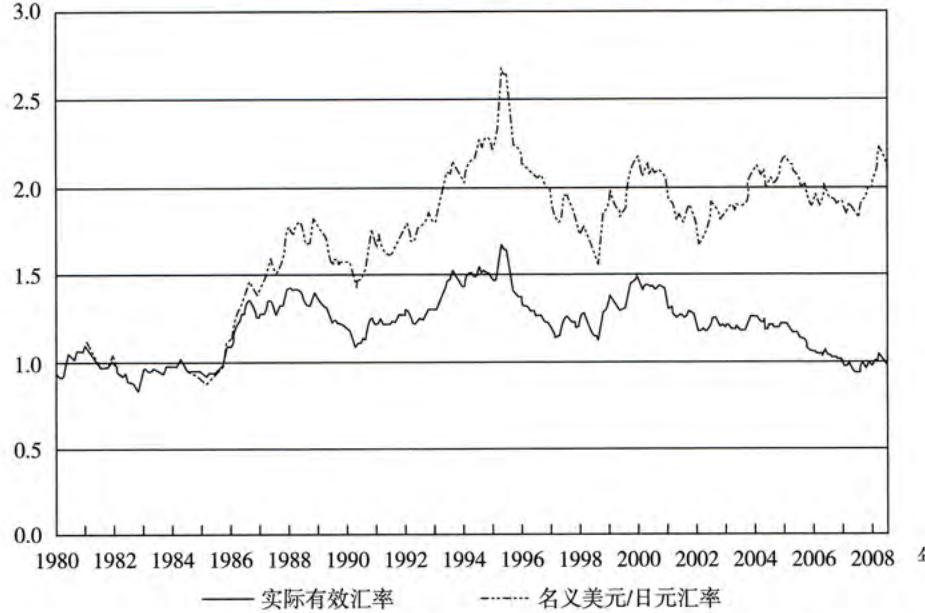  
图6-1汇率和交易条件的变化（1980—2008年，1980历年平均 $\mathbf { \mu = 1 . 0 }$ ()  
（资料来源：笔者基于日本央数据处理制作）

那么，在本经济的长期低迷中，元升值在多程度上拖累了本?图6-2将泡沫与通缩期内的本经济周期（实际GDP增长率）按内需和外需贡献率进了细分，图6-3显示了经常账户顺差的持续，可以以此为材料质疑日元升值拖累日本这种论调的合理性。就贡献率而，日本的经济周期大部分取决于内需波动，因为在经济长期停滞期内，尽管日元居高不下，顺差却直在持续。

  
图6-2 泡沫与通缩期内的日本经济增长率及内外需贡献率  
（资料来源：内阁府《国民经济核算》）

不过，由此便断定外需没有问题可能还为时过早。实际上，虽然经常账户顺差保持稳定，但这个数字依赖于要素收账户的盈余，贸易盈余则呈下降趋势。且，《场协议》到2000年左右，与名义盈余相，实际盈余直趋于缩减（图6-4)。此外，无论是速增长期的本还是融危机前的亚洲，从中长期平均来看对外收支都基本平衡，这一经验表明，即使出口是经济增长的关键，经常账户顺差也不一定会继续扩大。换句话说，即使没有观察到经常账户逆差，也不能排除元升值和其他国际经济环境成为低迷期日本经济增长绊脚石的可能性。

  
图6-3 日本和美国的经常账户收支(1980—2006年，与GDP之比）

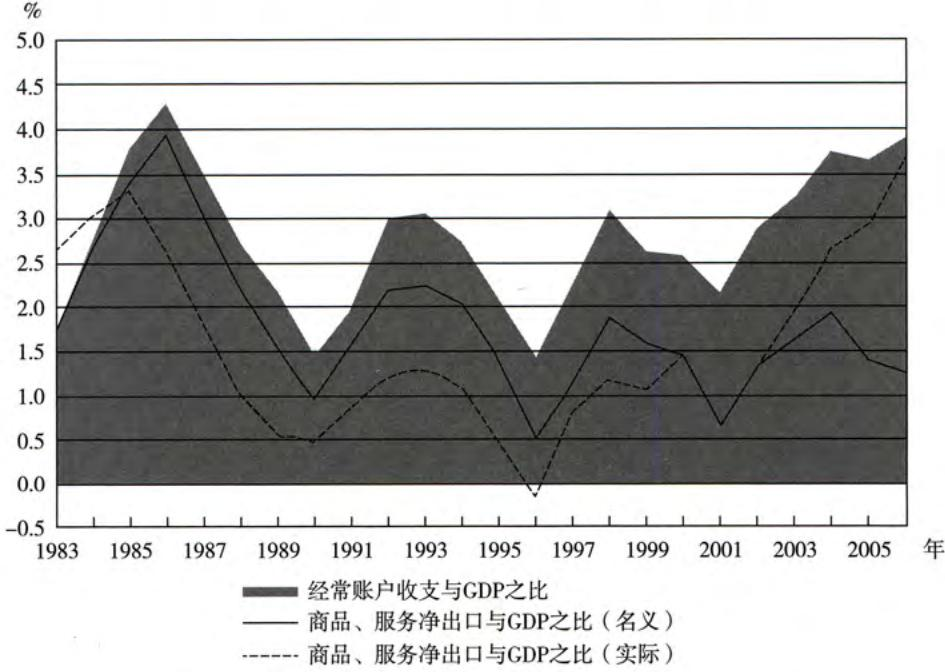  
（资料来源：笔者基于IMF，WEOdatabase数据处理制作）  
图6-4经常账户顺差、贸易收与实际贸易收支（与GDP之）  
（资料来源：笔者使IMF-WEO数据库及内阁府《国民经济核算》制作）

# 2.2 日本在世界经济中地位下降

应该关注的国际环境变化的第2点是本在全球产总值中所占的份额呈下降趋势。由于按名义汇率换算较时元升值会导致按美元计算的本GDP膨胀，从20世纪90年代中期本份额开始下降后至今，本在全球GDP中所占的份额已经减少了半（图6-5）。此外，从购买GDP来看，20世纪90年代初以来，本份额便在持续下降。由此可知，本经济占世界经济总量成（或更多）的天真看法已不再正确（图6-5)。

1 对美元名义汇率换算值  
20  
16  
12  
8 □□□日本（对美元名义汇率换算值）  
4——亚洲新兴经济体（对美元名义汇率换算值）  
019801982 1984 1986 1988 1990 1992 1994 1996 1998 20002002 20042006

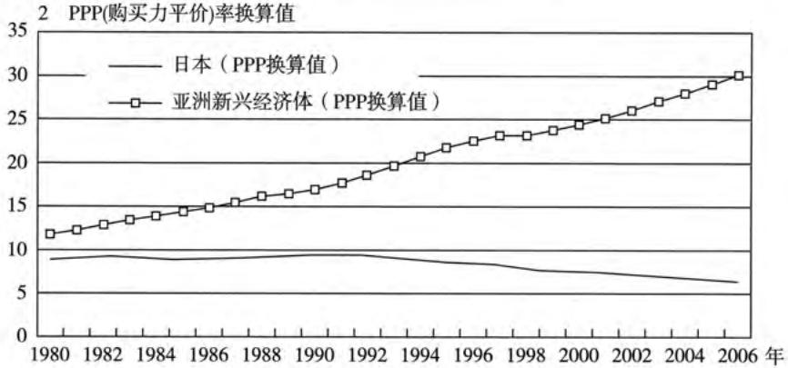  
图6-5 亚洲在生产总值中所占的份额(1980—2006年）

（资料来源：笔者基于“Pen World Table"，World Bank,“World Development Indicators”及IMF，“WEO”处理制作）

# 2.3 亚洲区域内贸易和产业内贸易的迅速扩

亚洲经济体的崛起（尤其是贸易的扩）是另个应该强调的变化。几乎在日本份额下降的同时，亚洲新兴经济体（NIES、ASEAN和中国）的份额呈现出持续扩大的趋势，在世界经济中的存在感超过了日本。到20世纪80年代中期，日本和亚洲新兴经济体在世界市场上的商品贸易（出口）份额还大致相同，但现在两者之间的比例已经扩大到1：4（图6-6）。从全球角度看，亚洲经济一直对贸易高度开放（依赖），近年来更是如此（图6-7)。

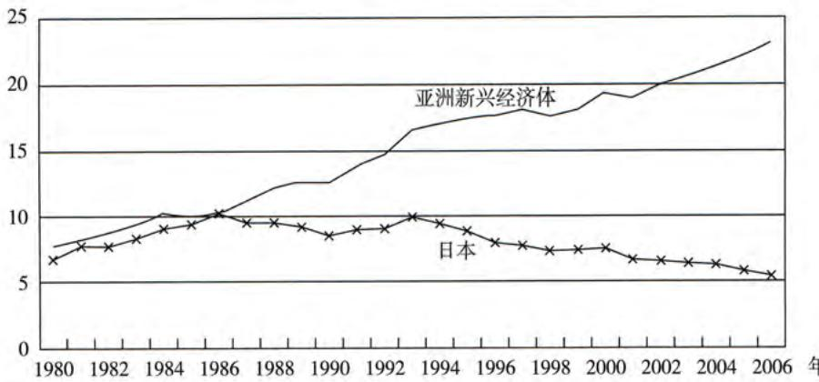  
图6-6亚洲在全球商品出口中所占的份额

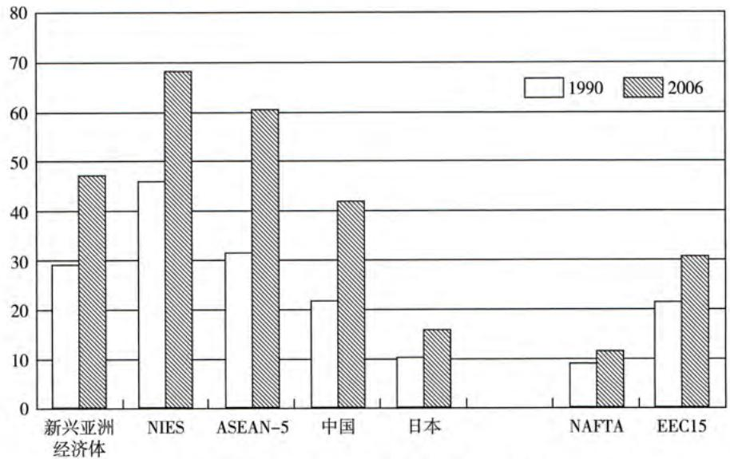  
（资料来源：笔者基于IMF“Direction of TradeStatistics”计算）  
图6-7 商品出口与GDP之比（主要地区比较）  
（资料来源：笔者基于IMF“Direction ofTrade Statistics”等处理制作）

上述亚洲贸易扩的相当一部分来源于亚洲区域内贸易（见图6-8对角线要素），亚洲已经成为一个可与欧洲和NAFTA比肩的贸易区块。而中国是亚洲区域内贸易的关键，一方面（除中国以外）区域内各国将贸易对象（从区域外国家）转移到中国，而中国同时又在单独扩大区域外贸易，这种并模式已经越来越明显，即所谓的“三贸易”扩（图6-9)。

  
注：用ITC（revision 2）2位数据计算的Grubel和Lloyde Index。  
图6-8各区域产业内贸易指数的变化

（资料来源：笔者使用UNComtrade数据库处理制作）

  
图6-9贸易流程中原材料和中间品贸易所占比例的变化（1980—2006年）

区域内贸易的扩与产业内贸易的扩有着密不可分的关系（图6-8)。众所周知，经济发达地区（欧洲和NAFTA）与亚洲新兴经济体的产业内贸易内涵并不相同，后者伴随中间品交易的垂直贸易特别活跃。另面，从亚洲新兴经济体到发达经济体的贸易流程显，最终产品比率较，表明亚洲正在通过将区域内国际分络中产的商品出到区域外来实现增长（图6-9)。

表6-1主要地区的出口中出口对象地区所占份额（2006年）及其变化  
（与1980年对比）  

<table><tr><td rowspan="2"></td><td colspan="5">出口对象地区</td><td rowspan="2">其他</td></tr><tr><td>亚洲总计</td><td>其中亚洲新 兴经济体</td><td>其中日本</td><td>NAFTA</td><td>欧洲</td></tr><tr><td rowspan="4">亚洲总计 其中亚洲新 兴经济体 出 其中日本 NAFTA</td><td>48.9 (11.2) 49.2</td><td>41.8 （15.8） 40.4</td><td>7.1 (-4.5) 8.8</td><td>21.9 (-4.2） 21.0</td><td>15.8 (-3.1） 16.1</td><td>13.4 (-4.0） 13.7</td></tr><tr><td>（4.3） 47.5</td><td>（16.9） 47.5</td><td>（-12.5）</td><td>（-2.2) 25.9</td><td>(-3.2) 14.6</td><td>(1.1) 12.1</td></tr><tr><td>(18.5） 18.2</td><td>（18.5） 13.7</td><td>4.6</td><td>(-3.8) 52.9</td><td>(-3.8） 16.7</td><td>(-10.9) 12.2</td></tr><tr><td>（-1.3) 欧洲 8.0 (3.8)</td><td>（3.6） 6.5 (3.5)</td><td>（-4.9） 1.5 （0.3)</td><td>（15.9) 10.2 (2.7)</td><td>（-10.6) 62.5 (-7.7)</td><td>（-4.0） 19.4 (1.1)</td></tr></table>

资料来源：笔者使用UN-Comtrade处理制作。注：亚洲总计 $\mathbf { \equiv } =$ 亚洲新兴经济体 $^ +$ 日本，亚洲新兴经济体 $=$ NIES $^ { + }$ ASEAN- $^ { 4 + }$ 中国 $^ +$ 印度 $^ +$ 越南。（）内为与1980年水平相比时份额的变化幅度。

表6-2 亚洲内主要地区的出口中出口对象地区所占份额（2006年）及其变化  
（与1980年对比）  

<table><tr><td rowspan="2">亚洲总计</td><td colspan="5">出口对象地区</td><td rowspan="2">亚洲区域外</td></tr><tr><td></td><td>其中NiES</td><td>其中ASEAN-4其中中国</td><td></td><td>其中日本</td></tr><tr><td rowspan="3">NIES 世 ASEAN-4 中国</td><td>59.4 （25.9） 58.0</td><td>14.6 (4.6)</td><td>10.0 （0.4）</td><td>25.1 （22.9） 10.8</td><td>6.5 (-4.2)</td><td>40.6 （-25.9） 42.0</td></tr><tr><td>（-0.2） 38.7</td><td>22.4 （5.0) 23.1</td><td>8.3 (5.2) 3.6</td><td>（10.1）</td><td>12.9 （-23.3）</td><td>（0.2） 61.3</td></tr><tr><td>（-25.5）</td><td>(-7.7)</td><td>（-3.0）</td><td></td><td>9.8 （-16.8）</td><td>（25.5）</td></tr><tr><td>日本</td><td>47.5 （18.5）</td><td>22.6 (6.2)</td><td>8.1 (0.4)</td><td>15.5 （11.3)</td><td></td><td>52.5 (-18.5)</td></tr></table>

资料来源：笔者使用UN-Comtrade处理制作。注：亚洲总计 ${ } = { }$ 亚洲新兴经济体 $^ +$ 日本，亚洲新兴经济体 $= { \mathrm { N I E S } } + { \mathrm { A S E A N } } - 4 +$ 中国 $^ +$ 印度 $^ +$ 越南。NIES $=$ 韩国 $^ +$ 中国香港 $^ +$ 中国台湾 $^ +$ 新加坡，ASEAN- $_ { 4 = }$ 泰国 $^ +$ 马来西亚 $^ +$ 印度尼西亚 $^ +$ 菲律宾。（）内为与1980年水平相比时份额的变化幅度。

# 2.4日本贸易结构的变化

在前述国际环境的变化下，日本的进出口都变得更加依赖亚洲新兴经济体（图6-10和图6-11），对美国的依赖程度则呈下降趋势。此外，出口商品类型向中间品和投资品切换，进口商品类型则显示最终产品（特别是消费品）比例扩大（图6-12和图6-13）。《广场协议》之后数年，可以看到日本在亚洲新兴经济体地区掀起了直接投资热潮（图6-14）。这些变化通常由一种假设来解释，即自日元升值以来，（低附加值产品的）生产基地已经转移到了亚洲新兴经济体，高附加值的中间品和投资品则转向专门用于出口。

  
图6-10日本的出口（除矿物燃料外）对象地区结构比例

  
（资料来源：笔者使用UNComtrade数据库处理制作）  
图6-11日本的进口（除矿物燃料外）对象地区结构比例  
（资料来源：笔者使用UNComtrade数据库处理制作）

  
图6-12 日本的出口品类结构份额（除矿物燃料外)：对比全球

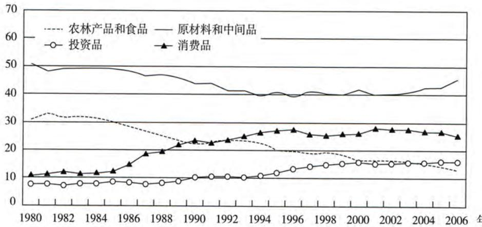  
（资料来源：笔者使用UNComtrade数据库处理制作）  
图6-13 日本的进口品类结构份额(除矿物燃料外)：对全球

  
（资料来源：笔者使用UNComtrade数据库处理制作）

  
图6-14 对亚洲新兴经济体直接投资情况的变化（各投资来源国明细）：1981—2005年

# 3基于宏观进出口函数的外需分析

在上节概述的基础上，本节和下节将探讨本经济如何适应国际环境的变化。首先，本节通过对基本宏观进出口函数进行估算，考察日元升值和亚洲经济（本的出市场）扩张对本进出的影响。

表6-3为使用1983年至2006年的季度时间序列数据，对由收项和相对价格项组成的宏观出口和进口函数进估算的结果。为避免虚假相关性，所有的变量都被转换为对数一阶差分型（前期环比增长率）。因此，表内系数中截距为趋势，其他均可解释为弹性。

出函数收项中使的变量是以本15个主要出国家与地区（i=1,2，…，15)①为对象计算的（时点t的）实际GDP增长率（gi,）加权平均值，即

$$
g t ^ { \ast } = \sum _ { i = 1 } ^ { 1 5 } \gamma _ { i , \ i } g _ { i , \ i }
$$

（但 $\mathsf { Y } _ { \mathrm { i } , \mathrm { t } }$ 是基于IMF的DOT统计，且符合 $\sum _ { i = 1 } ^ { 1 5 } { { \gamma } _ { i , \textit { t } } } = 1$ 情况下本向国出的份额)

一方面，价格项使用取自日本央网页的日本实际有效汇率（会随着日元实际升值而增加的变量），涵盖当期到第7期共8个季度（两年）的滞后进行估算。如果估算期间的日本出口函数满足通常假设的关系，预计收入弹性为正，价格弹性为负。对包括截距（趋势）（表6-3第（1）列）和不包括截距（第（2）列）两种情况分别进计算后发现：截距的存在与否会导致收弹性的估算值出现大幅波动，但在任一情况下都能得到弹性于1的显著正系数，而且证实在价格弹性方面，可以得到相对稳定（约-0.4～-0.5）的显著负系数。另一方面，使用日本实际GDP增长率作为进口函数中的收入项进估算，结果显示：收弹性（无论是否存在趋势）得到了大约为1的显著正值，价格弹性也得到了符合预期的显著正值（略高于0.3)。

表6-3泡沫与通缩期内的日本宏观进出口函数  

<table><tr><td rowspan=2 colspan=1></td><td rowspan=1 colspan=2>出口函数（1983第一季度—2006第四季度）</td><td rowspan=1 colspan=2>进口函数（1983第一季度一2006第四季度）</td></tr><tr><td rowspan=1 colspan=1>(1)</td><td rowspan=1 colspan=1>(2)</td><td rowspan=1 colspan=1>(3)</td><td rowspan=1 colspan=1>(4)</td></tr><tr><td rowspan=1 colspan=1>收入弹性   α</td><td rowspan=1 colspan=1>3.019**(0.499)</td><td rowspan=1 colspan=1>1.266**(0.166)</td><td rowspan=1 colspan=1>0.916**(0.282)</td><td rowspan=1 colspan=1>1.330**(0.242)</td></tr><tr><td rowspan=1 colspan=1>价格弹性   Σβ</td><td rowspan=1 colspan=1>-0.476***(0.109)</td><td rowspan=1 colspan=1>-0.390***(0.114)</td><td rowspan=1 colspan=1>0.308**(0.127)</td><td rowspan=1 colspan=1>0.315**(0.132)</td></tr><tr><td rowspan=1 colspan=1>趋势      γ</td><td rowspan=1 colspan=1>-0.023**(0.006)</td><td rowspan=1 colspan=1></td><td rowspan=1 colspan=1>0.007**(0.003)</td><td rowspan=1 colspan=1></td></tr><tr><td rowspan=1 colspan=1>决定系数（自由度调整后）</td><td rowspan=1 colspan=1>0.303</td><td rowspan=1 colspan=1>0.202</td><td rowspan=1 colspan=1>0.200</td><td rowspan=1 colspan=1>0.146</td></tr><tr><td rowspan=1 colspan=1>德宾-沃森（DW）值</td><td rowspan=1 colspan=1>1.812</td><td rowspan=1 colspan=1>1.626</td><td rowspan=1 colspan=1>2.055</td><td rowspan=1 colspan=1>2.037</td></tr><tr><td rowspan=1 colspan=1>样本数</td><td rowspan=1 colspan=1>96</td><td rowspan=1 colspan=1>96</td><td rowspan=1 colspan=1>96</td><td rowspan=1 colspan=1>96</td></tr></table>

资料来源：笔者使用国民收统计、日银统计、IMF统计（WEO，DOT）估算。

注：为避免虚假回归，所有函数都是在对数一阶差分（或变化率）的基础上估算，“趋势”指回归的截距（偶数列是没有截距的估算结果）。

出口函数中的收项是本15个主要出口国家与地区增长率的加权平均值；进口函数是本的实际GDP。

进口函数及进口函数的价格项为实际有效汇率（美元/日元）的当期至第7季度滞后值。

将进出口函数在正常符号条件下得到显著估算结果①与上一节所讨论的泡沫与通缩期以亚洲发展与日元升值为特点的国际经济环境结合来看，可以清楚地看出其内涵。图6-15将1980年第季度标准化为1，以此为平基数对出口函数收项和进口函数收入项进比较发现，20世纪80年代中期以后两者之间的差距急剧扩大，反映了亚洲的经济扩张（以及日本的经济低迷）。可以认为，在整个泡沫与通缩期内，出口市场的增长率达到了日本经济的两倍以上。为了方便起见，假设收人弹性为1，当时的环境下日本的出口以进口的倍数增长也不足为奇。然而实际情况是出口和进口大致保持一致，这可以从经常账户顺差勉强维持稳定（或贸易收呈萎缩倾向）的事实中看出。一种可能性是，在同一时期，日元汇率居高不下起到了抑制出口（和促进进口）的作用，抵消了亚洲市场迅速扩张产的经济效果。如果是这样，即使外需不是本经济长期低迷的主要原因，经济低迷期内采取的导致元升值的政策也剥夺了本经济可能更早摆脱低迷的机会。

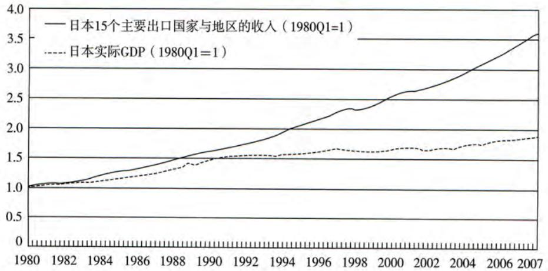  
图6-15 泡沫与通缩期内的出口对象地区及日本的实际收入  
(资料来源：笔者使用表6-3的估算结果处理制作)

# 4 使用贸易数据进行比较优势结构分析

宏观（需求方）分析的结果表明，在泡沫与通缩期内，日元升值可能削弱了日本的竞争力，对（净）出口产生了相当大的抑制作用。那么，国际竞争环境的这种变化是如何影响本的较优势结构的？在下中，为了从亚洲区域内各经济体的分度切这一问题，笔者将使用联合国统计司COMTRADE数据库中的各国和各品类贸易数据（SITC（rev.2）-5位）进分析。

# 4.1 按附加值平对贸易商品进分类(分析法简介)

近年来，面对亚洲经济的快速腾飞和日元升值，日本的出口结构（品类结构）发了怎样的变化？第2.4节中简要提及的“本出口的附加值化”进展顺利与否是尤其需要深思的问题。

为了回答这个问题，有必要按附加值水平观察贸易（出口）情况。针对贸易统计SITC（rev.2）-5位级别的个别品类（不包括矿物燃料)①，本文先按照以下步骤为每个品类的附加值平创建个代理变量，并利这些信息按附加值水平将出口品类拆分为10个小组（I-X)。

按附加值水平对贸易进分类的步骤

(1）按SITC（rev.2）-5位的个别品类（i），计算7个高科技发达国家和地区①相应品类的出贸易量所占的全球份额（以19911995年期间的平均出口额为基准)。以下用A（i）表示。

（2）用世界银行的分类法定义了43个低技术不发达国家和地区②，与7个高科技国家同样，计算43个低技术国家个别出口品类（i）的出口份额（以1991—1995年期间的平均出口额为基准），以下用B（i）表示。

(3）根据7个科技发达国家具有较优势43个低技术国家没有较优势的商品更可能是高附加值商品这一推论，将变量Z（i）定义为个别品类（i）附加值水平的代理变量，具体如下：

(4）按照附加值平代理变量Z（i）的数值由低（附加值平低）到高 的顺序重新排列出品类（i） ③。

（5）将重新排列的个别品类（i）出口额（1991—1995年期间的总额）从头依次相加，直到相加总额最接近出口总额（除矿物燃料外的所有品类总额）的十分之一时终止，并将截至此节点的品类定义为小组Ⅰ（附加值水平最低的品类)。

（6）再从上一终结点的下一位品类的出口额开始依次相加，当相加总额最接近出口总额的十分之一时再次终止，并将截至此节点的品类定义为小组Ⅱ。

根据上述方法对数据进分类，可以分析对象地区（国家）在各相应附加值水平的出口市场上的表现①。例如，图6-16显示了发达国家的出口在全球贸易市场（按附加值水平划分）中所占的份额。图中的上升线表示发达国家在高附加值产品中拥有更高的市场份额，而上升线随时间渐次向下位移则显示了发达国家在世界贸易中所占份额的相对下降（可能是由于新兴工业化国家的崛起)。

  
图6-16发达经济体出口额在全球贸易市场（按附加值水平分类）中所占的份额（资料来源：笔者使用UNComtrade数据库处理制作）

# 4.2 按附加值平划分的贸易较优势结构

使用按附加值水平分组的出口品类数据时，第2.3小节概述的亚洲区域内贸易和产业内贸易会出现怎样的分析结果？本节使的图在上述10个附加值分类的基础上，增加了按商品性质划分的4个分类（食品和农产品、原材料和中间品、最终投资品和最终消费品），由此追踪从20世纪80年前半期到2004年期间的东亚经济区（NIES、ASEAN4和中国）贸易结构变化。

# 4.2.1 面向发达国家市场的出口情况

首先来看发达国家（进口）市场的各出口地区所占份额。为了提供比较基准，图6-17的第一排显示了发达国家本身在发达国家市场上的出口份额（按附加值水平划分）。首先，请观察第一排最左边的图，它描述了20世纪80年代前半期的情况。结果正如预期，发达国家的出口份额在高附加值商品中较高，排除低附加值组（小组Ⅰ-Ⅲ）后，发达国家本身的出口份额超过了$80 \%$ 。按商品性质分成4类分析时则发现，交易并不偏向于任何特定的类别，4类商品的贸易额基本平均。在这个意义上，20世纪80年代初发达国家的贸易在相当程度上实现了给。

继续观察第一排的图，往右边看，可以看到发达国家市场内贸易的时间演变。随着亚洲等新兴经济体的崛起，发达国家本身在发达国家市场上的出口份额逐渐下降。可以说世界贸易正在逐渐纳入欠发达国家，变得越来越全球化。

接下来看下图6-17第排以后的图，它们描述了亚洲新兴经济体区域所占的份额。可以明显地看出亚洲各国的出口模式（“雁形形态”），即集中出口与其发展阶段相适应的附加值水平的产品，且不断向高附加值品类动态转移。在20世纪80年代初，亚洲新兴经济体向发达国家出口的全是低附加值产品（食品和农产品、消费品）。ASEAN4和中国的存在感除了在食品和农产品领域以外，几乎可以忽略不计。随着时间的推移，亚洲新兴经济体开始在NIES等区域内发达地区的带领下广泛提供中等附加值商品（中间品及投资品）。此外，从图中还可以发现，进入21世纪以后，NIES已经在发达国家的低附加值消费品市场上失去了大量份额，而作为其替代，中国的出口则一直在扩大。中国的份额迅速增长，近年来已经扩展到了中等附加值的中间品和投资品，但与NIES和ASEAN4相比，如今中国的出口依然以低附加值品类为主。

# 4.2.2面向亚洲新兴经济体区域内市场的出口情况

下面看一下亚洲新兴经济体市场的动向（图6-18）。与图6-17同样，第一排显示了来自发达国家的出口份额。在20世纪80年代初，发达国家在亚洲新兴经济体市场上的出口份额同样很高（尤其是中等附加值及以上类别的份额超过 $80 \%$ )，各种性质的商品都有交易。然而，随着时间的推移，发达国家的份额下降。从商品性质分类来看，出口品类也有向原材料、中间品和高附加值投资品集中的趋势。

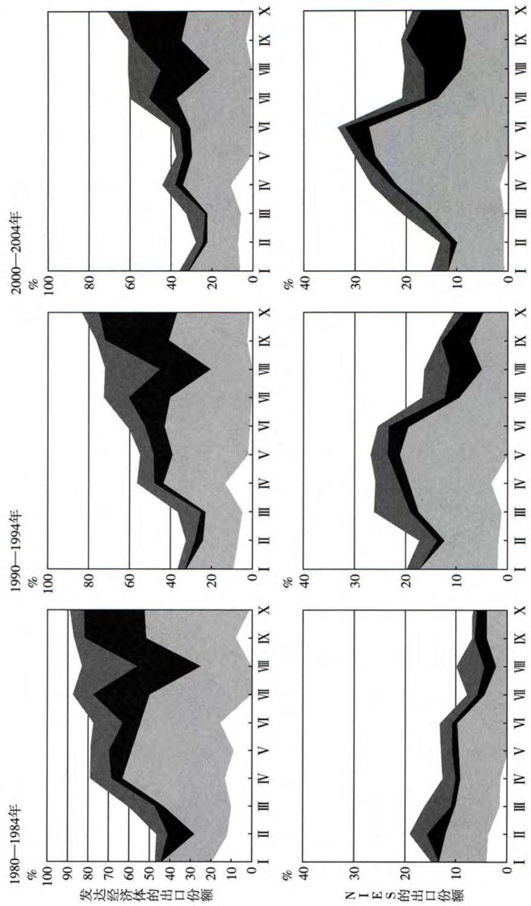

# 182宏观经济与产业结构

从来自亚洲本地的出口份额来看（图6-18第二排及以下），NIES虽然失去了在发达国家市场上的低附加值产品份额，但其在亚洲地区内的中等附加值产品（主要是原材料和中间品）市场份额大大提升。近年来，NIES还成为了亚洲地区高附加值投资品的来源地。另一方面，中国追赶ASEAN4以及ASEAN4追赶NIES的模式在亚洲区域内贸易中清晰可见。20世纪80年代中期以来，中国一直是亚洲区域内低附加值品类（特别是消费品）的来源国，但近年来，中国也在向拥有更高附加值的品类切换。

综上可以作出如下解读：亚洲建了与区域内各地区发展阶段相适应的互补型分络，亚洲新兴经济体区域的成功也可以说是参与这种国际分网络带来的好处。

# 4.3本在世界和亚洲贸易流程中的作

本作为亚洲最发达的国家，通过提供先进技术和直接投资参与了亚洲内部国际分网络的建设，这一点是毋庸置疑的。然而，尽管身处快速增长的亚洲区域内，本经济在泡沫与通缩期的表现甚至还比不上区域外发达国家（欧美），这不得不让人怀疑本是否充分利了亚洲经济扩张的机会。本的贸易结构是否成功升级，实现了出口商品的高附加值化并从国际分工中获益呢？

图6-19的上排（发达国家市场）和下排（亚洲新兴经济体市场）为日本按附加值平和商品性质划分的出份额图（关于亚洲已经在前提及）。先观察发达国家市场（上排），可以看出本的出在20世纪80年代初已经以附加值品类为主，属于发达国家的出类型。不仅没有低附加值产品（特别是食品和农产品）的出口，而且右倾坡度与发达国家整体相比偏陡（图6-18第一排左图)。附加值水平归类为小组Ⅷ的消费品所占份额尤其明显，这显示的是面向发达国家的汽车出口情况。

那么，在随后的整个泡沫与通缩期内，本的比较优势结构又是如何变化的？直到20世纪90年代前半期，本的低附加值（消费）商品份额不断下降，而中等和高附加值投资品份额不断增加，呈现出向高附加值商品转移的趋势。然而进21世纪后，中等和附加值商品的市场份额也出现了明显下降。图6-18中已经论及发达国家在发达国家市场上所占出份额下降的情况，但近年来本份额的下降程度似乎要超出其他发达国家。

那么，日本是否在不断发展增长的亚洲找到了新的市场，以弥补在发达国家市场的（相对）缺失？从图6-20下排来看，答案似乎是否定的。直到20世纪90年代前半期，本在亚洲新兴经济体市场上的份额下降，与发达国家市场同样，主要集中在中等及以下附加值的品类上，但进入21世纪后，高附加值品类所占份额的下降趋势也很明显。从乎完全没有中等及以下附加值的消费品这点来看，毫无疑问，本在亚洲区域内市场的出口越来越集中于高附加值的中间品和投资品。然而市场份额的绝对水平（也包括中等和附加值商品）持续下降的情况却与NIES等形成了鲜明的对，后者在同时期巩固了其作为亚洲区域内中等和附加值中间品和投资品供应基地的地位。也就是说，在泡沫与通缩期元汇率居不下的背景下，本可能不仅仅失去了低附加值商品的竞争，同时也失去了高附加值商品的竞争力。

# 4.4出口商品的附加值化和经济发展

经笔者观察发现，本在泡沫与通缩期内出口商品的附加值化进展并不顺利，这对本的宏观经济（长期停滞）产了什么影响？要回答这个问题，需要另写篇论进详细研究。这笔者将图6-22做简单介绍，该图对前计算出的各附加值平商品的出口额数据进加工后，得出了“个别国家出口商品的平均附加值”。

个别国家 $( j$ ）出商品的平均附加值（AG（j））定义如下：

$$
A G ( j ) = \sum _ { g = 1 } ^ { \chi } g \frac { E ( j , \ g ) } { \sum _ { g = I } ^ { \chi } E ( j , \ g ) }
$$

其中， $E$ $( j , \ g )$ 是 $j$ 国附加值组 $^ { g }$ 品类的出额。

图6-20在分别计算出个别国家上述指标的基础上，描绘了亚洲地区20世纪80年代前半期以后该指标的变化情况。由此表可以看出，20世纪80年代前半期以来，本的出平均附加值平直很（即使与今天的亚洲新兴经济体相比也是如此)。另，虽然整体上全球的出商品直在向附加值化发展，但本在20世纪90年代以后附加值化进展甚微。同时期，亚洲新兴经济体区域则以远超世界平均平的速度快马加鞭奔向附加值化，飞速向日本逼近（与日本的竞争）。

图6-21是20世纪80年代前半期今个别国家的出商品平均附加值的变化情况，对照同时期个别国家实际GDP的年均复合增长率所绘制的散布图。从此图中可以看出，出商品的附加值化既不是经济增长的必要条件，也不是充分条件（换句话说，一些国家没有实现附加值化，但仍然保持增长，另些国家虽然实现了附加值化，但增长率依然较低)。但从样本整体来看，高附加值化和（中长期）经济增长之间存在明显的相关性，至少对于成功的亚洲新兴经济体来说，过去四分之世纪内是在附加值战略下实现了高增长。但与此同时，日本的高附加值化进程却止步不前，宏观经济停留于低增长。

  
图6-20 亚洲各地区出口商品平均附加值水平的变化（1982—2006年）

  
（资料来源：笔者使用UN-Comtrade数据库处理制作）  
图6-21出口商品的高附加值化和中期经济增长率（1982—2006年）

（资料来源：笔者使用IMFWHO数据库及UNComtrade数据库处理制作）

# 5结束语：总结和启示

本概述了本在泡沫与通缩期（1980）内临的国际环境变化，并考察了这些变化与本经济表现的相关性。

国际环境面，重点提及了《场协议》后元企和亚洲经济的发展（区域内分络的构建）。东亚邻国经济的扩张本应意味着本可以通过投资、贸易和其他渠道获得巨大的发展机遇（市场)。但另方面，这也意味着本这个区域内领先国家出现了新的竞争对。尤其在泡沫与通缩期内，由于元的实际有效汇率在《场协议》后不断，对于企业来说竞争形势将会更加严峻。

使宏观时间序列数据进标准进出函数估算的结果表明，在泡沫与通缩期，进出口遵循正常的函数关系，符合通常假设的符号条件。由于出口和进口函数的收弹性（至少）都在1左右，如仅考虑本出口市场（包括亚洲市场）增长与本市场增长之间的差距，出口顺差的扩大也并不令人惊讶。尽管如此，实际盈余仅勉强保持平稳，这结果然可以解释为元升值对国际竞争的削弱抵消了亚洲市场迅速扩所带来的机会。

依据附加值平对各品类出商品重新分类，在此基础上对亚洲和本的较优势结构变化进分析。结果表明，在过去四分之世纪，（1）亚洲建了与区域内各地区发展阶段相适应的互补型分络；（2）本不仅在低附加值商品上出现了份额下降的现象，附加值商品所占份额也在减少。也就是说，本作为附加值中间品和投资品的来源国参与该络的结构发生了倾斜。

<table><tr><td rowspan=1 colspan=1>综上所述，可以说泡沫与通缩期内日本贸易部门的表现（如果考虑以亚洲为主的世界贸易的拓展速度）欠佳。从这个意义上说，对外经济关系也是</td></tr><tr><td rowspan=1 colspan=1>造成本经济长期低迷的部分原因。在适当的汇率平下，国际竞争将无可</td></tr><tr><td rowspan=1 colspan=1>避免地淘汰国内低效领域（相对劣势产业），从长远发展度来看，反应该</td></tr><tr><td rowspan=1 colspan=1>对此予以肯定。同样，调元汇率会抑制（净）出口也是自然现象，但如</td></tr><tr><td rowspan=1 colspan=1>果本在本应保持比较优势的附加值领域也丢失了市场份额，就有必要考</td></tr><tr><td rowspan=1 colspan=1>虑汇率平的合理性。笔者认为，就泡沫与通缩期内的本经济而，除了</td></tr><tr><td rowspan=1 colspan=1>存在阻碍产业结构顺利调整的国内障碍外，也法否认超出合理平的元</td></tr><tr><td rowspan=1 colspan=1>升值可能导致了某种产业空洞化。</td></tr></table>

# 参考文献

岩田規久男・宮川努編(2003)，『失われた10年の真因は何か』，エコノミ

クス・リーズ東洋经済新報社.本经済研究センタ(2003），産業空洞化と本经済，産業構造研究

会（宮川努座長）報告書.

浜田宏一·堀内昭義编（2004），『論争日本の经済危機一一長期停滞の真因

を解明する』,日本経済新聞社。林文夫编（2007），「经済制度の実証分析と設計」（全3卷，第1卷『経済停滞の原因と制度]，第2卷『金融の機能不全]，第3卷『経済制度設

計』）勁草書房.

宮尾龍蔵(2006)，「為替レト政策」，マク口金融政策の時系列分析

政策効果の理論と実証』日本経済新聞社，第5章.村松岐夫·奥野正宽编（2002），平成の研究上卷（形成编：

ルの発生とその背景構造）·下卷（崩壊编：崩壊後の不況と不良債権処理），東洋经済新報社.

Hamada, Koichi and Okada, Yasushi (2007), "Monetary and International Factors behind Japan' s Lost Decade: From the Plaza Accord to the Great Intervention," A Paper Prepared for the TRIO Conference, Tokyo, September 2007.

Hori, Masahiro (2007), "The Evolution of Trade in Emerging Asia," in World Economic and Financial Surveys: Regional Economic Outlook - Asia and Pacific, IMF (October 2007). International Institute for Management Development (2007), IMD-World Competitiveness Yearbook 2007.

Kwan, Chi Hung(2002), "The Rise of China and Asia' s Flying-Geese Pattern of Economic Development: An Empirical Analysis Based on US Import Statistics," RIETI Discussion Paper Series, RIETI(July 2002).

Rodrik, Dani(2006), "What' s so special about China's Exports?" NBER Working Paper, No. W11947.

# 7劳动力供给、劳动力需求、技术进步和经济增长

# 樱井宏二郎

# 导语

本文旨在研究从20世纪80年代至今这四分之一世纪的劳动力供给、劳动力需求、技术进步和经济增长，并结合它们与宏观经济的关系进行分析。在劳动力供给方面，从数量上看，从90年代开始劳动年龄人口和劳动人口对劳动力供给的制约增强；从质量上看，高学历化提高了劳动力质量，而非正式雇佣又降低了劳动力质量。在劳动力需求方面，从90年代后半期开始，经济衰退的恶化导致劳动力需求大幅下降。自80年代起，技术进步和全球化对美国等欧美发达国家的熟练和非熟练劳动力的需求产生了非中性影响，在日本也观察到了这种影响，只是程度有所不同。劳动力供给和劳动力需求通过少子老龄化、技术进步和全球化等各种因素相互影响，解析它们之间互为影响的关系，有助于深入了解这一时期劳动力和宏观经济状况①。

# 1前言

在20世纪80年代以来的二十五年中，日本经济经历了前所未有的泡沫和历史性衰退。在此期间，劳动市场发了罕见的变化，这在宏观经济上也具有重要的意义。在劳动供给，从数量看，受到减少和少龄化等动态变化的影响，90年代起逐渐受到制约。从质量看，劳动力受教育程度越来越高，另一方面，20世纪90年代后半期开始非正式雇佣快速发展。在劳动力需求方面，除了经济衰退导致的劳动力需求下降外，IT带来的技术进步和全球化等全球共同的结构性因素，对熟练和熟练劳动力产生了非中性影响。

劳动力供给和劳动力需求通常被认为是相互独立的，但为了更深入地了解泡沫时期后劳动力市场和宏观经济之间的关系，应关注劳动力供给和劳动需求的相互影响，而这一影响源于经济环境、口减少和少子老龄化、技术创新和全球化等因素的作用。例如，在90年代，面对严峻的经济衰退和日趋激烈的全球竞争，企业通过技术创新，利用计算机的引进，增加了对低薪非正式雇佣的需求，这是造成劳动力供给侧非正式雇佣增加的一个重要因素。劳动力供给中向高学历劳动力的转变也可以归因于劳动力需求侧的因素，例如，技术进步相对增加了对高学历劳动力的需求，此外，由于与发展中国家的全球竞争加剧，留在日本的简单劳动密集型制造工序越来越少。

另一方面，人口减少和少子老龄化对劳动力供给侧造成的制约，通过鼓励替代劳动型技术进步使劳动力需求得到了缓解。因此，在泡沫期之后的日本经济中，劳动力供给和劳动力需求通过各种因素相互影响，解析这一相互影响有助于深入理解这一时期的劳动力和宏观经济状况。基于上述认识，本文考察了泡沫期之后的劳动力供给、劳动力需求、技术进步和经济增长，并结合它们对宏观经济的影响进行分析。

本文接下来的结构如下。第二节考察了劳动力供给在数量方面的变化，以及由于高学历化和非正式雇佣导致的劳动力质量方面的变化。第三节研究了劳动力供给和劳动力需求之间的相互作用。第四节根据欧美的现有文献以及日本的研究事例，研究了近年来影响发达国家劳动力需求和造成收入不平等的技术进步和全球化因素，并讨论了这些因素在劳动力供给制约逐渐增强条件下的意义。第五节阐述结论。

# 2劳动力供给和经济增长

本节回顾了20世纪80年代今这二十多年间劳动供给的趋势，依次从数量和质量两个对劳动供给进了考察。

# 2.1 劳动力供给的数量

# 劳动人口等的变化

图7-1显了80年代起劳动供给数量面的些代表性指标。20世纪80年代起，总口有所增加，但增速逐渐放缓，在20052006年乎停止增长。更具经济学意义的指标是有能力从事生产活动的总人口，即劳动年龄口。这使两种类型的劳动年龄人口指标：15岁及以上人口（ $=$ 劳动年龄人口1）和15\~64岁人口（ $=$ 劳动年龄2)。

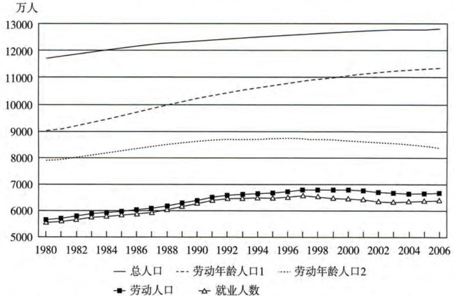  
图7-1总人口、劳动年龄人口、劳动人口和就业人数

注：1.总人口、劳动年龄人口为截至每年10月1日；劳动人口、就业人数为各月的平均值。2.劳动年龄人口1为15岁及以上人口，劳动年龄人口2为15\~64岁人口。3.根据总务省《人口估算年报》和《劳动力调查》编制。

劳动年龄人口1是基于无论多大年龄都可以工作的假设，而劳动年龄人2则是基于只能作到64岁的假设。但现实中有意义的劳动年龄概介于这两者之间。劳动年龄1是总口减去未满15岁的人，出率对总人口的影响有滞后效应，虽然其增速一直高于总人口，但人口增速还是逐渐放缓。

劳动年龄2在1995年达到峰值，此后直在下降。劳动被定义为就业和失业的总和，即那些愿意参与劳动市场的，在1998年达到峰值后转为下降，从2004年起又开始缓慢增加①。

如图7-1所，劳动年龄人口1、劳动年龄人口2和劳动人口体现的劳动供给从90年代前半期到后半期开始放缓或下降，这表明本经济的潜在增长率在90年代中期逐渐受到劳动力供给的制约。然而，从反映劳动力需求的就业数趋势来看，从19911992年泡沫破灭到2002年左右，增速放缓或降幅大于劳动力供给的变化，表明在此期间受经济衰退的影响，劳动力需求显著下降。事实上，被定义为劳动人口和就业人数之差的完全失业人数，已从1992年的142万人大幅增加至2002年的359万人，创下历史新高。这反而表明，如果90年代没有严重的经济衰退，劳动力供给制约就会以更强的形式表现出来。

80年代以来，影响劳动供给的最因素之是少龄化和减少，即在人口动态变化中，老年人的比重增加，出生人数下降，总人口增长停滞。图7-2显示了15岁及以上人口( $=$ 劳动年龄1）每五年的变化情况，每五岁为一个年龄组。无论男女，在总人口增长缓慢的情况下，65岁及以上口的绝对数和占都有显著增加，这表明口龄化正在迅速发展。这一趋势在性中尤为显著。不包括65岁及以上人口的15\~64岁人口（ $=$ 劳动年龄人口2）数量，分性别看均在1995年达到峰值，此后一直在下降，这表明剔除年人口的潜在劳动人数已在减少。从图7-2还可以看出，无论男，1995年起，15\~19岁和20\~24岁年轻的绝对数和占都在下降。

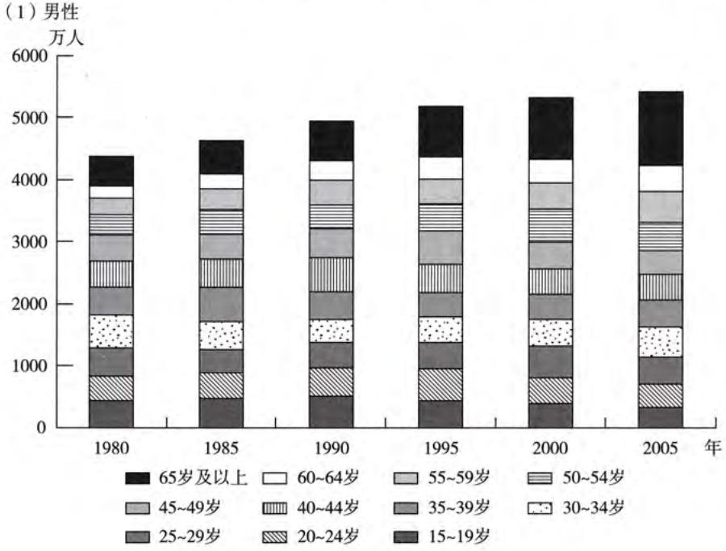

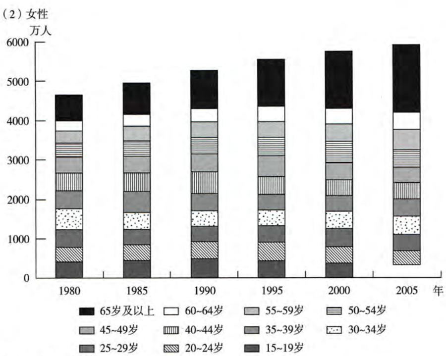  
图7-2按年龄组划分的劳动年龄人口1的历年变化

注：1.劳动年龄人口1为15岁及以上人口。2.根据总务省《人口估算年报》编制。

# 劳动力参与率

为了了解包括龄化在内的人动态变化对劳动人口的影响，图7-3显示了按年龄组划分的劳动力参与率的变化，并按每五岁年龄组和性别进行了细分。劳动力参与率被定义为劳动人口在劳动年龄人口中的占比，即劳动力在可劳动人口中的占比。这里使用的劳动年龄人口是15岁及以上人口（ $=$ 劳动年龄1)。

从这张图中可以看出以下点。就男性而，25\~29岁至50\~54岁年龄组的劳动力参与率一直极其稳定地保持在 $9 5 \%$ 或以上，在构成劳动力核心的劳动人口方面，时间序列上没有明显变化。55\~59岁年龄组可见受到了延长退休年龄等的影响，在 $9 0 \% - 9 5 \%$ 范围内显示出轻微上升。20\~24岁和60\~64岁年龄组在高于 $70 \%$ 且低于 $80 \%$ 的范围内，显示出轻微下降。15\~19岁和65岁及以上年龄组的劳动力参与率极低。15\~19岁年龄组尚属在校学习阶段，一直保持相对稳定的较低劳动力参与率。65岁及以上年龄组中许多人已经退出劳动力市场，且随着预期寿命延长，其劳动力参与率低并持续下降。因此，如果65岁及以上人口的比重增加，在其他条件不变的情况下，总体劳动参与率将下降。事实上，2005年，男性总体劳动参与率已从1980年的

$7 9 . 4 \%$ 下降到 $7 2 . 0 \%$ 。

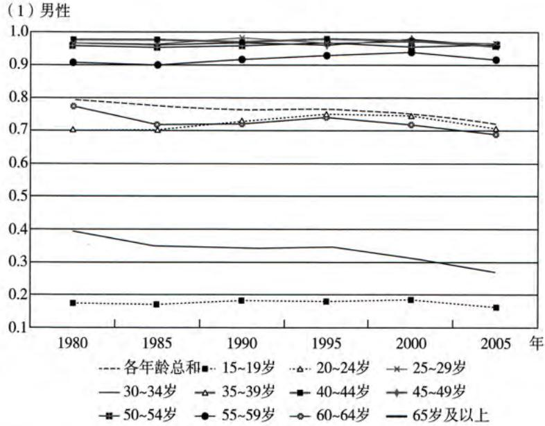

注：1.劳动力参与率 $=$ 劳动/15岁及以上。

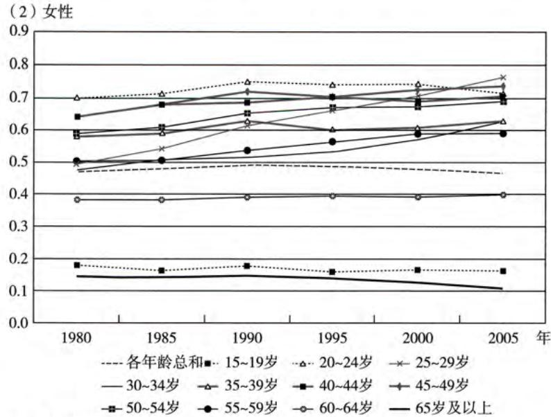  
图7-3 按年龄组划分的劳动力参与率的历年变化

2.根据总务省《劳动力调查》和《人口估算年报》编制。

另一方面，与男性相比，性劳动力参与率的特点是总体劳动力参与率较低，且各年龄组之间存在差异，很多年龄组的劳动力参与率有所上升，在25\~29岁和30\~34岁年龄组中尤其明显，而15\~19岁和65岁及以上年龄组的低劳动力参与率与男性相同①。因此，对女性来说，在其他条件不变的情况下，65岁及以上人口比重的增加会导致总体劳动力参与率下降。女性总体劳动参与率保持平稳或略有下降，2005年，从1980年的 $4 7 . 1 \%$ 仅下降到$4 6 . 6 \%$ ，这是因为，25\~29岁和30\~34岁年龄组劳动力参与率的增长效果抵消了65岁及以上人口增长带来的劳动力参与率下降的影响。

# 劳动人口变化的因素分解

为了更深地分析劳动年龄人口总体增长放缓、人口老龄化和不同年龄组劳动力参与率的变化等因素对劳动人口变化的影响，对劳动人口的变化按如下因素进了分解。表7-1将80年代以来劳动口每五年变化分为三个面的影响：（1）劳动年龄人口总体变化的影响；（2）年龄结构变化的影响（即老龄化的影响）；（3）劳动力参与率变化的影响。其中，劳动年龄人口被定义为15岁及以上人口（ $=$ 劳动年龄1)。

表7-1劳动人口变化的因素分解  

<table><tr><td rowspan=2 colspan=2>项目</td><td rowspan=1 colspan=4>人口变化（万人）</td><td rowspan=1 colspan=4>对劳动人口变化的贡献率（%)</td></tr><tr><td rowspan=1 colspan=1>劳动人口变化</td><td rowspan=1 colspan=1>(1)劳动年龄人口变化因素</td><td rowspan=1 colspan=1>（2）年龄结构变化因素</td><td rowspan=1 colspan=1>(3)劳动力参与率变化因素</td><td rowspan=1 colspan=1>劳动人口变化</td><td rowspan=1 colspan=1>（1)劳动年龄人口变化因素</td><td rowspan=1 colspan=1>（2）年龄结构变化因素</td><td rowspan=1 colspan=1>(3）劳动力参与率变化因素</td></tr><tr><td rowspan=3 colspan=1>男生</td><td rowspan=3 colspan=1>1980—1985年1985-1990年1990—1995年1995—2000年2000—2005年</td><td rowspan=3 colspan=1>13119917548-113</td><td rowspan=3 colspan=1>21623817611364</td><td rowspan=3 colspan=1>-403-20-37-69</td><td rowspan=3 colspan=1>430-28-109</td><td rowspan=1 colspan=1>100.0100.0</td><td rowspan=2 colspan=1>165.1122.1100.3</td><td rowspan=2 colspan=1>-30.6-39.6-11.2</td><td rowspan=2 colspan=1>-32.816.511.4</td></tr><tr><td rowspan=1 colspan=1>100.0</td></tr><tr><td rowspan=1 colspan=1>100.0100.0</td><td rowspan=1 colspan=1>235.8-56.6</td><td rowspan=1 colspan=1>-76.761.0</td><td rowspan=1 colspan=1>-59.196.5</td></tr></table>

续表  

<table><tr><td rowspan=2 colspan=2>项目</td><td rowspan=1 colspan=4>人口变化（万人）</td><td rowspan=1 colspan=4>对劳动人口变化的贡献率（%)</td></tr><tr><td rowspan=1 colspan=1>劳动人口变化</td><td rowspan=1 colspan=1>(1)劳动年龄人口变化因素</td><td rowspan=1 colspan=1>(2)年龄结构变化因素</td><td rowspan=1 colspan=1>(3)劳动力参与率变化因素</td><td rowspan=1 colspan=1>劳动人口变化</td><td rowspan=1 colspan=1>(1)劳动年龄人口变化因素</td><td rowspan=1 colspan=1>(2)年龄结构变化因素</td><td rowspan=1 colspan=1>（3）劳动力参与率变化因素</td></tr><tr><td rowspan=1 colspan=1>女姓</td><td rowspan=1 colspan=1>1980—1985年1985—1990年1990—1995年1995—2000年2000—2005年</td><td rowspan=1 colspan=1>12610853</td><td rowspan=1 colspan=1>1411611299976</td><td rowspan=1 colspan=1>-38一-123</td><td rowspan=1 colspan=1>7812704</td><td rowspan=1 colspan=1>100.0100.0100.0100.0100.0</td><td rowspan=1 colspan=1>77.571.2119.4190.6-2516.9</td><td rowspan=1 colspan=1>-20.9-26.5-34.6-178.14090.8</td><td rowspan=1 colspan=1>42.956.212.587.4-1507.2</td></tr><tr><td rowspan=4 colspan=1>箱</td><td rowspan=4 colspan=1>1980—1985年1985—1990年1990—1995年1995—2000年2000—2005年</td><td rowspan=4 colspan=1>3132283100-116</td><td rowspan=4 colspan=1>357399305212139</td><td rowspan=4 colspan=1>-78-137-57-129-192</td><td rowspan=2 colspan=1>1</td><td rowspan=2 colspan=1>100.0100.0</td><td rowspan=1 colspan=1>114.1</td><td rowspan=3 colspan=1>-25.0-32.5-20.1</td><td rowspan=3 colspan=1>11.237.811.8</td></tr><tr><td rowspan=1 colspan=1>94.8</td></tr><tr><td rowspan=1 colspan=1></td><td rowspan=1 colspan=1>100.0</td><td rowspan=1 colspan=1>107.6</td></tr><tr><td rowspan=1 colspan=1>-64</td><td rowspan=1 colspan=1>100.0100.0</td><td rowspan=1 colspan=1>212.3-120.2</td><td rowspan=1 colspan=1>-129.4165.2</td><td rowspan=1 colspan=1>17.155.0</td></tr></table>

注：1.因素分解基于以下公式。

$$
\Delta L = \Delta P ^ { * } \ \cdot \ \nu ^ { * } + \sum i \Delta P i \cdot \ ( \nu i - \nu ^ { * } ) + \sum i \Delta \nu i \cdot P i
$$

其中，L：劳动人口， $P$ ：劳动年龄人口， $v$ ：劳动力参与率（ $= L / P$ )，i：年龄组， $^ *$ ：年龄总数。

右边第一项对应的是（1）劳动年龄人口变化因素，第二项对应的是（2）年龄结构变化因素，第三项对应的是劳动力参与率变化因素。对男性和女性的估算是分别进行的，然后进行汇总。

2.劳动年龄人口是指15岁及以上人口。  
3.根据总务省《劳动力调查》和《人口估算年报》编制。

劳动人口变化的时间序列显示，在1985—1990年的泡沫经济时期，劳动口论性别均大量增加，随后增量逐渐减少，2000—2005年出现负值。究其原因，（1）1985一1990年期间，劳动年龄人口变化因素对男性和女性的影响最大，随后有所下降，但在2000—2005年期间保持了正贡献。（2）年龄结构变化因素一直为负，2000年后，男性和女性的负贡献均在增大。换言之，男性和女性的老龄化均导致了劳动人口减少。（3）在2000年之前，导致劳动力参与率变化的因素对男性来说并不是很大，但在2000—2005年期间却显示出极大的负贡献（-109万人）。另一方面，与男性的情况相反，女性劳动力参与率的变化一直为正贡献，在1985—1990年期间贡献特别大（127万人）①。也就是说，尽管人们担心劳动力供给会减少，但女性进入社会显然促进了劳动人口增加。

表7-2就业人数变化的因素分解  

<table><tr><td rowspan=2 colspan=1>时间</td><td rowspan=1 colspan=3>就业人数变化（万人）</td><td rowspan=1 colspan=3>对就业人数变化的贡献率（%)</td></tr><tr><td rowspan=1 colspan=1>就业人数变化</td><td rowspan=1 colspan=1>(1) 就业率变化因素</td><td rowspan=1 colspan=1>(2)劳动人口变化因素</td><td rowspan=1 colspan=1>就业人数变化</td><td rowspan=1 colspan=1>(1）就业率变化因素</td><td rowspan=1 colspan=1>（2）劳动人口变化因素</td></tr><tr><td rowspan=1 colspan=1>1980—1985年1985—1990年1990—1995年1995—2000年2000—2005年</td><td rowspan=1 colspan=1>242208-11-90</td><td rowspan=1 colspan=1>-33-69-10621</td><td rowspan=1 colspan=1>30641127596-111</td><td rowspan=1 colspan=1>100.0100.0100.0100.0100.0</td><td rowspan=1 colspan=1>-12.87.2-33.0964.2-23.0</td><td rowspan=1 colspan=1>112.893.0132.0-873.3123.0</td></tr></table>

注：1.因素分解基于以下公式。

$$
\Delta E { = } \Delta e \cdot L { + } e \cdot \Delta L
$$

其中，E：就业人数，L：劳动人口， $e$ ：就业率（ $\scriptstyle = E / L$ 第一项对应的是（1）就业率变化因素，第二项对应的是（2）劳动人口变化因素。

2.根据总务省《劳动力调查》编制。

总结男女总和的趋势可以发现，劳动人口变化在1985—1990年达到峰值后，增幅逐步收窄，在2000—2005年转为负值。针对这些变化，（1）劳动年龄人口变化因素一直保持正贡献，但其影响逐渐变小；（2）年龄结构变化因素一直为负贡献，其幅度在最近几年有所加大；（3）劳动力参与率变化因素在2000年之前为正贡献，但在2000—2005年转为负值。

# 就业人数变化的因素分解

劳动年龄人口和劳动人口基本上是劳动力供给侧的指标。相比之下，实际从事工作的就业人数不仅受到劳动力供给的影响，也受到劳动力需求的影响。为了粗略了解需求和供给的变化情况，表7-2将就业人数每五年的变化因素分为两类：（1）就业率变化因素；（2）劳动人口变化因素。就业率是就业人数与劳动人口的比率，等于1减去完全失业率，基本上是需求侧的指标②。就业数的变化直到90年代前半期一直保持着较大的正增长，1995—2000年转为轻微负增长（-11万人），2000—2005年大幅下降（-90万人）。

因素分解表明，直到20世纪90年代前半期，就业人数的增加主要归因于劳动人口的增加，而就业率变化因素，即经济因素的作用并不大。1995—2000年，就业率变化因素变成了负值（-106万人），而劳动人口变化因素的正值收窄，导致就业人数变化变成了轻微的负值。换之，1995—2000年，经济和口动态因素都造成了就业数减少。2000—2005年，由于经济开始复苏，就业率变化因素恢复到轻微的正值（21万人），但劳动人口变化因素变成了负值（-111万人），就业人数大幅下降（-90万人）。可以看出，人口动态因素从2000年开始全起效，导致就业数幅下降。

# 劳动时间

在劳动力供给中，与劳动力人数并列的另一个重要因素是劳动时间。来厚劳动省《度劳动统计调查》数据（图7-4）显示，总实际劳动时间在19881993年急剧减少，此后也持续着缓慢减少的趋势。这种劳动时间减少的趋势主要是由于制度的变化，即1988年修改了《劳动基准法》，规定阶段性缩短法定劳动时间，由此，法定劳动时间得以缩短①。从以下事实可以看出，总实际劳动时间减少的长期趋势是由法定劳动时间而非超额劳动时间的减少造成的。然，由于1988年以后到1991年左右是受泡沫经济影响劳动力供求紧张的时期，因此，在此期间，尽管劳动时间缩短了，但劳动时间减少的事实却与经济趋势相悖②。从基于工时（劳动力人数乘以劳动时间）的劳动力投入变化来看，基于《月度劳动统计调查》劳动时间数据的劳动力投在1988年缩短法定劳动时间后仍继续增加，并在1990年达到峰值，而基于总务省《劳动调查》劳动时间数据的劳动投在1988年后也继续增加，在1991年达到峰值（图7-5)。根据《劳动力调查》，每周劳动时间也持续增加到1991年。因此可以推断，在劳动时间缩短与经济趋势相反的时期，劳动力人数的增加对劳动时间的减少具有补偿效应。这表明，仅将劳动时间作为这时期经济或劳动投的替代变量会产误导。

小时 小时  
2200 800  
2000 700  
600  
1800 500  
1600 400  
1400 300  
200  
1200 m  
100  
1000 0  
19801982 1984 1986198819901992 1994 199619982000200220042006年  
一总实际劳动时间（左轴）--法定劳动时间（左轴）超额劳动时间（右轴）

注：1.调查行业总量。

2.机构规模为30人及以上。  
3.就业形态总和（普通员工和非全日制员工）。  
4.总实际劳动时间、法定劳动时间的年度数值计算方式是将各月的平均值乘以12。超额劳动  
时间的年度数值是从总实际劳动时间中减去法定劳动时间。  
5.根据厚生劳动省《月度劳动统计调查》编制。

（1）劳动时间 $=$ 基于《度劳动统计调查》（2）劳动时间 $=$ 基于《劳动调查》

  
图7-4总实际劳动时间、法定劳动时间和超额劳动时间

  
图7-5劳动时间指数、就业指数和劳动力投入指数

注：1.基于《月度劳动统计调查》的劳动时间是总实际劳动时间指数。2005年 ${ \bf \omega } = 1 0 0 $ 机构规模为30人及以上。普通员工和非全日制员工。2.基于《劳动力调查》的劳动时间是每周平均工作时间。2005年 $= 1 0 0$ 3.就业人口基于《劳动力调查》。2005年 ${ \bf \tau } = 1 0 0$ 。4.均为所有行业的数据，包括男性和女性。5.根据厚生劳动省《月度劳动统计调查》和总务省《劳动力调查》编制。

# 对经济增长的贡献

接下来，让我们从劳动力投入的角度重新评估与劳动有关的人口和劳动时间，并从它们对日本经济的实际和潜在增长率的贡献程度加以研究。表7-3显示了几个与劳动有关的人口、劳动时间和劳动力投入（ $=$ 就业人数 $\times$ 劳动时间）每五年的年均增长率。与劳动有关的人口是指总人口、劳动年龄人1、劳动年龄人口2和劳动人口，劳动时间是指基于《月度劳动统计调查》的劳动时间（ $=$ 劳动时间指数1）和基于《劳动力调查》的劳动时间（ $=$ 劳动时间指数2)。

单位： $\%$

表7-3劳动相关数据的年均变化率  

<table><tr><td rowspan=1 colspan=1>时间</td><td rowspan=1 colspan=1>总人口</td><td rowspan=1 colspan=1>劳动年龄人口1</td><td rowspan=1 colspan=1>劳动年龄人口2</td><td rowspan=1 colspan=1>劳动人口</td><td rowspan=1 colspan=1>就业人数</td><td rowspan=1 colspan=1>劳动时间指数1</td><td rowspan=1 colspan=1>劳动时间1×就业人数</td><td rowspan=1 colspan=1>劳动时间指数2</td><td rowspan=1 colspan=1>劳动时间2就业人数</td></tr><tr><td rowspan=1 colspan=1>1980—1985年</td><td rowspan=1 colspan=1>0.67</td><td rowspan=1 colspan=1>1.24</td><td rowspan=1 colspan=1>0.91</td><td rowspan=1 colspan=1>1.08</td><td rowspan=1 colspan=1>0.96</td><td rowspan=1 colspan=1>-0.05</td><td rowspan=1 colspan=1>0.91</td><td rowspan=1 colspan=1>0.04</td><td rowspan=1 colspan=1>1.00</td></tr><tr><td rowspan=1 colspan=1>1985—1990年</td><td rowspan=1 colspan=1>0.42</td><td rowspan=1 colspan=1>1.30</td><td rowspan=1 colspan=1>0.86</td><td rowspan=1 colspan=1>1.37</td><td rowspan=1 colspan=1>1.48</td><td rowspan=1 colspan=1>-0.46</td><td rowspan=1 colspan=1>1.01</td><td rowspan=1 colspan=1>-0.43</td><td rowspan=1 colspan=1>1.04</td></tr></table>

续表  

<table><tr><td rowspan=1 colspan=1>时间</td><td rowspan=1 colspan=1>总人口</td><td rowspan=1 colspan=1>劳动年龄人口1</td><td rowspan=1 colspan=1>劳动年龄人口2</td><td rowspan=1 colspan=1>劳动人口</td><td rowspan=1 colspan=1>就业人数</td><td rowspan=1 colspan=1>劳动时间指数1</td><td rowspan=1 colspan=1>劳动时间1x就业人数</td><td rowspan=1 colspan=1>劳动时间指数2</td><td rowspan=1 colspan=1>劳动时间2×就业人数</td></tr><tr><td rowspan=1 colspan=1>1980—1990年</td><td rowspan=1 colspan=1>0.55</td><td rowspan=1 colspan=1>1.27</td><td rowspan=1 colspan=1>0.88</td><td rowspan=1 colspan=1>1.23</td><td rowspan=1 colspan=1>1.22</td><td rowspan=1 colspan=1>-0.26</td><td rowspan=1 colspan=1>0.96</td><td rowspan=1 colspan=1>-0.19</td><td rowspan=1 colspan=1>1.02</td></tr><tr><td rowspan=1 colspan=1>1990—1995年</td><td rowspan=1 colspan=1>0.31</td><td rowspan=1 colspan=1>0.95</td><td rowspan=1 colspan=1>0.26</td><td rowspan=1 colspan=1>0.87</td><td rowspan=1 colspan=1>0.66</td><td rowspan=1 colspan=1>-1.43</td><td rowspan=1 colspan=1>-0.78</td><td rowspan=1 colspan=1>-1.03</td><td rowspan=1 colspan=1>-0.38</td></tr><tr><td rowspan=1 colspan=1>1995—2000年</td><td rowspan=1 colspan=1>0.22</td><td rowspan=1 colspan=1>0.65</td><td rowspan=1 colspan=1>-0.20</td><td rowspan=1 colspan=1>0.30</td><td rowspan=1 colspan=1>-0.03</td><td rowspan=1 colspan=1>-0.41</td><td rowspan=1 colspan=1>-0.44</td><td rowspan=1 colspan=1>-0.32</td><td rowspan=1 colspan=1>-0.36</td></tr><tr><td rowspan=1 colspan=1>1990—2000年</td><td rowspan=1 colspan=1>0.26</td><td rowspan=1 colspan=1>0.80</td><td rowspan=1 colspan=1>0.03</td><td rowspan=1 colspan=1>0.58</td><td rowspan=1 colspan=1>0.31</td><td rowspan=1 colspan=1>-0.92</td><td rowspan=1 colspan=1>-0.61</td><td rowspan=1 colspan=1>-0.68</td><td rowspan=1 colspan=1>-0.37</td></tr><tr><td rowspan=1 colspan=1>2000—2005年</td><td rowspan=1 colspan=1>0.13</td><td rowspan=1 colspan=1>0.44</td><td rowspan=1 colspan=1>-0.46</td><td rowspan=1 colspan=1>-0.35</td><td rowspan=1 colspan=1>-0.28</td><td rowspan=1 colspan=1>-0.24</td><td rowspan=1 colspan=1>-0.52</td><td rowspan=1 colspan=1>-0.43</td><td rowspan=1 colspan=1>-0.70</td></tr></table>

注：1.总人口和劳动年龄人口截至每年10月1日。劳动人口、就业人数和劳动时间指数是每个月的平均值。2.劳动年龄人口1是指15岁及以上人口，劳动年龄人口2是指15\~64岁的人口。3.劳动时间指数1是基于《月度劳动统计调查》的总实际劳动时间，适用于雇员人数30人及以上的机构。劳动时间指数2是基于《劳动力调查》。4.根据总务省《人口估算年报》《劳动力调查》和厚生劳动省《月度劳动统计调查》编制。

劳动年龄口1的变化率（年均值、下同）在80年代处于 $1 \% - 1 . 5 \%$ 的水平，但在90年代下降到不足 $1 \%$ ，在2000—2005年下降到 $0 . 4 4 \%$ 。劳动年龄口2和劳动口的增长率普遍低于劳动年龄1的增长率，1995—2000年劳动年龄人口2为负值，2000—2005年劳动口为负值。假设劳动年龄人2和劳动是劳动供给的代表性指标，那么，90年代后半期或2000年以来，劳动供给一直阻碍了经济增长。在19851990年的泡沫时期，就业人数显著增长（ $( 1 , 4 8 \% )$ )，但自1995—2000年以来转为负值。劳动时间指数1和劳动时间指数2均呈下降趋势，在2000年之前，劳动时间指数2的下降速度较慢。无论使用哪种劳动时间，劳动投( $=$ 就业数 $\times$ 劳动时间)19901995年以来都变成了负值。

单位： $\%$

表7-4 劳动力投入对经济增长率和潜在增长率（年化）的贡献率测算  

<table><tr><td rowspan=1 colspan=1>时间</td><td rowspan=1 colspan=1>劳动年龄人口1</td><td rowspan=1 colspan=1>劳动年龄人口2</td><td rowspan=1 colspan=1>劳动人口</td><td rowspan=1 colspan=1>就业人数</td><td rowspan=1 colspan=1>劳动时间指数1</td><td rowspan=1 colspan=1>劳动时间1×就业人数者</td><td rowspan=1 colspan=1>劳动时间指数2</td><td rowspan=1 colspan=1>劳动时间2×就业人数</td></tr><tr><td rowspan=1 colspan=1>1980—1985年</td><td rowspan=1 colspan=1>0.87</td><td rowspan=1 colspan=1>0.64</td><td rowspan=1 colspan=1>0.76</td><td rowspan=1 colspan=1>0.67</td><td rowspan=1 colspan=1>-0.04</td><td rowspan=1 colspan=1>0.64</td><td rowspan=1 colspan=1>0.03</td><td rowspan=1 colspan=1>0.70</td></tr></table>

续表  

<table><tr><td rowspan=1 colspan=1>时间</td><td rowspan=1 colspan=1>劳动年龄人口1</td><td rowspan=1 colspan=1>劳动年龄人口2</td><td rowspan=1 colspan=1>劳动人口</td><td rowspan=1 colspan=1>就业人数</td><td rowspan=1 colspan=1>劳动时间指数1</td><td rowspan=1 colspan=1>劳动时间1×就业人数者</td><td rowspan=1 colspan=1>劳动时间指数2</td><td rowspan=1 colspan=1>劳动时间2×就业人数</td></tr><tr><td rowspan=1 colspan=1>1985—1990年</td><td rowspan=1 colspan=1>0.91</td><td rowspan=1 colspan=1>0.60</td><td rowspan=1 colspan=1>0.96</td><td rowspan=1 colspan=1>1.03</td><td rowspan=1 colspan=1>-0.32</td><td rowspan=1 colspan=1>0.71</td><td rowspan=1 colspan=1>-0.30</td><td rowspan=1 colspan=1>0.73</td></tr><tr><td rowspan=1 colspan=1>1980—1990年</td><td rowspan=1 colspan=1>0.89</td><td rowspan=1 colspan=1>0.62</td><td rowspan=1 colspan=1>0.86</td><td rowspan=1 colspan=1>0.85</td><td rowspan=1 colspan=1>-0.18</td><td rowspan=1 colspan=1>0.67</td><td rowspan=1 colspan=1>-0.14</td><td rowspan=1 colspan=1>0.72</td></tr><tr><td rowspan=1 colspan=1>1990--1995年</td><td rowspan=1 colspan=1>0.66</td><td rowspan=1 colspan=1>0.18</td><td rowspan=1 colspan=1>0.61</td><td rowspan=1 colspan=1>0.46</td><td rowspan=1 colspan=1>-1.00</td><td rowspan=1 colspan=1>-0.55</td><td rowspan=1 colspan=1>-0.72</td><td rowspan=1 colspan=1>-0.26</td></tr><tr><td rowspan=1 colspan=1>1995--2000年</td><td rowspan=1 colspan=1>0.46</td><td rowspan=1 colspan=1>-0.14</td><td rowspan=1 colspan=1>0.21</td><td rowspan=1 colspan=1>-0.02</td><td rowspan=1 colspan=1>-0.29</td><td rowspan=1 colspan=1>-0.31</td><td rowspan=1 colspan=1>-0.23</td><td rowspan=1 colspan=1>-0.25</td></tr><tr><td rowspan=1 colspan=1>1990--2000年</td><td rowspan=1 colspan=1>0.56</td><td rowspan=1 colspan=1>0.02</td><td rowspan=1 colspan=1>0.41</td><td rowspan=1 colspan=1>0.22</td><td rowspan=1 colspan=1>-0.64</td><td rowspan=1 colspan=1>-0.43</td><td rowspan=1 colspan=1>-0.47</td><td rowspan=1 colspan=1>-0.26</td></tr><tr><td rowspan=1 colspan=1>2000—2005年</td><td rowspan=1 colspan=1>0.31</td><td rowspan=1 colspan=1>-0.32</td><td rowspan=1 colspan=1>-0.24</td><td rowspan=1 colspan=1>-0.20</td><td rowspan=1 colspan=1>-0.17</td><td rowspan=1 colspan=1>-0.36</td><td rowspan=1 colspan=1>-0.30</td><td rowspan=1 colspan=1>-0.49</td></tr></table>

注：1.基于标准的一阶齐次生产函数假设，并假设生产的劳动弹性( $=$ 劳动分配率）为0.7，计算得出。2.参见表7-3。

接下来，让我们假设一个标准的一阶齐次生产函数，如柯布一道格拉斯，并假设生产的劳动弹性（ $=$ 劳动分配率）为0.7，估算劳动力投入对经济增长率和潜在增长率的贡献率（表7-4）。劳动年龄人口和劳动人口的变化对应的是对潜在增长率的贡献，就业人数和劳动力投入（ $\equiv$ 就业人数×劳动时间）的变化对应的是对经济实际增长率（ $= \mathrm { G D P }$ 增长率）的贡献①。劳动年龄人口1的贡献率在20世纪80年代保持在约 $0 . 9 \%$ 的水平，但在90年代下降到约 $0 . 4 \% - 0 . 6 \%$ 左右，在2000—2005年下降到约 $0 . 3 \%$ 。劳动年龄人口2的贡献率在80年代约为 $0 . 6 \%$ ，但在1995—2000年下降到 $- 0 . 1 4 \%$ ,2000—2005年下降到 $- 0 . 3 2 \%$ ，阻碍了经济增长。20世纪80年代，劳动人口的贡献率为$0 . 8 6 \%$ ，但随后逐渐下降到2000—2005年的 $- 0 . 2 4 \%$ 。这意味着与20世纪80年代相比，仅劳动人口因素就使20002005年的潜在增长率减少了约 $1 \%$ 。劳动力投入（ $\equiv$ 就业人数 $\times$ 劳动时间）的贡献率在20世纪80年代约为$0 . 7 \%$ ，在90年代转为负值，在2000—2005年从 $- 0 . 3 \%$ 下降到 $- 0 . 5 \%$ 。据估算，这也使2000—2005年的经济增长率比上世纪80年代降低了约 $1 \%$ 。

因此，可以看出，进人20世纪90年代后，劳动年龄人口和劳动人口对潜在增长率的贡献率逐渐下降或开始下降，劳动力供给制约逐渐增强。相比之下，实际劳动力投入（按工时计算）自90年代前期以来一直在下降，部分是受缩短劳动时间的影响，但主要是受经济衰退的影响。这表明如果没有经济衰退，本经济在90年代会临更强的劳动供给制约。

# 2.2 劳动力供给的质量

从20世纪80年代到最近的年中，学历化和正式雇佣这两个因素使劳动质量发了重变化。下将对这些因素及其影响程度进研究。

# 高学历化

根据资本理论，教育投资通过力资本的积累提劳动的产和产率。因此，如果学毕业和其他受过等教育的劳动在整体劳动力中的比重增加，劳动力的平均产率和质量将得到提高。图7-6显示了按性别划分的不同学历劳动构成率的变化，采厚劳动省《薪酬结构基本统计调查》数据。就男性，1980年初中学历劳动占总数的三分之一，到2005年下降至 $10 \%$ 以下。而学或更学历劳动比重从1980年的$1 9 . 6 \%$ 上升到2005年的 $3 5 . 8 \%$ ，意味着现在有超过三分之一的劳动力拥有大学或更学历。此外，虽然拥有等专科学校或专科大学学历的劳动力重增加，但90年代中期起，中学历劳动重逐渐下降，这表明在整体男性中，学历化趋势显著。就性而，初中学历劳动重下降情况与男性乎相同，但学或更学历劳动重上升速度更快，1980年学或更高学历劳动力比重很低，只有2.9%，而在2005年迅速上升到17.2%，二十五年中学学历劳动重快速提升了5倍。此外，拥有等专科学校和专科学学历的劳动重由1980年的 $1 0 . 2 \%$ 大幅上升至2005年的$2 9 . 4 \%$ ，中学历劳动重80年代后半期以来持续下降，这表明性与男性一样，整体向学历化发展的趋势显著。

  
图7-6按学历划分的劳动力构成比率

2.根据厚生劳动省《薪酬结构基本统计调查》编制。

假设工资体现了劳动力的生产力和生产率，如果人力资本理论正确，那么高学历劳动力的工资应该相对高于低学历劳动力，图7-7支持了这一论点。图7-7使用与上述相同的《薪酬结构基本统计调查》数据，显示了不同学历的劳动力相对工资的变化，按性别划分，将高中学历劳动力的每小时法定劳动时间内工资作为基准值（1）。发现学历越高工资越高的趋势是稳定的①，但男性中的中毕业和等专科学校及专科学毕业除外。从学历和低学历劳动力之间的工资差距来看，大学或更高学历与高中学历劳动力之间的工资差距，男性约为1.3倍，女性约为1.4倍，而高等专科学校和专科大学学历与中学历劳动力之间的工资差距，男性基本为零，女性约为1.1倍，性的资差距大于男性。将一个简单的供求分析框架应用于按学历划分的劳动市场，尽管学历劳动力的相对供给增加，但不同学历之间的工资差距乎保持稳定，这表明对学历劳动的需求向右转移，即需求相对增加。这一点将在下文再次讨论。

可以认为，上述劳动的高学历化提高了劳动的质量。图7-8显示了劳动整体质量的变化，它将图7-7所示的相对资视为按学历划分的劳动力质量，用各年按学历划分的劳动力人数加权计算期间平均值（1980—2006年），并将1980年数值作为基准值 $( 1 ) ^ { ( 2 ) }$ 。为了简化起见，这一估算假设不同学历之间的质量差异在这时期没有变化，只捕捉到按学历划分的劳动

正如人们经常指出本资曲线与资历密切相关，可以认为，由于存在公司内部培训和激励机制，工资可能会根据连续工龄而与当时的边际生产力相背离。关于这一点，川口等（2007）通过匹配《薪酬结构基本统计调查》和《工业统计调查》的机构数据，估算日本制造业工资曲线的斜率大于生产率曲线的斜率，因此年轻劳动力的工资低于生产率，中老年劳动力的工资高于生产率。结果还显示，生产率和报酬在40岁左右才会变得相等。这些事实表明，工资高于生产率的中老年劳动力的比例越来越高的老龄化现象，显然会提高所有年龄组的平均工资的劳动质量。关于这一点，由于本文的质量指标使用的是不同学历间的相对工资，而且不同学历的相对工资固定为期间平均值，因此，老龄化带来的偏差不可能很。虽然期间平均值并不完全独于龄化偏差，但除了19801995年期间的等专科学校和专科大学毕业生外，按学历划分的平均年龄和平均连续工龄都在同一方向变化，可见影响很小。

构成比率变化的影响。应该注意的是，该指数并不包括技术进步等因素导致的整体劳动力绝对生产率水平的提高所产生的影响。该指数估算，自1980年以来的二十五年中，男性和女性总和的劳动力质量提升了约 $8 \%$ 。其中，男性提升 $6 \%$ 左右，女性提升 $12 \%$ 左右，女性劳动力质量提升程度更高。

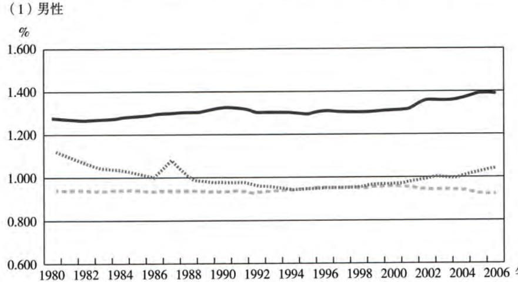

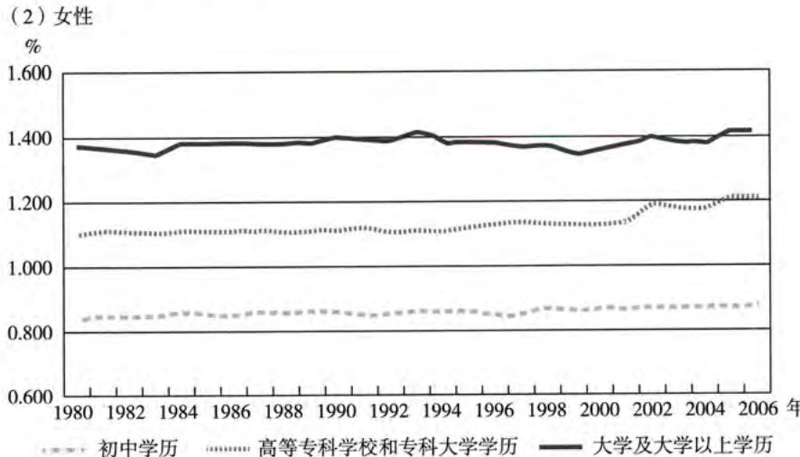  
图7-7按学历划分的相对工资

注：1.工资是指每小时法定劳动时间内工资（ $\mathbf { \equiv }$ 法定劳动时间内资/实际法定劳动时间)。2.以高中学历劳动力为1的指数。3.根据厚生劳动省《薪酬结构基本统计调查》编制。

注：1.质量指数是将高中学历劳动力每小时法定劳动时间内工资设定为1时，计算的不同学历劳动力的相对工资（期间平均值）的加权平均值，用不同学历劳动力人数加权，并将1984年数据作为基准值（1)。

2.根据厚生劳动省《薪酬结构基本统计调查》编制。

# 图7-8 高学历化导致的劳动力质量的变化

# 非正式雇佣

本劳动的正式雇佣很早就以性全制员的形式存在，直到90年代后半期，当本经济陷长期衰退后，临时员、派遣员、合同工等正式雇佣才开始迅速发展。根据总务省《劳动调查专项调查》等数据，不含董事的非正式雇员比例从1995年的 $2 0 . 9 \%$ 迅速上升到2007年的$3 3 . 5 \%$ ，这意味着每三名雇员就有名是正式雇员（图7-8)。从不同性别的正式就业例来看，2007年男性例为 $1 8 . 3 \%$ ，女性为 $5 3 . 4 \%$ ，女性约为男性的3倍。非正式就业的分类显示，临时员、合同和返聘员工在男性中很常见，全制员在性中占多数。

非正式劳动的连续龄通常比正式劳动短得多，工资也低得多。表7-5显了根据《薪酬结构基本统计调查》2006年按性别和学历划分的正式和非正式员工（“常用雇员”）的资、年龄和连续工龄等。男性和性正式员工的年龄都高于正式员工，但非正式员工的连续工龄要短得多，男性学历总和为6.1年（男性正式员工为14.2年），女性学历总和为5.5年（女性正式员工为9.8年），约为正式员工的 $4 0 \% - 6 0 \%$ 。根据人力资本的概念，非正式员由于与正式员工相比连续工龄较短，积累的（企业特有的）资本较少，并反映在他们的资中。非正式员每时法定劳动时间内工资，男性（学历总和）为正式员工的 $6 3 . 9 \%$ ，女性（学历总和）为正式员工的 $7 0 . 1 \%$ 。正式员论男，学历越低其在劳动中的占越。

i   
  

<table><tr><td>时间</td><td>非正式 雇员</td><td>非全日 制员工</td><td>临时 员工</td><td>派遣 员工</td><td>合同工 和返聘 员工</td><td>其他</td><td></td><td>非正式 雇员 总和</td><td>非全日 制员工</td><td>临时 员工</td><td>派遣 员工</td><td>合同工 和返聘 员工</td><td>其他</td><td></td><td>非正式 雇员 总和</td><td>非全日 制员工</td><td>临时 员工</td><td>派遣 员工</td><td>合同工 和返聘 员工</td><td>其他</td></tr><tr><td>1984年</td><td>总和 15.3</td><td>-</td><td>-</td><td></td><td></td><td>4.2</td><td>1984年</td><td>7.7</td><td>一</td><td>一</td><td>1111111111111111</td><td>4.3</td><td></td><td>1984年</td><td>29.0</td><td>一</td><td>一</td><td></td><td>3.8</td><td></td></tr><tr><td>1985年</td><td>16.4</td><td>9.0</td><td>3.5</td><td></td><td></td><td>3.9</td><td>1985年</td><td>7.4</td><td>0.6</td><td>2.6</td><td></td><td>4.1</td><td></td><td>1985年</td><td>32.1</td><td>23.5</td><td>5.0</td><td></td><td>3.6</td><td></td></tr><tr><td>1986年</td><td>16.6</td><td>9.4</td><td>3.5</td><td></td><td></td><td>3.7</td><td>1986年</td><td>7.4</td><td>0.7</td><td>2.9</td><td></td><td>3.8</td><td></td><td>1986年</td><td>32.2</td><td>24.2</td><td>4.6</td><td></td><td>3.4</td><td></td></tr><tr><td>1987年</td><td>17.6</td><td>10.2</td><td>3.6</td><td></td><td></td><td>3.7</td><td>1987年</td><td>7.6</td><td>0.8</td><td>2.8</td><td></td><td>4.0</td><td></td><td>1987年</td><td>34.3</td><td>26.1</td><td>5.0</td><td></td><td>3.2</td><td></td></tr><tr><td>1988年</td><td>18.3</td><td>10.7</td><td>3.8</td><td></td><td></td><td>3.8</td><td>1988年</td><td>8.1</td><td>0.9</td><td>3.1</td><td></td><td>4.1</td><td></td><td>1988年</td><td>35.1</td><td>26.9</td><td>5.0</td><td></td><td>3.2</td><td></td></tr><tr><td>1989年</td><td>19.1</td><td>11.0</td><td>4.4</td><td></td><td></td><td>3.8</td><td>1989年</td><td>8.7</td><td>1.0</td><td>3.7</td><td></td><td>4.0</td><td></td><td>1989年</td><td>36.0</td><td>27.1</td><td>5.6</td><td></td><td>3.4</td><td></td></tr><tr><td>1990年</td><td>20.2</td><td>11.6</td><td>4.7</td><td></td><td></td><td>3.9</td><td>1990年</td><td>8.8</td><td>1.0</td><td>3.7</td><td></td><td>4.1</td><td></td><td>1990年</td><td>38.1</td><td>28.3</td><td>6.1</td><td></td><td>3.7</td><td></td></tr><tr><td>1991年</td><td>19.8</td><td>11.5</td><td>4.7</td><td></td><td></td><td>3.6</td><td>1991年</td><td>8.5</td><td>1.0</td><td>3.8</td><td></td><td>3.7</td><td></td><td>1991年</td><td>37.2</td><td>27.7</td><td>6.1</td><td></td><td>3.4</td><td></td></tr><tr><td>1992年</td><td>20.5</td><td>11.9</td><td>4.9</td><td></td><td></td><td>3.8</td><td>1992年</td><td>8.9</td><td>1.1</td><td>4.0</td><td></td><td>3.9</td><td></td><td>1992年</td><td>38.3</td><td>28.4</td><td>6.2</td><td></td><td>3.7</td><td></td></tr><tr><td>1993年</td><td>20.8</td><td>11.9</td><td>5.0</td><td></td><td></td><td>3.9</td><td>1993年</td><td>9.4</td><td>1.3</td><td>4.1</td><td></td><td>4.0</td><td></td><td>1993年</td><td>38.5</td><td>28.4</td><td>6.4</td><td></td><td>3.7</td><td></td></tr><tr><td>1994年</td><td>20.3</td><td>11.7</td><td>5.0</td><td></td><td>3.6</td><td></td><td>1994年</td><td>8.5</td><td>0.9</td><td>4.1</td><td></td><td>3.4</td><td></td><td>1994年</td><td>38.4</td><td>28.1</td><td>6.5</td><td></td><td>3.7</td><td></td></tr><tr><td>1995年</td><td>20.9</td><td>11.8</td><td>5.5</td><td></td><td>3.7</td><td></td><td>1995年</td><td>8.9</td><td>1.0</td><td>4.2</td><td></td><td>3.7</td><td></td><td>1995年</td><td>39.1</td><td>28.1</td><td>7.4</td><td></td><td>3.7</td><td></td></tr><tr><td>1996年</td><td>21.5</td><td>12.3</td><td>5.7</td><td></td><td>3.6</td><td></td><td>1996年</td><td>9.4</td><td>1.1</td><td>4.7</td><td></td><td>3.6</td><td></td><td>1996年</td><td>39.8</td><td>29.0</td><td>7.1</td><td></td><td></td><td></td></tr><tr><td>1997年</td><td>23.2</td><td>12.9</td><td>6.2</td><td></td><td>4.2</td><td></td><td>1997年</td><td>10.5</td><td>1.2</td><td>5.3</td><td></td><td>4.1</td><td></td><td>1997年</td><td>41.7</td><td>29.9</td><td>7.5</td><td></td><td>3.6 4.3</td><td></td></tr><tr><td>1998年</td><td>23.6</td><td>13.2</td><td>6.6</td><td></td><td>3.8</td><td></td><td>1998年</td><td>10.3</td><td>1.2</td><td>5.5</td><td></td><td>3.7</td><td></td><td>1998年</td><td>42.9</td><td>30.7</td><td>8.3</td><td></td><td>3.8</td><td></td></tr><tr><td>1999年</td><td>24.9</td><td>14.0</td><td>6.9</td><td>-</td><td>4.1</td><td></td><td>1999年</td><td>11.1</td><td>1.5</td><td>5.6</td><td></td><td>4.0</td><td></td><td>1999年</td><td>45.2</td><td>32.2</td><td>8.8</td><td></td><td>4.3</td><td></td></tr><tr><td>2000年</td><td>26.0</td><td>14.7</td><td>7.3</td><td>0.7</td><td>3.3</td><td></td><td>2000年</td><td>11.7</td><td>1.9</td><td>6.1</td><td>0.3</td><td>3.4</td><td></td><td>2000年</td><td>46.4</td><td>33.0</td><td>9.1</td><td>1.2</td><td>3.2</td><td></td></tr><tr><td>2001年</td><td>27.2</td><td>15.4</td><td>7.6</td><td>0.9</td><td>3.3</td><td></td><td>2001年</td><td>12.5</td><td>2.2</td><td>6.8</td><td>0.4</td><td>3.2</td><td></td><td>2001年</td><td>47.9</td><td>34.0</td><td>8.9</td><td>1.6</td><td>3.3</td><td></td></tr><tr><td>2002年</td><td>29.4</td><td>14.5</td><td>6.8</td><td>0.9</td><td>4.7</td><td>2.5</td><td>2002年</td><td>15.0</td><td>2.2</td><td>5.8</td><td>0.3</td><td>4.3</td><td>2.4</td><td>2002年</td><td>49.3</td><td>31.6</td><td>8.2</td><td>1.6</td><td>5.2</td><td>2.7</td></tr><tr><td>2003年</td><td>30.4</td><td>15.1</td><td>6.9</td><td>1.0</td><td>4.8</td><td>2.6</td><td>2003年</td><td>15.6</td><td>2.2</td><td>6.0</td><td>0.5</td><td>4.4</td><td>2.5</td><td>2003年</td><td>50.6 51.7</td><td>32.7 32.6</td><td>8.1</td><td>1.8 2.7</td><td>5.3 5.6</td><td>2.8 2.9</td></tr><tr><td>2004年</td><td>31.4</td><td>15.3</td><td>6.7</td><td>1.7</td><td>5.1</td><td>2.6</td><td>2004年</td><td>16.3</td><td>2.5</td><td>5.8</td><td>1.0</td><td>4.8</td><td>2.3 2004年 2.4 2005年</td></table>

假设工资是根据生产率决定的，与学历化的情况相同，可以认为正式雇佣的增加导致了劳动质量的下降。因此，按总务省《劳动调查专项调查》和《劳动调查（细表）》中的正式员和正式员数，对上表中使的《薪酬结构基本统计调查》中的正式员每时法定劳动时间内资定为1时的相对资（正式员和正式员工分别的学历总和）进加权平均，将1984年数据作为基准值（1）来创建劳动质量指数（图7-9)①。但是，值得注意的是，由于数据限制，正式员工和非正式员工的相对工资固定为2006年数据，根据这估算，由于正式就业的发展，1984年以来的二十年中，劳动力质量估计下降了约5%，下降速度在90年代后半期加快。从性别上看，男性下降了约 $3 \%$ ，性下降了约 $7 \%$ ，女性降幅更大，这是由于性正式就业率增长更快（19842007年涨幅：男性为10.6个百分点，女性为24.4个百分点)。

表7-6 正式员工和非正式员工的年龄、连续工龄和工资等对比(2006年)  

<table><tr><td rowspan=2 colspan=3>项目</td><td rowspan=1 colspan=1>年龄</td><td rowspan=1 colspan=1>连续工龄</td><td rowspan=1 colspan=2>每小时法定劳动时间内工资</td><td rowspan=1 colspan=1>在劳动人口中的占比</td></tr><tr><td rowspan=1 colspan=1>岁</td><td rowspan=1 colspan=1>年</td><td rowspan=1 colspan=1>日元、%</td><td rowspan=1 colspan=1>倍</td><td rowspan=1 colspan=1>%</td></tr><tr><td rowspan=1 colspan=1>男女总和</td><td rowspan=1 colspan=1>学历总和</td><td rowspan=1 colspan=1>正式员工非正式员工非正式/正式</td><td rowspan=1 colspan=1>40.643.2</td><td rowspan=1 colspan=1>13.05.8</td><td rowspan=1 colspan=1>1909116561.0%</td><td rowspan=1 colspan=1></td><td rowspan=1 colspan=1>86.713.3</td></tr><tr><td rowspan=3 colspan=1>男性</td><td rowspan=1 colspan=1>学历总和</td><td rowspan=1 colspan=1>正式员工非正式员工非正式/正式</td><td rowspan=1 colspan=1>41.545.0</td><td rowspan=1 colspan=1>14.26.1</td><td rowspan=1 colspan=1>2074132663.9%</td><td rowspan=1 colspan=1></td><td rowspan=1 colspan=1>91.48.6</td></tr><tr><td rowspan=1 colspan=1>初中学历</td><td rowspan=1 colspan=1>正式员工非正式员工非正式/正式</td><td rowspan=1 colspan=1>51.754.4</td><td rowspan=1 colspan=1>19.910.2</td><td rowspan=1 colspan=1>1732123871.5%</td><td rowspan=1 colspan=1>0.941.00</td><td rowspan=1 colspan=1>81.718.3</td></tr><tr><td rowspan=1 colspan=1>高中学历</td><td rowspan=1 colspan=1>正式员工非正式员工非正式/正式</td><td rowspan=1 colspan=1>42.244.3</td><td rowspan=1 colspan=1>15.05.5</td><td rowspan=1 colspan=1>1842124367.5%</td><td rowspan=1 colspan=1>1.001.00</td><td rowspan=1 colspan=1>89.310.7</td></tr></table>

续表  

<table><tr><td rowspan=2 colspan=3>项目</td><td rowspan=1 colspan=1>年龄</td><td rowspan=1 colspan=1>连续工龄</td><td rowspan=1 colspan=2>每小时法定劳动时间内工资</td><td rowspan=1 colspan=1>在劳动人口中的占比</td></tr><tr><td rowspan=1 colspan=1>岁</td><td rowspan=1 colspan=1>年</td><td rowspan=1 colspan=1>日元、%</td><td rowspan=1 colspan=1>倍</td><td rowspan=1 colspan=1>%</td></tr><tr><td rowspan=2 colspan=1>男性</td><td rowspan=1 colspan=1>高等专科学校和专科大学学历</td><td rowspan=1 colspan=1>正式员工非正式员工非正式/正式</td><td rowspan=1 colspan=1>36.836.4</td><td rowspan=1 colspan=1>11.44.4</td><td rowspan=1 colspan=1>1886133370.7%</td><td rowspan=1 colspan=1>1.021.07</td><td rowspan=1 colspan=1>93.16.9</td></tr><tr><td rowspan=1 colspan=1>大学及大学以上学历</td><td rowspan=1 colspan=1>正式员工非正式员工非正式/正式</td><td rowspan=1 colspan=1>40.143.1</td><td rowspan=1 colspan=1>13.05.4</td><td rowspan=1 colspan=1>2498171068.5%</td><td rowspan=1 colspan=1>1.361.38</td><td rowspan=1 colspan=1>95.74.3</td></tr><tr><td rowspan=5 colspan=1>女性</td><td rowspan=1 colspan=1>学历总和</td><td rowspan=1 colspan=1>正式员工非正式员工非正式/正式</td><td rowspan=1 colspan=1>38.341.7</td><td rowspan=1 colspan=1>9.85.5</td><td rowspan=1 colspan=1>1456102170.1%</td><td rowspan=1 colspan=1></td><td rowspan=1 colspan=1>76.323.7</td></tr><tr><td rowspan=1 colspan=1>学历总和</td><td rowspan=1 colspan=1>正式员工非正式员工非正式/正式</td><td rowspan=1 colspan=1>53.752.7</td><td rowspan=1 colspan=1>16.68.8</td><td rowspan=1 colspan=1>115589877.7%</td><td rowspan=1 colspan=1>0.890.94</td><td rowspan=1 colspan=1>61.638.4</td></tr><tr><td rowspan=1 colspan=1>初中学历</td><td rowspan=1 colspan=1>正式员工非正式员工非正式/正式</td><td rowspan=1 colspan=1>41.343.6</td><td rowspan=1 colspan=1>11.26.0</td><td rowspan=1 colspan=1>129696074.1%</td><td rowspan=1 colspan=1>1.001.00</td><td rowspan=1 colspan=1>70.030.0</td></tr><tr><td rowspan=1 colspan=1>高中学历</td><td rowspan=1 colspan=1>正式员工非正式员工非正式/正式</td><td rowspan=1 colspan=1>35.535.9</td><td rowspan=1 colspan=1>8.84.0</td><td rowspan=1 colspan=1>1524112173.6%</td><td rowspan=1 colspan=1>1.181.17</td><td rowspan=1 colspan=1>83.716.3</td></tr><tr><td rowspan=1 colspan=1>高等专科学校和专科大学学历</td><td rowspan=1 colspan=1>正式员工非正式员工非正式/正式</td><td rowspan=1 colspan=1>32.933.0</td><td rowspan=1 colspan=1>6.83.2</td><td rowspan=1 colspan=1>1764130874.1%</td><td rowspan=1 colspan=1>1.361.36</td><td rowspan=1 colspan=1>85.814.2</td></tr></table>

注：1.所有产业。2.至少有10名“常用雇员”的机构。3.根据厚生劳动省《薪酬结构基本统计调查》编制。

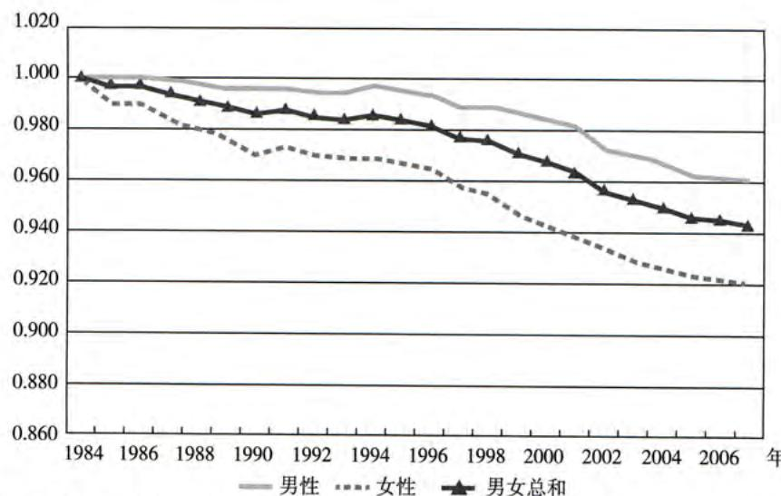  
图7-9 非正式雇佣导致的劳动力质量下降

注：1.质量指数是按性别将正式员工每小时法定劳动时间内工资设定为1时，计算的正式员工和非正式员工的相对工资（截至2006年，《薪酬结构基本统计调查》）的加权平均值，用正式员工和非正式员工人数（每年，《劳动力调查专项调查》）加权，并将1984年数据作为基准值（1)。男女总和是按性别划分的劳动力人数的加权平均值。2.相对工资固定为2006年数据，因此没有反映正式和非正式劳动力不同学历的相对工资变化。3.根据厚劳动省《薪酬结构基本统计调查》和总务省《劳动调查专项调查》《劳动调查（细目表）》编制。

# 高学历化和非正式雇佣

非正式雇佣引起了劳动质量的下降。接下来，我们看下同时纳高学历化和正式雇佣两个因素后，劳动质量发了怎样的变化？图7-10显了同时纳两个因素后劳动质量的变化。该指数是按学历划分的正式和非正式员的相对资的加权平均值，用按学历划分的正式和正式雇佣的劳动数加权，以《薪酬结构基本统计调查》中截2006年的中学历正式员工每小时法定劳动时间内工资为1，并将1984年数值作为基准值（1）。按学历划分的正式和正式雇佣的劳动数的权重是通过将《薪酬结构基本统计调查》（每年）中按学历划分的劳动构成率除以《劳动调查专项调查》和《劳动调查（细表）》（每年）中正式和正式劳动率得到的。值得注意的是，按学历划分的正式和非正式员工的相对工资固定为2006年数据，所以这质量指数只反映了按学历划分的正式和正式雇佣的劳动数构成比率的变化。

1984年起的年中，男总和的质量指数提了约 $5 \%$ 。如图7-11和图7-9所示，自1980年起的二十五年中，高学历化使质量下降了约$8 \%$ ，自1984年起的二十年中，非正式雇佣使质量下降了约 $5 \%$ ，因此，该估算与之前估算大致吻合。就性别而言，自1984年起的二十年间，女性的劳动力质量明显提高了约 $9 \%$ ，男性则提高了约 $2 \%$ 。这可能是由于女性接受高学历教育的发展速度更快。

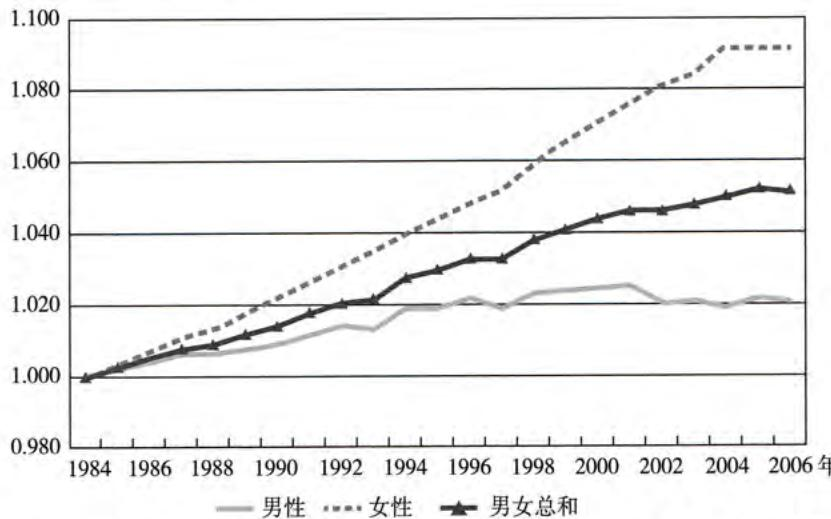  
图7-10高学历化和非正式雇佣导致的劳动力质量变化

注：1.质量指数是按学历划分的正式和非正式员工的相对工资的加权平均值，用按学历划分的正式和非正式雇佣的劳动力人数加权，按性别计算的高中学历非正式员工每小时法定劳动时间内工资为1，并将1984年数据作为基准值（1)。男女总和是按性别划分的劳动力人数的加权平均值。2.按学历划分的正式和非正式员工的相对工资根据2006年《薪酬结构基本统计调查》中按学历划分的正式和非正式员工的数值，适用于所有时期。按学历划分的劳动力人数的时间序列数据来自于《薪酬结构基本统计调查》，而关于正式和非正式劳动力人数的时间序列数据来自于《劳动力调查》。3.相对工资固定为2006年数据，因此没有反映出按学历划分的正式和非正式劳动力相对工资的变化。4.根据厚生劳动省《薪酬结构基本统计调查》和总务省《劳动力调查专项调查》《劳动力调查（细目表）》编制。

在仅纳入非正式雇佣因素的劳动力质量指数（图7-9）中，女性的下降幅度更大，但同时纳入非正式雇佣和高学历化两个因素后，女性的上升幅度反而更大。这表明，与男性相比，女性劳动力受非正式雇佣影响较大，质量下降，但同时，高学历带来的质量提升作用大于质量下降的影响，因此，女性劳动力质量提升较大。从表7-6可以看出，当高中学历劳动力的工资设定为1时，无论是正式员工还是非正式员工，高等专科学校和专科大学学历劳动的相对资性都于男性；从图7-6可以看出，性拥有学或更学历以及等专科学校和专科学学历的率增长与男性相同或更，这可能是上述相对工资性于男性的原因。

本节研究了劳动力供给的数量和质量变化。下一节，将考察这种劳动力供给如何与劳动需求形成互为影响的关系。

# 3 劳动力供给和劳动力需求

关于劳动供给和劳动需求的分析往往是独进的。但是，从经济周期的影响等面来看，很容易联想到，现实中劳动供给和劳动需求会受到各种因素的影响形成相互依存的关系。20世纪80年代起，本劳动市场上，经济环境、技术进步、全球化和龄化等预因素是相互影响的。下，根据近年来劳动市场的实际情况和对这些情况的理论研究，来分别考察劳动需求和供给变化影响劳动供给和需求的情况。

# 3.1 劳动需求对劳动供给的影响

上第节研究了在学历化和正式雇佣的影响下劳动质量的变化。这是对构成劳动供给的学历等劳动属性构成率变化的回应，其本属于劳动供给侧的变化。然，当研究转向学历化和正式雇佣背后的因素时，会发现技术进步和全球化等结构性因素和经济因素改变了劳动需求，这是带来劳动供给侧变化的一个重要因素。

首先，在学历化的背后，下第四节将详细介绍，对美国等发达国家劳动市场结构性变化的深研究表明，信息技术（IT）等技术进步相对提了学历熟练劳动（skilledlabor）的边际产，这反过来又加了熟练劳动和熟练劳动之间的资差距。这种技术进步被称为技能偏向性技术进步(Skill-Biased Technological Change，SBTC)。如果这种力量在劳动市场上起作，对本科和研究等等教育的投资回报收益率就会增加，这样理性的学就会以前更渴望接受本科和研究教育，从使学历劳动供给增加。再看全球化的影响，在全球化导致与中国等发展中国家竞争加剧的业中，低附加值部门或被淘汰或转移到海外，只剩下需要技能才的附加值部门和研发部门留在本国内，通常认为这也对学历化产了影响。这些因素表明，影响劳动需求的因素同样会改变劳动供给。

接下来，看下正式雇佣的背后，20世纪90年代后半期，劳动正式雇佣迅速增加的直接原因可以归结为经济衰退加剧和长期化。劳动力需求的下降，作为企业生产衍生需求，产生出大量的自由职业者和啃老族，这一现象源于大企业减少了录用新进员工①，同时，按资历决定级别待遇的薪酬制度和终身雇佣等日本特有的雇佣习惯，使劳动力成本高企，企业经营受到巨大挑战，在这样严峻的营商环境下，劳动力需求更多地投向非正式雇佣（非全日制员工、临时员工和其他低薪且可灵活调整的雇员）。据说，放宽对人才派遣业务的管制也从制度上对非正式雇佣需求产生了重要影响。这些因素主要归因于严峻的经济衰退，在此意义上可以被视为日本特有的因素，但许多发达国家共有的以下结构性因素也发挥了重要作用。

首先，拥有大量低薪劳动力的中国等发展中国家的崛起，导致了贸易商品在国际市场上激烈的价格竞争，并通过与赫克歇尔一俄林一萨缪尔森理论（HOS理论）中的要素价格均等化定理进类比，拉动了发达国家劳动力市场对降低工资或对低薪劳动力的需求。

其次，虽然以计算机为代表的信息技术（IT）的技术进步增加了对熟练劳动力的相对需求，但另一方面，人们认为工作的模板化与标准化，促进了部分劳动力需求由正式雇员向非正式雇员的转移，因为后者不需要通过长期连续工作积累企业特殊技能（firm-specificskill)②。这些事实表明，非正式雇佣的供给侧变化受到了劳动力需求变化因素的影响。

因此，日本发生的高学历化和非正式雇佣等劳动力供给侧的变化，受到了劳动力需求侧的强烈影响。

# 3.2劳动力供给对劳动力需求的影响

作为外生因素的劳动力供给变化有可能通过某种市场机制影响劳动力需求。下文首先介绍一个假设，即美国自20世纪80年代起出现的技术创新，实际上是受到了70年代劳动力供给变化的影响。然后，讨论人口减少和人老龄化对本劳动需求的可能影响。

正如下文第四节所述，20世纪80年代后半期起，美国等许多发达国家的劳动力市场上，熟练劳动力和非熟练劳动力之间不断扩大的收人差距引起了经济学家的注意，技能偏向性技术进步理论被认为是最能解释其原因的理论之。这种技术进步最初被视为外因素，但逐渐开始出现探索其内机制的研究，Acemoglu（1998、2002）就是其中具有代表性的研究。这项研究从理论上表明，70年代美国学毕业的劳动供给迅速增加，引发了学毕业主导的技术进步，进而使学毕业的相对资得到提升。该机制描述如下（见图7-11)。

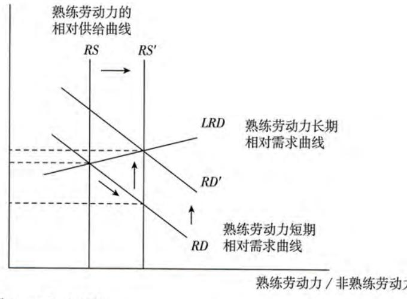  
注：引用Acemoglu（1998)。  
图7-11 定向技术进步的影响

现在假设在个由熟练劳动（学学历等学历劳动）和熟练劳动力组成的劳动力市场中，大学毕业生的供给大幅增加。在其他条件不变的情况下，学毕业供给的增加将在短期内促进熟练劳动和熟练劳动之间的替代，导致熟练劳动力的相对工资下降，并增加相对就业。在图中，平衡点沿着相对需求曲线向右下移动，就表明了这一点。然而，之后为利因存量增加变得相对廉价的技能，进了技术研发，产了与技能相符且具有一定方向性的技术进步。这种有方向的或定向的技术进步（Di-rected Technological Change），使熟练劳动力的相对需求曲线向上移动。如果这种技术进步的效果超过了最初的替代效果，那么从长远来看，对熟练劳动的相对需求曲线将向右上升，熟练劳动的相对资或学毕业的溢价将长期持续上升。这个理论模型试图解释个内机制，即20世纪80年代后半期起，IT等技能偏向性技术进步被认为造成了美国劳动力市场的工资差距，而这一技术进步源于70年代大学毕业生的供给增加。也就是说，该模型显示了劳动力供给变化可能影响劳动力需求。

另个来本经验的例是：20世纪90年代起，减少和少老龄化日益严重，使企业进一步认识到劳动力供给的制约，并对劳动力短缺感到担忧，这也进一步促使企业致力于劳动节约型技术进步。这种技术进步通常体现在资本产品中，如节省人力的机器人。劳动力需求就会受到这种技术进步的影响，表现为被资本产品的替代。换言之，人口减少和少子老龄化这种劳动力供给侧的变化，通过刺激技术进步影响劳动力需求。事实上，由于长期的经济衰退，20世纪90年代劳动力供给制约并不强烈，但可以假设，如果没有这样的经济衰退，日本经济将面临严重的劳动力短缺，劳动节约型技术进步将得到进一步推动。

本节讨论了劳动力供给和劳动力需求并非相互独立，而是相互影响，共同使劳动力市场发生变化。

# 4技术进步等和劳动力需求

自20世纪80年代后半期起，在美国等欧美劳动力市场上，熟练劳动力和非熟练劳动力之间的工资差距有所扩大，或者非熟练劳动力的失业人数有所增加，究其原因，有研究提出这来自于技能偏向性技术进步（Skill-BiasedTechnologicalChange，SBTC）理论和全球化理论。虽然还没有达成完全的共识，但现有文献表明，这两种理论都认为技能偏向性技术进步和全球化都是收入差距扩大的重要因素，但前者的影响更大①。本节在调查国外的代表性研究之后，将介绍日本的研究事例。

# 4.1 技术进步等和劳动需求—国外研究的调查

（1）技能偏向性技术进步理论

技能偏向性技术进步（或技能偏向型技术进步）是指相对提高技能型劳动力，即熟练劳动力（skilledlabor）的边际生产力的技术进步。技术进步可以理解为向单位价值等产量曲线的内侧移动，技能偏向性技术进步以偏向熟练劳动力的形式移动，此时熟练劳动力的工资分配率上升（图7-12）。

  
图7-12 技能偏向性技术进步

注：Ls、Lu分别表示熟练劳动力和非熟练劳动力，Y表示产值

先，被认为是许多研究基准的Berman、Bound和Griliches（1994）利19791987年美国制造业中450个业的剖数据，估算了从超越对数成本函数（Translog cost function）中导出的非产性劳动的工资份额变化方程，确认了近年来的技术进步（以计算机投占比和研发投占替代）对熟练劳动的资份额（以产性劳动替代）上升作出了很贡献，以此佐证了技能偏向型技术进步的作用。

Berman、Bound和Machin（1998）研究了20世纪80年代美国以外11个发达国家的劳动力市场，以了解在美国发生的技能偏向性技术进步是否属于全球性现象。该研究发现以下两个特征：是尽管部分国家产性劳动力的相对工资不变或上升，但其就业份额却在增加；二是非生产性劳动力就业份额增加的产业在很多国家都是相同的，特别是在机械、电气设备、印刷出版等以微处理器为基础的产业中尤为明显。这些事实反映出，技能偏向性技术进步是遍布全球（pervasive）的现象。

# (2）全球化理论

最基本的全球化理论，是基于赫克歇尔俄林萨缪尔森理论（HOS理论），认为发达国家和发展中国家之间的贸易，会扩发达国家熟练劳动和非熟练劳动之间的资差距。还有种观点认为，对外直接投资和外包活动（ $=$ 将制造序中劳动密集型序移交或委托给发展中国家的活动）、垂直型产业内贸易（ $=$ 质量差异化产品的产业内贸易）会带来资差距①。

先，Sachs和Shatz（1994）主要基于赫克歇尔俄林萨缪尔森理论(HOS理论），实证分析了19781990年美国与发展中国家之间的贸易可能扩大了美国制造业中熟练和非熟练劳动力之间的工资差距。

第一，这一时期美国贸易的特点是增加了从低收入国家进口非技术性劳动密集型产品，这与HOS理论相符。第二，在就业方面，生产性劳动力（非熟练劳动力）就业的下降幅度在劳动密集型产业和非研发密集型产业中更大。第三，用产业关联表估算1990年的就业情况，假设进出口比例保持在1978年水平，得出生产性劳动力、非生产性劳动力和劳动力总和的就业率分别比1978年增加了7.2%、2.1%和5.9%。这些分析表明，这一时期的贸易变化可能扩大了美国制造业中熟练和非熟练劳动力之间的工资差距。但与此同时，他们也指出，这一时期差距的扩大和就业的变化不能仅仅用贸易因素来解释。

Baldwin和Cain（1997）在Deardorff和Staiger（1998）的理论模型基础上，提出了在特定条件下，估算要素价格受贸易客体商品中体现的因素含量变化影响程度的模型。应用美国的数据，按学历划分的相对工资（=受教育年限在13年及以上的劳动力的工资/受教育年限在12年及以下的劳动力的工资）从1977年的1.38上升到1987年的1.50，仅增加了0.12个百分点，其中估算贸易变化的贡献为0.023个百分点（或贡献率为19%）。因此，尽管1977—1987年的贸易发展促成了美国不同学历之间工资差距的扩，但其影响并不占主导地位。

（3）防卫性技术进步理论

技能偏向性技术进步和全球化最初被认为是相互独立的因素，但后来的研究探讨了它们的内生机制。其中之一就是上文提到的Acemoglu（1998、2002）的定向技术进步（directed tech-nicalchange）。另一个是Thoenig和Verdier（2003）的防卫性技术进步（defensive technological change），它从理论上分析了全球化导致技能偏向性技术进步的机制。

现在假设技术分为易于模仿和难以模仿两种，并假设后者的发展需要更多的薪熟练劳动力（技术人员）。然后，以发展中国家融入世界经济为代表的全球化，通过降低易模仿技术的价值，导致了技能偏向性技术进步，从而使发达国家企业采用的技术向更加重视技能密集型的方向发展。这种技术进步被称为防卫性技术进步（defensive technologicalchange）。这个理论模型显示了全球化和技能偏向性技术进步之间一种可能的相互依存关系。该理论还意味着，熟练劳动力和非熟练劳动力之间的工资差距并不归因于贸易量或商品价格的变化，而是归因于信息跨企业传递的程度以及模仿和技术竞争的程度。

# 4.2 日本的研究事例

近年来，参考美国和其他国家的现有献，对本的技术进步和全球化影响进了研究。

(1）技能偏向性技术进步

樱井（1999、2000b）和Sakurai（2001）使用与Berman、Bound和Grili-ches（1994）相同的框架，估算了19871990年本制造业39个业的工资份额变化方程。研究证实，近年来技术进步（以计算机投占比替代），促进了非生产性劳动力需求的增加，计算机投入与技术人员和生产性劳动力之间分别存在着互补和替代关系，这是技能偏向性技术进步的佐证。

佐々、樱（2004）使与Berman、Bound和Griliches（1994）相同的框架和1988—2003年期间日本制造业17个业的面板数据，证实了最新技术进步（以研发投占替代）和全球化（以来东亚的进占和海外产占比替代）促进了大学学历劳动力工资份额的增加，并验证了对高学历劳动的需求转移是由技能偏向性技术进步和全球化的因素造成的。

# (2）全球化

樱井（2000c、2008）和Sakurai（2004）采用Sachs和Shatz（1994）的产业关联分析模型，分析了80年代和90年代贸易变化对就业的影响。从19902000年的进出口变化来看，在使用进出口占比（基于实际价格）的情况下，由于净出口的减少，制造业整体削减了约56万人的就业（比1990年和2000年就业水平分别下降4.5%和5.6%）（而使用了基本相同模型的Sachs和Shatz，估算得出1978—1990年就业率比1978年就业水平下降5.9%），并确认了贸易变化对生产和非生产性劳动力带来的非中性影响。香西、铃木、伊藤（1998）也针对不同学历的劳动力开展了类似的分析。

樱井（2000c、2008）和Sakurai（2004）采用了Baldwin和Cain（1997）的分析模型，用要素含量估算80年代和90年代贸易变化对制造业中非生产性和生产性劳动力之间工资差距的影响，得出贸易变化对相对工资（非生产性劳动力和生产性劳动力）的影响在80年代为0.034个百分点（1.358增加到1.392），在90年代为0.022个百分点（1.354增加到1.376）。贸易变化的影响可以评估为很小，这与美国的估算相同，但也可以评估为很大，因为在此期间本的相对工资几乎没有变化。同样值得注意的是，从80年代到90年代，贸易的影响是逐渐减弱的。

伊藤、深尾（2005）在分析过去年贸易结构变化对深化本国内的物质和资本的影响时，使了19882002年期间制造业中35个业的板数据，发现亚洲垂直型产业内贸易（Vertical Intra-IndustryTrade，VIIT）的发展以及日本企业的海外生产活动（当地注册企业的雇员人数/日本国内雇员人数等）和研发投人占比对劳动力需求向熟练劳动力（专业和技术员工、非生产性劳动力，不包括管理人员）的转移有正向影响。

# (3）防卫性技术进步

樱井（2005）在Thoenig和Verdier（2003）的理论模型和认识的基础上，首先分析了佳能公司引进自动化设备的案例，作为符合防卫性技术进步的案例，即为了防止技术被模仿，在公司内部完成打印机盒等自动化生产设备的制造，为此录用了大批新进技术人员。樱井（2005）分别进行了两组验证，一是利用1985—2002年制造业17个行业的面板数据，验证了贸易扩大（以进出口占比的上升来表示）促进了对大学学历劳动力需求的增加；二是利用1990—2000年制造业中28个行业三个时间点的面板数据，验证了进出口占比的增长促进了研发投入占比的增长，佐证了这些现象与防卫性技术进步相符。

如上所述，在对80年代后的日本劳动力市场的实证分析中，发现与美国等国家一样，技术进步和全球化对熟练劳动力和非熟练劳动力具有非中性影响。然而，日本熟练劳动力和非熟练劳动力之间的工资差距却没有美国那样大，这一点尚待进一步解析。其原因可能包括需求冲击本身较小、高学历劳动力供给不断增加、存在内部劳动力市场、技能差异微小和信息技术的应用滞后，对其进行深入研究是未来有待完成的课题。

# 4.3与劳动力供给制约的关联

樱井（2008）分析称，以亚洲为中心的发展中国家的崛起为特征的全球化改变了日本的进出口结构（进出口占比），1990一2000年间，使日本制造业的就业人数减少了约56万人。文章强调了从亚洲进口的（非熟练）劳动密集型产品的增加所带来的影响。从不同的角度来看，这可以解释为由于贸易结构的变化而节省了大约56万个工作岗位。上文第二节对劳动力供给的分析表明，如图7-4所示，劳动人口的增量从20世纪80年代的734万人下降到90年代的383万人，共减少了351万人，这说明日本经济的增长越来越受到劳动力供给的制约。引用上述角度，也可以解释为，劳动人口增量减少的351万人中，有56万人是从贸易结构变化中释放出来的，劳动力供给制约也因此得到缓解。

技术进步也是如此。本文所述技能偏向性技术进步与非熟练劳动节约型技术进步同义，它使单位价值等产量曲线向原点移动，同时相对提高熟练劳动力的边际生产力或增加其相对就业（即减少非熟练劳动力的相对就业）（图

7-12)。因此，尽管在劳动类型面是中性的，但产一个单位价值所需的劳动是可以节省的①。这种影响也可以看作是在劳动供给制约逐渐加强的过程中，反向使其得到缓解的一个因素。

总之，全球化和技术进步对本劳动需求的影响可能是由劳动供给制约引起或增强的。换之，劳动力供给制约通过对工资施加上行压力削弱了制造业的成本竞争力，促进了节约劳动力的技术进步。

# 5结束语

总结起来，本章主要以下结论。

（）从劳动供给数量看，20世纪90年代起，劳动年龄和劳动增速逐渐放缓或下降，劳动供给制约逐渐增强。2000—2005年，劳动供给的潜在增长率仅因劳动口变化的影响，就80年代下降了1%左右。劳动的这种变化主要归因于动态变化。25\~34岁性劳动参与率的上升促进了劳动口的增加。另，在90年代后半期，就业数增速放缓或减少的速度快于劳动增速放缓或减少的速度，这时期受经济衰退的影响，劳动力需求大幅减少。

（）从劳动供给质量看，20世纪80年代起，学历化和正式雇佣取得了进展。假设不同属性劳动力之间的相对工资反映了劳动力质量，那么学历化就会提质量，正式雇佣就会降低质量。相对资不变，根据不同属性劳动力构成比例的变化估算劳动力平均质量的变化，就会发现，在1980年起的二十五年中，学历化使质量提高了约 $8 \%$ （其中男性 $6 \%$ ，女性$12 \%$ )；在1984年起的二十年中，非正式雇佣使质量降低了约 $5 \%$ （其中男性$3 \%$ ，女性 $7 \%$ )。估算条件略有调整，但同时纳学历化和正式雇佣两个因素后，劳动力质量提高了约5%（其中男性2%，女性9%）。

（三）上述劳动供给侧的变化不是独发的，是通过多种因素与劳动需求相互作产的合。先，们认为学历化受到技术进步（技能偏向性技术进步）和全球化的影响，前者提了等教育投资回报收益率，后者则提了对技能才的相对需求。除了严重的经济衰退外，非正式雇佣还受到了使作模板化、标准化成为可能的计算机等信息技术（IT)和愈演愈烈的全球竞争的影响。另，减少和少龄化这种动态上的劳动力供给侧的变化，与没有这种变化的情况相比，更加促进了劳动节约型技术进步，对劳动力需求产生了影响。此外，美国的研究认为，20世纪70年代高学历劳动力供给的增加，引发了80年代之后的信息技术（IT）等技能偏向性技术进步。

（四）20世纪80年代起，在美国等欧美发达国家的劳动力市场上，熟练劳动力与非熟练劳动力之间的工资差距加大，或者非熟练劳动力的失业率上升，究其原因，有研究认为应归结于技能偏向性技术进步和全球化理论。这些理论认为，IT等技术进步以及与发展中国家贸易的扩大，相对提高了对熟练劳动力的需求。本文介绍了美国具有代表性的现有文献和日本的研究事例，并表明这些理论在日本和美国及其他国家一样得到了支撑。然而，日本的工资差距没有像美国那样扩大的事实仍有待继续考察。还有人指出，虽然日本经济自90年代起逐渐受到劳动力供给的制约，但其中技术进步和全球化可以被解释为具有释放劳动力和缓解供给制约的作用。

最后，根据本文的分析内容，对未来劳动力和日本经济等问题和意义阐述如下。

首先，根据日本未来的人口预测，预计出生率下降导致的劳动力供给制约会更加严峻，日本经济整体的潜在增长率可能会受到阻碍。解决这一问题的措施有：提高出生率、为老年人再就业提供机会、通过教育投资提高劳动生产率和技术进步。但与其他国家相比，日本最为奏效的措施可能是对性劳动力的有效利用。女性劳动力参与率虽然一直在增加，但仍然低于国际平均水平。女性在传统的工作环境中，一直存在着工作与生育之间的取舍关系，如果这种关系能够得到改善，女性将能够在工作的同时生育孩子，在资源分配方面可以实现重大的帕累托改进。这也是日本经济中留下的极为宝贵的帕累托改进源泉，应予充分利用。旨在兼顾工作和生活的工作生活平衡概念被认为是上述改善的关键所在，人们对这方面的政策性支持寄予厚望。

第二，在劳动力质量方面，虽然经济衰退的影响在衰退结束后会消失，但技术进步和全球化等结构性因素的影响预计仍会持续。其中，非正式雇佣的影响尤其值得关注。当然，非正式雇佣的好处是，不想长期从事固定工作的劳动力可以灵活就业，但在现实中，除了许多人非自愿地从事非正式雇佣工作以及没有得到平等的待遇之外，主要问题是缺乏对未来人力资本的积累。仅仅以降低成本为目的的非正式雇佣在短期内将使公司受益，但从长远来看会降低其竞争力。为此，宜考虑采取灵活的就业形式，以确保稳定就业和人力资本的积累，例如，“工作方式虽然是非全日制方式，但能够以正式员的份长期作”或许成为“可选项”。

# 参考文献

浅子和美·滝澤美帆（2008)，「限界産性原理とTFP>イアス」フィナンシャル・レビュー」財務省財務総合政策研究所，2008年8月.

阿部正浩（2005)，『本経済の環境変化と労働市場』東洋経済新報社.

藤惠子・深尾京司(2005)，「本の産業間・産業内国際分業と対外直接投資—一国内の物的·人的資本深化 $\scriptscriptstyle \frown \oslash$ 影響」，橋学経済研究所編[经济研究』岩波書店，第56卷第4号.

川口大司·神林龍·金榮愨·権赫旭·清谷諭·深尾京司·牧野達治·横山泉(2007)，「年功賃金は生産性と乖離しているか工業統計調査・賃構造基本統計調査個票デタによる実証分析」，一橋大学経済研究所编『经済研究]岩波書店，第58卷第1号.

玄田有史（2001)，仕事の中の曖昧な不安一揺れる若者の現在』中央公論新社.

香西泰・鈴木玲子・伊藤由樹子（1998)，貿易の雇と賃への影響』日本经济研究センタ，JCER DISCUSSION PAPERNo.51.

櫻井宏二郎(1999)，「偏向的技術進步と本製造業の雇用・賃金コンピュ夕投資にみる技術進歩の影響」『経済経営研究』本開発銀設

備投资研究所，Vol.20-2.

櫻井宏二郎（2000a)，「90年代の日本の労働市場賃金プロファイルはどのように変化したか」社会科学研究』東京大学社会科学研究所，第

51卷第2号.

櫻井宏二郎（2000b），偏向的技術進歩と雇用一一日本の製造業の一ス，吉川洋・瀧雅之編『循環と成長のマク口経済学東京大学出版会.

櫻井宏二郎(2000c)，「グロ化と労働市場日本の製造業のー

ス」『経済経営研究』本政策投資銀設備投資研究所，Vol.21-2.櫻井宏二郎（2002a），「ITの雇に与之る影響」『本労働研究雑誌本

労働研究機構，No.501.

櫻井宏二郎（2002b)，「貿易と雇用グロ化の産業と地域への影

響」『经済経営研究』本政策投資銀設備投資研究所，Vol.23-1.櫻井宏二郎（2003)，産業空洞化が本経済に与之た影響貿易と雇用を中心に」,岩田規久男・宮川努編『失われた10年の真因は何か』東

洋经済新報社.

櫻井宏二郎（2004），「技術進步と人的資本—スキル偏向的技術進歩の実証

分析」『经済経営研究本政策投資銀設備投資研究所，Vol.25-1.櫻井宏二郎（2005），「防衛的技術進步—グ口ー経済下の内生的技術

進步」【経済経営研究』日本政策投資銀設備投資研究所，Vol.26-3.櫻井宏二郎(2008)，「市場のと日本の労働経済一技術進步，グ口

ル化と格差」未発表論文.

佐々木仁・桜健(2004)，「製造業における熟練労働への需要フトースキ偏向的技術進歩とグロバ化の影響」日本銀行ワキグペ

一パーシリーズ，No.04-J-17，日本銀行調查統計局.橘木俊詔·森川正之·西村太郎（1996)，『貿易と雇用·賃金研究シ一

ズ28，通商產業研究所.林文夫（2003)，「構造改革なくして成長なし」，岩田規久男・宮川努编

『失われた10年の真因は何か」東洋経済新報社.深尾京司・宮川努編(2008)，Γ生産性と本の経済成長JIPデタスによる産業・企業レベルの実証分析』東京大学出版会

Acemoglu, D.(1998), "Why Do New Technology Complement Skills? Directed Technical Change and Wage Inequality," Quarterly Journal of Economics, 113 (4), pp. 1055–1089.   
Acemoglu, D. (2002), "Directed Technical Change," The Review of Economic Studies, 69 (4), pp. 781–809.   
Autor, D. H., Katz, L. F., and Krueger, A. (1998), "Computing Inequality: Have Computers Changed the Labor Market? , Quarterly Journal of Economics, 113(4), pp. 1169–1213.   
Baldwin, R. E. (1994), "The Effects of Trade and Foreign Direct Investment on Employment and Relative Wage," OECD Economic Studies, No. 23, 7–54.   
Baldwin, R. E. and Cain, G. G. (1997), "Shifts in U.S. Relative Wages: The Role of Trade, Technology and Factor Endowments," NBER Working Paper 5934.   
Berman, E., Bound, J. , and Griliches, Z. (1994), "Changes in the Demand for Skilled Labor Within U. S. Manufacturing: Evidence from the Annual Survey of Manufacturers," Quarterly Journal of Economics, 109 (2), pp. 367–397.   
Berman, E., Bound, J. , and Machin, S. (1998), "Implications of Skill-Biased Technological Change: International Evidence," Quarterly Journal of Economics, 113(4), pp. 1245–1279.   
Deardorff, A. V. and Staiger, R. W.(1988), "An Interpretation of the Factor Content of Trade," Journal of International Economics, 24(1–2), pp. 93–107.   
DiNardo, J. and Pischke, J. (1997), "The Returns to Computer Use Revisited: Have Pencils Changed the Wage Structure Too?," Quarterly Journal of Economics, 112(1), pp. 291-303.   
Feenstra, R. C. and Hanson, G.(1996),“Globalization, Outsourcing,and Wage Inequality," American Economic Review, 86(2), pp. 240–245.   
Feenstra, R. C. and Hanson, G. (1999), "The Impact of Outsourcing and High- Technology Capital on Wages: Estimates for the United States, 1979–1990," Quarterly Journal of Economics, 114(3), pp. 907-940.   
Hayashi, F., and Prescott E. C. (2002), "The 1990s in Japan: A Lost Decade," Review of Economic Dynamics, 5(1), pp. 206–235.   
Ito,K., and Fukao, K. (2004), "Physical and Human Capital Deepening and New Trade Patterns in Japan," NBER Working Paper 10209.   
Krugman, P. (1995), “Growing World Trade: Causes and Consequences," Brookings Papers on Economic Activity, 26(1995–1), pp. 327–377.   
Krugman, P.(2000), "Technology, Trade, and Factor Prices," Journal of International Economics, 50(1), pp. 51–71.   
Leamer, E. E. (1994), “Trade, Wages, and Revolving Door Ideas, NBER Working Paper 4716.   
Sachs, J. D. and Shatz, H.J.(1994),"Trade and Jobs in U. S. Manufacturing," Brookings Papers on Economic Activity, 25(1994–1), pp. 1–84.   
Sakurai, K.(2001), “Biased Technological Change and Japanese Manufacturing Employment," Journal of the Japanese and International Economies, 15 (3), pp. 298–322.   
Sakurai, K.(2004), "How Does Trade Affect the Labor Market? Evidence from Japanese Manufacturing," Japan and the World Economy, 16 (2), pp. 139–161.   
Tachibanaki, T. and Sakurai, K. (1991), "Labour Supply and Unemployment in Japan," European Economic Review, 35(8), pp. 1575–1587.   
Thoenig, M. and Verdier, T. (2003), "A Theory of Defensive Skill-Biased Innovation and Globalization," American Economic Review, 93(3), pp. 709–728.   
Wood, A. (1994), North-South Trade, Employment, and Inequality, Clarendon Press, Oxford.

# 8关于日本企业研发资产积累和效益的实证分析

元桥一之

# 导语

本文分析了20世纪80年代以后日本企业的研发投资和研发资产积累的趋势、研发投资的决定因素以及研发资产的生产率。到20世纪90年代前半期，日本企业顺利地提高了研发投资，但由于泡沫的破灭，战后民间研发投资总额首次出现负增长，此后增长率也一直在下降。因此，研发资产的增长速度也从20世纪80年代的 $10 \%$ 以上降到了泡沫破灭后的百分之四点几，降幅过半。

究其原因，可以认为是泡沫破灭等需求冲击导致企业财务状况恶化。与设备投资（有形固定资产投资）相比，研发投资未来收益的不确定性较高，因此常常使用留存收益等公司内部的资金。企业财务状况恶化拖累了研发投资，这一点在对研发投资决定因素的分析中得到了证实。研发投资也受其价格变动的影响，因此通过完善研发税制等降低研发成本的政策是非常重要的。

另一方面，对明确采用研发资产的生产函数进行估算后发现，泡沫破灭前后，研发资产的边际生产率有所上升。这可能是由于财务状况恶化带来了资金限制，以及在全球创新竞争环境日益严峻的情况下，企业将研发活动集中在了盈利能力较强的领域。特别是20世纪90年代后半期以后，日本企业将自身的研发集中在开发性质较强的项目上，对于基础性研究，则着力探索产学合作等外部合作。本文的分析结果表明，20世纪90年代后半期以后，开展产学合作的企业，其研发资产的边际生产率更高。①

# 1前言

目前，日本经济正处于一个横向波动期。始于2002年的经济上升阶段迎来了转折期。20世纪90年代前半期泡沫破灭后，日本经济进了低增长时代，但2000年以后，企业部门出现了复苏。但是，这一被称为战后时间最长的经济上升阶段在2002年至2007年的平均经济增长率仅为 $2 , 1 \%$ ，略显疲软。经济增长率是进行中长期经济财政管理的前提，政府将经济增长率设定为 $2 \%$ ，但这一增长率与所谓的巡航速度相差无几。虽然这一数字于20世纪90年代的平均增长率 $1 , 4 \%$ ，但与20世纪80年代超过 $4 \%$ 的增长率相比，还是难以望其项背。

从供给侧看日本经济，由于龄化和少子化不断加剧，劳动力投预计会减少，在这种情况下，就需要提高生产率。此外，设备投资带来的资本积累对经济增长的影响也不容小觑，与此同时，研发投资、软件投资等无形资产的投资活动的重要性也越来越。企业在计算无形资产时，虽然软件资产等部分项目计入了财务报表，但以研发带来的知识积累、商品和企业的品牌价值、优秀的经营方法等组织资产为代表的重要经营战略投资却并没有体现在财务报表当中。有观点认为，这些无法体现在财务报表中的无形资产可以通过企业总市值与财务报表上总资产的差来体现，有些企业的总市值甚至高达总资产的数倍之多。

另一方面，随着国民经济核算体系（SNA）的修订，政府开始从宏观经济层面把握无形资产的情况。例如，1993年SNA修订版（93SNA）建议将软件作为设备投资处理，并且应该在国民经济核算体系中明确处理。根据这一建议，欧美各国开始掌握软件投资和资本的情况，并将其纳入各自国家的GDP统计。本在2000年标准修订中，也开始将部分软件纳GDP统计。此外，研发投资之前也是作为中间投入来处理的，而现在正在研究建立卫星账户，将其计入资本。除软件（信息化资产）和研发费用（创新资产）外，无形资产还包括品牌资产和企业组织变革产生的费用等经济竞争力，各国正在从宏观层把握这些无形资产的投资情况（Corrado等，2006和Fukao等，2007)。

无形资产之所以受到如此广泛的关注，是因为它在经济活动中的重要性与俱增，同时，无形资产的积累还与产率有着密切的关系。相对于资本和劳动等生产要素，生产率（全要素生产率）是一项中立的指标，它的增长率可以经济增长率减去各产要素贡献率的残差项（索洛残差）来测量。在宏观和产业层面测量全要素生产率时，由于数据限制等原因，不作为资本考虑的无形资产贡献率将包含在全要素产率中。另外，人们还认为无形资产的积累与劳动力投和资本投的边际产率存在互补关系。其代表案例是计算机和软件等IT资本与企业组织、人事管理系统、优秀的业务流程等组织资产之间的关系。IT投资本身并不能提高企业的生产率，只有进相应的组织性投资才能体现其效果（Bresnahan等，2002）。因此，在需要以产率为主导的日本经济中，如何推进无形资产的积累，如何高效利用无形资产来促进经济效益，可以说是非常重要的问题。此外，从20世纪80年代后半期开始的经济过热和泡沫破灭，再到20世纪90年代以后的低增长时代，无形资产在本经济中的地位发了怎样的变化？研究这些问题对于思考今后形资产的相关政策和企业经营具有重大意义。

本以研发投资和技术创新资产为重点，从宏观和微观两面分析形资产积累及其对经济效益的影响。

# 2关于研发资本积累及其效率的讨论

# 2.1 研发投资的趋势

研发资本可以通过研发投资的积累来测量。在企业会计准则中，与研发有关的出作为损失处理，不计资本。根据《科学技术研究调查》（总务省），2006年度企业的研发费用总额为13.3万亿日元，其中，费用明细分别为人工费用 $3 9 . 9 \%$ ，原材料费用 $1 8 . 7 \%$ ，有形固定资产购置费 $8 . 7 \%$ 等。在宏观统计（SNA统计）中，有形固定资产购置费（设备投资额）被视为有形资产，但除此以外的91. $3 \%$ 的费项仍未计资本。

研发投资是企业对未来的投资，包括开发新商品和改良制作技术等，由此获得的认识和知识虽然是无形的，但对企业来说是非常重要的资产。然而，研发活动具有不确定性，例如，在研究项目成功和失败两种情况下，该研发存量的未来价值将大不相同。基于上述原因，研发在企业会计和SNA统计中不被列为资产①。不过，研究人员正在积极测量研发资本，并采取与其经济价值相关的措施。与有形固定资产的估算一样，根据永续盘存法，在一定的摊销率下积累研发投资额。因此，要探讨研发资本的积累，首先要看研发投资的趋势。

图8-1为宏观层面的研发费用趋势。《科学技术研究调查》（总务省）不仅调查民营企业的研发情况，还调查包括大学和公共研究机构在内的本整体的研发活动情况。2006年度的研发费用总额约为18.5万亿日元，其中13.3万亿日元来自民营企业，1.8万亿日元来自包括独立行政法人在内的公共研究机构，3.4万亿日元来自大学。此外，民营企业的研发费用大部分由企业自身经费支付（2006年度为 $9 8 , 6 \%$ )，而公共研究机构和大学的研发费用大部分由公共资或学费支付（2006年度为 $9 5 , 8 \%$ )。因此，企业等的研发投资可以称为民间研发，公共研究机构和大学的研发投资可以称为公共研发。

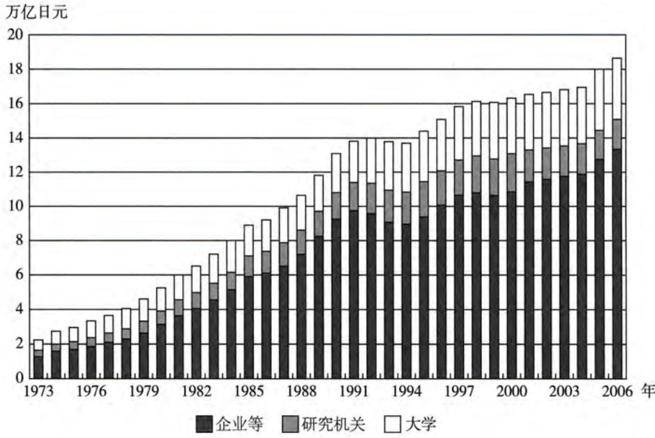  
图8-1 研发费用的趋势  
（资料来源：总务省《科学技术研究调查》）

第次油危机后的研发投资额直平稳增长到1991年。然，在泡沫破灭的同时，研发投资额一度出现负增长，增长率本身与20世纪80年代以前相比也处于较低水平。研发费用的四成左右为人工费用，与设备投资相比，时间序列上的波动一般较小。但是，根据《2006年度民营企业研发调查报告》（文部科学省），企业减少研发费用的要原因是“销售收减少”。由此可以推测，20世纪90年代以来研发费用的低增长受到了宏观经济环境的影响。

为了更详细地说明这点，图8-2显了GDP增长和研发投资增长（通过GDP平减指数计算的实际值）的变化。图中分别显示了1975—2005年期间每5年的平均增长率。首先，从民间研发来看，各期的增长率都高于GDP增长率。不过，这里需要注意的是，研发活动集中在制造业，主要是电机、运输机械、制药等部分业。因此，这与宏观层GDP的比较可以看作是对大趋势的考察。以1990年为界，GDP从 $4 \%$ 左右下降到 $2 \%$ 以下，而民间研发的增长率也从 $10 \%$ 左右幅下降到 $2 \% - 3 \%$ 左右。GDP平减指数最近持续负增长，随着经济增长率的下降、通货紧缩的加剧，研发费用的增长率也在下降。

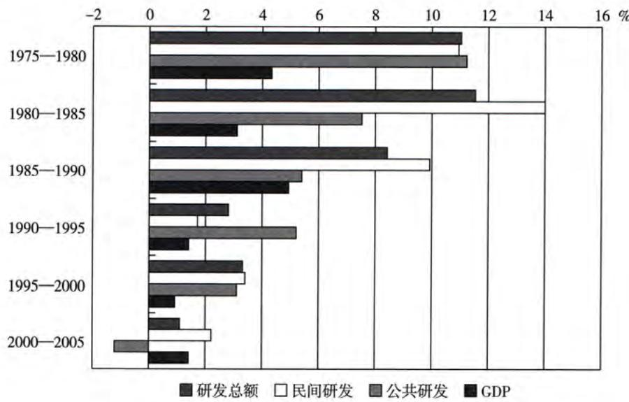  
图8-2 研发与GDP的增速对比  
（资料来源：笔者根据总务省《科学技术研究调查》等估算）

如上所述，日本研发资本积累的趋势并不令人满意，但另一方面，日本的研发费用占GDP的 $3 . 5 \%$ 左右，与欧美各国相比处于较平。虽然研发增速下降，但仍然快于GDP的增长，因此这比率仍然呈上升趋势。由此可以看出，虽然有观点认为“本的研发投资较为充，经济增长和生产率停滞不前是因为研发的效率有问题”，但正如下文所述，研发的效率并没有出现明显的下降。因此，问题更可能在于宏观经济因素导致研发投资增长率下降。

# 2.2 技术化的速度

采用永续盘存法时，可以按照以下方式估算研发资产：

$$
\mathrm { R D s t o c k } _ { t } = \mathrm { R D } _ { t } + \left( 1 - \delta _ { t } \right) \mathrm { R D s t o c k } _ { t - 1 }
$$

确定研发存量的初始值后，代每年的研发费（通过平减指数计算的实际值）和资产的损耗率（δ），计算每年的研发存量。上一节提到研发增长率在下降，而讨论研发资产的积累时，δ的趋势也很重要。在有形固定资产中，δ表示资本的损耗率，但研发存量属于无形资产，资本并不会在物理上发生损耗，因此可以将δ解释为整个研发存量中技术老化且不再具有经济价值的比例，即技术老化速度。Delta越大，在整个研发存量中老化的部分就越大，即老化的速度越快。

最近，各类产品的生命周期进一步缩短，这一点在电子产品身上表现得尤为突出。例如，在《民营企业研发调查报告（2001年度）》（文部科学省）中，七成以上的企业表示“研发的收益期变短了”。原因有以下几点：技术创新的速度加快；产品数字化的程度提高，后来者（例如韩国和中国的企业）的追赶速度加快；互联网的普及和WTO规则的泛应用等降低了跨国贸易壁垒，加剧了国际竞争。从宏观层面来看，日本的研发投资增长率在下降，如果Delta上升，则研发资本的积累速度会变得更慢。

虽然定性信息十分丰富，但并没有标准的方法来确定δ应该取什么值，以及它的数值是否一直在上升。不过，可以考虑通过企业问卷调查来获得关于平均产品命周期的信息。虽然数据略显陈旧，但根据本经济团体联合会的《强化产业技术能力的统计调查（1998年）》，产品生命周期因业务领域而异，但平均而言（从调查时间点开始），10年前为11.1年，5年前为8.9年，截至调查时间点为8.1年，呈现逐渐缩短的趋势。将产品寿命设为8年，用账面余额 $10 \%$ 余额递减法计算Delta为 $1 1 . 7 \%$ ，即每年减少 $10 \%$ 左右的研发存量。如上所述，可以根据企业问卷调查中得到的信息估算出Delta，但是数据会受到调查回答者的主观影响。大企业每年投数千亿元进行研发，开发各种各样的产品，可以想象企业很难说清平均产品生命周期。在这种条件下收集到的信息可能存在较大的数据质量问题。

因此，可以根据客观的数据，使用专利持有年限来进定量分析。专利的有效期为自申请日起20年，但为了持有权利，企业每年都要缴纳手续费。因此，当企业认为所拥有的专利不再具有经济价值（价值已小于手续费）时，放弃该专利也是合情合理的。关于专利的申请、注册、权利终止的数据是作为特许厅的行政数据公开的，因此可以根据该专利的持有状况计算出技术化的速度，并对不同技术领域进比较，或者分析各年份的变化情况。在日本，后藤等（1986）根据这一方法计算了到20世纪70年代为止的技术老化率，蜂谷（2004）根据这一方法计算了到20世纪80年代后半期为的趋势。根据蜂谷（2004）的结论，从专利数据来看，技术寿命正在逐渐缩短，从1982年的16.3年缩短到了1988年的9.3年。

本使用最新的专利数据（IIP专利数据库），考察了到20世纪90年代为止的技术寿命状况①。首先，图8-3显示了每个申请年份专利弃权的比例。例如，在1974年申请的专利中，申请后10年内放弃权利的专利比例约为$7 \%$ ，申请后15年内则为 $36 \%$ 。这里使用的数据涵盖了到2002年底为的专利持有状况，因此申请后10年内的弃权比例指的是到1991年为止申请的专利，而申请后15年内的弃权比例指的是到1986年为止申请的专利。这一数据直到20世纪80年代还没有出现特别的趋势，但进入20世纪90年代后，放弃专利的比例略有上升。这一结果表明技术老化的速度正在加快。

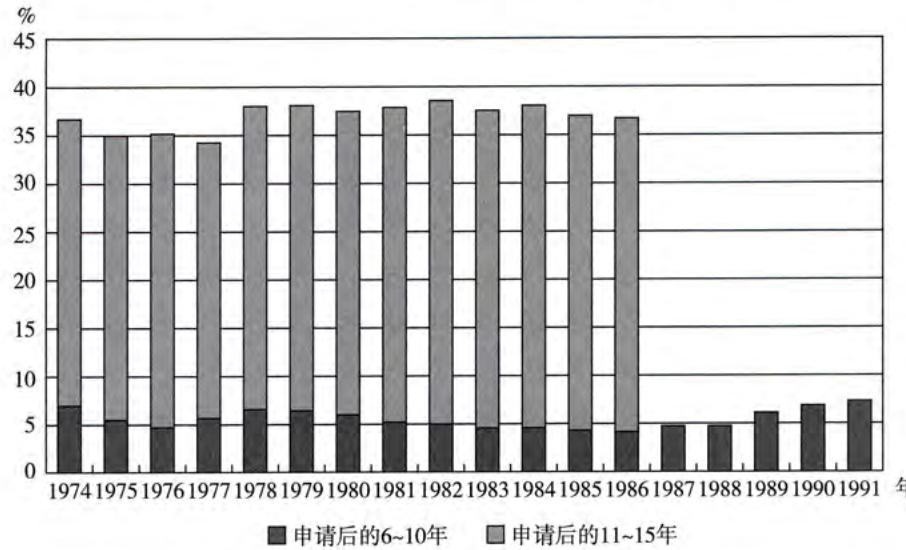  
图8-3申请后不同时期的专利弃权比例  
（资料来源：笔者根据IIP专利数据库估算）

# 2.3 研发投资的质变

到目前为止，本文讨论了有关研发资产积累的宏观层面的趋势，而研发投资在不同行业和技术领域的差异很大，应当对研发活动进行分类，并考虑资本积累过程中的异质性。如前所述，产品生命周期的缩短会导致研发成本的上升。关于资本存量的价格，有一种观点叫资本租赁服务价格，由以下公式计算（Jorgenson，1963）：

$$
p _ { k } = \frac { 1 } { 1 - \tau } ( r + \delta )
$$

其中， $\tau$ 为实际企业所得税率， $r$ 为利率，δ为折旧率（技术老化率），δ的上升会导致租赁服务价格的上升。企业为了实现与价格上涨相匹配的研发回报，可以采取行动向盈利能力更强的项目集中投入研发资源。此外，日本企业的技术平想赶上欧美企业的水平，需要从追赶模式向领跑式研发过渡。与此同时，研发活动的不确定性越来越，比起有望获得长期回报的基础研究，企业更重视追求短期利益的开发研究。《科学技术研究调查》(总务省)按研发目的（基础研究、应用研究、开发研究）对研发费用进了调查。图8-4显示了企业研究经费中开发研究经费占比的变化情况，其比例稳步上升。

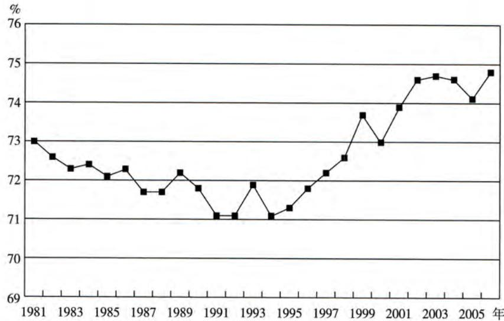  
图8-4 开发研究经费在研究经费中所占的比例（企业等）  
（资料来源：总务省《科学技术研究调查》）

本企业研发环境的这种变化在各种问卷调查的结果中也有所体现。根据2004年2实施的《RIETI研发外部合作统计调查》 （经济产业研究所），企业负责在研发中重视的项多为“以市场需求为导向进研发”和“缩短开发周期”（如图8-5)。从IT领域可以看到，技术创新速度不断加快，东亚各国奋起直追，国际创新竞争趋激烈。在这种情况下，企业的研发部门更需要快速推出准确把握消费者需求的商品。其原因可以解释为，在这种情况下，要求从研发投资中获得短期回报的呼声越来越强。

  
图8-5企业在研发过程中重视的项目（多选）

（资料来源：《2003年度日本创新体系相关的研发外部合作统计调查报告书》，经济产业研究所）

# 2.4 研发中的外部合作日趋活跃

在市场竞争加剧的同时，实现创新的技术也更加复杂。为了在提高研发质量的同时，应对激烈的竞争，越来越多的企业在研发时选择与其他企业或大学开展合作。另外，为了开发出划时代的商品，还需要开展基础性研究，涉足以前未曾参与的新领域。为此，与大学和公共研究机构开展合作也显得格外重要。企业的研发资产不仅仅局限于内部研发，还可以通过从外部引进技术来完善。因此，了解研发的外部合作趋势也很重要。

《科学技术研究调查》（总务省）对研发的外部支出进行了调查，图8-6显示了面向不同支出对象的外部支出金额占内部研发费用比例的变化。从2005年的时点来看，对其他企业（国内）的外部支出比例最高，为$12 . 1 \%$ ，对海外的支出比例为 $2 . 3 \%$ ，对大学和公共研究机构的支出比例为0.6%。不过，在对国内其他企业和海外的支出方面，对国内和海外的子公司的支出比例较大。光靠这张图很难看出纯粹的外部合作动向，但是这些合作比例的趋势有上升的倾向。另一方面，关于大学和公共研究机构等的所谓产学合作的比例，金额较小，没有特别明显的上升趋势。

  
图8-6 研发相关的外部支出占内部支出的比例  
（资料来源：总务省《科学技术研究调查》）

图8-6通过内部研究经费和外部出额的总和求出了例，因此研发费较的企业，其发展趋势的影响较。2004年经济产业研究所实施的《研发外部合作统计调查》考察了研发的外部合作的详细情况，本也对外部合作的趋势以及外部合作的的、阻碍因素等定性项进了调查。这项调查的对象是2001年全年提交了3件以上专利申请的企业，调查结果显示，在回答的企业中，有七成以上均以某种形式实施了研发的外部合作。合作伙伴包括大企业、中小企业及初创企业、大学等，与五年前相比，所有对象的合作例均有所上升。从各合作伙伴来看，选择“今后将增加”的企业例，大企业为33.8%，中小企业及初创企业为36.9%，大学为44.9%（其他选项几乎都是“与现状持平”，选择“将减少”的企业比例只有几个百分点），显出包括产学合作在内的研发的外部合作呈现趋势性增加。

关于推进外部合作的理由，图8-7按合作伙伴类型进了总结。很多企业表，开展企业间合作是为了“应对益激烈的研发竞争”或“提研发成本的效率”，与学和国家试验研究机构开展合作（产学合作）是为了“提的基础研究平”或“需要合作伙伴的基础研究成果”。在研发竞争日趋激烈的情况下，既要提高研发的效率，又要提高研发的质量（例如“自身的基础研究水平”），这表明企业在根据研发内容区别利用外部合作。

在不断推进研发相关的外部合作时，为了有效地将其成果纳公司内部的创新过程中，应当定位自主研究和共同研究的关系。图8-8总结了自主研究和共同研究（按合作伙伴类型）的研究主题的内容。首先，自主研究包括“接近商品化”和“开发自主核心技术”。另一方面，在与中小企业及初创企业的合作中，“自身欠缺的新领域的研发”得票率增加；而与大学和国家试验研究机构的产学合作则包括寻求“最新技术”的“基础性研发”。

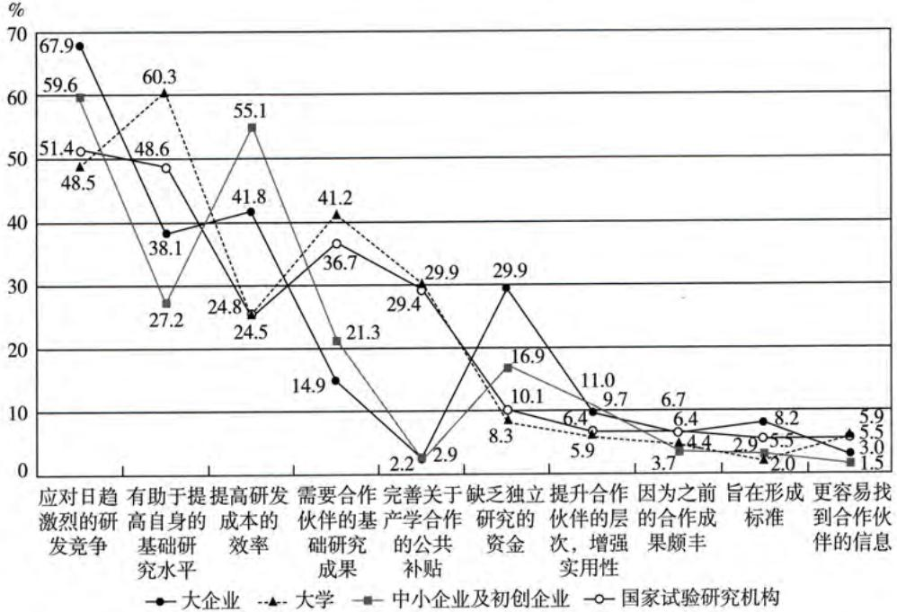  
图8-7 增加合作的理由(M.A.)

（资料来源：经济产业研究所《RIETI研发外部合作统计调查》）

如上所述，企业的内部研究聚焦于核心技术和接近商品化的成果，在创新的广度（新的研究主题）和深度（基础性研究）方面，正在对依赖于外部资源的研发进行“选择和集中”。业务组合的“选择和集中”是要舍弃利润率较低的业务领域，而这里的“选择和集中”则不同，反而是要扩大研发范围，但需要注意的是，这意味着将这一方面的内部资源集中到核心技术上。

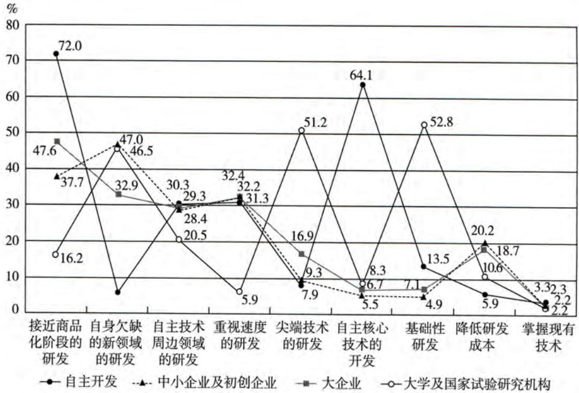  
图8-8 研发的合作伙伴和研究主题(M.A.)  
（资料来源：经济产业研究所《RIETI研发外部合作统计调查》）

# 3 研发投资的决定因素分析

# 3.1 理论模型

如上所述，本企业的研发趋势在1990年上半年泡沫破灭前后发了很变化。在泡沫破灭之前，企业推进研发活动，顺利积累了量研发资产。但随着泡沫的破灭，日本经济进入低增长时代，研发投资的增速也随之下降。技术化的速度逐渐加快，研发资产的积累速度不断下降。研发投资和研发资产积累速度的减慢除了受到宏观经济环境的影响外，还受到有关创新的国际竞争加剧等各种因素的影响。本将定量分析研发投资的决定因素，探讨研发投资随着泡沫破灭而放缓的主要原因。

在进行研发投资分析时，可以借用关于设备投资分析的投资函数的思路(Hall，1992)。在此，假设企业为了使下列利润函数最化决定开展设备投资。

$$
f ( R D _ { t } ) = \sum _ { t = 0 } ^ { \infty } \frac { ( 1 - \tau ) Y _ { t } ( K _ { t } ) - \theta _ { t } R D _ { t } - \varPhi ( R D _ { t } , \ K _ { t } ) } { ( 1 + r ) ^ { - t } }
$$

这里的 $R D$ 表示研发费用， $Y$ 表示企业产出， $\tau$ 表示实际税率， $\theta$ 表示研发费用相关的税收调整价格（不存在研发相关税制特别规定的情况下为1-$\tau$ ), $K$ 表示研发存量， $\varPhi$ 表示研发相关的调整成本， $r$ 表示折现率。

此外， $R D$ 和 $K$ 由第二节公式（8.1）的变量名改变后的下列公式动态决定：

$$
K _ { \iota } = \left( 1 - \delta \right) K _ { \iota - 1 } + R D _ { \iota }
$$

这里的 $\delta$ 表示研发存量的损耗率（技术老化的速度）。

上述 $f$ $. R D$ ）取最大值的 $R D$ 可以作为动态最优化问题来解，但需要确定生产函数 $Y$ 和设备投资调整函数 $\varPhi$ 的形状。假设这里的 $Y$ 表示柯布—道格拉斯生产函数， $\varPhi$ 表示包含 $R D$ 的平方项的通常情况。换言之，

$\boldsymbol { Y } _ { t } = \boldsymbol { A } \cdot \boldsymbol { K } ^ { \alpha } \cdot \boldsymbol { F }$ （这里的 $F$ 表示资本、劳动等其他生产要素）

$$
\Phi ( R D _ { t } , \ K _ { t } ) = \frac { 1 } { 2 \phi } \cdot \frac { K D _ { t } } { K _ { t } }
$$

可以利用欧拉差分方程，按照下列方式求解上述模型：

$$
\frac { R D _ { t + 1 } } { K _ { t + 1 } } = \frac { 1 + r } { 1 + \delta } \Bigg [ \frac { R D _ { t } } { K _ { t } } - \frac { 1 } { 2 } \Bigg ( \frac { R D _ { t } } { K _ { t } } \Bigg ) ^ { 2 } + \phi \Bigg ( \frac { \theta _ { t } } { 1 - \tau _ { t } } - \alpha \frac { Y _ { t } } { K _ { t } } \Bigg ) \Bigg ] - \phi \frac { \theta _ { t + 1 } } { 1 - \tau _ { t + 1 } }
$$

需要注意的是，除企业所得税外， $\theta$ 还会受到研发相关的税额抵扣制度的影响。通常每个国家都会对研发活动提供税收优惠制度。日本曾设立了增加试验研究费（对于历史最高金额等与基准年相比的增量，允许一定比例的税额抵扣），但从2003年度开始，允许对每年的全部研发费用进行一定的税额抵扣①。 $\theta$ 考虑了该研发税制的影响，可以形成下列公式：

$$
\theta _ { t } = P _ { \iota } ^ { R D } \big [ 1 - T _ { \iota } ( \tau - E T C _ { \iota } ) \big ]
$$

另外，这里的 $P ^ { R D }$ 表示关于研发费用产出的相对价格（研发费用平减指数/GDP平减指数）， $T$ 表示企业是否缴纳企业所得税的虚拟变量，ETC表示有效研发税额抵扣率，根据过去 $K$ 年平均值的基准值进增加试验研究费税额抵扣时的ETC如下所示：

$$
E T C _ { i , \ i } = T C _ { t } ^ { c } { \Bigg [ } B _ { { \ t } } - { \frac { 1 } { k } } { \sum _ { i = 1 } ^ { k } { \left( 1 + r \right) ^ { - i } } } B _ { { t } + i } { \Bigg ] }
$$

TC表示税收的边际抵扣率， $B$ 则是表示各年份研发费用是否高于比较值的虚拟变量。按照允许从比较年开始增加的部分进行税额抵扣的方法，今年研发费用的增加将导致下一年度以后的基准值提高。如果只在今年增加研发费用，当明年以后低于基准值（ $\boldsymbol { B } _ { { t + 1 } } - \boldsymbol { B } _ { { t + k } }$ 为0时）时， $E T C = T C$ ，但是在其他情况下，由于今年提前享受未来应享受的税额抵扣部分，因此只会产生其利息部分的效果。在1999年度修订之前，由于比较值是历史最额，因此可以认为研发相关的激励措施停留在很小的范围内。如果企业在未来继续增加研发费用，那么本年度增加的部分必然是下一年度税额抵扣的减少部分，具体如下所示：

$$
E T C _ { i , \textit { t } } = T C _ { t } ^ { c } \bigg ( 1 - \frac { 1 } { 1 + r } \bigg ) = T C _ { t } ^ { c } \frac { r } { 1 + r }
$$

另外，由于从2003年度开始允许对研发费总额进税额抵扣，因此原则上可以认为 $E T C = T C ^ { \textcircled { 1 } }$ 。然而，与研发有关的税额抵扣以企业所得税付额的一定例（前为 $30 \%$ ）为上限，因此也需要考虑这一影响。换之，上述ETC在达到税额抵扣上限之前是适当的，超过上限的部分需要按照 $E T C = 0$ 的条件进行计算。

# 3.2 数据集和估算模型

下将《科学技术研究调查》（总务省）相关的企业板数据（19832005年）与本经济研究所的公开财务数据相链接，于分析。关于《科学技术研究调查》，制作了关于每年进调查的调查表“甲”的对象企业（企业等A：资本金在1亿日元以上的企业）的面板数据，为了使用与企业效益和财务状况相关的数据，链接了公开财务数据②。

财务报表数据所连接的项目如下：

●企业所得税额：1999 年以前是“企业所得税等”，2000年以后是“企业所得税、居民税和营业税”。

企业所得税等：企业所得税等准备、纳税准备金、企业所得税、居民税等准备金、长期纳税准备金（提取额）

企业所得税、居民税和营业税：企业所得税等准备金、纳税准备、企业所得税、居民税等准备金（提取额）、营业税

●增加值总额（营业利润 $+$ 费 $^ +$ 折旧费)

●资限制：现金流量●融资难易度：债务股本比

数据的样本数量方面，关于《科学技术研究调查》的面板数据，非平衡面板样本为1315-3650，如果再链接上市公司的财务报表，样本数量将减少到552-1179（详情参阅附表B）。但是，这些样本的研发费用总额覆盖了调查对象企业的总额的 $65 \%$ 以上，这一数据有助于把握宏观层面的研发费用趋势。

按下列方式改写理论上导出的公式（8.9）后，得到实证模型的基本模型。

$$
r d _ { t } = \beta _ { 1 } \cdot r d _ { t - 1 } + \beta _ { 2 } \cdot r d _ { t - 1 } ^ { 2 } + \beta _ { 3 } \cdot y _ { t - 1 } + \beta _ { 4 } \cdot t a x _ { t } + \beta _ { s } \cdot t a x _ { t - 1 }
$$

这里的 $^ { r d }$ 表示 $R D / K$ , $y$ 表示Y/K，tax是纳税影响，为 $\theta / \left( 1 - \tau \right)$ 。

为了估算公式（8.10），需要估算研发存量（研发资产） $K _ { \circ }$ 研发存量需要存量的初始值（1983年）和每年的实际研发投资额、研发资产的摊销率（老化速度）。首先，实际研发投资额通过GDP平减指数计算出各年名义投资额的实际值。另外，求出了1983年之前的实际研发投资额增长率以及1983年到1987年这5年间的值，并假设1983年的研发存量初始值是以从1983年到该值的年均增长率（中心年1985年之前的2年间）增长的①。最后，研发存量的摊销率定为15%。该值是Hall和Mairesse（1995）等中同样使用过的标准值。此外，当摊销率为15%时，采用余额递减法，使残值为10%，则使用年限约为14年。虽然产品的生命周期稍长，但如前所述，在专利数据的持有时间方面，在15年内弃权的比例为36%，持有15年以上的则超过了半数。作为专利持有的技术在研发费用活动中具有举足轻重的作用且长期被持有，但在没有数据显示平均技术使用年限的情况下，15%（约14年）的摊销率这一数字处于产品生命周期和专利持有期限之间。上一节提到了技术化的速度很可能正在加快，但在此假设整个期间的摊销率是固定的。

图8-9显示了研发存量、实际研发投资额、有形资本存量（这里的实际固定资产投资额在各企业固定资产账面价值的基础上，根据JIP数据的各行业市值与账面价值的比率进了调整）的增长率变化情况。

20世纪90年代前半期泡沫破灭后，由于研发投资增长率大幅下滑，研发存量的增长率也在下降。研发存量的年均增长率在19841991年和1991—2005年分别为10.5%和4.5%，增长率跌至一半以下。此外，有形资本存量增长率分别为10.9%和4.5%，和上面的数值基本相同，但如图8-9所示，其波动大于研发资本存量。这是因为研发投资的三成以上是人工费用，因此与设备投资相比波动较。

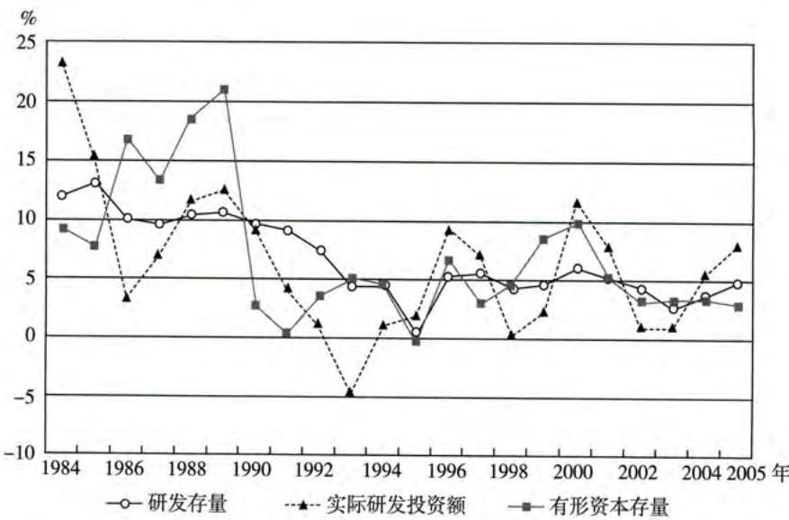  
图8-9 研发存量等的增长率变化情况

（资料来源：笔者估算)

如公式（8.11）所示，与研发相关的投资和存量比率的变化情况受到税制的影响。特别是在研发投资方面，由于采取了比较宽松的税制措施，因此需要同时考虑企业所得税的变化和研发税制的影响。公式（8.10）中的tax可以认为是研发税制的相对完善程度。另外，如果没有研发的税收优惠，由于 $E T C = 0$ ，因此 $\theta { = } 1 { - } \tau$ , $t a x = P ^ { R D }$

下将首先考察研发投资的有效税额抵扣率ETC的变化。如前所述，如果增加试验研究费制度是基于比较值的，由于目前的研发增额会产生棘轮效应，即减少将来应享受的税额抵扣，因此从长期来看，研发激励措施比较薄弱。从2003年度开始转换为针对研发总额的税额抵扣制度，受此影响，ETC大幅上升。

观察ETC的变化需要r（利率）。这里的r使用企业的融资成本（WACC：Weighted Average Cost of Capital）是合适的，所以先算出了每个企业的WACC。如下所示，WACC由资本成本（ $r _ { e }$ ）和债务成本( $r _ { d }$ ）的加权平均计算得出。

$$
r = \frac { D } { D + E } r _ { d } + \frac { E } { D + E } r _ { \cdot }
$$

(D表示债务总额，E表示股票市值)

资本成本一般使用CAPM（Capital Asset Pricing Model），债务成本一般使用有息负债利率。先是资本成本，根据CAPM，由以下公式计算得出：

$$
\boldsymbol { r } _ { e } = \boldsymbol { r } _ { f } + \beta ( \boldsymbol { r } _ { m } - \boldsymbol { r } _ { f } )
$$

这里的无风险利率（ $r _ { f }$ ）使用长期国债（10年期）收益率， $r _ { m }$ 使用TOPIX的3年平均收益率。但存在一个问题：泡沫破灭后，TOPIX的3年收益率有一段时间为负。此外，TOPIX的收益率在多个年份都为负值。虽然市场利率（ $\boldsymbol { r } _ { m }$ ）不可能低于无风险的 $r _ { f }$ ，但由于泡沫的形成和破灭等因素，事后可能会出现市场利率为负的情况。在 $\boldsymbol { r } _ { m }$ 低于 $r _ { f }$ 的年份，本文使用 $r _ { f }$ 的值作为 $r _ { e }$ 。原本需要收集每个企业的 $\beta$ 的信息，并将其代入公式（8.13），但此处简化为 $\beta = 1$ 。因此，在 $\boldsymbol { r } _ { m }$ 高于 $r _ { f }$ 的年份， $r _ { e } = r _ { m }$ 。

债务成本采用财务报表数据，按照（利息支出及贴现费用 $^ +$ 应付债券利息 $^ +$ 商业票据利息）／（负债合计-应付账款-应付票据-应付款项）计算。根据由此求得的各企业利率，利用公式（8.10）得出了有效税额抵扣率（ETC：EffectiveTaxCreditRate)。我们还用ETC来估算Tax，两者的平均势如图8-10所示。

  
图8-10实际研发税额抵扣率和研发税制带来的纳税成本降幅

（资料来源：笔者估算）

首先是ETC（有效研发税额抵扣率），20世纪80年代后半期，由于利率（WACC）较高，在增加试验研究费的税额抵扣制度中，税额抵扣率也达到了$2 \%$ 以上。但随着利率的下降，ETC在1998年降至 $0 . 3 7 \%$ 。1999年略有上升，这是由于基准年的思路有所调整，但不得不说这种变化是边际性的。给ETC带来重大变化的是2003年度的修订，这次修订允许对整体研发投资进行税额抵扣，ETC飙升到10%以上。这种研发税制带来的纳税成本下降率（Taxfactor）自然与ETC势相反，在2003年大幅下降。

# 3.3 实证分析的结果

公式（8.12）是以从研发相关的投资模型中理论推导出的公式（8.9）为基础的，但要估算出这个模型，还需要做一些调整。首先，公式（8.9）涉及企业的投资为，是从供给侧推导出来的，没有引关于新商品和成本削减等研发需求的因素。另外，在实际模型的估算过程中，作为需求侧的因素，宏观层面的经济波动带来的影响也不容忽视。因此，对于研发需求，应当加产业虚拟变量进估算；对于宏观层面的经济波动，应当加年份虚拟变量进行估算。

# 分析研发费用的决定因素时，控制企业受到的资金限制

是很重要的。由于研发费用属于长期投资，往往由企业的留存收益进付。通过筹集外部资进研发时，成本因筹集资的式（例如贷款或者股权融资）而有所不同（Hall，1992)。Ogawa（2007）分析了泡沫破灭前和破灭后研发费的决定因素，并指出现流量在附加值中所占的比率和资本负债率的影响较。因此，除了公式（8.12）的基本模型外，本还估算了另一个模型，并在该模型中加了现流量比率（cashr）和负债在总资产中的比率(debtratio)。

分析结果如表8-1所。模型（1）根据OLS估算了基本模型即公式(8.12)，模型（2）和模型（3）根据面板数据的固定效应模型，加上基本模型和资限制相关变量后进了估算。此外，关于面板数据估算的Hausman检验结果显示，在 $1 \%$ 平上，变动效应模型不被持，而固定效应模型受到持。由于企业控制了产业虚拟变量法覆盖的细微需求因素和研发相关的质量差异等，因此基于固定效应模型的估算结果有望比OLS更理想。不过，从OLS和固定效应模型的结果来看，得到的结果基本相同。先，rd和rd的平方项分别得到了具有统计学显著性的正系数和负系数，与公式（8.9)的理论模型的符号一致。税制效果与理论模型一致，本期为正，前1期为负。由于研发税制的完善，taxfactor一旦降低，企业就会进更多的研发。此外，即使在taxfactor不变的情况下，本期和上期的系数之和也为负值，可见研发费存量率因taxfactor的平而受到影响。

表8-1研发费用及存量比例的决定因素的分析结果  

<table><tr><td rowspan=2 colspan=1></td><td rowspan=2 colspan=1>(1)OLS</td><td rowspan=2 colspan=1>(2)FE</td><td rowspan=1 colspan=1>13)</td><td rowspan=2 colspan=1>(4）SYS-GMM</td><td rowspan=2 colspan=1>(5)SYS-GMM</td></tr><tr><td rowspan=1 colspan=1>FE</td></tr><tr><td rowspan=2 colspan=1>rd-1</td><td rowspan=2 colspan=1>0.757(79.54)**</td><td rowspan=2 colspan=1>0.545(46.44)**</td><td rowspan=1 colspan=1>0.540</td><td rowspan=2 colspan=1>0.909(28.89)**</td><td rowspan=2 colspan=1>0.877(30.56)**</td></tr><tr><td rowspan=1 colspan=1>(46.17)**</td></tr><tr><td rowspan=2 colspan=1>$rd{1}$</td><td rowspan=2 colspan=1>-0.283(28.49)**</td><td rowspan=2 colspan=1>-0.143(12.68)**</td><td rowspan=1 colspan=1>-0.138</td><td rowspan=2 colspan=1>-0.423(9.04)**</td><td rowspan=2 colspan=1>-0.377(9.31)**</td></tr><tr><td rowspan=1 colspan=1>(12.28)**</td></tr><tr><td rowspan=2 colspan=1>y1-1</td><td rowspan=2 colspan=1>0.0001(10.49)**</td><td rowspan=2 colspan=1>0.0003(13.72)**</td><td rowspan=1 colspan=1>0.0003</td><td rowspan=2 colspan=1>0.0001(1.73)</td><td rowspan=2 colspan=1>0.0001(1.78)</td></tr><tr><td rowspan=1 colspan=1>(13.39)**</td></tr><tr><td rowspan=2 colspan=1>taxfactor,</td><td rowspan=2 colspan=1>-0.971(35.78)**</td><td rowspan=2 colspan=1>-0.848(32.71)**</td><td rowspan=1 colspan=1>-0.990</td><td rowspan=2 colspan=1>-0.693(3.17)**</td><td rowspan=2 colspan=1>-0.515(3.14)**</td></tr><tr><td rowspan=1 colspan=1>(35.62)**</td></tr><tr><td rowspan=1 colspan=1>taxfactor-1</td><td rowspan=1 colspan=1>0.382(13.71)**</td><td rowspan=1 colspan=1>0.295(10.44)**</td><td rowspan=1 colspan=1>0.361(12.46)**</td><td rowspan=1 colspan=1>0.373(2.63)**</td><td rowspan=1 colspan=1>0.277(2.55)*</td></tr><tr><td rowspan=1 colspan=1>debtratio</td><td rowspan=1 colspan=1></td><td rowspan=1 colspan=1></td><td rowspan=1 colspan=1>-0.032(6.33)**</td><td rowspan=1 colspan=1></td><td rowspan=1 colspan=1>-0.032(3.71)**</td></tr><tr><td rowspan=1 colspan=1>Cashr</td><td rowspan=1 colspan=1></td><td rowspan=1 colspan=1></td><td rowspan=1 colspan=1>-0.019(3.72)**</td><td rowspan=1 colspan=1></td><td rowspan=1 colspan=1>0.012(0.71)</td></tr><tr><td rowspan=1 colspan=1>常数项</td><td rowspan=1 colspan=1>0.915(36.12)**</td><td rowspan=1 colspan=1>0.869(35.47)**</td><td rowspan=1 colspan=1>1.005(38.49)**</td><td rowspan=1 colspan=1>0.484(3.23)**</td><td rowspan=1 colspan=1>0.387(3.38)**</td></tr><tr><td rowspan=1 colspan=1>样本数量</td><td rowspan=1 colspan=1>14957</td><td rowspan=1 colspan=1>14981</td><td rowspan=1 colspan=1>14904</td><td rowspan=1 colspan=1>14957</td><td rowspan=1 colspan=1>14915</td></tr><tr><td rowspan=1 colspan=1>组数</td><td rowspan=1 colspan=1>-</td><td rowspan=1 colspan=1>1244</td><td rowspan=1 colspan=1>1223</td><td rowspan=1 colspan=1>1244</td><td rowspan=1 colspan=1>1223</td></tr><tr><td rowspan=1 colspan=1>产业虚拟变量</td><td rowspan=1 colspan=1>yes</td><td rowspan=1 colspan=1>/</td><td rowspan=1 colspan=1></td><td rowspan=1 colspan=1>yes</td><td rowspan=1 colspan=1>yes</td></tr><tr><td rowspan=1 colspan=1>年份虚拟变量</td><td rowspan=1 colspan=1>yes</td><td rowspan=1 colspan=1>yes</td><td rowspan=1 colspan=1>yes</td><td rowspan=1 colspan=1>yes</td><td rowspan=1 colspan=1>yes</td></tr><tr><td rowspan=1 colspan=1>R-squared</td><td rowspan=1 colspan=1>0.68</td><td rowspan=1 colspan=1>0.58</td><td rowspan=1 colspan=1>0.58</td><td rowspan=1 colspan=1>-</td><td rowspan=1 colspan=1>-</td></tr><tr><td rowspan=1 colspan=1>Hansen-J</td><td rowspan=1 colspan=1>一</td><td rowspan=1 colspan=1>-</td><td rowspan=1 colspan=1>-</td><td rowspan=1 colspan=1>0.108</td><td rowspan=1 colspan=1>0.026</td></tr></table>

资料来源：笔者估算。注： $^ *$ 代表 $5 \%$ 显著， $^ { * * }$ 代表 $1 \%$ 显著。

另一方面， $y$ 是具有统计学显著性的正系数，与理论模型的结果相反。 $y$ （附加值在研发存量中所占的比率）在柯布道格拉斯产函数中表示研发存量的边际生产率。理论上讲，前1期的边际生产率高，研发就会变得活跃，对于本期研发投资存量的比率会产生负面影响。但是，这里看到了正面的影响，表示估算模型存在一些问题。关于模型（3），负债率为负，且具有统计学显著性，这一点符合预期；而现金流量比率方面，本应为正的系数为负，且具有统计学显著性。这一点可能也受到了一些影响。

面板数据固定效应模型的问题在于，解释变量都作为外生变量来处理。但是，被解释变量rd的前1期的值rd（-1）被用作解释变量，而rd(-1)是前1期的被解释变量，与误差项 $\varepsilon$ （-1）具有相关性。另一方面，如图8-9所示，研发存量作为被解释变量rd的分母，在时间序列上稳定变化，并且误差项也具有时差相关性，因此cov(rd $( - 1 ) , \varepsilon ) = 0$ 的rd(-1）的外生性很可能没有被满足。此外，某个时间节点的需求变动推高 $y$ (-1)，可以假设它通过rd（-1）与 $\varepsilon$ 形成正相关关系。

为了处理解释变量的上述内性问题，本还根据以内变量的2期滞后为操作变量的系统GMM（GeneralizedMethodof Moment）进了估算。表8-1的模型（4）是基本模型，模型（5）是增加了资需求有关项目的扩展模型的估算结果。此外，系统GMM扩充了Arellano和Bond（1991）的GMM模型，对于AR模型的差分程，除了将解释变量的滞后作为操作变量使外，对于平相关的公式，将取滞后的差分作为操作变量使，通过GMM进估算（Blundell和Bond，1998）。像研发投资存量率这样解释变量波动较的变量，如果取其差分，则会丢失有益的信息，但可以在保留与平相关的程的同时进估算，这一点可以说比原始AR模型更加优越。

此外，通过系统GMM的估算，y不具有统计学显著性。虽然现流量率不具有统计学显著性，但是符号为正，得到了与理论模型不同的系数。如上所述，模型还有改进的空间，这一点值得注意。

那么，泡沫破灭导致研发投资和研发存量下降的原因是什么呢？从表8-1中可以得到两点具有稳健性的结果：（1）对税制效果的影响；（2）对负债率的影响。关于前者，由于利率（WACC）的下降，以往的增加试验研究费税额抵扣制度的激励效果有所下降，但是2003年度的税制改允许对整体研发投资进税额抵扣。这效果也值得期待。此外，根据模型（5)，长期税制效果系数为-0.5（ $- 0 . 8 7 7 + 0 . 3 7 7 )$ 。从2002年到2003年，taxfactor下降了 $6 \%$ ，因此将提高 $6 \% \times 0 . 5 = 3 \%$ 的研发投资存量率。截2002年的研发存量额约为5.5万亿元，可以说将研发费用提了约1700亿元，共占 $3 \%$ 。

但另一方面，由于企业资金上的限制，研发费用直受到压缩。由于泡沫的破灭，企业的财务状况恶化，研发费用被削减，研发存量的增长率也在下降。由此可见，宏观经济环境的这种变化是研发费和研发存量下降的主要原因。

# 4研发资产对企业效益的影响

# 4.1 理论框架

上一节提到泡沫破灭后研发投资和研发存量增长率下降是因为企业财务状况恶化。另一方面，2003年度研发税制得到完善，今后研发投资有望得到增长。此外，日本企业的研发环境发生了很大变化，在泡沫破灭前后，研发活动本身的内容也发生了变化。如第二节所述，随着与创新相关的全球竞争的加剧以及从追赶型向领跑型模式的过渡，与研发相关的不确定性有所增强，由此一来，企业的研发开始以商品开发为中心，基础性研究出现了产学合作等外部合作的趋势。如上所述，除泡沫破灭引起的宏观经济环境变化外，全球化和创新竞争加剧等结构性因素也对20世纪90年代以来本企业的研发活动产了很大影响。

泡沫破灭以后，企业的研发投资增长率下降，研发资产的积累速度变慢，而研发资产的效率本身可能也下降了。其原因在于日本企业的问题意识，即尽管与欧美企业相比，日本企业的研发热情较高，但这并没有带动企业盈利能力提高，也没有在宏观层面上促进经济增长。例如，神原（2003）指出日本企业的商品开发能力正在下降。另外，Branstetter和Nakamura（2003）指出，从专利的角度来看，研发存量的积累没有与生产率等产出指标联系起来，研发的生产率正在下降。另一方面，Ogawa（2007）在泡沫前后对研发与TFP增长率的关系进行了分析，并指出泡沫破灭后两者的关系得到了进一步加强。

下文将使用上一节提到的企业层面的数据进行估算，从而分析泡沫破灭后研发生产率的变化。使用明确引入了以下研发存量的柯布一道格拉斯生产函数作为分析框架。

$$
\mathrm { l v a } _ { i t } = \alpha + \beta _ { l } \mathrm { l e m p } _ { i t } + \beta _ { k } \mathrm { l c a p } _ { i t } + \beta _ { r d } \mathrm { l r d } _ { i t } + \varepsilon _ { i t }
$$

这里的lva表示增加值总额，lemp表示劳动力投入，lcap表示有形资本投入，lrd表示研发存量，并分别取对数。 $\beta$ 表示各个投入要素的产出弹性值，本文不做规模收益不变的假设（ $\beta$ 的合计为1)。

在柯布一道格拉斯生产函数中，研发存量的边际生产率可以用估算出的$\beta$ 计算，具体如下：

$$
\frac { \partial V A } { \partial R D } = \beta _ { \scriptscriptstyle R D } \cdot \frac { V A } { R D }
$$

本节将分析该值在泡沫破灭前后是如何变化的。

另外，关于本研发存量的边际生产率，虽然Odagiri和Iwata（1986）以及Goto和Suzuki（1989）等已经做过研究，但使的都是20世纪80年代之前的数据。另外，Kwon和Inui（2003）使用了20世纪90年代以后的数据。在比较泡沫破灭前后状况的论文中，有的使用了产业层面的数据（如绢川，2000），但没有任何篇章使用了企业层面的数据。Ogawa（2007）使企业数据对泡沫前后的状况进了分析，考察的是研发投资对TFP的影响，而不是研发存量的生产率。

# 4.2实证模型和估算结果

用于估算公式（8.13）的数据使用了上一节的《科学技术研究调查》（总务省）和上市企业财务数据相关的面板数据。但是，在企业会计方面，研发费作为损失处理，因此需要对于估算的变量进调整。先是产出的增加值总额，用的是传统的现金工资总额 $^ +$ 折旧费 $^ +$ 租赁费用再加上研发费用。此外，通过基于JIP数据的各产业产出和采投型平减指数的双重缩减，计算通常的增加值总额的实际值；对于研发费用，则加入了通过GDP平减指数计算出来的实际值。另外，关于劳动力投，由于研发存量的计算中包含了人工费用，为了防止投入的重复计算，使用了研发人员以外的员工人数。有形资本存量利JIP数据库中各产业的市值和账价值的比率，将企业的有形固定资产余额（账面价值）转换为市值①；研发存量则沿用上一节的内容。

在估算公式(8.14）时，除了加年份虚拟变量、产业虚拟变量的OLS之外，还采用了固定效应模型、系统GMM，共计3种法。解释变量Iva在每家企业中都表现出persistent的动向，因此也估算出了将1期滞后作为解释变量的情况。结果如表8-2所示。OLS没有控制经营者和员的质量、组织资本和专有技术等各企业的因素，当这些因素与研发呈正相关关系时（企业的经营能力越强，研发就越活跃），研发的系数就会出现正向偏差。固定效应模型作为控制整个期间内不变的企业因素的模型，比OLS更加优越，但如果包含解释变量的误差，则会对系数产负偏差（Woodridge，2000）。较模型（2）和模型（4）的lrd相关系数后发现，两者分别为0.028和0.016，后者较，真实值很可能在这两者之间。系统GMM同时使用种固定效应模型（差分模型）以及与公式（8.14）平相关的公式，为了解决解释变量的内生性问题，加入操作变量后进行GMM估算，因此有望得到偏差最小的结果。在模型（5）中，lrd的计数为0.025，具有统计学显著性，并且处于模型（2）和模型（4）的估算结果之间。

表8-2生产函数的估算结果  

<table><tr><td rowspan=1 colspan=1></td><td rowspan=1 colspan=1>（1)OLS</td><td rowspan=1 colspan=1>（2)FE</td><td rowspan=1 colspan=1>13)FE</td><td rowspan=1 colspan=1>（4）SYS-GMM</td><td rowspan=1 colspan=1>(5）SYS-GMM</td></tr><tr><td rowspan=1 colspan=1>lva(-1)</td><td rowspan=1 colspan=1></td><td rowspan=1 colspan=1>0.812(219.80)**</td><td rowspan=1 colspan=1></td><td rowspan=1 colspan=1>0.658（132.19)**</td><td rowspan=1 colspan=1>0.803(50.42)**</td></tr><tr><td rowspan=2 colspan=1>lemp</td><td rowspan=2 colspan=1>0.662(86.76)**</td><td rowspan=2 colspan=1>0.132(28.89)**</td><td rowspan=1 colspan=1>0.39</td><td rowspan=1 colspan=1>0.171</td><td rowspan=2 colspan=1>0.143(10.51)</td></tr><tr><td rowspan=1 colspan=1>(26.91)**</td><td rowspan=1 colspan=1>(17.73)**</td></tr><tr><td rowspan=2 colspan=1>leap</td><td rowspan=2 colspan=1>0.25(39.46)**</td><td rowspan=2 colspan=1>0.046(13.61)**</td><td rowspan=1 colspan=1>0.29</td><td rowspan=2 colspan=1>0.068(6.87)**</td><td rowspan=2 colspan=1>0.047(5.43)**</td></tr><tr><td rowspan=1 colspan=1>（20.18）**</td></tr><tr><td rowspan=2 colspan=1>lrd</td><td rowspan=2 colspan=1>0.149(33.50)**</td><td rowspan=2 colspan=1>0.028(10.99)**</td><td rowspan=1 colspan=1>0.108</td><td rowspan=2 colspan=1>0.016(2.18)*</td><td rowspan=2 colspan=1>0.025(5.70)**</td></tr><tr><td rowspan=1 colspan=1>(12.07)**</td></tr><tr><td rowspan=2 colspan=1>常数项</td><td rowspan=2 colspan=1>5.227(71.61)**</td><td rowspan=2 colspan=1>0.673(9.30)**</td><td rowspan=1 colspan=1>7.331</td><td rowspan=1 colspan=1>2.916</td><td rowspan=2 colspan=1>1.259(10.43)**</td></tr><tr><td rowspan=1 colspan=1>（28.48）**</td><td rowspan=1 colspan=1>(16.51)**</td></tr><tr><td rowspan=1 colspan=1>样本数量</td><td rowspan=1 colspan=1>19988</td><td rowspan=1 colspan=1>17951</td><td rowspan=1 colspan=1>19988</td><td rowspan=1 colspan=1>17951</td><td rowspan=1 colspan=1>17951</td></tr><tr><td rowspan=1 colspan=1>组数</td><td rowspan=1 colspan=1></td><td rowspan=1 colspan=1></td><td rowspan=1 colspan=1>1421</td><td rowspan=1 colspan=1>1352</td><td rowspan=1 colspan=1>1352</td></tr><tr><td rowspan=1 colspan=1>产业虚拟变量</td><td rowspan=1 colspan=1>yes</td><td rowspan=1 colspan=1>yes</td><td rowspan=1 colspan=1></td><td rowspan=1 colspan=1></td><td rowspan=1 colspan=1>yes</td></tr><tr><td rowspan=1 colspan=1>年份虚拟变量</td><td rowspan=1 colspan=1>yes</td><td rowspan=1 colspan=1>yes</td><td rowspan=1 colspan=1>yes</td><td rowspan=1 colspan=1>yes</td><td rowspan=1 colspan=1>yes</td></tr><tr><td rowspan=1 colspan=1>R-squared</td><td rowspan=1 colspan=1>0.81</td><td rowspan=1 colspan=1>0.96</td><td rowspan=1 colspan=1>0.2</td><td rowspan=1 colspan=1>0.61</td><td rowspan=1 colspan=1></td></tr><tr><td rowspan=1 colspan=1>Hansen-J</td><td rowspan=1 colspan=1></td><td rowspan=1 colspan=1></td><td rowspan=1 colspan=1></td><td rowspan=1 colspan=1></td><td rowspan=1 colspan=1>0.000</td></tr></table>

资料来源：笔者估算。注： $^ *$ 代表 $5 \%$ 显著， $* *$ 代表 $1 \%$ 显著。

因此，本文使用系统GMM法，将数据的时间分为以下3类，并估算了公式（8.14）：（1）泡沫破灭前的1984—1991年；（2）泡沫破灭导致研发增长率降低的1991—1998年：（3）研发投资略有回升的1998—2005年。结果如表8-3所示。

表8-3泡沫前后各期间生产函数的估算结果  

<table><tr><td rowspan=1 colspan=1></td><td rowspan=1 colspan=1>(6）1984—1991</td><td rowspan=1 colspan=1>(7）1991-1998</td><td rowspan=1 colspan=1>(8)1998-2005</td></tr><tr><td rowspan=1 colspan=1>lva (-1)</td><td rowspan=1 colspan=1>0.718(24.04）**</td><td rowspan=1 colspan=1>0.804(24.99)**</td><td rowspan=1 colspan=1>0.787(31.35)**</td></tr><tr><td rowspan=1 colspan=1>lemp</td><td rowspan=1 colspan=1>0.229(7.81)**</td><td rowspan=1 colspan=1>0.137(4.88)**</td><td rowspan=1 colspan=1>0.151(8.94)**</td></tr></table>

续表  

<table><tr><td rowspan=1 colspan=1></td><td rowspan=1 colspan=1>(6)1984—1991</td><td rowspan=1 colspan=1>(7)1991—1998</td><td rowspan=1 colspan=1>(8)1998—2005</td></tr><tr><td rowspan=1 colspan=1>leap</td><td rowspan=1 colspan=1>0.063(3.18)**</td><td rowspan=1 colspan=1>0.038(3.59)**</td><td rowspan=1 colspan=1>0.0443.80)**</td></tr><tr><td rowspan=1 colspan=1>lrd</td><td rowspan=1 colspan=1>0.016(2.07)*</td><td rowspan=1 colspan=1>0.030(4.22)**</td><td rowspan=1 colspan=1>0.036(5.45)**</td></tr><tr><td rowspan=1 colspan=1>常数项</td><td rowspan=1 colspan=1>1.810(6.97)**</td><td rowspan=1 colspan=1>1.201(4.62)**</td><td rowspan=1 colspan=1>1.316(8.37)**</td></tr><tr><td rowspan=1 colspan=1>样本数量</td><td rowspan=1 colspan=1>4665</td><td rowspan=1 colspan=1>6787</td><td rowspan=1 colspan=1>8168</td></tr><tr><td rowspan=1 colspan=1>组数</td><td rowspan=1 colspan=1>786</td><td rowspan=1 colspan=1>1067</td><td rowspan=1 colspan=1>1308</td></tr><tr><td rowspan=1 colspan=1>产业虚拟变量</td><td rowspan=1 colspan=1>yes</td><td rowspan=1 colspan=1>yes</td><td rowspan=1 colspan=1>yes</td></tr><tr><td rowspan=1 colspan=1>年份虚拟变量</td><td rowspan=1 colspan=1>yes</td><td rowspan=1 colspan=1>yes</td><td rowspan=1 colspan=1>yes</td></tr><tr><td rowspan=1 colspan=1>Hansen-J</td><td rowspan=1 colspan=1>0</td><td rowspan=1 colspan=1>0</td><td rowspan=1 colspan=1>0</td></tr><tr><td rowspan=1 colspan=1>beta (RD) LT</td><td rowspan=1 colspan=1>0.057</td><td rowspan=1 colspan=1>0.153</td><td rowspan=1 colspan=1>0.169</td></tr><tr><td rowspan=1 colspan=1>VA/RD</td><td rowspan=1 colspan=1>2.319</td><td rowspan=1 colspan=1>2.241</td><td rowspan=1 colspan=1>2.212</td></tr><tr><td rowspan=1 colspan=1>RD productivity</td><td rowspan=1 colspan=1>0.132</td><td rowspan=1 colspan=1>0.343</td><td rowspan=1 colspan=1>0.374</td></tr></table>

资料来源：笔者估算。注： $^ *$ 代表 $5 \%$ 显著， $^ { * * }$ 代表 $1 \%$ 显著。

Lrd的计数上升为 $0 . 0 1 6 , 0 . 0 3 0 , 0 . 0 3 6$ ，然而，被解释变量的滞后作为解释变量加入到该估算公式中，为了求出lrd的边际生产率，需要求出稳态(lva $\eqcirc$ lva（-1））下1rd的计数。对于模型（6），0.016/（1-0.718）时为$0 . 0 5 7$ 。再乘以基于公式（8.15）的VA/RD，即为边际生产率。表8-3显示了各期研发存量边际生产率的计算结果，泡沫破灭前为13.2%，破灭后为$3 4 . 3 \%$ 和 $3 7 . 4 \%$ ，破灭后的两个时期均有所上升。如上所述，没有发现泡沫破灭后研发存量的生产率下降的事实，反而有上升的倾向。

如上所述，进20世纪90年代后，研发存量的边际生产率有所上升，与20世纪80年代相比，这可能是由于泡沫破灭后，日本企业在缩减研发活动总额的同时，将重点放在了盈利能力更强的领域。正如本文考察的那样，在全球竞争日趋激烈的情况下，日本企业倾向于将自身研发投资的重点放在开发性质更强的项目上，并通过产学合作等外部合作推动基础性研究。此外还观察到一种趋势，即在“选择和集中”的时代，研发的重点也放在能发挥自身优势的领域，并通过与其他公司的合作来推进周边领域和新领域的研发（Motohashi，2008）。

最后，分析这种研发活动的趋势是否对研发存量的边际生产率产生了影响。将研发存量的系数 $\beta _ { \boldsymbol { R } \boldsymbol { D } }$ 按照以下方式分解，并分析了（1）研发的多元化程度（DIV） $\backprime$ （2）产学合作的活用度（UNIV）以及（3）对开发项目的投人程度（DEV）对研发存量系数产生的影响。

$$
\beta _ { \scriptscriptstyle R D } = \beta _ { \scriptscriptstyle R D } { } ^ { \prime } + \beta _ { d i v } ^ { * } D I V + \beta _ { \scriptscriptstyle u n c } ^ { * } U N I V + \beta _ { d e v } ^ { * } D E V
$$

DIV使用了以《科学技术研究调查》的各领域研发费用相关数据为基础的多元化指数（1-赫芬达尔指数）；UNIV使用了对大学或公共研究机构的外部研发支出在内部研发费用中所占的比例：DEV使用了开发研究经费在研究经费总额中所占的比例。将公式（8.16）代入公式（8.14），1rd和DIV、UNIV以及DEV分别加上相关的交叉项。在与表8-3相同的各个时期，用系统GMM估算的结果如表8-4所示。

表8-4 研发的特性和研发存量的系数  

<table><tr><td rowspan=1 colspan=1></td><td rowspan=1 colspan=1>(9)1984-1991</td><td rowspan=1 colspan=1>(10)1991-1998</td><td rowspan=1 colspan=1>(11)1998—2005</td></tr><tr><td rowspan=1 colspan=1>lva(-1)</td><td rowspan=1 colspan=1>0.699(25.35)**</td><td rowspan=1 colspan=1>0.798(28.11)**</td><td rowspan=1 colspan=1>0.804（26.48)**</td></tr><tr><td rowspan=1 colspan=1>lemp</td><td rowspan=1 colspan=1>0.228(9.41)**</td><td rowspan=1 colspan=1>0.154(6.41)**</td><td rowspan=1 colspan=1>0.132(6.12)**</td></tr><tr><td rowspan=1 colspan=1>lcap</td><td rowspan=1 colspan=1>0.073(5.22)*</td><td rowspan=1 colspan=1>0.039(4.53)**</td><td rowspan=1 colspan=1>0.052(4.89)**</td></tr><tr><td rowspan=1 colspan=1>lrd</td><td rowspan=1 colspan=1>0.025(3.39)**</td><td rowspan=1 colspan=1>0.024(4.25)**</td><td rowspan=1 colspan=1>0.032(4.55)**</td></tr><tr><td rowspan=1 colspan=1>Ird * div</td><td rowspan=1 colspan=1>-0.001（0.73)</td><td rowspan=1 colspan=1>0.000(0.44)</td><td rowspan=1 colspan=1>-0.001(0.91)</td></tr><tr><td rowspan=1 colspan=1>Ird * univ</td><td rowspan=1 colspan=1>-0.004(1.75)+</td><td rowspan=1 colspan=1>0.005(0.89)</td><td rowspan=1 colspan=1>0.006(1.63)+</td></tr><tr><td rowspan=1 colspan=1>Ird* dev</td><td rowspan=1 colspan=1>-0.002（0.97）</td><td rowspan=1 colspan=1>0.000(0.45)</td><td rowspan=1 colspan=1>-0.002(1.93)+</td></tr><tr><td rowspan=1 colspan=1>常数项-</td><td rowspan=1 colspan=1>1.869(8.40)**</td><td rowspan=1 colspan=1>1.191(5.85)**</td><td rowspan=1 colspan=1>1.121(6.29)**</td></tr><tr><td rowspan=1 colspan=1>样本数量</td><td rowspan=1 colspan=1>4665</td><td rowspan=1 colspan=1>6787</td><td rowspan=1 colspan=1>8168</td></tr><tr><td rowspan=1 colspan=1>组数</td><td rowspan=1 colspan=1>786</td><td rowspan=1 colspan=1>1067</td><td rowspan=1 colspan=1>1308</td></tr><tr><td rowspan=1 colspan=1>产业虚拟变量</td><td rowspan=1 colspan=1>yes</td><td rowspan=1 colspan=1>yes</td><td rowspan=1 colspan=1>yes</td></tr><tr><td rowspan=1 colspan=1>年份虚拟变量</td><td rowspan=1 colspan=1>yes</td><td rowspan=1 colspan=1>yes</td><td rowspan=1 colspan=1>yes</td></tr><tr><td rowspan=1 colspan=1>Hansen-J</td><td rowspan=1 colspan=1>0</td><td rowspan=1 colspan=1>0</td><td rowspan=1 colspan=1>0</td></tr></table>

资料来源：笔者估算。注： $^ +$ 代表 $10 \%$ 显著， $^ *$ 代表 $5 \%$ 显著， $* *$ 代表 $1 \%$ 显著。

着眼于有关交叉项的系数，在泡沫破灭之前，有关产学合作程度的系数为负，具有 $10 \%$ 的显著性水平，这表明在泡沫破灭之前，自主进行研究的企业研发存量的生产率更高。1998年以后观察到一个趋势，UNIV和Ird的交叉项的系数为正，且具有显著性，而产学合作可以提高研发存量的生产率。但是，1998年以后，DEV和Ird的交叉项的系数为负，且具有统计学显著性，而在专注于开发的企业中，研发存量的生产率相对较低。最后是研发的多元化程度，没有发现它与研发存量的生产率存在关系。

# 5结束语

本分析了20世纪80年代以后日本企业的研发投资和研发资产积累的动向、研发投资的决定因素以及研发资产的生产率。到20世纪90年代前半期，日本企业顺利地提高了研发投资，但由于泡沫的破灭，战后民间研发投资总额首次出现负增长，此后增长率也一直在下降。因此，研发资产的增长速度也从20世纪80年代的 $10 \%$ 以上降到了泡沫破灭后的百分之四点，降幅过半。

究其原因，可以认为是泡沫破灭等需求冲击导致企业财务状况恶化。与设备投资（有形固定资产投资）相比，研发投资未来收益的不确定性较高，因此常常使用留存收益等公司内部的资金。企业财务状况恶化拖累了研发投资，这一点在对研发投资决定因素的分析中得到了证实。研发投资也受其价格变动的影响，因此通过完善研发税制等降低研发成本的政策是非常重要的。

另一方面，对明确采用研发资产的生产函数进行估算后发现，在泡沫破灭前后，研发资产的边际生产率有所上升。这可能是由于财务状况恶化带来了资金限制，以及在全球创新竞争环境日益严峻的情况下，企业将研发活动集中在了盈利能力较强的领域。特别是20世纪90年代后半期以后，日本企业将研发集中在开发性质较强的项目上，对于基础性研究，则着力探索产学合作等外部合作。本文的分析结果表明，20世纪90年代后半期以后，开展产学合作的企业，其研发资产的边际生产率更高。

本文分析了日本企业的研发投资和研发资产的积累，特别是泡沫破灭前后的趋势，最后就本文未涉及的遗留问题进行阐述。

首先需要注意的是，本文使用的数据来自上市企业，以大企业为主，不包含中小企业。研发活动在数量上集中在大企业，因此，本文使用的数据库虽然覆盖了民间研发费用总额的六成以上，但企业的数量却仅占很小一部分。产学合作是最近的发展趋势，从与外部合作的关系来看，与大企业相比，成立时间较短、规模较小的研发型中小企业通过产学合作确保了更高的生产率（Motohashi，2008）。这是因为与大企业相比，中小企业的资金和人才等资源较为有限，因此他们更有动力积极开展外部合作，进行新产品开发等更接近产品化内容的研究。一般认为，日本创新体系的特点在于以大企业为核心采取自给自足主义，但最近在全球开放式创新浪潮的发展中，有观点认为有必要向网络型系统过渡。从这方面来看，高科技风投企业和中小企业在日本创新体系中的地位也越来越重要。今后，除大企业之外，还希望对中小企业的研发活动进行研究。

此外，本文对研发资产的边际生产率进行了分析，但未涉及与生产要素相比呈中立特色的全要素生产率之间的关系。在分析研发资产与全要素生产率的关系时，需要深入研究研发资产的外部经济性。有研究指出，在考虑企业层面的生产率时，不仅要考虑企业自身的研发资产，还要考虑外部技术的溢出效应（Griliches，1990）。在日本，分析研发投资的外部效应时，需要估算生产函数，该函数不仅包括企业自身的研发资产，还包括其他公司的研发资产（Goto和Suzuki，1989、绢川，2000）。但是，这些使用的都是关于泡沫破灭前状况的分析或产业层面的数据，没有涉及从20世纪80年代到最近的企业层面的数据。进行该项分析时，可以使用本文用到的数据集，因此希望将其作为今后的课题。

附表A研发税制的变迁   

<table><tr><td rowspan=1 colspan=1>时间</td><td rowspan=1 colspan=1>方式</td><td rowspan=1 colspan=1>比较试验研究费</td><td rowspan=1 colspan=1>税额抵扣率</td><td rowspan=1 colspan=1>应付企业所得税的抵扣限额</td></tr><tr><td rowspan=1 colspan=1>1967年度</td><td rowspan=1 colspan=1>增加试验研究费税额抵扣</td><td rowspan=1 colspan=1>历史最高金额</td><td rowspan=1 colspan=1>20%</td><td rowspan=1 colspan=1>10%</td></tr><tr><td rowspan=1 colspan=1>1999年度</td><td rowspan=1 colspan=1>增加试验研究费税额抵扣</td><td rowspan=1 colspan=1>最近5年中，前3年的平均研究经费（但是，当期研究经费不低于上一年度和上上年度）</td><td rowspan=1 colspan=1>15%</td><td rowspan=1 colspan=1>12%</td></tr><tr><td rowspan=1 colspan=1>2003年度</td><td rowspan=1 colspan=1>增加试验研究费or研究经费总额</td><td rowspan=1 colspan=1>在现有制度的基础上，可以选择研究经费总额的税额抵扣方式</td><td rowspan=1 colspan=1>（研究经费总额的)10%+试验研究费在销售收人中的占比×0.2（上限为12%）</td><td rowspan=1 colspan=1>20%</td></tr></table>

<table><tr><td rowspan=1 colspan=1>时间</td><td rowspan=1 colspan=1>方式</td><td rowspan=1 colspan=1>比较试验研究费</td><td rowspan=1 colspan=1>税额抵扣率</td><td rowspan=1 colspan=1>应付企业所得税的抵扣限额</td></tr><tr><td rowspan=1 colspan=1>2006年度一</td><td rowspan=1 colspan=1>增加试验研究费和研究经费总额</td><td rowspan=1 colspan=1>最近5年中，前3年的平均研究经费（但是，当期研究经费不低于上一年度和上上年度）</td><td rowspan=1 colspan=1>增加部分的5%+（研究经费总额的）8%+试验研究费在销售收入中的占比×0.2（上限为10%）</td><td rowspan=1 colspan=1>20%</td></tr></table>

资料来源：笔者估算。注：例如，1999财政年度是指从199年1月1日开始，到4月1日结束的会计年度。

附表B 研发数据集的覆盖范围  

<table><tr><td rowspan=1 colspan=1></td><td rowspan=1 colspan=1>科研统计面板</td><td rowspan=1 colspan=1>财务报表连接</td><td rowspan=1 colspan=1>研发样本（亿日元）</td><td rowspan=1 colspan=1>研发总额（亿日元）</td><td rowspan=1 colspan=1>研发覆盖率（%)</td></tr><tr><td rowspan=3 colspan=1>19831984198519861981</td><td rowspan=3 colspan=1>1315139514931564</td><td rowspan=1 colspan=1>552</td><td rowspan=1 colspan=1>23674</td><td rowspan=1 colspan=1>45601</td><td rowspan=5 colspan=1>51.956.757.360.660.863.2</td></tr><tr><td rowspan=1 colspan=1>581621</td><td rowspan=1 colspan=1>2910234035</td><td rowspan=1 colspan=1>5136659399</td></tr><tr><td rowspan=1 colspan=1>646</td><td rowspan=1 colspan=1>37100</td><td rowspan=1 colspan=1>61201</td></tr><tr><td rowspan=1 colspan=1>1981</td><td rowspan=1 colspan=1>1654</td><td rowspan=1 colspan=1>659</td><td rowspan=1 colspan=1>39511</td><td rowspan=1 colspan=1>64942</td></tr><tr><td rowspan=1 colspan=1>19811988</td><td rowspan=1 colspan=1>1763</td><td rowspan=1 colspan=1>718</td><td rowspan=1 colspan=1>45625</td><td rowspan=1 colspan=1>72193</td></tr><tr><td rowspan=1 colspan=1>1989</td><td rowspan=1 colspan=1>1884</td><td rowspan=1 colspan=1>765</td><td rowspan=1 colspan=1>52469</td><td rowspan=1 colspan=1>82338</td><td rowspan=5 colspan=1>63.762.863.866.665.9</td></tr><tr><td rowspan=1 colspan=1>1990</td><td rowspan=1 colspan=1>1972</td><td rowspan=1 colspan=1>789</td><td rowspan=1 colspan=1>58218</td><td rowspan=1 colspan=1>92671</td></tr><tr><td rowspan=1 colspan=1>1991</td><td rowspan=1 colspan=1>2140</td><td rowspan=1 colspan=1>826</td><td rowspan=1 colspan=1>62189</td><td rowspan=1 colspan=1>97430</td></tr><tr><td rowspan=1 colspan=1>1992</td><td rowspan=1 colspan=1>2335</td><td rowspan=1 colspan=1>877</td><td rowspan=1 colspan=1>63632</td><td rowspan=1 colspan=1>95606</td></tr><tr><td rowspan=1 colspan=1>1993</td><td rowspan=1 colspan=1>2548</td><td rowspan=1 colspan=1>933</td><td rowspan=1 colspan=1>59708</td><td rowspan=1 colspan=1>90536</td></tr><tr><td rowspan=1 colspan=1>1994</td><td rowspan=1 colspan=1>2698</td><td rowspan=1 colspan=1>9</td><td rowspan=1 colspan=1>61146</td><td rowspan=1 colspan=1>89802</td><td rowspan=1 colspan=1>68.1</td></tr><tr><td rowspan=1 colspan=1>1995</td><td rowspan=1 colspan=1>2650</td><td rowspan=1 colspan=1>a44</td><td rowspan=1 colspan=1>61510</td><td rowspan=1 colspan=1>93958</td><td rowspan=1 colspan=1>65.5</td></tr><tr><td rowspan=1 colspan=1>1996</td><td rowspan=1 colspan=1>2784</td><td rowspan=1 colspan=1>971</td><td rowspan=1 colspan=1>66433</td><td rowspan=1 colspan=1>100584</td><td rowspan=1 colspan=1>66.0</td></tr><tr><td rowspan=1 colspan=1>1997</td><td rowspan=1 colspan=1>2891</td><td rowspan=1 colspan=1>997</td><td rowspan=1 colspan=1>71202</td><td rowspan=1 colspan=1>106584</td><td rowspan=7 colspan=1>66.865.365.869.667.666.264.6</td></tr><tr><td rowspan=1 colspan=1>1998</td><td rowspan=1 colspan=1>3103</td><td rowspan=1 colspan=1>1038</td><td rowspan=1 colspan=1>70487</td><td rowspan=1 colspan=1>108001</td></tr><tr><td rowspan=1 colspan=1>1999</td><td rowspan=1 colspan=1>3272</td><td rowspan=1 colspan=1>1077</td><td rowspan=1 colspan=1>69983</td><td rowspan=1 colspan=1>106302</td></tr><tr><td rowspan=1 colspan=1>2000</td><td rowspan=1 colspan=1>3518</td><td rowspan=1 colspan=1>1140</td><td rowspan=1 colspan=1>75620</td><td rowspan=1 colspan=1>108602</td></tr><tr><td rowspan=1 colspan=1>2001</td><td rowspan=1 colspan=1>3650</td><td rowspan=1 colspan=1>1179</td><td rowspan=1 colspan=1>77452</td><td rowspan=1 colspan=1>114510</td></tr><tr><td rowspan=1 colspan=1>2002</td><td rowspan=1 colspan=1>3510</td><td rowspan=1 colspan=1>1142</td><td rowspan=1 colspan=1>76676</td><td rowspan=1 colspan=1>115768</td></tr><tr><td rowspan=1 colspan=1>2003</td><td rowspan=1 colspan=1>3607</td><td rowspan=1 colspan=1>1133</td><td rowspan=1 colspan=1>76007</td><td rowspan=1 colspan=1>117589</td></tr><tr><td rowspan=1 colspan=1>2004</td><td rowspan=1 colspan=1>3425</td><td rowspan=1 colspan=1>1106</td><td rowspan=1 colspan=1>79901</td><td rowspan=1 colspan=1>118673</td><td rowspan=1 colspan=1>67.3</td></tr><tr><td rowspan=1 colspan=1>2005</td><td rowspan=1 colspan=1>3554</td><td rowspan=1 colspan=1>1106</td><td rowspan=1 colspan=1>83119</td><td rowspan=1 colspan=1>127458</td><td rowspan=1 colspan=1>65.2</td></tr></table>

资料来源：笔者估算。

# 参考文献

川崎泰史（2006），「R&D $\oslash$ 資本化についてNew ESRI Working Paper

Series，内閣府经济社会総合研究所，No.1.絹川真哉（2000)，「日本の製造業におけるR&D生産性の再検討」富士通

総合研究所，FRI Review 2000.1,

经済産業研究所(2004)，「平成15年度日本のイノベ一ョンに関わる研究

開発外部連携実態調查報告書」2004年6月.後藤晃·本城昇·鈴木和志·滝野沢守（1986），「研究開発と技術進歩の经

济分析」【经济分析』103号，经济企画庁经済研究所.神原清則（2003），「展望論文：日本の技術経営一一研究開発(は経営成果と結びついているか」技術革新型企業創生プロェクトDiscussion Paper

Series#03-01,2003年10月

東京大学(2008)，『平成19年度産業技術調查事業：イノーョ一タ分析基盤に関する調査事業報告書平成20年3月，国立大学法人東京大学.

蜂谷義昭（2004)，「技術の寿命は縮まっているか?(1)」日本政策投資銀行今週のトピクスNo.072-01，2004年8月19日

Arellano, M and Bond, S. (1991), "Some tests of specification for panel data."

Review of Economic Studies, 58 (2), pp. 277–297.

Arellano, M and O. Bover(1995),"Another Look at the Instrumental Variable Estimation of Eror - Components Models", Journal of Econometrics, 68 (1), pp. 29–51.

Blundell, R. and S. Bond (1998),"Initial Conditions and Moment Restrictions in Dynamic Panel Data Models," Journal of Econometrics, 87 (1）, pp. 115–143.

Branstetter, L and Y. Nakamura (2003), "Is Japan' s Innovative Capacity in Decline?,"NBER Working Paper,#9438.

Bresnahan, T. F., Brynjolfson, E., Hitt, L.(2002 ),Information Technology, Workplace Organization, and the Demand for Skilled Labor: Firm-Level Evidence," Quarterly Journal of Economics, 117 (1), pp. 339–376.

Corrado, C.,C. Hulten, and D. Sichel. (2006),"Intangible Capital and Economic Growth." NBER Working Paper, No. 11948.

Fukao, K.,S. Hamagata, T. Inui, H. U. Kwon, T. Makino, T. Miyagawa, and J. Tokui (2006), Estimation Procedure and TFP Analysis of the JIP Database 2006. Paper presented at the Research Institute of Economy, Trade and Industry International Conference. July24-25. Tokyo.   
Fukao, K., S. Hamagata, T. Miyagawa and K. Tonogi (2007), "Intangible Investment in Japan: Measurement and Contribution to Eeonomic Growth, RIETI Discussion Paper, 07-E–34.   
Goto A. and K. Motohashi (2007), “Construction of a Japanese Patent Database and a first look at Japanese patenting activities, Research Policy, 36 (9), pp. 1431-1442.   
Goto, A. and K. Suzuki(1989),"R&D Capital, Rate of Return on R&D Investment and Spillover of R&D in Japanese Manufacturing Industries,"Revieo of Economics and Statistics, 71 (4), 555–564.   
Grliches, Z. and J. Mairesse(10),"R&D and Productiviy Growth; Comparing Japanese and US Manufacturing Firms, in C. Hulten(ed.), Productivity Growth inJapnand the Unied States,University of ChicagPress,pp. 317–348.   
Hall,B(1992),“R&D tax policy during 1980s: success or failure?” NBER Working Papers, #4240.   
Hall, Bronwyn H. & Mairesse, Jacques(1995),“Exploring the relationship between R&D and productivity in French manufacturing frms,Journal of Econometrics, 65(1), pp.263–293.   
Jorgenson, D. W.(1963),"Capital Theory and Investment Behavior, American Economic Review, 57(3), pp. 217–224.   
Kwon, H. andT. Inui (2003),“R&D and Productivity Growth in Japanese Manufacturing Firms," ESRI Discussion Series Paper, No. 44.   
Mairesse, J. and M. Sassenou (1990), "R&D Productivity:A Surrey of Econometric Studies at the Firm Level," NBER Working Papers, #3666.   
Motohash,K.(208),“Growing R&D Collboration of Japanese Firms and Policy Implications for Reforming the National Innovation System,"Asia Pacific Business Review, 14 (3), pp. 339–361.   
Motohashi, K.(2005), "University-industry collborations in Japan: The role of new technolog-based firms in transforing the National Innovation System," Research Policy, vol. 34(5), pp. 583–594.   
Ogawa, K. (2007), "Debt, R&D investment and technological progress: A panel study of Japanese manufacturing firms behavior during the 1990s, Journal of the Japanese and International Economies, 21 (4), pp. 403–423.   
Odagiri, H. and H. Iwata (1986), "The Impact of R&D on Produetivity Increase in Japanese Manufacturing Corporations, Research Policy, 15(1)，pp. 13–19.   
Woodridge, J. (2002), Econometric Analysis of Cross Section and Panel Data, MIT Press Cambridge MA USA.

# 9服务行业的生产率

中岛隆信

# 导语

通常，人们认为服务业生产率的提高是拉动日本经济的重要条件。由于生产率是以一项残差指标来衡量的，无法仅凭投入量对经济增长的贡献来解释，因此，人们有时会认为生产率的提高是从天而降的意外惊喜，一遇到困难就指望用生产率解决。

然而不得不说，将服务业生产率这一指标作为支撑这一论调的基础，是不合适的。首先，产出作为生产率分子，其定义并不明确。例如，占GDP约$4 \% - 5 \%$ 的零售服务就常常被视为低生产率行业的象征，但在如何衡量产出方面并没有既定理论，常用的衡量指标—零售利润不仅受市场条件左右，还不一定反映服务质量，因此也难说是一项恰当的指标。尽管所依据的测算指标如此含糊，但其得出的“日本零售业生产率低”这一论调却被大众所广泛接受。

基于上述认识，本文针对服务业生产率进行了两项分析。第一，假设日本处于通货紧缩期，利用一个简单的模型进行模拟，指出通常采用的生产率指标有可能偏离真实的情况；第二，将服务过程的生产定位为对服务存量的投资，运用反映市场上服务存量估值变化的方式来定义产出，并基于这一新定义对生产率进行模拟分析。结果明确显示，效用评价法（HedonicAp-proach)通常会对服务质量进行调整，这会导致偏差。

今后，政府部门需要完善有关统计数据和方法，以合理恰当地测算服务业生产率，同时稳扎稳打，切实推进研究工作，为这场敷衍的生产率讨论划上句号

# 1前言：生产率论争之前

日本经济一直难以恢复到以前的活力水平，对其背后因素的探讨已越来越深入。本次“泡沫与通缩研究”同时对需求侧和供给侧进了研究，并高度关注供给侧方面服务行业的生产率。对于制造业，尤其是生产现场，人们普遍认为这一领域通过最大限度地减少人力、提高成品率和消除浪费，已经将生产率提升到近乎极致的高度。这种认知已经深人人心。

相比之下，人们对服务行业的评价却非常低。例如，2008年的《通商白皮书》指出：20世纪90年代，美国在IT技术发展的推动下，服务行业的生产率明显提高，而日本却至今“未能摆脱鲍莫尔病”①。日本央行和民间智库的许多报告都发表过类似论述。针对这种情况，“产业结构审议会”2008年中期报告指出，“随着少子老龄化的加剧，我们很难对劳动力人口的增长抱有期待，这时，如何提高劳动生产率就成为了一项重要课题”，该报告同时指出，“有必要对服务行业生产率提升的有关课题进行细致分析，致力于为服务行业创造环境，使其与制造业并驾齐驱，成为日本经济发展的关键驱动力”。经济财政咨询会议制定的《经济财政改革的基本方针》也明文提出，应该在2006年后连续三年积极致力于服务业生产率的提升。

提服务业生产率是一个关乎本全体国民的重要课题。但在进具体政策讨论之前，首先需要弄清关键点，即应该如何衡量服务的产出。下面将论述本章中所提及的两种方法。

# 1.1消费者对服务的评价

在服务行业，产出的定义对于获得可靠的生产率指标具有决定性意义。制造业的产品可以用物理数量来衡量，而服务行业的产出则是无形的，不仅难以计算，也难以对其质量进行评价。具体来说，银行并不会为拥有较多存款的客户提供更多服务，客运服务的数量也不是仅靠运输距离就可以计算出来的。豪华酒店的餐厅可能比快餐店提供更高质量的服务，但应该如何衡量其中的差别？我们能够切实把握的只有消费者为服务支付了多少费用，却无法观察到消费者的评价，即实际产出的数量。

以零售服务为例，对产出的衡量有两大传统指标销售额和利润。但一直以来，人们对应采用哪一项指标存在大量争论。0i（1992）认为销售额（销售量）更可取，因为店主可以通过聘请有能力的员工和推进机械化来减少不必要的采购，采购和其他投入之间存在替代关系；而利润包括不完全竞争因素和低效率性，无法准确地衡量产出。

另一方面，Triplett和Bosworth（2004）则认为利润更可取，他们强调了近年来零售服务形式的巨大变化。比如，奥特莱斯商场提供的服务便是将品牌商品大批量地从生产侧转移到消费者手中，就此种模式的零售业而言，利润是比销售额更为恰当的指标，而且应该考虑到这种零售服务模式日益增加的市场现状。

从本质上讲，零售服务的产出应该被定义为从采购到售出过程中附加到商品上的服务量，而不是商品本身的价值。Betancourt和Gautschi（1993）认为零售服务有五大属性，分别是购物的便利性、备货宽度和深度、配送的快捷性、提供的商品信息以及舒适的购物环境，并认为消费者购买的服务是这些属性的总量，收获的利润相当于为消费者提供服务的报酬，因此可以说将利润视为名义服务量是一种思路。这种思路的问题在于如何计算实际利润。Timmer、Inklaar和VanArk（2005）提倡采用双缩法来计算实际利润，即用实际销售额减去实际采购额。但这种方法的缺点在于，在通货膨胀期间，当零售物价和生产价格之间发生滞后时，实际利润会变成负值。因此，Manser（2005）认为，将个别品类的销售价格和采购价格之间的差额视为利润的方法更为贴切。Nakajima和Matsuura（2002）则提出将上述五大属性量化为服务指标后，用DEA（Data EnvelopmentAnalysis）法进行汇总，再追溯推导出价格指数的方法。

此外，还需考虑供给和需求的同时性，这是服务的一大特点。换句话说，如果没有需求，则服务不能被视为产出，所以仅仅依靠供给侧的信息来定义服务产出并不够充分，还有必要考虑消费者效用最大化等需求侧信息①。服务产出的定义需要一个市场均衡的经济模型。本文使用Shepard（1991）的零售服务模型，并将其扩展为伯特兰德均衡模型，通过通缩时期的模拟来分析零售服务生产率的变化。

# 1.2作为存量的服务

生产和消费的同时性作为服务的一项特征，同时也反映了服务不能有存量的事实。但没有存量并不一定意味着服务被即时性地消费后就消失不见。Hayashi（1985）明确指出了对这一点的误解。

仅仅因为服务型消费和支出同时发生，就断定服务型消费不具备持久性还为时尚早。以牙科诊疗为例，患者去看牙医并不是为了享受看牙医的乐趣，而是为了在一定时期内保持牙齿健康。也就是说，牙科诊疗服务具备物理上的持久性（第1084页）。

同类现象也可以在其他服务领域观察到，如医疗、美容和教育等行业。这些服务型消费都有一个共同的特点，它们实质上都是对服务存量的投资。医疗是增加健康存量的投资，美容是增加外貌存量的投资，而教育是增加知识存量的投资。

如果将服务视为存量，则针对建筑物和设备等资本资产的定价理论也同样适用于服务价格。由于资本资产价格的定义为资本存量将产生的未来收益的返现值，资本资产在收益性提高时价格将上涨，收益性降低时价格将回落。这一道理同样适用于服务领域。如果是针对消费者的服务存量，则其价格应等同于消费者未来收益的现值，那么10年生存率高的癌症疗法的价格高于10年生存率低的疗法也就不足为奇了，就像功能先进的个人电脑的价格要高于普通个人电脑一样。

需要留意的是，外部因素容易对存量的收益性产生影响。比如：高速公路的整修会提升汽车的收益；网络环境影响个人使用电脑的便利性；如果没有知识发挥作用的环境，教育服务的收益性就会降低；随着老年人数量的增加，面向老年人的服务会愈发完善，健康的价值将大幅增加。

这些资本资产的（剔除宏观通货膨胀影响后）价格变化被视为资本服务的增减，价格下跌被称为“经济折旧”或“退化”。例如，随着个人电脑的出现，二手文字处理机因自身提供的服务量减少、收益性下降，而造成价格大幅下降。相反，最新型号的二手汽车价格居高不下，反映的是消费者的喜爱程度。对服务存量的价格变化也应该予以同样的解释。保险所涵盖的医疗服务价格（按疾病划分的医疗保险点数）虽然受到管制，但二战后其价格几乎一直在上涨①。这不应被视为单纯的费用上涨，而是随着经济发展，国民的

健康收益实质上不断增加的结果。

服务业为什么需要这种思维方式呢？这是因为人们对将费用变化直接视为价格变化和用于求取实际序列的平减指数这一点存在疑问。如果价格上涨是由于消费者对某项服务的评价提高，就不应视为是单纯的“涨价”。若将其视为涨价，将名义产值平减后，可能导致对实际产出的低估。这将对服务行业的生产率指标产生直接影响。

需要注意的是，如果消费者对商品和服务评价的变化并不是由于生产侧原因所致，就很难用数字来把握消费者的评价是如何变化的。由于新产品的出现，导致消费者对旧产品的评价相对下降或技术创新使产品的便利性飞跃提升等影响消费者评价，这种情况下就要采取效用评价法，即利用商品和服务中蕴含的技术信息，提取价格变化中所包含的消费者评价的变化。不过，如果技术保持不变，外生因素导致需求变动时，这种方法就不再适用了。实际上，采用最新技术的IT新产品往往拥有市场主导权，其定价倾向于高于竞争价格，此时如果采用仅纳入技术信息因素的上述方法，就有可能导致对质量的高估，消费者的评价是否被准确衡量就有待商榷。

本文旨在通过将Diewert和Wykoff（2006）所代表的存量价格理论应用于服务价格，在阐明如何依循该理论来衡量服务产出的同时，剖析使用传统方法衡量时生产率指标会产生哪些偏差。

# 2通货紧缩期零售服务生产率的变化

如Oi（1992）所指出，零售利润可能包括零售服务市场的非竞争性因素。实际上，三轮芳朗、西村清彦编（1991）及Krugman等（1991）等曾针对日本流通的有关研究展开过如下讨论：高利润率是受《大店法》（译注：《大型零售店零售商业活动协调法》的简称，规定了协调大型零售店商业活动的制度。1973年颁布，2000年废除）等法律管制的影响，管制放松后，商店之间的竞争将更加激烈，利润也会随之下降。但具有讽刺意味的是，现在，利润下降被视为零售服务产出的减少，且被认为是造成日本低生产率的原因。

评价产出时，相比利润大小，更应关注消费者如何评价零售服务的内涵。本节将零售服务质量分为两大类型，在假设消费者会选择其中任意一种的前提下，通过模拟来阐明零售服务市场变化和通货紧缩会如何改变由消费者评价重新定义的生产率指标。

# 2.1 模型框架

本文直接遵循Shepard（1991）的模型表述。设高质量的零售服务为$h$ ，低质量的零售服务为 $\ell$ 。假设消费者只购买一个单位的任一服务。同时设消费者的收入为 $m$ ，并假定从 $M - 1$ 到 $M$ 均匀分布。则消费者的选择表述如下：

$$
U _ { h } = V _ { h } \cdot ( m - P _ { h } )
$$

$$
U _ { \ell } = V _ { \ell } \cdot ( m - P _ { \ell } )
$$

$$
U _ { 0 } = V _ { 0 } \cdot m
$$

$V _ { h }$ 和 $V _ { \ell }$ 分别表示消费者在购买质量服务和低质量服务时所获得的效用， $P _ { b }$ 和 $P _ { \ell }$ 表示相应的服务价格①。 $V _ { 0 }$ 表示未利用零售服务时的效用，即保留效用。

首先来看一种情况，即受管制等影响，零售市场按质量进行了划分，且零售店分别在各自的市场上提供垄断性服务。依据Shepard（1991）模型表述，零售店的利润如下：

$$
\pi _ { h } ^ { M } = ( P _ { h } - w - \alpha ) \left( M - \frac { V _ { h } P _ { h } } { V _ { h } - V _ { 0 } } \right)
$$

$$
\pi _ { \ell } ^ { M } = ( P _ { \ell } - w ) \left( M - { \frac { V _ { \ell } P _ { \ell } } { V _ { \ell } - V _ { 0 } } } \right)
$$

其中， $w$ 表示不考虑质量的零售服务边际成本， $\alpha$ 是仅属于高质量服务的额外边际成本。 $M$ 是表示垄断市场的指标。利润最大化价格可以由如下公式求出：

$$
P _ { h } ^ { y } = \frac { V _ { h } - V _ { 0 } } { 2 V _ { h } } M + \frac { w + \alpha } { 2 }
$$

$$
P _ { \ell } ^ { \scriptscriptstyle M } = \frac { V _ { \ell } - V _ { 0 } } { 2 V _ { \ell } } M + \frac { w } { 2 }
$$

接下来假设前述两类零售服务市场由于放松管制而实现了一体化，消费者可以自由选择任何一种服务。这种情况下，Shepard模型下消费者对各项服务的需求量将如图9-1所示由收人水平决定。首先，购买高质量服务、购买低质量服务和不购买之间的阈值（ $U _ { h } = U _ { \ell }$ 和 $U _ { \ell } = U _ { 0 }$ 的收人额）可以由如下公式求出：

$$
m \mid _ { U _ { k } = U _ { \ell } } = { \frac { V _ { k } P _ { \ell } - V _ { \ell } P _ { \ell } } { V _ { k } - V _ { \ell } } }
$$

$$
m \mid { _ { v _ { c } = v _ { 0 } } } = { \frac { V _ { \ell } P _ { \ell } } { V _ { \ell } - V _ { 0 } } }
$$

因此，给定服务价格时零售服务需求函数如下：

$$
X _ { h } = M - { \frac { P _ { h } V _ { h } - P _ { \ell } V _ { i } } { V _ { h } - V _ { \ell } } }
$$

  
图9-1两种服务需求的阈值

$$
X _ { \ell } = { \frac { P _ { \ell } V _ { \ell } - P _ { \ell } V _ { \ell } } { V _ { \ell } - V _ { \ell } } } - { \frac { P _ { \ell } V _ { \ell } } { V _ { \ell } - V _ { 0 } } }
$$

此处假设在一体化的两个市场中，高质量服务提供商和低质量服务提供商开展伯特兰德式价格竞争。则他们各自的反应函数如下：

$$
P _ { h } = \frac { w + \alpha } { 2 } + \frac { V _ { h } - V _ { \ell } } { 2 V _ { h } } M + \frac { V _ { \ell } } { 2 V _ { h } } P _ { \ell }
$$

$$
P _ { \ell } = \frac { w } { 2 } + \frac { V _ { h } ( V _ { \ell } - V _ { 0 } ) } { 2 V _ { \ell } ( V _ { h } - V _ { 0 } ) } P _ { h }
$$

上述函数的解为伯特兰德均衡价格①。此处尝试将其与垄断价格进比较。分别用公式（9.7）右项减去公式（9.6）右项及公式（9.8）右项减去公式（9.9）右项后得出：

$$
\frac { V _ { \ell } - V _ { 0 } } { 2 V _ { h } } - \frac { V _ { \ell } } { 2 V _ { h } } P _ { \ell } = \frac { V _ { \ell } ( M - P _ { \ell } ) ~ - ~ V _ { 0 } M } { 2 V _ { h } } > 0
$$

$$
\frac { V _ { \ell } - V _ { 0 } } { 2 V _ { \ell } } M - \frac { V _ { h } ( V _ { \ell } - V _ { 0 } ) } { 2 V _ { \ell } ( V _ { h } - V _ { 0 } ) } P _ { h } = \frac { V _ { \ell } - V _ { 0 } } { 2 V _ { \ell } ( V _ { h } - V _ { 0 } ) } \big [ V _ { h } ( m - P _ { h } ) \ : | - V _ { 0 } M | \ : > \ : 0
$$

由此可以看出，市场从划分后的垄断状态向一体化的伯特兰德均衡转移时，零售服务价格下降。

根据上述框架模拟通货紧缩时期时，需要定义一些变量。首先，为反映

消费者评价，将零售服务总产出 $Y$ 定义如下：

$$
Y = V _ { h } X _ { h } + V _ { \ell } X _ { \ell }
$$

其次，设生产服务的投入量为X，并在成本基础上对其进行评价。即高质量服务的单位成本为 $( w + \alpha )$ ，低质量服务的单位成本为 $w$ :

$$
X = \left( { w + \alpha } \right) { X _ { h } } + w { X _ { \ell } }
$$

因此，生产率指标 $\varphi$ 由如下公式表达：

$$
\varphi = \frac { V _ { h } X _ { h } + V _ { \ell } X _ { \ell } } { \left( w + \alpha \right) X _ { h } + w X _ { \ell } }
$$

名义生产率的加成率为 $\theta$ ，则

$$
\theta = \frac { P _ { h } X _ { h } + P _ { \ell } X _ { \ell } } { \left( w + \alpha \right) X _ { h } + w X _ { \ell } }
$$

同时，W作为实际（扣除物价因素）消费者福利指标定义如下：

$$
\boldsymbol { W } = \frac { \boldsymbol { V } _ { k } \boldsymbol { X } _ { k } + \boldsymbol { V } _ { \ell } \boldsymbol { X } _ { \ell } } { \boldsymbol { P } _ { h } \boldsymbol { X } _ { h } + \boldsymbol { P } _ { \ell } \boldsymbol { X } _ { \ell } }
$$

# 2.2数值实验

利用上述模型，在描绘出假定为通货紧缩时期的情景后，调查生产率指标等的变化情况。模型的参数如表9-1所示，分别设定为三组①。

表9-1 模拟参数组  

<table><tr><td rowspan=1 colspan=1></td><td rowspan=1 colspan=1>组A</td><td rowspan=1 colspan=1>组B</td><td rowspan=1 colspan=1>组C</td></tr><tr><td rowspan=1 colspan=1>w</td><td rowspan=1 colspan=1>0.2</td><td rowspan=1 colspan=1>0.1</td><td rowspan=1 colspan=1>0.2</td></tr><tr><td rowspan=1 colspan=1>α</td><td rowspan=1 colspan=1>0.1</td><td rowspan=1 colspan=1>0.2</td><td rowspan=1 colspan=1>0.05</td></tr><tr><td rowspan=1 colspan=1>V}</td><td rowspan=1 colspan=1>0.75</td><td rowspan=1 colspan=1>0.75</td><td rowspan=1 colspan=1>0.75</td></tr><tr><td rowspan=1 colspan=1>Vi</td><td rowspan=1 colspan=1>0.5</td><td rowspan=1 colspan=1>0.5</td><td rowspan=1 colspan=1>0.5</td></tr><tr><td rowspan=1 colspan=1>$V</td><td rowspan=1 colspan=1>0.1</td><td rowspan=1 colspan=1>0.1</td><td rowspan=1 colspan=1>0.1</td></tr><tr><td rowspan=1 colspan=1>M</td><td rowspan=1 colspan=1>1</td><td rowspan=1 colspan=1>1</td><td rowspan=1 colspan=1>1</td></tr></table>

接下来考虑假定日本处于通货紧缩时期的情景。如表9-2所示，设定5个阶段的变化。起点（阶段0）是零售服务市场在《大型零售店法》（原《大店法》）的规定下按业态进行划分后的情况。其后的变化（阶段1）表示2000年《大型零售店选址法》颁布后，大型零售店的开店门槛比以前更低了，市场由此得到了整合发展。阶段2是消费者偏好随着社会环境的变化而改变的情况。假定家庭主妇的购物模式已经从每天固定时间在本地商业街购物转变为周末在郊区大型超市集中采购。传统的商业街不仅仅是零售店的聚集地。作为地域社区的核心存在，在为居民提供高质量零售服务的同时，它也是居民交流信息的场所，发挥着维护当地治安等多种功能。然而，城市化的发展使地区人际关系淡化，在这种背景下，消费者对本地商业街的评价开始下降，功能单向集中于“商品销售”的郊区大型超市进而提升市场份额。基于这种解释，发生这一系列变化的原因可以看作是消费者对高质量零售服务评价（ $V _ { h }$ ）的下降。

表9-2情景  

<table><tr><td rowspan=1 colspan=1>阶段</td><td rowspan=1 colspan=1>环境变化</td><td rowspan=1 colspan=1>外生变量的变化</td></tr><tr><td rowspan=1 colspan=1>0</td><td rowspan=1 colspan=1>各业态的垄断</td><td rowspan=1 colspan=1></td></tr><tr><td rowspan=1 colspan=1>1</td><td rowspan=1 colspan=1>伯特兰德式价格竞争</td><td rowspan=1 colspan=1></td></tr><tr><td rowspan=1 colspan=1>2</td><td rowspan=1 colspan=1>消费者评价的变化</td><td rowspan=1 colspan=1>$V减少1%</td></tr><tr><td rowspan=1 colspan=1>3</td><td rowspan=1 colspan=1>消费者收入的下降</td><td rowspan=1 colspan=1>M减少1%</td></tr><tr><td rowspan=1 colspan=1>4</td><td rowspan=1 colspan=1>薪资率的下降</td><td rowspan=1 colspan=1>2减少1%</td></tr><tr><td rowspan=1 colspan=1>5</td><td rowspan=1 colspan=1>劳动质量的下降</td><td rowspan=1 colspan=1>，V，V全部减少1%</td></tr></table>

阶段3及其后阶段是通货紧缩的影响。在阶段3，经济低迷导致收人( $M )$ 减少。在随后的阶段4，薪资率（ $w$ ）下降。为回避低薪，高质量劳动力对从事零售服务避而远之，导致阶段5劳动质量下降。这进一步导致薪资率（w）下降，更连锁式地导致零售服务整体质量下降，消费者评价（ $V _ { h }$ 和$V _ { \ell }$ ）也随之下降。

基于上述情景，下面逐一确认各分组的各项指标变化情况。结果参见表9-3至表9-4的总结。表9-2设定的组A到组C的具体含义依据表9-3至表9-5中阶段0的数值整理如下：组A表示在初期高质量服务的生产率（ $\varphi _ { h }$ )和低质量服务的生产率（ $\varphi _ { \ell }$ ）之间没有差别的情况，组B表示低质量服务具有更高的生产率，而组C是相反的情况。

表9-3组A的模拟  

<table><tr><td rowspan=1 colspan=1></td><td rowspan=1 colspan=1>Stage 0</td><td rowspan=1 colspan=1>Stage 1</td><td rowspan=1 colspan=1>Stage 2</td><td rowspan=1 colspan=1>Stage 3</td><td rowspan=1 colspan=1>Stage 4</td><td rowspan=1 colspan=1>Stage 5</td><td rowspan=1 colspan=1>Total</td></tr><tr><td rowspan=1 colspan=1>$P{}$</td><td rowspan=1 colspan=1>0.583</td><td rowspan=1 colspan=1>0.532</td><td rowspan=1 colspan=1>0.529</td><td rowspan=1 colspan=1>0.527</td><td rowspan=1 colspan=1>0.525</td><td rowspan=1 colspan=1>0.523</td><td rowspan=1 colspan=1></td></tr><tr><td rowspan=1 colspan=1>P1</td><td rowspan=1 colspan=1>0.500</td><td rowspan=1 colspan=1>0.345</td><td rowspan=1 colspan=1>0.345</td><td rowspan=1 colspan=1>0.344</td><td rowspan=1 colspan=1>0.342</td><td rowspan=1 colspan=1>0.339</td><td rowspan=1 colspan=1></td></tr><tr><td rowspan=1 colspan=1>P</td><td rowspan=1 colspan=1>1.000</td><td rowspan=1 colspan=1>0.784</td><td rowspan=1 colspan=1>0.782</td><td rowspan=1 colspan=1>0.780</td><td rowspan=1 colspan=1>0.775</td><td rowspan=1 colspan=1>0.770</td><td rowspan=1 colspan=1></td></tr><tr><td rowspan=1 colspan=1>$X}</td><td rowspan=1 colspan=1>0.663</td><td rowspan=1 colspan=1>0.191</td><td rowspan=1 colspan=1>0.180</td><td rowspan=1 colspan=1>0.168</td><td rowspan=1 colspan=1>0.175</td><td rowspan=1 colspan=1>0.186</td><td rowspan=1 colspan=1></td></tr></table>

续表  

<table><tr><td rowspan=1 colspan=1></td><td rowspan=1 colspan=1>Stage 0</td><td rowspan=1 colspan=1>Stage I</td><td rowspan=1 colspan=1>Stage 2</td><td rowspan=1 colspan=1>Stage 3</td><td rowspan=1 colspan=1>Stage 4</td><td rowspan=1 colspan=1>Stage 5</td><td rowspan=1 colspan=1>Total</td></tr><tr><td rowspan=1 colspan=1>Xe</td><td rowspan=1 colspan=1>0.375</td><td rowspan=1 colspan=1>0.945</td><td rowspan=1 colspan=1>0.958</td><td rowspan=1 colspan=1>0.953</td><td rowspan=1 colspan=1>0.951</td><td rowspan=1 colspan=1>0.944</td><td rowspan=1 colspan=1></td></tr><tr><td rowspan=1 colspan=1>Th</td><td rowspan=1 colspan=1>0.188</td><td rowspan=1 colspan=1>0.044</td><td rowspan=1 colspan=1>0.041</td><td rowspan=1 colspan=1>0.038</td><td rowspan=1 colspan=1>0.040</td><td rowspan=1 colspan=1>0.042</td><td rowspan=1 colspan=1></td></tr><tr><td rowspan=1 colspan=1>$π</td><td rowspan=1 colspan=1>0.113</td><td rowspan=1 colspan=1>0.138</td><td rowspan=1 colspan=1>0.139</td><td rowspan=1 colspan=1>0.137</td><td rowspan=1 colspan=1>0.136</td><td rowspan=1 colspan=1>0.135</td><td rowspan=1 colspan=1></td></tr><tr><td rowspan=1 colspan=1>Φh</td><td rowspan=1 colspan=1>2.500</td><td rowspan=1 colspan=1>2.500</td><td rowspan=1 colspan=1>2.475</td><td rowspan=1 colspan=1>2.475</td><td rowspan=1 colspan=1>2.475</td><td rowspan=1 colspan=1>2.475</td><td rowspan=1 colspan=1></td></tr><tr><td rowspan=1 colspan=1>4.</td><td rowspan=1 colspan=1>2.500</td><td rowspan=1 colspan=1>2.500</td><td rowspan=1 colspan=1>2.500</td><td rowspan=1 colspan=1>2.500</td><td rowspan=1 colspan=1>2.500</td><td rowspan=1 colspan=1>2.500</td><td rowspan=1 colspan=1></td></tr><tr><td rowspan=1 colspan=1>4</td><td rowspan=1 colspan=1>2.500</td><td rowspan=1 colspan=1>2.500</td><td rowspan=1 colspan=1>2.495</td><td rowspan=1 colspan=1>2.495</td><td rowspan=1 colspan=1>2.495</td><td rowspan=1 colspan=1>2.494</td><td rowspan=1 colspan=1></td></tr><tr><td rowspan=1 colspan=1>θ</td><td rowspan=1 colspan=1>1.944</td><td rowspan=1 colspan=1>1.773</td><td rowspan=1 colspan=1>1.765</td><td rowspan=1 colspan=1>1.758</td><td rowspan=1 colspan=1>1.761</td><td rowspan=1 colspan=1>1.766</td><td rowspan=1 colspan=1></td></tr><tr><td rowspan=1 colspan=1>θe</td><td rowspan=1 colspan=1>2.500</td><td rowspan=1 colspan=1>1.727</td><td rowspan=1 colspan=1>1.724</td><td rowspan=1 colspan=1>1.719</td><td rowspan=1 colspan=1>1.725</td><td rowspan=1 colspan=1>1.731</td><td rowspan=1 colspan=1></td></tr><tr><td rowspan=1 colspan=1>0</td><td rowspan=1 colspan=1>2.096</td><td rowspan=1 colspan=1>1.738</td><td rowspan=1 colspan=1>1.733</td><td rowspan=1 colspan=1>1.727</td><td rowspan=1 colspan=1>1.733</td><td rowspan=1 colspan=1>1.739</td><td rowspan=1 colspan=1></td></tr><tr><td rowspan=1 colspan=1>W</td><td rowspan=1 colspan=1>1.192</td><td rowspan=1 colspan=1>1.439</td><td rowspan=1 colspan=1>1.44</td><td rowspan=1 colspan=1>1.444</td><td rowspan=1 colspan=1>1.453</td><td rowspan=1 colspan=1>1.448</td><td rowspan=1 colspan=1></td></tr><tr><td rowspan=1 colspan=1>ΔP/P</td><td rowspan=1 colspan=1></td><td rowspan=1 colspan=1>-8.8%</td><td rowspan=1 colspan=1>-0.5%</td><td rowspan=1 colspan=1>-0.4%</td><td rowspan=1 colspan=1>-0.5%</td><td rowspan=1 colspan=1>-0.4%</td><td rowspan=1 colspan=1>-10.6%</td></tr><tr><td rowspan=1 colspan=1>∆P/P</td><td rowspan=1 colspan=1></td><td rowspan=1 colspan=1>-30.9%</td><td rowspan=1 colspan=1>-0.2%</td><td rowspan=1 colspan=1>-0.3%</td><td rowspan=1 colspan=1>-0.7%</td><td rowspan=1 colspan=1>-0.7%</td><td rowspan=1 colspan=1>-32.7%</td></tr><tr><td rowspan=1 colspan=1>ΔP/P</td><td rowspan=1 colspan=1></td><td rowspan=1 colspan=1>-21.6%</td><td rowspan=1 colspan=1>-0.3%</td><td rowspan=1 colspan=1>-0.3%</td><td rowspan=1 colspan=1>-0.6%</td><td rowspan=1 colspan=1>-0.6%</td><td rowspan=1 colspan=1>-23.4%</td></tr><tr><td rowspan=1 colspan=1>∆X/Xh</td><td rowspan=1 colspan=1></td><td rowspan=1 colspan=1>-71.2%</td><td rowspan=1 colspan=1>-5.8%</td><td rowspan=1 colspan=1>-6.6%</td><td rowspan=1 colspan=1>4.5%</td><td rowspan=1 colspan=1>6.1%</td><td rowspan=1 colspan=1>-73.1%</td></tr><tr><td rowspan=1 colspan=1>∆XX</td><td rowspan=1 colspan=1></td><td rowspan=1 colspan=1>152.1%</td><td rowspan=1 colspan=1>1.4%</td><td rowspan=1 colspan=1>-0.6%</td><td rowspan=1 colspan=1>-0.2%</td><td rowspan=1 colspan=1>-0.7%</td><td rowspan=1 colspan=1>151.9%</td></tr><tr><td rowspan=1 colspan=1>Δπ/π</td><td rowspan=1 colspan=1></td><td rowspan=1 colspan=1>-76.5%</td><td rowspan=1 colspan=1>-6.8%</td><td rowspan=1 colspan=1>-7.4%</td><td rowspan=1 colspan=1>4.1%</td><td rowspan=1 colspan=1>6.0%</td><td rowspan=1 colspan=1>-80.5%</td></tr><tr><td rowspan=1 colspan=1>Δππ</td><td rowspan=1 colspan=1></td><td rowspan=1 colspan=1>22.2%</td><td rowspan=1 colspan=1>0.8%</td><td rowspan=1 colspan=1>-1.2%</td><td rowspan=1 colspan=1>-0.4%</td><td rowspan=1 colspan=1>-1.0%</td><td rowspan=1 colspan=1>20.5%</td></tr><tr><td rowspan=1 colspan=1>Δ41/4</td><td rowspan=1 colspan=1></td><td rowspan=1 colspan=1>0.0%</td><td rowspan=1 colspan=1>-1.0%</td><td rowspan=1 colspan=1>0.0%</td><td rowspan=1 colspan=1>0.0%</td><td rowspan=1 colspan=1>0.0%</td><td rowspan=1 colspan=1>-1.0%</td></tr><tr><td rowspan=1 colspan=1>△4e14e</td><td rowspan=1 colspan=1></td><td rowspan=1 colspan=1>0.0%</td><td rowspan=1 colspan=1>0.0%</td><td rowspan=1 colspan=1>0.0%</td><td rowspan=1 colspan=1>0.0%</td><td rowspan=1 colspan=1>0.0%</td><td rowspan=1 colspan=1>0.0%</td></tr><tr><td rowspan=1 colspan=1>Δ414</td><td rowspan=1 colspan=1></td><td rowspan=1 colspan=1>0.0%</td><td rowspan=1 colspan=1>-0.2%</td><td rowspan=1 colspan=1>0.0%</td><td rowspan=1 colspan=1>0.0%</td><td rowspan=1 colspan=1>0.0%</td><td rowspan=1 colspan=1>-0.2%</td></tr><tr><td rowspan=1 colspan=1>△θ/{}</td><td rowspan=1 colspan=1></td><td rowspan=1 colspan=1>-8.8%</td><td rowspan=1 colspan=1>-0.5%</td><td rowspan=1 colspan=1>-0.4%</td><td rowspan=1 colspan=1>0.1%</td><td rowspan=1 colspan=1>0.3%</td><td rowspan=1 colspan=1>-9.2%</td></tr><tr><td rowspan=1 colspan=1>△θ/θ{</td><td rowspan=1 colspan=1></td><td rowspan=1 colspan=1>-30.9%</td><td rowspan=1 colspan=1>-0.2%</td><td rowspan=1 colspan=1>-0.3%</td><td rowspan=1 colspan=1>0.3%</td><td rowspan=1 colspan=1>0.3%</td><td rowspan=1 colspan=1>-30.7%</td></tr><tr><td rowspan=1 colspan=1>△0/0</td><td rowspan=1 colspan=1></td><td rowspan=1 colspan=1>-17.1%</td><td rowspan=1 colspan=1>-0.3%</td><td rowspan=1 colspan=1>-0.3%</td><td rowspan=1 colspan=1>0.3%</td><td rowspan=1 colspan=1>0.4%</td><td rowspan=1 colspan=1>-17.1%</td></tr><tr><td rowspan=1 colspan=1>Δw/w</td><td rowspan=1 colspan=1></td><td rowspan=1 colspan=1>20.6%</td><td rowspan=1 colspan=1>0.1%</td><td rowspan=1 colspan=1>0.3%</td><td rowspan=1 colspan=1>0.6%</td><td rowspan=1 colspan=1>-0.4%</td><td rowspan=1 colspan=1>21.3%</td></tr></table>

注： $P$ 是将 $P _ { h }$ 和 $P _ { \ell }$ 用Theil $=$ Trönqvist指数统计的结果。

表9-4组B的模拟  

<table><tr><td rowspan=1 colspan=1></td><td rowspan=1 colspan=1>Stage 0</td><td rowspan=1 colspan=1>Stage 1</td><td rowspan=1 colspan=1>Stage 2</td><td rowspan=1 colspan=1>Stage 3</td><td rowspan=1 colspan=1>Stage 4</td><td rowspan=1 colspan=1>Stage 5</td><td rowspan=1 colspan=1>Total</td></tr><tr><td rowspan=1 colspan=1>$P</td><td rowspan=1 colspan=1>0.583</td><td rowspan=1 colspan=1>0.453</td><td rowspan=1 colspan=1>0.450</td><td rowspan=1 colspan=1>0.448</td><td rowspan=1 colspan=1>0.447</td><td rowspan=1 colspan=1>0.447</td><td rowspan=1 colspan=1></td></tr><tr><td rowspan=1 colspan=1>P</td><td rowspan=1 colspan=1>0.450</td><td rowspan=1 colspan=1>0.259</td><td rowspan=1 colspan=1>0.258</td><td rowspan=1 colspan=1>0.257</td><td rowspan=1 colspan=1>0.256</td><td rowspan=1 colspan=1>0.255</td><td rowspan=1 colspan=1></td></tr><tr><td rowspan=1 colspan=1>P</td><td rowspan=1 colspan=1>1.000</td><td rowspan=1 colspan=1>0.670</td><td rowspan=1 colspan=1>0.667</td><td rowspan=1 colspan=1>0.664</td><td rowspan=1 colspan=1>0.662</td><td rowspan=1 colspan=1>0.661</td><td rowspan=1 colspan=1></td></tr><tr><td rowspan=1 colspan=1>$Xh}</td><td rowspan=1 colspan=1>0.663</td><td rowspan=1 colspan=1>0.318</td><td rowspan=1 colspan=1>0.307</td><td rowspan=1 colspan=1>0.296</td><td rowspan=1 colspan=1>0.299</td><td rowspan=1 colspan=1>0.310</td><td rowspan=1 colspan=1></td></tr><tr><td rowspan=1 colspan=1>Xi</td><td rowspan=1 colspan=1>0.438</td><td rowspan=1 colspan=1>1.034</td><td rowspan=1 colspan=1>1.047</td><td rowspan=1 colspan=1>1.041</td><td rowspan=1 colspan=1>1.040</td><td rowspan=1 colspan=1>1.030</td><td rowspan=1 colspan=1></td></tr></table>

续表  

<table><tr><td rowspan=1 colspan=1></td><td rowspan=1 colspan=1>Stage 0</td><td rowspan=1 colspan=1>Stage 1</td><td rowspan=1 colspan=1>Stage 2</td><td rowspan=1 colspan=1>Stage 3</td><td rowspan=1 colspan=1>Stage 4</td><td rowspan=1 colspan=1>Stage 5</td><td rowspan=1 colspan=1>Total</td></tr><tr><td rowspan=1 colspan=1>$Th</td><td rowspan=1 colspan=1>0.188</td><td rowspan=1 colspan=1>0.049</td><td rowspan=1 colspan=1>0.046</td><td rowspan=1 colspan=1>0.044</td><td rowspan=1 colspan=1>0.044</td><td rowspan=1 colspan=1>0.046</td><td rowspan=1 colspan=1></td></tr><tr><td rowspan=1 colspan=1>π</td><td rowspan=1 colspan=1>0.153</td><td rowspan=1 colspan=1>0.165</td><td rowspan=1 colspan=1>0.166</td><td rowspan=1 colspan=1>0.164</td><td rowspan=1 colspan=1>0.163</td><td rowspan=1 colspan=1>0.162</td><td rowspan=1 colspan=1></td></tr><tr><td rowspan=1 colspan=1>Φn</td><td rowspan=1 colspan=1>2.500</td><td rowspan=1 colspan=1>2.500</td><td rowspan=1 colspan=1>2.475</td><td rowspan=1 colspan=1>2.475</td><td rowspan=1 colspan=1>2.475</td><td rowspan=1 colspan=1>2.475</td><td rowspan=1 colspan=1></td></tr><tr><td rowspan=1 colspan=1>中t</td><td rowspan=1 colspan=1>5.000</td><td rowspan=1 colspan=1>5.000</td><td rowspan=1 colspan=1>5.000</td><td rowspan=1 colspan=1>5.000</td><td rowspan=1 colspan=1>5.000</td><td rowspan=1 colspan=1>5.000</td><td rowspan=1 colspan=1></td></tr><tr><td rowspan=1 colspan=1>中</td><td rowspan=1 colspan=1>2.950</td><td rowspan=1 colspan=1>3.800</td><td rowspan=1 colspan=1>3.818</td><td rowspan=1 colspan=1>3.839</td><td rowspan=1 colspan=1>3.830</td><td rowspan=1 colspan=1>3.798</td><td rowspan=1 colspan=1></td></tr><tr><td rowspan=1 colspan=1>01</td><td rowspan=1 colspan=1>1.944</td><td rowspan=1 colspan=1>1.510</td><td rowspan=1 colspan=1>1.501</td><td rowspan=1 colspan=1>1.494</td><td rowspan=1 colspan=1>1.495</td><td rowspan=1 colspan=1>1.501</td><td rowspan=1 colspan=1></td></tr><tr><td rowspan=1 colspan=1>θ</td><td rowspan=1 colspan=1>4.500</td><td rowspan=1 colspan=1>2.591</td><td rowspan=1 colspan=1>2.581</td><td rowspan=1 colspan=1>2.572</td><td rowspan=1 colspan=1>2.587</td><td rowspan=1 colspan=1>2.606</td><td rowspan=1 colspan=1></td></tr><tr><td rowspan=1 colspan=1>0</td><td rowspan=1 colspan=1>2.405</td><td rowspan=1 colspan=1>2.072</td><td rowspan=1 colspan=1>2.075</td><td rowspan=1 colspan=1>2.076</td><td rowspan=1 colspan=1>2.079</td><td rowspan=1 colspan=1>2.078</td><td rowspan=1 colspan=1></td></tr><tr><td rowspan=1 colspan=1>W</td><td rowspan=1 colspan=1>1.227</td><td rowspan=1 colspan=1>1.834</td><td rowspan=1 colspan=1>1.840</td><td rowspan=1 colspan=1>1.849</td><td rowspan=1 colspan=1>1.855</td><td rowspan=1 colspan=1>1.840</td><td rowspan=1 colspan=1></td></tr><tr><td rowspan=1 colspan=1>ΔP/P</td><td rowspan=1 colspan=1></td><td rowspan=1 colspan=1>-22.3%</td><td rowspan=1 colspan=1>-0.6%</td><td rowspan=1 colspan=1>-0.4%</td><td rowspan=1 colspan=1>-0.3%</td><td rowspan=1 colspan=1>0.1%</td><td rowspan=1 colspan=1>-23.6%</td></tr><tr><td rowspan=1 colspan=1>△P{/P{</td><td rowspan=1 colspan=1></td><td rowspan=1 colspan=1>-42.4%</td><td rowspan=1 colspan=1>-0.4%</td><td rowspan=1 colspan=1>-0.3%</td><td rowspan=1 colspan=1>-0.4%</td><td rowspan=1 colspan=1>-0.3%</td><td rowspan=1 colspan=1>-43.9%</td></tr><tr><td rowspan=1 colspan=1>ΔP/P</td><td rowspan=1 colspan=1></td><td rowspan=1 colspan=1>-33.0%</td><td rowspan=1 colspan=1>-0.5%</td><td rowspan=1 colspan=1>-0.4%</td><td rowspan=1 colspan=1>-0.4%</td><td rowspan=1 colspan=1>-0.2%</td><td rowspan=1 colspan=1>-34.4%</td></tr><tr><td rowspan=1 colspan=1>ΔX/Xn</td><td rowspan=1 colspan=1></td><td rowspan=1 colspan=1>-52.0%</td><td rowspan=1 colspan=1>-3.4%</td><td rowspan=1 colspan=1>-3.9%</td><td rowspan=1 colspan=1>1.3%</td><td rowspan=1 colspan=1>3.5%</td><td rowspan=1 colspan=1>-54.5%</td></tr><tr><td rowspan=1 colspan=1>∆X(/Xt</td><td rowspan=1 colspan=1></td><td rowspan=1 colspan=1>136.4%</td><td rowspan=1 colspan=1>1.3%</td><td rowspan=1 colspan=1>-0.6%</td><td rowspan=1 colspan=1>-0.1%</td><td rowspan=1 colspan=1>-1.0%</td><td rowspan=1 colspan=1>136.0%</td></tr><tr><td rowspan=1 colspan=1>Δπ/ </td><td rowspan=1 colspan=1></td><td rowspan=1 colspan=1>-74.1%</td><td rowspan=1 colspan=1>-5.2%</td><td rowspan=1 colspan=1>-5.1%</td><td rowspan=1 colspan=1>1.0%</td><td rowspan=1 colspan=1>4.5%</td><td rowspan=1 colspan=1>-78.9%</td></tr><tr><td rowspan=1 colspan=1>∆π/π</td><td rowspan=1 colspan=1></td><td rowspan=1 colspan=1>7.4%</td><td rowspan=1 colspan=1>0.7%</td><td rowspan=1 colspan=1>-1.1%</td><td rowspan=1 colspan=1>-0.2%</td><td rowspan=1 colspan=1>-0.8%</td><td rowspan=1 colspan=1>6.0%</td></tr><tr><td rowspan=1 colspan=1>/$</td><td rowspan=1 colspan=1></td><td rowspan=1 colspan=1>0.0%</td><td rowspan=1 colspan=1>-1.0%</td><td rowspan=1 colspan=1>0.0%</td><td rowspan=1 colspan=1>0.0%</td><td rowspan=1 colspan=1>0.0%</td><td rowspan=1 colspan=1>-1.0%</td></tr><tr><td rowspan=1 colspan=1>∆4/41</td><td rowspan=1 colspan=1></td><td rowspan=1 colspan=1>0.0%</td><td rowspan=1 colspan=1>0.0%</td><td rowspan=1 colspan=1>0.0%</td><td rowspan=1 colspan=1>0.0%</td><td rowspan=1 colspan=1>0.0%</td><td rowspan=1 colspan=1>0.0%</td></tr><tr><td rowspan=1 colspan=1>△414</td><td rowspan=1 colspan=1></td><td rowspan=1 colspan=1>28.8%</td><td rowspan=1 colspan=1>0.5%</td><td rowspan=1 colspan=1>0.6%</td><td rowspan=1 colspan=1>-0.2%</td><td rowspan=1 colspan=1>-0.8%</td><td rowspan=1 colspan=1>28.7%</td></tr><tr><td rowspan=1 colspan=1>△θ/θ</td><td rowspan=1 colspan=1></td><td rowspan=1 colspan=1>-22.3%</td><td rowspan=1 colspan=1>-0.6%</td><td rowspan=1 colspan=1>-0.4%</td><td rowspan=1 colspan=1>0.0%</td><td rowspan=1 colspan=1>0.4%</td><td rowspan=1 colspan=1>-22.9%</td></tr><tr><td rowspan=1 colspan=1>△θ1/θ</td><td rowspan=1 colspan=1></td><td rowspan=1 colspan=1>-42.4%</td><td rowspan=1 colspan=1>-0.4%</td><td rowspan=1 colspan=1>-0.3%</td><td rowspan=1 colspan=1>0.6%</td><td rowspan=1 colspan=1>0.7%</td><td rowspan=1 colspan=1>-41.9%</td></tr><tr><td rowspan=1 colspan=1>△0/0</td><td rowspan=1 colspan=1></td><td rowspan=1 colspan=1>-13.8%</td><td rowspan=1 colspan=1>0.1%</td><td rowspan=1 colspan=1>0.1%</td><td rowspan=1 colspan=1>0.1%</td><td rowspan=1 colspan=1>0.0%</td><td rowspan=1 colspan=1>-13.6%</td></tr><tr><td rowspan=1 colspan=1>ΔW/W</td><td rowspan=1 colspan=1></td><td rowspan=1 colspan=1>49.5%</td><td rowspan=1 colspan=1>0.3%</td><td rowspan=1 colspan=1>0.5%</td><td rowspan=1 colspan=1>0.4%</td><td rowspan=1 colspan=1>-0.8%</td><td rowspan=1 colspan=1>49.8%</td></tr></table>

注： $P$ 是将 $P _ { h }$ 和 $P _ { \ell }$ 用Theil $=$ Trönqvist指数统计的结果。

表9-5组C的模拟  

<table><tr><td rowspan=1 colspan=1></td><td rowspan=1 colspan=1>Stage 0</td><td rowspan=1 colspan=1>Stage 1</td><td rowspan=1 colspan=1>Stage 2</td><td rowspan=1 colspan=1>Stage 3</td><td rowspan=1 colspan=1>Stage 4</td><td rowspan=1 colspan=1>Stage 5</td><td rowspan=1 colspan=1>Total</td></tr><tr><td rowspan=1 colspan=1>P</td><td rowspan=1 colspan=1>0.558</td><td rowspan=1 colspan=1>0.502</td><td rowspan=1 colspan=1>0.500</td><td rowspan=1 colspan=1>0.498</td><td rowspan=1 colspan=1>0.495</td><td rowspan=1 colspan=1>0.493</td><td rowspan=1 colspan=1></td></tr><tr><td rowspan=1 colspan=1>Pe</td><td rowspan=1 colspan=1>0.500</td><td rowspan=1 colspan=1>0.332</td><td rowspan=1 colspan=1>0.331</td><td rowspan=1 colspan=1>0.330</td><td rowspan=1 colspan=1>0.328</td><td rowspan=1 colspan=1>0.325</td><td rowspan=1 colspan=1></td></tr><tr><td rowspan=1 colspan=1>p</td><td rowspan=1 colspan=1>1.000</td><td rowspan=1 colspan=1>0.776</td><td rowspan=1 colspan=1>0.773</td><td rowspan=1 colspan=1>0.771</td><td rowspan=1 colspan=1>0.766</td><td rowspan=1 colspan=1>0.761</td><td rowspan=1 colspan=1></td></tr><tr><td rowspan=1 colspan=1>$x$}$</td><td rowspan=1 colspan=1>0.678</td><td rowspan=1 colspan=1>0.314</td><td rowspan=1 colspan=1>0.305</td><td rowspan=1 colspan=1>0.293</td><td rowspan=1 colspan=1>0.300</td><td rowspan=1 colspan=1>0.309</td><td rowspan=1 colspan=1></td></tr><tr><td rowspan=1 colspan=1>Xt</td><td rowspan=1 colspan=1>0.375</td><td rowspan=1 colspan=1>0.857</td><td rowspan=1 colspan=1>0.868</td><td rowspan=1 colspan=1>0.862</td><td rowspan=1 colspan=1>0.860</td><td rowspan=1 colspan=1>0.855</td><td rowspan=1 colspan=1></td></tr><tr><td rowspan=1 colspan=1>Th</td><td rowspan=1 colspan=1>0.209</td><td rowspan=1 colspan=1>0.079</td><td rowspan=1 colspan=1>0.076</td><td rowspan=1 colspan=1>0.073</td><td rowspan=1 colspan=1>0.074</td><td rowspan=1 colspan=1>0.076</td><td rowspan=1 colspan=1></td></tr></table>

续表  

<table><tr><td rowspan=1 colspan=1></td><td rowspan=1 colspan=1>Stage 0</td><td rowspan=1 colspan=1>Stage 1</td><td rowspan=1 colspan=1>Stage 2</td><td rowspan=1 colspan=1>Stage 3</td><td rowspan=1 colspan=1>Stage 4</td><td rowspan=1 colspan=1>Stage 5</td><td rowspan=1 colspan=1>Total</td></tr><tr><td rowspan=1 colspan=1>π</td><td rowspan=1 colspan=1>0.113</td><td rowspan=1 colspan=1>0.113</td><td rowspan=1 colspan=1>0.114</td><td rowspan=1 colspan=1>0.112</td><td rowspan=1 colspan=1>0.112</td><td rowspan=1 colspan=1>0.111</td><td rowspan=1 colspan=1></td></tr><tr><td rowspan=1 colspan=1>4h</td><td rowspan=1 colspan=1>3.000</td><td rowspan=1 colspan=1>3.000</td><td rowspan=1 colspan=1>2.970</td><td rowspan=1 colspan=1>2.970</td><td rowspan=1 colspan=1>2.970</td><td rowspan=1 colspan=1>2.970</td><td rowspan=1 colspan=1></td></tr><tr><td rowspan=1 colspan=1>Φe</td><td rowspan=1 colspan=1>2.500</td><td rowspan=1 colspan=1>2.500</td><td rowspan=1 colspan=1>2.500</td><td rowspan=1 colspan=1>2.500</td><td rowspan=1 colspan=1>2.500</td><td rowspan=1 colspan=1>2.500</td><td rowspan=1 colspan=1></td></tr><tr><td rowspan=1 colspan=1>.</td><td rowspan=1 colspan=1>2.847</td><td rowspan=1 colspan=1>2.657</td><td rowspan=1 colspan=1>2.643</td><td rowspan=1 colspan=1>2.640</td><td rowspan=1 colspan=1>2.643</td><td rowspan=1 colspan=1>2.646</td><td rowspan=1 colspan=1></td></tr><tr><td rowspan=1 colspan=1>0</td><td rowspan=1 colspan=1>2.233</td><td rowspan=1 colspan=1>2.009</td><td rowspan=1 colspan=1>1.999</td><td rowspan=1 colspan=1>1.991</td><td rowspan=1 colspan=1>1.996</td><td rowspan=1 colspan=1>2.003</td><td rowspan=1 colspan=1></td></tr><tr><td rowspan=1 colspan=1>θe</td><td rowspan=1 colspan=1>2.500</td><td rowspan=1 colspan=1>1.659</td><td rowspan=1 colspan=1>1.655</td><td rowspan=1 colspan=1>1.651</td><td rowspan=1 colspan=1>1.656</td><td rowspan=1 colspan=1>1.661</td><td rowspan=1 colspan=1></td></tr><tr><td rowspan=1 colspan=1>θ</td><td rowspan=1 colspan=1>2.315</td><td rowspan=1 colspan=1>1.769</td><td rowspan=1 colspan=1>1.760</td><td rowspan=1 colspan=1>1.752</td><td rowspan=1 colspan=1>1.759</td><td rowspan=1 colspan=1>1.767</td><td rowspan=1 colspan=1></td></tr><tr><td rowspan=1 colspan=1>W</td><td rowspan=1 colspan=1>1.230</td><td rowspan=1 colspan=1>1.502</td><td rowspan=1 colspan=1>1.502</td><td rowspan=1 colspan=1>1.507</td><td rowspan=1 colspan=1>1.516</td><td rowspan=1 colspan=1>1.512</td><td rowspan=1 colspan=1></td></tr><tr><td rowspan=1 colspan=1>∆P1/P</td><td rowspan=1 colspan=1></td><td rowspan=1 colspan=1>-10.0%</td><td rowspan=1 colspan=1>-0.5%</td><td rowspan=1 colspan=1>-0.4%</td><td rowspan=1 colspan=1>-0.6%</td><td rowspan=1 colspan=1>-0.5%</td><td rowspan=1 colspan=1>-12.0%</td></tr><tr><td rowspan=1 colspan=1>△P{/Pe</td><td rowspan=1 colspan=1></td><td rowspan=1 colspan=1>-33.6%</td><td rowspan=1 colspan=1>-0.2%</td><td rowspan=1 colspan=1>-0.3%</td><td rowspan=1 colspan=1>-0.7%</td><td rowspan=1 colspan=1>-0.7%</td><td rowspan=1 colspan=1>-35.6%</td></tr><tr><td rowspan=1 colspan=1>ΔP/P</td><td rowspan=1 colspan=1></td><td rowspan=1 colspan=1>-22.4%</td><td rowspan=1 colspan=1>-0.3%</td><td rowspan=1 colspan=1>-0.3%</td><td rowspan=1 colspan=1>-0.6%</td><td rowspan=1 colspan=1>-0.6%</td><td rowspan=1 colspan=1>-24.4%</td></tr><tr><td rowspan=1 colspan=1>∆X₁/Xh</td><td rowspan=1 colspan=1></td><td rowspan=1 colspan=1>-53.7%</td><td rowspan=1 colspan=1>-2.9%</td><td rowspan=1 colspan=1>-3.9%</td><td rowspan=1 colspan=1>2.6%</td><td rowspan=1 colspan=1>2.9%</td><td rowspan=1 colspan=1>-55.0%</td></tr><tr><td rowspan=1 colspan=1>∆XX</td><td rowspan=1 colspan=1></td><td rowspan=1 colspan=1>128.5%</td><td rowspan=1 colspan=1>1.3%</td><td rowspan=1 colspan=1>-0.7%</td><td rowspan=1 colspan=1>-0.2%</td><td rowspan=1 colspan=1>-0.6%</td><td rowspan=1 colspan=1>128.3%</td></tr><tr><td rowspan=1 colspan=1>Δπ/σh</td><td rowspan=1 colspan=1></td><td rowspan=1 colspan=1>-62.1%</td><td rowspan=1 colspan=1>-3.8%</td><td rowspan=1 colspan=1>-4.6%</td><td rowspan=1 colspan=1>2.3%</td><td rowspan=1 colspan=1>2.8%</td><td rowspan=1 colspan=1>-65.6%</td></tr><tr><td rowspan=1 colspan=1>∆πe/πt</td><td rowspan=1 colspan=1></td><td rowspan=1 colspan=1>0.4%</td><td rowspan=1 colspan=1>0.7%</td><td rowspan=1 colspan=1>-1.4%</td><td rowspan=1 colspan=1>-0.4%</td><td rowspan=1 colspan=1>-0.9%</td><td rowspan=1 colspan=1>-1.6%</td></tr><tr><td rowspan=1 colspan=1>∆414n</td><td rowspan=1 colspan=1></td><td rowspan=1 colspan=1>0.0%</td><td rowspan=1 colspan=1>-1.0%</td><td rowspan=1 colspan=1>0.0%</td><td rowspan=1 colspan=1>0.0%</td><td rowspan=1 colspan=1>0.0%</td><td rowspan=1 colspan=1>-1.0%</td></tr><tr><td rowspan=1 colspan=1>△e/4e</td><td rowspan=1 colspan=1></td><td rowspan=1 colspan=1>0.0%</td><td rowspan=1 colspan=1>0.0%</td><td rowspan=1 colspan=1>0.0%</td><td rowspan=1 colspan=1>0.0%</td><td rowspan=1 colspan=1>0.0%</td><td rowspan=1 colspan=1>0.0%</td></tr><tr><td rowspan=1 colspan=1>∆4/</td><td rowspan=1 colspan=1></td><td rowspan=1 colspan=1>-6.7%</td><td rowspan=1 colspan=1>-0.5%</td><td rowspan=1 colspan=1>-0.1%</td><td rowspan=1 colspan=1>0.1%</td><td rowspan=1 colspan=1>0.1%</td><td rowspan=1 colspan=1>-7.1%</td></tr><tr><td rowspan=1 colspan=1>△θ/θ</td><td rowspan=1 colspan=1></td><td rowspan=1 colspan=1>-10.0%</td><td rowspan=1 colspan=1>-0.5%</td><td rowspan=1 colspan=1>-0.4%</td><td rowspan=1 colspan=1>0.2%</td><td rowspan=1 colspan=1>0.3%</td><td rowspan=1 colspan=1>-10.4%</td></tr><tr><td rowspan=1 colspan=1>△θ/θ</td><td rowspan=1 colspan=1></td><td rowspan=1 colspan=1>-33.6%</td><td rowspan=1 colspan=1>-0.2%</td><td rowspan=1 colspan=1>-0.3%</td><td rowspan=1 colspan=1>0.3%</td><td rowspan=1 colspan=1>0.3%</td><td rowspan=1 colspan=1>-33.5%</td></tr><tr><td rowspan=1 colspan=1>△0/0</td><td rowspan=1 colspan=1></td><td rowspan=1 colspan=1>-23.6%</td><td rowspan=1 colspan=1>-0.5%</td><td rowspan=1 colspan=1>-0.4%</td><td rowspan=1 colspan=1>0.4%</td><td rowspan=1 colspan=1>0.5%</td><td rowspan=1 colspan=1>-23.7%</td></tr><tr><td rowspan=1 colspan=1>ΔW/W</td><td rowspan=1 colspan=1></td><td rowspan=1 colspan=1>22.2%</td><td rowspan=1 colspan=1>0.0%</td><td rowspan=1 colspan=1>0.3%</td><td rowspan=1 colspan=1>0.6%</td><td rowspan=1 colspan=1>-0.3%</td><td rowspan=1 colspan=1>22.8%</td></tr></table>

注： $P$ 是将 $P _ { \delta }$ 和 $P _ { \ell }$ 用Theil $\mathbf { \Psi } _ { , } =$ Trönqvist指数统计的结果。

所有分组的服务价格（ $P _ { b }$ 和 $P _ { \ell }$ ）在整个阶段都在持续下降，尤其是市场一体化效果（从垄断变为伯特兰德式价格竞争）的影响在高质量服务和低质量服务之间形成了鲜明的对比，与高质量服务销售额下降 $5 0 \% - 7 0 \%$ 、利润下降约 $80 \%$ 相比，低质量服务无论是销售额还是利润都得到了提升。值得注意的是，组B在市场一体化的影响下，服务价格（ $P$ ）出现了最大降幅。这说明生产率更高的服务有拉低价格的潜力，其市场份额的增加将会相应给消费者带来更多收益。

本文将零售服务产出定义为消费者评价的高低（效用 $V$ )。由于生产率是根据实际（扣除物价因素）估算的指标，只要和模型一样假设生产收益不变，生产率就不会受薪资等名义值的影响①。本模拟中对生产率有决定性影响的是消费者评价本身。实际上，除了消费者评价发生变化的阶段2以外，生产率指标（ $\varphi$ ）始终保持恒定②，在两种服务的生产率没有差异的组A中，零售服务的整体生产率只变化了 $- 0 . 2 \%$ 。而组B和组C的结果却是迥异的。在组B中，低质量服务的相对高生产率使其市场份额增加了 $40 \%$ ，整体生产率也提高了 $30 \%$ ；而在组C中则出现了相反的现象，产率下降了 $7 \%$ 。

与此相对，名义生产率指标 $\theta$ 会受到管制放松的负面影响。消费者评价的下降和收减少也会拉低加价率。消费者福利（单位支出的效用）随着管制放松而大幅改善。劳动质量的下降虽然会提升加价率，但同时也会降低消费者效用。

如果用零售服务价格指数 $P$ 作为名义生产率指标的平减指数，那么组A的“实际”生产率增长率将是 $6 . 3 \%$ ，组B是 $2 0 . 8 \%$ ，组C是 $0 . 7 \%$ 。与基于消费者评价的生产率指标 $\varphi$ 相比，可知该值在组A和组C中被高估，而在组B中则被低估。

# 2.3 政策意义

表9-3至表9-5的模拟结果凸显了名义产出（利润） $P$ 和实际产出V的变化差异。零售服务反映了消费者的偏好，并且各商店之间具有高度差异性。如果市场是不完全竞争，零售服务的利润将包括卖方的垄断租金和低效率性。因此，如0i（1992）所指出，在讨论政策时，应留意使用以名义值衡量的零售服务生产率。

这三张表清晰地表明，放松对零售服务的政策管制将通过降低利润为消费者带来巨大收益。本模拟假定本地商业街为高质量服务提供商，大型超市为低质量服务提供商。如组B所示，当大型超市的生产率高于商业街时，放松管制将极大地改善生产率。

假设服务产出由消费者效用来评价，则必须考虑如下两点。第一，异质服务之间的单纯产率比较可能导致错误的结论。本地商业街不一定比郊区大型超市生产率低。其服务内容本身便有区别。如果消费者从“舒适的购物环境”这一角度来评价商店，那么即使是中小型零售店也能拥有高生产率。

这种情况下，如组C所示，零售服务的整体生产率将因市场一体化而下降。

第二，零售服务生产率的国际比较几乎毫无意义。因为即使是完全一样的服务，在不同的国家也不一定会得到相同的评价。重要的是，是否能保障消费者在各种服务中自由选择的权利。当然，不可否认，竞争程度和选择多样性等市场条件的相关指标是可以进行国际比较的。事实上，本模拟结果显示，从垄断转向伯特兰德式价格竞争后，服务价格出现了大幅下降。

基于上述结果，我们可以理解“产业结构审议会”在2008年中期报告所提出的政策存在问题。这些政策把利润当作产出，据此比较日美零售业的生产率，并以日本生产率低为由，将提高服务行业的生产率作为恢复日本经济的王牌。利润只是名义上的产出，有可能包括非竞争性因素，所以竞争政策的结果反而是利润下降。而且，并非是零售服务生产率的提升使经济恢复，而是经济恢复促进零售服务需求增加，并通过扩大高生产率服务的份额来提升零售服务的整体生产率。前提便本末倒置的政策不太可能发挥应有的作用。

# 3消费者满意和服务价格

# 3.1 理论框架

制造业产品可以通过国际贸易输送到世界各地。由于无法把握产品的具体消费对象和消费形式，只能根据生产侧的产量信息来衡量产出。然而，除了软件等产品自身包含的服务以外，几乎所有服务的生产和消费都是同时进行的。由此，服务的产出可以说相当于消费者享受的服务量，其价格反映了消费者对服务内容的评价。

消费者评价指的是消费者购买和消费服务时获得的收益，在经济学中用表示满意度的效用指标来代替。在投资含义较强的医疗和教育服务领域，收益是累积存量的服务流，而未来流的现值是消费者在购买服务时的评价。此处假设消费者从服务流中获得的收益是 $B$ ，贴现率是 $\rho$ ，那么0期导人的折旧期 $T$ 期的资本资产的0期价值，即服务存量估值 $P _ { 0 } ^ { 0 }$ 的公式表述如下：

$$
P _ { 0 } ^ { 0 } = \sum _ { t = 0 } ^ { T } B ( t ) \rho ^ { t }
$$

此处0期有价值的资本资产在 $t$ 时点的价值 $P _ { i } ^ { 0 }$ 随着时间 $t$ 的推移下降的现象称为折旧（deprecialion），Griliches（1963）认为折旧有如下三种含义：

1.消耗（exhaustion）临近使用期限（示例：灯泡）

2.磨损（deterioration）使用后渐渐损耗（示例：衣物）

3.退化（obsolescence）落后于时代（示例：文字处理机）对此，Diewert和Wykoff（2006）进一步将“退化”划分为两类

A.技术型：传统产品由于新产品的出现而过时B.非技术型：消费者的偏好出现了改变，不再使用有关产品等

Diewert和Wykoff（2006）引入的B非技术型退化（disembodied）概念值得深思。通常，IT等领域可观察到的退化是指由于新技术出现而导致旧技术价值下降的现象，而B非技术型退化将由外部环境变化引起的偏好变化也视为退化与贬值。例如，站前商业街迅速荒废，单凭大型超市和便利店的技术进步来解释并不够全面。如第二节所述，商业街曾经是家庭主妇的交流场所，这里的信息交流对人们的日常生活起到了重要作用。但随着行政服务的完善和信息技术的发展，地域社区的重要性逐渐减弱，与此同时，大型超市和便利店专攻“销售”服务，为消费者提供了宽的购物空间和停车场，或是及时更新商品种类，一系列原因使得商业街无法赢得这场竞争。环境的变化导致了商业街的退化。

Diewert和Wykoff（2006）根据与depreciation的一致性，只讨论了需求曲线左移（消费者评价下降）导致价格（评价）下降的情况，但没有研究反向趋势，即需求曲线右移（升值：appreciation）的情况，理由是未与经济学家和国民经济核算（SNA）编制部门等达成共识①。本文将同时讨论消费者评价上升和下降两个方面。占 $G \mathrm { D P } 7 0 \%$ 以上的服务业的价格几乎一直见涨，而生产率停滞不前屡屡被诟病为造成这一现象的原因②。如果这种价格上涨不是由于宏观经济因素（通货膨胀）导致，而是由于需求曲线右移所致，那么就需要重新审视应该如何评价服务业的产出。

由于非技术型的升值和贬值无法使用基于技术信息的评价指标，因此只能从价格信息中获取。按照Diewert和Wykoff（2006）的描述，设 $t$ 时点的价值存量在0时点的价格为 $P _ { \mathrm { ~ r ~ } } ^ { 0 }$ ，则物理性磨损（exhaustion $^ +$ deterioration) $\smash { p _ { \perp } ^ { 0 } }$ 的公式表述为：

$$
D _ { 0 } ^ { t } = P _ { 0 } ^ { t } - P _ { 1 } ^ { t }
$$

非技术型升值和贬值 $G _ { \iota } ^ { 0 }$ 的公式表述为：

$$
G _ { 0 } ^ { t } = P _ { 0 } ^ { t + 1 } - P _ { 0 } ^ { t }
$$

其中，服务一般不存在二手的情况，无法通过比较两个时点的同一服务价格来直接观察物理性磨损①。但对于非技术型 $G _ { \mathrm { r } } ^ { 0 }$ ，只要比较期初和期末的（新）服务价格，就可以求出升值和贬值的大小。

Diewert和Wvkoff（2006）将从资本资产价格变化中剔除一般物价变化影响后的价格定义为反映了资本资产使用者评价的实际资本资产价格（realcap-italassetprice)。从这一点来说，从服务价格变化中减去宏观通货膨胀率得到的实际服务价格，应该视为一项消费者评价指标纳人产出。

# 3.2在医疗服务中的应用案例

受全民医疗保险制度的影响，医疗领域具有较强的支出或者费用观念。厚生劳动省公布的《国民医疗费》显示了公共医疗费用的具体负担情况，这些代表性数据也证明了人们的这种观念。这种观念的背后逻辑是，医疗不是服务，而是为了帮助国民摆脱疾病困境不得不开展的活动，因此最好尽可能地节省费用。因此，医疗服务本身就难以形成产出概念，国民也很难对衡量和评价这些产出的方式产生兴趣。为改变这种观念，日本医师会于2001年3月发布了《医疗结构改革构想》，明确提出医疗服务上的资源投入并不是一时的消费，而是一种维护未来健康的投资，并呼吁公众转变意识。

在医疗经济学领域，Mushkin（1962）早在40多年前就已经提出了将医疗作为一种投资的理念，后来Grossman（1972）继承了这一理念，并将其发展为“健康存量”投资形式的数学模型，确立了医疗服务需求模型的基本形式。美国随后出现了大量相关研究，如Culler、Richardson、Keeler和Staiger（1997）验证了医疗服务的宏观效率性：Nordhaus（2000）等估算了作为国民财产的健康存量：Sickles和Taubman（1986）及Gilleskie（1998）使用微观数据研究了医疗服务需求等等。在研究过程中，也考察了如何最恰当地定义医疗服务的价格和产出，如Cutler、MeClellan、Newhouse和Remler（1998）基于CostofLiving概念，指出了医疗服务价格和CPI（消费者物价指数）之间的背离：Cutler和MeClellan（2001）将医疗服务带来的健康改善（QALY：quality-adjusted lifeyears）视为产出，由此估算生产率②。日本至今也有一些相关研究的积累，代表性的宏观研究是采用QALY概念的Fukui和Iwamoto(2004），他们从费用和收益的观点出发，认为日本的医疗服务处于高效率状态①。大日康史、营原民枝（2005）同样将QALY应用在个案里，该论文研究了老年人接种流感疫苗的费用和收益②。

从医疗服务的价格相当于健康存量投资收益的现值来看，本文提出的产出评价方法与上述医疗经济学领域的研究观点是相当一致的。但直接衔接尚存在一些问题。如日本的医疗服务价格受到监管。“1小时候诊3分钟看病”象征着医院的漫长排队等候问题，代表医疗服务的需求过剩。另一方面，妇产科和儿科等特定科室及人口稀少地区的医生缺口也越来越大，医疗服务存在供需错配的情况。考虑到价格机制功能的缺失，仅仅根据价格信息来衡量医疗服务的收益，会导致对医疗服务真正价值的误解。

众所周知，在医疗领域，服务供给侧和需求侧对专业知识信息的掌握有一定的差距，存在由供给侧创造需求的效果。因此，即使价格是在无监管的市场中自由确定的，也难以断定这是否能准确反映消费者评价。出于这方面原因，在评价医疗服务的产出时，往往采用寿命延长等客观指标和消费者问卷调查等方法，而这些方法所使用的信息并不依赖于供给侧。

然而，将医疗服务的评价方法应用于所有服务行业并不现实。确如Ha-yashi（1985）所指出，出国游等娱乐服务也具有持久性，消费者的满意度会持续一段时间，但我们很难通过调查把握“满意存量”的使用年限和服务流的大小，所以说这种方法是不现实的。而且，很难想象所有的服务行业都会出现像医疗业那样的极端价格监管和供需错配。不过，假设在福利和教育等行业能观察到监管导致的市场扭曲，那么应该可以在这些特定行业采用与医疗行业相同的评价方法③。对于不存在监管且市场机制正常运作的其他服务业，可以适用上一节提出的服务产出评价法。下一小节将介绍具体计算方法。

# 3.3产出增长率的计算方法

需求曲线的右移并不一定会带来价格上涨。如果由于技术进步，供给曲线也同时下移，那么交易量（服务使用人数或使用次数）将增加，而价格保持不变。这种情况出现与否不仅取决于服务行业技术进步的潜在空间，而且还取决于需求是否会出现爆发性增长。

在电信服务行业，真空管被晶体管取代，模拟交换机走向数字化，并进一步向手机和P电话发展。电话成为一种不可或缺的通信手段，人们对电话的需求随着经济增长而急剧增加，需求曲线明显右移，但电话服务费却基本保持稳定。

另一方面，学校提供的教育服务，除部分职业院校和商学院以外，大部分以课堂讲授为主，无论是服务内容还是服务提供方式都与30年前没有太大区别，很难说有创造性的技术进步。而且教育需求在很大程度上取决于人口规模，即使升学率伴随经济发展有所提高，如果在一个出生率下降的社会，也难以想象需求会出现爆发性增长。

表9-6显示了过去30年间东京都23区部分商品和服务零售物价的年均涨幅。可以发现，其结果与上面的论点不谋而合。与综合物价相比，公共交通、学费和理发美容服务的价格出现了明显上涨。相比之下，同属服务业的电信价格只上涨了1%，医疗服务价格的涨幅也基本与综合物价持平①。

表9-6东京都23区部分物价涨幅（1970—2004年，年化率）  

<table><tr><td rowspan=1 colspan=1>综合</td><td rowspan=1 colspan=1>食品</td><td rowspan=1 colspan=1>家庭耐用消费品</td><td rowspan=1 colspan=1>医疗服务</td><td rowspan=1 colspan=1>通信</td></tr><tr><td rowspan=1 colspan=1>3.3%</td><td rowspan=1 colspan=1>3.2%</td><td rowspan=1 colspan=1>-0.4%</td><td rowspan=1 colspan=1>3.6%</td><td rowspan=1 colspan=1>1.0%</td></tr><tr><td rowspan=1 colspan=1>公共交通</td><td rowspan=1 colspan=1>学费</td><td rowspan=1 colspan=1>理发美容服务</td><td rowspan=1 colspan=1>娱乐服务</td><td rowspan=1 colspan=1></td></tr><tr><td rowspan=1 colspan=1>4.5%</td><td rowspan=1 colspan=1>6.3%</td><td rowspan=1 colspan=1>5.6%</td><td rowspan=1 colspan=1>4.0%</td><td rowspan=1 colspan=1></td></tr></table>

资料来源：总务省《2005年度基准消费者物价指数》长期时序数据，各品类价格指数.htp：//www. stat.go.jp/data/cpi/。

如何解释价格不断上涨但市场规模（服务使用人数或使用次数）不变甚至还在缩小的服务行业？可以考虑供给曲线上移的因素，其原因主要是人工成本的上涨。例如，教育服务是典型的劳动密集型产业，不太可能出现劳动和资本的替代。当实际薪资随着经济发展而上涨时，如果没有发生技术进步，供给曲线就会上移。在这种情况下，如果需求曲线没有右移，市场规模就会随着价格上涨而缩小。如果需求曲线发生右移，且与供给曲线位移幅度相同，市场规模就会保持不变，只有价格会上涨。

根据表9-6求取Diewer和Wykoff（2006）中的实际服务价格，可以得到表9-7所示的结果①。如果可以从这一实际服务价格中估计出需求曲线的右移幅度，就相当于求出了消费者对服务评价的升幅（升值），可以算作服务流或产出的增加。例如，假设需求曲线和供给曲线为对数线性关系，此时设实际服务价格变化率为 $\bar { p }$ ，供给曲线的下移率为 $h$ ，需求价格弹性与供给价格弹性之比为σ，则需求曲线的右移率可以由（1+σ)p-σh求出②。为了提取纯消费者评价的升幅，有必要进一步减去因收入增加和人口增加而产生的位移。设该商品的需求收入弹性为 $\theta$ ，（人均）收入增长率为 $^ { g }$ ，人口增长率为 $n$ 则消费者评价的升幅可由如下公式表述：

$$
( 1 + \sigma ) \tilde { p } + \sigma h - \theta g - n
$$

这就是消费者评价乘数，在此基础上加上使用人数或使用次数的变化率，就可以求出产出的增长率。

表9-7 实际服务价格涨幅  

<table><tr><td rowspan=1 colspan=1>医疗服务</td><td rowspan=1 colspan=1>公共交通</td><td rowspan=1 colspan=1>学费</td><td rowspan=1 colspan=1>理发美容服务</td><td rowspan=1 colspan=1>娱乐服务</td></tr><tr><td rowspan=1 colspan=1>0.3%</td><td rowspan=1 colspan=1>1.2%</td><td rowspan=1 colspan=1>3.0%</td><td rowspan=1 colspan=1>2.3%</td><td rowspan=1 colspan=1>0.7%</td></tr></table>

假设弹性比率为1%，供给曲线右移率为-1%，实际服务价格变化率为$1 \%$ ，需求的收入弹性为 $1 \%$ ，收人增长率为 $2 \%$ ，人口增长率为 $0 \%$ ，使用人数的增长率为0%，则可评价产出增加了-1%。对于表9-7中所列的服务，也可以通过获得这些数据并根据这里的定义求出产出的变化率。

# 3.4效用评价法存在的问题

效用评价法被广泛应用于计算质量调整价格指数。一般先设价格（的对数值或Box-Cox变换值）为被解释变量，然后建立以商品和服务属性为解释变量的回归方程，将时点虚拟变量值视为物价涨幅。例如，日本央行调查统计局（2007）资料显示，使用效用评价法求取复印机的企业物价指数时，所使用的属性变量包括连续复印速度、读取分辨率、标准进纸张数、标准纸盒数、首张复印时间、内存容量和硬盘容量等，均是反映了技术水平的产品侧信息①。

如前所述，如为外生因素引起的需求曲线位移，由于供给侧的技术变量没有发生变化，所以很难通过通常的效用评价法提取出纯价格变化，甚至有可能把消费者评价的变化误认为是纯价格变化。下面使用第二节的模型实施模拟分析。

此处假设其他条件不变，只有消费者对高质量服务的评价在3年内以 $2 \%$ 的年率上升或下降，在这两种条件下根据模型分别计算出服务价格，并将其结果作为效用评价法的被解释变量，将时间变量系数作为价格变化率进行计算。估算公式如下：

$$
\ln P _ { u } - \alpha + \beta Z _ { u } + \gamma t
$$

其中 $i$ 是表示服务质量的指标，包括 $h$ 或 $\ell$ , $Z$ 是服务质量变量， $\iota$ 是时间变量。将模拟的计算结果代入公式（9.25）。样本数量对应两种服务涵盖基准年在内的4个年度 $( 1 = 0 , 1 , 2 , 3 )$ ，共计为8个样本。 $Z$ 的代理变量为上述模型中的成本，即高质量服务用 $w { \bf + } \alpha$ 表示，低质量服务用 $w$ 表示。

在上述设定下实施OLS回归的结果如表9-8所示。据此效用评价法估算可知，服务价格涨幅在消费者评价上升时年率为 $0 . 6 2 \%$ ，在消费者评价下降时年率为 $- 0 . 7 3 \%$ ，从0至3期整体上分别为上升 $1 , 9 \%$ 和下降 $2 . 2 \%$

表9-8效用评价法的估算结果  

<table><tr><td rowspan=2 colspan=1></td><td rowspan=1 colspan=2>消费者评价上升</td><td rowspan=1 colspan=2>消费者评价下降</td></tr><tr><td rowspan=1 colspan=1>估算值</td><td rowspan=1 colspan=1>P-值</td><td rowspan=1 colspan=1>估算值</td><td rowspan=1 colspan=1>P-值</td></tr><tr><td rowspan=1 colspan=1>α</td><td rowspan=1 colspan=1>-1.943</td><td rowspan=1 colspan=1>0.000</td><td rowspan=1 colspan=1>-1.906</td><td rowspan=1 colspan=1>0.000</td></tr><tr><td rowspan=1 colspan=1>$β}$</td><td rowspan=1 colspan=1>4.383</td><td rowspan=1 colspan=1>0.000</td><td rowspan=1 colspan=1>4.237</td><td rowspan=1 colspan=1>0.000</td></tr><tr><td rowspan=1 colspan=1>γ</td><td rowspan=1 colspan=1>0.0062</td><td rowspan=1 colspan=1>0.002</td><td rowspan=1 colspan=1>-0.0073</td><td rowspan=1 colspan=1>0.002</td></tr><tr><td rowspan=1 colspan=1>$R^}$</td><td rowspan=1 colspan=2>0.999</td><td rowspan=1 colspan=2>0.999</td></tr><tr><td rowspan=1 colspan=1>样本数量</td><td rowspan=1 colspan=2>8</td><td rowspan=1 colspan=2>8</td></tr></table>

在此基础上求取价格、产出和生产率变化，结果如表9-9所示。此处对比展示基于本文定义（产出 $=$ 消费者评价）和使用效用评价法的分析结果，包括价格变化率、产出变化率和生产率变化率①。

表9-9 消费者偏好变化时效用评价法的模拟结果  

<table><tr><td rowspan=2 colspan=1></td><td rowspan=1 colspan=3>评价升幅为年率2%</td><td rowspan=1 colspan=3>评价降幅为年率2%</td></tr><tr><td rowspan=1 colspan=1>价格</td><td rowspan=1 colspan=1>产出</td><td rowspan=1 colspan=1>生产率</td><td rowspan=1 colspan=1>价格</td><td rowspan=1 colspan=1>产出</td><td rowspan=1 colspan=1>生产率</td></tr><tr><td rowspan=2 colspan=1>本文定义效用评价法</td><td rowspan=1 colspan=1>0.0%</td><td rowspan=1 colspan=1>3.1%</td><td rowspan=1 colspan=1>1.8%</td><td rowspan=1 colspan=1>1.0%</td><td rowspan=1 colspan=1>-3.1%</td><td rowspan=1 colspan=1>-0.8%</td></tr><tr><td rowspan=1 colspan=1>1.9%</td><td rowspan=1 colspan=1>1.3%</td><td rowspan=1 colspan=1>-0.1%</td><td rowspan=1 colspan=1>-2.2%</td><td rowspan=1 colspan=1>-1.9%</td><td rowspan=1 colspan=1>0.3%</td></tr></table>

这一结果颇引人深思。可以看出，消费者评价上升时，效用评价法会对价格上涨作出高估，并因此导致对产出和生产率涨幅的低估；消费者评价下降时，效用评价法会对价格作出低估，并低估产出和生产率。也就是说，当生活方式的改变使消费者对便利店的服务评价上升时，效用评价法会视其为价格上涨，并因此判定生产率下降，尽管实际上本应是上升状态。或者说，当消费者对本地商业街零售服务所附带的地域社区运营功能的评价下降时，效用评价法会视其为价格下降，并可能反而认为生产率有提升。

效用评价法没有将消费者评价考虑在内，存在一些问题，各方对此已有诸多讨论②。例如，无论个人电脑本身的功能得到多大改进，如果存在大量不能熟练使用个人电脑的消费者，那么基于效用评价法的质量调整价格指数将导致对物价的低估和对产出的高估。

# 3.5政策意义

对服务产出难以进行评价的主要原因是很难将产值（交易额）划分为费用（价格）和数量（产出）两部分。显然，对于各种手续费和零售利润等，将交易数量或商品数量作为产出没有什么意义。

至今为止，有两种方法可以解决上述问题：一、对于医疗、运输这类费用明确的服务，将其费用随时间的变化作为价格指数；在计算实际零售利润时，SNA中也一直使用消费者物价指数作为替代。二、对于金融和保险服务手续费等难以划分的服务，使用GDP平减指数等综合物价指数作为替代。

上述哪一种法更合适呢？乍看之下，纳费用变化的前一种法似乎更合适，但根据本文的讨论，情况显然并非如此。由于服务价格受到消费者评价变化的影响，将其直接作为平减指数使用会导致对产出作出错误评价。表9-6中 $6 . 3 \%$ 的学费涨幅包含了34年间消费者对教育服务评价的上升，否则就无法解释这期间高中和大学升学率的稳定增长（高中从 $8 5 \%$ 到 $9 8 \%$ ，大学从 $2 6 . 8 \%$ 到 $4 4 . 6 \%$ )。因此，如果将学费收人平减 $6 . 3 \%$ ，就会低估教育产出，同样的道理普遍适用于包括理发美容、医疗和运输等在内的几乎所有服务行业。

基于效用评价法的商品和服务质量调整法是一种广为人知的解决办法，并实际应用于总务省消费者物价指数和日本央行企业物价指数的计算。然而，效用评价法的缺点不容忽视，即可以被量化为质量指标的属性主要限定于供给侧的信息。因此，当消费者偏好因社会或环境变化而改变时，就无法把握需求曲线的位移情况了。

当消费者评价上升，需求曲线发生右移时，假设供给侧也与此相呼应，确立了量产技术，则消费者评价的上升就可以理解为数量的增加。以具体商品为例，个人电脑和手机等电子设备的爆发性普及就属于这种情况。在服务方面，光缆信息传输、大型喷气式客机和新干线等运输工具的出现使得海量信息传输和乘客的大批输送成为可能。

然而，在供给侧不太可能出现这种技术进步的情况下，商品和服务就会呈现出不同的动向。由于商品是可以转移的，生产基地会转移到人工成本较低的发展中国家，国内商品会被进口商品取代。低附加值的工业产品就属于这种情况。而服务是无法转移的，由于无法通过进口商品替代，服务的数量不会增加，但薪资上涨引起成本增加后，服务价格便会水涨船高。教育和理发美容服务等就是如此。

服务需求很容易受到社会经济环境的影响。经济增长使国民变得更加富裕，寿命延长，这一价值（时间价值）增加，服务需求也会相应增加。相反，当经济低迷，时间价值降低时，服务便会换由家庭自给自足，服务需求也会随之停滞不前。从数量和价格两个层面准确把握需求曲线的位移情况，并反映到生产率指标中，这将成为理想施政所需的基本信息。

# 4 结束语

经济繁荣时期，生产率几乎不被提及，但经济一陷入困境，生产率便立即会引起人们的关注。这是因为生产率是去除各项因素后的残差（residual），生产率低并不是特定人群的责任，但提升生产率会使所有相关方

从中受益。

因此，尽管生产率并没有严格的定义，也没有得到精确的测量，却经常被指认为是导致经济停滞的罪魁祸首。同时，它也是用尽所有经济复苏招数后的最后一道壁垒。泡沫经济崩溃后的通缩时期，服务行业正好被拿来小试牛刀。

在美国BLS（BureauofLabor Statistics）公布的各行业指标中，劳动生产率滞后8个月，全要素生产率滞后1年零8个月。众所周知，在编制此类官方统计数据的同时，BLS还与学术界合作研究服务产出的理想状态，并将其结果发表在Monthly Labor Review等期刊上。

劳动生产率和通胀率、失业率一样，都是最为重要的经济指标之一。但日本只能根据《国民经济核算》（内阁府）附表滞后两年半的间接数据进行计算。在计算全要素生产率时，甚至无法从目前的政府统计中获得令人满意的基本数据。其原因在于，基础统计是官方统计体系的根本所在，经济统计是其重要组成部分，实际中却没有统提供所有行业的投和产出基本信息。尤其是服务业有关统计的混乱更是不忍直视，官统计只着重分析短期业特征，甚至无暇提供分门别类的各项经济活动的基本信息，用以估算最关键的生产率。由于缺乏完善的统计数据等原因，对生产率的估算俨然已经成为研究员的作，对于应该如何定义服务产出这基本论点依然缺乏讨论。

本旨在抛砖引玉，针对流于表面的一些生产率方面的见解提出问题。如果将利润视作零售业的产出，自然就会将放松管制引起的竞争激化和通货紧缩引起的利润下降看成是生产率下降的原因。这时，考虑把中小型零售店改造成大型超市以提高生产率也是一种错误的见解。如本文所论述，零售店每笔销售的费用与消费者对零售服务的评价之间没有直接关系。重要的是，消费者对服务的评价是否与服务价格相匹配，这才是生产率的指标。因此，站前商业街的衰落并不是由于每笔销售的费用过高，而是由于社会环境剧变下消费者对商业街的评价下降。必要的政策是保障消费者的选择自由，而不是对站前商业街实施救济，只要消费者对商业街的评价上升，那么其提供的服务然就会重新恢复生机。

一般认为，消费者评价相对较高的服务往往也属于高质量服务。讨论服务质量时，我们往往将供给侧的客观信息作为代理变量。例如电信服务的高传输速度，计算机的处理速度、汽车的油耗等。但如前所述，社会环境的变化也会对消费者的服务评价产生巨大影响。地域社区的衰退、家庭结构的核心化、双职工家庭的增加以及汽车的普及等显然降低了人们对传统商业街的评价，同时提升了人们对郊区大型超市的评价。医疗服务的评价方面，可以通过治愈率、生存率及住院时间长短来衡量。不过，即使医疗服务本身并未改变，如果生活变得更加愉快，生活价值提高，则人们对服务的评价也会随之提升。

这种由外部影响引起的服务评价变化可以通过价格来体现。如Hayashi（1985）所指出，许多服务都具有持久性，购买服务的行为也有存量投资的一面。这种情况下，Diewert和Wykoff（2006）的存量价格理论也可以应用于服务领域，服务价格可以视为对消费者评价的反映。基于这一概念，如果医疗、教育和理发美容等服务内容本身没有发生改变，但社会变化使消费者对服务的评价提升，服务价格随之上涨时，最好能从价格变化中提取出涨价的部分，将其视为产出的增长。如果采用主要依赖于供给侧信息的效用评价法，则难以提取出这部分数据。

生产率的提高对社会来说是令人鼓舞的。战后日本经济的飞速发展毋庸置疑也得益于此。泡沫经济崩溃15年后，日本仍然无法确定新的增长模式，因此对生产率的提升抱有很高的期待。然而，制造业和服务业都是市场经济的组成部分，基本上都需要在企业的相互竞争切磋中发展。政府只能通过完善软硬两方面的基础设施，帮助企业顺利开展经济和社会活动。从这个意义上来说，政府需要完善有助于准确衡量生产率的经济统计数据，不要被流于表面的见解蒙蔽双眼，致力于促进对服务业投入量和产出量基本概念和定义的研究。

# 参考文献

井伊雅子·別所俊一郎(2006)，「医療の基礎的実证分析と政策一一サ一～

イ」「フィナャ・レピューpp.117-156.三輪芳朗·西村清彦编（1991），日本の流通]東京大学出版会.大日康史·营原民枝（2005），「医療·公眾衛生政策（における費用对効果分

析とその応用」「フナ $^ { \dagger }$ ル・レビュー』pp.165-196.内閣府経済社会総合研究所（2004），「国民经済計算調查会議4回基準改定

課題検討委員会議事録Technical Report10月.日本銀行調查統計局（2007），「2005年基準企業物価指数におけるへ二法の適用」BOJ Reports&Research Papers，12月.

nand, Paul and A. Wailoo (200O), "Utilities versus Rights to Publicly Provided

Goods: Arguments and Evidence from Health Care Rationing," Economica, 67 (268), pp.543–577.

Baumol, W.J(1967), "Macroeconomics of Unbalanced Growth: The Anatomy of

Urban Crisis,The American Economic Review,57(3), pp.419–420.   
Baumol, W. J. and W. G. Bowen(1965), "On the Performing Arts: The Anatomy of their Economic Problems, The American Economic Review, 55 (2),PP. 495-502. —(1966), Performing Arts:The Economic Dilemma, New York: The Twentieth Century Fund（モ/术ウェ著，渡守章·池上悼監訳 (1994)，『舞台芸術ー芸術と経済のレンマ芸団場出版部)   
Becker,G.S.[1962),“InvestmentinHumanCapitalATheoretical Analysis Journal of Political Economy, 70, pp.9–49.   
Betancourt, R.R. and D. A. Gautschi (1993),“The Output of Retail Activities: Concepts, Measurement and Evidence from U. S. Census Data," The Review of Economics and Statistics, 75(2), pp. 294–301.   
Cutler,D. M. and M. MeClellan(2001),"Productity Change in Health Care, The American Economic Review, 91 (2), pp. 281–286. —, E. Richardson, T. E. Keeler, and D. Staiger (1997), “Measuring the Health of the U. S. Population," Brookings Papers on Economic Aectit,28 (1997-1), pp. 217-282.   
——, M. MeClellan, J. P. Newhouse, and D. Remler(1998), “Are Medical Prices Decining? Evidence from Heart Atack Treatments," The Quarterly Journal of Economics, 113(4), pp. 991-1024.   
Diewert, E. and F. C. Wykoff(2006),"Depreciation, Deterioration and Obsolescence when there is Embodied or Disembodied Technical Change, UBC Department Archives, UBC Department of Economics.   
Fukui, T. andY. Iwamoto (2004), "Medical Spending and the Health Outcome of the JapanesePopulation,a paper for ESRI Intemational Joint Research Project.   
Gillekie,D.B.(1998),"A Dynamic Stochastic Model of Medical CareUse and Work Absence," Econometrica, 66(1), pp. 1–45.   
Griliches,Z.(1963), "Capital Stock in InvestmentFunctions:Some Problems of Concept and Measurement," in C. Christ etal.,(eds.), Measurement in Economics: studies in Mathematical Economics & Econometrics in Memory of Yehuda Gruntield, Stanford California:Stanford University Press, pp. 115–137.   
Grossman, M.(1972),"On the Concept of Health Capital and the Demand for Health," Journal of Political Economy, 80(2), pp. 223–255.   
Hayashi, F. (1985), "The Permanent Income Hypothesis and Consumption Durability: Analysis Based on Japanese Panel Data,"The Quarterly Journal of Economics,100(4), pp.1083–1113.   
Krugman, P., ed. (1991), Trade with Japan: Has the Door opened Wider?, Chicago and London: The University of Chicago Press.   
Manser,.E.(205),"Productivity measures foretai raedata and ises Monthly Labor Review, July, pp. 30–38.   
Mincer, J. (1958), "Investment in Human Capital and Personal Income Distribution," Journal of Political Economy, 66, pp.281-302.   
Mushkin, S. J. (1962), "Health as an Investment," Journal of Political Economy, 70, pp.129–157.   
Nakajima, T. and T. Matsuura(2002), Productivity Measurement for the Retail Service Industry in Japan: the Evaluation of the Deregulations in 1990s,"a paper for Asia Conference on Efficiency and Productivity Growth in Taipei, Taiwan.   
Nordhaus, W. D.(200o), "New Directions in National Economic Accounting," The American Economic Review, 90(2), pp. 259–263.   
Oi, W. Y. (1992), "Productivity in the Distributive Trades: The Shopper and the Economies of Massed Reserves,"in Z. Griliches, (ed.), Output Measurement in the Service Sectors, Chicago: Chicago University Press, pp. 161-191.   
Shepard, A. (1991), "Price Discrimination and Retail Configuration," Journal of Political Economy, 99(1), pp.30–53.   
Sickles, R. C. and P. Taubman (1986), "An Analysis of the Health and Retirement Status of the Elderly, Econometrica, 54(6), Pp.1339–1356.   
Timmer, M. P., R. Inklaar, and B. van Ark(2005), "Altermative output meas urement for the U, S. retail trade sector, Monthly Labor Review, July, pp. 39-45.   
Triplett, J. E. and B. P. Bosworth (2004), Productivity in the U. S. Services Sector: New Sources of Economic Growth, Washington, DC: The Brookings Institution.

# 10生产率、资源配置和日本的增长

深尾京司金荣

# 导语

本文从供给侧，特别是从资源配置和生产率角度，概述了从20世纪80年代到21世纪初期日本的增长和停滞。自20世纪90年代初“泡沫经济”破灭以来，日本经济增速放缓，除了人口减少和资本积累型经济增长的局限性等结构性因素外，全要素生产率（TFP）增长率的下降也是重要原因。对跨行业资源配置变化的研究，以及利用企业和工厂数据对生产率进行动态分析的结果表明，进入90年代，跨行业资源配置的变化和行业内跨企业资源配置的低效并没有显著降低TFP增长率。自90年代初开始，所有行业甚至所有企业内部的TFP增长率放缓，是宏观经济整体TFP增长率放缓的主要原因。本文的结论是，资源配置的恶化并不是90年代之后日本TFP增长率放缓的主要原因，但这并不意味着资源配置在日本是一个次要问题。与其他国家相比，日本经济的新陈代谢功能在很长一段时间内是停滞的。如果生产要素跨行业重新配置，使其边际产品价值相等，GDP增长就会有相当程度的提高。改善跨行业和跨企业的资源配置，被认为是提高日本潜在增长率的一个重要命题

# 1前言

本文将从供给侧，特别是全要素生产率（Total Factor Productivity，简称TFP）和资源配置角度，概述日本从20世纪80年代到进入21世纪前五年的经济增长和停滞。

第二节开始对日本等发达国家这一时期的宏观和行业层面，利用增长核算法进行分析，以研究日本和其他发达国家不同的增长来源，以及基于供给侧角度的导致日本停滞的原因。分析结果是，日本经济增长的三个来源，即劳动力投人、资本积累和TFP增长，全部是停滞的。

TFP增长率和生产要素投入增速的放缓，部分原因是“泡沫”破灭后长期的需求不足。例如，如果没有充分考虑到经济衰退期间资本利用率的下降和过剩劳动力的囤积，就有可能低估经济衰退期间TFP增长率。此外，经济衰退造成的失业率上升和设备投资的停滞，可能导致生产要素投人增速的放缓。与此同时，在供给侧增长来源枯竭的背后，也有几个长期的和结构性的因素在起作用。TFP的增长自90年代起大幅下滑，不能仅仅用经济衰退引起的资本利用率下降和过剩劳动力的囤积来解释。劳动力方面，出生率下降、人口老龄化和劳动时间的缩短，减少了工时投人。

根据近期发展较快的行业和企业层面对TFP的研究，TFP增长率在行业之间有很大不同，企业之间TFP水平也存在很大差异。如果TFP增长率高的行业扩张，或者TFP水平高的企业和机构增加其市场份额，经济整体的TFP增长也会加速。第三节和第四节从行业和企业或机构层面的资源配置角度分析日本经济增长。

第三节首先使用丰富的行业数据，评估日本经济整体TFP的增长在多大程度上被TFP增长率高的制造业的收缩和TFP增长率低的非制造业的扩张所削弱。从行业层面资源配置来看，如果生产要素从低边际产品价值的行业转移到高边际产品价值的行业，GDP也会增长。第三节分析了这种资源再配置效应。

第四节研究了具有高生产率的企业和机构的扩张或进入以及低生产率的企业和机构的收缩或退出在多大程度上加速了日本TFP的增长，其依据是利用企业和机构（工厂）数据开展的所谓“生产率动态（productivitydynam-ics)”分析。

第五节总结了本文得出的主要结论。

# 2从供给侧角度看日本的经济增长与其他发达国家的比较

本节比较了日本及其他发达国家从“泡沫经济时期”前到近期的宏观层面和行业层面的增长核算分析结果，并从供给侧角度研究了导致日本在20世纪90年代停滞的原因，以及日本和其他发达国家增长来源的差异。该分析使用了笔者参与的日本产业生产率（JIP）数据库，以及基于该数据库的一系列研究成果（深尾、宫川（ $2 0 0 8 \mathbf { a } , \ 2 0 0 8 \mathbf { b } \ )$ ,Fukao， Miyagawa 和 Takizawa(2007），以及Fukao、Miyagawa、Pyo和Rhee(2008)）①。

先来看下使最新2008年JIP数据库对本进增长核算分析的结果。表10-1的A部分显示了1970—2005年宏观经济整体的结果②，表10-1的B部分和图10-1显示了市场经济部门的结果。下面的讨论侧重于市场经济部门的增长核算结果③。

表10-1增长核算：基于增加值  
A.宏观（不包括住房和未分类部门）  

<table><tr><td rowspan=2 colspan=1></td><td rowspan=2 colspan=1>19701975</td><td rowspan=2 colspan=1>1975-1980</td><td rowspan=2 colspan=1>1980-1985</td><td rowspan=1 colspan=1>1985-</td><td rowspan=2 colspan=1>1990-1995</td><td rowspan=2 colspan=1>1995-2000</td><td rowspan=2 colspan=1>2000-2005</td></tr><tr><td rowspan=1 colspan=1>1990</td></tr><tr><td rowspan=1 colspan=1>实际增加值增长率</td><td rowspan=1 colspan=1>4.43%</td><td rowspan=1 colspan=1>4.54%</td><td rowspan=1 colspan=1>4.15%</td><td rowspan=1 colspan=1>4.62%</td><td rowspan=1 colspan=1>1.17%</td><td rowspan=1 colspan=1>0.92%</td><td rowspan=1 colspan=1>1.23%</td></tr><tr><td rowspan=1 colspan=1>劳动力投入增加的贡献</td><td rowspan=1 colspan=1>0.50%</td><td rowspan=1 colspan=1>1.73%</td><td rowspan=1 colspan=1>1.07%</td><td rowspan=1 colspan=1>0.68%</td><td rowspan=1 colspan=1>-0.06%</td><td rowspan=1 colspan=1>-0.37%</td><td rowspan=1 colspan=1>-0.43%</td></tr><tr><td rowspan=1 colspan=1>工时增加</td><td rowspan=1 colspan=1>-0.43%</td><td rowspan=1 colspan=1>0.90%</td><td rowspan=1 colspan=1>0.35%</td><td rowspan=1 colspan=1>0.22%</td><td rowspan=1 colspan=1>-0.58%</td><td rowspan=1 colspan=1>-0.90%</td><td rowspan=1 colspan=1>-0.86%</td></tr><tr><td rowspan=1 colspan=1>劳动力质量提高</td><td rowspan=1 colspan=1>0.93%</td><td rowspan=1 colspan=1>0.83%</td><td rowspan=1 colspan=1>0.72%</td><td rowspan=1 colspan=1>0.46%</td><td rowspan=1 colspan=1>0.51%</td><td rowspan=1 colspan=1>0.54%</td><td rowspan=1 colspan=1>0.44%</td></tr><tr><td rowspan=1 colspan=1>资本服务投人增加的贡献</td><td rowspan=1 colspan=1>1.40%</td><td rowspan=1 colspan=1>1.18%</td><td rowspan=1 colspan=1>1.87%</td><td rowspan=1 colspan=1>1.90%</td><td rowspan=1 colspan=1>1.28%</td><td rowspan=1 colspan=1>0.83%</td><td rowspan=1 colspan=1>0.72%</td></tr><tr><td rowspan=1 colspan=1>资本增量</td><td rowspan=1 colspan=1>2.18%</td><td rowspan=1 colspan=1>1.29%</td><td rowspan=1 colspan=1>1.51%</td><td rowspan=1 colspan=1>1.46%</td><td rowspan=1 colspan=1>1.25%</td><td rowspan=1 colspan=1>0.68%</td><td rowspan=1 colspan=1>0.49%</td></tr><tr><td rowspan=1 colspan=1>资本质量提高</td><td rowspan=1 colspan=1>-0.77%</td><td rowspan=1 colspan=1>-0.11%</td><td rowspan=1 colspan=1>0.36%</td><td rowspan=1 colspan=1>0.45%</td><td rowspan=1 colspan=1>0.03%</td><td rowspan=1 colspan=1>0.15%</td><td rowspan=1 colspan=1>0.23%</td></tr><tr><td rowspan=1 colspan=1>TFP增长率</td><td rowspan=1 colspan=1>2.52%</td><td rowspan=1 colspan=1>1.63%</td><td rowspan=1 colspan=1>1.22%</td><td rowspan=1 colspan=1>2.03%</td><td rowspan=1 colspan=1>-0.05%</td><td rowspan=1 colspan=1>0.46%</td><td rowspan=1 colspan=1>0.94%</td></tr></table>

注：利用迪维西亚数量指数和成本数据。

# B.市场经济

<table><tr><td rowspan=2 colspan=1></td><td rowspan=2 colspan=1>1970-1975</td><td rowspan=2 colspan=1>1975-1980</td><td rowspan=2 colspan=1>1980-1985</td><td rowspan=2 colspan=1>1985-1990</td><td rowspan=1 colspan=1>1990</td><td rowspan=2 colspan=1>1995-2000</td><td rowspan=2 colspan=1>2000-2005</td></tr><tr><td rowspan=1 colspan=1>1995</td></tr><tr><td rowspan=1 colspan=1>实际增加值增长率</td><td rowspan=1 colspan=1>4.10%</td><td rowspan=1 colspan=1>4.54%</td><td rowspan=1 colspan=1>4.31%</td><td rowspan=1 colspan=1>5.20%</td><td rowspan=1 colspan=1>0.96%</td><td rowspan=1 colspan=1>0.78%</td><td rowspan=1 colspan=1>1.17%</td></tr><tr><td rowspan=1 colspan=1>增加劳动力投入增加的贡献</td><td rowspan=1 colspan=1>0.27%</td><td rowspan=1 colspan=1>1.62%</td><td rowspan=1 colspan=1>1.01%</td><td rowspan=1 colspan=1>0.78%</td><td rowspan=1 colspan=1>-0.25%</td><td rowspan=1 colspan=1>-0.58%</td><td rowspan=1 colspan=1>-0.91%</td></tr><tr><td rowspan=1 colspan=1>工时增加</td><td rowspan=1 colspan=1>-0.63%</td><td rowspan=1 colspan=1>0.76%</td><td rowspan=1 colspan=1>0.26%</td><td rowspan=1 colspan=1>0.25%</td><td rowspan=1 colspan=1>-0.71%</td><td rowspan=1 colspan=1>-1.08%</td><td rowspan=1 colspan=1>-1.21%</td></tr><tr><td rowspan=1 colspan=1>劳动力质量提高</td><td rowspan=1 colspan=1>0.90%</td><td rowspan=1 colspan=1>0.85%</td><td rowspan=1 colspan=1>0.75%</td><td rowspan=1 colspan=1>0.53%</td><td rowspan=1 colspan=1>0.46%</td><td rowspan=1 colspan=1>0.51%</td><td rowspan=1 colspan=1>0.30%</td></tr><tr><td rowspan=1 colspan=1>资本服务投入增加的贡献</td><td rowspan=1 colspan=1>1.33%</td><td rowspan=1 colspan=1>1.14%</td><td rowspan=1 colspan=1>1.84%</td><td rowspan=1 colspan=1>1.99%</td><td rowspan=1 colspan=1>1.35%</td><td rowspan=1 colspan=1>0.79%</td><td rowspan=1 colspan=1>0.80%</td></tr><tr><td rowspan=1 colspan=1>资本增量</td><td rowspan=1 colspan=1>2.01%</td><td rowspan=1 colspan=1>1.17%</td><td rowspan=1 colspan=1>1.44%</td><td rowspan=1 colspan=1>1.55%</td><td rowspan=1 colspan=1>1.21%</td><td rowspan=1 colspan=1>0.61%</td><td rowspan=1 colspan=1>0.52%</td></tr><tr><td rowspan=1 colspan=1>资本质量提高</td><td rowspan=1 colspan=1>-0.67%</td><td rowspan=1 colspan=1>-0.03%</td><td rowspan=1 colspan=1>0.40%</td><td rowspan=1 colspan=1>0.44%</td><td rowspan=1 colspan=1>0.13%</td><td rowspan=1 colspan=1>0.18%</td><td rowspan=1 colspan=1>0.27%</td></tr><tr><td rowspan=1 colspan=1>TFP增长率</td><td rowspan=1 colspan=1>2.50%</td><td rowspan=1 colspan=1>1.78%</td><td rowspan=1 colspan=1>1.46%</td><td rowspan=1 colspan=1>2.43%</td><td rowspan=1 colspan=1>-0.13%</td><td rowspan=1 colspan=1>0.56%</td><td rowspan=1 colspan=1>1.28%</td></tr></table>

注：利用迪维西亚数量指数和成本数据。

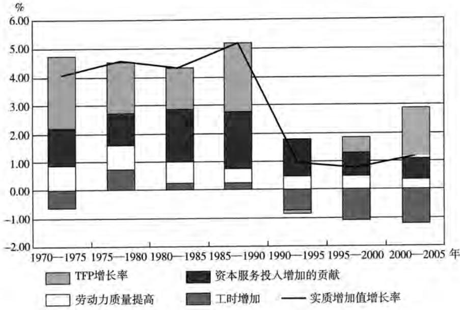  
图10-1增长的因素分解——基于市场经济和增加值

（资料来源：深尾、宫川，2008b）

市场经济的经济增长率（实际增加值增长率）从1970—1990年的年均4.5%明显放缓到1990—2005年的1.0%。从供给侧看，经济放缓的最大原因是TFP增长率的下降，从1970—1990年的年均 $2 . 0 \%$ 下降到1990—2005年的0.6%①。与此同时，生产要素投入的增加对经济增长的贡献也明显放缓。工时增加、劳动力质量提高（由于接受高层次教育和技能积累）和资本服务投入增加对经济增长的贡献，分别从1970—1990年的年均0.2%、0.8%和1.6%下降到1990—2005年的-1.0%、0.4%和1.0%。

TFP增长率和生产要素投人增速的放缓，部分原因是“泡沫”破灭后长期的需求不足②。例如，如果没有充分考虑经济衰退期间资本利用率的下降和过剩劳动力的囤积，就有可能低估经济衰退期间TFP增长率。此外，经济衰退造成的失业率上升和设备投资的停滞，可能导致生产要素投入增速的放缓。与此同时，在供给侧增长来源枯竭的背后，也有几个长期的和结构性的因素在起作用。

资本方面，正如Pyo和Nam（1999）所指出的，在OECD国家中，日本和韩国都取得了突出的资本积累型经济增长。这导致了资本系数的增加，且资本回报率自70年代起迅速下降（见图10-2），后者可能归因于降低资本边

其他重要的现有研究还有Jorgenson和Motohashi（2003）。他们发现TFP增长率由1975—1990年的平均0.96%下降到1990—1995年的0.61%后，1995—2000年再次回升到1.04%。正如他们所指出的，之所以能够得到如此乐观的结果，最大原因是他们没有使用日本数据作为ICT商品的平减指数，而是使用美国IT商品和非IT商品的相对价格乘以日本非ICT商品价格，从而为日本创建了特有的IT商品平减指数。Jorgenson和Motohashi（2003）也明确地将土地与劳动力和资本一同视为生产要素。尽管土地投入量是恒定的，但估算的TFP增长率会随着其他生产要素的分配比率的减少而增加。尤其是他们估算出20世纪90年代地价下跌，土地投入成本增加，所以在90年代这一效果较大。他们还将购买耐用消费品视为一种投资，并估算使用耐用消费品产生的服务并将其纳入到产出中，这也与本文的估算方法不同。

际生产力机制的作用，因此，极有可能在80年代之前依赖于资本积累的经济增长从90年代起达到了极限①。

  
图10-2七个主要OECD国家和韩国的资本总回报率的变化

劳动力方面，出生率的下降、人口老龄化和劳动时间的缩短是造成工时投人下降的主要原因。此外，接受高层次教育增速放缓、积累了熟练技能的婴儿潮一代的退休以及非正式雇佣的增长趋势，都使近年来劳动力质量提升放缓②。

对于TFP增长的长期比较，例如，将1970—1990年的TFP平均增长率与1990—2005年的TFP平均增长率相比较，利用率和劳动力囤积的变化对TFP增长率测量结果的影响并不是很大，因为一个周期中包含经济周期的许多波峰和波谷，事实上，正如本书第十一章盐路论文所揭示，90年代后TFP增长的大幅下滑，不能仅仅用经济衰退造成的资本利用率下降和过剩劳动力的囤积来解释。表10-2显示了纳入资本利用率变化的市场经济增长核算结果①。诚然，考虑到利用率的变化，减少了1990—1995年资本服务投人，从而使这一时期TFP增长率的下降放缓，但仍不能排除TFP增长率的大幅下降。

表10-2利用率变化的增长核算：基于增加值和市场经济  

<table><tr><td rowspan=1 colspan=1>项目</td><td rowspan=1 colspan=1>1970-1975</td><td rowspan=1 colspan=1>19751980</td><td rowspan=1 colspan=1>19801985</td><td rowspan=1 colspan=1>1985-1990</td><td rowspan=1 colspan=1>1990-1995</td><td rowspan=1 colspan=1>1995-2000</td><td rowspan=1 colspan=1>2000-2002</td></tr><tr><td rowspan=1 colspan=1>GDP增长率</td><td rowspan=1 colspan=1>4.10%</td><td rowspan=1 colspan=1>4.54%</td><td rowspan=1 colspan=1>4.31%</td><td rowspan=1 colspan=1>5.20%</td><td rowspan=1 colspan=1>0.96%</td><td rowspan=1 colspan=1>0.78%</td><td rowspan=1 colspan=1>-0.40%</td></tr><tr><td rowspan=1 colspan=1>劳动力投入增加的贡献</td><td rowspan=1 colspan=1>0.27%</td><td rowspan=1 colspan=1>1.62%</td><td rowspan=1 colspan=1>1.01%</td><td rowspan=1 colspan=1>0.78%</td><td rowspan=1 colspan=1>-0.25%</td><td rowspan=1 colspan=1>-0.58%</td><td rowspan=1 colspan=1>-1.90%</td></tr><tr><td rowspan=1 colspan=1>工时增加</td><td rowspan=1 colspan=1>-0.63%</td><td rowspan=1 colspan=1>0.76%</td><td rowspan=1 colspan=1>0.26%</td><td rowspan=1 colspan=1>0.25%</td><td rowspan=1 colspan=1>-0.71%</td><td rowspan=1 colspan=1>-1.08%</td><td rowspan=1 colspan=1>-1.76%</td></tr><tr><td rowspan=1 colspan=1>劳动力质量提高</td><td rowspan=1 colspan=1>0.90%</td><td rowspan=1 colspan=1>0.85%</td><td rowspan=1 colspan=1>0.75%</td><td rowspan=1 colspan=1>0.53%</td><td rowspan=1 colspan=1>0.46%</td><td rowspan=1 colspan=1>0.51%</td><td rowspan=1 colspan=1>-0.13%</td></tr><tr><td rowspan=1 colspan=1>资本服务投人增加的贡献</td><td rowspan=1 colspan=1>0.72%</td><td rowspan=1 colspan=1>1.64%</td><td rowspan=1 colspan=1>1.55%</td><td rowspan=1 colspan=1>2.08%</td><td rowspan=1 colspan=1>1.20%</td><td rowspan=1 colspan=1>0.93%</td><td rowspan=1 colspan=1>0.84%</td></tr><tr><td rowspan=1 colspan=1>资本增量</td><td rowspan=1 colspan=1>2.01%</td><td rowspan=1 colspan=1>1.17%</td><td rowspan=1 colspan=1>1.44%</td><td rowspan=1 colspan=1>1.55%</td><td rowspan=1 colspan=1>1.21%</td><td rowspan=1 colspan=1>0.61%</td><td rowspan=1 colspan=1>0.50%</td></tr><tr><td rowspan=1 colspan=1>资本质量提高</td><td rowspan=1 colspan=1>-1.29%</td><td rowspan=1 colspan=1>0.47%</td><td rowspan=1 colspan=1>0.11%</td><td rowspan=1 colspan=1>0.53%</td><td rowspan=1 colspan=1>-0.02%</td><td rowspan=1 colspan=1>0.31%</td><td rowspan=1 colspan=1>0.34%</td></tr><tr><td rowspan=1 colspan=1>TFP的贡献</td><td rowspan=1 colspan=1>3.11%</td><td rowspan=1 colspan=1>1.28%</td><td rowspan=1 colspan=1>1.74%</td><td rowspan=1 colspan=1>2.34%</td><td rowspan=1 colspan=1>0.02%</td><td rowspan=1 colspan=1>0.43%</td><td rowspan=1 colspan=1>0.66%</td></tr></table>

注：利用迪维西亚数量指数和成本数据。

除此之外，经济衰退使增长核算中TFP增长率下降的估算机制还包括：

（1）经济衰退可能使研发投入减少，技术创新停滞；（2）经济衰退导致资本积累放缓，资本过时，但增长核算没有考虑这些因素，TFP增长率可能被低估（也就是说，由于没有充分考虑资本的过时，高估资本积累，因此TFP增长率可能被低估）等②。

研发方面，OECD《弗拉斯卡蒂册》比较每个国家的研究支出表明，自1990年起，日本研究支出占GDP比重没有明显下降，如图10-3所示。权、深尾、金（2008）利用上市公司的微观数据，用《科学技术研究调查报告》研发投资额汇总数据来测量研发投入对TFP增长的影响。测量结果显示，与80年代后半期相比，没有证据表明进入90年代后这种影响有所下降。因此，很难认为研发投入使TFP增长效应下降，进而导致TFP放缓。

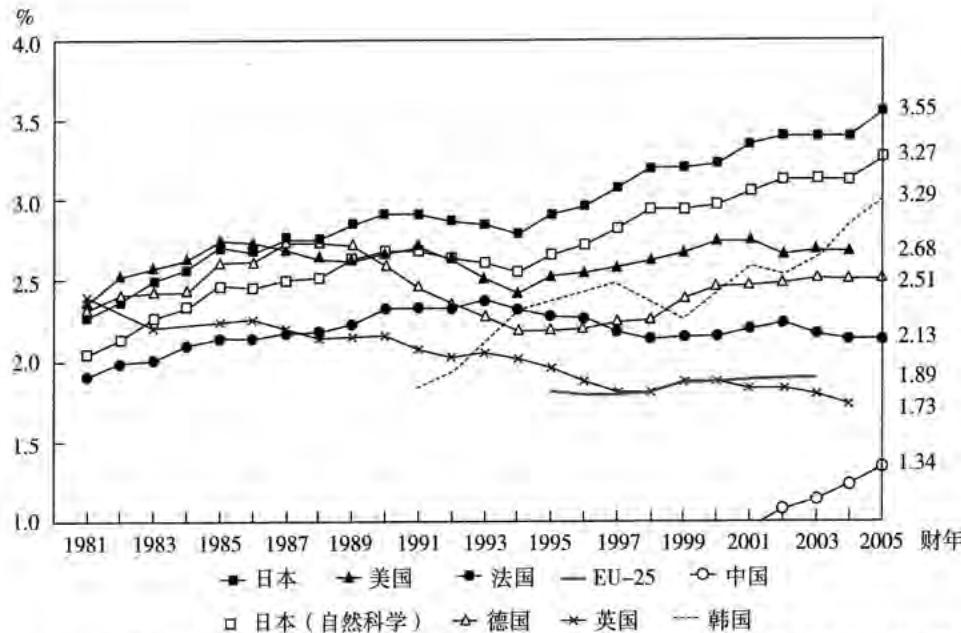

注：1.为了进行国际比较，每个国家都包括了人文和社会科学。日本数据中有只包括自然科学的数据。

2.日本在1996财年和2001财年数据中增加了调查对象行业。  
3.美国2003财年后的数据为初值。  
4.法国2005财年的数据为初值。  
5.德国2005财年的数据为估算值。  
6.EU-25为欧盟统计局的估算值。

# 图10-3 主要国家研究支出占GDP比重的变化

（资料来源：日本文部科学省，2007，《2007年版科学技术白皮书》）

深尾、宫川（2008a）第四章收录的德井、乾、金的论文详细介绍了资本过时的问题。他们测量了资本平均年份对生产率的影响。从其结果来看，尽管蕴含在资本中的体现式技术进步巨大，但由于JIP数据库所假设的资本淘汰率和投资产品价格的下降太小，因此使用JP增长核算在投资停滞期低估TFP增长的风险并不大。

如上所述，1990年后，TFP增长率和生产要素投入增速放缓，除了经济衰退外，还可以归因于更长期的和结构性的因素，这些因素将在本节后半部分和下一节详细论述。

进20世纪90年代后，日本TFP增长开始放缓，而20世纪90年代中期起，美国由于所谓的信息通信技术（Information 和 CommunicationTechnology，ICT）革命，TFP增长加速，但是欧洲大陆主要国家的TFP增长率却有所放缓，这引发了广泛关注（van Ark、Inklaar和McGuckin，2002及Inklaar、Timmer和van Ark,2006)。

图10-4对日本、韩国、德国（包括统一前的东德）、法国、英国、意大利和美国市场经济的增长核算结果进了比较，该比较以美国TFP由于ICT革命而快速增长的1995年为界，分别采集前15年和后10年的样本数据。数据来源是最新的EUKLEMS（2008年3月版，数据截至2005年)①。

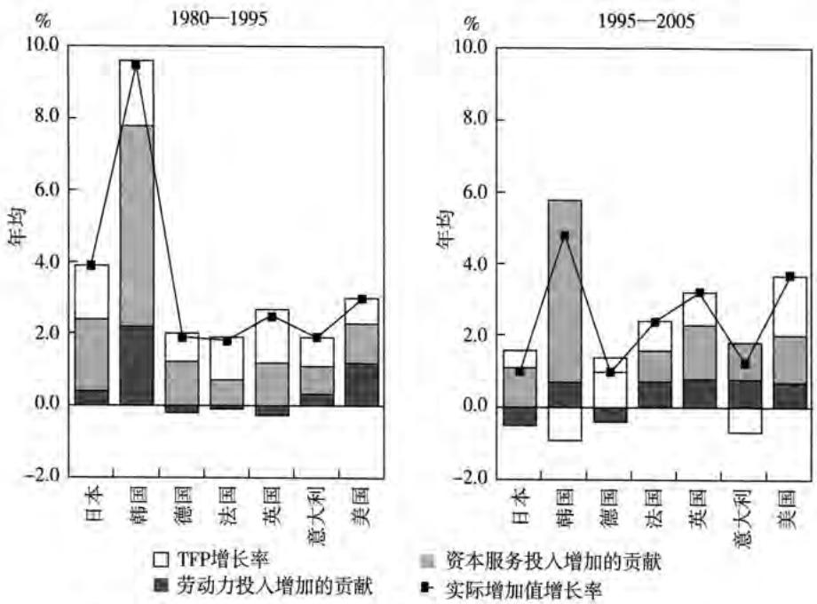  
图10-4主要发达国家增长的因素分解——基于市场经济和增加值  
（资料来源：Fukao、Miyagawa、Pyo和Rhee，2008。原资料为EUKLEMS数据库2008年3月版）

与其他发达国家相，本并不是唯个20世纪90年代中期起TFP增长停滞的国家。如上所述，美国由于所谓的ICT革命，90年代中期后TFP增长加速，而欧盟主要国家（德国、法国、英国、意大利）和韩国也与日本一样，出现了TFP增长减速的现象。根据EUKLEMS数据库，日本的TFP增长率由1980—1995年的年均1. $5 \%$ 下降到1995—2005年的 $0 . 5 \%$ ,下降了 $1 . 0$ (id:)个百分点。而欧盟四个主要国家的TFP增长率平均值在同一时期从 $1 . 1 \%$ 下降到 $0 . 3 \%$ ，下降了0.8个百分点。

与1990年后经济增长大幅减速的日本和韩国不同，欧盟主要国家中，除了经济停滞的德国以外，法国、英国和意大利在TFP增长率下降的情况下依然实现了经济增长加速（法国、英国）或没有大幅减速（意大利），这主要归因于劳动力投入的增加。这三个国家在1995年以前，曾受到以年轻劳动力为主的高失业率困扰，但之后成功地创造了就业机会。从OECD为进行国际比较而标准化的失业率来看，这三个国家的平均失业率从1995年的 $1 1 . 3 \%$ 下降到2004年的 $7 . 4 \%$ 。而日本的标准化失业率却在此期间从 $3 . 1 \%$ 上升到$4 . 7 \%$ (下载网址：http://webnet.oecd.org/wbos/)。

与这些欧盟国家不同，美国增长加速的来源是TFP增长率的加速（从1980—1995年的年均 $0 . 7 \%$ 到1995—2005的 $1 . 6 \%$ )。

日本资本服务投人的贡献有所下降，相反，欧盟三国和美国的这一数字却有所增加。特别是美国和英国的资本深化是通过活跃的ICT投资带来的。

迄今为止国际比较结果如下：法国和英国在1995年后取得的经济增长率高于日本，这并不是因为TFP增长率的差异，而是因为劳动力和资本等要素投入的贡献不同。自1995年起，欧盟四国和日本的TFP增长率下降幅度大致相同，韩国的TFP增长率下降比日本更大，只有美国享受了TFP的加速增长。

图10-5按行业对七个国家的TFP增长率变化进行了比较。机电、邮政和通信（ICT制造业）的TFP增长，1995年之前，日本仅次于韩国排名第二，1995年之后，日本下滑到第四位。日本与其他发达国家相同，ICT制造业的TFP增长一直保持着明显高于其他行业的状况。但问题是任何国家的ICT制造业在宏观经济中所占份额都不是很高，日本也不例外。ICT制造业在宏观经济整体的劳动力投入（基于工时）中所占份额（1995—2005年平均），日本和美国分别只有 $4 . 3 \%$ 和 $3 . 2 \%$ 。

与美国自90年代中期起TFP增长加速相比，日本最大的不同是，TFP增长率在流通业和非机电制造业（即ICT应用行业）明显下降。日本上述两个行业的劳动力投入份额远远高于ICT制造业，分别为 $2 3 . 4 \%$ 和16. $8 \%$

  
图10-5 市场经济中TFP增长率（按行业和国家）  
（资料来源：Fukao、Miyagawa、Pyo和Rhee，2008，原资料为EUKLEMS database2008年3月版）

除上述之外，从图10-5中可以看出几个有趣的事实。首先，1995年后，几乎所有的行业中，美国的TFP增长率都是最高的。在对个人和社会服务中，除法国以外的所有样本国家，生产率都持续停滞。在金融和对企业服务中，除美国和英国以外的所有样本国家，1995年后TFP增长都进入停滞状态。

如上所述，自1995年起，与美国的TFP增长加速相比，日本以及其他发达国家的TFP增速都有所放缓。美国与其他国家的表现为什么会出现这种差异呢？一个有力的假说是，自1995年起，美国加快了ICT投资和无形资产投资（这是研发投资、软件投资、广告宣传和组织变革支出、企业内部职业培训等有助于提高TFP增长的投入总和），而日本以及其他发达国家则停滞不前，这可能是表现出现差异的原因所在。正如Fukao、Miyagawa、Pyo和Rhee（2008）所示（见图 $1 0 { - } 6 ) ^ { \textcircled { 1 } }$ ，与美国相比，日本和欧洲大陆国家的ICT投资确实停滞不前。无形资产投资方面，如Fukao、Miyagawa、Mukai、Shinoda和Tonogi（2008）所示（见图10-7），与美国相比，日本停滞不前②。对比图10-7和表10-3可以看出，欧洲各国的无形资产投资在GDP中的占比比日本还要低。

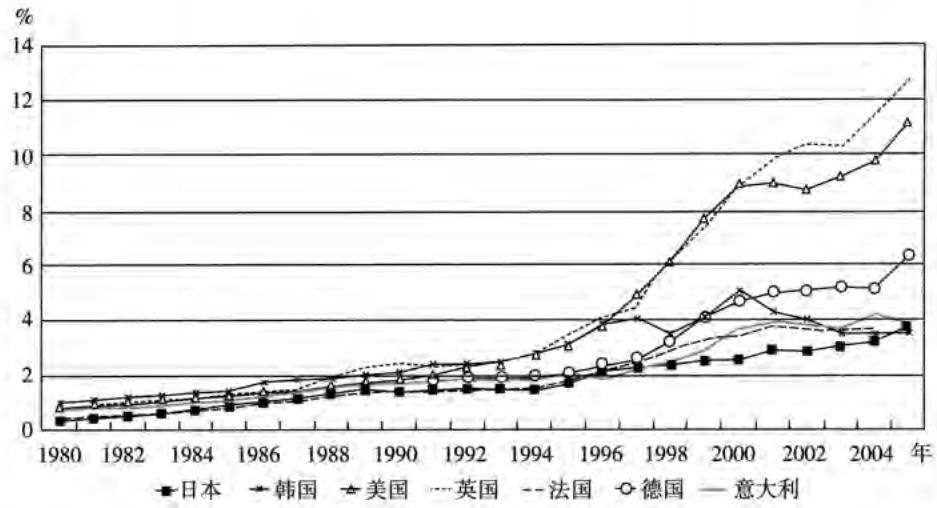  
图10-6 ICC投资占GDP比重——主要发达国家比较  
（资料来源：Fukao、Miyagawa、Pyo和Rhee，2008。原资料为EUKLEMS数据库2008年3月版本。JIP数据库2008年版本，KIP）

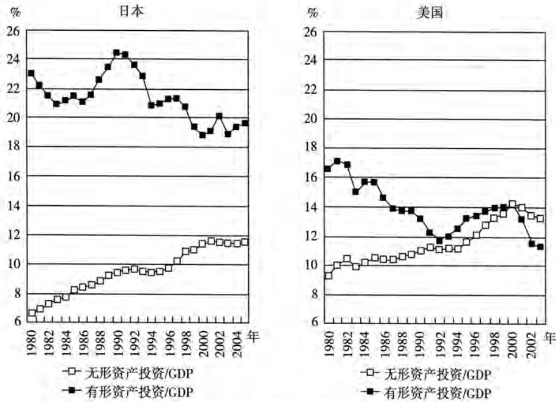  
图10-7无形和有形资产投资占GDP比重（美国仅限市场经济，日本是经济整体）

（资料来源：Fukao，Miyagawa、Mukai、Shinoda和Tonogi，2008）

表10-3无形资产投资——法国、德国、荷兰和日本比较  

<table><tr><td rowspan=1 colspan=1></td><td rowspan=1 colspan=2>法国2004</td><td rowspan=1 colspan=2>德国2004</td><td rowspan=1 colspan=2>荷兰2001-2004</td><td rowspan=1 colspan=2>日本20002005</td></tr><tr><td rowspan=1 colspan=1>计算机化信息创新资产（研发等）经济能力（管理资源、品牌、人力资本等）</td><td rowspan=1 colspan=1>0.93.85.4</td><td rowspan=1 colspan=1>9%37%54%</td><td rowspan=1 colspan=1>0.94.13.6</td><td rowspan=1 colspan=1>10%48%42%</td><td rowspan=1 colspan=1>1.43.15.2</td><td rowspan=1 colspan=1>14%32%54%</td><td rowspan=1 colspan=1>2.35.93.3</td><td rowspan=1 colspan=1>20%51%29%</td></tr><tr><td rowspan=1 colspan=1>总计</td><td rowspan=1 colspan=1>10.1</td><td rowspan=1 colspan=1>100%</td><td rowspan=1 colspan=1>8.6</td><td rowspan=1 colspan=1>100%</td><td rowspan=1 colspan=1>9.6</td><td rowspan=1 colspan=1>100%</td><td rowspan=1 colspan=1>11.5</td><td rowspan=1 colspan=1>100%</td></tr></table>

资料来源：法国和德国为Hao，Manole和 yan Ark（2008)。荷兰为Van Rooijen-Horsten、van den Bergen和Tariseven(2008)。日本为Fukao、Miyagawa，Mukai、Shinoda和Tonogi（2008）。

# 3跨行业资源配置和生产率

本节将探讨跨业资源配置的变化使20世纪90年代后本TFP增速放缓的可能性。首先，我们使用丰富的行业数据，验证扩张TFP增长率低的行业是否使日本经济整体的TFP增速放缓。接下来，我们将分析行业层面的资源配置效率。如果生产要素从边际产品价值低的行业向高的行业移动，GDP就会增长。我们将调查这样的资源再配置效应在20世纪90年代后是否停滞了。

如图10-5所示，许多国家制造业的TFP增长率普遍较高。以日本为例，如图10-8所示，2005年制造业TFP水平为1970年的2.3倍，而非制造业（仅市场经济，不包括住房和未分类部门）TFP水平仅为1.4倍。

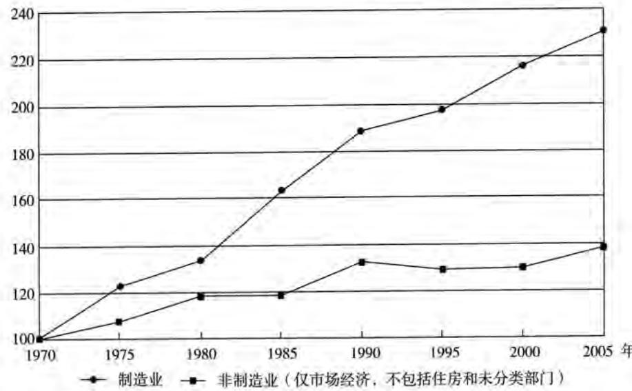  
图10-8 制造业和非制造业的TFP（基于增加值）增长（ $\mathbf { 1 9 7 0 = 1 0 0 }$ )

（资料来源：JIP数据库2008版）

正如美国及其他许多发达国家所经历的那样，大多数发达国家随着经济的发展，制造业在宏观经济中的份额都趋于减少。图10-9显示了日本和美国的制造业名义总增加值和就业人数在宏观经济整体中的份额。如果用制造业份额来衡量去工业化，日本虽然比美国落后20多年，但从长期趋势来看，日本和美国一样，制造业的份额始终是下降的。特别是在1973年第一次石油危机之后和1991年之后，日本的制造业份额迅速缩小。

TFP增长率不仅在制造业和非制造业之间有很大差异。即使同在制造业中，电机行业的TFP增长率也远高于食品加工业。因此，我们使用JIP数据库，测量了TFP增长率高的业份额下降在多大程度上拉低了宏观经济整体和制造业整体的TFP增速，该JIP数据库能够测量覆盖日本经济整体的108个行业的TFP增长率。

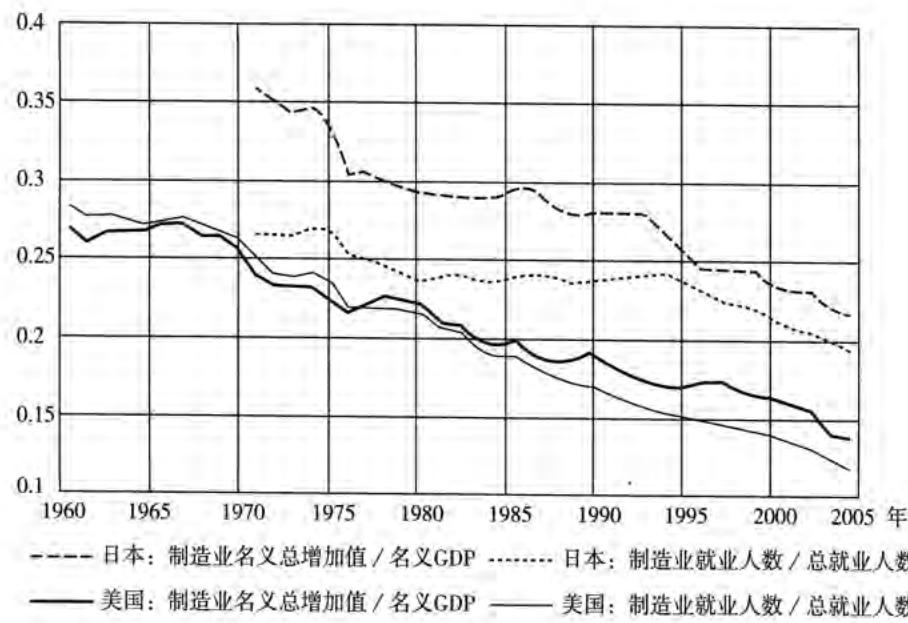  
图10-9 制造业在宏观经济整体中的份额——日美比较

（资料来源：JP2006和The Councilof Eeonomic Advisers， Economic Report of thePresident 2005

众所周知，由宏观经济整体和制造业整体等综合若干行业而成的部门TFP增长率（基于增加值）等于由构成该部门的各业的TFP增长率（基于生产总值）用多玛权重（该行业的总产值除以该综合部门整体的总增加值所得的数值）汇总而成的值①。行业i在1980年和1990年的多玛权重的平均值为 $w _ { 8 0 , 9 0 }$ , $i$ ，1980—1990年TFP增长率（年平均值）为 $\Delta \ln A _ { 8 0 , 9 0 }$ , $i$ ,19902002年这一数值分别表示为wq，2002，i和△lnAg，2002，i。与20世纪80年代相比，1990年后的宏观经济整体（或市场经济整体、制造业整体等）TFP增长率的减速可以分解如下：

$$
\sum _ { i } w _ { 9 0 , \ 0 2 , \ i } \Delta A _ { 9 0 , \ 0 2 , \ i } - \sum _ { i } w _ { 8 0 , \ 9 0 , \ i } \Delta A _ { 8 0 , \ 9 0 , \ } ,
$$

$$
= \frac { 1 } { 2 } \sum _ { i } \left( w _ { 8 0 . 9 0 , i } + w _ { 9 0 . 0 2 , i } \right) \left( \Delta A _ { 9 0 , \ 0 2 , i } - \Delta A _ { 8 0 , \ 9 0 , i } \right)
$$

$$
+ \frac { 1 } { 2 } \sum _ { i } \left( \Delta A _ { 9 0 , \ 0 2 , i } \ : + \Delta A _ { 8 0 , \ 9 0 , \ i } \right) \left( w _ { 9 0 , \ 0 2 , i } \ : - w _ { 8 0 , \ 9 0 , \ i } \right)
$$

等式右边第项表示由于业内TFP增速放缓导致宏观经济整体TFP增速放缓，第二项表示由于TFP增长率高的行业权重缩小导致宏观经济整体

TFP增速放缓①

表10-4显示了根据该公式分解的结果。从制造业整体和非制造业整体来看，构成制造业整体和非制造业整体的行业份额的变化，分别具有提高制造业整体和非制造业整体TFP增长率的作用。但是，该作用与1980—1990年到1990—2002年的TFP增长率减速整体相比要小得多，制造业为5.9%，非制造业为11. $8 \%$

（上排单位为%)

表10-4产业结构的变化对TFP增速放缓的影响  

<table><tr><td rowspan=1 colspan=1>项目</td><td rowspan=1 colspan=1>1980-1990年至1990-2002年TFP增长率放缓</td><td rowspan=1 colspan=1>其中，每个行业内的TFP增长率放缓的贡献</td><td rowspan=1 colspan=1>其中，TFP增长率较高行业份额减小的贡献</td></tr><tr><td rowspan=1 colspan=1>制造业贡献率</td><td rowspan=1 colspan=1>-2.24</td><td rowspan=1 colspan=1>-2.37-105.9%</td><td rowspan=1 colspan=1>0.13-5.9%</td></tr><tr><td rowspan=1 colspan=1>非制造业贡献率</td><td rowspan=1 colspan=1>-0.31</td><td rowspan=1 colspan=1>-0.35111.8%</td><td rowspan=1 colspan=1>0.04-11.8%</td></tr><tr><td rowspan=1 colspan=1>宏观经济整体贡献率</td><td rowspan=1 colspan=1>-0.82</td><td rowspan=1 colspan=1>-0.7996.7%</td><td rowspan=1 colspan=1>-0.033.3%</td></tr><tr><td rowspan=1 colspan=1>市场经济贡献率</td><td rowspan=1 colspan=1>-1.14</td><td rowspan=1 colspan=1>-1.1399.0%</td><td rowspan=1 colspan=1>-0.011.0%</td></tr></table>

另一方面，从宏观经济整体和市场经济整体来看，构成宏观经济整体和市场经济整体的行业份额的变化，分别具有拉低宏观经济整体和市场经济整体TFP增长率的作用。估测其原因为，如前所述，TFP增长率较高的制造业在收缩，而TFP增长率较低的非制造业在扩张。但是，这些产业结构变化的负向影响也小于1980—1990年到1990—2002年期间TFP增长率的整体放缓，宏观经济整体为 $3 . 3 \%$ ，市场经济整体为 $1 . 0 \%$ 。

从上述分析可知，产业结构的变化，即TFP增长率高的行业收缩而增长率低的行业扩张，降低了宏观经济整体的TFP增长，这一影响很难解释1990年后TFP增长的放缓。TFP增长放缓大部分发生在各个行业内部。

下面，我们思考跨行业资源配置。

即使是同一类型（相同的学历、年龄、性别、就业状况等）的劳动力，企业支付的工资率在不同行业之间也有很大差异。由于资本商品的构成大体相同，即使在被认为单位资本存量的资本成本没有太大差异的行业之间，资本回报率也会有很大差异。如果报酬反映了劳动力和资本的生产率，报酬的差异是由阻碍劳动力和资本的跨行业转移的制度和税收制度的扭曲造成的，那么，在上述情况下，通过将劳动力和资本从低收入行业转移到高收入行业，可以增加 ${ \bf G D P ^ { \mathrm { ( D ) } } } _ { s }$

在对经济增长的核算中如何把握这些资源再配置效应，取决于对增长核算方法的考量。

在JIP数据库和EUKLEMS数据库使用的增长核算方法中，同一类型的劳动力和资本商品被视为用于不同行业的不同劳动力和资本商品，以各行业的报酬为权重，计算以宏观经济整体效率单位衡量的劳动力和资本服务投入量（迪维西亚数量指数，严格地说是其Tormqvist指数近似值）。此时，某个劳动力从工资率低的零售业跳槽到工资率高的金融业所带来的GDP的增加，可以通过以宏观经济效率单位衡量的劳动力投入增加（质量的提高）的贡献来测量，不能看作TFP的增长。

另一方面，同类型的劳动力和资本商品，即使行业不同，相同的劳动力和资本商品，在以所有行业的平均报酬为权重，以宏观经济整体的效率单位来衡量的劳动力和资本服务投入量的增长核算中，上述的跳槽效应可以作为TFP的增长来测量。仅以宏观经济整体数据为基础的传统增长核算大多属于这一范畴。也就是说，“传统的TFP增长=JIP的TFP增长+资源再配置效应”这一等式成立②。

Fukao、Miyagawa和Takizawa（2007）和Fukao、Miyagawa、Pyo和Rhee(2008）使用JIP数据库，测量了上述资源再配置效应在时间上的变化。表10-5显示了Fukao、Miyagawa、Pyo和Rhee（2008）对再配置效应的估算结果③。

# 表10-5日本的再配置效应（市场经济，1975—2005年）

(年增长率：%)

<table><tr><td rowspan=1 colspan=1></td><td rowspan=1 colspan=1></td><td rowspan=1 colspan=1>1975-1980</td><td rowspan=1 colspan=1>1980-1990</td><td rowspan=1 colspan=1>1990-2000</td><td rowspan=1 colspan=1>2000—2005</td></tr><tr><td rowspan=1 colspan=1>基于传统增长核算的TFP增长率</td><td rowspan=1 colspan=1>a=b+c+d</td><td rowspan=1 colspan=1>2.59</td><td rowspan=1 colspan=1>1.89</td><td rowspan=1 colspan=1>0.51</td><td rowspan=1 colspan=1>0.98</td></tr><tr><td rowspan=1 colspan=1>基于JIP增长核算的TFP增长率</td><td rowspan=1 colspan=1>b</td><td rowspan=1 colspan=1>2.19</td><td rowspan=1 colspan=1>1.64</td><td rowspan=1 colspan=1>0.1</td><td rowspan=1 colspan=1>0.92</td></tr><tr><td rowspan=1 colspan=1>资本的再配置效应</td><td rowspan=1 colspan=1>c</td><td rowspan=1 colspan=1>0.47</td><td rowspan=1 colspan=1>0.28</td><td rowspan=1 colspan=1>0.18</td><td rowspan=1 colspan=1>0.07</td></tr><tr><td rowspan=1 colspan=1>劳动力的再配置效应</td><td rowspan=1 colspan=1>d</td><td rowspan=1 colspan=1>-0.07</td><td rowspan=1 colspan=1>-0.03</td><td rowspan=1 colspan=1>0.23</td><td rowspan=1 colspan=1>-0.02</td></tr></table>

资料来源：Fukao、Miyagawa、Pyo、Rhee（2008）。

日本资本再配置效应一直是比较大的正值。这是由于在2000年之前，ICT制造业和ICT资本密集型非制造业（金融保险、供水供气、批发零售等）资本回报率相对较高的行业资本快速积累。然而，资本再配置效应往往随着时间的推移而逐渐减弱。

另一方面，劳动力的正再配置效应只在20世纪90年代是较大的正值，在其他时期普遍为负值。90年代的再配置效应缘于农业和纺织业等低收入行业的劳动力投入减少，以及信息服务、法律事务、财务和会计服务等高收入行业的劳动力投人增加。JIP数据显示，1990—2002年劳动力质量指数年均增长了0.8%，其中受学历水平提升带来的直接影响仅为0.1%，质量的提升是由于上述劳动力跨行业转移和低收入个体户的减少引起的。同时，低收入非全日制雇员的增加使劳动力质量每年下降0.2%。劳动力的有效配置可以说是提高潜在增长率的一个重要方面。

表10-5的结果显示，从资本和劳动力的整体再配置效应来看，从80年代到90年代，再配置效应反而从每年0.25%增加到0.41%，所以传统增长核算中1990年后TFP增长率的下降不是由资源配置的恶化造成的。

# 4企业和机构之间的资源配置和生产率动态

有人指出，无论日本还是其他国家，相对狭窄和有限的同一行业的企业和工厂之间，生产率存在较大差异。例如，根据Fukao和Kwon（2006）的研究，他们利用对企业活动基本调查的汇总数据来测量企业间TFP水平差异，2001年，位于四分之一处和四分之三处的企业（即将同一行业的企业按TFP水平从高到低排序时，从第一位到位于25%的企业和位于75%的企业）的TFP水平差异如下：TFP差异较大的行业中，药品为24%（用TFP对数值的差来测量为0.22），电子计算机及其零部件为23%（0.21；TFP），TFP差异较小的行业中，纸和纸浆为10%（0.10；TFP），钢铁达到11%（0.11；TFP)①。根据Fukao、Kim和Kwon（2008）的研究，制造业工厂之间也存在这种生产率差异。

存在生产率差异时，假如生产率高的企业和工厂扩大生产，生产率低的企业和工厂缩小生产，则行业整体和宏观经济整体的生产率就会提高。同理，生产率低的企业和工厂撤出，生产率高的企业和工厂进人，经济整体的生产率也会提高。20世纪90年代生产率增长的减速，可能就是源于这种新陈代谢功能的减退。

本节基于深尾、权（2004）、权、深尾（2007）、Fukao和Kwon（2006）、Fukao、Kim和Kwon（2008）以及权、金、深尾（2008）利用企业和工厂数据进行的所谓生产率动态（productivity dynamics）分析成果，回顾了上述日本跨企业资源配置趋势。

早期的一些研究指出，20世纪90年代观察到的自然淘汰机制失灵（如Nishimura、Nakajima和Kiyota，2005），即TFP相对较高而非相对较低的企业退出市场，是日本经济TFP停滞的原因。也有研究指出，TFP停滞的原因还包括，银行通过提供后续贷款和减息，可能延长了没有复苏前景的公司的寿命（被称为“僵尸企业理论”)②，以防止不良债权问题的出现。

上述研究结果表明，“泡沫经济”之后的日本经济没有通过竞争淘汰等市场机制对资源进行有效的跨企业再配置，因此，日本经济整体的TFP是下降的。然而，权、深尾（2007），金、权、深尾（2007）和Fukao、Kim和Kwon（2008）使用涵盖20世纪80年代的长期工业统计调查微观数据（机构面板数据）分析了生产率动态，发现日本经济的低新陈代谢功能，并不是20世纪90年代初期“泡沫经济”破灭后的固有现象，而是在“泡沫经济”破灭之前就持续存在，日本经济的低新陈代谢功能，表现在机构开业率和倒闭率明显低于美国，以及生产率高的工厂相继关闭。他们还揭示了20世纪90年代制造业TFP增速放缓缘于机构内部生产率增速的放缓。

为了确定新陈代谢功能在20世纪90年代是否开始下降，需要使用覆盖80年代的企业和工厂数据。制造业方面，可以使用日本经济产业省《工业统计调查》的长期汇总数据①。金、权、深尾（2007）和Fukao、Kim和Kwon（2008）利用1981—2003年工业统计调查面板数据，进行了生产率动态分析。他们将制造业细分为48个行业，根据Good、Nadin和Sickles（1997）和Aw、Chen和Roberts（2001）的方法，计算出各机构相对于所在行业平均水平的相对TFP和劳动生产率；使用Baily、Hulten和Campbell（1992）和Foster、Haltiwanger和Krizan（2001）的方法，将工业生产率汇总为行业生产率，将行业整体TFP和劳动生产率的提高从以下三个方面进行分析：各工厂内部的生产率增长效果（内部效应）、扩大生产率高的工厂和缩小生产率低的工厂带来的行业整体生产率提高效果（再配置效应）、新建生产率高的工厂和关闭生产率低的工厂带来的效果（进入和退出效应）。

图10-10和图10-11显示了金、权、深尾（2007）关于劳动生产率和TFP的生产率动态分析结果。由于工业统计调查从2001年起不再调查雇员人数为4人（含）至29人（含）的机构的有形固定资产，因此用于TFP分析的数据截至2000年。

  
注：进人和退出效应包括机构主营业务变化的效应（转入和转出效应）。  
图10-10劳动生产率增长的因素分解

  
注：进人和退出效应包括机构主营业务变化的效应（转入和转出效应）。  
图10-11 TFP增长的因素分解

（资料来源：金、权、深尾，2007）

从图10-11可以确认：内部效应，即存续机构内部的生产率增长效应，是所有时期日本TFP和劳动生产率增长的主要来源，该效应在20世纪90年代明显减弱。可以说，90年代后制造业生产率增长乏力主要是由于内部效应的减弱。无论是TFP还是劳动生产率，在所有时期的退出效应都是负的，而且负向影响在逐步扩大。负的退出效应意味着退出企业的生产率平均值高于存续企业的平均值①

进入20世纪90年代后，对外直接投资的迅速增加导致工厂迁往国外的主要是生产率高的大企业。因此，对外直接投资造成的空心化可能产生了负的退出效应。为了观测对外直接投资和负的退出效应之间的关系，图10-12针对1990—2002年日资企业在亚洲设立的当地法人生产企业的产值变化除以1990年国内产值的值（%）和1990—2003年的退出效应（年增长率，%），在48个行业中进行了对比。从图中可以看出，两者之间存在负相关。相关系数高达-0.42（5%水平上显著），即使从样本中剔除通信设备行业，相关系数也为-0.24(5%水平上显著）。为了明确揭示空心化，有必要将企业海外扩张数据和我们掌握的机构生产率和关闭数据相结合，进行新的分析。但从当前的分析可以看出，以电机行业为主的生产向海外转移可能正在产生负的退出

效应。

  
图10-12从对东亚直接投资和劳动生产率提高的因素分解中得出的退出效应（1990—2003）

注：日本企业在东亚的产值数据基于 $\scriptstyle \mathrm { I I P 2 0 0 6 }$ 附表。

（资料来源：金、权、深尾，2007）

图10-10和图10-11显示，生产率动态的进入效应是正的，趋于逐渐增加。分行业看，大部分行业的进人效应是正的。与退出的情况相反，新进人的机构对制造业的生产率增长有贡献。

无论是TFP还是劳动生产率，净进入效应（进入效应和退出效应之和）在所有时期都为正。但是，由于负的退出效应很大，且随着时间推移不断扩大，净进入效应对整个生产率增长的贡献很小，而且随着时间的推移而减少。

劳动生产率的再配置效应从20世纪80年代的负值提高到90年代以后的正值。但是，在整个期间，再配置效应在整个劳动生产率增长中所占的份额很小。就TFP而言，再配置效应逐渐改善，1995—2000年在整个TFP增长中所占份额为 $45 \%$ ，作出了不可忽视的贡献。

关于制造业的生产率动态，在国外，美国（Foster、Haltiwanger和Krizan；2001）、英国（Disney、Haskel和Heden，2003）、加拿大（Baldwin和Gu，2006)、韩国（Ahn、Fukao和Kwon，2004）等国家也采用了同样的方法，利用工业统计调查的汇总数据进行了分析。将金、权、深尾（2007）关于日本的上述结果与其他国家的结果进行比较，可以指出以下几点①。

关于TFP增长的因素分解显示，美国和英国的内部效应贡献在经济衰退期变得非常小，再配置效应和净进入效应是TFP增长的主要原因。相反，在经济繁荣期，内部效应是生产率增长的最大来源。日本的内部效应贡献在20世纪90年代的大衰退期下降到 $5 0 \%$ 以下，同一时期的再配置效应和净进入效应的份额也基本没有增加。与其他国家相比，日本的内部效应贡献普遍较大，相反，再配置和进入退出的新陈代谢功能较弱。

韩国和加拿大不仅报告了净进入效应，还报告了其细目（进入和退出效应）。与其相比，只有日本的退出效应在所有时期对TFP和劳动生产率都是负的。与其他国家相比，本出现了关闭产率相对较机构的情况。

对于非制造业而言，很难获得行业整体的长期生产率动态变化数据。对于非制造业的生产率分析动态，通常使用日本经济产业省《企业活动基本调查》汇总数据②和融合多个民间数据库创建的JIP微观数据库，仅覆盖20世纪90年代后的数据③。另一方面，对于上市公司，虽然可以获得其长期的财务数据，但是由于非制造业中上市公司销售和就业份额大约占整个行业的10%-30%，仅分析上市公司无法把握整个行业中企业的“进入”和“退出”，因此选取上市公司来分析行业的新陈代谢功能是不合适的。

如上所述，对于非制造业，很难比较1990年之前和之后的生产率动态变化。但是，从对日美机构的开业率和倒闭率变化趋势的长期比较来看（图10-13），除制造业外，日本批发、零售、餐饮、服务等行业的开业率和倒闭率从20世纪80年代开始就极低，且这段时间的变化趋势与制造业非常相似。

从图10-13可以判断，本经济的新陈代谢功能从20世纪80年代起就很低，似乎不太可能在进入90年代后出现急剧下降。

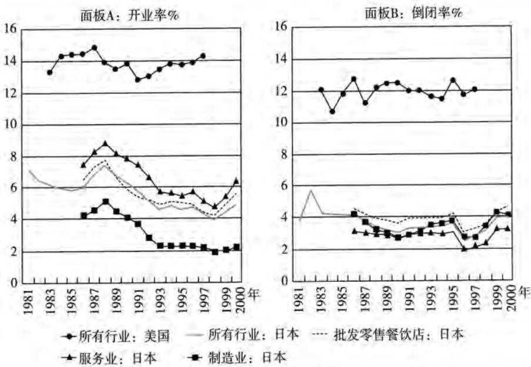  
图10-13 机构的开业率和倒闭率——日美比较

（资料来源：深尾、权， $2 0 0 4 _ { \circ }$ 为了进行日美比较，使用了劳动保险业务的统计。中小企业厅，关于“产业空心化”和关税政策研究会（2002）。原资料为Small Business Administration，USGovermment（1998））

简要介绍金、权、深尾（2007）的结论如下：他们将分析时期限定在1998年以后，分析了非制造业中劳动生产率的动态变化，使用的JIP微观数据库综合了以下三个数据库，并剔除重复数据。三个数据库分别为：（1）日本政策投资银行的《企业财务数据库》，涵盖了在东京、名古屋和大阪证券交易所第一部和第二部以及JASDAQ、Mothers和Hercules上市的所有公司，但不包括金融保险行业：（2）基于帝国数据库的数据，涵盖众多中坚企业的Bureau van Dijk公司的《Japanese Accounts 和 Data on. Enterprises（JADE）数据库》：（3）涵盖众多中小企业的中小企业信用信息（CRD）协会的《中小企业信用风险数据库（CreditRiskDatabase，CRD）》他们将非制造业（不包括农业、林业、渔业、 $\textcircled { 1 } ^ { 2 }$ 业、金融保险业和政府及非营利组织的活动）划分为17个行业，并对每个行业内的生产率动态变化进行了分析。

生产率增长的因素分解，采用了Griliches和Regev（1995）方法，没有采用Forster、Haltiwanger和Krizan（2001）方法，前者不易受经济周期影响，后者容易受经济变动影响。由于1999年和2000年之间存在数据断层，因此分析是基于1997—1999年和2000—2003年数据进行的。

表10-6是生产率动态变化的分析结果。

按行业分类的1997—1999和2000—2002的平均值

表10-6 非制造业劳动生产率增长的因素分解结果：  

<table><tr><td rowspan=1 colspan=1>行业名</td><td rowspan=1 colspan=1>劳动生产率增长率a=b+c+d</td><td rowspan=1 colspan=1>内部效应b</td><td rowspan=1 colspan=1>再配置效应C</td><td rowspan=1 colspan=1>净进人效应d=e+f</td><td rowspan=1 colspan=1>进入效应e</td><td rowspan=1 colspan=1>退出效应f</td></tr><tr><td rowspan=7 colspan=1>建筑业批发业零售业房地产业运输业仓储及其他运输业通信业电气业</td><td rowspan=5 colspan=1>-4.804.054.741.78-4.84-3.48</td><td rowspan=2 colspan=1>0.071.592.53</td><td rowspan=2 colspan=1>-5.030.831.02</td><td rowspan=1 colspan=1>0.161.63</td><td rowspan=1 colspan=1>1.481.33</td><td rowspan=1 colspan=1>-1.320.30</td></tr><tr><td rowspan=1 colspan=1>1.19</td><td rowspan=1 colspan=1>0.95</td><td rowspan=1 colspan=1></td></tr><tr><td rowspan=1 colspan=1>1.85</td><td rowspan=1 colspan=1>-0.37</td><td rowspan=1 colspan=1>0.30</td><td rowspan=1 colspan=1>-0.66</td></tr><tr><td rowspan=1 colspan=1>0.61</td><td rowspan=1 colspan=1>-3.91</td><td rowspan=1 colspan=1>-1.53</td><td rowspan=1 colspan=1>-1.80</td><td rowspan=1 colspan=1>0.27</td></tr><tr><td rowspan=1 colspan=1>0.72</td><td rowspan=1 colspan=1>-4.37</td><td rowspan=1 colspan=1>0.17</td><td rowspan=1 colspan=1>-1.34</td><td rowspan=1 colspan=1>1.50</td></tr><tr><td rowspan=1 colspan=1>36.83</td><td rowspan=1 colspan=1>8.60</td><td rowspan=1 colspan=1>25.56</td><td rowspan=1 colspan=1>2.67</td><td rowspan=1 colspan=1>1.11</td><td rowspan=1 colspan=1>1.56</td></tr><tr><td rowspan=1 colspan=1>-1.11</td><td rowspan=1 colspan=1>6.88</td><td rowspan=1 colspan=1>-8.06</td><td rowspan=1 colspan=1>0.07</td><td rowspan=1 colspan=1>0.03</td><td rowspan=1 colspan=1>0.04</td></tr><tr><td rowspan=1 colspan=1>燃气、供水、供暖业</td><td rowspan=1 colspan=1>-3.93</td><td rowspan=1 colspan=1>0.56</td><td rowspan=1 colspan=1>-5.35</td><td rowspan=1 colspan=1>0.86</td><td rowspan=1 colspan=1>0.98</td><td rowspan=1 colspan=1>-0.13</td></tr><tr><td rowspan=2 colspan=1>旅馆民间广播电视业</td><td rowspan=1 colspan=1>-0.23</td><td rowspan=1 colspan=1>1.75</td><td rowspan=1 colspan=1>-1.03</td><td rowspan=1 colspan=1>-0.95</td><td rowspan=1 colspan=1>-2.08</td><td rowspan=1 colspan=1>1.13</td></tr><tr><td rowspan=1 colspan=1>-10.19</td><td rowspan=1 colspan=1>0.22</td><td rowspan=1 colspan=1>-15.38</td><td rowspan=1 colspan=1>4.96</td><td rowspan=1 colspan=1>4.85</td><td rowspan=1 colspan=1>0.11</td></tr><tr><td rowspan=1 colspan=1>对个人服务业</td><td rowspan=1 colspan=1>0.19</td><td rowspan=1 colspan=1>0.36</td><td rowspan=1 colspan=1>-1.74</td><td rowspan=1 colspan=1>1.58</td><td rowspan=1 colspan=1>-0.13</td><td rowspan=1 colspan=1>1.70</td></tr><tr><td rowspan=1 colspan=1>对企业服务业</td><td rowspan=1 colspan=1>-0.32</td><td rowspan=1 colspan=1>1.83</td><td rowspan=1 colspan=1>-2.78</td><td rowspan=1 colspan=1>0.63</td><td rowspan=1 colspan=1>-1.54</td><td rowspan=1 colspan=1>2.17</td></tr><tr><td rowspan=5 colspan=1>信息服务业餐饮店其他服务业广告业娱乐业</td><td rowspan=1 colspan=1>-2.62</td><td rowspan=1 colspan=1>-0.64</td><td rowspan=1 colspan=1>-3.70</td><td rowspan=1 colspan=1>1.72</td><td rowspan=1 colspan=1>0.49</td><td rowspan=1 colspan=1>1.22</td></tr><tr><td rowspan=1 colspan=1>0.77</td><td rowspan=1 colspan=1>0.49</td><td rowspan=1 colspan=1>-1.15</td><td rowspan=1 colspan=1>1.44</td><td rowspan=1 colspan=1>-2.33</td><td rowspan=1 colspan=1>1.74</td></tr><tr><td rowspan=1 colspan=1>-0.3</td><td rowspan=1 colspan=1>0.12</td><td rowspan=1 colspan=1>0.17</td><td rowspan=1 colspan=1>-0.59</td><td rowspan=1 colspan=1>0.99</td><td rowspan=1 colspan=1>0.45</td></tr><tr><td rowspan=1 colspan=1>-6.21</td><td rowspan=1 colspan=1>-2.64</td><td rowspan=1 colspan=1>-9.85</td><td rowspan=1 colspan=1>6.29</td><td rowspan=1 colspan=1>9.81</td><td rowspan=1 colspan=1>-3.52</td></tr><tr><td rowspan=1 colspan=1>3.69</td><td rowspan=1 colspan=1>3.40</td><td rowspan=1 colspan=1>-0.26</td><td rowspan=1 colspan=1>0.56</td><td rowspan=1 colspan=1>-1.73</td><td rowspan=1 colspan=1>2.28</td></tr><tr><td rowspan=1 colspan=1>医疗、保健、卫生</td><td rowspan=1 colspan=1>0.23</td><td rowspan=1 colspan=1>0.94</td><td rowspan=1 colspan=1>-0.06</td><td rowspan=1 colspan=1>-0.65</td><td rowspan=1 colspan=1>-2.54</td><td rowspan=1 colspan=1>1.89</td></tr></table>

资料来源：金、权、深尾(2007)。

非制造业样本数据周期仅限于1997年以后，但可以看出，不同行业的生产率动态变化轨迹有很大的不同。在大多数非制造业中，新陈代谢功能停滞不前，再配置效应为巨大的负值。特别是在建筑业和运输业，劳动生产率高的大企业的就业人数明显减少，行业的庞大规模对整个非制造业生产率变化有很大影响。电力、燃气、供水和广播电视等行业的新陈代谢功能也出现了停滞。另一方面，通信业、零售业和批发业的内部效应为很大的正值，零售业和批发业中生产率低的企业大多缩小了雇佣人数，而通信业中生产率高的企业大多增加了雇佣人数，带来了很大的正再配置效应。

整体而言，与制造业一样，内部效应是非制造业劳动生产率增长的主要原因，而再配置效应和净进入效应的贡献则很小。建筑业巨大的负再配置效应可能归因于小渊内阁1998—1999年的经济政策，其中包括为了刺激经济大量扩大公共投资及建筑业的快速扩张，而后者没有引进足够的竞争机制，存在招标制度不完善等问题。

最近，权、金、深尾（2008）分别利用截至2005年的《企业活动基本调查》汇总数据，分析了制造业和非制造业的生产率动态变化，发现2001年后TFP增长加速缘于内部效应（企业内部TFP增长加速）。虽然新陈代谢功能有一些改善，但在21世纪初，许多行业的退出效应仍然是负的。

他们还对幸存的企业进行分析，寻找内部效应增加的原因，发现日本经济中TFP增长率加速的很大一部分是通过企业内部的重组实现的，这些重组减少了劳动力投人、资本服务投人和中间投入，同时保持或略微减少产量，这种重组主要发生在面临全球竞争压力的出口企业、跨国企业和研发型企业。

此外，我们还发现，对于负债率在各行业内排名前 $2 5 \%$ 的高负债率企业，与其他企业相比，初期的TFP水平明显偏低，即使在繁荣时期，也需通过大幅削减所有生产要素的投人来提高TFP。日本的僵尸企业问题可能不是通过退出，而是通过重组来解决的。

# 5结束语

本文主要基于笔者参与的研究结果，从供给侧，特别是从资源配置和生产率角度，概述了日本从20世纪80年代到进入21世纪前五年的经济增长和停滞，得出如下主要结论：

1.利用JIP数据库进行的增长核算表明，市场经济的经济增长率（实际增加值增长率）从1970—1990年的年均 $4 . 5 \%$ 明显放缓到1990—2005年的$1 , 0 \%$ 。从供给侧看，经济放缓的最大原因是TFP增长率的下降，从1970一1990年的年均 $2 . 0 \%$ 下降到1990—2005年的 $0 . 6 \%$ 。与此同时，生产要素投人的增加对经济增长的贡献也明显放缓。工时增加、劳动力质量提高（接受高层次教育和技能积累）和资本服务投入增加对经济增长的贡献，分别从1970—1990年的年均 $0 . 2 \% , \ 0 . 8 \%$ 和 $1 , 6 \%$ 下降到1990—2005年的 $- 1 . 0 \%$ ($0 . 4 \%$ 和 $1 , 0 \%$ 。1990年后，TFP增长率和生产要素投入增速放缓，除了经济衰退外，还可以归因于更长期的和结构性的因素。

2.EUKLEMS数据被用于增长核算的国际比较。结果显示，法国和英国在1995年后取得的经济增长率高于日本，这不是因为TFP增长率的差异，而是因为劳动力和资本等要素投的贡献不同。1995年起，欧盟四国和日本的TFP增长率下降幅度大致相同，韩国的TFP增长率下降比本更大，只有美国享受了TFP的加速增长。

3.分行业增长核算的国际比较表明，与20世纪90年代中期以后TFP加速增长的美国相比，日本最大的不同之处在于，在ICT应用行业，如流通业和机电以外的制造业，TFP增长率急剧下降。

4.产业结构的变化，即TFP增长率高的行业收缩而TFP增长率低的行业扩张，降低了宏观经济整体的TFP增长，这一影响很难解释1990年后TFP增长的放缓。TFP增长率低的非制造业份额扩大，确实会带来宏观经济整体的TFP增长率下降，但这种影响很小。TFP增速的放缓大多发生在各个行业内部。

5.我们还分析了跨行业资源再配置的效应。日本资本再配置效应一直是比较大的正值。这是由于在2000年之前，ICT制造业和ICT资本密集型非制造业（金融保险、供水供气、批发零售等）资本回报率相对较高的行业资本快速积累。然而，资本再配置效往往随着时间的推移而逐渐减弱。另一方面，劳动力的再配置效应只在20世纪90年代是较大的正值，在其他时期普遍为负值。90年代的再配置效应缘于农业和纺织业等低收入行业的劳动力投入减少，以及信息服务、法律事务、财务和会计服务等高收入行业的劳动力投增加。资本和劳动力的再配置效应结合后的整体再配置效应在20世纪80年代到90年代之间从每年 $0 . 2 5 \%$ 增加到0.41。因此，不能说传统增长核算中1990年后TFP增长率的下降是由资源配置的恶化造成的。

6.日本经济的低新陈代谢功能，表现在机构开业率和倒闭率明显低于美国，以及生产率高的工厂相继关闭，其并不是20世纪90年代初期“泡沫经济”破灭后的固有现象，而是在“泡沫经济”破灭之前就持续存在。同时，20世纪90年代制造业TFP增速放缓缘于机构内部生产率增速的放缓。

7.非制造业样本数据周期仅限于1997年以后，但不同业的生产率动态变化轨迹有很大的不同。在大多数非制造业中，新陈代谢功能停滞不前，再配置效应为巨大的负值。特别是在建筑业和运输业，劳动生产率高的大企业的就业人数明显减少，行业的庞大规模对整个非制造业的生产率变化有很大影响。电力、燃气、供水和广播电视等行业的新陈代谢功能也出现了停滞。另一方面，通信业、零售业和批发业的内部效应和再配置效应为很大的正值，后者缘于许多生产率低的零售和批发业企业减少雇佣，而许多生产率高的通信业企业增加雇佣。

综上所述，自20世纪90年代初“泡沫经济”破灭以来，日本经济增速放缓，除了人口减少和资本积累型经济增长的局限性等结构性因素外，TFP增长率的下降也是重要原因。进入20世纪90年代，跨行业资源配置的变化和行业内跨企业资源配置的低效，并没有显著降低TFP增长率。从20世纪90年代初开始，所有行业甚至所有企业内部的TFP增长率放缓，是宏观经济整体TFP增速放缓的主要原因。

那么，是什么造成了TFP增速放缓呢？正如第二节所述，与欧美等其他发达国家的比较表明，与美国不同，日本在无形资产投资和ICT投资方面起步较晚，未能从ICT革命中获得收益。今后有必要对这一点展开更详细的研究。

本文的结论是，跨行业和跨企业资源配置的恶化并不是20世纪90年代之后日本TFP增长率放缓的主要原因，但这并不意味着资源配置在日本是一个次要问题。如第四节所示，与其他国家相比，日本经济的新陈代谢功能在很长一段时间内是停滞的。根据深尾、宫川（2008a）第三章以及宫川、深尾、滨泻和泷泽的论文，如果生产要素跨行业重新配置，使其边际产品价值相等，GDP增长就会有相当程度的提高。改善跨行业和跨企业的资源配置，被认为是提高日本潜在增长率的一个重要命题。

# 参考文献

川口大司·神林龍·金榮愨·権赫旭·清水谷諭·深尾京司·牧野達治·横学经济研究所，第58卷第1号，Pp.61-90.

金榮慧·権赫旭·深尾京司（2007），「企業·事業所の参人·退出と産業ベの生産性经済産業研究所スョペーーーズ，#07-J-022.

権赫旭·金榮·深尾京司（2008），日本のTFP上昇率はなぜ回復Lたのか『企業活動基本調査に基づく実証分析」経済産業研究所，イスカッショ・ペーー・リーズ,#08-J-050.

権赫旭·深尾京司(2007），「失われた10年にTFP上昇はなぜ停滞したか一一製造業デ一タによる実証分析」,林文夫編「経済制度の実証分析と設計」第1卷[経済停滞の原因と制度』勁草書房，pp.71-112.

権赫旭·深尾京司·金榮愨（2008），「研究開発と生産性上昇一一企業レルのータによる実証分析」Global COE Hi-Stat Discusson PaperSeries,No.3,一橘大学

産業空洞化と関税政策に関する研究会（2002），座長報告』，財務省.清水雅彦·宮川幸三（2003），参入·退出と多角化の经済分析一一工業统

計データに基つく実証理論研究」慶應義塾大学出版会新保一成，高橋睦春，大森民(2005)，工業统計ネル一タの作成産業構造一タースの一環とLて』経済産業研究所，RIETIPolicyDiscussion Paper Series, 05-P–001.

中小企業厅(2001)，中小企業白書2001]，中小企業厅（(htp：//www.chusho.meti.go.jp/sme_english/index.html>1)2003年8月6日深尾京司・権赫旭(2004)，「日本の生産性と经済成長一一産業レベル・企業レベル一タによる実証分析」，「经済研究」，第55卷第3号，pp.261-281.深尾京司·宮川努（编著）[2008a]，生座性と日本の经済成長Pタベースにる産業・企業レベルの実証分析東京大学出版会.

深尾京司・宮川努[2008b]，「日本の生産性上昇は回復したか一JIPータベ一ス最新版による推計」経済産業研究所第508回 Brown Bag LunehSeminarおる告用資料.http://www.rieti.go.jp/jp/events/bbl/08041801.pdfよりダウロート.

文部科学省（2007)，「平成19年版科学技術白書」文部科学省.

Ahearne, Alan andNaoki Shinada(2005), “Zombie Firms and Economic Stagnation in Japan, International Economics and Economic Policy,2(4), pp. 363–381.

Ahn, S., K. Fukao and H. U. Kwon (2004), "The Internationalization and Performance of Korean and Japanese Firms:An Empirical Analysis Based on Micro Data" Senul Iournal of Rconnmire 17 (4) nn 430-82

Aw,B. Y.,X. Chen, andM. J. Roberts(2001),"Fim-level Evidence on Productivity Differentials and Turmover in Taiwanese Mamufacturing,Journal of Development Economics, 66(1), pp.51–86.

Baily, M.N.,C. Hulten and D. Campbell(1992),"Productivity Dynamics in Manufacturing Plants," in Baily, M.N, and C. M. Winston(eds.), Brookings Papers on Economics Activity: Microeconomics 1992, Brookings Institution Press, pp. 187–249.

Baldwin, J. R. and W. Gu(2006),"Plant Tumover and Producivity Growth in Canadian Manufacturing, Industrial and Corporate Change, 15(3), pp.417–465.

Caballero, R. J., T. Hoshi, andA. K.Kashyap(2006),"Zombie Lending and De

pressed Restructuring in Japan, NBEr working Faper, No. Iz1zy.   
Disney, R., J. Haskel, and Y. Heden (2003), “Restructuring and Productivity Growth in UK Manufacturing, Economic Journal, 113(489), pp.666–694.   
Foster, L., J.Haltiwanger, and C. J. Krizan (2001 ), "Aggregate Productivity Growth: Lessons from Microeconomic Evidence, in C. R. Hulten, E. R. Dean, and M. J. Harper (eds. ), New Contributions to Productivity Analysis, Chicago: The University of Chicago Press, pp.303-372.   
Fukao, K.,Y. Kim, and H.U. Kwon(2008),"Plant Turnover and TFP Dynamics in Japanese Manufacturing," Jeon -dong Lee and Almas Heshmati (eds) Micro-Evidence for the Dynamics of Industrial Evolution: The Case of the Manufacturing Industry in Japan and Korea, Nova Science Publication.   
Fukao, K. and H. U. Kwon(2006), "Why Did Japan'sTFP Growth Slow Down in the Lost Decade? An Empirical Analysis Based on Firm-Level Data of Manufacturing Firms," The Japanese Economic Review, 57 (2), pp. 195-227.   
Fukao, K.T.Miyagawa, K. Mukai, Y.Shinoda, and K.Tonogi(2008),"Intangible Investment in Japan: New Estimates and Contribution to Economic Growth,"a paper presented at National Academies Conference, Intangible Assets: Measuring and Enhancing Their Contribution to Corporate Value and Economic Growth, June 23, 2008.   
Fukao,K., T. Miyagawa, H.K. Pyo, and K.H. Rhee(2008),"Estimates of Multi Factor Productivity, ICT Contributions and Resource Reallocation Effects in Japan and Korea, A paper presented at 2008Japan-Korea Industrial Database Workshop, August 29–30, 2008, Shinshu University.   
Fukao, K., T. Miyagawa, and M. Takizawa(2007), "Productivity Growth and Resource Reallocation in Japan," Hi-Stat Discussion Paper Series #224, Institute of Economic Research, Hitotsubashi University.   
Good, D.H., M.I. Nadiri, and R. C. Sickles (1997), "Index Nurmber and Factor Demand Approaches to the Estimation of Productivity, in M.H. Pesaran and P. Schmidt (eds.), Handbook of Applied Econometrics:Vol.2Micreconometrics,Oxford，Eng land:Basil Blackwell, pp. 14–80.   
Griliches, Z. and Regev H. (1995), Firm productivity in Israeli Industry 1979–1988," Journal of Econometrics, 65(1), pp.175–203.   
Hao, J. X., V. Manole and B. van Ark (2008), "Intangible Assets in France and Germany," a paper presented at EU KLEMS Final Conference— Groningen-19and 20June 2008,Productivity in the EuropeanUnion:A Comparative Industry Approach, University of Groningen.   
Hayashi, F. and E. Prescot(2002), “The 1990s in Japan: A Lost Decade," Review of Economic Dynamics, 5(1), pp.206–235.   
Inklar, R., M. P. Timmer, and B. an Ark (2006),"Mind the Gap!: Intermational Comarisons of Productivity in Services and Goods Production,"Hi-Stat Discussion paper series,No.175, Hitotsubashi University.   
Jorgenson,D.W., and K. Motohashi(203),"The Role of Information Technology in Economy:Comparison between Japan and the United States," prepared for RIET/KEIO Conference on Japanese Economy: Leading East Asia in the 21st Century?Keio University, May 30, 2003.   
Jorgenson, D. W., M. S. Ho, J. Samuels, and K. Stiroh(2007), "The Industry Origins of the American Productivity Resurgence," paper presented at the Conference on Research on Income and Wealth, NBER Summer Institute 2007.   
Matsuura, T., and K. Motohashi (2005), "Market Dynamics and Productivity in Japanese Retail Industy in the late 1990s", RIETI Discussion Paper Series, 05-E-001.   
Nishimura, K.G.,T. Nakajima, and K. Kiyota(2005),“Does the Natural Selection Mechanism Stil Work in Severe Recessions? Examination of the Japanese Economy in the 1990s." Journal of Economic Behavior and Organization, 58 (1), pp.53–78.   
Pyo H.K. andK. Nam(1999), "A Test of the Convergence Hypothesis by Rates of Return to Capital：Evidence fromOECD Countries,"CIRJE Discussion Paper Seres,#F-51, CIRJE,University of Tokyo.   
Smal Busines Administation, U.S.Govemment(1998), The State of Small Busines: A Report of thePresient, Small Business Administration, U.S. Govemment, Wash ington D. C.   
Van Ark, B., R. Inklaar, and R. MeGuckin(2002),"ChangingGearProductivity, ICT and Services: Europe and United States," Groningen Growth and Development Centre,Research Memorandum GD-60, University of Groningen.   
Van Rooijen-Horsten,M., D.van den Bergen, and M.Tanriseven(208),"Intangible Capital in the Netherlands: A Benchmark, available at htp:// www.cbs.nl/NR/rdonlyres/DE0167DE-BFB8-4EA1-A55CFFOA5AFCBA32/ 0/200801x10pub.pdf

# 11生产率变动和20世纪90年代后的日本经济

盐路悦朗

# 导语

本文旨在根据日本在“泡沫时期”“失去的十年”及其后的经验，讨论从生产率和经济波动之间的关系中可以获得的教训。由Hayashi和Prescott(2002)引发的关于日本生产率的讨论，强调了两个重要问题，一是考虑生产要素利用率的重要性，二是资源跨部门有效配置的重要性。本文将对这两点重新进行验证。第一，关于生产要素利用率的重要性，在川本（2004）的估算结果中表现得最为明显，本文使用他的模型和一个简化的方法来重新验证利用率的变化能在多大程度上解释“失去的十年”。第二，关于资源跨部门配置，将迄今为止主要集中在生产率方面的讨论，扩展到需求方面，利用一个相对简单的两部门经济模型，证明有时将资源重新配置到生产率低下的部门或将提升效率。①

# 1 前言

本文旨在根据日本在“泡沫时期”“失去的十年”及其后的经验，讨论从生产率和经济波动之间的关系中可以获得的教训。由Hayashi和Prescott(2002）引发的关于日本生产率的讨论，强调了两个重要问题，一是考虑生产要素利用率的重要性，二是资源跨部门有效配置的重要性。

本文将对这两点重新进行验证。第一，生产要素利用率的重要性在川本(2004）的估算结果中表现得最为明显，本文使用川本模型和一个略微不同的方法来重新验证利用率的变化能在多大程度上解释“失去的十年”，并据此重新验证了全要素生产率（TFP）变化率在20世纪90年代是否下降的问题。

第二，关于跨部门资源配置，将迄今为止主要集中在生产率方面的讨论，扩展到需求方面，利用一个相对简单的两部门经济模型，证明有时将资源重新配置到生产率低下的部门或将提升效率。

本文主要结构如下。第二节回顾了近期关于生产要素利用率在衡量日本生产率中重要意义的相关讨论。第三节对控制生产要素利用率影响的困难进了理论上的补充。第四节估算了20世纪90年代在各种假设下产率增长率下降的程度。第五节对生产率和跨部门资源配置问题进了评论。第六节提出了结论和未来的课题。

# 2生产要素利用率和生产率测量川本（2004）模型介绍

如前所述，关于本“失去的年”与产率增长率下降之间的关联的讨论，起源于Hayashi和Prescott（2002）。在那篇论文中，他们在不考虑资本利用率可变性的前提下进行了增长核算分析，认为TFP变化率从20世纪80年代的 $2 . 3 6 \%$ 急剧下降到90年代的 $0 . 1 8 \%$ ，经济增长率的下降几乎可以完全用TFP增长率的下降来解释。早期有人反对这项研究，认为如果不考虑资本利用率的变化，TFP的解释能力可能被高估。川本（2004）从该角度进行了补充分析，得出与Hayashi和Prescott（2002）完全不同的结论。川本的主要估算结果显示，20世纪80年代（1980—1990年）TFP的年平均变化率为$2 . 3 \%$ ，而90年代（1990—1998年）则为 $2 . 1 \%$ ，几乎没有任何变化。

川本分析所依据的模型与常规的增长核算分析使用的模型相比有三个主要特点：第一，川本模型考虑了生产要素利用率的可变性，此处的利用率不仅包括资本利用率，还包括劳动力的努力水平；第二，川本模型允许在不同行业中出现不同规模经济的可能性。第三，川本模型考虑了生产要素在不同规模经济的业之间重新配置对经济增长速度的影响。

川本（2004）表6（第167页）显示，第一点对结果至关重要。根据该表，如果不纳人上述三个因素估算TFP变化率，则20世纪80年代为

$1 , 6 \%$ ，90年代为 $0 . 5 \%$ ，两者相差 $- 1 . 1 \%$ ，负值显著。然而，根据川本的估算，利用率因素在20世纪80年代实际上提升了 $0 . 3 \%$ 的附加值增长率，到了90年代转为 $- 1 . 0 \%$ 的负贡献，其差为 $- 1 . 3 \%$ ，这更能解释上述（所谓的表观）TFP变化率的下降。

因此，川本（2004）得出与Hayashi和Prescott（2002）不同结论的主要原因似乎在于利用率的调整，在此，拟重点回顾一下川本方法的基础。控制生产要素利用率变动影响变量的最难之处在于，这些比率是根本无法直接观测到的。为了克服这个问题，川本论文使用了一个理论模型。在此，根据该论文附录《补遗》，对该模型进行回顾。如该论文所述，该模型是基于Basu和Kimball（1997）以及Basu、Fernald和Kimball（2002）创建的。

在这个模型中，企业以资本和劳动为基础进行生产。资本存量K和劳动力人数N可以被视为“准固定因素”，因为其变动会产生调整成本。另一方面，企业可以改变资本利用率S和劳动时间H而不产生调整成本。相反，在企业长期利用资本时，将强迫劳动力在夜间或其他不受欢迎的时间工作，企业必须支付“轮班费”。另外，在某一特定时间点，企业对固定的劳动力群体面临着一个向右上升的劳动力供给曲线。具体来说，每小时工资被描述为劳动时间H和劳动力每小时努力水平E的函数。

$$
w = W \cdot G ( H , E )
$$

其中， $w$ 是每小时工资， $\pmb { W }$ 是“标准工资”，函数 $G$ 是表示每小时工资如何取决于劳动时间和努力水平的函数①。此时，企业在某一时间点上的成本最小化问题可表述为以下方程 $\textcircled { 2 }$

$$
M i n W \cdot G ( H . E ) \cdot V ( S ) \cdot N + P _ { w } \cdot M
$$

$$
\ s , t , \ \overline { { Y } } = F ( S \cdot K , \ E \cdot H \cdot N , \ M , \ Z )
$$

其中， $V$ 是表示“轮班费”如何取决于资本利用率的函数， $M$ 是中间投人， $P _ { M }$ 是中间产品的单位价格， $Z$ 是全要素生产率。那么， $s , H$ 和 $E$ 的优化条件可以为如下方程：

$$
W \cdot G ( H , \ E ) \cdot V ^ { \prime } ( S ) = \lambda \cdot F _ { 1 } \cdot K
$$

$$
\boldsymbol { W } \cdot \boldsymbol { G } _ { H } ( H , \ E ) \cdot \boldsymbol { V } ( S ) = \lambda \cdot \boldsymbol { F } _ { 2 } \cdot \boldsymbol { E } N
$$

$$
\boldsymbol { W } \cdot \boldsymbol { G } _ { \varepsilon } ( \boldsymbol { H } , \ \boldsymbol { E } ) \cdot \boldsymbol { V } ( \boldsymbol { S } ) = \lambda \cdot \boldsymbol { F } _ { 2 } \cdot \boldsymbol { H } \boldsymbol { N }
$$

其中， $\lambda$ 是针对制约方程的拉格朗日乘数。首先，需要注意的是，从第

二和第三个条件可以得出最优 $E$ 和 $H$ 之间的独特关系。

$$
E = E ( H ) , E ^ { \prime } > 0
$$

由此可见，当围绕静态均衡进行对数线性近似时可以得到以下方程：

$$
d e = \boldsymbol { \zeta } \cdot d h
$$

其中，小写字母表示对数， $^ { d }$ 表示导数，ζ是围绕稳态均衡所评估的 $E$ 相对于 $H$ 的弹性。然后，从第一个和第二个条件，可以得到以下方程：

$$
\frac { v ( S ) } { g ( H ) } = \frac { C _ { \kappa } } { C _ { \iota } }
$$

上面的 $c _ { k }$ 和 $c _ { L }$ 分别是资本和劳动力的份额。假设生产函数在资本和劳动方面是柯布一道格拉斯型，则它们是常数。围绕稳态均衡，对上述方程进行对数线性近似，可以得到以下方程：

$$
d s = { \frac { \eta } { \omega } } \cdot d h
$$

其中， $\eta$ 和 $\omega$ 分别是围绕稳态均衡所评估 $_ { g }$ 和 $v$ 的弹性的值。

从上面可以看出，即使资本利用率和劳动力的努力水平不可观测，但它们与可计量劳动时间有一一对应的关系。因此，可以通过更好地利用劳动时间数据来估算这些变量的作用。让我们把整个生产要素的利用率定义如下：

$$
d u = c _ { \kappa } \cdot d s + c _ { L } \cdot d e = ( c _ { \kappa } \cdot \frac { \eta } { \omega } + c _ { L } \cdot \zeta ) \cdot d h
$$

利用这个定义，生产总值增长率可以围绕稳态均衡进行对数线性近似分解如下：

$$
d y = \gamma \cdot ( d x + d u ) + d z
$$

其中， $d y$ 是生产总值增长率， $\gamma$ 是总体规模收益， $d z$ 是全要素生产率 $Z$ 的增长率, $d z$ 是可观测生产要素增长率的加权平均值。

$$
d x = c _ { \kappa } \cdot d k + c _ { L } \cdot ( d h + d n ) + c _ { M } \cdot d m
$$

其中 $d k , \ d h$ 、dn和 $d m$ 分别是 $K , H ,$ $N$ 和 $M$ 的增长率， $c _ { n }$ 是中间产品的成本份额， $d u = 0 , \ y = 1$ 对应常规增长核算方程。

最后，通过将（11.9)代人(1110)，消除不可观测的 $d u$ 可得到以下方程：

$$
d y = \gamma \cdot d x + \gamma \cdot ( c _ { \kappa } \cdot \frac { \eta } { \omega } + c _ { L } \cdot \zeta ) \cdot d h + d z
$$

这个方程（11.12）是川本（2004）估算的基础，本文的分析也是基于这

些方程。假设规模收益不变， $\gamma = 1$ ，方程（11.12）简化如下：

$$
d y - d x = ( C _ { \kappa } \cdot \frac { \eta } { \omega } + C _ { L } \cdot \zeta ) \cdot d h + d z
$$

下一节概述试图估算这些方程时需要注意的要点。

# 3TFP变动和生产要素利用率——理论思考

仅从方程（11.12）来看，TFP增长率dz的估算似乎比较简单，即用dy作为左项，dx和dh作为解释变量进行最小二乘分析，得到的常数项 $^ +$ 残差项可以视为TFP增长率。如同方程（11.13），当假设规模收益不变时，则进一步被简化，用 $d y - d x$ 作为左项，dh作为解释变量进行一个变量的最小二乘分析即可。但是，正如川本（2004）所指出的那样，实际并非如此简单，这是因为解释变量的生产要素利用率和误差项的“TFP增长率”之间可能产生相关性。本节拟用一个理论模型来更详细地研究其影响。

宏观经济分析学界过去普遍认为，生产要素利用率的下降会被视为几乎等同于需求短缺的扩大。但是，一旦认同生产要素利用率的可变性和生产率冲击的重要性，企业不仅要根据需求短缺被动地调整生产要素利用率，还要考虑随着生产率的变化而主动地使之改变的可能性。以简单的真实经济周期理论（RBC）模型为例，它与基本的RBC模型（King、Plosser和Rebelo，1988）的不同之处在于它考虑了资本利用率的可变性。Greenwood、Hercowitz和Huff-man（1998）在RBC领域被称为此类模型①。Sugo和Ueda（2008）证明了将此类模型用于日本经济的有用性。

商品、企业和家庭收支都是同质的。一个典型企业的生产技术用以下方程表示：

$$
Y _ { _ { I } } = \varepsilon _ { _ { I } } ^ { ^ { A } } \cdot ( z _ { _ { I } } \cdot K _ { _ { I - 1 } } ) ^ { \alpha } ( I _ { _ { I } } \cdot L _ { _ { I } } ) ^ { 1 - \alpha }
$$

其中， $Y _ { r }$ 表示产量， $K _ { \iota - 1 }$ 表示 $\mathbf { t }$ 期初的资本存量， $L _ { \prime }$ 表示劳动力投入， $T _ { \nu }$ 表示随趋势上升的哈罗德中性技术进步。有特点的是 $\boldsymbol { z } _ { t }$ 项，这是表示资本利用率的内生变量。 $\bar { \varepsilon _ { \scriptscriptstyle t } } ^ { \mathrm { ~ A ~ } }$ 表示随机性技术冲击，假定其遵循以下AR（1）过程：

$$
\boldsymbol { \varepsilon } _ { t } ^ { \ A } = \rho \boldsymbol { \varepsilon } _ { t - 1 } ^ { \ A } + \boldsymbol { e } _ { t }
$$

其中, $1 ~ \rho \mid ~ < 1$ , $e _ { \iota }$ 是白噪声。资本存量按照以下方程积累：

$$
K t = \left( 1 - \delta - D E P _ { \it t } \right) K _ { t - \cdot } + I _ { \cdot } - A D J _ { t }
$$

右项中的 $I _ { \iota }$ 为投资， $A D J _ { i }$ 是投资的调整成本， $\delta$ 是一个常数，同时还有一个 $D E P _ { \iota }$ 项，这在通常的模型中是没有的。这表明，资本损耗率是随资本利用率变化的内生变量。这是Greenwood、Hercowitz和Huffman（1998）对资本利用率提高时的成本建模类型，Sugo和Ueda（2008）支持日本的这种建模类型。资本利用率和资本损耗率之间的关系用以下方程表示：

$$
D E P _ { \cdot } = \phi \cdot z _ { t } ^ { \eta }
$$

其中， $\phi > 0 , \ \eta > 1$ 。因此，随着资本利用率的提高，当前的生产也会增加，但以企业加快资本损耗为代价。表示投资调整成本的方程如下：

$$
A D J _ { \cdot } = \frac { b } { \upsilon } \bigg ( \frac { k _ { \cdot } - k _ { \cdot - 1 } } { k _ { \cdot - 1 } } \bigg ) ^ { \upsilon } , k _ { \cdot - 1 } = \bigg ( \frac { K _ { \cdot - \cdot } } { T _ { \cdot } L _ { \cdot } } \bigg )
$$

其中 $\boldsymbol { b }$ 是正数， $\nu$ 是一个大于 $^ { 1 }$ 的常数。

企业利润的定义如下：

$$
\boldsymbol { \Pi } _ { \iota } = \boldsymbol { P } _ { \iota } \boldsymbol { Y } _ { \iota } - \boldsymbol { W } _ { \iota } \boldsymbol { L } _ { \iota } + \boldsymbol { R } _ { \iota } ^ { k } \cdot \boldsymbol { z } _ { \iota } \boldsymbol { K } _ { \iota - 1 }
$$

其中， $W _ { \ell }$ 是名义工资， $R _ { \ i } ^ { \ k }$ 是资本的名义租金。

相比之下，典型家庭收支的建模是相对标准的，其终身效用被定义如下：

$$
U _ { \iota } = E _ { \iota } \sum _ { j = 0 } ^ { \infty } \beta ^ { j } N _ { \iota + j } \cdot u _ { \iota + j }
$$

其中， $N _ { \ell }$ 是家庭成员的人数，每期以 $\scriptstyle n$ 的速度增加，每期的效用 ${ \mu } _ { i }$ 可表述如下：

$$
u _ { t } = u _ { t } ^ { c m } - u _ { t } ^ { l }
$$

其中，右边第一项是由消费和实际货币余额获得的效用，而第二项是劳动的负效用。

$$
u _ { i } ^ { s m } = \frac { 1 } { 1 - \sigma } \cdot ( u _ { i } ^ { v } + u _ { i } ^ { m } )
$$

且

$$
u _ { t } ^ { e } = ( C _ { t } - h \cdot C _ { t - 1 } ) ^ { 1 - \sigma } , u _ { t } ^ { m } = \phi \cdot \left( \frac { M _ { t } } { P _ { t } } \right) ^ { 1 - \sigma } ,
$$

$$
u _ { t } ^ { \prime } = \left( 1 + g \right) ^ { ( 1 - \sigma ) t } \frac { x } { 1 + \sigma _ { t } } \cdot L _ { t } ^ { 1 + \sigma _ { t } }
$$

其中， $M _ { \iota }$ 是名义货币余额， $P _ { r }$ 是物价水平。参数 $h$ 为非负数，其他参数$\sigma , \psi , \sigma _ { t }$ 和 $_ x$ 为正数。劳动的负效用乘以 $1 + g ) ^ { ( 1 - \sigma ) t }$ ，是为了得到平衡增长路径（Balanced GrowthPath，BGP）。家庭收支的预算约束方程如下：

$$
\frac { M _ { \iota } } { P _ { \iota } } + \frac { B _ { \iota } } { P _ { \iota } } = \frac { M _ { \iota - 1 } } { P _ { \iota } } + \left( 1 + i _ { \iota } \right) \frac { M _ { \iota - 1 } } { P _ { \iota } } + X _ { \iota } - C _ { \iota } - I _ { \iota }
$$

其中， $B _ { t }$ 是名义债券持有量， $i _ { \epsilon }$ 是名义利率， $X _ { t }$ 是实际可支配收人，定义如下：

$$
X _ { i } = \frac { 1 } { P _ { i } } \big ( W _ { i } L _ { i } + R _ { i } ^ { k } \cdot z _ { i } K _ { i - 1 } - T _ { i } \big )
$$

其中， $T _ { t }$ 是名义税，假设是一次性固定税额。

实际政府支出被假定为每期都是固定的，全部由税收来支付。

$$
G _ { \mathrm { { } _ { \ell } } } = \frac { T _ { \mathrm { { } _ { \ell } } } } { P _ { \mathrm { { } _ { \ell } } } } = \overline { { G } }
$$

货币供应量也恒定在 $\overline { { M } }$

最后，商品市场、货币市场和债券市场的均衡条件可以描述为如下方程：

$$
Y _ { \iota } = C _ { \iota } + I _ { \iota } + G _ { \iota } + A D J _ { \iota } , M _ { \iota } = \overline { { M } } , B _ { \iota } = 0
$$

模型的参数被赋予数值，围绕稳态的对数线性近似被用来计算对技术冲击的脉冲响应函数。使用的参数值见表11-1，脉冲响应函数见图11-1。

表11-1数值计算中使用的参数值  

<table><tr><td rowspan=1 colspan=1>α</td><td rowspan=1 colspan=1>0.36</td><td rowspan=1 colspan=1>b</td><td rowspan=1 colspan=1>0.2</td><td rowspan=1 colspan=1>h</td><td rowspan=1 colspan=1>0</td></tr><tr><td rowspan=1 colspan=1>P</td><td rowspan=1 colspan=1>0.95</td><td rowspan=1 colspan=1>V</td><td rowspan=1 colspan=1>2</td><td rowspan=1 colspan=1>x</td><td rowspan=1 colspan=1>2.85</td></tr><tr><td rowspan=1 colspan=1>δ</td><td rowspan=1 colspan=1>0.025</td><td rowspan=1 colspan=1>β</td><td rowspan=1 colspan=1>0.9926</td><td rowspan=1 colspan=1>g</td><td rowspan=1 colspan=1>0</td></tr><tr><td rowspan=1 colspan=1>①</td><td rowspan=1 colspan=1>0.5</td><td rowspan=1 colspan=1>0</td><td rowspan=1 colspan=1>1.1</td><td rowspan=1 colspan=1>n</td><td rowspan=1 colspan=1>0</td></tr><tr><td rowspan=1 colspan=1>n</td><td rowspan=1 colspan=1>2</td><td rowspan=1 colspan=1>0</td><td rowspan=1 colspan=1>1</td><td rowspan=1 colspan=1>Log (G)</td><td rowspan=1 colspan=1>-10</td></tr></table>

如表11-1所示，由于技术冲击，资本利用率也随着TFP的上升而上升。这是因为当生产率暂时上升时，企业为获得收益会提高资本利用率。由此虽然资本耗损率提高了，但可以通过将暂时性增产成果转化为储蓄来抵消这一损耗，从而实现了剩余资本存量的增加。这样，资本利用率并不总是可以等同于“超额需求”的指标。有时也会与生产率提高这一供给扩大型冲击呈正相关。因此，在净化TFP增长率时，用简单的最小二乘法，从表观TFP增长率中完全剔除与生产要素利用率相关的部分，并非总是正确。

  
图11-1从模型得出的对生产率冲击的脉冲响应函数

注：横轴代表冲击发生后的时间长度。

使用新凯恩斯主义模型进行类似的模拟证实，大部分情况下，当生产率提高时，资本利用率会下降。这种情况发生在总需求对生产率的冲击没有很好的反应，尽管生产率很高，但企业并不觉得需要增加生产。但是，这个结果会因设定的参数值而改变，在很多情况下，就像上述的真实经济周期模型一样，资本利用率会因正生产率冲击而提高。

# 4生产率衡量考虑了生产要素利用率的可变性 -重新验证

# 4.1 本文的研究方法

如上一节所述，方程（11.12）中的解释变量，即“生产要素利用率”，可能与误差项，即“TFP增长率”的随机部分呈正相关，因此无法使用最小二乘法估算。川本（2004）很好地认识了这个问题，他通过使用带有操作变量的三阶段最小二乘法进行估算，解决了这个问题。使用的操作变量有石油的实际价格变化率、与显著的货币紧缩有关的虚拟变量和1997年金融危机的虚拟变量。

然而，基于操作变量的估算方法存在严格前提条件，即操作变量和误差项的相关性必须很小，而且操作变量和解释变量之间必须有足够大的相关性。考虑到这一点，本文使用了相同的模型，但通过其他方法估算TFP增长率。

首先，先验性地假设，相对于规模的收益是恒定的①。在这种情况下，$\gamma = 1$ ，可以使用方程（11.13）。其次，让我们把注意力转向这个方程中的dh的系数。从方程（11.8）中可以看出，括弧内第一项中的 $\eta / \omega$ 表示当劳动时间增加 $1 \%$ 时，资本利用率同时增加百分之几。另一方面， $c _ { k }$ 是可观测到的资本成本份额，因此，问题在于前者的数值。

此前相关研究证明，至少在制造业方面，假设经济产业省的“资本利用率指数”准确计算了实际资本利用率，此时，根据方程（11.8)，制造业的劳动时间变化率和资本利率指数变化率之间应该存在密切相关。图11-2证实了这一点。该图显示了1979—2007年制造业的超额劳动时间（月度劳动统计)②变化率（同比）和资本利用率指数变化率。理论上，dh项应对应月度劳动统计中总实际劳动时间的变化率。在此，效仿川本（2004），使用对经济波动反应更灵敏的超额劳动时间数据。这是因为总实际劳动时间数据具有明显的下降趋势，而处理这种情况的正确方法并不明确③。如图11-2所示，这两个变量具有很强的相关性。取两个变量的年度平均值（因为后续所有分析都使用年度数据），以资本利用率指数的变化率为被解释变量，以超额劳动时间变化率为解释变量进行回归分析，得出以下结果：

资本利用率变化率 $= 0 . 1 9 \times$ （超额劳动时间变化率） $+ 0 . 0 2 + u _ { \iota }$ 样本数 $= 2 7$ ，可决系数 ${ \bf \mu } = { \bf \mu } _ { 0 }$ 63

其中， $u _ { \iota }$ 是误差项，回归系数的 $t$ 值为3.83，显著为正值。上述是关于制造业的结果，接下来是较强的假设，假设同样的系数 $\eta / \omega = 0 . 1 9$ 也适用于非制造业，在此基础上进行计算。此外，经济产业研究所2008年JIP数据库显示，制造业和非制造业以及宏观经济整体（市场经济）的资本成本份额都在 $0 . 2 8 \substack { - 0 . 2 9 }$ 左右，没有太大的差异①。因此，本文将这个值固定为0.28进行计算，方程（11.13）右项的系数，即括弧内的第一项固定为0.19$0 . 2 8 = 0 . 0 5 3 2 _ { \circ }$ (id:)

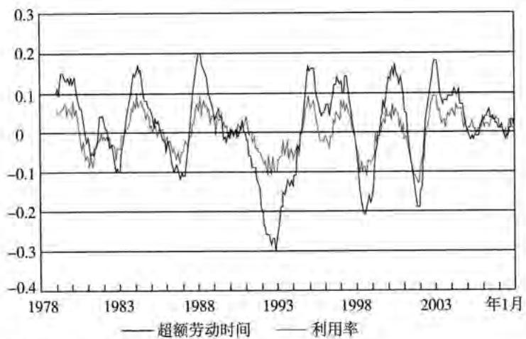  
图11-2制造业的超额劳动时间和资本利用率

注：数据为月度，同比（对数差分）。

（资料来源：月度劳动统计，“资本利用率指数”）

其次是第二项的 $c _ { \iota } \cdot \zeta$ ，其中劳动力的成本份额 $c _ { t }$ 被固定为 $1 - 0 . 2 8 =$ 0.72.问题在于 $\zeta$ ，即劳动力努力水平相对于劳动时间的弹性。关于这一点，由于努力水平无法观测，所以很难从数据中估算出来。实际上，如Basu等（2002）所述，在经济繁荣时期通过主动对劳动力的努力水平支付超额工资来激发更多的努力，这种情况较为少见②。

因此，尽管这个弹性不太可能采取非常大的数值，但也不可能给出一个确定的数值。因此，在下文中，将该值为0时作为基准情况，将其逐渐提高到 $0 . 0 5 , \ 0 . 1 0 , \ 0 . 1 5 \cdots$ ，试图观测TFP预期增长率会发生怎样的变化。然后，拟观测将该值提高到多大时，Hayashi和Prescott（2002）关于20世纪90年代TFP增长率下降的结果会消失。

# 4.2使用的数据

在本分析中，TFP变化率和超额劳动时间变化率为基本数据。TFP变化率数据是从经济产业研究所2008年JIP数据库中得到的年度数据①。该系列数据根据劳动力质量变化的影响进行了调整。JIP数据库将日本经济划分为108个部门(包括公共部门），用于增长核算分析，并对一些汇总的部门进行了同样的分析。

首先分析整个私营部门（在数据库中称为“市场经济”），然后分别分析“制造业”和“非制造业”部门（仅市场经济，不包括住房和未分类部门)。此外，还对非制造业中的每个行业进行了分析。

另一方面，如前所述，超额劳动时间的数据来自于《月度劳动统计》。机构的规模为30人及以上。整个非制造业的超额劳动时间变化率按照属于非制造业（不包括农、林、渔业）的八个行业的加权平均值计算。在加权方面，每个行业在整个非制造业（不包括农、林、渔业）②中的份额根据劳动力调查中的就业人数数据（原行业分类）计算。上一年的份额乘以同比变化率（对数差分），然后相加③④。基于数据可用性，分析所涵盖的时期是1974年至2004年的每一年。起始年是指从JIP数据中获得TFP变化率数据的那一年，结束年是指超额劳动时间数据转换到新序列之前的那一年。

# 4.3 对宏观经济问题的分析

图11-3（1）显示了整个私营经济TFP变化率和超额劳动时间变化率。两者之间的相关系数为0.53，是一个高正值。在这些数字的基础上，TFP净变化率是根据一些假设计算的。重述计算方程如下；

(TFP净变化率)

$\mathbf { \equiv } =$ （表观TFP变化率) $- [ c _ { \kappa } \cdot \frac { \eta } { \omega } + c _ { L } \cdot \zeta ] \times$ （超额劳动时间变化率）

$\equiv$ （表观TFP变化率）- $0 . 2 8 \times 0 . 1 9 + 0 . 7 8 \times \zeta$ ) $\times$ （超额劳动时间变化率）

图11-4显示了当劳动力努力水平对超额劳动时间的弹性 $\zeta$ 以0为基准的情况下，以0.05为单位变化时，TFP净变化率的计算结果是如何变化的。

%  
30.00  
20.00  
10.000.00  
-10.00  
-20.00  
-30.001974 1979 1984 1989 1994 1999 2004年—TFP变化率---超额劳动时间变化率

  
图11-3 TFP变化率(JIP估算值）和超额劳动时间变化率的变化

（资料来源：2008年JP数据库、月度劳动统计）

图11-5（1）以表格形式按年代汇总了上述结果，从表中可以证实，根据JIP数据库，从20世纪80年代到90年代TFP变化率为 $- 1 . 3 \%$ 。与此相对，如果把 $\zeta$ 的值设为O，根据上述方程计算TFP净变化率，即只去除资本利用率的影响时，该变化率缩小至 $- 1 . 0 6 \%$ 。然而，这一变动幅度相对过大。随着假设值的增加，降幅会缩小。即使假设值为0.25，变化率为 $- 0 . 2 3 \%$ ,仍然是负数。为了将这一变化率变为零， $\zeta$ 的假设值必须大于0.25，即必须假定劳动力努力水平比资本利用率更具弹性和可调整性。

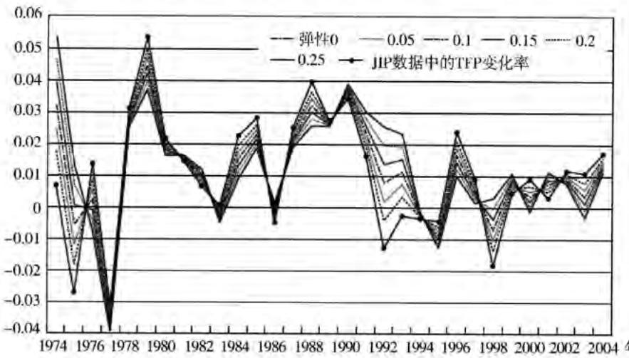  
图11-4 TFP净变化率的计算结果，私营经济  
“弹性” $\Bumpeq$ 劳动力努力水平对超额劳动时间弹性 $\boldsymbol { \zeta }$ 的假设值

# 表11-2TFP净变化率的估算

（表中的“弹性”表示劳动力努力水平对超额劳动时间弹性的假设值）

(1) 私营经济  

<table><tr><td rowspan=1 colspan=1></td><td rowspan=1 colspan=1>JIP估算值</td><td rowspan=1 colspan=1>基准,弹性=0</td><td rowspan=1 colspan=1>0.05</td><td rowspan=1 colspan=1>0.10</td><td rowspan=1 colspan=1>0.15</td><td rowspan=1 colspan=1>0.20</td><td rowspan=1 colspan=1>0.25</td></tr><tr><td rowspan=1 colspan=1>1980—19891990-19992000-2004</td><td rowspan=1 colspan=1>1.81%0.51%1.04%</td><td rowspan=1 colspan=1>1.72%0.66%0.92%</td><td rowspan=1 colspan=1>1.65%0.76%0.84%</td><td rowspan=1 colspan=1>1.59%0.86%0.76%</td><td rowspan=1 colspan=1>1.53%0.96%0.68%</td><td rowspan=1 colspan=1>1.46%1.06%0.60%</td><td rowspan=1 colspan=1>1.40%1.17%1.52%</td></tr><tr><td rowspan=1 colspan=1>90年代—80年代</td><td rowspan=1 colspan=1>-1.30%</td><td rowspan=1 colspan=1>-1.06%</td><td rowspan=1 colspan=1>-0.89%</td><td rowspan=1 colspan=1>-0.73%</td><td rowspan=1 colspan=1>-0.56%</td><td rowspan=1 colspan=1>-0.40%</td><td rowspan=1 colspan=1>-0.23%</td></tr></table>

(2)制造业

<table><tr><td rowspan=1 colspan=1></td><td rowspan=1 colspan=1>JIP估算值</td><td rowspan=1 colspan=1>基准，弹性=0</td><td rowspan=1 colspan=1>0.05</td><td rowspan=1 colspan=1>0.10</td><td rowspan=1 colspan=1>0.15</td><td rowspan=1 colspan=1>0.20</td><td rowspan=1 colspan=1>0.25</td></tr><tr><td rowspan=1 colspan=1>1980-19891990-19992000—2004</td><td rowspan=1 colspan=1>3.07%0.98%2.09%</td><td rowspan=1 colspan=1>2.94%1.18%1.79%</td><td rowspan=1 colspan=1>2.85%1.33%1.59%</td><td rowspan=1 colspan=1>2.76%1.47%1.39%</td><td rowspan=1 colspan=1>2.66%1.61%1.19%</td><td rowspan=1 colspan=1>2.57%1.75%0.99%</td><td rowspan=1 colspan=1>2.48%1.89%0.80%</td></tr><tr><td rowspan=1 colspan=1>90年代—80年代</td><td rowspan=1 colspan=1>-2.10%</td><td rowspan=1 colspan=1>-1.75%</td><td rowspan=1 colspan=1>-1.52%</td><td rowspan=1 colspan=1>-1.29%</td><td rowspan=1 colspan=1>-1.05%</td><td rowspan=1 colspan=1>-0.82%</td><td rowspan=1 colspan=1>-0.59%</td></tr></table>

(3)非制造业

<table><tr><td rowspan=1 colspan=1></td><td rowspan=1 colspan=1>JⅢP估算值</td><td rowspan=1 colspan=1>基准，弹性=0</td><td rowspan=1 colspan=1>0.05</td><td rowspan=1 colspan=1>0.10</td><td rowspan=1 colspan=1>0.15</td><td rowspan=1 colspan=1>0.20</td><td rowspan=1 colspan=1>0.25</td></tr><tr><td rowspan=1 colspan=1>1980—19891990—19992000-2004</td><td rowspan=1 colspan=1>1.17%0.33%0.64%</td><td rowspan=1 colspan=1>1.09%0.50%0.56%</td><td rowspan=1 colspan=1>1.04%0.62%0.52%</td><td rowspan=1 colspan=1>0.99%0.74%0.47%</td><td rowspan=1 colspan=1>0.94%0.86%0.42%</td><td rowspan=1 colspan=1>0.89%0.97%0.37%</td><td rowspan=1 colspan=1>0.83%1.09%0.32%</td></tr><tr><td rowspan=1 colspan=1>90年代—80年代</td><td rowspan=1 colspan=1>-0.84%</td><td rowspan=1 colspan=1>-0.59%</td><td rowspan=1 colspan=1>-0.42%</td><td rowspan=1 colspan=1>-0.25%</td><td rowspan=1 colspan=1>-0.08%</td><td rowspan=1 colspan=1>0.09%</td><td rowspan=1 colspan=1>0.26%</td></tr></table>

资料来源：2008年JIP数据库、笔者计算。

# 4.4 对制造业和非制造业部门进行单独分析

图11-3（2）显示了制造业TFP变化率和超额劳动时间变化率。可以看出，这两者是高度相关的。事实上，两者之间的相关系数约为 $0 . 4 6 _ { \circ }$ 图11-5(2）显示了与图11-5（1）相同的对制造业的分析。首先，根据JIP估算值，制造业TFP变化率在20世纪80年代到90年代之间急速下降约 $- 2 . 1 0 \%$ 如果将此作为劳动力努力水平对超额劳动时间的弹性 $\zeta$ 为0，计算TFP净变化率的话，两个时期间的变动就会大幅缩小为-1. $7 5 \%$ 。如果进一步增大值，下降幅度就会逐渐缩小。但需要注意的是，即使在 $\zeta = 0 . 2 5$ 的情况下，仍然存在 $- 0 . 5 9 \%$ 的差值。

图11-3（3）显示了非制造业TFP变化率和超额劳动时间变化率。与制造业相比，两者之间的相关性不是很高，相关系数为0.28。图11-5（3）显示了与图11-5（1）相同的对非制造业的分析。首先，JIP估算值显示，20世纪90年代该行业TFP变化率的下降相对缓慢（与20世纪80年代相比下降约$0 . 8 4 \%$ )。因此，尽管与超额劳动时间的相关性很小，但在进行调整时，差异会相对迅速地消失。当假设弹性 $\boldsymbol { \zeta }$ 为0时，差异仍为 $- 0 . 5 9 \%$ ，但当这个值增加到0.15时，差异几乎消失。

# 4.5 对非制造业中的每个行业进行分析

本小节将分析细分为构成非制造业（非农业和林业）部门的八个行业。图11-5（1）、（2）、（3）显示了建筑业、批发零售业和服务业的TFP变化率和超额劳动时间变化率，这些行业的劳动力比例最大，不能观测到非常高的相关性。事实上，表11-3显示了每个行业的相关系数，除了服务业外，几乎看不出有任何相关性。根据这些数据，计算了TFP净变化率，但经过调整后，20世纪80年代和90年代的差异在一些行业变得更小，在另一些行业变得更大，无法看到明显的趋势。因此，本文对其结果表不做展示。

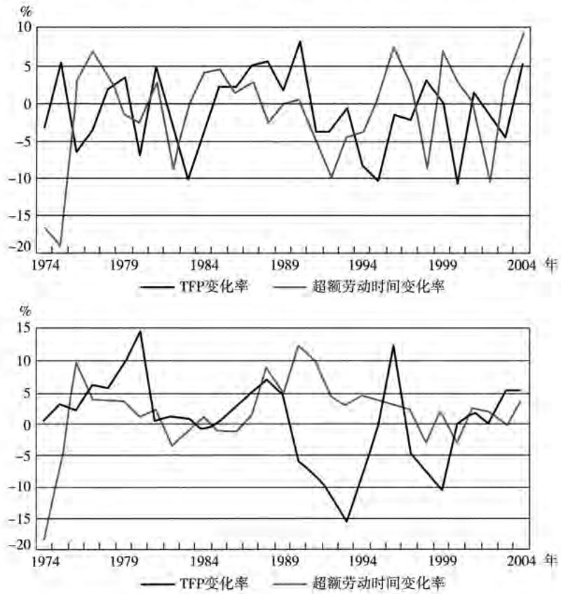

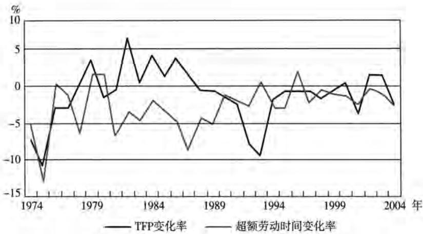  
图11-5 非制造业的TFP变化率（JIP估算值）和超额劳动时间变化率的变化

（资料来源：2008年JIP数据库、月度劳动统计）

表11-3TFP变化率和超额劳动时间变化率的相关系数  

<table><tr><td rowspan=1 colspan=1>行业</td><td rowspan=1 colspan=1>矿业</td><td rowspan=1 colspan=1>建筑业</td><td rowspan=1 colspan=1>水电燃气</td><td rowspan=1 colspan=1>批发零售</td><td rowspan=1 colspan=1>金融保险</td><td rowspan=1 colspan=1>房地产</td><td rowspan=1 colspan=1>运输通信</td><td rowspan=1 colspan=1>服务</td></tr><tr><td rowspan=1 colspan=1>相关系数</td><td rowspan=1 colspan=1>0.095</td><td rowspan=1 colspan=1>0.003</td><td rowspan=1 colspan=1>0.084</td><td rowspan=1 colspan=1>0.077</td><td rowspan=1 colspan=1>-0.018</td><td rowspan=1 colspan=1>-0.071</td><td rowspan=1 colspan=1>-0.060</td><td rowspan=1 colspan=1>0.183</td></tr></table>

资料来源：笔者基于JIP数据库、月度劳动统计计算。

将非制造业归纳为整体时，虽然相关性不强，仍可认为存在相关性，根据超额劳动时间的调整也有其意义。与此相对，当细分为八个行业时，没有看到有意义的结果，其原因现在尚不清楚。一种可能性是，JIP数据库和月度劳动统计中行业分类略有不同，无法很好地建立对应关系。

# 5 跨部门资源配置、生产率和需求转移

在结束本文之前，还想探讨一下现有文献中发现的跨部门资源配置和生产率之间的重要关联。关于这个问题的议论可以归纳为三类。

（1）整个经济的TFP增长率是各部门TFP增长率用多玛权重（Domarweight）进行的加权平均值。因此，如果（给定价格）生产要素向TFP增长率高的部门转移，就可以推高平均TFP增长率。

(2)宫川（2006）以劳动生产率为重点，指出通过不断将生产要素重新配置到TFP增长率高的部门，可以提高劳动生产率。

(3)川本（2004）对每个行业进行了允许收益递增和递减的分析。他的估算结果表明，在20世纪90年代的日本，生产要素从收益递增行业重新配置到收益递减行业是表观TFP增长率下降的主要原因之一。

这些分析的共同特征是制造业的优势。第三产业的TFP增长率一般都很低。表11-4是以2008年JIP数据库为基础制作的制造业和非制造业的TFP变化率的变化图，根据该图，非制造业的TFP变化率几乎一直低于制造业的变化率。而且，根据川本估算，非制造业具有收益递减的性质。因此，20世纪90年代的日本如果将资源从第三产业转移到制造业，应该能够实现更高的生产率。

单位：%

表11-4GDP的行业构成比率变化  

<table><tr><td rowspan=1 colspan=1>类别</td><td rowspan=1 colspan=1>1990年</td><td rowspan=1 colspan=1>2003年</td></tr><tr><td rowspan=1 colspan=1>第二产业制造业</td><td rowspan=1 colspan=1>36.926.7</td><td rowspan=1 colspan=1>27.720.8</td></tr><tr><td rowspan=1 colspan=1>第三产业服务业</td><td rowspan=1 colspan=1>54.816.1</td><td rowspan=1 colspan=1>64.320.9</td></tr></table>

资料来源：国民经济核算。

这样的结论与我们的直观是一致的，但是真的应该这样做吗？这一点还是留下了一丝疑问。

众所周知，在20世纪90年代初期，日本与美国等国家相比，服务业占比较低，当时普遍认为经济服务化滞后是一个问题。表11-4显示，制造业在GDP的占比1990年约为 $2 7 \%$ ，鉴于美国同样的占比已经不到 $17 \%$ ，可以认为这是较高的比率。其后，如表中所示，整个90年代，以制造业为主的第二产业占比下降，2003年制造业所占份额不到 $21 \%$ 。在此期间，美国制造业占比下降到略高于 $12 \%$ ，两者之间的差异并没有多大变化。仅仅关注生产率的增长率，可以得出这样的结论：日本（可能还有其他国家）在整个20世纪90年代应该不断使服务业倒退（当然，将生产率本身视为给定值，若能提高服务业的生产率本身为最佳结果。此外，还存在服务业的生产率是否得到准确测度这一问题，这里我们选择相信具有代表性的现有估算结果）。实际上，很少有经济学家会提出这样的主张。当这种观点在探讨20世纪90年代房地产和批发零售等结构性不景气行业时，是有说服力的，但将其扩大到整个服务业似乎并不合理。这表明，仅从生产率角度讨论跨部门资源配置，忽视了价格的作用，具有一定局限性。

假设政府通过采取经济的“逆服务化”政策，强行将资源转移到制造业部门。在这种情况下，收入确实可能增加。但是，人们既然用增加的收入来购买更多的商品，就会想要享受更好的服务。因此，服务的相对价格将急剧上升，服务部门的要素价格也将上升，最终资源将被吸引回服务部门。

总之，生产率分析在揭示跨部门资源配置问题和指出成本可能是由日本配置中的扭曲造成的方面，作出了重大贡献。然而，当进一步分析如何进行资源配置时，仅仅分析生产率是不够的，还需要分析需求结构。

这可以通过简单的两个部门经济来说明：两个生产部门是M（制造业）和S（服务业）。本文假设商品S的需求收入弹性高于商品M，以反映历史上服务部门的比重随着收入的增加而增加的事实。该经济体有代表性的家庭收支，其效用函数如下：

$$
U _ { \star } = \beta \mathrm { l o g } ( M _ { \star } - \gamma ) + \mathrm { l o g } ( S _ { t } )
$$

常数 $\gamma$ 是一个Stone-Geary类型的效用函数，其中， $M _ { \iota }$ 表示商品M在t期的消费， $S _ { i }$ 表示商品S在t期的消费，常数 $\gamma$ 是非负的。当 $\gamma { > } 0$ 时，对商品S的需求收入弹性大于1，对商品M的需求收入弹性小于1。这种效用函数下的收人消费曲线如图11-6所示。例如Matsuyama（1992）用这种形式的效用函数来分析农业经济向工业经济的转型。假设农产品的消费有一个维持生存的最低水平（Subsistencelevel）。相比之下，上述函数假设工业品有一个维持生存的最低水平，可能看起来有些不自然。但是，如果我们考虑到人们只有在物质需求得到一定程度的满足时，才会对音乐和观光旅游感兴趣，那么上述函数就不会那么不自然了。家庭收支拥有一个单位的劳动力，被分配到商品M和商品S的生产中。分配给前者的比率用 $m$ 表示。每种商品的生产都只使用劳动力，其生产函数分别如下：

$$
M _ { t } = A _ { { \scriptscriptstyle m } _ { t } } \cdot m _ { \scriptscriptstyle t } , S _ { t } = S _ { t } = A _ { s _ { t } } \cdot ( 1 - m _ { \scriptscriptstyle t } )
$$

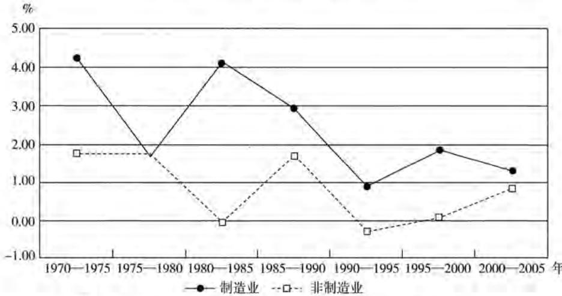  
图11-6制造业与非制造业的TFP变化率比较（根据JIP2008）

  
图11-7 Stone-Geary效用函数下的收入和消费曲线

其中， $A _ { y }$ 和 $A _ { s }$ 是代表每个行业生产率的外生变量。在上述极简方程下，社会计划者的解决方案是通过将生产函数代入代表性家庭收支的效用函数并使其最大化来获得 $m$

$$
U _ { \iota } = \beta \mathrm { l o g } ( A _ { M _ { \iota } } m _ { \iota } - \gamma ) + \mathrm { l o g } ( 1 - m _ { \iota } ) + \mathrm { l o g } ( A _ { s , \iota } )
$$

由此可以得出，

$$
m _ { i } ^ { * } = \frac { \beta A _ { M _ { i } } + \gamma } { ( 1 + \beta ) A _ { M _ { i } } }
$$

这是对商品M的生产率 $A _ { m }$ 的一个递减函数。因此，随着制造业生产率的提高，资源应该从制造业重新配置到服务业。另一方面，人们发现商品S的生产率 $\mathrm { A } _ { s _ { i } }$ 与最佳资源配置无关。从中可以得出以下结论。

（1）如果制造业和服务业的生产率以同样的速度增长，在资源的最佳配置中，生产要素将从制造业转移到服务业。服务业在GDP中的比重就会随着时间的推移而增加。实际GDP增长率与两个行业的生产率增长率相等，不受资源重新配置的影响。

（2）假设现在服务业的生产率增长率比（1）中的情况有所下降，制造业的生产率增长率没有变化。这并不影响资源的优化配置，所以生产要素从制造业向服务业的转移应该与（1）的情况完全一样。然而，这意味着资源将被转移到生产率增长率低的行业，所以用固定基年法（Fixed-BaseMethod）计算的实际GDP增长率将下降（比服务业生产率增长率下降的影响更大）。

(3）如果政府在（2）所述的情况下，根据“生产率标准”采取引导生产要素向制造业转移的政策，这将减缓实际GDP增长率下降。然而，这一政策显然导致了低效资源配置。

这个简单的分析表明，为了对跨部门资源配置得出有力的结论，对需求结构的分析，特别是对需求的收入弹性的分析，是必不可少的。虽然这里没有论及，但每种商品（或服务）的可交易性也可以发挥重要作用。在可交易商品的情况下，价格可被视为由国际市场决定，在这种情况下，上述重视内生价格变化的研究可不做考虑。

将技术进步纳入分析也可能问题变得复杂。服务业的生产率没有提高，可能是因为在此期间没有进行足够的投资，体现新技术的资本设备没有被引进。在这种情况下，在过去生产率增长率低的基础上减少对服务业的投资，会错失生产率增长的机会。

# 6结束语

本文讨论了20世纪80年代以来日本经济的生产率变动。围绕这个问题的现有文献已指出了适当调整生产要素利率的重要性和跨业资源配置问题的重要性。针对这一点，本文虽然依据川本（2004）的方法，但尝试了用略微不同的方法调整生产要素利用率。这种方法得出了以下三个结论。

（1）关于整个私营经济和制造业，除非劳动力努力水平对超额劳动时间的弹性大大增加，否则TFP变化率在20世纪90年代下降的结论似乎不会改变。然而，这并不否认利用率调整的重要性，它在一定程度上缩小了20世纪80年代和90年代之间TFP变化率的差异。

(2）整个非制造业的分析表明，利用率的调整在很大程度上缩小了20世纪80年代和90年代TFP变化率的差异。

(3）然而，对于构成非制造业的具体行业，利用率调整的影响似乎并不显著。本文采用的方法是使用事先编制的TFP变化率的数据，并对其进行调整，可能不如从详细的行业层面积累起来的估算方法准确。本文的结果需要通过这种积累的方式来证实。

关于跨行业资源配置，有人认为，仅靠生产方的分析不足以支撑实现理想配置的议题。特别是，一个简单的模型表明，根据需求结构（家庭收支效用函数的形状），将资源重新配置到生产率增长率较低的行业或将提升效率。这个例子表明，今后必须使用考虑需求方的成熟的宏观经济模型，重新讨论跨行业资源配置问题。

# 参考文献

川本卓司(2004)，日本経済の技術進歩率計測の試み——「修正ソ口一残

差は失わた10年について何を語るか?」『金融研究』第2卷第4 号，pp.147–186.   
宮川努(2006)，「生産性の経済学一我々の理解はどこまで進んだか?」 日本銀行ワーキグペーー，No.07-J-06.   
Basu, Susanto and Miles S. Kimball (1997), "Cyclical productivity with unobserved input variations," NBER Working Paper, 5915.   
Basu, Susanto, John G. Fermald, and Miles S. Kimball (2002), "Are technology improvements contractionary?" Harvard Institute of Economic Research Diseussion Paper, No. 1986.   
Christiano，Lawrence·藤原一平(2006)，「7，過剩投资，時短，失わ机 た10年」日本銀行ワーグペーパーシリーズNO.06-J-8.   
Christiano, Lawrence J., Martin Eichenbaum, and Charles L. Evans (2005), "Nominal Rigidities and the Dynamic Efects of a Shock to Monetary Policy, Journal of Political Economy, 113 (1), pp. 1–45.   
Greenwood, Jeremy, Zvi Hercowitz, and Gregory W. Huffman ( 1998）, "Investment, Capacity Utilization, and the Real Business Cycle,"American Economic Review, 78(3), pp.402–417.   
Hayashi, Fumio and Edward C. Prescott (2002), "The 1990s in Japan: a lost decade,"Review of Economic Dynamics, 5(1), pp.206-235.   
King, Robert G., Charles I. Plosser, and Sergio T. Rebelo ( 1988 ), "Production, growth and business cycles: I. The basic neoclassial model," Journal of Monetary Economics, 21 (2), pp. 195–232.   
Matsuyama, Kiminori (1992 ）,“Agrieultural Productivity, Comparative Advantage, and Economic Growth, Journal of Economic Theory, 58 (2), pp.317–334.   
Sugo,Tomohiro and Kozo Ueda (2008),"Estimating a dynamic stochastic general equilibrium model for Japan," Journal of the Japanese and International Economies, 22(4), pp.476–502.

# 12 日本的均衡实际利率

镰田康一郎

# 导语

估算均衡实际利率的方法多种多样。本文的目的是介绍几种代表性方法的理论背景和具体计算程序，通过应用实际数据来估算日本的均衡实际利率，并试图从“模型选择的不确定性”（即结果因用于估算的模型而有显著差异的问题）和“实时估算问题”（即估算值随数据的修改或增加而变化的问题）这两个角度，来量化均衡实际利率的不确定性。

# 1 前言

均衡实际利率是指使实际产量与潜在产量相一致，从而稳定物价的实际利率。当实际利率超过均衡实际利率时，产量低于潜在水平，导致物价下跌和通货膨胀率下降。相反，当实际利率低于均衡实际利率时，产量超过了潜在水平，导致物价飙升，通货膨胀率上升。有了这些特点，均衡实际利率有望作为中央银行实施利率政策时的一个参考。此外，均衡实际利率被认为是随着经济和潜在增长率而波动的，可以解释为表示经济活动强度的一个指标。

均衡实际利率也称自然利率，长期以来一直受到经济学家的关注。Wick-sell（1898）的“累积过程”观点认为，市场观测到的利率与自然利率相背离时，就会引起物价飙升或下跌。这一观点是该领域的先驱，也是最重要的理论贡献。进入20世纪90年代，均衡实际利率重新成为人们关注的焦点，部分原因是新凯恩斯主义学派在货币政策分析领域的创新，同时，更多的国家采用了被称为通货膨胀目标的政策框架①。特别是在美国，美联储经济学家如Bomfim(1997）、Orphanides 和 Williams(2002）、Laubach 和 Williams（2003）、Clark和Kozicki（2005）等人一直在积极研究均衡实际利率的测量问题。相比之下，除了小田、村永（2003）之外，日本的测量实例非常少。

均衡实际利率有各种估算方法，从使用HP滤波器（Hodrick和Prescott，1997）获得实际利率趋势的简单方法，到通过具有微观基础的经济学模型来获得价格完全弹性时的实际利率模型，即DSGE（DynamicStochasticGeneralEquilibrium）模型，估算方法林林总总，各有利弊，对于如何测量均衡实际利率并没有一个共识。不同测量方法之间的巨大差异是均衡实际利率在实际政策管理中没有被积极使用的原因之一。本文的目的是用各种方法估算日本的均衡实际利率，并从不确定性的角度重点考察其有用性。

本文主要结构如下。第二节介绍了一种使用以HP滤波器为代表的“低通滤波器”（Low-PassFilter）提取实际利率趋势，将其视为均衡实际利率的方法。第三节介绍了劳巴赫—威廉姆斯（Laubach-Williams）从菲律普斯曲线和IS曲线估算均衡实际利率的方法及相关改进尝试。第四节介绍了使用HK滤波器（Hirose-Kamada滤波器）估算NAILO（Non-AcceleratingInflationLev-elofOutput）（镰田、广濑，2003），并以此为基础估算均衡实际利率的方法。与此同时，还解释了NAIRI（Non-Accelerating Inflation Rate ofInterest），一种剔除通货膨胀率因素的实际利率（镰田，2005）。第五节解释了使用结构性VAR估算均衡实际利率的方法。第六节利用DSGE模型计算均衡实际利率，即完全弹性价格环境下的实际利率。第七节总结了用各种方法估算的均衡实际利率，并讨论了自20世纪80年代以来日本的经济形势和金融环境。第八节得出结论。

# 2低通滤波器

一般来说，时间序列数据可以表示为不同长度的波的加权平均值。长波被称为低频，而低通滤波器是一种从时间序列数据中提取低频的滤波器。HP滤波器是低通滤波器的一种类型，在经济学中经常被用于提取时间序列趋势。测量均衡实际利率最简单的方法是使用这种低通滤波器提取实际利率的趋

势，并将其视为均衡实际利率①。

通过过滤实际利率来类比均衡值的方法是有充分理由的。如果中央银行面临物价上涨和需求过剩时不断提高政策利率，面临物价下跌和供给过剩时降低政策利率，那么实际利率将因此而围绕均衡实际利率波动。换言之，均衡实际利率应该是实际利率的趋势。

为了得到具体的印象，参见以下泰勒规则（Taylor，1993）。

$$
i _ { , } = r _ { , } ^ { * } + \pi _ { , } + \alpha _ { \pi } ( \pi _ { t } - \pi ^ { * } ) + \alpha _ { , } x _ { t }
$$

其中，i是作为政策利率的名义短期利率，π是通货膨胀率，π是目标通货膨胀率，x是供需缺口，r是均衡实际利率(t是与时间有关的下标)②。简便起见，如果我们用当期通货膨胀率（π）代替下期预期通货膨胀率，可以得到：

$$
r _ { i } = r _ { i } ^ { * } + \alpha _ { \pi } ( \pi , - \pi ^ { * } ) + \alpha _ { s } x _ { i }
$$

其中，r是实际短期利率。鉴于右边第二项和第三项对应的是周期性成分，如果对实际利率进行过滤，应该得到右边第一项中的均衡实际利率。

本节介绍三个在经济学实证分析中比较常见的滤波器：BK滤波器（Bax-ter和King，1999）、HP滤波器和 ES（Exponential Smoothing）滤波器（King和Rebelo, 1989)。

# 2.1 BK滤波器

BK滤波器假设一个时间序列由三个部分组成：趋势成分（trend）、周期性成分（eycle）、误差（noise）。每个部分对应一个长、中、短周期波。Bax-ter-King为了提取经济周期，参考Burns和Mitchell（1946）的经典研究，将与周期性成分相对应的周期定义为6-32个季度，周期更长的为趋势成分，周期更短的为误差。BK滤波器的设计是为了尽可能准确提取这些成分。例如，如果把提取周期超过p的成分的滤波器表示为{α $\left\{ a _ { h } \right\} \frac { K } { 0 } = \frac { h } { - K }$ 7 均衡实际利率可以计算如下：

$$
r _ { i } ^ { * } = \sum _ { n = - K } ^ { K } a _ { h } r _ { r + h }
$$

$$
a _ { h } = b _ { h } + \theta \mathrm { f o r } h = 0 , \pm 1 , \pm 2 , \cdots , \pm K
$$

$$
\theta = \frac { 1 - \displaystyle \sum _ { h = - K } ^ { K } b _ { h } } { 2 K + 1 }
$$

$$
\omega = \frac { 2 \pi } { p _ { R K } }
$$

其中， $K$ 是一个决定滤波器长度的参数。Baxter-King推荐 $K = 1 2$

不能保证经济周期的长度在日本和美国是一样的。根据日本内阁府公布的《景气基准日期》，日本战后经济周期最短为31个月（第8周期：1975年3月—1977年10月），最长为83个月（第11周期：1986年11月—1993年10月）（平均：50个月，17个季度）。因此，就日本而言，可以将周期为10-28个季度的波视为经济周期，而周期更长的波视为趋势。

“利率缺口”，即实际利率减去均衡实际利率，相当于实际利率的周期性成分，被认为代表中央银行的政策立场。利率政策的目的是通过平衡经济来稳定物价，政策立场的跨度很少超过经济周期。因此，可以认为实际利率的周期性成分的周期几乎与经济周期相同，或比经济周期短。

接下来，考虑 $p _ { B K }$ 的选择。一种选择是使用最长的周期，设置 $p _ { B K } = 2 8$ c然而，持续长达28个季度（即7年）的经济周期并不会多次出现。因此，28个季度周期的波中可纳入实际利率的周期性成分的比例应该是很小的。在时间序列分析中，衡量一个给定周期的波有多大比例通过滤波器的指标被称为“增益（GAIN）”。对于一个PBk=28的BK滤波器，28个季度周期的波的增益是44%。这意味着在这个滤波器的作用下，构成实际利率的28个季度周期的波中，可纳入周期性成分的比例高达56%。为了减少这一比例，PB取小值即可。例如，如果pBk=18，则28个季度周期的波中纳入周期性成分的比例就可以减少到 $10 \%$ 。

# 2.2 HP滤波器和ES滤波器

HP滤波器假设某个时间序列由趋势成分（趋势）和周期性成分（周期）两个成分组成。另外，默认趋势只会“平滑”地变化，原序列不会与趋势有很大的背离（即周期性成分占比不会变得非常大）。为了平衡这两个条件，HP滤波器提取使以下方程最小化的 $_ r \cdot$ 作为趋势。

$$
V _ { H P } \equiv \sum _ { t = 1 } ^ { T } { ( r _ { t } - r _ { t } ^ { * } ) ^ { 2 } } + \lambda _ { H P } \sum _ { t = 2 } ^ { T - 1 } { ( \Delta r _ { t + 1 } ^ { * } - \Delta r _ { t } ^ { * } ) ^ { 2 } }
$$

其中， $\lambda _ { \mathfrak { \eta } \mathfrak { p } }$ 是一个被称为“平滑度”的参数，由分析人员作为外生变量给出①。

ES滤波器看似与HP滤波器类似，实则完全不同。它将使以下方程最小化的 $r ^ { * }$ 定义为趋势。

$$
V _ { E S } \equiv \sum _ { t = 1 } ^ { T } ( r _ { t } - r _ { t } ^ { \ast } ) ^ { 2 } + \lambda _ { E S } \sum _ { t = 1 } ^ { T - 1 } ( r _ { t + 1 } ^ { \ast } - r _ { t } ^ { \ast } ) ^ { 2 }
$$

这就用趋势只会“逐渐”地变化的条件取代了趋势只会“平滑”地变化这一HP滤波器的条件。一般来说，当趋势为Ⅰ（2）时，最好使用HP滤波器，当趋势为Ⅰ（1）时，最好使用ES滤波器。由于均衡实际利率被认为是I(1）或I(O)，最好使用ES滤波器进行估算。

当然，也可以计算HP滤波器和ES滤波器的增益（Kaiser和Marayall,2001)。表12-1显示了不同λm和λs下增益为10%、50%和90%的波段。对于HP滤波器，我们看到当λ=1600时，只有10%的23个季度周期的波通过了HP滤波器。这意味着大多数比较持久的实际利率变动的波都包括在周期性成分中。因此，我们选择一个较小的λm。例如，当λ=50时，29个季度周期的波中纳入周期性成分的比例可以削减到10%。使用ES滤波器的情况下，当λs=2时，27个季度周期的波中包括在周期性成分中的比例也可以削减到10%。

表12-1 HP滤波器和 ES滤波器的增益  

<table><tr><td rowspan=1 colspan=4>HP滤波器</td><td rowspan=1 colspan=4>ES滤波器</td></tr><tr><td rowspan=1 colspan=1>λnP</td><td rowspan=1 colspan=1>10%</td><td rowspan=1 colspan=1>50%</td><td rowspan=1 colspan=1>90%</td><td rowspan=1 colspan=1>AES</td><td rowspan=1 colspan=1>10%</td><td rowspan=1 colspan=1>50%</td><td rowspan=1 colspan=1>90%</td></tr><tr><td rowspan=1 colspan=1>1</td><td rowspan=1 colspan=1>3</td><td rowspan=1 colspan=1>6</td><td rowspan=1 colspan=1>11</td><td rowspan=1 colspan=1>1</td><td rowspan=1 colspan=1>-</td><td rowspan=1 colspan=1>6</td><td rowspan=1 colspan=1>19</td></tr><tr><td rowspan=1 colspan=1>2</td><td rowspan=1 colspan=1>4</td><td rowspan=1 colspan=1>7</td><td rowspan=1 colspan=1>13</td><td rowspan=1 colspan=1>2</td><td rowspan=1 colspan=1>-</td><td rowspan=1 colspan=1>6</td><td rowspan=1 colspan=1>27</td></tr><tr><td rowspan=1 colspan=1>10</td><td rowspan=1 colspan=1>6</td><td rowspan=1 colspan=1>11</td><td rowspan=1 colspan=1>19</td><td rowspan=1 colspan=1>10</td><td rowspan=1 colspan=1>6</td><td rowspan=1 colspan=1>20</td><td rowspan=1 colspan=1>60</td></tr><tr><td rowspan=1 colspan=1>50</td><td rowspan=1 colspan=1>9</td><td rowspan=1 colspan=1>17</td><td rowspan=1 colspan=1>29</td><td rowspan=1 colspan=1>50</td><td rowspan=1 colspan=1>15</td><td rowspan=1 colspan=1>44</td><td rowspan=1 colspan=1>133</td></tr><tr><td rowspan=1 colspan=1>100</td><td rowspan=1 colspan=1>11</td><td rowspan=1 colspan=1>20</td><td rowspan=1 colspan=1>34</td><td rowspan=1 colspan=1>100</td><td rowspan=1 colspan=1>21</td><td rowspan=1 colspan=1>63</td><td rowspan=1 colspan=1>188</td></tr><tr><td rowspan=1 colspan=1>1000</td><td rowspan=1 colspan=1>20</td><td rowspan=1 colspan=1>35</td><td rowspan=1 colspan=1>61</td><td rowspan=1 colspan=1>1000</td><td rowspan=1 colspan=1>66</td><td rowspan=1 colspan=1>199</td><td rowspan=1 colspan=1>596</td></tr><tr><td rowspan=1 colspan=1>1600</td><td rowspan=1 colspan=1>23</td><td rowspan=1 colspan=1>40</td><td rowspan=1 colspan=1>69</td><td rowspan=1 colspan=1>1600</td><td rowspan=1 colspan=1>84</td><td rowspan=1 colspan=1>251</td><td rowspan=1 colspan=1>754</td></tr><tr><td rowspan=1 colspan=1>4000</td><td rowspan=1 colspan=1>29</td><td rowspan=1 colspan=1>50</td><td rowspan=1 colspan=1>87</td><td rowspan=1 colspan=1>4000</td><td rowspan=1 colspan=1>132</td><td rowspan=1 colspan=1>397</td><td rowspan=1 colspan=1>1192</td></tr><tr><td rowspan=1 colspan=1>10000</td><td rowspan=1 colspan=1>36</td><td rowspan=1 colspan=1>63</td><td rowspan=1 colspan=1>109</td><td rowspan=1 colspan=1>10000</td><td rowspan=1 colspan=1>209</td><td rowspan=1 colspan=1>628</td><td rowspan=1 colspan=1>1885</td></tr><tr><td rowspan=1 colspan=1>100000</td><td rowspan=1 colspan=1>64</td><td rowspan=1 colspan=1>112</td><td rowspan=1 colspan=1>194</td><td rowspan=1 colspan=1>100000</td><td rowspan=1 colspan=1>662</td><td rowspan=1 colspan=1>1987</td><td rowspan=1 colspan=1>5961</td></tr><tr><td rowspan=1 colspan=1>400000</td><td rowspan=1 colspan=1>91</td><td rowspan=1 colspan=1>158</td><td rowspan=1 colspan=1>274</td><td rowspan=1 colspan=1>400000</td><td rowspan=1 colspan=1>1325</td><td rowspan=1 colspan=1>3974</td><td rowspan=1 colspan=1>11922</td></tr></table>

# 2.3 估算结果

图12-1显示了使用三个低通滤波器估算的均衡实际利率①。图中细实线是实际利率，粗实线是用BK滤波器（PBk=18）估算的值，虚线是用HP滤波器（^=50）估算的值，点划线是用ES滤波器（λs=2）估算的值②。用ES滤波器估算的均衡实际利率的振幅比其他两个估算值大。然而，自20世纪90年代后期以来，使用哪种滤波器的结果都没有明显的差异，而且均衡实际利率与实际利率之间的差异几乎为零。这是因为这里使用的三个滤波器的基本功能是计算实际利率的移动平均值，因此，如果实际利率稳定在一个低水平，均衡实际利率的估算值也会稳定在一个低水平。

  
图12-1基于低通滤波器的均衡实际利率

将20世纪90年代后期的实际利率趋势视为均衡实际利率也是不合理的。在资产泡沫破灭后，日本银行实施了几轮货币宽松政策，最终在1999年采取了“零利率政策”，在2001年采取了“量化宽松政策”。当货币政策面临零利率约束时，实际利率等于通货紧缩率，不再反映中央银行的意图。如果中央银行不能自由控制政策利率，那么均衡实际利率就不能从实际利率中类推出来①。

# 3 Laubach-Williams 模型及其改进

本节介绍均衡实际利率的估算方法，即在方程中明确编人“使供需一致，稳定物价的实际利率”这一均衡实际利率定义。Laubach和Williams(2003）是这一尝试的代表，他们用卡尔曼滤波器从菲利普斯曲线和IS曲线中估算出潜在产出和均衡实际利率等不可观测的变量。然而，众所周知，由于他们的方法估算均衡实际利率的结果太不确定和不稳定，无法用于实际政策环境。本节还介绍了Clark和Kozicki（2005）模型，它试图从实际角度改进Laubach-Williams模型。

# 3.1 Laubach-Wiliams模型

Laubach 和Wiliams（2003）考虑了以下菲利普斯曲线和IS曲线。

$$
\begin{array} { c } { { \displaystyle \pi _ { t } = b _ { 1 } \pi _ { t - 1 } + b _ { 2 } \sum _ { i = 2 } ^ { 4 } \frac { \pi _ { t - i } } { 3 } + \left( 1 - b _ { 1 } - b _ { 2 } \right) \sum _ { i = 5 } ^ { 8 } \frac { \pi _ { t - i } } { 4 } } } \\ { { + k ( y _ { t - 1 } - y _ { t - i } ^ { * } ) + b _ { 3 } ( \pi _ { t } ^ { t } - \pi _ { t } ) + b _ { 4 } ( \pi _ { t } ^ { o } - \pi _ { i } ) + \varepsilon _ { t } ^ { n } } } \\ { { y _ { t } = y _ { t } ^ { * } + a _ { 1 } ( y _ { t - 1 } - y _ { t - 1 } ^ { * } ) + a _ { 2 } ( y _ { t - 2 } - y _ { t - 2 } ^ { * } ) } } \\ { { - \frac { s ( r _ { t - 1 } - r _ { t - 1 } ^ { * } + r _ { t - 2 } - r _ { t - 2 } ^ { * } ) } { 2 } + \varepsilon _ { t } ^ { n } } } \end{array}
$$

其中，π是一般物价通货膨胀率，π是进口物价通货膨胀率，π是原油价格通货膨胀率。同时，y是实际产出，y是潜在产出，供需缺口由x=y-y定义。ε”与是误差项。需要注意的是，每个方程都对应于供需缺口和均衡实际利率的定义②。在方程（12.7）中，影响供需缺口的是过去六个月的平均利率缺口，并且假设供需缺口是粘性波动的①。

上述方程中的 $y ^ { * }$ 和 $r ^ { \cdot }$ 是不可观测的变量，他们的估算通常是用卡尔曼滤波器完成的。为了使用卡尔曼滤波器，需要事先对这两个变量的行为进行建模。在Laubach-Williams模型中，使用了以下方程。

$$
y _ { i } ^ { * } = y _ { i - 1 } ^ { * } + g _ { i - 1 } + \varepsilon _ { i } ^ { y , * }
$$

$$
\begin{array} { r } { \boldsymbol { g } _ { t } = \boldsymbol { g } _ { t - 1 } + \boldsymbol { \varepsilon } _ { t } ^ { g } } \end{array}
$$

$$
r _ { t } ^ { * } = c g _ { t } + z _ { t }
$$

$$
z _ { t } = z _ { t - 1 } + \varepsilon _ { t } ^ { s }
$$

其中、 $\varepsilon ^ { \gamma \bullet }$ 是对潜在增长率的临时冲击。 $_ { g }$ 代表潜在增长率的趋势，而创新是对潜在增长率的永久冲击。是影响均衡实际利率水平的所有其他因素（如时间偏好率）的总和。在本文中，假设创新对有永久性影响，但也可以假设是一个稳态过程。

Laubach-Williams模型的一个特点是，它假设了潜在增长率和均衡实际利率之间的关系，用方程（12.10）表达。在新古典增长理论中，如果 $\sigma$ 是不同时间点之间的消费替代弹性，θ是时间偏好率，那么实际利率r和人均消费增长率g之间就建立了r=g、σ+θ的关系。方程（12.10）将其替换为均衡实际利率和潜在增长率的关系，其中，c对应不同时间点之间消费替代弹性的倒数（或相对风险厌恶），对应时间偏好率。

将方程（12.10）代人方程（12.7）中，可以用卡尔曼滤波器得到状态变量 $y ^ { * }$ $_ { g }$ 和 $z$ ，方程（12.6）和（12.7）为观测方程，方程（12.8）、（12.9）和（12.11）为状态方程。其他参数可以用极大似然法来估算。最后，将得到的 $c , \ g$ 和 $z$ 估算值代入方程（12.10），即得到均衡实际利率的估算值。

# 3.2 Clark-Kozicki的改良

正如Laubach和Williams（2003）本身所述，他们对均衡实际利率的估算结果过于不确定和不稳定，无法在实际的政策环境中使用。这有各种可能的原因，但人们经常指出的是，潜在增长率和均衡实际利率之间假设的方程（12.10）与实际数据不一致②。当c的估算值变成负值或非常接近零时，这个问题就表现出来了。鉴于这些事实，Clark和Kozicki（2005）建议打破潜在增长率和均衡实际利率之间的关系（即 $c = 0$ )。这意味着方程（12.10）和方程(12.11）被以下方程所取代。

$$
r _ { t } ^ { * } = r _ { t - 1 } ^ { * } + \varepsilon _ { t } ^ { \prime * }
$$

在这种情况下，可以用卡尔曼滤波器得到状态变量y、g和r，方程（12.6）和（12.7）为观测方程，方程（12.8)、（12.9)和（12.12)为状态方程。其他参数可以用极大似然法来估算。这个改进的模型在下文中被称为Clark-Kozicki I

此外，Clark和Kozicki（2005）提出了以下改进。假设现在供需缺口数值由另一个数据源给出。例如，美国由国会预算办公室（Congressional BudgetOfice，简称“CBO”）估算了供需缺口数值。日本由日本银行估算了一个相对长期的GDP缺口（实际GDP与潜在平的偏差）数值。如果设为 $_ x$ ，方程(12.7) 可以改写成以下方程。

$$
x _ { i } = a _ { 1 } x _ { i - 1 } + a _ { 2 } x _ { i - 2 } - { \frac { s ( r _ { i - 1 } - r _ { i - 1 } ^ { * } + r _ { t - 2 } - r _ { i - 2 } ^ { * } ) } { 2 } } + \varepsilon _ { t } ^ { x }
$$

在这种情况下，不再需要菲利普斯曲线来估算均衡实际利率。因此，如果方程（12.13）为观测方程，方程（12.12）为状态方程，则可使用卡尔曼滤波器求得状态变量r。其他参数可以用极大似然法来估算。这个改进的模型在下文中被称为Clark-KozickiI。

# 3.3估算结果

卡尔曼滤波器通常被用来估算Laubach-Williams模型和Clark-Kozicki模型。在这种情况下，创新g和z的标准偏差有时被估算为零。这被称为“堆积（ ${ \mathrm { p i l e } } - \mathbf { u } { \mathrm { p } }$ ）问题”，在使用卡尔曼滤波器时经常会遇到。在本文中，Laubach-Williams模型中的 $z$ 和Clark-Kozicki模型（I和Ⅱ）的 $r ^ { * }$ 也出现了堆积问题。为此，按照Laubach和Williams（2003）的做法，使用Stock和Watson（1998）的MedianUnbisased Estimator（MUE）来获得这些创新变量的标准偏差①。

表12-2总结了卡尔曼滤波器估算的结果。无论哪种模型下，菲利普斯曲线和IS曲线都满足所有理论上预期的符号条件。图12-2显示了均衡实际利率的估算值①。在图中，细实线是实际利率，粗实线是Laubach-Williams模型的估算结果，虚线是Clark-KozickiI模型的估算结果，点划线是Clark-KozickiⅡ1模型的估算结果。与上一节的估算结果相比，均衡实际利率的特点是偏离实际利率，波动较大。这意味着用本节的方法得到的均衡实际利率捕捉到的波的周期比上一节更长。

表12-2Laubach-Williams模型和Clark-Kozicki模型的估算结果  

<table><tr><td rowspan=2 colspan=1>指标</td><td rowspan=1 colspan=2>Laubach-Williams</td><td rowspan=1 colspan=2>Clark-Kozicki I</td><td rowspan=1 colspan=2>Clark-Kozicki 11</td></tr><tr><td rowspan=1 colspan=1>推计值</td><td rowspan=1 colspan=1>值</td><td rowspan=1 colspan=1>推计值</td><td rowspan=1 colspan=1>1值</td><td rowspan=1 colspan=1>推计值</td><td rowspan=1 colspan=1>t值</td></tr><tr><td rowspan=1 colspan=1>$a1$</td><td rowspan=1 colspan=1>0.63</td><td rowspan=1 colspan=1>2.75</td><td rowspan=1 colspan=1>0.68</td><td rowspan=1 colspan=1>3.07</td><td rowspan=1 colspan=1>1.38</td><td rowspan=1 colspan=1>16.88</td></tr><tr><td rowspan=1 colspan=1>$\{}$</td><td rowspan=1 colspan=1>0.11</td><td rowspan=1 colspan=1>1.06</td><td rowspan=1 colspan=1>0.06</td><td rowspan=1 colspan=1>0.51</td><td rowspan=1 colspan=1>-0.42</td><td rowspan=1 colspan=1>-5.15</td></tr><tr><td rowspan=1 colspan=1>s</td><td rowspan=1 colspan=1>0.04</td><td rowspan=1 colspan=1>1.43</td><td rowspan=1 colspan=1>0.04</td><td rowspan=1 colspan=1>1.41</td><td rowspan=1 colspan=1>0.03</td><td rowspan=1 colspan=1>1.85</td></tr><tr><td rowspan=1 colspan=1>$61}</td><td rowspan=1 colspan=1>0.24</td><td rowspan=1 colspan=1>2.26</td><td rowspan=1 colspan=1>0.25</td><td rowspan=1 colspan=1>2.48</td><td rowspan=1 colspan=1></td><td rowspan=1 colspan=1></td></tr><tr><td rowspan=1 colspan=1>$b2$</td><td rowspan=1 colspan=1>0.67</td><td rowspan=1 colspan=1>3.55</td><td rowspan=1 colspan=1>0.64</td><td rowspan=1 colspan=1>3.64</td><td rowspan=1 colspan=1></td><td rowspan=1 colspan=1></td></tr><tr><td rowspan=1 colspan=1>k</td><td rowspan=1 colspan=1>2.96</td><td rowspan=1 colspan=1>1.75</td><td rowspan=1 colspan=1>2.69</td><td rowspan=1 colspan=1>1.79</td><td rowspan=1 colspan=1></td><td rowspan=1 colspan=1></td></tr><tr><td rowspan=1 colspan=1>$b3}</td><td rowspan=1 colspan=1>0.01</td><td rowspan=1 colspan=1>0.98</td><td rowspan=1 colspan=1>0.01</td><td rowspan=1 colspan=1>1.01</td><td rowspan=1 colspan=1></td><td rowspan=1 colspan=1></td></tr><tr><td rowspan=1 colspan=1>b</td><td rowspan=1 colspan=1>0.01</td><td rowspan=1 colspan=1>4.06</td><td rowspan=1 colspan=1>0.01</td><td rowspan=1 colspan=1>4.08</td><td rowspan=1 colspan=1></td><td rowspan=1 colspan=1></td></tr><tr><td rowspan=1 colspan=1>e</td><td rowspan=1 colspan=1>0.86</td><td rowspan=1 colspan=1>2.05</td><td rowspan=1 colspan=1></td><td rowspan=1 colspan=1></td><td rowspan=1 colspan=1></td><td rowspan=1 colspan=1></td></tr><tr><td rowspan=1 colspan=1>σ()</td><td rowspan=1 colspan=1>0.44</td><td rowspan=1 colspan=1>2.66</td><td rowspan=1 colspan=1>0.48</td><td rowspan=1 colspan=1>2.81</td><td rowspan=1 colspan=1>0.43</td><td rowspan=1 colspan=1>12.55</td></tr><tr><td rowspan=1 colspan=1>σ(e)</td><td rowspan=1 colspan=1>1.50</td><td rowspan=1 colspan=1>5.26</td><td rowspan=1 colspan=1>1.54</td><td rowspan=1 colspan=1>6.05</td><td rowspan=1 colspan=1></td><td rowspan=1 colspan=1></td></tr><tr><td rowspan=1 colspan=1>σ(ε)</td><td rowspan=1 colspan=1>0.67</td><td rowspan=1 colspan=1>5.33</td><td rowspan=1 colspan=1>0.65</td><td rowspan=1 colspan=1>4.79</td><td rowspan=1 colspan=1></td><td rowspan=1 colspan=1></td></tr><tr><td rowspan=1 colspan=1>σ()</td><td rowspan=1 colspan=1>0.23</td><td rowspan=1 colspan=1>3.00</td><td rowspan=1 colspan=1>0.23</td><td rowspan=1 colspan=1>2.74</td><td rowspan=1 colspan=1></td><td rowspan=1 colspan=1></td></tr><tr><td rowspan=1 colspan=1>σ(ε)</td><td rowspan=1 colspan=1>0.92</td><td rowspan=1 colspan=1></td><td rowspan=1 colspan=1></td><td rowspan=1 colspan=1></td><td rowspan=1 colspan=1></td><td rowspan=1 colspan=1></td></tr><tr><td rowspan=1 colspan=1>σ(ε)</td><td rowspan=1 colspan=1></td><td rowspan=1 colspan=1></td><td rowspan=1 colspan=1>1.17</td><td rowspan=1 colspan=1></td><td rowspan=1 colspan=1>0.75</td><td rowspan=1 colspan=1></td></tr><tr><td rowspan=1 colspan=1>MUE</td><td rowspan=1 colspan=2>$λ₂=0.065</td><td rowspan=1 colspan=2>入,,=0.064</td><td rowspan=1 colspan=2>λ,.=0.042</td></tr></table>

注： $\lambda _ { s } ~ = ~ ( \sigma ( \varepsilon ^ { \prime } ) / \sigma ( \varepsilon ^ { \prime } ) ) s / \sqrt { 2 }$ , $\lambda _ { r ^ { * } } ~ = ~ ( \sigma ( \varepsilon ^ { r ^ { * } } ) / \sigma ( \varepsilon ^ { y } ) ) { s } / { \sqrt { 2 } } _ { \mathrm { ~ \tiny ~ 0 ~ } }$

  
图12-2 基于Laubach-Willams模型和Clark-Kozicki模型的均衡实际利率

需要注意的是，这里的结果不一定是稳定的，因为它们对各种设置都很敏感，如参数默认值、状态变量默认值、方差和协方差矩阵默认值。Laubach-Williams本人指出，对均衡实际利率的估算并不实用，因为它们太不确定。在日本使用时，情况也是如此，应该充分认识到这里得到的估算结果是相当不稳定的。例如，通常认为消费的利率弹性值在1左右是理想的，本研究中基于Laubach-Williams模型的估算值为0.86，接近1。然而，如果样本期稍有改变，消费的利率弹性估算值会变得极小，甚至是负值。当消费的利率弹性较小时，均衡实际利率估算值的波动会异常增加，导致均衡实际利率的不确定性进一步增加。

# 4 NAILO和NAIRI

如实证结果所示，Laubach-Williams模型和Clark-Kozicki模型提取了相对长周期的实际利率变化的波作为均衡实际利率。正如第二节所指出的，货币政策立场变化的周期长于经济周期的事实与中央银行的政策目标和工具不一致。得到这一结果的原因可能在于Laubach-Williams模型与Clark-Kozicki模型是用卡尔曼滤波器估算的。

本节用HK滤波器代替卡尔曼滤波器来估算模型。有了这个滤波器，就像HP滤波器和ES滤波器一样，在计算潜在产出和均衡实际利率时，可以指定和提取具有特定周期的波，例如比卡尔曼滤波器更短周期的波。此外，为了用卡尔曼滤波器获得合理的估算值，在设置参数、状态变量、方差与协方差矩阵等的默认值时，必须使其保持协调稳定，而HK滤波器正是在默认值设置上具有稳定的优势。

本节介绍了镰田、广濑（2003）导入的基于NAILO的估算方法，它将同一方法扩展到均衡实际利率的估算。接下来，跳过NAILO的估算，引人一个被称为NAIRI的均衡实际利率，直接从通货膨胀率和利率缺口的关系中估算均衡实际利率。

# 4.1 基于NAILO的均衡实际利率

考虑以下菲利普斯曲线和IS曲线。

$$
\begin{array} { r l } {  { \pi _ { i } = \sum _ { i } b _ { i } \pi _ { i - i } + k ( y _ { i } - y _ { i } ^ { * } ) + \varepsilon _ { i } ^ { \pi } , \sum _ { i } b _ { i } = 1 } } \\ & { \Rightarrow \Delta \pi _ { i } = \sum _ { i } d _ { i } \Delta \pi _ { i - i } + k ( y _ { i } - y _ { i } ^ { * } ) + \varepsilon _ { i } ^ { \pi } } \\ & { \quad \quad x _ { i } = \sum _ { i } a _ { i } x _ { i - i } - s ( r _ { i - 1 } - r _ { i - 1 } ^ { * } ) + \varepsilon _ { i } ^ { \pi } . } \end{array}
$$

其中， $x \equiv y - y ^ { * }$ 。镰田、广濑模型将方程（12.14）中的 $y ^ { * }$ 特别称为NAILO。这里的模型在潜在增长率和均衡实际利率之间没有施加限制，因此，可以认为与上一节介绍的Clark-Kozickil模型具有基本相同的结构。ε”和$\varepsilon ^ { * }$ 为误差项。

HIK滤波器是为了使以下的评价函数最小化，决定y、 $r ^ { * }$ ，以及菲利普斯曲线和IS曲线的参数。

$$
V _ { r n } = \sum _ { t = 1 } ^ { T } \left[ \Delta \pi _ { t } - \sum _ { i } d _ { i } \Delta \pi _ { i - i } - k ( y _ { \gamma } - y _ { i } ^ { \star } ) \right] ^ { 2 } + \lambda _ { \rho \mu } \sum _ { t = 2 } ^ { r - 1 } \left( \Delta y _ { i } ^ { \star } - \Delta y _ { i - 1 } ^ { \star } \right)
$$

$$
V _ { I S } \equiv \sum _ { i = 1 } ^ { r } \left[ x _ { i } - \sum _ { i } a _ { i } x _ { i - 1 } + s ( r _ { i - 1 } - r _ { i - 1 } ^ { * } ) \right] ^ { 2 } + \lambda _ { I S } \sum _ { i = 2 } ^ { T } ( r _ { i } ^ { * } - r _ { i - 1 } ^ { * } ) ^ { 2 }
$$

这些评价函数与 $\mathrm { H P }$ 滤波器和ES滤波器类似，可以转化为以下方程：

$$
\bar { V } _ { p q } \equiv \frac { \hat { V } _ { p q } } { k ^ { 2 } } = \sum _ { i = 1 } ^ { T } \left( \tilde { \gamma } _ { i } - \gamma _ { i } ^ { * } \right) ^ { 2 } + \bar { \lambda } _ { P H } \sum _ { i = 2 } ^ { T - 1 } \left( \Delta \gamma _ { i } ^ { * } - \Delta \gamma _ { i - 1 } ^ { * } \right) ^ { 2 }
$$

$$
\bar { V } _ { I S } \equiv \frac { { V } _ { I S } } { s ^ { 2 } } = \sum _ { i = 1 } ^ { T } \big ( \bar { r } _ { i - 1 } - r _ { i - 1 } ^ { * } \big ) \mathbb { 1 } ^ { 2 } + \bar { \lambda } _ { I S } \sum _ { i = 2 } ^ { T } \big ( r _ { i } ^ { * } - r _ { i - 1 } ^ { * } \big ) ^ { 2 }
$$

其中

$$
\check { y } _ { i } = \check { y } _ { i } - \frac { \Delta \pi _ { i } - \sum _ { i } d t \Delta \pi _ { i - i } } { k }
$$

$$
\bar { \lambda } _ { P H } = \frac { \lambda _ { P H } } { \boldsymbol { k } ^ { 2 } }
$$

$$
\tilde { r } _ { i + 1 } = r _ { i - 1 } + \frac { x _ { i } - \sum _ { i } a _ { i } x _ { i - i } } { s }
$$

$$
{ \tilde { \lambda } } _ { t s } = \frac { \lambda _ { t s } } { s ^ { 2 } }
$$

当最小化方程（12.18）时，交替最小化 $( k , ~ d _ { 1 }$ ( $d _ { 2 , \cdot }$ …和 $y ^ { \ast }$ 比同时最小化两者更有效。现在，给定 $( k , d _ { 1 } , d _ { 2 } , \cdots )$ ，利用方程（12.20)可以从可观测数据中得到系列 $\bar { Y }$ 。将平滑度为 $\hat { \lambda } _ { \textit { p h } }$ 的HP滤波器应于这个序列，可以得到 $y ^ { * }$ 。接下来，请注意，给定 $y ^ { * }$ ，方程（12.16）的第二项会变为一个固定值。因此，可用OLS求取 $( k , d _ { 1 } , d _ { 2 } , \cdots )$ 。这个过程一直持续到收敛。求得 $_ y \cdot$ 后， $\mathbf { x } \equiv \mathbf { y } - \mathbf { y } ^ { * }$ ，所以HP滤波器可以被ES滤波器取代，重复同样的过程，使方程（12.19）的 $( s , \ a _ { 1 } , \ a _ { 2 } , \ \cdots )$ 和 $r ^ { * }$ 最小化。

# 4.2 NAIRI模型

前为，所有描述方法的共同点是需要在估算均衡实际利率之前或同时估算潜在产出。由于潜在产出是无法直接观测到的变量，它的估算是有误差的，并且会影响均衡实际利率估算值。如果估算潜在产出不是最终目标，只需要获得均衡实际利率，那么可以跳过对潜在产出的估算。NAIRI模型由此诞生。

NAIRI估算方程是由NAIRU型菲利普斯曲线和滞后的IS曲线相结合而得到的。即

$$
\begin{array} { c } { { \pi _ { i } = \displaystyle \sum _ { i } b _ { i } \pi _ { \iota - i } + k \cdot x _ { \iota } + \varepsilon _ { \iota } ^ { \ast } , \sum _ { i } b _ { i } = 1 } } \\ { { x _ { \iota } = \displaystyle \sum _ { i } a _ { i } x _ { \iota - i } - s ( r _ { \iota } - r _ { \iota } ^ { \ast } ) + \varepsilon _ { \iota } ^ { \ast } } } \end{array}
$$

求解方程（12.14）中的 $_ x$ ，将其代入方程（12.25），重新排列后得到：

$$
\Delta \pi _ { i } = \sum _ { i } f _ { i } \Delta \pi _ { i - i } - m ( r _ { i } - r _ { i } ^ { * } ) + \varepsilon _ { i } ^ { \Delta \pi }
$$

其中, $\varepsilon ^ { \Delta \pi }$ 是误差项。

方程（12.26）是一个模型，其中均衡实际利率是状态变量，两个可观测数据是通货膨胀率和实际利率，方程的形式表明， $r ^ { * }$ 是剔除通货膨胀率因素的实际利率。这就是为什么 $r ^ { \ast }$ 被称为NAIRI。方程（12.26）可以用HK滤波器估算，方法与方程（12.15）相同，首先，给定 $( m , f _ { 1 } , f _ { 2 } , \cdots )$ ,计算通货膨胀调整后利率的序列。

$$
\tilde { r } _ { \prime } \equiv r _ { \prime } + \frac { ( \Delta \pi _ { \prime } - \sum _ { i } f _ { i } \Delta \pi _ { \scriptscriptstyle i - i } ) } { m }
$$

对 $\widetilde { r }$ 使用ES滤波器，得到一个趋势，它被视为 $r ^ { * }$ 的序列。然后，给定这个 $r ^ { * }$ ，对方程（12.25）进行OLS估算，得到 $( m , f _ { 1 } , f _ { 2 } , \cdots )$ 。这个过程重复进行，直到估算值收敛。

# 4.3 估算结果

HK滤波器以HP滤波器和ES滤波器为基础，所以均衡实际利率的估算值根据设定的平滑度水平而有所不同。分析人员可以通过确定平滑度将各种经验反映到估算过程中，这是一个优点，但也是一个缺点，因为它是任意的，没有统计学支持。因此，参考第二节的分析，将 $\tilde { \lambda } _ { \textit { \textbf { 1 8 } } } = 2$ 设为从IS曲线估算均衡实际利率时ES滤波器的平滑度。从菲普利普斯曲线估算潜在产出时，HP滤波器被设定为 $\tilde { \lambda }  { \textit { P H } } = 4 0 0 0$ 。这是基于以下想法，即在估算供需缺口时，尽可能不要遗漏周期性成分（根据表12-3，29个季度周期中 $90 \%$ 的波被认为是经济周期)。

表12-3基于NAILO的模型和NAIRI的估算结果  

<table><tr><td rowspan=2 colspan=1>指标</td><td rowspan=1 colspan=2>基于NAILO的模型</td><td rowspan=2 colspan=1>指标</td><td rowspan=1 colspan=2>NAIRI</td></tr><tr><td rowspan=1 colspan=1>估算值</td><td rowspan=1 colspan=1>值</td><td rowspan=1 colspan=1>估算值</td><td rowspan=1 colspan=1>值</td></tr><tr><td rowspan=1 colspan=1>a</td><td rowspan=1 colspan=1>0.67</td><td rowspan=1 colspan=1>11.74</td><td rowspan=1 colspan=1>f</td><td rowspan=1 colspan=1>-0.61</td><td rowspan=1 colspan=1>-10.78</td></tr><tr><td rowspan=1 colspan=1>$a}$</td><td rowspan=1 colspan=1>0.07</td><td rowspan=1 colspan=1>1.00</td><td rowspan=1 colspan=1>$F_}$</td><td rowspan=1 colspan=1>-0.39</td><td rowspan=1 colspan=1>-7.19</td></tr><tr><td rowspan=1 colspan=1>43</td><td rowspan=1 colspan=1>0.19</td><td rowspan=1 colspan=1>2.57</td><td rowspan=1 colspan=1>m</td><td rowspan=1 colspan=1>1.91</td><td rowspan=1 colspan=1>11.86</td></tr><tr><td rowspan=1 colspan=1>$A4}$</td><td rowspan=1 colspan=1>-0.26</td><td rowspan=1 colspan=1>-4.95</td><td rowspan=1 colspan=1></td><td rowspan=1 colspan=1></td><td rowspan=1 colspan=1></td></tr><tr><td rowspan=1 colspan=1></td><td rowspan=1 colspan=1>0.01</td><td rowspan=1 colspan=1>12.28</td><td rowspan=1 colspan=1></td><td rowspan=1 colspan=1></td><td rowspan=1 colspan=1></td></tr><tr><td rowspan=1 colspan=1>$d₁}$</td><td rowspan=1 colspan=1>-0.34</td><td rowspan=1 colspan=1>-4.81</td><td rowspan=1 colspan=1></td><td rowspan=1 colspan=1></td><td rowspan=1 colspan=1></td></tr><tr><td rowspan=1 colspan=1>$d_}$</td><td rowspan=1 colspan=1>-0.22</td><td rowspan=1 colspan=1>-2.97</td><td rowspan=1 colspan=1></td><td rowspan=1 colspan=1></td><td rowspan=1 colspan=1></td></tr><tr><td rowspan=1 colspan=1>$d_}$</td><td rowspan=1 colspan=1>0.16</td><td rowspan=1 colspan=1>2.25</td><td rowspan=1 colspan=1></td><td rowspan=1 colspan=1></td><td rowspan=1 colspan=1></td></tr><tr><td rowspan=1 colspan=1>$d4}$</td><td rowspan=1 colspan=1>-0.13</td><td rowspan=1 colspan=1>-1.80</td><td rowspan=1 colspan=1></td><td rowspan=1 colspan=1></td><td rowspan=1 colspan=1></td></tr><tr><td rowspan=1 colspan=1>k</td><td rowspan=1 colspan=1>24.52</td><td rowspan=1 colspan=1>3.32</td><td rowspan=1 colspan=1></td><td rowspan=1 colspan=1></td><td rowspan=1 colspan=1></td></tr></table>

表12-3显示了菲利普斯曲线和IS曲线的估算结果，其中所有理论上预期的符号条件都得到了满足①。图12-3显示了均衡实际利率估算值的演变：基于NAILO的均衡实际利率和NAIRI在振幅上大于前节中得到的均衡实际利率，有时振幅还大于实际利率。这是由于在HK滤波器中，由供需缺口和通货膨胀率引起的实际利率的调整项起着主要作用，如方程（12.22）和（12.27）所示。当然，随着HK滤波器平滑度的增加，均衡实际利率估算值的振幅会变小，并更接近前几节中得到的均衡实际利率。

  
图12-3基于NAILO的均衡实际利率和NAIRI

# 5 结构性VAR

本节介绍了一种从时间序列分析中估算均衡实际利率的方法，被称为结构性VAR。第三节和第四节介绍的方法将菲利普斯曲线和IS曲线等结构性模型与数据进行了拟合，并得到了这种强烈约束下的均衡实际利率。相反，下面描述的结构性VAR方法是试图通过简单地对VAR模型施加最宽松的约束来计算均衡实际利率。

然而，对于什么样的约束是合适的，还没有达成共识。必要的约束因素可能因国家或时期而异。事实上，Brzoza-Brzezina（2003）的约束条件在这一领域的文献中具有代表性，却并不能很好地适用于日本经济。因此，本节介绍了Brzoza-Brzezina的约束条件之后，提出符合日本数据的替代约束条件。

# 5.1 Brzoza-Brzezina模型

Brzoza-Brzezina（2003）考虑了一个具有 $\Delta \pi$ 和 $r$ 的双变量VAR模型，并认为它们是由“均衡利率冲击 $\left| u _ { 1 } \right.$ ”和“货币政策冲击（ $u _ { 2 }$ ）”这两个基本冲击驱动的。即，

$$
\left( \frac { \Delta \pi _ { \iota } } { r _ { \iota } } \right) = \left( \frac { s _ { 1 1 } ( L ) } { s _ { 2 1 } ( L ) } \frac { s _ { 1 2 } ( L ) } { s _ { 2 2 } ( L ) } \right) \left( \frac { u _ { 1 \iota } } { u _ { 2 \iota } } \right)
$$

由于无法直接观测到基本冲击，因此可以估算出以下的VAR模型。

$$
\left( { \frac { \Delta \pi _ { \iota } } { r _ { \iota } } } \right) = \left( { \frac { a _ { 1 1 } ( L ) } { a _ { 2 1 } ( L ) } } { \frac { a _ { 1 2 } ( L ) } { a _ { 2 2 } ( L ) } } \right) \left( { \frac { \Delta \pi _ { \iota - 1 } } { r _ { \iota - 1 } } } \right) + \left( { \frac { \varepsilon _ { \iota } } { \varepsilon _ { \iota } } } \right)
$$

这在MA表达式中被改写如下：

$$
\left( \frac { \Delta \pi _ { i } } { r _ { i } } \right) = \left( \frac { c _ { 1 1 } ( { \cal L } ) } { c _ { 2 1 } ( { \cal L } ) } \frac { c _ { 1 2 } ( { \cal L } ) } { c _ { 2 2 } ( { \cal L } ) } \right) \left( \frac { \varepsilon _ { 1 i } } { \varepsilon _ { 2 i } } \right)
$$

其中，如果 $A ( L ) = \mid a _ { i j } ( L ) \mid _ { \vec { \mu } , j = 1 } ^ { 2 }$ , $C ( L ) = \mid c _ { i j } ( L ) \mid _ { i , j = 1 } ^ { 2 }$ ，则 $C$ $( L ) \ = \ ( l - A$ $( L ) \ L ) ^ { - 1 }$ 。如果注意到当期冲击 $\varepsilon _ { t }$ 直接影响到可观测变量的现状，则，

$$
\left( \frac { \varepsilon _ { \scriptscriptstyle 1 u } } { \varepsilon _ { \scriptscriptstyle 2 u } } \right) = \left( \frac { s _ { \scriptscriptstyle 1 1 } ( 0 ) } { s _ { \scriptscriptstyle 2 1 } ( 0 ) } \frac { s _ { \scriptscriptstyle 1 2 } ( 0 ) } { s _ { \scriptscriptstyle 2 2 } ( 0 ) } \right) \left( \frac { u _ { \scriptscriptstyle 1 u } } { u _ { \scriptscriptstyle 2 u } } \right)
$$

为了从VAR模型中的创新 $\boldsymbol { \varepsilon } _ { t } = \mathbf { \varepsilon } ( \varepsilon _ { 1 t } , \mathbf { \varepsilon } _ { 2 t } ) ^ { \prime }$ 恢复基本冲击 $u _ { t } = { { \mathbf { \xi } } } ( u _ { 1 t }$ ,$u _ { 2 } ) ^ { \prime }$ ，共需要七个约束，即 $s ( 0 ) = \{ s _ { i j } ( 0 ) \} _ { i , j = 1 } ^ { 2 }$ 的四个要素、 $\boldsymbol { u } _ { 1 t }$ 和 $u _ { 2 t }$ 的三个方差和协方差。从方程（12.31）计算方差和协方差矩阵，可以得到三个约束。为了标准化的目的，如果我们假设 $u _ { \parallel }$ 和 $u _ { 2 t }$ 的方差都是1，则又得到了两个约束。因此，再有两个约束即可。Brzoza-Brzezina设置了以下两个约束：

# Brzoza-Brzezina的约束

$\textcircled { 1 } s _ { 1 1 } \ ( 1 ) = 0$ ：均衡利率冲击对长期的通货膨胀水平没有影响。

$\textcircled { 2 } s _ { 1 2 } \ ( 0 ) \ = 0$ ：货币政策冲击对当期的通货膨胀率没有影响。

在这些条件下求得S（0）为：

$$
s _ { 2 1 } ( 0 ) = - \frac { c _ { 1 1 } ( 1 ) } { c _ { 1 2 } ( 1 ) } \sqrt { \mathrm { v a r } ( \varepsilon _ { 1 i } ) }
$$

$$
s _ { 2 2 } ( 0 ) = \sqrt { - 2 \frac { s _ { 2 1 } ( 0 ) } { s _ { 1 1 } ( 0 ) } \mathrm { c o v } \left( \varepsilon _ { i 1 } , \varepsilon _ { 2 i } \right) + s _ { 2 1 } ^ { 2 } ( 0 ) + \mathrm { v a r } \left( \varepsilon _ { 2 i } \right) }
$$

一旦得到 $s$ (0)，就可以用 $u _ { \iota } { = } S ( 0 ) ^ { - 1 } \varepsilon _ { \iota }$ 的关系来恢复基本冲击。接下来，根据这样得到的 $\boldsymbol { u } _ { t }$ ，得到 $u _ { t } ^ { \mathrm { ~ ~ \ast ~ } } = \mathrm { ~ ( ~ } u _ { 1 t } \mathrm { ~ , ~ } 0 \mathrm { ) ~ ^ { ~ \prime ~ } ~ } \varepsilon _ { t } ^ { \mathrm { ~ ~ \ast ~ } } = S$ (0) $u _ { \imath } ^ { \phantom { \dagger } }$ ,可以将其代入方程（12.29)，得到均衡实际利率序列。

# 5.2 Brzoza-Brzezina模型的修改

如前所述，在确定均衡实际利率时，对VAR施加什么样的约束是合适的，目前还没有共识。例如，即使对于Brzoza-Brzezina的约束，均衡利率冲击对物价水平的影响没有在长期内为零的必然性。如果延迟提高政策利率以应对均衡利率的上升，将导致货币政策的宽松，这将导致物价的上涨，除非采取相反的政策，否则这种影响将一直存在。政策冲击需要时间来影响物价的假设也不适用所有时间和地点。因此，本文提出以下替代性约束。

# 本节中的约束

$\textcircled{1} s _ { 2 2 }$ $1 ) \ = 0$ ：累积起来，货币政策冲击对实际利率的影响在长期内是零。

$\textcircled { 2 } s _ { 2 1 }$ $( 0 ) { } = 0 $ ：实际利率对当期均衡实际利率冲击没有反应。

第一种约束是极有技术性的，由此，均衡利率几乎贯穿实际利率的中央进行推移，或者也可以将这种实际利率的一种趋势定义为均衡实际利率。进一步说，通过这种约束，将实际利率的动态分解成“周期”与“趋势”。第二种约束是对均衡利率冲击的认知滞后的印象。

在这些条件下，得到 $s$ (0)为：

$$
{ \begin{array} { r l } & { s _ { \mathrm { i n } } ( 0 ) = { \displaystyle { \sqrt { - 2 { \frac { s _ { 1 2 } ( 0 ) } { s _ { 2 2 } ( 0 ) } } \mathrm { c o v } ( \varepsilon _ { \mathrm { t } } , ~ \varepsilon _ { 2 } ) + s _ { 1 2 } ^ { 2 } ( 0 ) + \mathrm { v a r } ( \varepsilon _ { \mathrm { t } } ) } } } } \\ & { s _ { \mathrm { t } 2 } ( 0 ) = - { \frac { c _ { 2 2 } ( 1 ) } { c _ { 2 1 } ( 1 ) } } { \sqrt { \mathrm { v a r } ( \varepsilon _ { 2 1 } ) } } } \\ & { s _ { 2 1 } ( 0 ) = 0 } \\ & { s _ { 2 2 } ( 0 ) = { \sqrt { \mathrm { v a r } ( \varepsilon _ { 2 1 } ) } } } \end{array} }
$$

# 5.3 估算结果

图12-4显示了使用原始Brzoza-Brzezina模型时的脉冲响应函数①。首先，实际利率因正的均衡利率冲击而下降，这显然有悖常理。这是因为一个正的均衡利率冲击通常会导致中央银行向提高实际利率的方向发展。脉冲响应函数也很难理解，在这个函数中，通货膨胀率对积极的货币政策冲击的反应是上升的。这是因为一个积极的货币政策冲击应该朝着降低通货膨胀率的方向努力。因此，原始Brzoza-Brzezina模型并不适合描述日本经济。

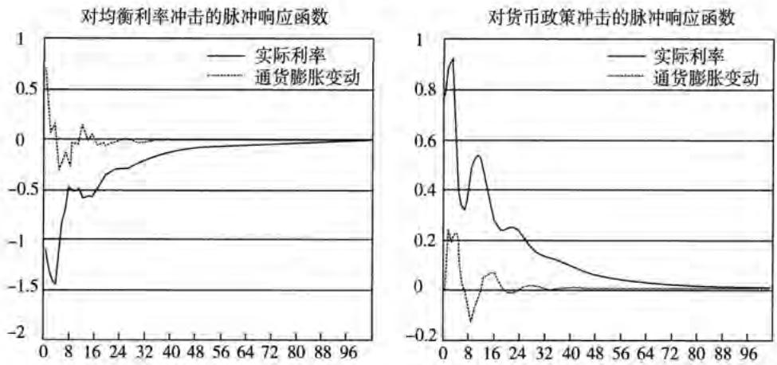  
图12-4 Brzoza-Brzezina约束下的脉冲响应函数

图12-5显示了使用本文修改后模型时的脉冲响应函数。当一个正的均衡利率冲击被加入时，实际利率在一个周期的认知滞后后开始上升。这一时期的负利率缺口导致通货膨胀率上升。另一方面，当一个积极的货币政策冲击加人时，实际利率上升，同时通货膨胀率下降。因此，在修改后的约束条件下，脉冲响应函数与理论预期一致。在这种情况下，除非样本开始于20世纪80年代，否则无法得到一个合理的答案。

图12-6显示了使用修改后的约束计算出的日本的均衡实际利率。在图中，细实线是实际利率。阴影部分的下限代表了如果在测量期间只发生了均衡实际利率冲击，就会得到的实际利率水平。上限是加入了过去均衡实际利率冲击和货币政策冲击的残余影响的部分。这是一个不确定的领域，不可能分离出多少是均衡实际利率冲击的影响，多少是货币政策冲击的影响。

  
对均衡利率冲击的脉冲响应函数

  
对货币政策冲击的脉冲响应函数

  
图12-5修改后Brzoza-Brzezina约束下的脉冲响应函数  
图12-6基于修改后Brzoza-Brzezina模型的均衡实际利率

在阴影部分描绘的粗实线显示了上下限之间的中列数，此后在提到结构性VAR中的均衡实际利率时，具体是指该中列数。从结构性VAR得到的均衡实际利率似乎比细实线描述的实际利率滞后了大约两年。这与实际利率对均衡利率冲击的脉冲响应函数峰值是在均衡利率冲击发生两年后出现的事实相一致（图12-5）。换句话说，均衡实际利率的滞后可能是由中央银行的认知滞后造成的。

# 6 DSGE模型

最后，介绍一个使用DSGE模型估算均衡实际利率的示例。DSGE模型是建立在微观经济学基础上的宏观计量模型，其中内生变量根据标准经济学假设而变化。DSGE模型有几大优点：第一，因为它是基于经济理论的，所以很容易将内生变量的运动转化为经济学术语。第二，根据模型的详细程度，可以确定数据对计量模型的偏差，即哪些因素导致了冲击的发生。第三，DSGE模型由“深层参数”描述，不随政策变化而变化，在进行政策模拟时，不会受到“卢卡斯批判”的影响。

在DSGE模型中，均衡实际利率被定义为“当价格具有完全弹性时得到的实际利率”。Neiss和Nelson（2003）是使用DSGE模型估算均衡实际利率的文献的代表。然而，他们的模型是对英国经济进行校准的，并不适合直接应用于日本经济。为了能够进行统计学评价，最好是构建一个没有经过校准但以某种方式估算的模型。

DSGE模型的研究是货币政策理论家和中央银行家最活跃的研究领域，并从早期非常简单的模型逐渐发展到更复杂的模型。在日本，尽管过程是渐进的，但优秀的实证模型已经开始出现，例如Sugo和Ueda（2008）。然而，本文的目的不是DSGE模型本身，而是从中得到的均衡实际利率。因此，本节没有构建一个详细的计量模型，而是处理一个各种DSGE模型所共有的、包含描述日本经济必不可少的要素的模型。

# 6.1 标准模型

如果消费是 $c$ ，储蓄是 $s$ ，劳动力是 $\bar { L }$ ，物价是 $P$ ，工资是 $\overrightarrow { W }$ ，那么代表性的个人优化问题方程如下：

$$
\operatorname { M a x } E _ { \tau } \sum _ { t = \tau } ^ { \infty } \beta ^ { t - \tau } \lambda _ { \prime } \left( \frac { C _ { t } ^ { 1 - \sigma } } { 1 - \sigma } - \theta _ { \prime } \frac { L _ { t } ^ { 1 + \varphi } } { 1 + \varphi } \right)
$$

$$
P _ { \prime } C _ { \prime } + S _ { \prime } = W _ { \prime } L _ { \prime } + ( 1 + i _ { \iota - 1 } ) S _ { \iota - 1 }
$$

得到优化的一阶条件为：

$$
\theta _ { \ i } L _ { \ i } ^ { \phi } C _ { \ i } ^ { \sigma } = \omega _ { \ i }
$$

$$
E _ { \tau } \frac { \lambda _ { i } } { \lambda _ { i + 1 } } \binom { C _ { i + 1 } } { C _ { i } } ^ { \alpha } = \beta ( \textsf { l } + i _ { i } - E , \pi _ { i + 1 } )
$$

其中， $w _ { \prime }$ 是实际工资 $ { W _ { \rho } } /  { P _ { \rho } }$

为了简化讨论，假设唯一的生产要素是劳动力。还假设一个线性生产函数 $Y { = } A L$ ，生产为 $Y$ ，劳动生产率为 $A$ 。此外，假设唯一的商品是消费品。在这种情况下，生产要素和商品市场的均衡条件是 $Y = C$ 。从这些方程中消除$C$ ，并围绕稳态值进行对数线性近似，可得到以下联立方程组。此后， $\hat { X }$ 表示任意变量 $X$ 与稳态值的偏差率。

$$
\tilde { { \boldsymbol { \theta } } } _ { \iota } + \varphi \tilde { { \boldsymbol { L } } } _ { \iota } + \sigma \dot { { \boldsymbol { Y } } } _ { \iota } = \dot { { \boldsymbol { w } } } _ { \iota }
$$

$$
\lambda _ { \iota } - E _ { \iota } \tilde { \lambda } _ { \iota + \iota } + \sigma E _ { \iota } \tilde { Y } _ { \iota + \iota } - \sigma \tilde { Y } _ { \iota } = i _ { \iota } - E _ { \iota } \pi _ { \iota + 1 }
$$

$$
\dot { Y } _ { t } = \dot { A } _ { t } + \dot { L } _ { t }
$$

通货膨胀率被假定为由卡尔沃型黏性价格模型决定。假设当期通货膨胀率受到过去通货膨胀率的影响，后者作为物价指数化被纳入模型。

$$
\pi _ { \cdot } - \gamma \pi _ { \cdot - 1 } = \beta ( E _ { t } \pi _ { t + 1 } - \gamma \pi _ { \cdot } ) + \frac { ( 1 - \alpha \beta ) ( 1 - \alpha ) } { \alpha } ( \dot { w } _ { \cdot } - \dot { A } _ { t } + \dot { \mu } _ { t } )
$$

其中， $\gamma$ 是表示指数化程度的参数， ${ \dot { w } } - { \hat { A } }$ 是实际边际成本 $( = { \overrightarrow { W } } / A P$ ）与稳态值的偏差率。 $\hat { \mu }$ 是加成率与稳态值的偏差率。 $\alpha$ 是每期不能修改价格的概率。

接下来，加入描述中央银行货币政策的方程。

$$
i _ { t } = \rho i _ { t - 1 } + ( 1 - \rho ) \left( \phi _ { \tau } \sum _ { i = 0 } ^ { 3 } \frac { \pi _ { t - i } } { 4 } + \phi _ { \tau } \Delta _ { 4 } \hat { Y } _ { t } \right) + \chi _ { i }
$$

这里假设中央银根据通货膨胀率（按同比计算）和实际GDP增长率（按同比计算）来指导政策利率。所谓的泰勒规则之所以没有被用来描述货币政策，是因为泰勒规则不能很好地适用实际数据，这是一个很好的实证问题。

在本文中，每个经济冲击由以下AR过程定义。

均衡实际利率是指价格具有完全弹性时的实际利率。在这种情况下，实际边际成本与稳态相吻合，偏差率为零。即 $\overset { \cdot } { w } - \overset { \cdot } { A } = 0$ 。因此，均衡实际利率$r ^ { * }$ 是通过解出以下联立方程组得到的。

$$
\tilde { \theta } _ { i } + \varphi \hat { L } _ { i } ^ { \ast } + \sigma \hat { Y } _ { i } ^ { \ast } = w _ { i } ^ { \ast }
$$

$$
r _ { t } ^ { * } = \dot { \lambda } _ { t } - E _ { t } \dot { \lambda } _ { t + 1 } + \sigma E _ { t } \dot { Y } _ { t + 1 } ^ { * } - \sigma \dot { Y } _ { t } ^ { * }
$$

$$
\hat { Y } _ { \iota } ^ { * } = \hat { A } _ { \iota } + \hat { L } _ { \iota } ^ { * }
$$

$$
\dot { w } _ { \iota } ^ { \ast } = \dot { A } _ { \iota }
$$

(A、θ、入、μ、x)已经全部得到，所以这里需要得到的四个变量是（ $\dot { L }$ rωr)。

# 6.2 非自愿失业模型

在确定均衡实际利率时，对劳动力无效冲击 $\theta$ 的处理可能是一个争论点。到目前为止的讨论是，如果 $\theta$ 的上升导致劳动时间的减少，这被解释为由于劳动力无效的增加而导致劳动力供给的减少。然而，这只是一个假设，现实中发生了什么是另一回事。如下文所示， $\theta$ 可以另外解释为非自愿失业。在这种情况下，即使 $\theta$ 的增加提高了均衡实际利率，货币政策也不应该随之上调利率。

现在假设家庭在“与就业有关的活动”（即工作或找工作）上只花费N个小时。另外，非自愿失业率被假设为外生变量u。一个有代表性的个体优化问题被表述为如下方程。

$$
\operatorname { M a x } E _ { \tau } \sum _ { t = \tau } ^ { \infty } \beta ^ { t - \tau } \lambda _ { t } \left( \frac { C _ { t } ^ { t - \sigma } } { 1 - \sigma } - \xi \frac { N _ { t } ^ { t + \sigma } } { 1 + \varphi } \right)
$$

$$
P _ { t } C _ { t } + S _ { t } = \left( 1 - u _ { t } \right) W _ { t } N _ { t } + ( 1 + i _ { t - 1 } ) S _ { t - 1 }
$$

这里，实际劳动时间和以前一样取为 $\cal { L }$ ，并进行以下变量转换。

$$
L _ { t } = ( 1 - u _ { i } ) N _ { t }
$$

$$
\theta _ { \iota } = \xi ( 1 - u _ { \iota } ) ^ { - 1 - \varphi }
$$

那么这个优化问题与之前的优化问题，即方程（12.34）完全一致。

此外，方程（12.53）的对数线性近似表明，如 $u = \hat { \theta } / \left( 1 + \psi \right)$ 相同, $\dot { \boldsymbol { \theta } }$ 和$\boldsymbol { \mu }$ 之间存在严格的正相关关系。这表明，人们无法区分劳动力无效的增加和非自愿失业的增加。因此，如果 $\hat { \pmb { \theta } }$ 的上升是 $\boldsymbol { u }$ 的上升，不应该认为经济已经繁荣或增长率已经提高。在此认为均衡实际利率是在实现充分就业，即 $u = 0$ 的情况下的实际利率。这相当于在标准模型中假设 $\stackrel { \cdot } { \theta } = 0$

# 6.3估算结果

在这一节中，方程（12.37）-（12.50）中包含的参数和结构性冲击的方差是用一种叫做马尔科夫链蒙特卡洛的贝叶斯计量经济学方法来估算的①。表12-4显示了估算结果（标准模型和非自愿失业模型解决的是同一个优化问题，所以表12-4的估算结果对两个模型来说是通用的）。图12-7描述了供需缺口的估算值。标准模型中的供需缺口与我们通常印象中的供需缺口不同，因为它在1990年资产价格泡沫达到顶峰时是负值。DSGE模型中的“供需缺口”是指价格具有完全弹性时与产量的偏差，它的定义与前几节所述的“供需缺口”不同，后者是对平均生产水平或生产趋势的偏差。然而，即使是这样，在这种供需缺口的基础上制定的政策措施也有许多不自然之处。在这方面，基于非自愿失业模型的供需缺口在20世纪80年代末前后的资产泡沫时期取得了很大的正值，消除了不自然性。

表12-4DSGE模型的估算结果  

<table><tr><td rowspan=1 colspan=1></td><td rowspan=1 colspan=1>平均值</td><td rowspan=1 colspan=1></td><td rowspan=1 colspan=1>平均值</td><td rowspan=1 colspan=1></td><td rowspan=1 colspan=1>平均值</td><td rowspan=1 colspan=1></td><td rowspan=1 colspan=1>平均值</td></tr><tr><td rowspan=1 colspan=1>中</td><td rowspan=1 colspan=1>1.492</td><td rowspan=1 colspan=1>α</td><td rowspan=1 colspan=1>0.842</td><td rowspan=1 colspan=1>PA</td><td rowspan=1 colspan=1>0.852</td><td rowspan=1 colspan=1>σA</td><td rowspan=1 colspan=1>0.907</td></tr><tr><td rowspan=1 colspan=1>0</td><td rowspan=1 colspan=1>1.865</td><td rowspan=1 colspan=1>P</td><td rowspan=1 colspan=1>0.198</td><td rowspan=1 colspan=1>Pe</td><td rowspan=1 colspan=1>0.906</td><td rowspan=1 colspan=1>σθ</td><td rowspan=1 colspan=1>2.596</td></tr><tr><td rowspan=1 colspan=1>β</td><td rowspan=1 colspan=1>0.996</td><td rowspan=1 colspan=1>4</td><td rowspan=1 colspan=1>1.775</td><td rowspan=1 colspan=1>Py</td><td rowspan=1 colspan=1>0.908</td><td rowspan=1 colspan=1>$σy}$</td><td rowspan=1 colspan=1>2.611</td></tr><tr><td rowspan=1 colspan=1>γ</td><td rowspan=1 colspan=1>0.312</td><td rowspan=1 colspan=1>4</td><td rowspan=1 colspan=1>0.537</td><td rowspan=1 colspan=1>Pu</td><td rowspan=1 colspan=1>0.842</td><td rowspan=1 colspan=1>σ</td><td rowspan=1 colspan=1>2.035</td></tr><tr><td rowspan=1 colspan=1></td><td rowspan=1 colspan=1></td><td rowspan=1 colspan=1></td><td rowspan=1 colspan=1></td><td rowspan=1 colspan=1>$Px$</td><td rowspan=1 colspan=1>0.095</td><td rowspan=1 colspan=1>$σx$</td><td rowspan=1 colspan=1>0.799</td></tr></table>

波动更剧烈。根据非自愿失业模型，日本的均衡实际利率在1997年暴跌至 $0 \%$ ，当时金融系统的不稳定性变得很明显。图12-8显示了基于非自愿失业模型的均衡实际利率的贡献分解为生产率冲击和需求冲击（中央三期移动平均值），这表明1997年均衡实际利率的急剧下降是由需求冲击的突然下降造成的。

  
图12-7基于DSGE模型的供需缺口

  
图12-8基于DSGE模型的均衡实际利率

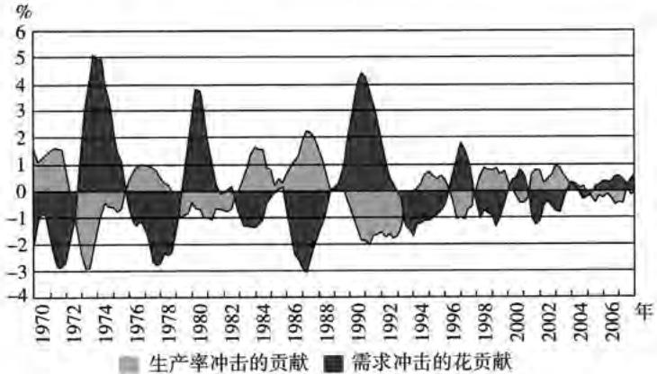  
图12-9 各种冲击对均衡实际利率的贡献(DSGE模型）

# 7均衡实际利率的不确定性

对均衡实际利率的估算值受制于各种不确定因素。均衡实际利率是一个在实践中无法观测到的变量，为了知道它的演变，必须依靠估算。然而，估算总是有误差的。问题还不止于此。在估算均衡实际利率方面有一个更严重的问题，即结果因使用的模型类型不同而明显不同。在本文中，这被称为“模型选择的不确定性”。此外，还有一个“实时估算”的问题，即均衡实际利率的估算值随着时间的推移而变化，因为数据被修改或增加，模型被重新估算。

在思考20世纪90年代经济长期低迷的原因和货币政策的作用时，了解本均衡实际利率的演变过程非常重要。本节拟从以下两个角度评价均衡实际利率估算值的不确定性程度：（1）模型选择的不确定性；（2）实时估算的问题。研究美国的现有文献（比如Laubach和Williams，2003；Clark和Kozic-ki，2005）表明，这种不确定性大到不可忽视，因此，在将均衡实际利率付诸政策制定之前，需要进一步试错。

# 7.1 负的均衡实际利率

Krugman（1998）对日本经济在20世纪90年代长期停滞的原因和解决方案提出了以下论点：在90年代末，政策利率，即无担保隔夜拆借利率降至$0 \%$ （流动性陷阱）。尽管如此，日本经济仍未能摆脱经济低迷的困境。这是由于均衡实际利率已经下降到了负值，而实际利率却由于通货紧缩的预期而不时地出现正值。在政策利率几乎为 $0 \%$ 且没有下调空间的情况下，需要大幅提高预期通货膨胀率（例如，在未来15年内达到 $4 \%$ ）来降低实际利率。为了实现这一标，日本银需要让公众相信，它正试图不惜一切代价造成通货膨胀。

当然，在克鲁格曼关于正的通货膨胀预期必须被诱导的论点背后，是日本的均衡实际利率自20世纪90年代后期以来一直为负的假设。然而，很少有实证研究涉及到日本的均衡实际利率是否真的为负值这一论点。因此，让我们参照到目前为止介绍的估算示例，考虑作为克鲁格曼论点基础的均衡实际利率为负值的可能性到底有多大。图12-11中的阴影区域显示了迄今为止估算的10个均衡实际利率在每个时间点的最大值和最小值①。实线是10个均衡实际利率的平均值。这表明，从1995年左右开始，均衡实际利率就进入了负值区域。仔细观测可以发现，从1997年到1998年，大多数均衡实际利率的估算值都是负值，尽管程度不同。

  
图12-11使用各种方法估算的均衡实际利率

注：这10个均衡实际利率的最大值、最小值和平均值。10个均衡实际利率包括基于BK滤波器、HP滤波器、ES滤波器的均衡实际利率、基于Laubach-Williams模型、Clark-Kozicki和I模型的均衡实际利率、基于NAILO的均衡实际利率、NAIRI、基于修改后结构性VAR的均衡实际率、以及基于假设非自愿失业的DSGE模型的均衡实际利率。

然而，这里的结果似乎并不一定支持克鲁格曼的论点。Krugman（1998）将负的均衡实际利率归因于人口老龄化和劳动人口的减少。如果这个论点是正确的，负的均衡实际利率应该是一个持久现象。然而，本文的结果显示，大多数均衡实际利率的估算值在21世纪初变成了正值。因此，不能排除负的均衡实际利率是一种暂时现象的可能性。即使均衡实际利率为负值，最多也是 $- 1 \%$ ，这与Krugman（1998，p.181）假设的负值 $- 3 \% - 3 . 7 5 \%$ 相比，幅度不大②。

为了评估金融环境，有必要研究“利率缺口”，即实际利率与均衡实际利率之间的差异，而不是均衡实际利率本身的水平。正的利率缺口表示紧缩的货币政策，而负的利率缺口表示宽松的货币政策。图12-12中的阴影区域显示了用每个时间点的10个均衡实际利率计算出的利率缺口的最大值和最小值。实线代表获得的10个利率缺口的平均值。例如，请关注20世纪90年代中期的利率缺口，当时的均衡实际利率似乎已经下降到了负值。

  
图12-12使用各种方法估算的利率缺口

注：基于10个均衡实际利率的利率缺口的最大值、最小值和平均值。这10个均衡实际利率包括基于BK滤波器、HP滤波器、ES滤波器的均衡实际利率、基于Laubach-Williams模型、Clark-KozickiI和ⅡI模型的均衡实际利率、基于NAILO的均衡实际利率、NAIRI、基于修改后结构性VAR的均衡实际率、以及基于假设非自愿失业的DSGE模型的均衡实际利率。

平均值的变化显示，从1995年到1997年初，金融环境是宽松的，但从1997年下半年开始进紧缩环境。然而，所有10个利率缺口在同一向上偏离零的情况极为罕见，使用利率缺口来评估金融环境绝非易事。这是由于货币紧缩和宽松的时间因使用哪种估算方法而有很大不同①。

# 7.2实时估算

接下来，我想就估算均衡实际利率的实时性问题补充一点意见。对于必须实时作出决策的中央银行来说，未来经济状况的不确定性是一个非常高的障碍（Ahearne等，2002；白塚等，2000）。除了这种未来的不确定性，中央银行在对当前经济形势进行决策时也面临着大量的不确定性。Orphanides和vanNorden（2002）在实时估算供需缺口的情况下，将这种不确定性分为三个资料来源：第一，随着数据从初值调整到终值，对供需缺口的估算也会发生变化。这被称为“快速确认误差”。第二，随着时间的推移和对模型参数的重新估算，供需缺口的估算值也会相应发生变化。这被称为“模型参数的不确定性”。第三，因为很难估算数据两端的趋势，所以对供需缺口的估算值只随着数据的增长而变化。这被称为“样本端问题”，Orphanides和vanNorden（2002）认为这是估算供需缺口时面临的最大不确定性①。

在估算均衡实际利率时，这种实时估算产生的不确定性也是一个问题。在本节中，以基于NAILO的均衡实际利率为例，定量评估在估算日本的均衡实际利率时，实时估算问题有多严重②。图12-13描述了四个均衡实际利率的演变。细的虚线被称为“实时估算值”，是对均衡实际利率的估算，只使用在估算时可用的数据。细实线被称为“准实时估算值”，是指如果事先知道截至最新数据的时间点数值，就可以估算出的均衡实际利率。粗体虚线被称为“准最终估算值”，是在使用与准实时情况相同的数据，但事先知道模型的参数是最新数据中的参数的情况下估算的均衡实际利率。最后，粗实线被称为“最终估算值”，是使用最新数据估算的均衡实际利率，与图12-4中所示的均衡实际利率相同。

表12-5显示了前面介绍的三种不确定性来源的贡献。实时和准实时估算值之间的差异对应快速确认误差。准实时和准最终估算值之间的差异对应模型参数的不确定性。准最终估算值和最终估算值之间的差异归因于样本端问题。同一表的上半部分是1984年第四季度至2007年第四季度三种不确定性的贡献，每种不确定性的大小以均方误差（MSE）的平方根衡量。该表显示，实时估算的总体误差略高于 $1 \%$ 。看一下误差的分类，样本端问题和快速确认误差的贡献很大，略低于 $1 \%$ 。另一方面，模型参数的不确定性几乎可忽略不计。这是由于菲利普斯曲线和IS曲线参数的稳定性，这些参数是在确定基于NAILO的均衡实际利率时估算的，而在使用其他方法时，模型参数的不确定性预计会增加。

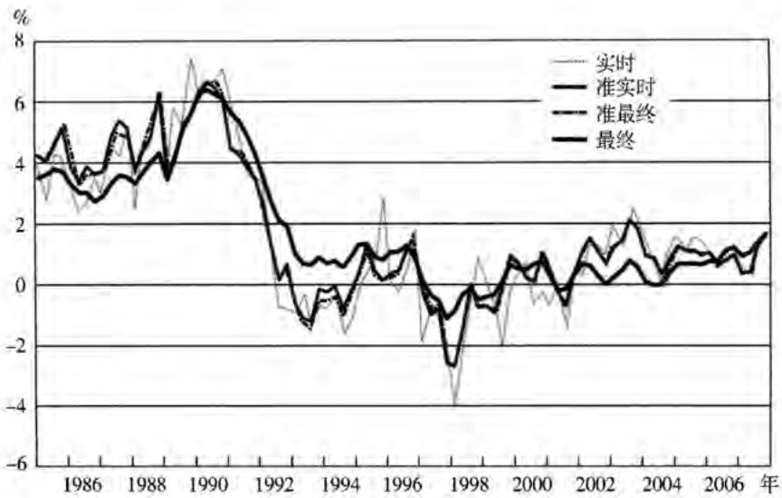  
图12-13实时估算的基于NAILO的均衡实际利率

表12-5实时估算产生的误差的因素分解  

<table><tr><td rowspan=1 colspan=2></td><td rowspan=1 colspan=1>快速确认误差</td><td rowspan=1 colspan=1>参数的不确定性</td><td rowspan=1 colspan=1>样本端问题</td><td rowspan=1 colspan=1>整体误差</td></tr><tr><td rowspan=1 colspan=2>当供需缺口被实时估算时，均衡实际利率的实时估算问题</td><td rowspan=1 colspan=1>0.79</td><td rowspan=1 colspan=1>0.13</td><td rowspan=1 colspan=1>0.89</td><td rowspan=1 colspan=1>1.15</td></tr><tr><td rowspan=1 colspan=1></td><td rowspan=1 colspan=1>（参考）NAILO的实时估算问题</td><td rowspan=1 colspan=1>0.82</td><td rowspan=1 colspan=1>0.15</td><td rowspan=1 colspan=1>1.79</td><td rowspan=1 colspan=1>1.86</td></tr><tr><td rowspan=1 colspan=2>当供需缺口被固定为最终估算值时，均衡实际利率的实时估算问题</td><td rowspan=1 colspan=1></td><td rowspan=1 colspan=1>0.11</td><td rowspan=1 colspan=1>0.37</td><td rowspan=1 colspan=1>0.40</td></tr></table>

注：“整体误差”是“最终估算”和“实时估算”之间的均方误差的平方根，而不是各个因素的总和。

均衡实际利率的实时估算问题来自于供需缺口的实时估算问题。当使用供需缺口的最终估算值作为给定值来实时估算均衡实际利率时，如表12-5下半部分所示，整体误差下降到 $0 . 4 \%$ 。如表12-5中间部分所示，正如Or-phanides和vanNorden（2002）使用美国数据所指出的，在实时估算供需缺口时，最大的细分误差是样本端问题（1985年第一季度至2008年第一季度，贡献率为 $1 , 8 \%$ ）。其次是快速确认误差（1985年第一季度至2008年第一季度，贡献率为 $0 . 8 \%$ )。由此可以看出，均衡实际利率的实时估算的不确定性主要归因于供需缺口的样本端问题和快速确认误差。

# 7.3 政策性意义

最后，考虑在估算均衡实际利率时如何处理不确定性。首先，有必要减少不确定性本身。这可以通过提高基本的GDP初值的准确性来实现，或者像Kamada（2005）所建议的那样，通过使用非修正数据，如来自《企业短期经济观测调查》（短观，日本银行）的企业信心指数（DI），来减少供需缺口的实时问题①。然而，付出任何能够想到的努力都无法消除所有的不确定性。至少，目前在均衡实际利率的估算方面似乎没有任何重大的技术创新。因此，在未来一段时间内，将不得不面对具有很大不确定性的均衡实际利率。

鉴于这种不确定性，中央银行应如何管理其货币政策？威克塞尔曾经认为，对经济和物价趋势进行观测，并不总是需要估算自然利率（Wicksell，1898）。换句话说，以经济和物价为信号，在试错的基础上调整政策利率就足够了，即在经济繁荣和物价上涨时提高利率，而在经济放缓和物价下跌时降低利率。然而，这样的操作可能会导致一些问题，如政策影响显现前出现的滞后，持续的影响，以及当经济中发生了结构性变化时，不得不进行低效政策管理的漫长的学习期。

Orphanides和Williams（2002）也认为，当均衡实际利率估算值有很大的不确定性时，进行谨慎的政策管理是可取的，这与Brainard（1967）的“保守主义”（conservatism）的论点相同。这是因为当均衡实际利率的不确定性很大时，机械地改变政策利率以应对估算值的变化，本身就可能成为误差，破坏利率缺口的稳定，损害经济和物价的稳定。然而，应该注意的是，保守主义并不意味着政策利率总是不变。这是因为当均衡实际利率在经济结构的变化中实际发生重大变化时，政策措施的滞后会改变利率缺口并导致金融环境的意外变化。

中央银行需要在用计量模型估算均衡实际利率的不确定性和试错式学习的低效率之间取得平衡。当然，通过继续提高统计精度和估算方法，有可能在一定程度上减少均衡实际利率的不确定性。然而，这些措施有其局限性。重要的是，不要对均衡实际利率估算值有太多的信心，至少目前是这样。均衡实际利率估算值只是一个模糊的准则，明智的做法是在制定政策利率时只将其作为一个参考。特别是，当经济被认为面临重大的结构性变化时，有必要收集和分析广泛的信息，以了解真正的均衡实际利率的巨大和持续的变化，并且不能忽视根据对此的信任程度来调整政策利率。

# 8结束语

本文用各种方法估算了日本的均衡实际利率。每种方法在估算的难易程度、结果的稳定性、理论上的一致性和较少的约束因素方面都有所不同，各有利弊。正如实证结果所显示的，均衡实际利率水平有相当大的区间，取决于使用哪种模型。特别是，难以使用利率缺口来评价政策立场。然而，从经验上看，日本的均衡实际利率在19971998年下降到负值似乎是合理的。然而，下降程度最多只有 $- 1 \%$ ，且持续时间并不长。在这个意义上，本文的结果似乎并不支持Krugman（1998）的论点，他假设了一个持续的和较大的负的均衡实际利率。

在对货币政策立场的任何严格评价中，无法回避一个必须面对的问题，即中央银行在有限的信息中，能够在多大程度上实时正确地把握均衡实际利率的变化。Orphanides和vanNorden（2002）指出的实时估算问题在估算均衡实际利率时自然也存在。在本文中，以基于NAILO的均衡实际利率为例，对这一问题的程度进行了估算。结果显示，快速确认误差和样本端问题的贡献是显著的。特别是，估算供需缺口时的样本端问题和快速确认误差所衍生的不确定性增加了均衡实际利率的实时估算误差。

均衡实际利率的不确定性可以通过改进统计精度和估算方法而得到一定程度的减少。然而，不确定性的减少是有限度的。目前，明智的做法是不要过于相信均衡实际利率估算值，而只将其作为一种参考。在这种情况下，中央银行将别无选择，只能在某种程度上以试错的方式管理货币政策。日本经济目前可能正在经历一个重大的结构性变化。中央银行有必要根据各种方法和数据，把握真正的均衡实际利率大幅且持续的变化，并根据其可信的程度不断调整政策利率。

# 参考文献

小田信之·村永淳（2003），「自然利子率について：理論整理と計測」日本

銀行ワーキグペーーシリーズ，No.03-J-5.鎌田康一郎(2005)，「わが国のイフレ中立的な実金利：Non-Accelera-ting Inlation Rate of Interest（NAIRI)」（未定稿）

鎌田康一郎・廣瀬康生（2003)，「潜在GDPとフリップス曲線を同時推計する新手法」「金融研究」日本銀行金融研究所，第22卷第2号，pp.13–34.

齊藤誠（2007)，「資産価格とマク口経済』日本経済新聞出版社.

白塚重典・田口博雄·森成城（2000)，日本におナる八7ル崩壊後の調整に対する政策对応—一中間報告」[金融研究]日本銀行金融研究所，第

19卷第4号，pp.87-143.

吉川洋·通産省産業研究所編集委員会（2000)，マク口経済政策の課題と

争点」東洋经済新報社.   
Ahearne, Alan, Joseph Gagnon, Jane Haltmaier, Steve Kamin, Christopher Erceg, Jon Faust, Luca Guerrieri, Carter Hemphill, Linda Kole, Jennifer Roush, John Rogers, Nathan Sheets, and Jonathan Wright(2002), "Preventing Deflation: Lessons from Japan's Experience in the 1990s," International Finance Discussion Papers, Board of Governor of the Federal Reserve System.   
Baxter, Marianne and Robert C. King(1999), "Measuring Business Cycles: Approximate Band-Pass Filters for Economic Time Series," Review of Economics and Statistics, 81(4), pp.575–593.   
Bomfim, Antulio N. (1997), "The Equilibrium Fed Funds Rate and the Indicator Properties of Term Structure Spreads, Economic Inquiry, 35 (4), pp. 830–846.   
Borio, Claudio and Andrew Filardo (2007),Globalisation and Inlation: New Cross-Country Evidence on the Global Determinants of Domestie Inflation," BIS Working Papers, No. 227.   
Brainard, Wiliam (1967), "Uncertainty and the Effectiveness of Policy,"American Economic Revieo, 57(2), pp.411–425.   
Brzoza-Brzezina, Michat (2003), "Estimating the Natural Rate of Interest: A SVAR Approach," National Bank of Poland, Working Paper, 27.   
Burms, Arthur F. and Wesley C. Mitchell (1946), Measuring Business Cycles, New York:National Bureau of Economic Research.   
Clark, Todd E. and Sharon Kozicki (2005), "Estimating Equilibrium Real Interest Rates in Real Time," North American Journal of Economics and Finance, 16 (3), pp.395–413.   
Hodrick, Robert J. and Edward C. Prescot (1997), "Post-War U. S. Business Cycles: An Empirical Investigation," Journal of Money, Credit and Banking, 29 (1), pp.1–16.   
Kaiser, Regina and Agustín Maravall (2001), Measuring Business Cycles in Economic Time Series, New York: Springer-Verlag New York, Inc.   
Kamada, Koichiro (2005), Real-Time Estimation of the Output Gap in Japan and its Usefulness for Inflation Forecasting and Policymaking, North American Journal of Economics and Finance, 16 (3), pp.309-332.   
King, Rober G. and Sergio T. Rebelo (1989), "Low Frequency Filtering and Real Business Cycles," Rochester Center for Economic Research Working Paper, No.205.   
Krugman, Paul R. (1998), "It s Baaack: Japan' s Slump and the Return of the Liquidity Trap," Brookings Papers on Economic Activity, 29 (1998- 2), pP. 137-206.   
Laubach, Thomas and John C. Williams (2003), "Measuring the Natural Rate of Interest," Review of Economics and Statistics, 85(4), pp. 1063–1070.   
Neiss, Katharine S.and Edward Nelson(2003),"The Real-Interest-Rate Gap as an Inflation Indicator," Macroeconomic Dynamics, 7 (02), pp.239–262.   
Orphanides, Athanasios and Simon van Norden (2002),"The Unreliability of Output-Gap Estimates in Real Time, Review of Economics and Statistics, 84 (4), pp.569–583.   
Orphanides, Athanasios and John C. Wiliams (2002),"Robust Monetary Policy Rules with Unknown Natural Rates, Brookings Papers on Economic Activity, 33(2002-2),pp.63–146.   
Stock, James H. and Mark W. Watson(1998), "Median Unbiased Estimation of Coefficient Variance in a Time-Varying Parameter Model," Journal of the American Statistical Association, 93(441), pp.349–358.   
Sugo, Tomohiro and Kozo Ueda(2008), "Estimating a Dynamic Stochastic General Equilibrium Model for Japan," Journal of the Japanese and International Economies,22(4）, pp.476–520.   
Taylor, John B. (1993), “ Discretion versus Policy Rules in Practice.” Carmegie-Rochester Conference Series on Public Policy, 39(1), pp.195-214.   
Wicksell, J. G. Knut (1898), Geldzins und Güterpreise, Eine Studie über die den Tauschwert desGeldes bestimmenden Ursachen，Jena（ウイセ著，北野熊喜 男·服部新一訳，北野熊喜男改訳（1984)，利子と物価」日本経済評論 社）.   
Woodford, Michael(2003), Interest and Prices, Princeton: Princeton University Press.

# 13日本经济周期的结构性变化

渡部敏明

# 导语

本文使用1984年1月至2008年12月内阁府经济社会综合研究所的宏观经济一致指数（CI），对日本经济周期的结构性变化进行了定量分析。具体使用马尔可夫链蒙特卡洛方法（MCMC法），加入了CI的平均增长率在扩张期和衰退期之间变化的马尔可夫转换模型、从1到3的结构性变化点，以及扩张期和衰退期的平均增长率在每个结构性变化点变化的模型进行了贝叶斯估算。另外，通过从具有不同结构性变化点的数量的模型中选择基于后验优势比的模型，来指定结构性变化点的数量和时期。结果表明：（1）日本的经济周期在过去25年中出现了两次结构性变化；（2）可能发生在泡沫破灭后的1991年8月和经济复苏速度放缓的2004年8月；（3）明确了前一种结构性变化降低了经济扩张期和衰退期CI的平均增长率，后一种结构性变化进一步降低了扩张期和衰退期CI的平均增长率。

# 1前言

20世纪80年代中期后：日本经济经历了泡沫和泡沫破灭以及随后被称为“失去的十年”的停滞期等。同时，受“失去的十年”经济停滞的影响，日银的金融政策也不得不向零利率政策和量化宽松政策等非传统金融政策转移。而且，最近以雷曼冲击为代表的美国金融危机也对日本经济产生了深刻的影响。在这种形势下，日本的经济周期也很可能发生了结构性变化。因此，本文对20世纪80年代中期后的日本经济周期结构性变化进行了定量分析。

# 368宏观经济与产业结构

本文采用Hamilton（1989）提出的马尔可夫转换模型（以下称为MS模型）作为表示经济周期的模型。具体来说，假设经济有扩张期和衰退期两种状态，代表经济变量的平均增长率在扩张期和衰退期不同，这两种状态之间的过渡服从马尔可夫过程。通过在该模型中加入结构性变化，并假设扩张期和衰退期的平均增长率在每个结构性变化点发变化来分析经济周期的结构性变化。结构性变化的过渡仿效Chib（1998），使用不可逆马尔可夫转换模型。Kim和Nelson( $1 9 9 9 \mathrm { a }$ ）以及渡部、饭星（2007）使用相同的方法分析了经济周期中的结构性变化。前者将结构性变化点的数量限定为1个，而后者则考虑结构性变化点有多个的情况，对结构性变化点的数量也进选择。本文仿效渡部、饭星（2007），根据存在多个结构性变化点的情况，来选择结构性变化点的数量。

估算方法和Chib(1998），Kim和Nelson（ $1 9 9 9 a )$ ，渡部、饭星（2007）一样，采用基于马尔可夫链蒙特卡洛法（MCMC法）的贝叶斯估算①。传统的贝叶斯估算是在模型参数中设定数据观测前的分布，即先验分布，然后用贝叶斯定理将其修正为数据观测后的分布，即后验分布，根据后验分布估算参数。但是，一旦模型变得复杂，就很难用贝叶斯定理分析求取后验分布，即使求出了也十分复杂。因此，最近的贝叶斯估算很多都使用MCMC法从后验分布中为每个参数值抽取样本，然后用抽样的值来估算参数。MCMC法是从某个分布中抽样时，用前一次抽样的值来为下一个值抽样的方法的总称，可用于随机抽样存在困难的情况。用这一方法能同时估算参数与结构性变化点，因此，可以在考虑参数不确定性的基础上估算结构性变化点的分布。本文仿效Chib（1998）和渡部、饭星（2007），在估算时改变结构性变化点的数量，通过计算在贝叶斯统计学上用于模型比较的后验优势比来选择结构性变化点的数量。

表示日本经济的变量使用内阁府经济社会综合研究所制作的宏观经济一致指数（CI）。渡部、饭星（2007）的分析使用的是1974年5月至2004年1月的CI，而本文则使用1984年1月至2008年12月最近25年的CI进行了分析。结果表明，选择两个结构性变化点，这两个结构性变化点可能性最大的是泡沫破灭后的1991年8月和经济恢复速度减缓的2004年8月。同时，还得到了1991年8月后，无论是扩张期还是衰退期，经济平均增长率均较这之前有所下降，2004年8月后更是进一步下降。

本文的结构如下：下一节先对MS模型进行简要说明，然后扩展至具有多个结构性变化点的模型。第三节说明估算该模型需要用到的贝叶斯估算、MC-MC法这一计量方法及选择结构性变化点数量所需的后验优势比。这些方法的详细内容以附录的形式记载于本文的最后。第四节考察估算结果，最后的第五节归纳本文的结果。

# 2具有多个结构性变化点的马尔可夫转换模型

首先来说明没有结构性变化的MS模型。本文使用的是以下MS模型：

$$
\begin{array} { r l } { \gamma _ { \iota } = \mu _ { \iota } + \phi \left( \boldsymbol { y } _ { \iota - 1 } - \boldsymbol { \mu } _ { \iota - 1 } \right) + \boldsymbol { \varepsilon } _ { \iota } , \ \boldsymbol { \varepsilon } _ { \iota } \sim \ i , \ i . \ d . \ N ( 0 , \ \sigma ^ { 2 } ) } & { } \\ { \mu _ { \iota } = \mu ^ { ( 0 ) } ( 1 - S _ { \iota } ) \ + \mu ^ { ( 1 ) } S _ { \iota } , \ \mu ^ { ( 0 ) } \ < \mu ^ { ( 1 ) } } & { } \\  S _ { \iota } = \left\{ \begin{array} { l l } { 1 } &  \frac { \iota \times \lambda } { \delta \times \dot { \gamma } + \dot { \gamma } + \dot { \gamma } \times \dot { \gamma } \times \dot { \gamma } \times \dot { \gamma } \times \dot { \gamma } } \\ { 0 } & { \frac { \iota \times \delta \times \dot { \gamma } + \dot { \delta } \times \dot { \gamma } \times \dot { \gamma } \times \dot { \gamma } \times \dot { \gamma } \times \dot { \gamma } \times \dot { \gamma } } \end{array} \right. } \end{array}
$$

这个公式（13.1）中的 $y _ { \prime }$ 是CI的变化率。 $\textstyle \mu _ { i }$ 表示 $t$ 期的CI平均增长率， $\varepsilon _ { t }$ 表示误差项。假设该误差项独立于过去，服从同一种（identically和independentlydistributed；i.i.d.）正态分布。如果总是一定，则公式（13.1）就是一个普通的一阶自回归模型。MS模型的特点在于 $\mu _ { r }$ 的大小在扩张期和衰退期之间转换①，它的表达式就是公式（13.2）。右边的 $S _ { \iota }$ 如公式（13.3）所定义的，是表示经济是扩张期还是衰退期的虚拟变量，如果 $S _ { t } =$ 1，则表示是扩张期， $\boldsymbol { S } _ { t } \mathrm { = } 0$ 则表示是衰退期②。因此，平均增长率在扩张期为$\mu ^ { ( 1 ) }$ ，衰退期为 $\mu ^ { ( 0 ) }$ 。公式（13.2）设置了约束 $\mu ^ { ( 0 ) } < \mu ^ { ( 1 ) }$ ，是为了保证扩张期的平均增长率高于衰退期。而且，MS模型假设 $S _ { \iota }$ 服从马尔可夫过程，转移概率用以下的公式来表达（本文中以下的概率函数和概率密度函数均用 $\pi$ (·）来表示)。

$$
\pi ( S _ { t } = 1 \mid S _ { t - 1 } = 1 ) p _ { 1 1 } , \ \pi ( S _ { t } = 0 \mid S _ { t - 1 } = 1 ) = 1 - p _ { 1 1 }
$$

$$
\pi ( S _ { \iota } = 0 \mid S _ { \iota - 1 } = 0 ) p _ { 0 0 } , \ \pi ( S _ { \iota } = 1 \mid S _ { \iota - 1 } = 0 ) = 1 \ - p _ { 0 0 }
$$

比如， ${ p } _ { 1 1 }$ 表示当 $t - 1$ 期是扩张期时， $\scriptstyle { t }$ 期也依然是扩张期的概率， $p _ { 0 0 }$ 表示当 $_ { t - 1 }$ 期为经济衰退期时， ${ \mathbf { \xi } } _ { t }$ 期也依然是经济衰退期的概率。因为是马尔可夫过程，所以，这些概率全都只依赖于一期前的经济状态 $S _ { \nu - 1 }$ 。而且，假设这些概率无论何时都是一定值。用矩阵来表示转移概率时，则为

以下公式。

$$
P = \left[ \begin{array} { l l } { \begin{array} { r r } { p _ { 1 1 } } & { 1 - p _ { \infty } } \\ { 1 - p _ { 1 1 } } & { p _ { \infty } } \end{array} } \end{array} \right]
$$

将该MS模型扩展到附加了多个结构性变化点的模型。本的分析假设结构性变化只会使经济衰退期的平均增长率 $\mu ^ { ( 0 ) }$ 和扩张期的平均增长率 $\mu ^ { ( i ) }$ 的值发生变化。那么，给(0)和μ(1）添加下标，即可将公式(13.1)、(13.2)改写成以下公式：

$$
y _ { \iota } = \mu _ { \iota } + \phi \left( y _ { \iota - i } - \mu _ { \iota - i } \right) + \varepsilon _ { \iota } , \ \varepsilon _ { \iota } \sim i . i . d . N ( 0 , \ \sigma ^ { 2 } )
$$

$$
\mu _ { \iota } = \mu _ { \iota } ^ { ( 0 ) } ( 1 - S _ { \iota } ) + \mu _ { \iota } ^ { ( 1 ) } S _ { \iota } , \mu _ { \iota } ^ { ( 0 ) } < \mu _ { \iota } ^ { ( 1 ) }
$$

Kim和Nelson（2014）和渡部、饭星（2007）假设误差项的方差 $\sigma ^ { 2 }$ 的值也会因结构性变化而变化，虽然在这样的假设下也进行了分析，但没有观察到 $\sigma ^ { 2 }$ 值的变化，因此，以下报告的是假设只有经济衰退期和扩张期的平均增长率 $\mu ^ { ( 0 ) }$ , $\mu ^ { ( 1 ) }$ 的值发生变化时的结果。

下面，为了表明各期到当期共发生了几次结构性变化，导变量 $D _ { e }$ 。以下以 $\boldsymbol { \mathcal { Y } } _ { t }$ 的样本大小为 $T$ ，结构性变化点的数量为 $n _ { \circ }$ 进而用 $( \tau _ { 1 } , \cdots , \tau _ { n } )$ 来表示结构性变化点，假设满足 $1 < \tau _ { 1 } < \tau _ { 2 } < \cdots < \tau _ { n } \leq T _ { \circ }$ 这样， $D _ { r }$ 将被定义如下：

$$
\begin{array} { r l } & { \left\{ \begin{array} { l l } { 0 , 1 \leqslant t < \tau _ { 1 } } \\ { 1 , \tau _ { 1 } \leqslant t < \tau _ { 2 } } \\ { \vdots } \\ { \theta _ { t } = \vdots \dot { \tau } _ { t } \leqslant t < \tau _ { t + 1 } } \\ { \vdots } \\ { \eta - 1 , \tau _ { t - 1 } \vert \leqslant t < \tau _ { n } } \end{array} \right. } \end{array}
$$

$$
D _ { _ { 1 } } = 0 , D _ { _ { r } } = n .
$$

如公式（13.6）所示，第一次结构性变化发生前， $D _ { e }$ 为0，第一次结构性变化发生后， $D _ { i }$ 为1。同样，每发生一次结构性变化， $D _ { t }$ 的值就会加1，最后的第n次结构性变化发生后，D,为n。为了使结构性变化点的数量为n，D₁和 $D _ { r }$ 分别定为0和 $_ n$ 。另外，假设 $D _ { r }$ 独立于上面说明的表示经济是扩张期还是衰退期的虛拟变量 $S _ { \varepsilon }$

为了便于体现参数的结构性变化，再导入与上述D,相对应的虚拟变量d$( i = 0 , \ \cdots , \ n ; \ t = 1 , \ \cdots , \ \operatorname { T } )$ $d _ { i j }$ 总共有（ $n + 1$ ）T个，即每过一期为 $n { + 1 }$ 个，各 $d _ { u }$ 的值定义如下。

$$
d _ { u } = \left\{ \begin{array} { l l } { 1 , ~ D _ { \iota } = i } \\ { 0 , ~ D _ { \iota } \ne i } \end{array} \right.
$$

比如，假设 $t$ 期前发生了两次结构性变化，则 $d _ { 2 \prime }$ 为1，除此之外的 $d _ { 0 t } ,$ d1、d3、…、d全部为0。使用d这个虚拟变量，经济衰退期的平均增长率μ,(0)和扩张期的平均增长率μ(1）这两个因结构性变化而发生数值变化的参数就可以表达如下：

$$
\begin{array} { l } { { \mu _ { i } ^ { ( 0 ) } = m _ { 0 0 } d _ { ( k } + \dots + m _ { 0 n } d _ { n } } } \\ { { \mu _ { i } ^ { ( 1 ) } = m _ { 1 0 } d _ { 0 i } + \dots + m _ { 1 n } d _ { n t } } } \\ { { m _ { 0 0 } < m _ { 1 n } , \dots , m _ { 0 n } < m _ { 1 n } } } \end{array}
$$

这样定式化后， $m _ { 0 i \setminus } ~ m _ { 1 i }$ 就分别表示结构性变化点 $\tau _ { i }$ 和 $\tau _ { i + \mathrm { j } }$ 之间的经济衰退期和扩张期的平均增长率。设置约束 $m _ { 0 0 } { < } m _ { 1 0 }$ 、… $m _ { 0 n } < m _ { 1 n }$ ,使各期扩张期的平均增长率均高于经济衰退期。

本文的分析仿效Chib（1998）和渡部、饭星（2007），假设表示此前发生了多少次结构性变化的变量 $D _ { \iota }$ 也和 $S _ { \iota }$ 一样，服从马尔可夫过程。假设不是一般的马尔可夫过程，而是保持现行值或者加1，不会出现数值减少或者一次加2以上的情况。用转移概率来表达时公式如下：

$$
\pi [ D _ { t } = 1 \mid D _ { t - 1 } = 0 ] = 1 - q _ { 0 0 } ,
$$

$$
\pi [ D _ { t } = { \bf \textnormal { l i } } D _ { t - 1 } = { \bf \textnormal { 1 } } ] = q _ { 0 1 } , \pi [ D _ { t } = { \bf \textnormal { 2 } } | D _ { t - 1 } = { \bf \textnormal { 1 } } ] = { \bf \textnormal { 1 } } - q _ { 0 1 } ,
$$

$$
\begin{array} { r l } & { \pi [ D _ { t } = { \textrm { n - 1 } } | \ D _ { t - 1 } = { \textrm { n - 1 } } ] = q _ { n - \Gamma , { \textrm { n - 1 } } } , \ \pi [ D _ { t } = { \textrm { n } } | \ D _ { t - 1 } = { \textrm { n - 1 } } ] = } \\ & { \qquad 1 - q _ { n - \Gamma , n - 1 } } \\ & { \pi [ D _ { t } = { \textrm { n } } | \ D _ { t - 1 } = { \textrm { n } } ] = 1 . } \end{array}
$$

比如， $q _ { 0 0 }$ 表示到 $_ { t - 1 }$ 期结构性变化一次也没有发生时 $\scriptstyle t$ 期也不会发生结构性变化的概率， $q _ { 1 1 }$ 表示到 $_ { t - 1 }$ 期结构性变化一次也没有发生时 $t$ 期不会发生新的结构性变化的概率。以下公式是该转移概率的矩阵表达式。

$$
\boldsymbol { Q } = \left[ \begin{array} { c c c c c c c } { \boldsymbol { q } _ { \infty } } & { \boldsymbol { 0 } } & { \boldsymbol { 0 } } & { \cdots } & { \boldsymbol { 0 } } & { \boldsymbol { 0 } } \\ { 1 - \boldsymbol { q } _ { \infty } } & { \boldsymbol { q } _ { 1 1 } } & { \boldsymbol { 0 } } & { \cdots } & { \boldsymbol { 0 } } & { \boldsymbol { 0 } } \\ { \boldsymbol { 0 } } & { 1 - \boldsymbol { q } _ { 1 1 } } & { \boldsymbol { q } _ { 2 2 } } & { \cdots } & { \boldsymbol { 0 } } & { \boldsymbol { 0 } } \\ { \boldsymbol { 0 } } & { \boldsymbol { 0 } } & { 1 - \boldsymbol { q } _ { 2 2 } } & { \cdots } & { \boldsymbol { 0 } } & { \boldsymbol { 0 } } \\ { \vdots } & { \boldsymbol { 0 } } & { \vdots } & { \vdots } & { \vdots } & { \vdots } \\ { \boldsymbol { 0 } } & { \boldsymbol { 0 } } & { \boldsymbol { 0 } } & { \cdots } & { \boldsymbol { q } _ { n - 1 , n - 1 } } & { \boldsymbol { 0 } } \\ { \boldsymbol { 0 } } & { \boldsymbol { 0 } } & { \boldsymbol { 0 } } & { \cdots } & { \boldsymbol { 1 } - \boldsymbol { q } _ { n - 1 , n - 1 } } & { \bar { \boldsymbol { 1 } } } \end{array} \right]
$$

公式（13.11）的转移矩阵不同于公式（13.5）的转移矩阵，表示各状态的转移不可逆，一旦转移到下一状态就无法复原。比如，从当期为 $D _ { 1 } = 2$ 的第3行第3列的 $q _ { 2 2 }$ 来看， $q _ { 2 2 }$ 是下期也停留在 $D _ { 1 + 1 } = 2$ 的概率，它下面的 $1 - q _ { 2 2 }$ 是下期发生结构性变化，即 $D _ { t + 1 } = 3$ 的概率。从第3列的其他值全部为0可知， $D _ { \scriptscriptstyle { t + 1 } } = 1 , D _ { \scriptscriptstyle { t + 1 } } = 4$ 的概率为 $_ 0$ 。

本文使用由公式（13.1)、（13.2）、（13.3）、（13.4)、（13.6)-（13.10）组成的多个结构性变化点的MS模型，对日本经济周期的结构性变化进行分析。通过采用基于MCMC法的贝叶斯估算这一分析方法，不只是参数，还同时估算经济转折点和结构性变化点。另外，还使用后验优势比来选择结构性变化点的个数。下一节将对这种计量方法进行说明。

# 3 贝叶斯估算法与模型选择

# 3.1 基于吉布斯采样器的贝叶斯估算

下面，假设数据为 $\bar { \boldsymbol { Y } } _ { r } = ~ ( y _ { 1 } , \cdots , y _ { r } )$ ，要估算的未知参数向量为 $\dot { \theta }$ 。贝叶斯估算法首先对未知参数θ设定观测数据前的分布，即先验分布π（θ）。传统的贝叶斯估算法用贝叶斯定理

$$
\pi ( { \overset { \cdot } { \theta } } 1 { \overset { \cdot } { Y } } _ { r } ) = { \frac { \pi ( { \overset { \cdot } { \theta } } ) \pi ( { \overset { \cdot } { Y } } _ { r } \mid { \overset { \cdot } { \theta } } ) } { \pi ( { \overset { \cdot } { Y } } _ { r } ) } }
$$

将先验分布更新为数据 $\hat { Y } _ { \textit { r } }$ 观测后的后验分布 $\pi$ $\bar { \tau } \ ( \ \tilde { \textbf { \theta } } | \ \hat { Y } _ { r } )$ ，根据所获得的后验分布估算参数值。上一节说明的附加了多个结构性变化点的MS模型要想用公式（13.12）来计算后验分布，就必须采用复杂的方法。这时使用的方法是用MCMC法从后验分布中为未知参数 $\bar { \theta }$ 的值抽样，根据所获得的值来估算参数。MCMC法不同于一般的随机抽样，是依赖前一次抽样的值为下一个值抽样的方法的总称，具有代表性的有吉布斯采样器和梅特罗波利斯-斯廷斯（MH）算法①。

本文的估算使用的是吉布斯采样器，因此，下面来说明吉布斯采样器。使用吉布斯采样器时，将未知参数θ分割成（θ1、…、θ）几组。（θ1、…、

$\theta _ { k }$ ）既可以是一个变量，也可以是多个变量，但各组附带全部条件的后验分布（Full Conditional Posterior Distribution） $\pi ( \theta _ { i } \mid \theta _ { 1 } , \cdots , \theta _ { i - 1 } , \theta _ { i + 1 } , \cdots ,$ $\theta _ { k }$ , $\bar { \boldsymbol { Y } } _ { \textit { r } }$ ) $( i { = } 1 , \ \cdots , k )$ 除归一化常数（NormalizingConstant）外，其余全部可分析求解，且可从中抽样。这时，从恰当的初始值（ ${ \theta _ { 2 } } ^ { ( 0 ) } ,$ … ${ \theta _ { k } } ^ { ( 0 ) }$ ）开始，先从附带全部条件的后验分布 $\pi$ $( \theta _ { 1 } | \ \theta _ { 2 } ^ { \ ( 0 ) } \cdot \theta _ { 3 } ^ { \ ( 0 ) }$ 、… $\theta _ { i } ^ { ( 0 ) } , \tilde { Y } _ { \tau } )$ 中为${ \theta _ { 1 } } ^ { ( 1 ) }$ 抽样，其次，从附带全部条件的后验分布 $\pi$ $( \theta _ { 2 } | \ \theta _ { 1 } \stackrel { ( 1 ) } { \ } , \theta _ { 3 } \stackrel { ( 0 ) } { \ } ,$ …i $\theta _ { k } ^ { \scriptscriptstyle ( 0 ) } , \hat { Y } _ { \scriptscriptstyle T } )$ 中为 $\theta _ { 2 } ^ { ( 1 ) }$ 抽样。不断重复，最后从 $\pi ( \theta _ { k } \mid \theta _ { 1 } ^ { ( 1 ) } , \theta _ { 2 } ^ { ( 1 ) } , \cdots , \theta$ $\frac { ( 1 ) } { k - 1 } \setminus \bar { Y } _ { T } )$ 中为 ${ \theta _ { k } } ^ { \left( 1 \right) }$ 描样。将以上称为第1个循环。从在第1个循环中植样的 $( \theta _ { 1 } ^ { \ ( 1 ) } , \ \theta _ { 2 } ^ { \ ( 1 ) } , \ \cdots , \ \theta _ { k } ^ { \ ( 1 ) }$ ）开始，按同样的方法执行第2个循环，为(i $( \theta _ { i } ^ { ( 2 ) } , \theta _ { 2 } ^ { ( 2 ) } , \cdots , \theta _ { k } ^ { ( 2 ) }$ ）抽样。重复以上操作，第 $l$ 个循环就为（ ${ \theta _ { 1 } } ^ { ( 1 ) }$ $\theta _ { 2 } ^ { ( 1 ) } ,$ ${ \theta _ { i } } ^ { ( 1 ) }$ ）抽样。假设在宽松的约束条件下， $l  \infty$ ，则按以上方法抽样的（ ${ \theta _ { 1 } } ^ { ( 1 ) }$ 、 $\theta _ { 2 } ^ { ( 1 ) } , \cdots , \theta _ { k } ^ { ( 1 ) }$ ）依分布收敛到从联合后验分布 $\pi$ ( $\theta _ { 1 \setminus }$ $\theta _ { 2 } \dots , \theta _ { k } \mid \hat { Y } _ { \tau } )$ 中采样的概率变量，这一点已为人所知①。

因此，舍去在第一个M循环（M为足够大的值）中抽样的值（将舍去的第一个M循环称为“ $\mathrm { { b u r n - i n } } ^ { \mathfrak { n } }$ )，再将进行N个循环后抽样的（ ${ \theta _ { 1 } } ^ { ( 1 ) }$ ,$\theta _ { 2 } ^ { ( 1 ) }$ 、… ${ \theta _ { k } } ^ { ( 1 ) }$ ) $( l = M + 1 , M + 2 , \cdots , M + N )$ 视为从联合后验分布 $\boldsymbol { \pi }$ ( $\theta _ { 1 }$ θ2、…、θ1Y）中抽样的值，用于估算。比如，θ₁的均数可作为抽样值的样本均数做如下估算。

$$
E ( \theta _ { \mathrm { t } } ) \approx \frac { 1 } { N } \sum _ { i = M + 1 } ^ { M + N } \theta _ { \mathrm { t } } ^ { ( i ) }
$$

上一节中说明的附加了多个结构性变化点的MS模型中，未知参数为 $\stackrel { \triangledown } { \boldsymbol { \theta } } =$ $( \tilde { m } 、 \varphi , \sigma ^ { 2 } 、 \tilde { p } , \tilde { q } )$ 。这里， $\tilde { m } ~ = ~ ( m _ { 0 1 } , ~ \cdots , ~ m _ { 0 n } , ~ m _ { 1 1 } , ~ \cdots , ~ m _ { 1 n } ) ^ { \prime }$ , $\begin{array} { r } { \tilde { p } \ = } \end{array}$ （Po，P_1），q=（qoo、、qn-1、n-1)'将吉布斯采样器用于该模型时，还要与参数一道为潜在变量 $\tilde { D } _ { r } = ( D _ { 1 } , \cdots , D _ { r } ) ^ { \prime } , \tilde { S } _ { r } = ( S _ { 1 } , \cdots , S _ { r } )$ 抽样。具体是从以下7个附带全部条件的后验分布中反复抽样。

第一步 $\pi [ \boldsymbol { m } | \hat { \boldsymbol { \theta } } _ { - \hat { \boldsymbol { m } } } , \tilde { \boldsymbol { S } } _ { T } , \tilde { \boldsymbol { D } } _ { T } , \tilde { Y } _ { T } ]$ i  
第二步 $\pi [ \varphi | \hat { \theta } _ { - \varphi } , \tilde { S } _ { r } , \tilde { D } _ { r } , \tilde { Y } _ { r } ]$   
第三步 $\pi [ \sigma ^ { 2 } | \ \bar { \theta } _ { - \sigma ^ { 2 } } , \ \bar { S } _ { \bar { r } } , \ \bar { D } _ { \bar { r } } , \ Y _ { \bar { r } } ]$   
第四步 $\pi [ \tilde { S } _ { r } { \mid \tilde { \theta } } , \tilde { D } _ { r } , \tilde { Y } _ { r } ]$ (id  
第五步 $\pi [ \tilde { D } _ { r } | \tilde { \textbf { \theta } } , \tilde { S } _ { r } , \tilde { Y } _ { \tau } ]$   
第六步 $\mathcal { \pi } [ \hat { p } \mid \hat { S } _ { r . } ]$ (i  
第七步 $\pi [ \hat { q } \mid \hat { D } _ { r } ]$ id:)

在这里，比如 $\tilde { \theta } _ { - } \tilde { m }$ 是指包含在 $\tilde { \boldsymbol { \theta } }$ 中的除 $\tilde { m }$ 外的所有参数。第6步和第7步的条件中分别只有S和 $\tilde { \boldsymbol { D } } _ { \boldsymbol { \tau } }$ ，这是因为如果那些是被赋值，则 $\hat { p }$ 和 $\tilde { \boldsymbol { q } }$ 就会独立于其他参数和 $\tilde { Y } _ { r }$ 。各步附带全部条件的后验分布及从中抽样的方法在附录1中有记载，请参照。重复以上第一步到第七步从附带全部条件的后验分布中抽样，就会依分布收敛到从联合后验分布

$$
\pi ( \boldsymbol { \dot { m } } , \ \phi , \ \sigma ^ { 2 } , \ \tilde { S } _ { r } , \ \tilde { D } _ { r } , \ \boldsymbol { \bar { p } } , \ \boldsymbol { \dot { q } } \mid \ \tilde { Y } _ { r } )
$$

中抽样的概率变量，因此，将最初的几次作为bum-in舍去，用剩下的样本估算参数即可。

但是，在这之前需要确认 $_ \mathrm { b u r n - i n }$ 后的样本是否依分布收敛到从联合后验分布（13.13）中抽样的概率变量。这种收敛诊断方法本文使用的是Geweke(1992)提出的方法①。该方法将 $\scriptstyle \mathrm { b u r n - i n }$ 后各参数的N个样本分为前半和后半，验证均数是否有显著性差异②。具体就是使用N个样本中最初 $n _ { A }$ 个样本的均数

$$
\overline { { \theta } } _ { A } = \left( \frac { 1 } { n _ { A } } \right) \sum _ { j = 1 } ^ { n _ { A } } \theta ^ { ( j ) }
$$

和最后 $n _ { R }$ 个样本的均数

$$
\overline { { { \theta } } } _ { B } = \biggl ( \frac { 1 } { n _ { B } } \biggr ) \sum _ { j = N - n _ { B } + 1 } ^ { N } \theta ^ { ( j ) }
$$

来计算以下收敛性诊断（Covergence Diagnostic；CD）统计量。

$$
C D = \frac { \bar { \theta } _ { A } - \bar { \theta } _ { B } } { \sqrt { \hat { \sigma } _ { A } ^ { 2 } / n _ { A } + \hat { \sigma } _ { B } ^ { 2 } / n _ { B } } }
$$

这里，σ{/n和σ/n分别为θ和θ的方差估算值。如果吉布斯采样器收敛，则CD统计值渐近性服从标准正态分布。计算CD统计值时必须注意的是MCMC法不是随机抽样，抽样的值会产生自相关。因此，计算 $\scriptstyle { \dot { \sigma } } _ { A } ^ { 2 }$ (c $\dot { \sigma } _ { B } ^ { 2 }$ 需要考虑自相关。有自相关的样本{θ（1、θ2{2)、…、θ（}的样本均值方差估算值可用以下公式计算。

$$
{ \widehat { \pmb { \sigma } } } ^ { 2 } = { \widehat { \Gamma } } ( 0 ) + { \frac { 2 n } { n - 1 } } \sum _ { i = 1 } ^ { B } K \left( { \frac { i } { B } } \right) { \widehat { \Gamma } } ( i )
$$

这里，

$$
\widehat { T } ( i ) = \frac { 1 } { n } \sum _ { k = i + 1 } ^ { n } \left( \theta ^ { ( k ) } - \bar { \theta } \right) \left( \theta ^ { ( k - i ) } - \overline { { \theta } } \right)
$$

的 $K$ （·）采用parcel window①。 $B$ 表示其带宽。

# 3.2后验优势比模型选择法

贝叶斯统计学一般使用后验优势比来选择模型。在模型 $M _ { k }$ 与 $M _ { t }$ 之间选择时，在数据 $\tilde { Y }$ 为被赋值的条件下，各模型准确率的比率 $\pi$ $( M _ { k } \mid { \tilde { Y } } _ { r } ) / \pi$ (M1 $\bar { Y } _ { \tau }$ ）称为后验优势比。如果该值大于1，则选择 $M _ { k }$ ，小于1则选择 $M _ { \iota \circ }$

后验优势比可用以下公式表达：

$$
\frac { \pi ( \boldsymbol { M } _ { k } \mid \bar { \boldsymbol { Y } } _ { T } ) } { \pi ( \boldsymbol { M } _ { l } \mid \bar { \boldsymbol { Y } } _ { T } ) } { = } \frac { \pi ( \boldsymbol { M } _ { k } ) } { \pi ( \boldsymbol { M } _ { l } ) } \cdot \frac { \pi ( \boldsymbol { \tilde { Y } } _ { T } \mid \boldsymbol { M } _ { k } ) } { \pi ( \boldsymbol { \tilde { Y } } _ { T } \mid \boldsymbol { M } _ { l } ) }
$$

这里，右边第1项 $\pi ( \boldsymbol { M } _ { i } ) / \pi ( \boldsymbol { M } _ { i } )$ 被称为先验优势比，是数据观测前各模型准确率的比率。右边第2项 $\pi$ i: $\cdot \textbf { \textit { Y } } _ { T } \mid \boldsymbol { \mathcal { M } } _ { k } ) \ / \pi \ ( \hat { \boldsymbol { Y } } _ { T } \mid \boldsymbol { \mathcal { M } }$ 被称为贝叶斯因子。如果没有关于哪个模型准确的先验信息，则先验优势比被设定为1。这样，后验优势比就等于贝叶斯因子，计算贝叶斯因子的分子和分母，就能求得后验优势比。

贝叶斯因子的分子和分母都被称为边缘似然。本文用Chib（1995）的方法计算边缘似然②。该方法具体在附录2中有记载，请参照。

# 4 结构性变化点与经济转折点的估算结果

本节使用以上模型与分析方法，验证最近25年日本的经济周期是否发生了结构性变化。如果有，结构性变化点有几个、分别在何时发生了怎样的变化。进而也研究考虑结构性变化点会对经济转折点估算产生怎样的影响。为此，使用四种MS模型来估算，分别为没有结构性变化点的一般MS模型，有一个结构性变化点的MS模型，有两个结构性变化点的MS模型以及有三个结构性变化点的MS模型。估算后，通过计算各MS模型的边缘似然来选择模型，根据所选的MS模型弄清结构性变化点的数量与时间。

作为表示日本经济的变量，使用内阁府经济社会研究所用11个经济一致序列制作的宏观经济致指数。样本期为1984年1月至2007年12月，数据数量为300个。图13-1是数据绘制图。将该指数转换成自然对数，取一阶差分，再乘以100，用百分比表示后作为y，来使用。图13-1的阴影部分是内阁府经济社会综合研究所公布的基于经济基准日的经济衰退期。但最后一个经济衰退期的起始时间点、即最后的经济高峰是2007年10月，这是2009年1月29日公布的暂定日期。

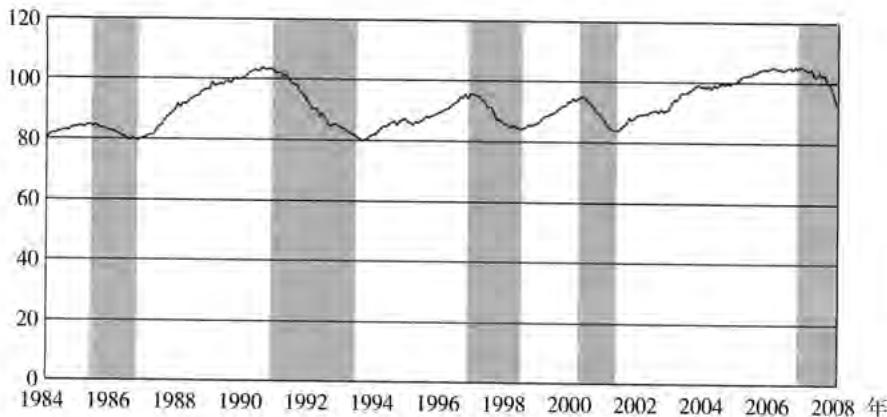  
图13-1 宏观经济一致指数

在各参数的先验分布设定了一般的自然共轭先验分布。详情参照附录1或表13-2的脚注。所有估算中，均设定burm-in5000次，将随后的10000次样本视为从后验分布中抽样的样本进行估算。

表13-1列出了各模型对数边缘似然的值。可以看到两个结构性变化点的模型对数边缘似然最高。由此可知，先验优势比为1时，结构性变化点的数量选择2。根据这一结果，可以断最近25年日本经济周期结构性变化点的数量为两个。

表13-1 对数边缘似然  

<table><tr><td rowspan=1 colspan=1>结构性变化点的数量</td><td rowspan=1 colspan=1>对数边缘似然</td><td rowspan=1 colspan=1>结构性变化点的数量</td><td rowspan=1 colspan=1>对数边缘似然</td></tr><tr><td rowspan=1 colspan=1>0</td><td rowspan=1 colspan=1>-369.899</td><td rowspan=1 colspan=1>2</td><td rowspan=1 colspan=1>-357.264</td></tr><tr><td rowspan=1 colspan=1>1</td><td rowspan=1 colspan=1>-358.088</td><td rowspan=1 colspan=1>3</td><td rowspan=1 colspan=1>-357.810</td></tr></table>

图13-2描绘的是根据两个结构性变化点MS模型估算的各结构性变化点的后验分布。细线表示第一个结构性变化点、粗线表示第二个结构性变化点的后验分布。这些是 $\tilde { D } _ { r }$ burn-in后各自的10000次样本， $D _ { \iota - 1 } { < } D _ { \iota }$ 的 $t$ 有二处，提取后描绘出了各自的直方图。第一个结构性变化点的后验分布高峰为1991年8月，第二个结构性变化点的后验分布高峰是2004年8月。

  
图13-2结构性变化点的数量为2时结构性变化点的后验概率

表13-2是两个结构性变化点MS模型参数估算结果。这里计算了用burm-in后10000个样本计算的参数的后验分布均数、标准偏差、95%置信区间（credibleinterval)①、CD统计值。均数与标准偏差是作为各参数10000个样本的均数和标准偏差计算的。95%置信区间是将样本按由大到小的顺序排列，通过提取下 $2 . 5 \%$ 和上 $2 . 5 \%$ 的点导出的。CD统计值是取 $N { = } 1 0 0 0 0$ , $n _ { A } =$ (1000，n=5000，用公式（13.14）计算的。这时，σ²和σ{用公式(13.15）计算，parcel window的带宽 $B$ 分别设定为100和 $5 0 0$ 。从表13-2中的CD值可知，吉布斯采样器收敛这一零假设所有参数都是在 $1 \%$ 的显著性水平下被接受①。比较 $m _ { 0 0 }$ 和 $m _ { 0 1 }$ 的后验均值、 $m _ { 1 0 }$ 和 $m _ { 1 1 }$ 的后验均值，可知第一个结构性变化点扩张期和衰退期的平均增长率均下降。同时，比较m和m02的后验均值、m和m₁2の的后验均值，可知在第二个结构性变化点扩张期和衰退期的平均增长率进一步下降②。

表13-22个结构性变化点MS模型估算结果  

<table><tr><td rowspan=2 colspan=1>参数</td><td rowspan=1 colspan=2>先验分布</td><td rowspan=1 colspan=4>后验分布</td></tr><tr><td rowspan=1 colspan=1>均值</td><td rowspan=1 colspan=1>标准偏差</td><td rowspan=1 colspan=1>均值</td><td rowspan=1 colspan=1>标准偏差</td><td rowspan=1 colspan=1>95%置信区间</td><td rowspan=1 colspan=1>CD</td></tr><tr><td rowspan=1 colspan=1>4</td><td rowspan=1 colspan=1>0</td><td rowspan=1 colspan=1>1</td><td rowspan=1 colspan=1>-0.293</td><td rowspan=1 colspan=1>0.062</td><td rowspan=1 colspan=1>(-0.394,-0.192)</td><td rowspan=1 colspan=1>0.912</td></tr><tr><td rowspan=1 colspan=1>mo0</td><td rowspan=1 colspan=1>-0.5</td><td rowspan=1 colspan=1>1</td><td rowspan=1 colspan=1>-0.329</td><td rowspan=1 colspan=1>0.383</td><td rowspan=1 colspan=1>(-0.835,0.131)</td><td rowspan=1 colspan=1>-0.302</td></tr><tr><td rowspan=1 colspan=1>mOL</td><td rowspan=1 colspan=1>-0.5</td><td rowspan=1 colspan=1>1</td><td rowspan=1 colspan=1>-0.782</td><td rowspan=1 colspan=1>0.326</td><td rowspan=1 colspan=1>（-1.073,-0.084）</td><td rowspan=1 colspan=1>1.467</td></tr><tr><td rowspan=1 colspan=1>m02</td><td rowspan=1 colspan=1>-0.5</td><td rowspan=1 colspan=1>1</td><td rowspan=1 colspan=1>-2.069</td><td rowspan=1 colspan=1>0.317</td><td rowspan=1 colspan=1>(-2.633,-1.581)</td><td rowspan=1 colspan=1>0.820</td></tr><tr><td rowspan=1 colspan=1>mjo</td><td rowspan=1 colspan=1>0.5</td><td rowspan=1 colspan=1>1</td><td rowspan=1 colspan=1>0.603</td><td rowspan=1 colspan=1>0.269</td><td rowspan=1 colspan=1>(0.260,1.095)</td><td rowspan=1 colspan=1>-0.459</td></tr><tr><td rowspan=1 colspan=1>m1</td><td rowspan=1 colspan=1>0.5</td><td rowspan=1 colspan=1>1</td><td rowspan=1 colspan=1>0.430</td><td rowspan=1 colspan=1>0.176</td><td rowspan=1 colspan=1>(0.154,0.582）</td><td rowspan=1 colspan=1>0.416</td></tr><tr><td rowspan=1 colspan=1>$m12</td><td rowspan=1 colspan=1>0.5</td><td rowspan=1 colspan=1>1</td><td rowspan=1 colspan=1>0.051</td><td rowspan=1 colspan=1>0.345</td><td rowspan=1 colspan=1>(-0.336,0.324)</td><td rowspan=1 colspan=1>0.532</td></tr><tr><td rowspan=1 colspan=1>$^{}$</td><td rowspan=1 colspan=1>1</td><td rowspan=1 colspan=1>1</td><td rowspan=1 colspan=1>0.521</td><td rowspan=1 colspan=1>0.050</td><td rowspan=1 colspan=1>(0.445.0.607)</td><td rowspan=1 colspan=1>-0.020</td></tr><tr><td rowspan=1 colspan=1>Po0</td><td rowspan=1 colspan=1>0.9</td><td rowspan=1 colspan=1>0.090</td><td rowspan=1 colspan=1>0.928</td><td rowspan=1 colspan=1>0.031</td><td rowspan=1 colspan=1>(0.872.0.971)</td><td rowspan=1 colspan=1>1.392</td></tr><tr><td rowspan=1 colspan=1>Pi</td><td rowspan=1 colspan=1>0.9</td><td rowspan=1 colspan=1>0.090</td><td rowspan=1 colspan=1>0.962</td><td rowspan=1 colspan=1>0.016</td><td rowspan=1 colspan=1>(0.933,0.983）</td><td rowspan=1 colspan=1>-0.955</td></tr><tr><td rowspan=1 colspan=1>911</td><td rowspan=1 colspan=1>0.989</td><td rowspan=1 colspan=1>0.033</td><td rowspan=1 colspan=1>0.980</td><td rowspan=1 colspan=1>0.032</td><td rowspan=1 colspan=1>(0.931,0.999)</td><td rowspan=1 colspan=1>2.292</td></tr><tr><td rowspan=1 colspan=1>922</td><td rowspan=1 colspan=1>0.989</td><td rowspan=1 colspan=1>0.033</td><td rowspan=1 colspan=1>0.989</td><td rowspan=1 colspan=1>0.025</td><td rowspan=1 colspan=1>(0.959,1.000)</td><td rowspan=1 colspan=1>-0.479</td></tr></table>

注：1.表中的记号为公式（13-1)、（13-2)、(13-4)、(13-8）-(13-11）中的记号。2.CD表示公式（13-14）中定义的Geweke（1992）的收敛诊断（CD）统计量。3.各参数的先验分布如下：

$\varphi \sim N ( ( 0 , ~ 0 ) ^ { * } , ~ I _ { 2 } ) I [ \{ 1 , \varphi \} < 1 ] , \ : \widehat { m } _ { i } = [ m _ { 0 i } , ~ m _ { u } ] ^ { \prime } \sim N ( ( - 0 . 5 , ~ 0 . 5 ) ^ { \prime } , ~ I _ { 2 } ) I [ m _ { 0 i } < m _ { u } ]$ (i =0,1,2)，1/σ2-G(3,2).Po-Bera(9，1)，p₁\~Beta(9.1)，9n\~Beta(9,0.1)，$q _ { 2 2 } \sim B e t a ( 9 , 0 . 1 )$

这里，表示a×a的单位矩阵，N(、…）表示正态分布，G（、…）表示伽马分布，Beta $( \cdots , \cdots )$ 表示贝塔分布。另外， $1 ( 1 4 1 < 1 ) . 1 ( m _ { 0 i } < m _ { 1 i } )$ 是指示函数，如果括号里的不等式全满足，则为1，不满足则为0。

4. $\varphi$ ( $m _ { 0 i }$ 、 ${ \boldsymbol { m } } _ { \mathrm { t } i }$ $i { = } 0 , 1 , 2 )$ 的先验分布均数和标准偏差表示截断前的正态分布均数和方差。

以上结果可以归纳如下。（1）日本过去25年经济周期结构性变化点有两个；（2）变化点最有可能分别是泡沫破灭后的1991年8月和此前的经济恢复速度减缓的2004年8月：（3）无论哪次结构性变化，扩张期和衰退期的经济平均增长率均下降。

接下来分析考虑结构性变化和不考虑结构性变化会对经济转折点估算值产生怎样的影响。图13-3描绘的是根据结构性变化点0、1、2、3各自的MS模型估算的各期均为经济衰退期的后验概率。这是使用 $S _ { \iota }$ 的后验均值S，作为（1-S）计算的。图13-3、图13-4中的阴影部分是根据内阁府经济社会综合研究所公布的经济基准日推断出的经济衰退期。表13-3所列的是根据四种MS模型估算的各个经济转折点分别偏离内阁府经济基准日几天。正的数值表示MS模型估算值晚于基准日，负的数值则表示早于基准日。经济高峰的日期为经济衰退期的概率跌破 $50 \%$ 的时间点，经济低谷的日期为经济衰退期的概率超过 $50 \%$ 的时间点。除内阁府暂定的最后的经济高峰2007年10月外，无论哪种模型的偏离均控制在 $\pm 3$ 个月内。至于2007年10月，相对于不考虑结构性变化的普通MS模型的估算值为晚3个月，而附加结构性变化点的模型则均为晚10个月。从图13-2中可知，假设结构性变化点的数量为2个，最后的经济扩大期平均变化率 $m _ { 1 2 }$ 的后验均值为0.051，基本接近0，而经济扩大期的平均变化率 $m _ { 1 2 }$ 却低至 $- 2 . 0 6 9$ 。内阁府暂定的经济高峰2007年10月后，虽然宏观经济一致指数下降，但不久后降速减缓，因此，也将这一时期视为扩张期，可以解释为比内阁府的基准日晚10个月。

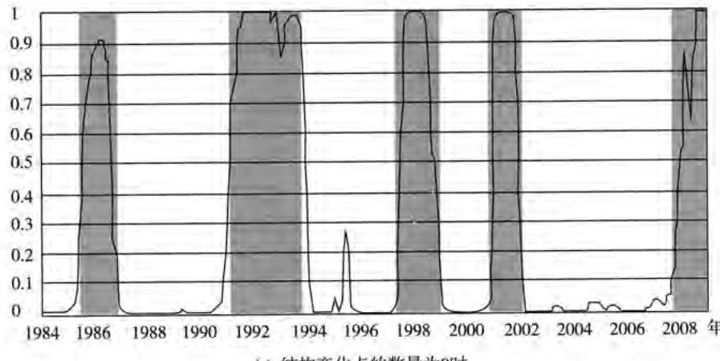  
(a)结构变化点的数量为0时

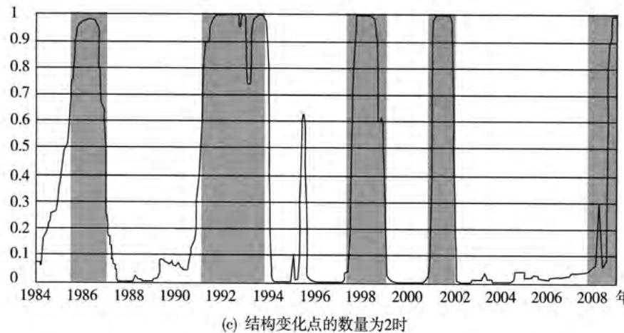  
图13-3 经济衰退期的后验概率 (之一)

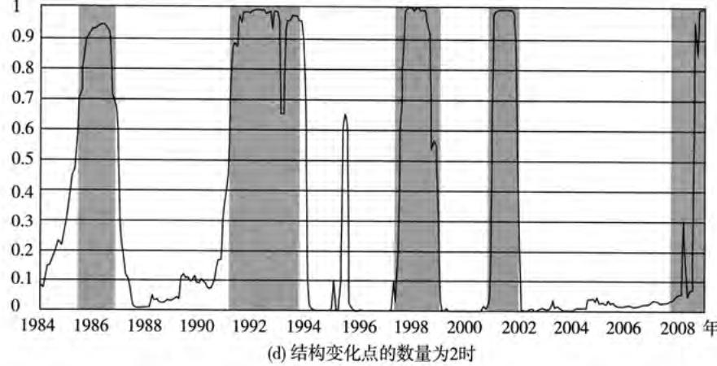  
图13-4 经济衰退期的后验概率 (之二)

表13-3经济转折点的偏离  

<table><tr><td rowspan=2 colspan=1>经济基准日</td><td rowspan=1 colspan=4>结构变化点的数量</td><td rowspan=2 colspan=1>经济基准日</td><td rowspan=1 colspan=4>结构变化点的数量</td></tr><tr><td rowspan=1 colspan=1>0</td><td rowspan=1 colspan=1>1</td><td rowspan=1 colspan=1>2</td><td rowspan=1 colspan=1>3</td><td rowspan=1 colspan=1>0</td><td rowspan=1 colspan=1>1</td><td rowspan=1 colspan=1>2</td><td rowspan=1 colspan=1>3</td></tr><tr><td rowspan=1 colspan=5>高峰</td><td rowspan=1 colspan=5>低谷</td></tr><tr><td rowspan=1 colspan=1>1985/6</td><td rowspan=1 colspan=1>+2</td><td rowspan=1 colspan=1>+2</td><td rowspan=1 colspan=1>-3</td><td rowspan=1 colspan=1>-1</td><td rowspan=1 colspan=1>1986/11</td><td rowspan=1 colspan=1>-2</td><td rowspan=1 colspan=1>+3</td><td rowspan=1 colspan=1>-2</td><td rowspan=1 colspan=1>-j</td></tr><tr><td rowspan=1 colspan=1>1991/2</td><td rowspan=1 colspan=1>+1</td><td rowspan=1 colspan=1>0</td><td rowspan=1 colspan=1>0</td><td rowspan=1 colspan=1>0</td><td rowspan=1 colspan=1>1993/10</td><td rowspan=1 colspan=1>-2</td><td rowspan=1 colspan=1>+3</td><td rowspan=1 colspan=1>-1</td><td rowspan=1 colspan=1>0</td></tr><tr><td rowspan=1 colspan=1>1997/5</td><td rowspan=1 colspan=1>+2</td><td rowspan=1 colspan=1>+2</td><td rowspan=1 colspan=1>+2</td><td rowspan=1 colspan=1>+2</td><td rowspan=1 colspan=1>1999/1</td><td rowspan=1 colspan=1>+1</td><td rowspan=1 colspan=1>+3</td><td rowspan=1 colspan=1>-1</td><td rowspan=1 colspan=1>-1</td></tr><tr><td rowspan=1 colspan=1>2000/10</td><td rowspan=1 colspan=1>+2</td><td rowspan=1 colspan=1>+2</td><td rowspan=1 colspan=1>+2</td><td rowspan=1 colspan=1>+2</td><td rowspan=1 colspan=1>2002/1</td><td rowspan=1 colspan=1>+1</td><td rowspan=1 colspan=1>+3</td><td rowspan=1 colspan=1>-1</td><td rowspan=1 colspan=1>-1</td></tr><tr><td rowspan=1 colspan=1>2007/10</td><td rowspan=1 colspan=1>+3</td><td rowspan=1 colspan=1>+10</td><td rowspan=1 colspan=1>+10</td><td rowspan=1 colspan=1>+10</td><td rowspan=1 colspan=1></td><td rowspan=1 colspan=1></td><td rowspan=1 colspan=1></td><td rowspan=1 colspan=1></td><td rowspan=1 colspan=1></td></tr></table>

注：1.正数表示相对于基准日，MS模型估算值滞后。负值表示提前。2.经济高峰的日期为经济衰退期的概率跌破50%的时间点，经济低谷的日期为经济衰退期的概率超过 $5 0 \%$ 的时间点。

# 5结束语

本文通过使用MCMC法对附加了多个结构性变化点的MS模型进行贝叶斯分析，根据1984年到2008年15年间的CI数据，对日本的经济周期转折点和结构性变化点进行了同时估算。另外，通过从不同结构性变化点的模型中根据后验优势比选择模型，弄清了结构性变化点的数量和时期。结果表明，日本经济周期的结构性变化点有2个，分别是泡沫破灭后的1991年8月和此前的经济恢复速度减缓的2004年8月，无论哪次结构性变化，均使经济平均增长率下降。

# 补遗

# 1先验分布与附带全部条件的后验分布

各参数的先验分布与第3.1项的1-7步的附带全部条件的后验分布如下所示。附带全部条件的后验分布的具体导出方法参照Kim和Nelson（1999b）的Chapter9和Watanabe（2003）的Appendix1。虽然严格来说似然为 $\pi$ (y₁、…、y1θ)，但为了简单起见，这里用π（y_、、yx1y₁，θ）近似值，计算以下附带全部条件的后验分布与边缘似然。

第一步：对平均增长率向量

$$
\hat { M } _ { i } = [ m _ { 0 i } , \ m _ { i i } ] ^ { \prime } \ ( i = 1 , \ \cdots , \ n )
$$

的先验分布假设以下相互独的双变量截断正态分布。

$$
\tilde { M } _ { i } \ \sim N ( M _ { i 0 } , \ \sum _ { M _ { i 0 } } ) I ( m _ { 0 i } \ < \ m _ { i i } )
$$

这里， $\prime$ ( $m _ { 0 i } < m _ { 1 i } )$ 是在满足括号内的不等式时为1，不满足时为0的指示函数（indicator function），因此，该先验分布是只留下 $m _ { 0 i } < m _ { 1 i }$ 范围的均数$M _ { i 0 }$ 、方差协方差矩阵 $\sum _ { M i 0 }$ 这两个变量并截断的截断正态分布。

在该先验分布下， $\hat { M } \mathbin { \lrcorner } ( i = 1 \mathbin { \lrcorner } \cdots , n )$ 附带全部条件的后验分布也是如下相互独立的双变量截断正态分布。

$$
\tilde { M } _ { i } \mid \tilde { S } _ { \bar { r } } , \tilde { D } _ { \bar { r } } , \tilde { Y } _ { \bar { r } } \sim N ( M _ { i 1 } , \sum _ { M _ { i } } ) I ( m _ { 0 i } < m _ { i i } )
$$

这里，如果定义

$$
\begin{array} { r } { \boldsymbol { Y } ^ { * } = \left[ \begin{array} { c c c c } { \big ( \boldsymbol { y } _ { \tau _ { i } } - \varphi \boldsymbol { y } _ { \tau _ { i } - 1 } \big ) / \boldsymbol { \sigma } , \cdots , } & { \big ( \boldsymbol { y } _ { \tau _ { i + 1 } - 1 } - \varphi \boldsymbol { y } _ { \tau _ { i + 1 } - 2 } \big ) / \boldsymbol { \sigma } \big ] } \\ { \big \{ ( 1 - S _ { \tau _ { i } } \big ) - \varphi ( 1 - S _ { \tau _ { i } - 1 } ) \big \} / \boldsymbol { \sigma } , } & { ( S _ { \tau _ { i } } - \varphi S _ { \tau _ { i } - 1 } ) / \boldsymbol { \sigma } } \\ { \vdots } & { \vdots } & { \vdots } \\ { \big \{ ( 1 - S _ { \tau _ { i + 1 } - 1 } ) - \varphi ( 1 - S _ { \tau _ { i + 1 } - 2 } ) \big \} / \boldsymbol { \sigma } , } & { ( S _ { \tau _ { i + 1 } - 1 } - \varphi S _ { \tau _ { i + 1 } - 2 } ) / \boldsymbol { \sigma } \big ] } \end{array} \right] } \end{array}
$$

则：

$$
\sum _ { M _ { i 1 } } \ = \Big ( \sum _ { M _ { i 0 } } ^ { - 1 } + X ^ { + \prime } X ^ { * } \Big ) ^ { - 1 } , M _ { i 1 } = \sum _ { M _ { i 1 } } \Big ( \sum _ { M _ { i 0 } } ^ { - 1 } M _ { i 0 } + X ^ { * } Y ^ { * } \Big )
$$

从该分布中抽样，首先从均数 $M _ { i 1 \setminus }$ 方差 $\sum _ { M i l }$ 双变量正态分布中抽样，如果抽样的值不满足 $m _ { 0 i } { < } m _ { 1 i }$ ，舍弃后重新抽样即可。

第二步：对 $\phi$ 的先验分布假设以下截断正态分布：

$$
\phi \sim N ( \phi _ { 0 } , \ { \sigma _ { \phi _ { 0 } } } ^ { 2 } ) I ( 1 \ \phi | < 1 )
$$

这里， $I$ ( $\mid \phi \mid < 1$ ）是如果I $\phi \mid < 1$ 时则为1，否则为0的指示函数。即该先验分布是只留下满足稳定性的范围的均数 $\phi _ { \mathrm { 0 } }$ 、方差 ${ \sigma _ { \phi 0 } } ^ { 2 }$ 的正态分布并截断的截断正态分布。

在该正态分布下， $\phi$ 的附带全部条件的后验分布依然是如下截断正态分布。

$$
\phi \mid \bar { \theta } _ { - \phi } , \ \tilde { S } _ { \bar { \cal T } } , \ \tilde { D } _ { \bar { \cal T } } , \ \tilde { Y } _ { \bar { \cal T } } \sim N ( \phi _ { 1 } ; \ \sigma _ { \phi _ { 1 } } ^ { 2 } ) I ( \mid \phi \mid < 1 )
$$

这里，如果定义：

$$
\begin{array} { l } { { Y ^ { \bullet } = [ \begin{array} { l l l } { { ( y _ { 2 } - \mu _ { 2 } ) / \sigma , } } & { { \cdots , } } & { { ( y _ { T } - \mu _ { T } ) / \sigma } } \end{array} ] } } \\ { { X ^ { \bullet } = [ \begin{array} { l } { { ( y _ { 1 } - \mu _ { 1 } ) } } \end{array} ] / \sigma , } } & { { \cdots , } } \end{array} ( y _ { T - 1 } - \mu _ { T - 1 } ) / \sigma ]
$$

则

$$
\sigma _ { \varphi _ { 1 } } ^ { 2 } = ( \sigma _ { \varphi _ { 0 } } ^ { - 2 } + X ^ { * \prime } X ^ { * } ) ^ { - 1 } , \phi _ { 1 } = \sigma _ { \varphi _ { 1 } } ^ { 2 } ( \sigma _ { \varphi _ { 0 } } ^ { - 2 } \varphi _ { 0 } + X ^ { * \prime } Y ^ { * } )
$$

从该分布中抽样，先从均数 $\varphi _ { 1 } ,$ 方差 ${ \sigma _ { \varphi 1 } } ^ { 2 }$ 的正态分布中抽样，如果抽样的值不满足稳定性，则舍弃后重新抽样即可。

第三步：对 $\sigma ^ { 2 }$ 的先验分布假设以下逆伽玛分布。

$$
\sigma ^ { 2 } \sim I G \biggl ( \frac { \upsilon _ { 0 } } { 2 } , \frac { \delta _ { 0 } } { 2 } \biggr )
$$

在该先验分布下，附带全部条件的后验分布也是如下逆伽玛分布：

$$
\sigma ^ { 2 } \mid \bar { { \boldsymbol { \theta } } } _ { - \sigma ^ { 2 } } , S _ { \tau } , D _ { \tau } , \bar { Y } _ { \tau } \sim I G \biggl ( \frac { v _ { 1 } } { 2 } , \frac { \delta _ { 1 } } { 2 } \biggr )
$$

这里，

$$
v _ { 1 } = v _ { 0 } + T , \delta _ { 1 } = \delta _ { 0 } + \sum _ { t = 1 } ^ { T } \left[ y _ { t } - \mu _ { t } - \phi _ { i } ( y _ { t - 1 } - \mu _ { t - 1 } ) \right] ^ { 2 }
$$

从该分布中抽样是从伽玛分布抽样，取其倒数即可①。

第四步：为 $\tilde { s }$ i $_ { T }$ 抽样，使用Kim和Nelson（1998、1999b）提出的Multi-move sampler②。当前，假设 $\hat { S } ^ { \prime + 1 } = ( S _ { \iota + 1 } , \cdots , S _ { \tau } ) ^ { \prime }$ ，则 $\tilde { s } _ { r }$ 附带全部条件的后验分布可用以下公式（13.20）来表达。

$$
\pi ( \tilde { S } _ { T } { ^ \mathrm { ~ l ~ } } \tilde { D } _ { T } , \ \tilde { Y } _ { T } , \ \bar { \theta } ) = \pi ( S _ { T } { ^ \mathrm { ~ l ~ } } \tilde { D } _ { T } , \ \tilde { Y } _ { T } , \ \bar { \theta } ) \cdots \pi ( S _ { i } { ^ \mathrm { ~ l ~ } } \bar { S } ^ { t + 1 } , \ \tilde { D } _ { T } , \ \tilde { Y } _ { T } , \ \bar { \theta } ) \cdots \pi ( S _ { T } { ^ \mathrm { ~ l ~ } } \bar { S } ^ { t + 1 } , \ \tilde { D } _ { T } , \ \tilde { Y } _ { T } , \ \bar { \theta } ) \cdots \pi ( S _ { T } { ^ \mathrm { ~ l ~ } } \bar { S } ^ { t + 1 } , \ \bar { Y } _ { T } , \ \tilde { Y } _ { T } , \ \bar { \theta } )
$$

$$
\pi ( S _ { 1 } ^ { } | \ \tilde { S } ^ { 2 } , \ \hat { D } _ { T } ^ { } , \ \tilde { Y } _ { T } ^ { } , \ \theta )
$$

从左边的分布为S抽样，先从右边第1项 $\pi ~ ( S _ { r } | ~ \hat { D } _ { r } , \tilde { Y } _ { r } , \tilde { \theta }$ ）为 $S _ { \tau }$ 抽样，然后以抽样的 $S _ { \tau }$ 值为条件，就像从右边第2项 $\pi$ $( S _ { \tau - 1 } \mid S ^ { r } , \tilde { D } _ { \tau } , \tilde { Y } _ { \tau } , \tilde { \theta }$ ）中为 $S _ { r - 1 }$ 抽样那样，按逆时针方向依次从右边各项中抽样，一直到 $S _ { i }$ (id:即可。

右边各项可表达如下③。

$$
= \frac { \pi ( S _ { t } = l \mid \bar { D } _ { T } , \tilde { Y } _ { \tau } , \tilde { \theta } ) \pi ( S _ { t + 1 } \mid S _ { t } = l , \tilde { p } ) } { \displaystyle \sum _ { j = 0 } ^ { 1 } \pi ( S _ { t } = j \mid \tilde { D } _ { T } , \tilde { Y } _ { t } , \tilde { \theta } ) \pi ( S _ { t + 1 } \mid S _ { t } = j , \tilde { p } ) } , l = 0 , 1 
$$

这里，

$$
\tilde { Y } _ { t } = [ y _ { 1 } , y _ { 2 } , \cdots y _ { t } ] ^ { \prime }
$$

该公式的右边第2项是转移概率公式(13.4)。右边第 $^ 1$ 项可从稳态概率

$$
\pi ( S _ { 0 } = 1 \mid \ \bar { D } _ { T } , \ \tilde { Y } _ { 0 } , \ \tilde { \theta } ) = \pi ( S _ { 0 } = 1 \mid \ \tilde { p } ) = \frac { 1 - p _ { 0 0 } } { 2 - p _ { 0 0 } - p _ { 1 1 } }
$$

$$
\pi ( S _ { 0 } = 0 \mid \hat { D } _ { r } , \ \hat { Y } _ { 0 } , \ \hat { \theta } ) = \pi ( S _ { 0 } = 0 \mid \hat { p } ) = \frac { 1 - p _ { 1 1 } } { 2 - p _ { 0 0 } - p _ { 1 1 } }
$$

开始，一直到 $\scriptstyle t = T$ ，按顺时针方向执行Hamilton（1998）提出的滤波器来导出。

从（13.20）为 $\tilde { s }$ 抽样，执行以下2步即可。

(1)首先，从 $t = 1$ 开始一直到 $t = T$ ，按照顺时针方向执行Hamilton（1998）提出的滤波器，计算 $\pi ~ ( S _ { \iota } \mid \hat { D } _ { r } , \tilde { Y } _ { r } , \tilde { \theta }$ )、 $( \imath = 1 , \ \cdots , \ \mathrm { T } )$

（2）接着使用（1）中最后计算的 $\pi$ $( S _ { r } \vert ~ \bar { D } _ { r } , ~ \hat { Y } _ { r } , ~ \hat { \theta }$ ）为 $S _ { T }$ 抽样。具体是用概率 $\pi$ i $( S _ { r } = 1 \mid D _ { r } , \tilde { Y } _ { r } , \tilde { \theta } )$ 为 $S _ { T } = 1$ 抽样，用剩下的概率为 $\scriptstyle S _ { T } = 0$ 抽样。再使用抽样的 $S _ { r }$ 和预测更新步骤计算的 $\pi ( S _ { T - 1 } | \tilde { Y } _ { T } , \tilde { D } _ { T } , \tilde { \theta } )$ ，从 $\pi$ $( S _ { \tau - 1 } \mid S ^ { T } , \tilde { D } _ { \tau } , \tilde { Y } _ { \tau } , \tilde { \theta }$ ）中为 $S _ { \tau - 1 }$ 抽样。具体来说，根据（A5)，

$$
\pi \big ( S _ { r - 1 } = 1 \ | \ S ^ { r } , \ \tilde { D } _ { r } , \ \tilde { Y } _ { r } , \ \tilde { \theta } \big ) = \varfrac { \pi \big ( S _ { r - 1 } = 1 \ | \ \tilde { D } _ { r } , \ \tilde { Y } _ { r - 1 } , \ \tilde { \theta } \big ) \pi \big ( S _ { r } \ | \ S _ { r - 1 } = 1 _ { + } \ \tilde { p } \ \big ) } { \displaystyle \sum _ { j = 0 } ^ { 1 } \pi \big ( S _ { r - 1 } = j \ | \ \tilde { D } _ { r } , \ \tilde { Y } _ { i } , \ \tilde { \theta } \big ) \pi \big ( S _ { r } \ | \ S _ { r - 1 } = j , \ \tilde { p } \ \big ) }
$$

因此，用该概率为 $S _ { T - 1 } = 1$ 抽样，用剩余概率为 $S _ { r - 1 } = 0$ 抽样。按逆时针方向反复抽样直到 $\scriptstyle t = 1$ 即可。

第五步： $\tilde { D }$ $\boldsymbol { r }$ 的抽样步骤和第四步一样，按逆时针向从

$$
\pi ( \tilde { D } _ { T } \mid \tilde { S } _ { T } , \tilde { Y } _ { T } , \tilde { \theta } ) = \pi ( D _ { T } \mid \tilde { S } _ { T } , \tilde { Y } _ { T } , \tilde { \theta } ) \cdots \pi ( D _ { t } \mid \tilde { D } ^ { \iota + 1 } \tilde { S } _ { T } , \tilde { Y } _ { T } , \tilde { \theta } ) \cdots \pi ( D _ { T } \mid \tilde { D } ^ { \iota + 1 } \tilde { S } _ { T } , \tilde { Y } _ { T } , \tilde { \theta } ) \cdots \pi ( D _ { T } \mid \tilde { D } ^ { \iota + 1 } \tilde { S } _ { T } , \tilde { Y } _ { T } , \tilde { \theta } ) .
$$

$$
\pi ( D _ { 1 } \mid \tilde { D } ^ { 2 } , \tilde { S } _ { r } , \tilde { Y } _ { r } , \tilde { \theta } )
$$

等式的右边各项中抽样即可。但因为 $D _ { \mathrm { i } }$ 和 $D _ { \tau }$ 分别固定为0和 $n$ ，所以,抽样的是 $( D _ { 2 3 } \cdots , D _ { r - 1 } )$ 。可按以下两个步骤进行。

(1）先从 $D _ { 1 } = 0$ 开始，按照 $t = 2 , \cdots , T - 1$ 的顺序执行Hamilton（1998）的滤波器，计算 $\pi$ $( D , 1 { \bar { Y } } , \tilde { S } _ { r } , \tilde { \theta }$ ) $( 1 = 2 , \cdots , T - 1 )$

(2）接下来使用（1）中最后计算的 $\pi$ (i $( D _ { \pi _ { 1 } } \cap Y _ { \pi _ { 1 } } ) \setminus \tilde { S } _ { \pi _ { 1 } } \setminus \tilde { \theta }$ )，计算以下概率。

$$
\pi ( D _ { \tau - 1 } = n \mid D ^ { T } = n , \hat { S } _ { \tau } , \hat { Y } _ { \tau } , \hat { \theta } )
$$

$$
\begin{array} { l } { \displaystyle = \frac { \pi ( D _ { T - 1 } = n \mid \tilde { Y } _ { T - 1 } , ~ \tilde { S } _ { T } , ~ \tilde { \theta } ) \pi ( D _ { T } = n \mid D _ { T - 1 } = n , ~ \tilde { q } ) } { \displaystyle \sum _ { j = n - 1 } ^ { n } \pi ( D _ { T - 1 } = j \mid \tilde { Y } _ { T - 1 } , ~ \tilde { S } _ { T } , ~ \tilde { \theta } ) \pi ( D _ { T } = n \mid D _ { T - 1 } = j , ~ \tilde { q } ) } } \end{array}
$$

这里，右边的第2项是转移概率公式(13.11)。用该概率为 $D _ { T - 2 } = D _ { T - 2 }$ 抽样，用剩下的概率为 $D _ { \bar { r } - 1 } = n - 1$ 抽样。再用抽样的 $D _ { T - 1 }$ 和上述步骤（1）中计算的 $\pi$ i $( D _ { T - 2 } | \hat { \textbf { \textit { Y } } } _ { T - 2 } , \hat { \textbf { \textit { S } } } _ { T } , \hat { \textbf { \textit { \theta } } }$ ）计算以下概率。

$$
\pi ( D _ { \tau - 2 } = D _ { \tau - 1 } \mid \hat { D } ^ { \tau - 1 } = \tilde { S } _ { \tau } , \ \tilde { Y } _ { \tau } , \ \tilde { \theta } )
$$

$$
\begin{array} { c } { { \displaystyle = \frac { \pi ( D _ { T - 2 } = D _ { T - 1 } \mid { \tilde { \cal Y } } _ { T - 2 } , { \tilde { \cal S } } _ { T } , \theta ) \pi ( D _ { T - 1 } \mid D _ { T - 2 } , { \tilde { q } } ) } { D _ { T + 1 } } } } \\ { { { \displaystyle \sum _ { j = D _ { T - 1 } = 1 } ^ { D _ { T - 1 } } \pi ( D _ { T - 2 } = j \mid { \tilde { \cal Y } } _ { T - 2 } , { \tilde { \cal S } } _ { T } , \theta ) \pi ( D _ { T - 1 } \mid D _ { T - 2 } = j , { \tilde { q } } ) } } } \end{array}
$$

用该概率为 $D _ { r - 2 } = D _ { r - 2 }$ 抽样，用剩余的概率为 $D _ { r - 2 } { = } D _ { r - 1 } { - } 1$ 抽样。按逆时针方向反复抽样，直到 $t = 2$

第六步：对转移概率 $\tilde { p } ~ = ~ ( p _ { \infty } , ~ p _ { \scriptscriptstyle { 1 1 } } )$ 的先验分布假设以下相互独立的贝塔分布。

$$
p _ { _ { 0 0 } } \sim B e t a ( u _ { _ { 0 0 } } , \ u _ { _ { 0 1 } } ) , \ p _ { _ { 1 1 } } \sim B e t a ( u _ { _ { 1 1 } } , \ u _ { _ { 1 0 } } )
$$

使用贝塔分布， $P _ { 0 0 }$ , $p _ { 1 1 }$ 的值必定在0到1之间。

在该先验分布下，附带全部条件的后验分布依然是如下相互独立的贝塔分布。

$$
\begin{array} { r c l } { { } } & { { p _ { \mathrm { 0 0 } } | \ \tilde { S } _ { \tau } \sim B e t a ( u _ { \mathrm { 0 0 } } + n _ { \mathrm { 0 0 } } , \ u _ { \mathrm { 0 1 } } + n _ { \mathrm { 0 1 } } ) } } \\ { { } } & { { } } & { { } } \\ { { } } & { { p _ { \mathrm { 0 1 } } | \ \tilde { S } _ { \tau } \sim B e t a ( u _ { \mathrm { 1 1 } } + n _ { \mathrm { 1 i } } , \ u _ { \mathrm { 1 0 } } + n _ { \mathrm { n 1 0 } } ) } } \end{array}
$$

这里， $n _ { \infty }$ 是条件 $\bar { s } _ { r }$ 中 $S _ { \iota } { = } 0$ 且 $S _ { \iota + 1 } = 0$ 的 $t$ 的个数, ${ n } _ { 0 1 }$ 是 $\scriptstyle S _ { \prime } = 0$ 且 $S _ { \mathrm { \Lambda ^ { + } i } } = 1$ 的 $t$ 的个数， $n _ { 1 1 } , ~ n _ { 1 0 }$ 亦同。这些可通过在第四步抽样的 $\hat { s }$ 获得。

第七步：对 $\tilde { { \boldsymbol { q } } } = ( q _ { 0 0 } , \cdots , q _ { n - 1 , n - 1 } )$ '的先验分布也假设如下相互独立的贝塔分布。

$$
q _ { i } \sim B e t a ( r _ { i i } , r _ { i j } ) , i = 0 , \cdots , n - 1
$$

这样，附带全部条件的后验分布也依然是如下相互独立的贝塔分布。

$$
q _ { i i } \ : \vert \ : \hat { D } _ { T } \sim B e t a ( r _ { i i } + m _ { i i } , \ : r _ { i j } + 1 ) , \ : i = 0 , \ : \cdots , \ : n - 1
$$

这里， $m _ { i i }$ 是条件 $\bar { D }$ 中 $D = i$ 且 $D _ { \iota + 1 } = i$ 的 $t$ 的个数，他们可通过第五步抽样的 $\tilde { D }$ $_ { T }$ 获得。

# 2 边缘似然的计算方法

边缘似然 $\pi$ ( $\bar { \boldsymbol { Y } } _ { r } \mid \boldsymbol { M } _ { k }$ 是贝叶斯定理公式（13.12）右边的分母，因此可用以下公式表达。

$$
\pi ( { \tilde { Y } } _ { \gamma } \mid M _ { k } ) = { \frac { \pi ( { \tilde { Y } } _ { r } \mid { \tilde { \theta } } , M _ { k } ) \pi ( { \tilde { \theta } } \mid M _ { k } ) } { \pi ( { \tilde { \theta } } ) } }
$$

该公式右边的似然函数 $\pi$ ( $\tilde { \boldsymbol { Y } } _ { \boldsymbol { r } }$ 1θ、 ${ M } _ { k }$ )与先验密度 $\pi$ ( ${ \dot { \theta } } \mid M _ { h } \}$ 的计算相对简单。下面，以 $\theta ^ { * }$ 为参数 $\bar { \theta }$ 的后验均值，首先, $\stackrel { \sim } { \theta } = \stackrel { \sim } { \theta } ^ { \ast }$ 的似然函数可通过如下方法计算。

$$
\begin{array} { l } { { \pi ( \tilde { Y } _ { \tau } \mid \tilde { \theta } ^ { * } ) } } \\ { { = \displaystyle \prod _ { i = 2 } ^ { r } \Big [ \sum _ { V _ { i } = 1 } ^ { 2 ( n + 1 ) } \cdots \sum _ { V _ { i - 1 } = 1 } ^ { 2 ( n + 1 ) } \pi ( V _ { i } , \ V _ { i - 1 } \mid \ \tilde { Y } _ { i - 1 } , \ \tilde { \theta } ^ { * } ) \pi ( y _ { i } \mid \ \tilde { Y } _ { i - 1 } , \ V _ { i } , \ V _ { i - 1 } , \ \tilde { \theta } ^ { * } ) \Big ] } } \end{array}
$$

这里， $V _ { \iota }$ 的定义如下：

$$
\begin{array} { r } { V _ { \varepsilon } = \left\{ \begin{array} { l l } { 1 , S _ { \varepsilon } = 0 \mathrm { ~ E } D _ { \varepsilon } = 0 } \\ { 2 , S _ { \varepsilon } = 0 \mathrm { ~ E } D _ { \varepsilon } = 1 } \\ { \vdots } \\ { 0 } \\ { 0 + 1 , S _ { \varepsilon } = 0 \mathrm { ~ E } D _ { \varepsilon } = \pi } \end{array} \right. } \\ { V _ { \varepsilon } = \left\{ \begin{array} { l l } { 1 , S _ { \varepsilon } = 0 \mathrm { ~ E } D _ { \varepsilon } = 0 } \\ { 0 + 2 , S _ { \varepsilon } = 1 \mathrm { ~ E } D _ { \varepsilon } = 0 } \\ { n + 3 , S _ { \varepsilon } = 1 \mathrm { ~ E } V _ { \varepsilon } = 1 } \\ { \vdots } \\ { 2 ( n + 1 ) , S _ { \varepsilon } = 1 \mathrm { ~ E } D _ { \varepsilon } = 2 } \end{array} \right. } \end{array}
$$

接着，按照以下方法计算 $\widehat { \theta } = \widehat { \theta } ^ { * }$ 中的先验密度 $\pi ( { \tilde { \theta } } ^ { * } )$ 。这里，因为是假设先验密度中的 $\tilde { m }$ $\phi , \bar { v } , \bar { p } , \bar { q }$ 相互独立，因此，如下所示，联合先验密度$\pi$ ( ${ \bf \widehat { \theta } } ^ { \bullet }$ ）为各参数先验密度的简单乘积。

$$
\pi ( \mathrm {  ~ \tilde { \theta } ~ } ^ { * } ) = \pi ( \tilde { m } ^ { * } ) \pi ( \phi ^ { * } ) \pi ( \mathrm {  ~ \tilde { \theta } ~ } ^ { * } ) \pi ( \mathrm {  ~ \tilde { p } ~ } ^ { * } , \mathrm {  ~ \tilde { q } ~ } ^ { * } )
$$

而且，如附录1中所记，本文的分析中，因为是假设右边各项参数的先验分布是截断正态分布、逆伽玛分布、贝塔分布等广为人知的分布，因此，公式（13.24）右边的各后验密度很容易计算。但是，截断正态分布的密度需要设置归一化常数。这里， $\phi$ 的归一化常数从分析的角度、 $\tilde { m }$ 的归一化常数根据截断前的先验分布进行1000次模拟，求取（1000/满足指示函数括号内约束的次数)。

最后，计算 $\tilde { \boldsymbol { \theta } } = \tilde { \boldsymbol { \theta } } ^ { * }$ 中的后验密度 $\pi$ ( $\bar { \boldsymbol { \theta } } ^ { * } \mid \tilde { Y } _ { \tau } , M _ { k } )$ ，采用Chib（1995）提出的基于吉布斯采样器的方法。该方法将后验密度分成以下四个函数，求取每个函数的值，以它们的积为后验密度。

$$
\pi ( \tilde { \theta } ^ { * } \mid \tilde { Y } _ { r } ) \pi ( \tilde { m } ^ { * } \mid \tilde { Y } _ { r } ) \pi ( \tilde { \phi } ^ { * } \mid \tilde { m } ^ { * } , \tilde { Y } _ { r } ) \pi ( \tilde { \boldsymbol { v } } ^ { * } \mid \hat { m } ^ { * } , \tilde { \phi } ^ { * } , \tilde { Y } _ { \tau } )
$$

$$
\pi ( \bar { p } ^ { \star } , \ \tilde { q } ^ { \star } \mid \bar { m } ^ { \star } , \ \tilde { \phi } ^ { \star } , \ \bar { v } ^ { \star } , \ \tilde { Y } _ { \tau } )
$$

右边第一项 $\pi$ （ $\hat { m } ^ { \mathrm { ~ \bf ~ 1 ~ } } \tilde { Y } _ { \tau } )$ 与第3.1节及附录1中所说明的参数估算一样，使用吉布斯采样器抽样，其他项 $\pi$ (φ 1 m, Yr)、 $\pi$ $, ~ \phi ^ { * } ~ , ~ \tilde { Y } _ { \tau } ) ~ , ~ \pi ~ ( \tilde { p } ^ { * } ~ , \tilde { q } ^ { * } \mid ~ \tilde { m } ^ { * } ~ , ~ \phi ^ { * } ~ , ~ \sigma ^ { 2 * } ~ , ~ \tilde { Y } _ { \tau } )$ 的计算不是为条件中所含的参数抽样，而是固定后验均值，用吉布斯采样器抽样。将这种用吉布斯采样器抽样的值代入条件中，公式（13.25）右边的各项可通过以下方法计算。

$$
\begin{array} { r l } & { \pi \langle n ^ { * } \mid \hat { Y } _ { r } \rangle = \frac { 1 } { G } \frac { \hat { C } } { G _ { r , \pi } ^ { 2 } } \pi \langle \hat { m } ^ { * } \mid \varphi ^ { * } , \sigma ^ { * } , \hat { p } ^ { * } , \hat { q } ^ { * } , \hat { S } _ { r } ^ { \theta } , \hat { D } _ { r } ^ { * } , \hat { Y } _ { r } \rangle } \\ & { \pi \langle \phi ^ { * } \mid m ^ { * } , \hat { Y } _ { r } \rangle = \frac { 1 } { G _ { r , \pi } ^ { 2 } } \pi ( \phi ^ { * } \mid m ^ { * } \sigma ^ { * } ) \cdot \frac { 1 } { \hat { P } _ { r } ^ { 2 } } \pi \langle \hat { a } , \hat { p } ^ { * } , \hat { \tilde { X } } _ { r } ^ { \theta } , \hat { D } _ { r } ^ { * } , \hat { Y } _ { r } \rangle } \\ & { \pi ( \sigma ^ { * } \mid \hat { S } ^ { * } , \hat { Y } _ { r } ^ { * } ) = \frac { 1 } { G _ { r , \pi } ^ { 2 } } \pi ( \sigma ^ { * } ) \cdot \frac { 1 } { \hat { P } _ { r } ^ { 2 } } \pi \langle \hat { a } ^ { * } , \hat { p } ^ { * } , \hat { \tilde { P } } ^ { \theta } ^ { * } , \hat { \tilde { X } } _ { r } ^ { \theta } , \hat { \tilde { Y } } _ { r } \rangle } \\ & { \pi ( \hat { p } ^ { * } , \hat { \textbf { \eta } } ^ { * } , \hat { \tilde { X } } ^ { * } ) = \frac { 1 } { G } \frac { \hat { C } } { \hat { P } _ { r , \pi } ^ { 2 } } \pi \langle \hat { a } ^ { * } , \hat { \textbf { \ i } } ^ { * } , \hat { \tilde { Y } } _ { r } \rangle = } \\ &  \frac { 1 } { G _ { r , \pi } ^ { 2 } } \pi \langle \hat { p } ^ { * } , \hat { \textbf { \ i } }  \end{array}
$$

参考文献

Chib, S. (1995), "Marginal Likelihood From the Gibbs Output," Journal of the

American Statistical Asociation, 90(432), pp. 1313–1321.   
Chib,S.(1998),“Estimation and Comparison of Multiple Change-Point Models," Journal of Econometrics, 86(2), pp.221–241.   
Fukuda, S. and Onodera, T.(2001),"A New Composite Index of Coincident Economic Indicators in Japan: How Can We Improve Forecast Performances?" International Journal of Forecasting, 17(3), pp. 483–498.   
Geweke, J. (1992), "Evaluating the accuracy of sampling-based approaches to the calculation of posterior moments," in J. M. Bemardo, J.O. Berger, A. P. Dawid and A.F. M. Smith(eds.), Bayesian Statistics 4, Oxford University Press, Oxford.   
Hamilton, J. D.(1989),“A New Approach to the Economic Analysis of Nonstationary Time Series and Business Cyele, Econometrica, 57(2), pp. 357–384.   
Kim, C.-J. and Nelson, C.R.(1998),"Business Cyele Turing Points, aNew Coincident Index, and Tests of Duration Dependence Based on a Dynamic Factor Model with Regime Switching," Review of Economics and Statistics, 80 (2), pp.188-201.   
Kim, C. -J. and Nelson, C. R. (1999a), "Has the U. S. Economy Become More Stable? A Bayesian Approach Based on a Markov-Swithing Model of the Business Cycle," Review of Economics and Statistics, 81 (4), pp.608–616.   
Kim, C.-J.and Nelson, C.R.(199b), State-Space Models with Regime Swithing: Classical and Gibbs — Sampling Approaches with Applications, Cambridge, Massachusetts: MIT Press.   
Ripley, B.D. (1987), Stochastic Simulation, New York: Wiley.   
Shephard, N.and Pit, M.K. (1997), “Likelihood Analysis of Non-Gaussian Measurement Time Series," Biometrika, 84(3), pp.653–667.   
Watanabe,T. (2003),“Measuring Business Cyele Turming Points in Japan with a Dynamic Markov Switching Factor Model," Monetary and Economic Studies, 21 (1), pp.35–68.

# 后记

2019年底，中国人民银行上海总部国际部获悉有关《泡沫/通缩时期的日本经济与经济政策》丛书相关信息后，于2020年首先开展了第三、第四册中文版译印工作。2021年，两册书的中文版在学术界取得良好反响。我们随即再次组织专业人士以忠实于原书稿为原则进行翻译，力求准确反映对日本泡沫/通缩时期的经济与经济政策的阐述与分析。

本银多位专家对丛书中文译稿进了友情审校：

第三册：西口周作（第三章）、藤原裕一（第五章）。

第四册：西口周作（第一、第六、第十一章）、上田达史（第二章）、露口洋介（第三章）、福本智之（第四章）、东善明（第五章）、后藤好美（第七章）、新川陆一（第八章）、冈寄久实子（第九章）、夏目晃裕（第十章）、和田健治（第十二章）。

第五册：藤原裕一（第一、第九章）、小池一德（第二章）、东善明（第三章）、夏目晃裕（第四章）、坂下荣人（第五章）、后藤好美（第六章）、上田达史（第七章）、细川美穗子（第八章）、福本智之（第十章）、和田健治（第十一章）、露口洋介（第十二章）、西口周作（第十三章）、冈寄久实子(第十四章)。

第六册：藤原裕一（第十、第十二、第十三和第十四章）。

其他部分则由中国人民银行上海总部国际部审校。在此，对日本内阁府经济社会综合研究所提供版权及日本银友情审校的慷慨付出表示衷心感谢。特别感谢日本银行国际局前局长福本智之对相关工作的协调和帮助。

此外，翻译出版离不开社会各界的热情关怀和鼎力支持，尤为感谢孙冶方经济科学基金会理事长李剑阁教授对项目的大力支持，同时也感谢国家创新与发展战略研究会常务理事葛俊先生的周全安排，顺利推动了基金会与上海总部的友好合作。此项工作得到中国人民银行上海总部郑五福副主任大力支持，国际部原主任冯润祥、原副主任潘琼琦和副主任张丽红持续推进丛书中文版出版工作。国际部储幼阳、吴色那、张勤、刘孜群、蔡筠、周萍、郑朝亮、陈苏燕、金怡、钟文、周璐珍、吴玉南、章曦、胡芸嘉、周奕烜、邵勉也、刘薇、何亦周、刘雪菲、李旷然承担了相关工作。丛书经中国金融出版社精心编排，得以问世。本丛书中文版虽经数次校订，仍不免有疏漏之处，尚祈读者与专家指正。